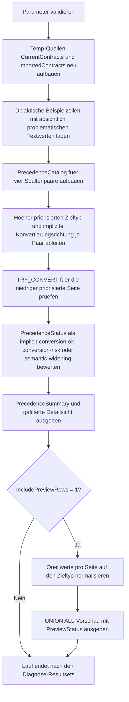

# SetOperatorTypePrecedence.sql

Dieses Diagnose-Skript zeigt an kleinen Demo-Quellen, wie Typprioritaeten in SQL Server vor `UNION`, `EXCEPT` oder `INTERSECT` wirken. Die Erstversion macht sichtbar, welcher Datentyp gewinnt, welche Seite implizit konvertiert wird und an welchen Stellen daraus echte Fehler- oder Bedeutungsrisiken entstehen.

## Uebersicht

<!-- SQLDOC:SUMMARY_TABLE:BEGIN -->
| Feld | Wert |
|---|---|
| Script | [SetOperatorTypePrecedence.sql](SetOperatorTypePrecedence.sql) |
| Version | `1.0` |
| Typ | `diagnostic-query` |
| Kapitel | `09_Set_Operations` |
| Sicherheit | `read-only-tempdb` |
| Zweck | Zeigt Typprioritaet, implizite Konvertierung und Risiken vor Set-Operationen. |
<!-- SQLDOC:SUMMARY_TABLE:END -->

## Einordnung

Bei Set-Operationen reicht es nicht, nur dieselbe Spaltenanzahl und Reihenfolge zu liefern. SQL Server bestimmt zusaetzlich pro Spaltenpaar einen gemeinsamen Zieltyp. Der niedriger priorisierte Typ wird implizit in den hoeher priorisierten Typ konvertiert. Genau diese Entscheidung kann unauffaellig sein oder sofort zu Fehlern, Datenverlust oder semantischer Erweiterung fuehren.

## Annahmen

- Die Erstversion arbeitet mit zwei lokalen Temp-Quellen fuer aktuelle Vertragsdaten und importierte Textdaten.
- Die Typprioritaet wird fuer vier bewusst ausgewaehlte Spaltenpaare didaktisch dokumentiert: `INT` gegen `NVARCHAR`, `DECIMAL` gegen `INT`, `DATE` gegen `DATETIME2` und `BIT` gegen `NVARCHAR`.
- Die Importwerte `10X` und `yes` sind absichtlich problematisch, damit implizite Konvertierungsrisiken vor der Mengenoperation sichtbar werden.
- Die Vorschau nutzt `UNION ALL`, um normalisierte Werte beider Quellen gemeinsam anzuzeigen, ohne zusaetzlich Distinct-Logik zu vermischen.

## Anwendungsfall

Das Muster eignet sich fuer Importpruefungen, Staging-Analysen und Unterrichtseinheiten zu Set-Operatoren. Vor allem bei CSV- oder API-Importen ist es hilfreich, kritische Spalten zuerst auf Typprioritaet und implizite Konvertierbarkeit zu pruefen, bevor zwei Resultsets tatsaechlich als Menge zusammengefuehrt werden.

## Parameter

<!-- SQLDOC:PARAMETERS_TABLE:BEGIN -->
| Parameter | SQL-Typ | Pflicht | Beschreibung |
|---|---|---|---|
| `@OnlyShowRiskRows` | `BIT` | Nein | Zeigt bei `1` nur Spalten mit Konvertierungs- oder Bedeutungsrisiko. |
| `@IncludePreviewRows` | `BIT` | Nein | Gibt bei `1` eine `UNION ALL`-Vorschau der normalisierten Werte beider Quellen aus. |
<!-- SQLDOC:PARAMETERS_TABLE:END -->

## Abhaengigkeiten

<!-- SQLDOC:DEPENDENCIES_LIST:BEGIN -->
- `tempdb`
- `TRY_CONVERT`
- `UNION ALL`
- `CASE`
- `VALUES`
- `DROP TABLE IF EXISTS`
<!-- SQLDOC:DEPENDENCIES_LIST:END -->

## Hinweise

- `PrecedenceSummary` verdichtet, ob die Beispielspalten fuer eine spaetere Set-Operation bereits belastbar vorbereitet sind.
- `PrecedenceDetails` dokumentiert pro logischer Spalte, welche Seite implizit konvertiert wuerde und ob der Beispielwert dabei ueberhaupt konvertierbar ist.
- `semantic-widening` markiert den Fall `DATE` gegen `DATETIME2`, bei dem technisch keine harte Fehlersituation entsteht, aber ein zusaetzlicher Zeitanteil in die Zielprojektion hineinwirkt.
- Die Vorschau zeigt problematische Werte explizit als `<conversion-failed>`, damit Bereinigungsschritte vor einer echten `UNION`, `INTERSECT`- oder `EXCEPT`-Abfrage greifbar bleiben.

## Versionshistorie

<!-- SQLDOC:VERSION_HISTORY_TABLE:BEGIN -->
| Version | Datum | User | Beschreibung |
|---|---|---|---|
| `1.0` | `2026-04-18` | `ER` | Erstversion fuer Typprioritaet und implizite Konvertierung bei Set-Operationen |
<!-- SQLDOC:VERSION_HISTORY_TABLE:END -->

## Ablauf

<!-- SQLDOC:MERMAID:BEGIN -->

<!-- SQLDOC:MERMAID:END -->

## SQL-Code

<!-- SQLDOC:SQL_CODE:BEGIN -->
```sql
/*
BEGIN:SQL-HEADER v1
---
sql_header: v1
script_name: "SetOperatorTypePrecedence.sql"
script_version: "1.0"
script_type: "diagnostic-query"
chapter: "09_Set_Operations"

purpose: >
  Zeigt, wie SQL Server bei Set-Operationen den hoeher priorisierten Datentyp
  bestimmt, welche Seite implizit konvertiert wird und an welchen Stellen dabei
  Konvertierungs- oder Bedeutungsrisiken entstehen.

parameters:
  - name: "@OnlyShowRiskRows"
    sql_type: "BIT"
    direction: "IN"
    required: false
    description: "1 = zeigt im Detailresultset nur Spalten mit Konvertierungs- oder Bedeutungsrisiko"
  - name: "@IncludePreviewRows"
    sql_type: "BIT"
    direction: "IN"
    required: false
    description: "1 = gibt zusaetzlich eine UNION ALL-Vorschau mit den prioritaetsbedingt normalisierten Werten aus"

result_sets:
  - name: "PrecedenceSummary"
    description: "Verdichtet sichere, riskante und semantisch auffaellige Typ-Paare vor der Set-Operation"
  - name: "PrecedenceDetails"
    description: "Zeigt pro logischer Spalte Quelltypen, hoeher priorisierten Zieltyp und die betroffene Konvertierungsseite"
  - name: "NormalizedUnionPreview"
    description: "Optionale Vorschau der nach Zieltyp normalisierten Werte fuer beide Quellen per UNION ALL"

dependencies:
  - "tempdb"
  - "TRY_CONVERT"
  - "UNION ALL"
  - "CASE"
  - "VALUES"
  - "DROP TABLE IF EXISTS"

safety:
  level: "read-only-tempdb"
  writes_data: false

documentation:
  markdown_file: "T-SQL/09_Set_Operations/SQLScripts/SetOperatorTypePrecedence.md"
  sync_blocks:
    - "SUMMARY_TABLE"
    - "PARAMETERS_TABLE"
    - "DEPENDENCIES_LIST"
    - "VERSION_HISTORY_TABLE"
    - "SQL_CODE"
  mermaid:
    mode: "ai-agent-from-sql"
    source: "script-body"

main_responsible:
  name: "Erhard Rainer"
  initials: "ER"

version_history:
  - version: "1.0"
    date: "2026-04-18"
    user: "ER"
    description: "Erstversion fuer Typprioritaet und implizite Konvertierung bei Set-Operationen"

notes:
  - "Die Erstversion nutzt zwei lokale Temp-Quellen mit bewusst unterschiedlich typisierten Spalten"
  - "Einige Beispielwerte sind absichtlich problematisch, damit Konvertierungsfehler vor UNION, EXCEPT oder INTERSECT sichtbar werden"
---
END:SQL-HEADER v1
*/

SET NOCOUNT ON;

DECLARE @OnlyShowRiskRows BIT = 0;
DECLARE @IncludePreviewRows BIT = 1;

IF @OnlyShowRiskRows NOT IN (0, 1)
BEGIN
    THROW 50000, '@OnlyShowRiskRows muss 0 oder 1 sein.', 1;
END;

IF @IncludePreviewRows NOT IN (0, 1)
BEGIN
    THROW 50001, '@IncludePreviewRows muss 0 oder 1 sein.', 1;
END;

DROP TABLE IF EXISTS #CurrentContracts;
DROP TABLE IF EXISTS #ImportedContracts;

CREATE TABLE #CurrentContracts
(
    ContractID        INT             NOT NULL,
    GrossAmount       DECIMAL(10,2)   NOT NULL,
    ValidFrom         DATE            NOT NULL,
    EscalationFlag    BIT             NOT NULL
);

CREATE TABLE #ImportedContracts
(
    ContractIDText        NVARCHAR(20)    NOT NULL,
    GrossAmountInt        INT             NOT NULL,
    ValidFromDateTime     DATETIME2(0)    NOT NULL,
    EscalationFlagText    NVARCHAR(5)     NOT NULL
);

INSERT INTO #CurrentContracts
(
    ContractID,
    GrossAmount,
    ValidFrom,
    EscalationFlag
)
VALUES
    (101, 1250.50, DATEFROMPARTS(2026, 4, 18), 1),
    (102, 980.00, DATEFROMPARTS(2026, 4, 20), 0),
    (103, 1499.95, DATEFROMPARTS(2026, 4, 22), 1);

INSERT INTO #ImportedContracts
(
    ContractIDText,
    GrossAmountInt,
    ValidFromDateTime,
    EscalationFlagText
)
VALUES
    (N'101', 1250, CAST('2026-04-18T08:30:00' AS DATETIME2(0)), N'1'),
    (N'102', 980, CAST('2026-04-20T00:00:00' AS DATETIME2(0)), N'0'),
    (N'10X', 1500, CAST('2026-04-22T14:45:00' AS DATETIME2(0)), N'yes');

;WITH PrecedenceCatalog AS
(
    SELECT
        pair.LogicalColumn,
        pair.LeftSourceType,
        pair.RightSourceType,
        pair.LeftPrecedenceRank,
        pair.RightPrecedenceRank,
        pair.LeftSampleValue,
        pair.RightSampleValue,
        CASE
            WHEN pair.LeftPrecedenceRank <= pair.RightPrecedenceRank
                THEN pair.LeftSourceType
            ELSE pair.RightSourceType
        END AS HigherPrecedenceType,
        CASE
            WHEN pair.LeftPrecedenceRank < pair.RightPrecedenceRank
                THEN N'right-to-left'
            WHEN pair.LeftPrecedenceRank > pair.RightPrecedenceRank
                THEN N'left-to-right'
            ELSE N'none'
        END AS ImplicitConversionDirection
    FROM
    (
        VALUES
            (N'ContractID',     N'INT',           N'NVARCHAR(20)',  17, 26, N'101',        N'10X'),
            (N'GrossAmount',    N'DECIMAL(10,2)', N'INT',           13, 17, N'1250.50',    N'1500'),
            (N'ValidFrom',      N'DATE',          N'DATETIME2(0)',   9,  7, N'2026-04-18', N'2026-04-22T14:45:00'),
            (N'EscalationFlag', N'BIT',           N'NVARCHAR(5)',   20, 26, N'1',          N'yes')
    ) AS pair
    (
        LogicalColumn,
        LeftSourceType,
        RightSourceType,
        LeftPrecedenceRank,
        RightPrecedenceRank,
        LeftSampleValue,
        RightSampleValue
    )
),
PrecedenceDetails AS
(
    SELECT
        catalog.LogicalColumn,
        catalog.LeftSourceType,
        catalog.RightSourceType,
        catalog.HigherPrecedenceType,
        catalog.ImplicitConversionDirection,
        catalog.LeftSampleValue,
        catalog.RightSampleValue,
        CASE
            WHEN catalog.ImplicitConversionDirection = N'left-to-right'
                THEN catalog.LeftSampleValue
            WHEN catalog.ImplicitConversionDirection = N'right-to-left'
                THEN catalog.RightSampleValue
            ELSE NULL
        END AS LowerPrecedenceSampleValue,
        CASE
            WHEN catalog.ImplicitConversionDirection = N'left-to-right'
                THEN catalog.LeftSourceType
            WHEN catalog.ImplicitConversionDirection = N'right-to-left'
                THEN catalog.RightSourceType
            ELSE NULL
        END AS LowerPrecedenceType,
        CASE
            WHEN catalog.HigherPrecedenceType = N'INT'
                THEN IIF(TRY_CONVERT(INT, CASE
                            WHEN catalog.ImplicitConversionDirection = N'right-to-left' THEN catalog.RightSampleValue
                            WHEN catalog.ImplicitConversionDirection = N'left-to-right' THEN catalog.LeftSampleValue
                            ELSE catalog.LeftSampleValue
                        END) IS NOT NULL, CAST(1 AS BIT), CAST(0 AS BIT))
            WHEN catalog.HigherPrecedenceType = N'DECIMAL(10,2)'
                THEN IIF(TRY_CONVERT(DECIMAL(10,2), CASE
                            WHEN catalog.ImplicitConversionDirection = N'right-to-left' THEN catalog.RightSampleValue
                            WHEN catalog.ImplicitConversionDirection = N'left-to-right' THEN catalog.LeftSampleValue
                            ELSE catalog.LeftSampleValue
                        END) IS NOT NULL, CAST(1 AS BIT), CAST(0 AS BIT))
            WHEN catalog.HigherPrecedenceType = N'DATETIME2(0)'
                THEN IIF(TRY_CONVERT(DATETIME2(0), CASE
                            WHEN catalog.ImplicitConversionDirection = N'right-to-left' THEN catalog.RightSampleValue
                            WHEN catalog.ImplicitConversionDirection = N'left-to-right' THEN catalog.LeftSampleValue
                            ELSE catalog.LeftSampleValue
                        END) IS NOT NULL, CAST(1 AS BIT), CAST(0 AS BIT))
            ELSE CAST(1 AS BIT)
        END AS LowerPrecedenceValueConvertible,
        CASE catalog.LogicalColumn
            WHEN N'ContractID' THEN N'NVARCHAR wird durch die hoeher priorisierte INT-Seite implizit nach INT gezogen.'
            WHEN N'GrossAmount' THEN N'INT wird vor der Set-Operation nach DECIMAL erweitert.'
            WHEN N'ValidFrom' THEN N'DATE wird wegen der hoeheren Prioritaet von DATETIME2 mit Zeitanteil erweitert.'
            WHEN N'EscalationFlag' THEN N'NVARCHAR wird gegen BIT geprueft; nicht numerische Texte werden riskant.'
        END AS PrecedenceExplanation,
        CASE catalog.LogicalColumn
            WHEN N'ContractID' THEN N'CAST(cur.ContractID AS INT)'
            WHEN N'GrossAmount' THEN N'CAST(cur.GrossAmount AS DECIMAL(10,2))'
            WHEN N'ValidFrom' THEN N'CAST(cur.ValidFrom AS DATETIME2(0))'
            WHEN N'EscalationFlag' THEN N'CAST(cur.EscalationFlag AS BIT)'
        END AS RecommendedLeftExpression,
        CASE catalog.LogicalColumn
            WHEN N'ContractID' THEN N'TRY_CONVERT(INT, imp.ContractIDText)'
            WHEN N'GrossAmount' THEN N'CAST(imp.GrossAmountInt AS DECIMAL(10,2))'
            WHEN N'ValidFrom' THEN N'CAST(imp.ValidFromDateTime AS DATETIME2(0))'
            WHEN N'EscalationFlag' THEN N'TRY_CONVERT(BIT, imp.EscalationFlagText)'
        END AS RecommendedRightExpression
    FROM PrecedenceCatalog AS catalog
),
PrecedenceAssessment AS
(
    SELECT
        detail.LogicalColumn,
        detail.LeftSourceType,
        detail.RightSourceType,
        detail.HigherPrecedenceType,
        detail.ImplicitConversionDirection,
        detail.LeftSampleValue,
        detail.RightSampleValue,
        detail.LowerPrecedenceSampleValue,
        detail.LowerPrecedenceType,
        detail.LowerPrecedenceValueConvertible,
        CASE
            WHEN detail.LowerPrecedenceValueConvertible = 0 THEN N'conversion-risk'
            WHEN detail.LogicalColumn = N'ValidFrom' THEN N'semantic-widening'
            ELSE N'implicit-conversion-ok'
        END AS PrecedenceStatus,
        detail.PrecedenceExplanation,
        detail.RecommendedLeftExpression,
        detail.RecommendedRightExpression
    FROM PrecedenceDetails AS detail
),
NormalizedCurrent AS
(
    SELECT N'current' AS SourceSet, N'ContractID' AS LogicalColumn, CAST(cur.ContractID AS NVARCHAR(50)) AS SourceValue,
           CAST(cur.ContractID AS NVARCHAR(50)) AS NormalizedValue, N'INT' AS OutputType
    FROM #CurrentContracts AS cur
    UNION ALL
    SELECT N'current', N'GrossAmount', CAST(cur.GrossAmount AS NVARCHAR(50)),
           CAST(CAST(cur.GrossAmount AS DECIMAL(10,2)) AS NVARCHAR(50)), N'DECIMAL(10,2)'
    FROM #CurrentContracts AS cur
    UNION ALL
    SELECT N'current', N'ValidFrom', CONVERT(NVARCHAR(30), cur.ValidFrom, 23),
           CONVERT(NVARCHAR(30), CAST(cur.ValidFrom AS DATETIME2(0)), 126), N'DATETIME2(0)'
    FROM #CurrentContracts AS cur
    UNION ALL
    SELECT N'current', N'EscalationFlag', CAST(cur.EscalationFlag AS NVARCHAR(50)),
           CAST(cur.EscalationFlag AS NVARCHAR(50)), N'BIT'
    FROM #CurrentContracts AS cur
),
NormalizedImport AS
(
    SELECT N'import' AS SourceSet, N'ContractID' AS LogicalColumn, imp.ContractIDText AS SourceValue,
           CAST(TRY_CONVERT(INT, imp.ContractIDText) AS NVARCHAR(50)) AS NormalizedValue, N'INT' AS OutputType
    FROM #ImportedContracts AS imp
    UNION ALL
    SELECT N'import', N'GrossAmount', CAST(imp.GrossAmountInt AS NVARCHAR(50)),
           CAST(CAST(imp.GrossAmountInt AS DECIMAL(10,2)) AS NVARCHAR(50)), N'DECIMAL(10,2)'
    FROM #ImportedContracts AS imp
    UNION ALL
    SELECT N'import', N'ValidFrom', CONVERT(NVARCHAR(30), imp.ValidFromDateTime, 126),
           CONVERT(NVARCHAR(30), CAST(imp.ValidFromDateTime AS DATETIME2(0)), 126), N'DATETIME2(0)'
    FROM #ImportedContracts AS imp
    UNION ALL
    SELECT N'import', N'EscalationFlag', imp.EscalationFlagText,
           CAST(TRY_CONVERT(BIT, imp.EscalationFlagText) AS NVARCHAR(50)), N'BIT'
    FROM #ImportedContracts AS imp
)
SELECT
    COUNT(*) AS ComparedColumns,
    SUM(CASE WHEN assessment.PrecedenceStatus = N'implicit-conversion-ok' THEN 1 ELSE 0 END) AS ImplicitlySafeColumns,
    SUM(CASE WHEN assessment.PrecedenceStatus = N'conversion-risk' THEN 1 ELSE 0 END) AS ConversionRiskColumns,
    SUM(CASE WHEN assessment.PrecedenceStatus = N'semantic-widening' THEN 1 ELSE 0 END) AS SemanticWideningColumns,
    CASE
        WHEN SUM(CASE WHEN assessment.PrecedenceStatus = N'conversion-risk' THEN 1 ELSE 0 END) > 0 THEN N'not-ready-for-set-operator'
        WHEN SUM(CASE WHEN assessment.PrecedenceStatus = N'semantic-widening' THEN 1 ELSE 0 END) > 0 THEN N'ready-but-review-widening'
        ELSE N'ready'
    END AS SetOperatorReadiness,
    CASE
        WHEN SUM(CASE WHEN assessment.PrecedenceStatus = N'conversion-risk' THEN 1 ELSE 0 END) > 0
            THEN N'Vor UNION, EXCEPT oder INTERSECT sollten riskante Textwerte explizit bereinigt oder via TRY_CONVERT abgefangen werden.'
        WHEN SUM(CASE WHEN assessment.PrecedenceStatus = N'semantic-widening' THEN 1 ELSE 0 END) > 0
            THEN N'Die Set-Operation ist technisch moeglich, erweitert aber einzelne Werte auf einen breiteren Typ und sollte fachlich geprueft werden.'
        ELSE N'Die Beispielspalten koennen nach expliziter Typdokumentation sicher in eine Set-Operation einfliessen.'
    END AS RecommendedNextStep
FROM PrecedenceAssessment AS assessment;

SELECT
    assessment.LogicalColumn,
    assessment.LeftSourceType,
    assessment.RightSourceType,
    assessment.HigherPrecedenceType,
    assessment.ImplicitConversionDirection,
    assessment.LeftSampleValue,
    assessment.RightSampleValue,
    assessment.LowerPrecedenceType,
    assessment.LowerPrecedenceSampleValue,
    assessment.LowerPrecedenceValueConvertible,
    assessment.PrecedenceStatus,
    assessment.PrecedenceExplanation,
    assessment.RecommendedLeftExpression,
    assessment.RecommendedRightExpression
FROM PrecedenceAssessment AS assessment
WHERE @OnlyShowRiskRows = 0
   OR assessment.PrecedenceStatus IN (N'conversion-risk', N'semantic-widening')
ORDER BY
    assessment.LogicalColumn;

IF @IncludePreviewRows = 1
BEGIN
    SELECT
        preview.SourceSet,
        preview.LogicalColumn,
        preview.OutputType,
        preview.SourceValue,
        COALESCE(preview.NormalizedValue, N'<conversion-failed>') AS NormalizedValue,
        CASE
            WHEN preview.NormalizedValue IS NULL THEN N'requires-cleanup-before-set-operator'
            ELSE N'usable-after-precedence-normalization'
        END AS PreviewStatus
    FROM
    (
        SELECT current_rows.SourceSet, current_rows.LogicalColumn, current_rows.OutputType, current_rows.SourceValue, current_rows.NormalizedValue
        FROM NormalizedCurrent AS current_rows
        UNION ALL
        SELECT import_rows.SourceSet, import_rows.LogicalColumn, import_rows.OutputType, import_rows.SourceValue, import_rows.NormalizedValue
        FROM NormalizedImport AS import_rows
    ) AS preview
    ORDER BY
        preview.LogicalColumn,
        preview.SourceSet,
        preview.SourceValue;
END;
```
<!-- SQLDOC:SQL_CODE:END -->
