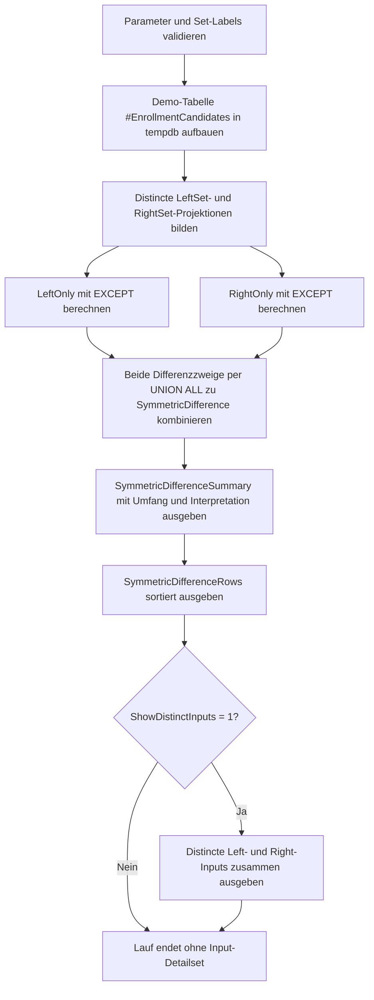

# SymmetricDifferencePattern.sql

Dieses Diagnose-Skript zeigt die symmetrische Differenz zweier Mengen, indem es zwei `EXCEPT`-Zweige kombiniert. Die Erstversion bleibt bewusst in `tempdb`, damit das Muster fuer Set-Vergleiche, Delta-Pruefungen und fachliche Gegensaetze ohne produktive Abhaengigkeiten nachvollziehbar bleibt.

## Uebersicht

<!-- SQLDOC:SUMMARY_TABLE:BEGIN -->
| Feld | Wert |
|---|---|
| Script | [SymmetricDifferencePattern.sql](SymmetricDifferencePattern.sql) |
| Version | `1.0` |
| Typ | `diagnostic-query` |
| Kapitel | `09_Set_Operations` |
| Sicherheit | `read-only-tempdb` |
| Zweck | Zeigt die symmetrische Differenz zweier Mengen ueber zwei kombinierte EXCEPT-Abfragen. |
<!-- SQLDOC:SUMMARY_TABLE:END -->

## Einordnung

Die symmetrische Differenz ist dann hilfreich, wenn nicht nur geprueft werden soll, ob zwei Mengen gleich sind, sondern welche Zeilen ausschliesslich links oder rechts vorkommen. Das Skript macht diese Gegenlaeufigkeit explizit sichtbar und trennt die beiden Abweichungsrichtungen in einem gemeinsamen Resultset.

## Annahmen

- Die Erstversion verwendet eine lokale Temp-Tabelle mit Demo-Kursbelegungen statt produktiver Quellen.
- Verglichen wird die distincte Projektion aus `StudentID`, `CourseCode` und `CampusCode`.
- Doppelte Rohzeilen sind absichtlich enthalten, damit sichtbar wird, dass `EXCEPT` auf Mengensemantik und nicht auf Rohhaeufigkeiten arbeitet.
- Ein geaenderter `CampusCode` derselben fachlichen Belegung erzeugt zwei symmetrische Differenzzeilen, weil die Projektion den Standort explizit einschliesst.

## Anwendungsfall

Das Muster eignet sich fuer Soll-Ist-Abgleiche, Migrationsvergleiche, Kurslisten-Pruefungen oder jede andere Situation, in der exklusive Zeilen auf beiden Seiten gesucht werden. In realen Szenarien kann die Demo-Tabelle durch zwei fachliche Teilabfragen ersetzt werden, solange beide dieselbe Spaltenstruktur liefern.

## Parameter

<!-- SQLDOC:PARAMETERS_TABLE:BEGIN -->
| Parameter | SQL-Typ | Pflicht | Beschreibung |
|---|---|---|---|
| `@LeftSetLabel` | `NVARCHAR(30)` | Nein | Bezeichner der linken Demo-Menge. |
| `@RightSetLabel` | `NVARCHAR(30)` | Nein | Bezeichner der rechten Demo-Menge. |
| `@ShowDistinctInputs` | `BIT` | Nein | Gibt bei `1` die distincten Eingabemengen zusaetzlich aus. |
<!-- SQLDOC:PARAMETERS_TABLE:END -->

## Abhaengigkeiten

<!-- SQLDOC:DEPENDENCIES_LIST:BEGIN -->
- `tempdb`
- `EXCEPT`
- `UNION ALL`
- `SELECT DISTINCT`
- `COUNT(*)`
- `DROP TABLE IF EXISTS`
<!-- SQLDOC:DEPENDENCIES_LIST:END -->

## Hinweise

- `SymmetricDifferenceSummary` verdichtet Groesse und Richtung der Abweichung zwischen beiden Mengen.
- `SymmetricDifferenceRows` listet nur Zeilen, die ausschliesslich links oder rechts vorkommen.
- `DistinctInputSets` erleichtert optional die Rueckverfolgung, welche distincten Eingabemengen vor dem Vergleich vorlagen.

## Versionshistorie

<!-- SQLDOC:VERSION_HISTORY_TABLE:BEGIN -->
| Version | Datum | User | Beschreibung |
|---|---|---|---|
| `1.0` | `2026-04-18` | `ER` | Erstversion fuer symmetrische Differenzen mit zwei EXCEPT-Zweigen |
<!-- SQLDOC:VERSION_HISTORY_TABLE:END -->

## Ablauf

<!-- SQLDOC:MERMAID:BEGIN -->

<!-- SQLDOC:MERMAID:END -->

## SQL-Code

<!-- SQLDOC:SQL_CODE:BEGIN -->
```sql
/*
BEGIN:SQL-HEADER v1
---
sql_header: v1
script_name: "SymmetricDifferencePattern.sql"
script_version: "1.0"
script_type: "diagnostic-query"
chapter: "09_Set_Operations"

purpose: >
  Zeigt die symmetrische Differenz zweier Mengen ueber zwei kombinierte
  EXCEPT-Abfragen und markiert, auf welcher Seite jede abweichende Zeile
  vorkommt.

parameters:
  - name: "@LeftSetLabel"
    sql_type: "NVARCHAR(30)"
    direction: "IN"
    required: false
    description: "Bezeichner der linken Demo-Menge"
  - name: "@RightSetLabel"
    sql_type: "NVARCHAR(30)"
    direction: "IN"
    required: false
    description: "Bezeichner der rechten Demo-Menge"
  - name: "@ShowDistinctInputs"
    sql_type: "BIT"
    direction: "IN"
    required: false
    description: "1 = gibt die distincten Ausgangsmengen zusaetzlich aus"

result_sets:
  - name: "SymmetricDifferenceSummary"
    description: "Verdichtet Groesse, Ueberschneidung und Abweichungsumfang beider Mengen"
  - name: "SymmetricDifferenceRows"
    description: "Listet Zeilen auf, die nur links oder nur rechts vorkommen"
  - name: "DistinctInputSets"
    description: "Optionale distincte Eingabemengen fuer die didaktische Rueckverfolgung"

dependencies:
  - "tempdb"
  - "EXCEPT"
  - "UNION ALL"
  - "SELECT DISTINCT"
  - "COUNT(*)"
  - "DROP TABLE IF EXISTS"

safety:
  level: "read-only-tempdb"
  writes_data: false

documentation:
  markdown_file: "T-SQL/09_Set_Operations/SQLScripts/SymmetricDifferencePattern.md"
  sync_blocks:
    - "SUMMARY_TABLE"
    - "PARAMETERS_TABLE"
    - "DEPENDENCIES_LIST"
    - "VERSION_HISTORY_TABLE"
    - "SQL_CODE"
  mermaid:
    mode: "ai-agent-from-sql"
    source: "script-body"

main_responsible:
  name: "Erhard Rainer"
  initials: "ER"

version_history:
  - version: "1.0"
    date: "2026-04-18"
    user: "ER"
    description: "Erstversion fuer symmetrische Differenzen mit zwei EXCEPT-Zweigen"

notes:
  - "Die Erstversion arbeitet mit Demo-Mitgliedschaften in einer lokalen Temp-Tabelle"
  - "Doppelte Rohzeilen werden vor dem Mengenvergleich bewusst auf distincte Projektionen reduziert"
---
END:SQL-HEADER v1
*/

SET NOCOUNT ON;

DECLARE @LeftSetLabel NVARCHAR(30) = N'current';
DECLARE @RightSetLabel NVARCHAR(30) = N'planned';
DECLARE @ShowDistinctInputs BIT = 1;

IF NULLIF(LTRIM(RTRIM(@LeftSetLabel)), N'') IS NULL
BEGIN
    THROW 50000, '@LeftSetLabel darf nicht leer sein.', 1;
END;

IF NULLIF(LTRIM(RTRIM(@RightSetLabel)), N'') IS NULL
BEGIN
    THROW 50001, '@RightSetLabel darf nicht leer sein.', 1;
END;

IF @LeftSetLabel = @RightSetLabel
BEGIN
    THROW 50002, 'Die Set-Labels muessen unterschiedlich sein.', 1;
END;

IF @ShowDistinctInputs NOT IN (0, 1)
BEGIN
    THROW 50003, '@ShowDistinctInputs muss 0 oder 1 sein.', 1;
END;

DROP TABLE IF EXISTS #EnrollmentCandidates;

CREATE TABLE #EnrollmentCandidates
(
    SetLabel        NVARCHAR(30)    NOT NULL,
    StudentID       INT             NOT NULL,
    CourseCode      NVARCHAR(20)    NOT NULL,
    CampusCode      NVARCHAR(10)    NOT NULL
);

INSERT INTO #EnrollmentCandidates
(
    SetLabel,
    StudentID,
    CourseCode,
    CampusCode
)
VALUES
    (@LeftSetLabel,  101, N'SQL-101',  N'BER'),
    (@LeftSetLabel,  102, N'SQL-101',  N'BER'),
    (@LeftSetLabel,  102, N'SQL-101',  N'BER'),
    (@LeftSetLabel,  103, N'BI-220',   N'HAM'),
    (@LeftSetLabel,  104, N'DWH-300',  N'MUC'),
    (@LeftSetLabel,  105, N'REP-150',  N'FRA'),
    (@RightSetLabel, 101, N'SQL-101',  N'BER'),
    (@RightSetLabel, 103, N'BI-220',   N'HAM'),
    (@RightSetLabel, 104, N'DWH-300',  N'CGN'),
    (@RightSetLabel, 104, N'DWH-300',  N'CGN'),
    (@RightSetLabel, 106, N'FAB-210',  N'MUC'),
    (@RightSetLabel, 107, N'REP-150',  N'FRA');

;WITH LeftSet AS
(
    SELECT DISTINCT
        source.StudentID,
        source.CourseCode,
        source.CampusCode
    FROM #EnrollmentCandidates AS source
    WHERE source.SetLabel = @LeftSetLabel
),
RightSet AS
(
    SELECT DISTINCT
        source.StudentID,
        source.CourseCode,
        source.CampusCode
    FROM #EnrollmentCandidates AS source
    WHERE source.SetLabel = @RightSetLabel
),
LeftOnly AS
(
    SELECT
        left_rows.StudentID,
        left_rows.CourseCode,
        left_rows.CampusCode
    FROM LeftSet AS left_rows

    EXCEPT

    SELECT
        right_rows.StudentID,
        right_rows.CourseCode,
        right_rows.CampusCode
    FROM RightSet AS right_rows
),
RightOnly AS
(
    SELECT
        right_rows.StudentID,
        right_rows.CourseCode,
        right_rows.CampusCode
    FROM RightSet AS right_rows

    EXCEPT

    SELECT
        left_rows.StudentID,
        left_rows.CourseCode,
        left_rows.CampusCode
    FROM LeftSet AS left_rows
),
SymmetricDifference AS
(
    SELECT
        N'only-in-left' AS membership_side,
        left_only.StudentID,
        left_only.CourseCode,
        left_only.CampusCode
    FROM LeftOnly AS left_only

    UNION ALL

    SELECT
        N'only-in-right' AS membership_side,
        right_only.StudentID,
        right_only.CourseCode,
        right_only.CampusCode
    FROM RightOnly AS right_only
)
SELECT
    @LeftSetLabel AS left_set_label,
    @RightSetLabel AS right_set_label,
    (SELECT COUNT(*) FROM LeftSet) AS left_distinct_rows,
    (SELECT COUNT(*) FROM RightSet) AS right_distinct_rows,
    (SELECT COUNT(*) FROM LeftOnly) AS rows_only_in_left,
    (SELECT COUNT(*) FROM RightOnly) AS rows_only_in_right,
    (SELECT COUNT(*) FROM SymmetricDifference) AS symmetric_difference_rows,
    CASE
        WHEN EXISTS (SELECT 1 FROM LeftOnly) AND EXISTS (SELECT 1 FROM RightOnly)
            THEN N'bidirectional-difference'
        WHEN EXISTS (SELECT 1 FROM LeftOnly)
            THEN N'left-has-extra-rows'
        WHEN EXISTS (SELECT 1 FROM RightOnly)
            THEN N'right-has-extra-rows'
        ELSE N'sets-match'
    END AS comparison_outcome,
    CASE
        WHEN EXISTS (SELECT 1 FROM LeftOnly) AND EXISTS (SELECT 1 FROM RightOnly)
            THEN N'Beide Mengen enthalten exklusive Zeilen und muessen gemeinsam geprueft werden.'
        WHEN EXISTS (SELECT 1 FROM LeftOnly)
            THEN N'Nur die linke Menge enthaelt Zusatzzeilen.'
        WHEN EXISTS (SELECT 1 FROM RightOnly)
            THEN N'Nur die rechte Menge enthaelt Zusatzzeilen.'
        ELSE N'Beide Mengen sind fuer die gewaehlte Projektion identisch.'
    END AS interpretation
;

SELECT
    diff.membership_side,
    diff.StudentID,
    diff.CourseCode,
    diff.CampusCode
FROM SymmetricDifference AS diff
ORDER BY
    CASE diff.membership_side
        WHEN N'only-in-left' THEN 1
        ELSE 2
    END,
    diff.StudentID,
    diff.CourseCode,
    diff.CampusCode;

IF @ShowDistinctInputs = 1
BEGIN
    SELECT
        N'left' AS input_side,
        left_rows.StudentID,
        left_rows.CourseCode,
        left_rows.CampusCode
    FROM LeftSet AS left_rows

    UNION ALL

    SELECT
        N'right' AS input_side,
        right_rows.StudentID,
        right_rows.CourseCode,
        right_rows.CampusCode
    FROM RightSet AS right_rows
    ORDER BY
        input_side,
        StudentID,
        CourseCode,
        CampusCode;
END;
```
<!-- SQLDOC:SQL_CODE:END -->
