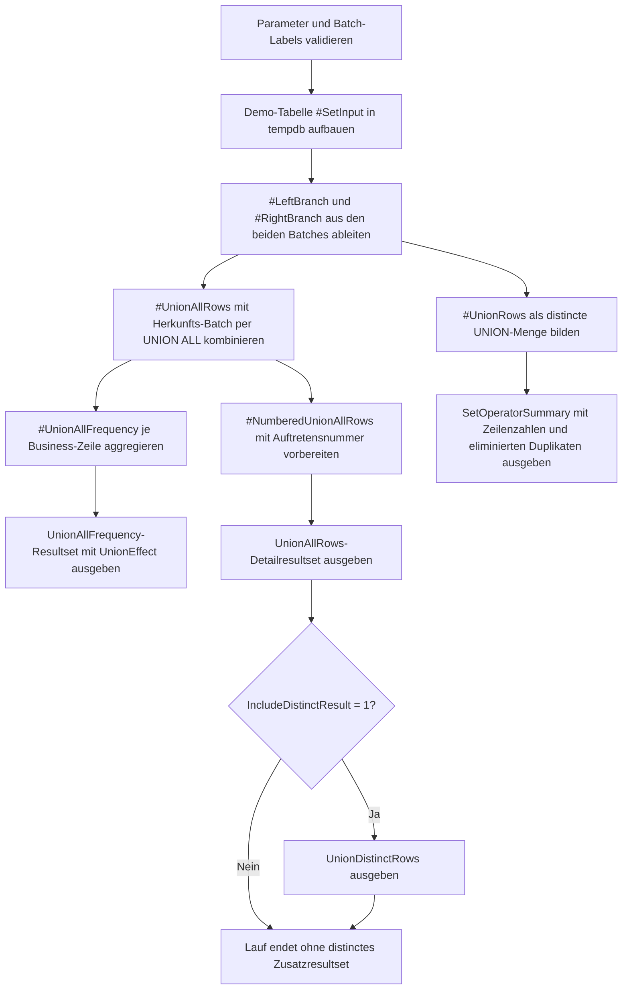

# UnionAllVsUnionDemo.sql

Dieses Skript stellt im Kapitel `09_Set_Operations` die sichtbaren Unterschiede zwischen `UNION ALL` und `UNION` anhand kleiner Demo-Mengen gegenueber. Im Fokus stehen nicht nur die Resultsets selbst, sondern auch die Frage, welche Zeilen mehrfach transportiert werden und wie viele davon `UNION` wieder eliminiert.

## Uebersicht

<!-- SQLDOC:SUMMARY_TABLE:BEGIN -->
| Feld | Wert |
|---|---|
| Script | [UnionAllVsUnionDemo.sql](UnionAllVsUnionDemo.sql) |
| Version | `1.0` |
| Typ | `didactic-lab` |
| Kapitel | `09_Set_Operations` |
| Sicherheit | `read-only-tempdb` |
| Zweck | Stellt `UNION ALL` mit Mehrfachzeilen und `UNION` mit distincter Ergebnismenge direkt gegenueber. |
<!-- SQLDOC:SUMMARY_TABLE:END -->

## Einordnung

`UNION ALL` und `UNION` lesen sich aehnlich, transportieren aber unterschiedliche Mengen. Dieses Artefakt macht deshalb die Rohzeilen, die zusammengefuehrte `UNION ALL`-Sicht und die verdichtete `UNION`-Sicht getrennt sichtbar, damit Lernende Duplikatkosten und Mengensemantik gleichzeitig diskutieren koennen.

## Annahmen

- Die Erstversion arbeitet mit zwei kleinen Demo-Batches in `tempdb` statt mit produktiven Quellabfragen.
- Eine Business-Zeile wird hier ueber `ProductCode`, `RegionCode`, `ChannelCode` und `RevenueBand` definiert.
- Mehrfachvorkommen innerhalb eines Batches und ueber beide Batches hinweg sind absichtlich eingebaut, damit `UNION ALL`-Mehrfachtransport und `UNION`-Eliminierung sichtbar werden.
- `RowsEliminatedByUnion` beschreibt die Anzahl zusaetzlicher Zeilen, die in der `UNION ALL`-Menge vorhanden sind, in der distincten `UNION`-Menge aber nicht mehr erscheinen.

## Anwendungsfall

Das Skript passt fuer Einfuehrungen in Set-Operatoren, fuer Review-Sessions zu Performance- und Ergebniseffekten bei Query-Umschreibungen sowie fuer Regressionstests, wenn eine Abfrage von `UNION ALL` auf `UNION` oder umgekehrt geaendert werden soll. In realen Szenarien koennen die beiden Demo-Batches direkt durch zwei Fachabfragen ersetzt werden.

## Parameter

<!-- SQLDOC:PARAMETERS_TABLE:BEGIN -->
| Parameter | SQL-Typ | Pflicht | Beschreibung |
|---|---|---|---|
| `@OnlyDuplicates` | `BIT` | Nein | Zeigt bei `1` in den Detailresultsets nur Zeilen mit mehrfacher Vorkommnis nach `UNION ALL`. |
| `@IncludeDistinctResult` | `BIT` | Nein | Gibt bei `1` die distincte `UNION`-Sicht als eigenes Resultset aus. |
| `@LeftBatchLabel` | `NVARCHAR(20)` | Nein | Bezeichner der linken Demo-Menge. |
| `@RightBatchLabel` | `NVARCHAR(20)` | Nein | Bezeichner der rechten Demo-Menge. |
<!-- SQLDOC:PARAMETERS_TABLE:END -->

## Abhaengigkeiten

<!-- SQLDOC:DEPENDENCIES_LIST:BEGIN -->
- `tempdb`
- `UNION`
- `UNION ALL`
- `ROW_NUMBER()`
- `STRING_AGG`
- `DROP TABLE IF EXISTS`
<!-- SQLDOC:DEPENDENCIES_LIST:END -->

## Hinweise

- `SetOperatorSummary` vergleicht Ausgangszeilen, kombinierte `UNION ALL`-Menge und distincte `UNION`-Menge in einem kompakten Report.
- `UnionAllFrequency` zeigt pro Business-Zeile, ob `UNION` Mehrfachvorkommen zusammenfassen wuerde und wie viele Zeilen dabei entfallen.
- `UnionAllRows` zeigt dieselben Mehrfachzeilen mit Herkunfts-Batch und laufender Auftretensnummer, damit der Unterschied zwischen Inhalt und Sichtbarkeit klar wird.
- `UnionDistinctRows` ist optional und zeigt nur die distincte Zielmenge ohne Mehrfachwiederholung.

## Versionshistorie

<!-- SQLDOC:VERSION_HISTORY_TABLE:BEGIN -->
| Version | Datum | User | Beschreibung |
|---|---|---|---|
| `1.0` | `2026-04-18` | `ER` | Erstversion fuer die didaktische Gegenueberstellung von `UNION` und `UNION ALL` |
<!-- SQLDOC:VERSION_HISTORY_TABLE:END -->

## Ablauf

<!-- SQLDOC:MERMAID:BEGIN -->

<!-- SQLDOC:MERMAID:END -->

## SQL-Code

<!-- SQLDOC:SQL_CODE:BEGIN -->
```sql
/*
BEGIN:SQL-HEADER v1
---
sql_header: v1
script_name: "UnionAllVsUnionDemo.sql"
script_version: "1.0"
script_type: "didactic-lab"
chapter: "09_Set_Operations"

purpose: >
  Stellt in einer didaktischen Demo gegenueber, wie UNION ALL Duplikate
  beibehaelt, waehrend UNION eine distincte Ergebnismenge bildet, und
  macht die betroffenen Zeilen sowie die resultierende Zeilenzahl
  transparent.

parameters:
  - name: "@OnlyDuplicates"
    sql_type: "BIT"
    direction: "IN"
    required: false
    description: "1 = zeigt in den Detailresultsets nur Werte mit mehrfacher Vorkommnis nach UNION ALL"
  - name: "@IncludeDistinctResult"
    sql_type: "BIT"
    direction: "IN"
    required: false
    description: "1 = gibt die distincte UNION-Sicht zusaetzlich als eigenes Resultset aus"
  - name: "@LeftBatchLabel"
    sql_type: "NVARCHAR(20)"
    direction: "IN"
    required: false
    description: "Bezeichner der linken Demo-Menge"
  - name: "@RightBatchLabel"
    sql_type: "NVARCHAR(20)"
    direction: "IN"
    required: false
    description: "Bezeichner der rechten Demo-Menge"

result_sets:
  - name: "SetOperatorSummary"
    description: "Vergleicht Rohzeilen, UNION-ALL-Menge, UNION-Menge und eliminierte Duplikate"
  - name: "UnionAllFrequency"
    description: "Zeigt je kombinierter Zeile, wie oft sie nach UNION ALL vorkommt und ob UNION sie verdichtet"
  - name: "UnionAllRows"
    description: "Listet die kombinierte UNION-ALL-Sicht inklusive Herkunftsmenge und Auftretensnummer"
  - name: "UnionDistinctRows"
    description: "Optionale distincte Ergebniszeilen der UNION-Sicht ohne Duplikatwiederholung"

dependencies:
  - "tempdb"
  - "UNION"
  - "UNION ALL"
  - "ROW_NUMBER()"
  - "STRING_AGG"
  - "DROP TABLE IF EXISTS"

safety:
  level: "read-only-tempdb"
  writes_data: false

documentation:
  markdown_file: "T-SQL/09_Set_Operations/SQLScripts/UnionAllVsUnionDemo.md"
  sync_blocks:
    - "SUMMARY_TABLE"
    - "PARAMETERS_TABLE"
    - "DEPENDENCIES_LIST"
    - "VERSION_HISTORY_TABLE"
    - "SQL_CODE"
  mermaid:
    mode: "ai-agent-from-sql"
    source: "script-body"

main_responsible:
  name: "Erhard Rainer"
  initials: "ER"

version_history:
  - version: "1.0"
    date: "2026-04-18"
    user: "ER"
    description: "Erstversion fuer die didaktische Gegenueberstellung von UNION und UNION ALL"

notes:
  - "Die Erstversion verwendet Demo-Daten in einer lokalen Temp-Tabelle"
  - "Mehrfach vorkommende Business-Zeilen sind absichtlich enthalten, um Eliminierung und Mehrfachtransport sichtbar zu machen"
---
END:SQL-HEADER v1
*/

SET NOCOUNT ON;

DECLARE @OnlyDuplicates BIT = 0;
DECLARE @IncludeDistinctResult BIT = 1;
DECLARE @LeftBatchLabel NVARCHAR(20) = N'batch-A';
DECLARE @RightBatchLabel NVARCHAR(20) = N'batch-B';

IF @OnlyDuplicates NOT IN (0, 1)
BEGIN
    THROW 50000, '@OnlyDuplicates muss 0 oder 1 sein.', 1;
END;

IF @IncludeDistinctResult NOT IN (0, 1)
BEGIN
    THROW 50001, '@IncludeDistinctResult muss 0 oder 1 sein.', 1;
END;

IF NULLIF(LTRIM(RTRIM(@LeftBatchLabel)), N'') IS NULL
BEGIN
    THROW 50002, '@LeftBatchLabel darf nicht leer sein.', 1;
END;

IF NULLIF(LTRIM(RTRIM(@RightBatchLabel)), N'') IS NULL
BEGIN
    THROW 50003, '@RightBatchLabel darf nicht leer sein.', 1;
END;

IF @LeftBatchLabel = @RightBatchLabel
BEGIN
    THROW 50004, 'Die Batch-Labels muessen unterschiedlich sein.', 1;
END;

DROP TABLE IF EXISTS #SetInput;
DROP TABLE IF EXISTS #LeftBranch;
DROP TABLE IF EXISTS #RightBranch;
DROP TABLE IF EXISTS #UnionAllRows;
DROP TABLE IF EXISTS #UnionRows;
DROP TABLE IF EXISTS #UnionAllFrequency;
DROP TABLE IF EXISTS #NumberedUnionAllRows;

CREATE TABLE #SetInput
(
    BatchLabel NVARCHAR(20) NOT NULL,
    ProductCode NVARCHAR(20) NOT NULL,
    RegionCode CHAR(2) NOT NULL,
    ChannelCode NVARCHAR(20) NOT NULL,
    RevenueBand NVARCHAR(20) NOT NULL
);

INSERT INTO #SetInput
(
    BatchLabel,
    ProductCode,
    RegionCode,
    ChannelCode,
    RevenueBand
)
VALUES
    (@LeftBatchLabel, N'P-100', 'DE', N'Retail', N'mid'),
    (@LeftBatchLabel, N'P-110', 'DE', N'Wholesale', N'high'),
    (@LeftBatchLabel, N'P-110', 'DE', N'Wholesale', N'high'),
    (@LeftBatchLabel, N'P-120', 'AT', N'Online', N'mid'),
    (@LeftBatchLabel, N'P-130', 'CH', N'Partner', N'low'),
    (@RightBatchLabel, N'P-110', 'DE', N'Wholesale', N'high'),
    (@RightBatchLabel, N'P-120', 'AT', N'Online', N'mid'),
    (@RightBatchLabel, N'P-140', 'DE', N'Retail', N'low'),
    (@RightBatchLabel, N'P-140', 'DE', N'Retail', N'low'),
    (@RightBatchLabel, N'P-150', 'FR', N'Online', N'high');

SELECT
    input.ProductCode,
    input.RegionCode,
    input.ChannelCode,
    input.RevenueBand
INTO #LeftBranch
FROM #SetInput AS input
WHERE input.BatchLabel = @LeftBatchLabel;

SELECT
    input.ProductCode,
    input.RegionCode,
    input.ChannelCode,
    input.RevenueBand
INTO #RightBranch
FROM #SetInput AS input
WHERE input.BatchLabel = @RightBatchLabel;

SELECT
    @LeftBatchLabel AS SourceBatch,
    left_rows.ProductCode,
    left_rows.RegionCode,
    left_rows.ChannelCode,
    left_rows.RevenueBand
INTO #UnionAllRows
FROM #LeftBranch AS left_rows

UNION ALL

SELECT
    @RightBatchLabel AS SourceBatch,
    right_rows.ProductCode,
    right_rows.RegionCode,
    right_rows.ChannelCode,
    right_rows.RevenueBand
FROM #RightBranch AS right_rows;

SELECT
    left_rows.ProductCode,
    left_rows.RegionCode,
    left_rows.ChannelCode,
    left_rows.RevenueBand
INTO #UnionRows
FROM #LeftBranch AS left_rows

UNION

SELECT
    right_rows.ProductCode,
    right_rows.RegionCode,
    right_rows.ChannelCode,
    right_rows.RevenueBand
FROM #RightBranch AS right_rows;

SELECT
    combined.ProductCode,
    combined.RegionCode,
    combined.ChannelCode,
    combined.RevenueBand,
    COUNT(*) AS UnionAllOccurrences,
    COUNT(DISTINCT combined.SourceBatch) AS SourceBatchCount,
    STRING_AGG(combined.SourceBatch, ', ')
        WITHIN GROUP (ORDER BY combined.SourceBatch) AS SourceBatchFootprint
INTO #UnionAllFrequency
FROM #UnionAllRows AS combined
GROUP BY
    combined.ProductCode,
    combined.RegionCode,
    combined.ChannelCode,
    combined.RevenueBand;

SELECT
    combined.SourceBatch,
    combined.ProductCode,
    combined.RegionCode,
    combined.ChannelCode,
    combined.RevenueBand,
    COUNT(*) OVER
    (
        PARTITION BY
            combined.ProductCode,
            combined.RegionCode,
            combined.ChannelCode,
            combined.RevenueBand
    ) AS UnionAllOccurrences,
    ROW_NUMBER() OVER
    (
        PARTITION BY
            combined.ProductCode,
            combined.RegionCode,
            combined.ChannelCode,
            combined.RevenueBand
        ORDER BY
            CASE combined.SourceBatch
                WHEN @LeftBatchLabel THEN 1
                ELSE 2
            END,
            combined.SourceBatch
    ) AS DuplicateSequence
INTO #NumberedUnionAllRows
FROM #UnionAllRows AS combined;

SELECT
    summary.MetricScope,
    summary.RowCount,
    summary.DistinctBusinessRows,
    summary.EliminatedRows,
    summary.Interpretation
FROM
(
    SELECT
        1 AS SortOrder,
        'left-branch' AS MetricScope,
        COUNT(*) AS RowCount,
        (
            SELECT COUNT(*)
            FROM
            (
                SELECT DISTINCT
                    lb.ProductCode,
                    lb.RegionCode,
                    lb.ChannelCode,
                    lb.RevenueBand
                FROM #LeftBranch AS lb
            ) AS distinct_left
        ) AS DistinctBusinessRows,
        CAST(NULL AS INT) AS EliminatedRows,
        N'Ausgangszeilen der linken Demo-Menge.' AS Interpretation
    FROM #LeftBranch AS left_rows

    UNION ALL

    SELECT
        2 AS SortOrder,
        'right-branch' AS MetricScope,
        COUNT(*) AS RowCount,
        (
            SELECT COUNT(*)
            FROM
            (
                SELECT DISTINCT
                    rb.ProductCode,
                    rb.RegionCode,
                    rb.ChannelCode,
                    rb.RevenueBand
                FROM #RightBranch AS rb
            ) AS distinct_right
        ) AS DistinctBusinessRows,
        CAST(NULL AS INT) AS EliminatedRows,
        N'Ausgangszeilen der rechten Demo-Menge.' AS Interpretation
    FROM #RightBranch AS right_rows

    UNION ALL

    SELECT
        3 AS SortOrder,
        'union-all' AS MetricScope,
        COUNT(*) AS RowCount,
        (
            SELECT COUNT(*)
            FROM
            (
                SELECT DISTINCT
                    ua.ProductCode,
                    ua.RegionCode,
                    ua.ChannelCode,
                    ua.RevenueBand
                FROM #UnionAllRows AS ua
            ) AS distinct_union_all
        ) AS DistinctBusinessRows,
        CAST(NULL AS INT) AS EliminatedRows,
        N'UNION ALL transportiert alle Zeilen inklusive Duplikaten aus beiden Branches.' AS Interpretation
    FROM #UnionAllRows AS all_rows

    UNION ALL

    SELECT
        4 AS SortOrder,
        'union-distinct' AS MetricScope,
        COUNT(*) AS RowCount,
        COUNT(*) AS DistinctBusinessRows,
        (SELECT COUNT(*) FROM #UnionAllRows) - COUNT(*) AS EliminatedRows,
        N'UNION bildet eine distincte Gesamtmenge und entfernt Mehrfachvorkommen.' AS Interpretation
    FROM #UnionRows AS union_rows
) AS summary
ORDER BY
    summary.SortOrder;

SELECT
    freq.ProductCode,
    freq.RegionCode,
    freq.ChannelCode,
    freq.RevenueBand,
    freq.UnionAllOccurrences,
    freq.SourceBatchCount,
    freq.SourceBatchFootprint,
    CASE
        WHEN freq.UnionAllOccurrences > 1 THEN 'duplicate-eliminated-by-union'
        ELSE 'single-row-preserved'
    END AS UnionEffect,
    CASE
        WHEN freq.UnionAllOccurrences > 1 THEN freq.UnionAllOccurrences - 1
        ELSE 0
    END AS RowsEliminatedByUnion,
    CASE
        WHEN freq.UnionAllOccurrences > 1
            THEN 'Die Zeile taucht mehrfach auf und wird durch UNION auf eine distincte Ausgabe verdichtet.'
        ELSE 'Die Zeile ist bereits eindeutig und bleibt in UNION und UNION ALL identisch.'
    END AS Interpretation
FROM #UnionAllFrequency AS freq
WHERE @OnlyDuplicates = 0
   OR freq.UnionAllOccurrences > 1
ORDER BY
    CASE
        WHEN freq.UnionAllOccurrences > 1 THEN 1
        ELSE 2
    END,
    freq.ProductCode,
    freq.RegionCode,
    freq.ChannelCode,
    freq.RevenueBand;

SELECT
    all_rows.SourceBatch,
    all_rows.ProductCode,
    all_rows.RegionCode,
    all_rows.ChannelCode,
    all_rows.RevenueBand,
    all_rows.UnionAllOccurrences,
    all_rows.DuplicateSequence,
    CASE
        WHEN all_rows.UnionAllOccurrences > 1 THEN 'survives-only-in-union-all'
        ELSE 'same-visible-row-in-both-operators'
    END AS VisibilityHint
FROM #NumberedUnionAllRows AS all_rows
WHERE @OnlyDuplicates = 0
   OR all_rows.UnionAllOccurrences > 1
ORDER BY
    all_rows.ProductCode,
    all_rows.RegionCode,
    all_rows.ChannelCode,
    all_rows.RevenueBand,
    all_rows.DuplicateSequence,
    all_rows.SourceBatch;

IF @IncludeDistinctResult = 1
BEGIN
    SELECT
        union_rows.ProductCode,
        union_rows.RegionCode,
        union_rows.ChannelCode,
        union_rows.RevenueBand
    FROM #UnionRows AS union_rows
    ORDER BY
        union_rows.ProductCode,
        union_rows.RegionCode,
        union_rows.ChannelCode,
        union_rows.RevenueBand;
END;
```
<!-- SQLDOC:SQL_CODE:END -->
