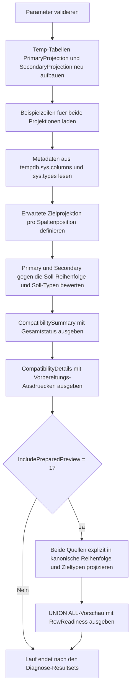

# UnionCompatibilityCheck.sql

Dieses Diagnose-Skript prueft in einem kombinierten Schritt, ob zwei Resultsets fuer `UNION`-nahe Set-Operationen bereits dieselbe Spaltenlogik, dieselbe Reihenfolge und kompatible Datentypen mitbringen. Die Erstversion arbeitet mit zwei lokalen Temp-Tabellen, damit Struktur- und Wertprobleme sichtbar werden, bevor die eigentliche Mengenoperation ausgefuehrt wird.

## Uebersicht

<!-- SQLDOC:SUMMARY_TABLE:BEGIN -->
| Feld | Wert |
|---|---|
| Script | [UnionCompatibilityCheck.sql](UnionCompatibilityCheck.sql) |
| Version | `1.0` |
| Typ | `diagnostic-query` |
| Kapitel | `09_Set_Operations` |
| Sicherheit | `read-only-tempdb` |
| Zweck | Bewertet Spaltenanzahl, Reihenfolge und Datentypen vor dem Kombinieren mehrerer Resultsets. |
<!-- SQLDOC:SUMMARY_TABLE:END -->

## Einordnung

Set-Operationen sind nur dann fachlich sicher, wenn beide Teilabfragen dieselbe Projektion in derselben Reihenfolge und mit kompatiblen Datentypen liefern. Das Skript fuehrt deshalb Metadatenpruefung und vorbereitete Beispielprojektion zusammen: erst Diagnose, dann optional eine explizit ausgerichtete `UNION ALL`-Vorschau.

## Annahmen

- Die Erstversion nutzt lokale Temp-Tabellen statt produktiver Quelltabellen.
- Die zweite Projektion ist absichtlich textlastig und in einer fuer `UNION` unguenstigen Spaltenreihenfolge modelliert.
- `10O3` und `unbekannt` sind bewusst fehlerhafte Beispielwerte, damit Konvertierungsrisiken im Bericht und in der Vorschau sichtbar bleiben.
- Der Parameter `@SetOperatorLabel` beschriftet den Bericht; die Diagnose gilt ebenso fuer `EXCEPT` und `INTERSECT`, auch wenn die Vorschau technisch als `UNION ALL` gezeigt wird.

## Anwendungsfall

Das Muster eignet sich fuer Reviews von Staging-Abfragen, ETL-Zwischenschritten oder Unterrichtseinheiten zu Set-Operationen. Vor einer echten Mengenoperation kann damit geklaert werden, ob zuerst die Projektion umsortiert, Datentypen explizit gecastet oder problematische Werte bereinigt werden muessen.

## Parameter

<!-- SQLDOC:PARAMETERS_TABLE:BEGIN -->
| Parameter | SQL-Typ | Pflicht | Beschreibung |
|---|---|---|---|
| `@SetOperatorLabel` | `NVARCHAR(20)` | Nein | Beschriftet die Auswertung, zum Beispiel `UNION`, `UNION ALL`, `EXCEPT` oder `INTERSECT`. |
| `@IncludePreparedPreview` | `BIT` | Nein | Gibt bei `1` eine explizit vorbereitete `UNION ALL`-Vorschau mit Zeilenstatus aus. |
<!-- SQLDOC:PARAMETERS_TABLE:END -->

## Abhaengigkeiten

<!-- SQLDOC:DEPENDENCIES_LIST:BEGIN -->
- `tempdb`
- `sys.columns`
- `sys.types`
- `OBJECT_ID()`
- `TRY_CONVERT`
- `UNION ALL`
- `CASE`
- `DROP TABLE IF EXISTS`
<!-- SQLDOC:DEPENDENCIES_LIST:END -->

## Hinweise

- `CompatibilitySummary` zeigt, ob Reihenfolge- und Konvertierungsprobleme die Set-Operation noch blockieren.
- `CompatibilityDetails` arbeitet pro erwarteter Spaltenposition und zeigt die vorbereitenden Ausdruecke fuer beide Quellen.
- Die optionale Vorschau stellt beide Quellen bereits in kanonischer Reihenfolge dar und markiert Zeilen mit nicht konvertierbaren Werten.
- Die Vorschau beweist nicht automatisch fachliche Gleichheit der Mengen, sondern nur die technische Vorbereitbarkeit der Projektionen.

## Versionshistorie

<!-- SQLDOC:VERSION_HISTORY_TABLE:BEGIN -->
| Version | Datum | User | Beschreibung |
|---|---|---|---|
| `1.0` | `2026-04-18` | `ER` | Erstversion eines kombinierten Kompatibilitaetschecks fuer UNION-nahe Set-Operationen |
<!-- SQLDOC:VERSION_HISTORY_TABLE:END -->

## Ablauf

<!-- SQLDOC:MERMAID:BEGIN -->

<!-- SQLDOC:MERMAID:END -->

## SQL-Code

<!-- SQLDOC:SQL_CODE:BEGIN -->
```sql
/*
BEGIN:SQL-HEADER v1
---
sql_header: v1
script_name: "UnionCompatibilityCheck.sql"
script_version: "1.0"
script_type: "diagnostic-query"
chapter: "09_Set_Operations"

purpose: >
  Bewertet fuer zwei Beispielprojektionen gemeinsam, ob Spaltenanzahl,
  Spaltenreihenfolge, logische Attributzuordnung und Datentypen bereits
  UNION-kompatibel sind oder vor der Mengenoperation explizit vorbereitet
  werden muessen.

parameters:
  - name: "@SetOperatorLabel"
    sql_type: "NVARCHAR(20)"
    direction: "IN"
    required: false
    description: "Beschriftet die Auswertung, zum Beispiel UNION, UNION ALL, EXCEPT oder INTERSECT"
  - name: "@IncludePreparedPreview"
    sql_type: "BIT"
    direction: "IN"
    required: false
    description: "1 = zeigt zusaetzlich eine explizit vorbereitete UNION ALL-Vorschau mit RowReadiness"

result_sets:
  - name: "CompatibilitySummary"
    description: "Verdichtet die wichtigsten Struktur- und Typkonflikte fuer die geplante Set-Operation"
  - name: "CompatibilityDetails"
    description: "Vergleicht pro Spaltenposition die logische Zuordnung, Typen und Vorbereitungsbedarfe"
  - name: "PreparedUnionPreview"
    description: "Optionale Vorschau einer explizit ausgerichteten UNION ALL-Projektion"

dependencies:
  - "tempdb"
  - "sys.columns"
  - "sys.types"
  - "OBJECT_ID()"
  - "TRY_CONVERT"
  - "UNION ALL"
  - "CASE"
  - "DROP TABLE IF EXISTS"

safety:
  level: "read-only-tempdb"
  writes_data: false

documentation:
  markdown_file: "T-SQL/09_Set_Operations/SQLScripts/UnionCompatibilityCheck.md"
  sync_blocks:
    - "SUMMARY_TABLE"
    - "PARAMETERS_TABLE"
    - "DEPENDENCIES_LIST"
    - "VERSION_HISTORY_TABLE"
    - "SQL_CODE"
  mermaid:
    mode: "ai-agent-from-sql"
    source: "script-body"

main_responsible:
  name: "Erhard Rainer"
  initials: "ER"

version_history:
  - version: "1.0"
    date: "2026-04-18"
    user: "ER"
    description: "Erstversion eines kombinierten Kompatibilitaetschecks fuer UNION-nahe Set-Operationen"

notes:
  - "Die Erstversion arbeitet mit lokalen Temp-Tabellen statt produktiver Quelltabellen"
  - "Die rechte Projektion ist absichtlich fachlich umsortiert und textlastig modelliert"
---
END:SQL-HEADER v1
*/

SET NOCOUNT ON;

DECLARE @SetOperatorLabel NVARCHAR(20) = N'UNION';
DECLARE @IncludePreparedPreview BIT = 1;

IF NULLIF(LTRIM(RTRIM(@SetOperatorLabel)), N'') IS NULL
BEGIN
    THROW 50000, '@SetOperatorLabel darf nicht leer sein.', 1;
END;

IF UPPER(@SetOperatorLabel) NOT IN (N'UNION', N'UNION ALL', N'EXCEPT', N'INTERSECT')
BEGIN
    THROW 50001, '@SetOperatorLabel muss UNION, UNION ALL, EXCEPT oder INTERSECT sein.', 1;
END;

IF @IncludePreparedPreview NOT IN (0, 1)
BEGIN
    THROW 50002, '@IncludePreparedPreview muss 0 oder 1 sein.', 1;
END;

DROP TABLE IF EXISTS #PrimaryProjection;
DROP TABLE IF EXISTS #SecondaryProjection;

CREATE TABLE #PrimaryProjection
(
    CustomerCode    INT             NOT NULL,
    RegionCode      CHAR(2)         NOT NULL,
    SnapshotMonth   DATE            NOT NULL,
    NetRevenue      DECIMAL(12,2)   NOT NULL
);

CREATE TABLE #SecondaryProjection
(
    RegionCodeText      NVARCHAR(10)    NOT NULL,
    CustomerCodeText    NVARCHAR(20)    NOT NULL,
    SnapshotMonthText   NVARCHAR(20)    NOT NULL,
    NetRevenueText      NVARCHAR(30)    NOT NULL
);

INSERT INTO #PrimaryProjection
(
    CustomerCode,
    RegionCode,
    SnapshotMonth,
    NetRevenue
)
VALUES
    (1001, 'DE', DATEFROMPARTS(2026, 1, 1), 1250.00),
    (1002, 'AT', DATEFROMPARTS(2026, 2, 1), 980.50),
    (1003, 'CH', DATEFROMPARTS(2026, 3, 1), 1475.25);

INSERT INTO #SecondaryProjection
(
    RegionCodeText,
    CustomerCodeText,
    SnapshotMonthText,
    NetRevenueText
)
VALUES
    (N'DE', N'1001', N'2026-01-01', N'1250.00'),
    (N'AT', N'1002', N'2026-02-01', N'980.50'),
    (N'CH-NORD', N'10O3', N'2026-03-01', N'unbekannt');

;WITH LeftMeta AS
(
    SELECT
        c.column_id,
        c.name AS column_name,
        t.name AS type_name,
        c.max_length,
        c.precision,
        c.scale,
        CASE
            WHEN t.name IN (N'nvarchar', N'nchar') AND c.max_length > 0 THEN c.max_length / 2
            ELSE c.max_length
        END AS display_length
    FROM tempdb.sys.columns AS c
    INNER JOIN tempdb.sys.types AS t
        ON c.user_type_id = t.user_type_id
    WHERE c.object_id = OBJECT_ID(N'tempdb..#PrimaryProjection')
),
RightMeta AS
(
    SELECT
        c.column_id,
        c.name AS column_name,
        t.name AS type_name,
        c.max_length,
        c.precision,
        c.scale,
        CASE
            WHEN t.name IN (N'nvarchar', N'nchar') AND c.max_length > 0 THEN c.max_length / 2
            ELSE c.max_length
        END AS display_length
    FROM tempdb.sys.columns AS c
    INNER JOIN tempdb.sys.types AS t
        ON c.user_type_id = t.user_type_id
    WHERE c.object_id = OBJECT_ID(N'tempdb..#SecondaryProjection')
),
ExpectedShape AS
(
    SELECT
        v.column_ordinal,
        v.logical_column,
        v.canonical_type,
        v.primary_expected_name,
        v.secondary_expected_name
    FROM
    (
        VALUES
            (1, N'CustomerCode', N'INT', N'CustomerCode', N'CustomerCodeText'),
            (2, N'RegionCode', N'NVARCHAR(10)', N'RegionCode', N'RegionCodeText'),
            (3, N'SnapshotMonth', N'DATE', N'SnapshotMonth', N'SnapshotMonthText'),
            (4, N'NetRevenue', N'DECIMAL(12,2)', N'NetRevenue', N'NetRevenueText')
    ) AS v
    (
        column_ordinal,
        logical_column,
        canonical_type,
        primary_expected_name,
        secondary_expected_name
    )
),
ColumnAlignment AS
(
    SELECT
        shape.column_ordinal,
        shape.logical_column,
        shape.canonical_type,
        left_meta.column_name AS primary_column_name,
        right_meta.column_name AS secondary_column_name,
        left_meta.type_name AS primary_type_name,
        right_meta.type_name AS secondary_type_name,
        left_meta.display_length AS primary_length,
        right_meta.display_length AS secondary_length,
        left_meta.precision AS primary_precision,
        right_meta.precision AS secondary_precision,
        left_meta.scale AS primary_scale,
        right_meta.scale AS secondary_scale,
        CASE
            WHEN left_meta.column_name = shape.primary_expected_name THEN CAST(1 AS BIT)
            ELSE CAST(0 AS BIT)
        END AS PrimaryInExpectedOrder,
        CASE
            WHEN right_meta.column_name = shape.secondary_expected_name THEN CAST(1 AS BIT)
            ELSE CAST(0 AS BIT)
        END AS SecondaryInExpectedOrder
    FROM ExpectedShape AS shape
    LEFT JOIN LeftMeta AS left_meta
        ON left_meta.column_id = shape.column_ordinal
    LEFT JOIN RightMeta AS right_meta
        ON right_meta.column_id = shape.column_ordinal
),
CompatibilityDetails AS
(
    SELECT
        alignment.column_ordinal,
        alignment.logical_column,
        alignment.primary_column_name,
        CONCAT(
            alignment.primary_type_name,
            CASE
                WHEN alignment.primary_type_name IN (N'char', N'varchar', N'nchar', N'nvarchar')
                    THEN CONCAT(N'(', alignment.primary_length, N')')
                WHEN alignment.primary_type_name IN (N'decimal', N'numeric')
                    THEN CONCAT(N'(', alignment.primary_precision, N',', alignment.primary_scale, N')')
                ELSE N''
            END
        ) AS primary_declared_type,
        alignment.secondary_column_name,
        CONCAT(
            alignment.secondary_type_name,
            CASE
                WHEN alignment.secondary_type_name IN (N'char', N'varchar', N'nchar', N'nvarchar')
                    THEN CONCAT(N'(', alignment.secondary_length, N')')
                WHEN alignment.secondary_type_name IN (N'decimal', N'numeric')
                    THEN CONCAT(N'(', alignment.secondary_precision, N',', alignment.secondary_scale, N')')
                ELSE N''
            END
        ) AS secondary_declared_type,
        alignment.canonical_type,
        alignment.PrimaryInExpectedOrder,
        alignment.SecondaryInExpectedOrder,
        CASE
            WHEN alignment.PrimaryInExpectedOrder = 1 AND alignment.SecondaryInExpectedOrder = 1
                THEN N'aligned'
            WHEN alignment.PrimaryInExpectedOrder = 0 OR alignment.SecondaryInExpectedOrder = 0
                THEN N'reorder-required'
            ELSE N'unknown'
        END AS order_status,
        CASE alignment.logical_column
            WHEN N'CustomerCode'
                THEN CAST(CASE WHEN TRY_CONVERT(INT, N'10O3') IS NOT NULL THEN 1 ELSE 0 END AS BIT)
            WHEN N'RegionCode'
                THEN CAST(CASE WHEN LEN(N'CH-NORD') <= 10 THEN 1 ELSE 0 END AS BIT)
            WHEN N'SnapshotMonth'
                THEN CAST(CASE WHEN TRY_CONVERT(DATE, N'2026-03-01') IS NOT NULL THEN 1 ELSE 0 END AS BIT)
            WHEN N'NetRevenue'
                THEN CAST(CASE WHEN TRY_CONVERT(DECIMAL(12,2), N'unbekannt') IS NOT NULL THEN 1 ELSE 0 END AS BIT)
            ELSE CAST(0 AS BIT)
        END AS sample_value_convertible,
        CASE alignment.logical_column
            WHEN N'CustomerCode' THEN N'CAST(src.CustomerCode AS INT)'
            WHEN N'RegionCode' THEN N'CAST(src.RegionCode AS NVARCHAR(10))'
            WHEN N'SnapshotMonth' THEN N'CAST(src.SnapshotMonth AS DATE)'
            WHEN N'NetRevenue' THEN N'CAST(src.NetRevenue AS DECIMAL(12,2))'
            ELSE N''
        END AS primary_preparation_expression,
        CASE alignment.logical_column
            WHEN N'CustomerCode' THEN N'TRY_CONVERT(INT, imp.CustomerCodeText)'
            WHEN N'RegionCode' THEN N'CAST(imp.RegionCodeText AS NVARCHAR(10))'
            WHEN N'SnapshotMonth' THEN N'TRY_CONVERT(DATE, imp.SnapshotMonthText)'
            WHEN N'NetRevenue' THEN N'TRY_CONVERT(DECIMAL(12,2), imp.NetRevenueText)'
            ELSE N''
        END AS secondary_preparation_expression
    FROM ColumnAlignment AS alignment
),
CompatibilitySummary AS
(
    SELECT
        COUNT(*) AS compared_columns,
        SUM(CASE WHEN detail.order_status = N'reorder-required' THEN 1 ELSE 0 END) AS reorder_required_columns,
        SUM(CASE WHEN detail.sample_value_convertible = 0 THEN 1 ELSE 0 END) AS conversion_risk_columns,
        SUM(CASE WHEN detail.order_status = N'aligned' AND detail.sample_value_convertible = 1 THEN 1 ELSE 0 END) AS immediately_compatible_columns
    FROM CompatibilityDetails AS detail
),
PreparedPrimary AS
(
    SELECT
        CAST(src.CustomerCode AS INT) AS CustomerCode,
        CAST(src.RegionCode AS NVARCHAR(10)) AS RegionCode,
        CAST(src.SnapshotMonth AS DATE) AS SnapshotMonth,
        CAST(src.NetRevenue AS DECIMAL(12,2)) AS NetRevenue,
        N'primary' AS SourceSet
    FROM #PrimaryProjection AS src
),
PreparedSecondary AS
(
    SELECT
        TRY_CONVERT(INT, imp.CustomerCodeText) AS CustomerCode,
        CAST(imp.RegionCodeText AS NVARCHAR(10)) AS RegionCode,
        TRY_CONVERT(DATE, imp.SnapshotMonthText) AS SnapshotMonth,
        TRY_CONVERT(DECIMAL(12,2), imp.NetRevenueText) AS NetRevenue,
        N'secondary' AS SourceSet
    FROM #SecondaryProjection AS imp
)
SELECT
    @SetOperatorLabel AS planned_set_operator,
    summary.compared_columns,
    summary.immediately_compatible_columns,
    summary.reorder_required_columns,
    summary.conversion_risk_columns,
    CASE
        WHEN summary.reorder_required_columns > 0 OR summary.conversion_risk_columns > 0
            THEN N'not-ready'
        ELSE N'ready'
    END AS compatibility_state,
    CASE
        WHEN summary.reorder_required_columns > 0 AND summary.conversion_risk_columns > 0
            THEN N'Zuerst Projektion umsortieren und problematische Textwerte bereinigen oder verwerfen.'
        WHEN summary.reorder_required_columns > 0
            THEN N'Die zweite Projektion muss vor der Set-Operation in dieselbe Spaltenreihenfolge gebracht werden.'
        WHEN summary.conversion_risk_columns > 0
            THEN N'Vor der Set-Operation muessen nicht konvertierbare Werte ueber TRY_CONVERT-Pruefungen behandelt werden.'
        ELSE N'Beide Projektionen sind fuer die beschriftete Set-Operation bereits kompatibel vorbereitet.'
    END AS recommended_next_step
FROM CompatibilitySummary AS summary;

SELECT
    detail.column_ordinal,
    detail.logical_column,
    detail.primary_column_name,
    detail.primary_declared_type,
    detail.secondary_column_name,
    detail.secondary_declared_type,
    detail.canonical_type,
    detail.order_status,
    detail.sample_value_convertible,
    CASE
        WHEN detail.order_status = N'reorder-required'
            THEN N'projection-order-fix'
        WHEN detail.sample_value_convertible = 0
            THEN N'value-cleanup-or-filter'
        ELSE N'ready-after-explicit-cast'
    END AS recommended_action,
    detail.primary_preparation_expression,
    detail.secondary_preparation_expression
FROM CompatibilityDetails AS detail
ORDER BY
    detail.column_ordinal;

IF @IncludePreparedPreview = 1
BEGIN
    SELECT
        prepared.SourceSet,
        prepared.CustomerCode,
        prepared.RegionCode,
        prepared.SnapshotMonth,
        prepared.NetRevenue,
        CASE
            WHEN prepared.CustomerCode IS NULL
              OR prepared.SnapshotMonth IS NULL
              OR prepared.NetRevenue IS NULL
                THEN N'requires-cleanup-before-set-operator'
            ELSE N'prepared-row'
        END AS RowReadiness
    FROM
    (
        SELECT
            p.SourceSet,
            p.CustomerCode,
            p.RegionCode,
            p.SnapshotMonth,
            p.NetRevenue
        FROM PreparedPrimary AS p

        UNION ALL

        SELECT
            s.SourceSet,
            s.CustomerCode,
            s.RegionCode,
            s.SnapshotMonth,
            s.NetRevenue
        FROM PreparedSecondary AS s
    ) AS prepared
    ORDER BY
        prepared.SourceSet,
        prepared.RegionCode,
        prepared.CustomerCode;
END;
```
<!-- SQLDOC:SQL_CODE:END -->


