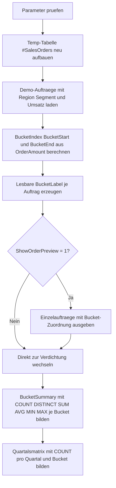

# AggregateBucketSummary.sql

Dieses didaktische Skript zeigt, wie feste Umsatz-Buckets in T-SQL gebildet und danach mit `GROUP BY` zu einer kompakten Kennzahlenansicht verdichtet werden. Die Demo arbeitet ausschliesslich mit lokalen Temp-Daten, damit Bucketgrenzen, Gruppenbildung und Mehrfachaggregation transparent nachvollziehbar bleiben.

## Uebersicht

<!-- SQLDOC:SUMMARY_TABLE:BEGIN -->
| Feld | Wert |
|---|---|
| Script | [AggregateBucketSummary.sql](AggregateBucketSummary.sql) |
| Version | `1.0` |
| Typ | `didactic-lab` |
| Kapitel | `10_GroupBy_Aggregate` |
| Sicherheit | `read-only-tempdb` |
| Zweck | Bildet Wert-Buckets ueber `OrderAmount` und fasst Kennzahlen je Bucket mit `GROUP BY` zusammen. |
<!-- SQLDOC:SUMMARY_TABLE:END -->

## Einordnung

Das Artefakt eignet sich als Einstieg in zwei typische Aggregate-Muster:

- Klassifizierung von Einzelwerten in feste Klassen mit `FLOOR(...)`.
- Verdichtung mehrerer Kennzahlen pro Klasse in einer einzigen Gruppierungsabfrage.

Die zusaetzliche Quartalsmatrix zeigt ausserdem, dass dieselbe Bucketlogik spaeter auch in feinere fachliche Gruppierungen eingebettet werden kann.

## Annahmen

- Die Erstversion nutzt eine kleine didaktische Auftragsliste in `#SalesOrders` statt einer produktiven Faktentabelle.
- Buckets werden ausschliesslich ueber `OrderAmount` definiert; Region und Segment dienen nur als Zusatzkennzahlen.
- Die Intervallbeschriftung verwendet halboffene Klassen, fachlich lesbar dargestellt als `Start - EndeMinusCent`.
- `DATENAME(QUARTER, ...)` wird nur fuer die Vorschau verwendet; die stabile Gruppierung der Quartalsmatrix basiert auf `DATEPART(QUARTER, ...)`.

## Anwendungsfall

Das Skript ist geeignet fuer Schulung, Reporting-Prototypen oder Qualitaetschecks, wenn Rohwerte zuerst in Wertklassen ueberfuehrt und anschliessend pro Klasse verdichtet werden sollen. Fuer reale Datenquellen kann die Temp-Tabelle spaeter durch eine Faktentabelle oder eine vorbereitende CTE ersetzt werden, ohne die Aggregationslogik neu zu schreiben.

## Parameter

<!-- SQLDOC:PARAMETERS_TABLE:BEGIN -->
| Parameter | SQL-Typ | Pflicht | Beschreibung |
|---|---|---|---|
| `@BucketWidth` | `DECIMAL(10,2)` | Ja | Definiert die Breite eines Umsatz-Buckets in Geldeinheiten. |
| `@ShowOrderPreview` | `BIT` | Nein | Gibt bei `1` die Einzelauftraege mit berechneter Bucket-Zuordnung aus. |
<!-- SQLDOC:PARAMETERS_TABLE:END -->

## Abhaengigkeiten

<!-- SQLDOC:DEPENDENCIES_LIST:BEGIN -->
- `tempdb`
- `CONCAT()`
- `FLOOR()`
- `GROUP BY`
- `AVG()`
- `MIN()`
- `MAX()`
- `SUM()`
- `COUNT()`
- `DROP TABLE IF EXISTS`
<!-- SQLDOC:DEPENDENCIES_LIST:END -->

## Hinweise

- `BucketSummary` verdichtet dieselben Buckets mit mehreren Kennzahlen in einem Resultset.
- `QuarterBucketMatrix` zeigt, wie sich die Bucketverteilung ueber Quartale hinweg staffeln laesst.
- Bei sehr kleinen Bucketbreiten steigt die Zahl der Gruppen; bei sehr grossen Bucketbreiten wird die Verdichtung grober.

## Versionshistorie

<!-- SQLDOC:VERSION_HISTORY_TABLE:BEGIN -->
| Version | Datum | User | Beschreibung |
|---|---|---|---|
| `1.0` | `2026-04-18` | `ER` | Erstversion eines didaktischen Labs fuer Bucketbildung und Aggregation mit GROUP BY |
<!-- SQLDOC:VERSION_HISTORY_TABLE:END -->

## Ablauf

<!-- SQLDOC:MERMAID:BEGIN -->

<!-- SQLDOC:MERMAID:END -->

## SQL-Code

<!-- SQLDOC:SQL_CODE:BEGIN -->
```sql
/*
BEGIN:SQL-HEADER v1
---
sql_header: v1
script_name: "AggregateBucketSummary.sql"
script_version: "1.0"
script_type: "didactic-lab"
chapter: "10_GroupBy_Aggregate"

purpose: >
  Bildet auf Basis didaktischer Umsatzdaten feste Wert-Buckets und fasst
  Kennzahlen wie Auftragszahl, Umsatzsumme, Durchschnitt und Streuung je
  Bucket mit GROUP BY zusammen.

parameters:
  - name: "@BucketWidth"
    sql_type: "DECIMAL(10,2)"
    direction: "IN"
    required: true
    description: "Breite eines Umsatz-Buckets in Geldeinheiten"
  - name: "@ShowOrderPreview"
    sql_type: "BIT"
    direction: "IN"
    required: false
    description: "1 = zeigt die Demo-Auftraege mit berechneter Bucket-Zuordnung vor der Verdichtung"

result_sets:
  - name: "OrderBucketPreview"
    description: "Optionale Vorschau der Einzelauftraege mit Bucket-Intervall und Quartalsbezug"
  - name: "BucketSummary"
    description: "Verdichtete Kennzahlen je Umsatz-Bucket"
  - name: "QuarterBucketMatrix"
    description: "Zeigt, wie viele Auftraege je Quartal in jedem Bucket liegen"

dependencies:
  - "tempdb"
  - "CONCAT()"
  - "FLOOR()"
  - "GROUP BY"
  - "AVG()"
  - "MIN()"
  - "MAX()"
  - "SUM()"
  - "COUNT()"
  - "DROP TABLE IF EXISTS"

safety:
  level: "read-only-tempdb"
  writes_data: false

documentation:
  markdown_file: "T-SQL/10_GroupBy_Aggregate/SQLScripts/AggregateBucketSummary.md"
  sync_blocks:
    - "SUMMARY_TABLE"
    - "PARAMETERS_TABLE"
    - "DEPENDENCIES_LIST"
    - "VERSION_HISTORY_TABLE"
    - "SQL_CODE"
  mermaid:
    mode: "ai-agent-from-sql"
    source: "script-body"

main_responsible:
  name: "Erhard Rainer"
  initials: "ER"

version_history:
  - version: "1.0"
    date: "2026-04-18"
    user: "ER"
    description: "Erstversion eines didaktischen Labs fuer Bucketbildung und Aggregation mit GROUP BY"

notes:
  - "Die Erstversion arbeitet mit lokalen Temp-Tabellen statt produktiver Faktentabellen"
  - "Buckets basieren auf OrderAmount und werden ueber FLOOR(OrderAmount / @BucketWidth) deterministisch gebildet"
---
END:SQL-HEADER v1
*/

SET NOCOUNT ON;

DECLARE @BucketWidth DECIMAL(10,2) = 250.00;
DECLARE @ShowOrderPreview BIT = 1;

IF @BucketWidth IS NULL OR @BucketWidth <= 0
BEGIN
    THROW 50000, '@BucketWidth muss groesser als 0 sein.', 1;
END;

IF @ShowOrderPreview NOT IN (0, 1)
BEGIN
    THROW 50001, '@ShowOrderPreview muss 0 oder 1 sein.', 1;
END;

DROP TABLE IF EXISTS #SalesOrders;
DROP TABLE IF EXISTS #BucketedOrders;

CREATE TABLE #SalesOrders
(
    OrderID         INT             NOT NULL,
    OrderDate       DATE            NOT NULL,
    SalesRegion     VARCHAR(20)     NOT NULL,
    CustomerSegment VARCHAR(20)     NOT NULL,
    OrderAmount     DECIMAL(10,2)   NOT NULL
);

INSERT INTO #SalesOrders
(
    OrderID,
    OrderDate,
    SalesRegion,
    CustomerSegment,
    OrderAmount
)
VALUES
    (1001, '2026-01-04', 'North', 'SMB',        120.00),
    (1002, '2026-01-09', 'North', 'Enterprise', 245.00),
    (1003, '2026-01-12', 'South', 'SMB',        260.00),
    (1004, '2026-01-17', 'South', 'Public',     410.00),
    (1005, '2026-02-02', 'West',  'SMB',        515.00),
    (1006, '2026-02-07', 'West',  'Enterprise', 640.00),
    (1007, '2026-02-16', 'North', 'Public',     755.00),
    (1008, '2026-02-21', 'South', 'Enterprise', 815.00),
    (1009, '2026-03-03', 'North', 'SMB',        890.00),
    (1010, '2026-03-08', 'West',  'Public',    1010.00),
    (1011, '2026-03-18', 'South', 'SMB',       1185.00),
    (1012, '2026-03-26', 'West',  'Enterprise', 1295.00);

SELECT
    so.OrderID,
    so.OrderDate,
    DATENAME(QUARTER, so.OrderDate) AS CalendarQuarter,
    DATEPART(QUARTER, so.OrderDate) AS CalendarQuarterNumber,
    so.SalesRegion,
    so.CustomerSegment,
    so.OrderAmount,
    FLOOR(so.OrderAmount / @BucketWidth) AS BucketIndex,
    CAST(FLOOR(so.OrderAmount / @BucketWidth) * @BucketWidth AS DECIMAL(10,2)) AS BucketStartAmount,
    CAST((FLOOR(so.OrderAmount / @BucketWidth) + 1) * @BucketWidth AS DECIMAL(10,2)) AS BucketEndAmount,
    CONCAT(
        CAST(CAST(FLOOR(so.OrderAmount / @BucketWidth) * @BucketWidth AS DECIMAL(10,2)) AS INT),
        ' - ',
        CAST(CAST(((FLOOR(so.OrderAmount / @BucketWidth) + 1) * @BucketWidth) - 0.01 AS DECIMAL(10,2)) AS INT)
    ) AS BucketLabel
INTO #BucketedOrders
FROM #SalesOrders AS so;

IF @ShowOrderPreview = 1
BEGIN
    SELECT
        bo.OrderID,
        bo.OrderDate,
        bo.CalendarQuarter,
        bo.SalesRegion,
        bo.CustomerSegment,
        bo.OrderAmount,
        bo.BucketIndex,
        bo.BucketLabel
    FROM #BucketedOrders AS bo
    ORDER BY
        bo.OrderAmount,
        bo.OrderID;
END;

SELECT
    bo.BucketIndex,
    bo.BucketLabel,
    COUNT(*) AS OrderCount,
    COUNT(DISTINCT bo.SalesRegion) AS RegionCount,
    COUNT(DISTINCT bo.CustomerSegment) AS SegmentCount,
    SUM(bo.OrderAmount) AS TotalOrderAmount,
    AVG(bo.OrderAmount) AS AverageOrderAmount,
    MIN(bo.OrderAmount) AS MinimumOrderAmount,
    MAX(bo.OrderAmount) AS MaximumOrderAmount
FROM #BucketedOrders AS bo
GROUP BY
    bo.BucketIndex,
    bo.BucketLabel
ORDER BY
    bo.BucketIndex;

SELECT
    CONCAT('Q', bo.CalendarQuarterNumber) AS CalendarQuarter,
    bo.BucketLabel,
    COUNT(*) AS OrdersInBucket
FROM #BucketedOrders AS bo
GROUP BY
    bo.CalendarQuarterNumber,
    bo.BucketLabel,
    bo.BucketIndex
ORDER BY
    bo.CalendarQuarterNumber,
    bo.BucketIndex;
```
<!-- SQLDOC:SQL_CODE:END -->
