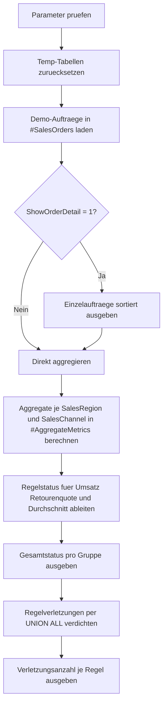

# AggregateBusinessRuleCheck.sql

Dieses didaktische Skript zeigt, wie `GROUP BY` nicht nur fuer reine Kennzahlenberichte, sondern auch fuer einfache regelbasierte Plausibilitaetspruefungen eingesetzt werden kann. Die Demo verdichtet Auftraege je Vertriebsregion und Kanal und bewertet die resultierenden Aggregatwerte gegen definierte Schwellen.

## Uebersicht

<!-- SQLDOC:SUMMARY_TABLE:BEGIN -->
| Feld | Wert |
|---|---|
| Script | [AggregateBusinessRuleCheck.sql](AggregateBusinessRuleCheck.sql) |
| Version | `1.0` |
| Typ | `didactic-lab` |
| Kapitel | `10_GroupBy_Aggregate` |
| Sicherheit | `read-only-tempdb` |
| Zweck | Prueft aggregierte Kennzahlen je Region und Kanal gegen Mindestumsatz, maximale Retourenquote und Mindestdurchschnitt. |
<!-- SQLDOC:SUMMARY_TABLE:END -->

## Einordnung

Das Artefakt verbindet drei typische Themen in einer kompakten Uebung:

- Aggregation mehrerer Kennzahlen pro Gruppe.
- Ableitung fachlicher Ampel- oder Regelzustande aus Aggregaten.
- Verdichtung von Regelverletzungen in einer zweiten Auswertung.

Dadurch eignet sich das Skript sowohl fuer das Verstaendnis von `GROUP BY` als auch fuer erste Qualitaetschecks in Reporting- oder Controlling-Szenarien.

## Annahmen

- Die Erstversion nutzt eine didaktische Demo-Tabelle `#SalesOrders` statt produktiver Vertriebsdaten.
- Fachregeln werden bewusst als feste Schwellwerte modelliert und nicht aus Stammdaten oder Konfigurationstabellen gelesen.
- Die Pruefung erfolgt auf der Kombination aus `SalesRegion` und `SalesChannel`; andere moegliche Gruppierungsebenen bleiben unveraendert.
- Eine Retourenquote wird als `ReturnedOrders / OrderCount` auf Gruppenebene berechnet.

## Anwendungsfall

Das Muster passt zu Situationen, in denen verdichtete Verkaufs-, Service- oder Prozesskennzahlen nicht nur angezeigt, sondern gegen einfache Erwartungen geprueft werden sollen. In realen Umgebungen kann die Demoquelle spaeter durch Fakt- oder Snapshot-Tabellen ersetzt werden, waehrend die Regel- und Gruppierungslogik weitgehend erhalten bleibt.

## Parameter

<!-- SQLDOC:PARAMETERS_TABLE:BEGIN -->
| Parameter | SQL-Typ | Pflicht | Beschreibung |
|---|---|---|---|
| `@MinimumRegionalRevenue` | `DECIMAL(12,2)` | Ja | Untergrenze fuer den aggregierten Gruppenumsatz. |
| `@MaximumReturnRate` | `DECIMAL(5,4)` | Ja | Obergrenze fuer den Anteil retournierter Auftraege je Gruppe. |
| `@MinimumAverageOrderAmount` | `DECIMAL(12,2)` | Ja | Untergrenze fuer den durchschnittlichen Auftragswert je Gruppe. |
| `@ShowOrderDetail` | `BIT` | Nein | Gibt bei `1` die Demo-Auftraege vor der Verdichtung aus. |
<!-- SQLDOC:PARAMETERS_TABLE:END -->

## Abhaengigkeiten

<!-- SQLDOC:DEPENDENCIES_LIST:BEGIN -->
- `tempdb`
- `GROUP BY`
- `SUM()`
- `AVG()`
- `COUNT()`
- `CAST()`
- `CASE`
- `DROP TABLE IF EXISTS`
<!-- SQLDOC:DEPENDENCIES_LIST:END -->

## Hinweise

- `AggregateRuleCheck` zeigt pro Gruppe sowohl die Rohkennzahlen als auch drei Regelzustande und einen Gesamtstatus.
- `RuleViolationSummary` verdichtet die Regelpruefung erneut und macht sichtbar, welche Regel in wie vielen Gruppen auffaellig war.
- Die Parametrisierung erlaubt es, denselben Demo-Datensatz mit strengeren oder lockereren Regeln zu testen.

## Versionshistorie

<!-- SQLDOC:VERSION_HISTORY_TABLE:BEGIN -->
| Version | Datum | User | Beschreibung |
|---|---|---|---|
| `1.0` | `2026-04-18` | `ER` | Erstversion eines didaktischen Labs fuer die Pruefung aggregierter Kennzahlen gegen Fachregeln |
<!-- SQLDOC:VERSION_HISTORY_TABLE:END -->

## Ablauf

<!-- SQLDOC:MERMAID:BEGIN -->

<!-- SQLDOC:MERMAID:END -->

## SQL-Code

<!-- SQLDOC:SQL_CODE:BEGIN -->
```sql
/*
BEGIN:SQL-HEADER v1
---
sql_header: v1
script_name: "AggregateBusinessRuleCheck.sql"
script_version: "1.0"
script_type: "didactic-lab"
chapter: "10_GroupBy_Aggregate"

purpose: >
  Bildet Gruppen ueber Vertriebsregion und Kanal, berechnet zentrale
  Aggregatwerte und prueft diese gegen einfache Fachregeln wie
  Mindestumsatz, maximale Retourenquote und Mindestdurchschnitt.

parameters:
  - name: "@MinimumRegionalRevenue"
    sql_type: "DECIMAL(12,2)"
    direction: "IN"
    required: true
    description: "Untergrenze fuer den aggregierten Gruppenumsatz"
  - name: "@MaximumReturnRate"
    sql_type: "DECIMAL(5,4)"
    direction: "IN"
    required: true
    description: "Obergrenze fuer den Anteil retournierter Auftraege je Gruppe"
  - name: "@MinimumAverageOrderAmount"
    sql_type: "DECIMAL(12,2)"
    direction: "IN"
    required: true
    description: "Untergrenze fuer den durchschnittlichen Auftragswert je Gruppe"
  - name: "@ShowOrderDetail"
    sql_type: "BIT"
    direction: "IN"
    required: false
    description: "1 = zeigt die Demo-Auftraege vor der Verdichtung an"

result_sets:
  - name: "OrderDetail"
    description: "Optionale Vorschau der einzelnen Demo-Auftraege"
  - name: "AggregateRuleCheck"
    description: "Aggregierte Kennzahlen je Region und Kanal mit Regelstatus"
  - name: "RuleViolationSummary"
    description: "Zaehlt je Regel, wie viele Gruppen die jeweilige Bedingung verletzen"

dependencies:
  - "tempdb"
  - "GROUP BY"
  - "SUM()"
  - "AVG()"
  - "COUNT()"
  - "CAST()"
  - "CASE"
  - "DROP TABLE IF EXISTS"

safety:
  level: "read-only-tempdb"
  writes_data: false

documentation:
  markdown_file: "T-SQL/10_GroupBy_Aggregate/SQLScripts/AggregateBusinessRuleCheck.md"
  sync_blocks:
    - "SUMMARY_TABLE"
    - "PARAMETERS_TABLE"
    - "DEPENDENCIES_LIST"
    - "VERSION_HISTORY_TABLE"
    - "SQL_CODE"
  mermaid:
    mode: "ai-agent-from-sql"
    source: "script-body"

main_responsible:
  name: "Erhard Rainer"
  initials: "ER"

version_history:
  - version: "1.0"
    date: "2026-04-18"
    user: "ER"
    description: "Erstversion eines didaktischen Labs fuer die Pruefung aggregierter Kennzahlen gegen Fachregeln"

notes:
  - "Die Erstversion verwendet ausschliesslich lokale Temp-Tabellen mit Demo-Auftraegen"
  - "Fachregeln werden bewusst einfach ueber Schwellwerte auf Gruppenebene modelliert"
---
END:SQL-HEADER v1
*/

SET NOCOUNT ON;

DECLARE @MinimumRegionalRevenue DECIMAL(12,2) = 2000.00;
DECLARE @MaximumReturnRate DECIMAL(5,4) = 0.2000;
DECLARE @MinimumAverageOrderAmount DECIMAL(12,2) = 350.00;
DECLARE @ShowOrderDetail BIT = 1;

IF @MinimumRegionalRevenue IS NULL OR @MinimumRegionalRevenue <= 0
BEGIN
    THROW 50000, '@MinimumRegionalRevenue muss groesser als 0 sein.', 1;
END;

IF @MaximumReturnRate IS NULL OR @MaximumReturnRate < 0 OR @MaximumReturnRate > 1
BEGIN
    THROW 50001, '@MaximumReturnRate muss zwischen 0 und 1 liegen.', 1;
END;

IF @MinimumAverageOrderAmount IS NULL OR @MinimumAverageOrderAmount <= 0
BEGIN
    THROW 50002, '@MinimumAverageOrderAmount muss groesser als 0 sein.', 1;
END;

IF @ShowOrderDetail NOT IN (0, 1)
BEGIN
    THROW 50003, '@ShowOrderDetail muss 0 oder 1 sein.', 1;
END;

DROP TABLE IF EXISTS #SalesOrders;
DROP TABLE IF EXISTS #AggregateMetrics;

CREATE TABLE #SalesOrders
(
    OrderID         INT             NOT NULL,
    OrderDate       DATE            NOT NULL,
    SalesRegion     VARCHAR(20)     NOT NULL,
    SalesChannel    VARCHAR(20)     NOT NULL,
    CustomerTier    VARCHAR(20)     NOT NULL,
    OrderAmount     DECIMAL(12,2)   NOT NULL,
    IsReturned      BIT             NOT NULL
);

INSERT INTO #SalesOrders
(
    OrderID,
    OrderDate,
    SalesRegion,
    SalesChannel,
    CustomerTier,
    OrderAmount,
    IsReturned
)
VALUES
    (2001, '2026-01-03', 'North', 'Online', 'Gold',   640.00, 0),
    (2002, '2026-01-05', 'North', 'Online', 'Silver', 520.00, 0),
    (2003, '2026-01-11', 'North', 'Retail', 'Gold',   280.00, 1),
    (2004, '2026-01-15', 'North', 'Retail', 'Bronze', 310.00, 0),
    (2005, '2026-02-02', 'South', 'Online', 'Gold',   910.00, 0),
    (2006, '2026-02-04', 'South', 'Online', 'Silver', 875.00, 1),
    (2007, '2026-02-10', 'South', 'Retail', 'Gold',   430.00, 0),
    (2008, '2026-02-14', 'South', 'Retail', 'Bronze', 390.00, 0),
    (2009, '2026-03-01', 'West',  'Online', 'Gold',   1200.00, 0),
    (2010, '2026-03-03', 'West',  'Online', 'Silver', 1180.00, 0),
    (2011, '2026-03-06', 'West',  'Retail', 'Bronze', 210.00, 1),
    (2012, '2026-03-08', 'West',  'Retail', 'Bronze', 190.00, 1),
    (2013, '2026-03-12', 'East',  'Online', 'Silver', 480.00, 0),
    (2014, '2026-03-14', 'East',  'Online', 'Bronze', 460.00, 0),
    (2015, '2026-03-18', 'East',  'Retail', 'Silver', 340.00, 0),
    (2016, '2026-03-20', 'East',  'Retail', 'Bronze', 295.00, 0);

IF @ShowOrderDetail = 1
BEGIN
    SELECT
        so.OrderID,
        so.OrderDate,
        so.SalesRegion,
        so.SalesChannel,
        so.CustomerTier,
        so.OrderAmount,
        so.IsReturned
    FROM #SalesOrders AS so
    ORDER BY
        so.SalesRegion,
        so.SalesChannel,
        so.OrderDate,
        so.OrderID;
END;

SELECT
    so.SalesRegion,
    so.SalesChannel,
    COUNT(*) AS OrderCount,
    SUM(so.OrderAmount) AS TotalRevenue,
    AVG(so.OrderAmount) AS AverageOrderAmount,
    SUM(CASE WHEN so.IsReturned = 1 THEN 1 ELSE 0 END) AS ReturnedOrders,
    CAST(
        SUM(CASE WHEN so.IsReturned = 1 THEN 1 ELSE 0 END) * 1.0
        / NULLIF(COUNT(*), 0)
        AS DECIMAL(5,4)
    ) AS ReturnRate
INTO #AggregateMetrics
FROM #SalesOrders AS so
GROUP BY
    so.SalesRegion,
    so.SalesChannel;

SELECT
    am.SalesRegion,
    am.SalesChannel,
    am.OrderCount,
    am.TotalRevenue,
    CAST(am.AverageOrderAmount AS DECIMAL(12,2)) AS AverageOrderAmount,
    am.ReturnedOrders,
    am.ReturnRate,
    CASE
        WHEN am.TotalRevenue >= @MinimumRegionalRevenue THEN 'ok'
        ELSE 'violation'
    END AS RevenueRuleStatus,
    CASE
        WHEN am.ReturnRate <= @MaximumReturnRate THEN 'ok'
        ELSE 'violation'
    END AS ReturnRateRuleStatus,
    CASE
        WHEN am.AverageOrderAmount >= @MinimumAverageOrderAmount THEN 'ok'
        ELSE 'violation'
    END AS AverageOrderRuleStatus,
    CASE
        WHEN am.TotalRevenue >= @MinimumRegionalRevenue
         AND am.ReturnRate <= @MaximumReturnRate
         AND am.AverageOrderAmount >= @MinimumAverageOrderAmount
            THEN 'all_rules_passed'
        ELSE 'review_required'
    END AS OverallStatus
FROM #AggregateMetrics AS am
ORDER BY
    am.SalesRegion,
    am.SalesChannel;

SELECT
    rv.RuleName,
    SUM(CASE WHEN rv.RuleStatus = 'violation' THEN 1 ELSE 0 END) AS ViolatingGroupCount,
    COUNT(*) AS EvaluatedGroupCount
FROM
(
    SELECT
        am.SalesRegion,
        am.SalesChannel,
        'MinimumRegionalRevenue' AS RuleName,
        CASE
            WHEN am.TotalRevenue >= @MinimumRegionalRevenue THEN 'ok'
            ELSE 'violation'
        END AS RuleStatus
    FROM #AggregateMetrics AS am

    UNION ALL

    SELECT
        am.SalesRegion,
        am.SalesChannel,
        'MaximumReturnRate' AS RuleName,
        CASE
            WHEN am.ReturnRate <= @MaximumReturnRate THEN 'ok'
            ELSE 'violation'
        END AS RuleStatus
    FROM #AggregateMetrics AS am

    UNION ALL

    SELECT
        am.SalesRegion,
        am.SalesChannel,
        'MinimumAverageOrderAmount' AS RuleName,
        CASE
            WHEN am.AverageOrderAmount >= @MinimumAverageOrderAmount THEN 'ok'
            ELSE 'violation'
        END AS RuleStatus
    FROM #AggregateMetrics AS am
) AS rv
GROUP BY
    rv.RuleName
ORDER BY
    rv.RuleName;
```
<!-- SQLDOC:SQL_CODE:END -->
