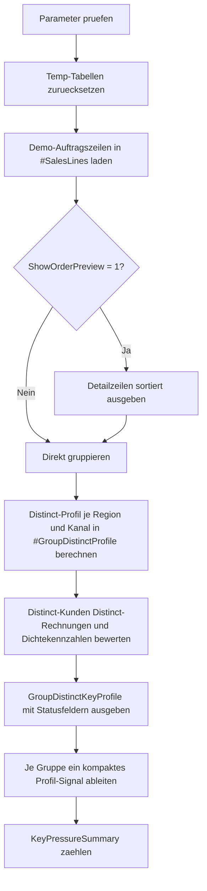

# AggregateDistinctKeyProfile.sql

Dieses didaktische Skript zeigt, wie sich die Zahl unterschiedlicher Schluesselwerte innerhalb aggregierter Gruppen messen laesst. Die Demo kombiniert `GROUP BY` mit `COUNT(DISTINCT ...)`, um pro Region und Kanal sichtbar zu machen, ob viele Zeilen auf wenige Rechnungen oder wenige Kunden entfallen.

## Uebersicht

<!-- SQLDOC:SUMMARY_TABLE:BEGIN -->
| Feld | Wert |
|---|---|
| Script | [AggregateDistinctKeyProfile.sql](AggregateDistinctKeyProfile.sql) |
| Version | `1.0` |
| Typ | `didactic-lab` |
| Kapitel | `10_GroupBy_Aggregate` |
| Sicherheit | `read-only-tempdb` |
| Zweck | Profiliert je Gruppe unterschiedliche Kunden, Rechnungen und Kategorien und leitet daraus Distinct-Signale ab. |
<!-- SQLDOC:SUMMARY_TABLE:END -->

## Einordnung

Das Artefakt verbindet drei eng zusammenhaengende Aggregate-Fragen:

- Wie viele Detailzeilen hat eine Gruppe insgesamt?
- Wie viele unterschiedliche Schluesselwerte stehen hinter diesen Zeilen?
- Verdichten sich viele Zeilen auf wenige Rechnungen oder wenige Kunden?

Dadurch eignet sich das Skript fuer erste Datenprofiling-Aufgaben, fuer Unterricht zu `COUNT(DISTINCT ...)` und fuer die Vorbereitung spaeterer Plausibilitaetschecks auf Gruppenebene.

## Annahmen

- Die Erstversion verwendet eine lokale Temp-Tabelle `#SalesLines` statt produktiver Verkaufs- oder Faktendaten.
- Gruppen werden bewusst ueber `SalesRegion` und `SalesChannel` gebildet; `InvoiceID`, `CustomerID` und `ProductCategory` dienen als zu profilierende Distinct-Schluessel.
- Mehrere Auftragszeilen pro Rechnung sind absichtlich modelliert, damit `LinesPerInvoice` Konzentrationseffekte sichtbar macht.
- Die Schwellwerte fuer minimale Distinct-Kunden und Distinct-Rechnungen sind didaktische Parameter und nicht aus Stammdaten abgeleitet.

## Anwendungsfall

Das Muster passt zu Reporting-, Audit- oder Datenqualitaets-Szenarien, in denen eine Gruppe zwar viele Zeilen enthaelt, aber moeglicherweise nur aus wenigen eigentlichen Geschaeftsobjekten besteht. In realen Umgebungen kann die Demoquelle spaeter durch Fakt- oder Bewegungsdaten ersetzt werden, waehrend die Distinct- und Dichtekennzahlen gleich bleiben.

## Parameter

<!-- SQLDOC:PARAMETERS_TABLE:BEGIN -->
| Parameter | SQL-Typ | Pflicht | Beschreibung |
|---|---|---|---|
| `@MinimumDistinctCustomers` | `INT` | Ja | Untergrenze fuer unterschiedliche Kunden je Gruppe. |
| `@MinimumDistinctInvoices` | `INT` | Ja | Untergrenze fuer unterschiedliche Rechnungen je Gruppe. |
| `@ShowOrderPreview` | `BIT` | Nein | Gibt bei `1` die Demo-Auftragszeilen vor der Verdichtung aus. |
<!-- SQLDOC:PARAMETERS_TABLE:END -->

## Abhaengigkeiten

<!-- SQLDOC:DEPENDENCIES_LIST:BEGIN -->
- `tempdb`
- `GROUP BY`
- `COUNT(DISTINCT ...)`
- `COUNT()`
- `CAST()`
- `CASE`
- `NULLIF()`
- `DROP TABLE IF EXISTS`
<!-- SQLDOC:DEPENDENCIES_LIST:END -->

## Hinweise

- `GroupDistinctKeyProfile` zeigt pro Gruppe sowohl absolute Distinct-Werte als auch Verdichtungskennzahlen wie `LinesPerInvoice`.
- `KeyPressureSummary` ordnet jede Gruppe genau einem kompakten Signal zu, damit sich auffaellige Muster schnell zaehlen lassen.
- Das Beispiel laesst sich leicht erweitern, etwa um Distinct-Profile fuer Tage, Wochen, Filialen oder Produktfamilien.

## Versionshistorie

<!-- SQLDOC:VERSION_HISTORY_TABLE:BEGIN -->
| Version | Datum | User | Beschreibung |
|---|---|---|---|
| `1.0` | `2026-04-18` | `ER` | Erstversion eines didaktischen Labs fuer Distinct-Key-Profile pro Aggregatgruppe |
<!-- SQLDOC:VERSION_HISTORY_TABLE:END -->

## Ablauf

<!-- SQLDOC:MERMAID:BEGIN -->

<!-- SQLDOC:MERMAID:END -->

## SQL-Code

<!-- SQLDOC:SQL_CODE:BEGIN -->
```sql
/*
BEGIN:SQL-HEADER v1
---
sql_header: v1
script_name: "AggregateDistinctKeyProfile.sql"
script_version: "1.0"
script_type: "didactic-lab"
chapter: "10_GroupBy_Aggregate"

purpose: >
  Profiliert innerhalb fachlicher Gruppen die Zahl unterschiedlicher
  Schluesselwerte wie Kunde, Rechnung und Produktkategorie und leitet
  daraus kompakte Hinweise auf Duplikat- oder Konzentrationsmuster ab.

parameters:
  - name: "@MinimumDistinctCustomers"
    sql_type: "INT"
    direction: "IN"
    required: true
    description: "Untergrenze fuer unterschiedliche Kunden je Gruppe"
  - name: "@MinimumDistinctInvoices"
    sql_type: "INT"
    direction: "IN"
    required: true
    description: "Untergrenze fuer unterschiedliche Rechnungen je Gruppe"
  - name: "@ShowOrderPreview"
    sql_type: "BIT"
    direction: "IN"
    required: false
    description: "1 = zeigt die Demo-Auftragszeilen vor der Verdichtung"

result_sets:
  - name: "OrderLinePreview"
    description: "Optionale Vorschau der Demo-Auftragszeilen mit Gruppenschluesseln"
  - name: "GroupDistinctKeyProfile"
    description: "Distinct-Profil je Kombination aus Region und Kanal"
  - name: "KeyPressureSummary"
    description: "Verdichtete Hinweise, welche Gruppen bei Distinct-Schluesseln auffaellig sind"

dependencies:
  - "tempdb"
  - "GROUP BY"
  - "COUNT(DISTINCT ...)"
  - "COUNT()"
  - "CAST()"
  - "CASE"
  - "NULLIF()"
  - "DROP TABLE IF EXISTS"

safety:
  level: "read-only-tempdb"
  writes_data: false

documentation:
  markdown_file: "T-SQL/10_GroupBy_Aggregate/SQLScripts/AggregateDistinctKeyProfile.md"
  sync_blocks:
    - "SUMMARY_TABLE"
    - "PARAMETERS_TABLE"
    - "DEPENDENCIES_LIST"
    - "VERSION_HISTORY_TABLE"
    - "SQL_CODE"
  mermaid:
    mode: "ai-agent-from-sql"
    source: "script-body"

main_responsible:
  name: "Erhard Rainer"
  initials: "ER"

version_history:
  - version: "1.0"
    date: "2026-04-18"
    user: "ER"
    description: "Erstversion eines didaktischen Labs fuer Distinct-Key-Profile pro Aggregatgruppe"

notes:
  - "Die Erstversion nutzt lokale Temp-Daten mit mehreren Auftragszeilen pro Rechnung"
  - "Distinct-Schluessel werden je Region und Kanal profiliert, um COUNT(DISTINCT ...) im Gruppenkontext zu zeigen"
---
END:SQL-HEADER v1
*/

SET NOCOUNT ON;

DECLARE @MinimumDistinctCustomers INT = 3;
DECLARE @MinimumDistinctInvoices INT = 3;
DECLARE @ShowOrderPreview BIT = 1;

IF @MinimumDistinctCustomers IS NULL OR @MinimumDistinctCustomers <= 0
BEGIN
    THROW 50000, '@MinimumDistinctCustomers muss groesser als 0 sein.', 1;
END;

IF @MinimumDistinctInvoices IS NULL OR @MinimumDistinctInvoices <= 0
BEGIN
    THROW 50001, '@MinimumDistinctInvoices muss groesser als 0 sein.', 1;
END;

IF @ShowOrderPreview NOT IN (0, 1)
BEGIN
    THROW 50002, '@ShowOrderPreview muss 0 oder 1 sein.', 1;
END;

DROP TABLE IF EXISTS #SalesLines;
DROP TABLE IF EXISTS #GroupDistinctProfile;

CREATE TABLE #SalesLines
(
    OrderLineID      INT             NOT NULL,
    InvoiceID        VARCHAR(20)     NOT NULL,
    CustomerID       VARCHAR(20)     NOT NULL,
    SalesRegion      VARCHAR(20)     NOT NULL,
    SalesChannel     VARCHAR(20)     NOT NULL,
    ProductCategory  VARCHAR(20)     NOT NULL,
    OrderDate        DATE            NOT NULL,
    LineAmount       DECIMAL(12,2)   NOT NULL
);

INSERT INTO #SalesLines
(
    OrderLineID,
    InvoiceID,
    CustomerID,
    SalesRegion,
    SalesChannel,
    ProductCategory,
    OrderDate,
    LineAmount
)
VALUES
    (3001, 'INV-1001', 'C-100', 'North', 'Online', 'Hardware', '2026-01-04', 420.00),
    (3002, 'INV-1001', 'C-100', 'North', 'Online', 'Service',  '2026-01-04',  90.00),
    (3003, 'INV-1002', 'C-101', 'North', 'Online', 'Hardware', '2026-01-08', 280.00),
    (3004, 'INV-1003', 'C-102', 'North', 'Retail', 'Training', '2026-01-11', 180.00),
    (3005, 'INV-1003', 'C-102', 'North', 'Retail', 'Service',  '2026-01-11',  75.00),
    (3006, 'INV-1004', 'C-103', 'North', 'Retail', 'Hardware', '2026-01-15', 340.00),
    (3007, 'INV-1005', 'C-200', 'South', 'Online', 'Hardware', '2026-02-02', 610.00),
    (3008, 'INV-1005', 'C-200', 'South', 'Online', 'Service',  '2026-02-02', 110.00),
    (3009, 'INV-1006', 'C-201', 'South', 'Online', 'Training', '2026-02-04', 220.00),
    (3010, 'INV-1007', 'C-201', 'South', 'Retail', 'Hardware', '2026-02-08', 390.00),
    (3011, 'INV-1008', 'C-202', 'South', 'Retail', 'Training', '2026-02-13', 205.00),
    (3012, 'INV-1008', 'C-202', 'South', 'Retail', 'Service',  '2026-02-13',  60.00),
    (3013, 'INV-1009', 'C-300', 'West',  'Online', 'Hardware', '2026-03-01', 930.00),
    (3014, 'INV-1010', 'C-300', 'West',  'Online', 'Hardware', '2026-03-05', 410.00),
    (3015, 'INV-1011', 'C-301', 'West',  'Online', 'Service',  '2026-03-05', 140.00),
    (3016, 'INV-1012', 'C-302', 'West',  'Retail', 'Training', '2026-03-09', 260.00),
    (3017, 'INV-1012', 'C-302', 'West',  'Retail', 'Service',  '2026-03-09',  85.00),
    (3018, 'INV-1013', 'C-303', 'West',  'Retail', 'Hardware', '2026-03-14', 510.00);

IF @ShowOrderPreview = 1
BEGIN
    SELECT
        sl.OrderLineID,
        sl.InvoiceID,
        sl.CustomerID,
        sl.SalesRegion,
        sl.SalesChannel,
        sl.ProductCategory,
        sl.OrderDate,
        sl.LineAmount
    FROM #SalesLines AS sl
    ORDER BY
        sl.SalesRegion,
        sl.SalesChannel,
        sl.InvoiceID,
        sl.OrderLineID;
END;

SELECT
    sl.SalesRegion,
    sl.SalesChannel,
    COUNT(*) AS OrderLineCount,
    COUNT(DISTINCT sl.InvoiceID) AS DistinctInvoiceCount,
    COUNT(DISTINCT sl.CustomerID) AS DistinctCustomerCount,
    COUNT(DISTINCT sl.ProductCategory) AS DistinctCategoryCount,
    CAST(COUNT(*) * 1.0 / NULLIF(COUNT(DISTINCT sl.InvoiceID), 0) AS DECIMAL(10,2)) AS LinesPerInvoice,
    CAST(COUNT(*) * 1.0 / NULLIF(COUNT(DISTINCT sl.CustomerID), 0) AS DECIMAL(10,2)) AS LinesPerCustomer,
    SUM(sl.LineAmount) AS TotalLineAmount
INTO #GroupDistinctProfile
FROM #SalesLines AS sl
GROUP BY
    sl.SalesRegion,
    sl.SalesChannel;

SELECT
    gdp.SalesRegion,
    gdp.SalesChannel,
    gdp.OrderLineCount,
    gdp.DistinctInvoiceCount,
    gdp.DistinctCustomerCount,
    gdp.DistinctCategoryCount,
    gdp.LinesPerInvoice,
    gdp.LinesPerCustomer,
    gdp.TotalLineAmount,
    CASE
        WHEN gdp.DistinctCustomerCount < @MinimumDistinctCustomers THEN 'review_customers'
        ELSE 'ok'
    END AS CustomerKeyStatus,
    CASE
        WHEN gdp.DistinctInvoiceCount < @MinimumDistinctInvoices THEN 'review_invoices'
        ELSE 'ok'
    END AS InvoiceKeyStatus,
    CASE
        WHEN gdp.LinesPerInvoice >= 2.00 THEN 'multi_line_concentration'
        WHEN gdp.LinesPerInvoice >= 1.50 THEN 'mixed_density'
        ELSE 'one_line_dominant'
    END AS InvoiceDensityClass
FROM #GroupDistinctProfile AS gdp
ORDER BY
    gdp.SalesRegion,
    gdp.SalesChannel;

SELECT
    CASE
        WHEN gdp.DistinctCustomerCount < @MinimumDistinctCustomers THEN 'BelowMinimumDistinctCustomers'
        WHEN gdp.DistinctInvoiceCount < @MinimumDistinctInvoices THEN 'BelowMinimumDistinctInvoices'
        WHEN gdp.LinesPerInvoice >= 2.00 THEN 'HighLinesPerInvoice'
        ELSE 'BalancedDistinctProfile'
    END AS ProfileSignal,
    COUNT(*) AS GroupCount,
    SUM(gdp.OrderLineCount) AS CoveredOrderLines
FROM #GroupDistinctProfile AS gdp
GROUP BY
    CASE
        WHEN gdp.DistinctCustomerCount < @MinimumDistinctCustomers THEN 'BelowMinimumDistinctCustomers'
        WHEN gdp.DistinctInvoiceCount < @MinimumDistinctInvoices THEN 'BelowMinimumDistinctInvoices'
        WHEN gdp.LinesPerInvoice >= 2.00 THEN 'HighLinesPerInvoice'
        ELSE 'BalancedDistinctProfile'
    END
ORDER BY
    ProfileSignal;
```
<!-- SQLDOC:SQL_CODE:END -->
