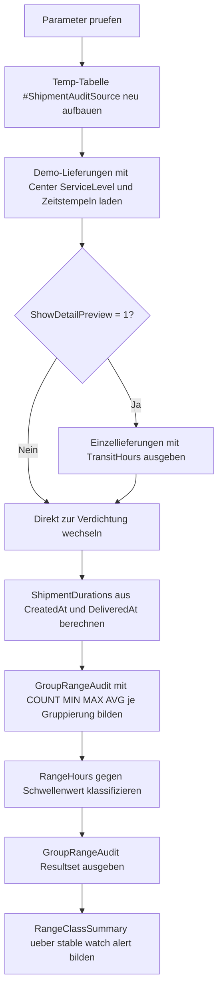

# AggregateMinMaxRangeAudit.sql

Dieses didaktische Skript zeigt, wie `MIN()` und `MAX()` pro Gruppierung zu einem kompakten Spannenaudit verbunden werden koennen. Die Demo wertet Lieferlaufzeiten je Kombination aus `DistributionCenter` und `ServiceLevel` aus und markiert Gruppen mit auffaellig breiter Spanne.

## Uebersicht

<!-- SQLDOC:SUMMARY_TABLE:BEGIN -->
| Feld | Wert |
|---|---|
| Script | [AggregateMinMaxRangeAudit.sql](AggregateMinMaxRangeAudit.sql) |
| Version | `1.0` |
| Typ | `didactic-lab` |
| Kapitel | `10_GroupBy_Aggregate` |
| Sicherheit | `read-only-tempdb` |
| Zweck | Auditiert Min/Max-Spannen je Gruppierung und kennzeichnet Gruppen mit auffaellig breiter Range. |
<!-- SQLDOC:SUMMARY_TABLE:END -->

## Einordnung

Das Artefakt verbindet einen typischen `GROUP BY`-Anwendungsfall mit einer einfachen Audit-Logik:

- Pro Gruppe wird eine untere und obere Grenze ueber `MIN()` und `MAX()` bestimmt.
- Aus beiden Werten entsteht eine fachlich lesbare Spannweite.
- Die Spannweite wird anschliessend gegen einen Schwellenwert klassifiziert.

Dadurch eignet sich das Skript fuer Unterricht, Datenprofiling und erste Service-Level-Pruefungen.

## Annahmen

- Die Erstversion nutzt eine lokale Temp-Tabelle mit Demo-Lieferungen statt produktiver Versanddaten.
- Die Gruppierung erfolgt ueber `DistributionCenter` und `ServiceLevel`, weil so stabile und auffaellige Spannen gut vergleichbar werden.
- Die Laufzeit wird als Differenz zwischen `CreatedAt` und `DeliveredAt` in Stunden modelliert.
- Die Klassifikation `stable`, `watch` und `alert` ist didaktisch ueber einen frei waehlbaren Schwellenwert definiert.

## Anwendungsfall

Das Muster passt zu Szenarien, in denen Gruppen auf Spreizung oder Ausreisser hin beobachtet werden sollen, etwa bei Lieferzeiten, Bearbeitungsdauern oder Reaktionszeiten. In produktiven Umgebungen kann die Demoquelle spaeter durch Bewegungsdaten ersetzt werden, ohne die Kernlogik des Range-Audits neu aufzubauen.

## Parameter

<!-- SQLDOC:PARAMETERS_TABLE:BEGIN -->
| Parameter | SQL-Typ | Pflicht | Beschreibung |
|---|---|---|---|
| `@RangeAlertThresholdHours` | `DECIMAL(10,2)` | Ja | Schwellenwert in Stunden, ab dem eine Gruppenspanne als auffaellig markiert wird. |
| `@ShowDetailPreview` | `BIT` | Nein | Gibt bei `1` die einzelnen Demo-Lieferungen mit berechneter Laufzeit aus. |
<!-- SQLDOC:PARAMETERS_TABLE:END -->

## Abhaengigkeiten

<!-- SQLDOC:DEPENDENCIES_LIST:BEGIN -->
- `tempdb`
- `GROUP BY`
- `MIN()`
- `MAX()`
- `AVG()`
- `COUNT()`
- `DATEDIFF()`
- `CASE`
- `CAST()`
- `DROP TABLE IF EXISTS`
<!-- SQLDOC:DEPENDENCIES_LIST:END -->

## Hinweise

- `GroupRangeAudit` zeigt je Gruppe Anzahl, Minimum, Maximum, Durchschnitt und Spannweite.
- `RangeClassSummary` verdichtet die Klassen `stable`, `watch` und `alert` zu einer Gesamtuebersicht.
- Der optionale Detail-Preview macht nachvollziehbar, aus welchen Einzelwerten die Min/Max-Spannen entstehen.

## Versionshistorie

<!-- SQLDOC:VERSION_HISTORY_TABLE:BEGIN -->
| Version | Datum | User | Beschreibung |
|---|---|---|---|
| `1.0` | `2026-04-18` | `ER` | Erstversion eines didaktischen Audits fuer Min/Max-Spannen je Gruppierung |
<!-- SQLDOC:VERSION_HISTORY_TABLE:END -->

## Ablauf

<!-- SQLDOC:MERMAID:BEGIN -->

<!-- SQLDOC:MERMAID:END -->

## SQL-Code

<!-- SQLDOC:SQL_CODE:BEGIN -->
```sql
/*
BEGIN:SQL-HEADER v1
---
sql_header: v1
script_name: "AggregateMinMaxRangeAudit.sql"
script_version: "1.0"
script_type: "didactic-lab"
chapter: "10_GroupBy_Aggregate"

purpose: >
  Auditiert Min/Max-Spannen je Gruppierung, berechnet daraus Range-Kennzahlen
  und markiert Gruppen mit auffaellig breiter Streuung in einer didaktischen
  Demo-Datenbasis.

parameters:
  - name: "@RangeAlertThresholdHours"
    sql_type: "DECIMAL(10,2)"
    direction: "IN"
    required: true
    description: "Schwellenwert in Stunden, ab dem eine Gruppenspanne als auffaellig markiert wird"
  - name: "@ShowDetailPreview"
    sql_type: "BIT"
    direction: "IN"
    required: false
    description: "1 = zeigt die einzelnen Demo-Lieferungen vor der Verdichtung"

result_sets:
  - name: "ShipmentDetailPreview"
    description: "Optionale Vorschau der einzelnen Demo-Lieferungen mit Laufzeit in Stunden"
  - name: "GroupRangeAudit"
    description: "Min/Max-Audit je Kombination aus DistributionCenter und ServiceLevel"
  - name: "RangeClassSummary"
    description: "Zaehlt, wie viele Gruppen in welche Range-Klasse fallen"

dependencies:
  - "tempdb"
  - "GROUP BY"
  - "MIN()"
  - "MAX()"
  - "AVG()"
  - "COUNT()"
  - "DATEDIFF()"
  - "CASE"
  - "CAST()"
  - "DROP TABLE IF EXISTS"

safety:
  level: "read-only-tempdb"
  writes_data: false

documentation:
  markdown_file: "T-SQL/10_GroupBy_Aggregate/SQLScripts/AggregateMinMaxRangeAudit.md"
  sync_blocks:
    - "SUMMARY_TABLE"
    - "PARAMETERS_TABLE"
    - "DEPENDENCIES_LIST"
    - "VERSION_HISTORY_TABLE"
    - "SQL_CODE"
  mermaid:
    mode: "ai-agent-from-sql"
    source: "script-body"

main_responsible:
  name: "Erhard Rainer"
  initials: "ER"

version_history:
  - version: "1.0"
    date: "2026-04-18"
    user: "ER"
    description: "Erstversion eines didaktischen Audits fuer Min/Max-Spannen je Gruppierung"

notes:
  - "Die Erstversion nutzt lokale Temp-Daten statt produktiver Versand- oder Prozessdaten"
  - "Die Gruppierung erfolgt ueber DistributionCenter und ServiceLevel, um Unterschiede im Serviceprofil sichtbar zu machen"
---
END:SQL-HEADER v1
*/

SET NOCOUNT ON;

DECLARE @RangeAlertThresholdHours DECIMAL(10,2) = 18.00;
DECLARE @ShowDetailPreview BIT = 1;

IF @RangeAlertThresholdHours IS NULL OR @RangeAlertThresholdHours <= 0
BEGIN
    THROW 50000, '@RangeAlertThresholdHours muss groesser als 0 sein.', 1;
END;

IF @ShowDetailPreview NOT IN (0, 1)
BEGIN
    THROW 50001, '@ShowDetailPreview muss 0 oder 1 sein.', 1;
END;

DROP TABLE IF EXISTS #ShipmentAuditSource;

CREATE TABLE #ShipmentAuditSource
(
    ShipmentID          INT             NOT NULL,
    DistributionCenter  VARCHAR(20)     NOT NULL,
    ServiceLevel        VARCHAR(20)     NOT NULL,
    RouteCode           VARCHAR(20)     NOT NULL,
    CreatedAt           DATETIME2(0)    NOT NULL,
    DeliveredAt         DATETIME2(0)    NOT NULL
);

INSERT INTO #ShipmentAuditSource
(
    ShipmentID,
    DistributionCenter,
    ServiceLevel,
    RouteCode,
    CreatedAt,
    DeliveredAt
)
VALUES
    (5001, 'Berlin',  'Express',  'BER-A1', '2026-03-01 06:00:00', '2026-03-01 11:00:00'),
    (5002, 'Berlin',  'Express',  'BER-A2', '2026-03-01 07:30:00', '2026-03-01 13:30:00'),
    (5003, 'Berlin',  'Express',  'BER-A3', '2026-03-02 06:15:00', '2026-03-02 12:45:00'),
    (5004, 'Berlin',  'Standard', 'BER-B1', '2026-03-01 08:00:00', '2026-03-02 02:00:00'),
    (5005, 'Berlin',  'Standard', 'BER-B2', '2026-03-01 09:00:00', '2026-03-02 08:00:00'),
    (5006, 'Berlin',  'Standard', 'BER-B3', '2026-03-02 10:00:00', '2026-03-03 12:00:00'),
    (5007, 'Hamburg', 'Express',  'HAM-A1', '2026-03-03 05:45:00', '2026-03-03 10:15:00'),
    (5008, 'Hamburg', 'Express',  'HAM-A2', '2026-03-03 06:00:00', '2026-03-03 10:00:00'),
    (5009, 'Hamburg', 'Standard', 'HAM-B1', '2026-03-03 07:00:00', '2026-03-03 21:00:00'),
    (5010, 'Hamburg', 'Standard', 'HAM-B2', '2026-03-03 08:30:00', '2026-03-04 07:30:00'),
    (5011, 'Munich',  'Express',  'MUC-A1', '2026-03-04 06:00:00', '2026-03-04 15:00:00'),
    (5012, 'Munich',  'Express',  'MUC-A2', '2026-03-04 06:30:00', '2026-03-04 19:30:00'),
    (5013, 'Munich',  'Standard', 'MUC-B1', '2026-03-04 08:00:00', '2026-03-05 12:00:00'),
    (5014, 'Munich',  'Standard', 'MUC-B2', '2026-03-04 08:15:00', '2026-03-06 00:15:00'),
    (5015, 'Munich',  'Standard', 'MUC-B3', '2026-03-05 09:00:00', '2026-03-06 21:00:00');

IF @ShowDetailPreview = 1
BEGIN
    SELECT
        sas.ShipmentID,
        sas.DistributionCenter,
        sas.ServiceLevel,
        sas.RouteCode,
        sas.CreatedAt,
        sas.DeliveredAt,
        CAST(DATEDIFF(MINUTE, sas.CreatedAt, sas.DeliveredAt) / 60.0 AS DECIMAL(10,2)) AS TransitHours
    FROM #ShipmentAuditSource AS sas
    ORDER BY
        sas.DistributionCenter,
        sas.ServiceLevel,
        sas.CreatedAt,
        sas.ShipmentID;
END;

;WITH ShipmentDurations AS
(
    SELECT
        sas.ShipmentID,
        sas.DistributionCenter,
        sas.ServiceLevel,
        sas.RouteCode,
        CAST(DATEDIFF(MINUTE, sas.CreatedAt, sas.DeliveredAt) / 60.0 AS DECIMAL(10,2)) AS TransitHours
    FROM #ShipmentAuditSource AS sas
),
GroupRangeAudit AS
(
    SELECT
        sd.DistributionCenter,
        sd.ServiceLevel,
        COUNT(*) AS ShipmentCount,
        MIN(sd.TransitHours) AS MinTransitHours,
        MAX(sd.TransitHours) AS MaxTransitHours,
        CAST(MAX(sd.TransitHours) - MIN(sd.TransitHours) AS DECIMAL(10,2)) AS RangeHours,
        AVG(sd.TransitHours) AS AvgTransitHours
    FROM ShipmentDurations AS sd
    GROUP BY
        sd.DistributionCenter,
        sd.ServiceLevel
)
SELECT
    gra.DistributionCenter,
    gra.ServiceLevel,
    gra.ShipmentCount,
    gra.MinTransitHours,
    gra.MaxTransitHours,
    gra.RangeHours,
    CAST(gra.AvgTransitHours AS DECIMAL(10,2)) AS AvgTransitHours,
    CASE
        WHEN gra.RangeHours >= @RangeAlertThresholdHours THEN 'alert'
        WHEN gra.RangeHours >= @RangeAlertThresholdHours * 0.50 THEN 'watch'
        ELSE 'stable'
    END AS RangeClass
FROM GroupRangeAudit AS gra
ORDER BY
    gra.RangeHours DESC,
    gra.DistributionCenter,
    gra.ServiceLevel;

;WITH ShipmentDurations AS
(
    SELECT
        sas.DistributionCenter,
        sas.ServiceLevel,
        CAST(DATEDIFF(MINUTE, sas.CreatedAt, sas.DeliveredAt) / 60.0 AS DECIMAL(10,2)) AS TransitHours
    FROM #ShipmentAuditSource AS sas
),
GroupRangeAudit AS
(
    SELECT
        sd.DistributionCenter,
        sd.ServiceLevel,
        CAST(MAX(sd.TransitHours) - MIN(sd.TransitHours) AS DECIMAL(10,2)) AS RangeHours
    FROM ShipmentDurations AS sd
    GROUP BY
        sd.DistributionCenter,
        sd.ServiceLevel
),
RangeClassified AS
(
    SELECT
        CASE
            WHEN gra.RangeHours >= @RangeAlertThresholdHours THEN 'alert'
            WHEN gra.RangeHours >= @RangeAlertThresholdHours * 0.50 THEN 'watch'
            ELSE 'stable'
        END AS RangeClass
    FROM GroupRangeAudit AS gra
)
SELECT
    rc.RangeClass,
    COUNT(*) AS GroupCount
FROM RangeClassified AS rc
GROUP BY
    rc.RangeClass
ORDER BY
    GroupCount DESC,
    rc.RangeClass;
```
<!-- SQLDOC:SQL_CODE:END -->
