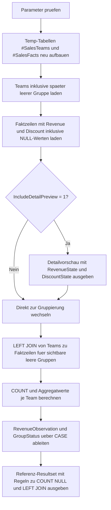

# AggregateNullHandling.sql

Dieses didaktische Skript zeigt, wie sich `COUNT`, `SUM`, `AVG`, `MIN` und `MAX` bei `NULL`-Werten verhalten und warum leere Gruppen meist erst durch einen `LEFT JOIN` auf eine vollstaendige Gruppendimension sichtbar werden. Die Demo bleibt bewusst in `tempdb`, damit sich `NULL`-Effekte und Platzhalterzeilen ohne produktiven Kontext nachvollziehen lassen.

## Uebersicht

<!-- SQLDOC:SUMMARY_TABLE:BEGIN -->
| Feld | Wert |
|---|---|
| Script | [AggregateNullHandling.sql](AggregateNullHandling.sql) |
| Version | `1.0` |
| Typ | `didactic-lab` |
| Kapitel | `10_GroupBy_Aggregate` |
| Sicherheit | `read-only-tempdb` |
| Zweck | Demonstriert NULL-Verhalten bei Aggregaten und die Sichtbarkeit leerer Gruppen ueber `LEFT JOIN`. |
<!-- SQLDOC:SUMMARY_TABLE:END -->

## Einordnung

Das Skript kombiniert zwei typische Lernfragen:

- Was genau ist der Unterschied zwischen `COUNT(*)` und `COUNT(column)`?
- Warum liefern manche Gruppen trotz sichtbarer Gruppenzeile bei `SUM` oder `AVG` dennoch `NULL`?

Durch die Trennung von Teamdimension und Faktzeilen wird deutlich, dass eine Gruppe fachlich existieren kann, auch wenn keine Detailzeile vorhanden ist. Genau dieser Fall fuehrt in Reports haeufig zu Missverstaendnissen.

## Annahmen

- Die Erstversion verwendet `#SalesTeams` als kleine Gruppendimension und `#SalesFacts` als didaktische Faktbasis.
- `West Delta` besitzt absichtlich keine Faktzeilen, damit eine leere Gruppe ueber den `LEFT JOIN` sichtbar wird.
- `East Epsilon` besitzt Faktzeilen, aber absichtlich nur `NULL` in `RevenueAmount`, damit sich leere Gruppen und rein NULL-belegte Wertegruppen unterscheiden lassen.
- Mehrere Faktzeilen enthalten `NULL` in `RevenueAmount` oder `DiscountAmount`, um den Unterschied zwischen Zeilenanzahl und Werteanzahl sichtbar zu machen.
- `COALESCE(SUM(...), 0.00)` wird nur als Vergleichsspalte gezeigt und nicht als einzig richtige Berichtsdarstellung behauptet.

## Anwendungsfall

Das Artefakt eignet sich fuer Schulung, SQL-Reviews und Reporting-Prototypen, wenn unklar ist, ob eine Kennzahl wegen fehlender Zeilen, wegen ausschliesslich `NULL`-Werten oder wegen einer ungeeigneten Aggregatfunktion leer erscheint. Die Struktur kann spaeter auf echte Dimensions- und Faktentabellen uebertragen werden.

## Parameter

<!-- SQLDOC:PARAMETERS_TABLE:BEGIN -->
| Parameter | SQL-Typ | Pflicht | Beschreibung |
|---|---|---|---|
| `@IncludeDetailPreview` | `BIT` | Nein | Gibt bei `1` die Demo-Zeilen mit markierten `NULL`-Zustaenden vor der Aggregation aus. |
| `@HighlightInactiveGroups` | `BIT` | Nein | Markiert Gruppen ohne Faktzeilen oder mit vorhandenen Faktzeilen explizit im Aggregat-Resultset. |
<!-- SQLDOC:PARAMETERS_TABLE:END -->

## Abhaengigkeiten

<!-- SQLDOC:DEPENDENCIES_LIST:BEGIN -->
- `tempdb`
- `LEFT JOIN`
- `GROUP BY`
- `COUNT()`
- `SUM()`
- `AVG()`
- `MIN()`
- `MAX()`
- `CASE`
- `COALESCE()`
- `DROP TABLE IF EXISTS`
<!-- SQLDOC:DEPENDENCIES_LIST:END -->

## Hinweise

- `JoinedRows` zeigt beim `LEFT JOIN`, dass auch fuer eine leere Gruppe eine Join-Zeile entstehen kann.
- `FactRows` zaehlt nur Gruppen mit echter Faktbasis, weil `COUNT(sf.OrderMonth)` Platzhalter ohne Match ignoriert.
- `RevenueObservation` trennt sauber zwischen leeren Gruppen und Gruppen mit Zeilen, aber ausschliesslich `NULL` in `RevenueAmount`.

## Versionshistorie

<!-- SQLDOC:VERSION_HISTORY_TABLE:BEGIN -->
| Version | Datum | User | Beschreibung |
|---|---|---|---|
| `1.0` | `2026-04-18` | `ER` | Erstversion eines didaktischen Labs fuer NULL-Verhalten in Aggregaten und leeren Gruppen |
<!-- SQLDOC:VERSION_HISTORY_TABLE:END -->

## Ablauf

<!-- SQLDOC:MERMAID:BEGIN -->

<!-- SQLDOC:MERMAID:END -->

## SQL-Code

<!-- SQLDOC:SQL_CODE:BEGIN -->
```sql
/*
BEGIN:SQL-HEADER v1
---
sql_header: v1
script_name: "AggregateNullHandling.sql"
script_version: "1.0"
script_type: "didactic-lab"
chapter: "10_GroupBy_Aggregate"

purpose: >
  Demonstriert das Verhalten von COUNT, SUM, AVG, MIN und MAX bei NULL-Werten
  sowie bei Gruppen ohne passende Detailzeilen.

parameters:
  - name: "@IncludeDetailPreview"
    sql_type: "BIT"
    direction: "IN"
    required: false
    description: "1 = zeigt die Demo-Daten mit markierten NULL-Werten vor der Aggregation"
  - name: "@HighlightInactiveGroups"
    sql_type: "BIT"
    direction: "IN"
    required: false
    description: "1 = markiert Gruppen ohne aktive Umsatzzeilen explizit im Ergebnis"

result_sets:
  - name: "SalesDetailPreview"
    description: "Optionale Vorschau der Demo-Daten mit NULL-Werten und Teamzuordnung"
  - name: "NullHandlingByTeam"
    description: "Zeigt je Team den Unterschied zwischen COUNT(*), COUNT(Spalte) und Aggregaten ueber NULL-Werte"
  - name: "AggregateBehaviorReference"
    description: "Kompakte Referenz zu den beobachteten Regeln fuer NULL und leere Gruppen"

dependencies:
  - "tempdb"
  - "LEFT JOIN"
  - "GROUP BY"
  - "COUNT()"
  - "SUM()"
  - "AVG()"
  - "MIN()"
  - "MAX()"
  - "CASE"
  - "COALESCE()"
  - "DROP TABLE IF EXISTS"

safety:
  level: "read-only-tempdb"
  writes_data: false

documentation:
  markdown_file: "T-SQL/10_GroupBy_Aggregate/SQLScripts/AggregateNullHandling.md"
  sync_blocks:
    - "SUMMARY_TABLE"
    - "PARAMETERS_TABLE"
    - "DEPENDENCIES_LIST"
    - "VERSION_HISTORY_TABLE"
    - "SQL_CODE"
  mermaid:
    mode: "ai-agent-from-sql"
    source: "script-body"

main_responsible:
  name: "Erhard Rainer"
  initials: "ER"

version_history:
  - version: "1.0"
    date: "2026-04-18"
    user: "ER"
    description: "Erstversion eines didaktischen Labs fuer NULL-Verhalten in Aggregaten und leeren Gruppen"

notes:
  - "Die Erstversion verwendet lokale Temp-Tabellen fuer Teams und Umsatzzeilen"
  - "Leere Gruppen werden ueber LEFT JOIN von #SalesTeams zu #SalesFacts sichtbar gemacht"
---
END:SQL-HEADER v1
*/

SET NOCOUNT ON;

DECLARE @IncludeDetailPreview BIT = 1;
DECLARE @HighlightInactiveGroups BIT = 1;

IF @IncludeDetailPreview NOT IN (0, 1)
BEGIN
    THROW 50000, '@IncludeDetailPreview muss 0 oder 1 sein.', 1;
END;

IF @HighlightInactiveGroups NOT IN (0, 1)
BEGIN
    THROW 50001, '@HighlightInactiveGroups muss 0 oder 1 sein.', 1;
END;

DROP TABLE IF EXISTS #SalesTeams;
DROP TABLE IF EXISTS #SalesFacts;

CREATE TABLE #SalesTeams
(
    TeamID       INT          NOT NULL,
    TeamName     VARCHAR(30)  NOT NULL,
    RegionName   VARCHAR(20)  NOT NULL
);

CREATE TABLE #SalesFacts
(
    TeamID         INT             NOT NULL,
    OrderMonth     DATE            NOT NULL,
    OrderCount     INT             NULL,
    RevenueAmount  DECIMAL(12,2)   NULL,
    DiscountAmount DECIMAL(12,2)   NULL
);

INSERT INTO #SalesTeams
(
    TeamID,
    TeamName,
    RegionName
)
VALUES
    (1, 'North Alpha', 'North'),
    (2, 'North Beta',  'North'),
    (3, 'South Gamma', 'South'),
    (4, 'West Delta',  'West'),
    (5, 'East Epsilon', 'East');

INSERT INTO #SalesFacts
(
    TeamID,
    OrderMonth,
    OrderCount,
    RevenueAmount,
    DiscountAmount
)
VALUES
    (1, '2026-01-01', 12, 2400.00, 120.00),
    (1, '2026-02-01', 10, NULL,    90.00),
    (1, '2026-03-01', 14, 3150.00, NULL),
    (2, '2026-01-01',  8, 1650.00, 70.00),
    (2, '2026-02-01',  0, NULL,    NULL),
    (2, '2026-03-01',  7, 1490.00, 55.00),
    (3, '2026-01-01', 11, 2100.00, 110.00),
    (3, '2026-02-01',  9, 1980.00, NULL),
    (3, '2026-03-01', 13, NULL,    65.00),
    (5, '2026-01-01',  6, NULL,    40.00),
    (5, '2026-02-01',  5, NULL,    NULL);

IF @IncludeDetailPreview = 1
BEGIN
    SELECT
        st.TeamName,
        st.RegionName,
        sf.OrderMonth,
        sf.OrderCount,
        sf.RevenueAmount,
        sf.DiscountAmount,
        CASE
            WHEN sf.RevenueAmount IS NULL THEN 'RevenueIsNull'
            ELSE 'RevenuePresent'
        END AS RevenueState,
        CASE
            WHEN sf.DiscountAmount IS NULL THEN 'DiscountIsNull'
            ELSE 'DiscountPresent'
        END AS DiscountState
    FROM #SalesTeams AS st
    LEFT JOIN #SalesFacts AS sf
        ON sf.TeamID = st.TeamID
    ORDER BY
        st.TeamID,
        sf.OrderMonth;
END;

SELECT
    st.TeamName,
    st.RegionName,
    COUNT(*) AS JoinedRows,
    COUNT(sf.OrderMonth) AS FactRows,
    COUNT(sf.RevenueAmount) AS RevenueValueCount,
    COUNT(sf.DiscountAmount) AS DiscountValueCount,
    SUM(sf.RevenueAmount) AS RevenueSumIgnoringNulls,
    AVG(sf.RevenueAmount) AS RevenueAverageIgnoringNulls,
    MIN(sf.RevenueAmount) AS RevenueMinimumIgnoringNulls,
    MAX(sf.RevenueAmount) AS RevenueMaximumIgnoringNulls,
    SUM(sf.DiscountAmount) AS DiscountSumIgnoringNulls,
    AVG(sf.DiscountAmount) AS DiscountAverageIgnoringNulls,
    COALESCE(SUM(sf.RevenueAmount), 0.00) AS RevenueSumWithFallback,
    CASE
        WHEN COUNT(sf.OrderMonth) = 0 THEN 'no_fact_rows'
        WHEN COUNT(sf.RevenueAmount) = 0 THEN 'fact_rows_but_all_revenue_null'
        ELSE 'revenue_values_present'
    END AS RevenueObservation,
    CASE
        WHEN @HighlightInactiveGroups = 1 AND COUNT(sf.OrderMonth) = 0 THEN 'empty_group_visible_via_left_join'
        WHEN @HighlightInactiveGroups = 1 AND COUNT(sf.OrderMonth) > 0 THEN 'group_has_fact_rows'
        ELSE 'highlight_disabled'
    END AS GroupStatus
FROM #SalesTeams AS st
LEFT JOIN #SalesFacts AS sf
    ON sf.TeamID = st.TeamID
GROUP BY
    st.TeamName,
    st.RegionName
ORDER BY
    st.RegionName,
    st.TeamName;

SELECT
    RuleLabel,
    ObservedBehavior,
    ConsequenceForReports
FROM
(
    VALUES
        (
            'COUNT(*)',
            'Zaehlt nach dem LEFT JOIN auch die Platzhalterzeile einer leeren Gruppe.',
            'Fuer echte Faktzeilen besser COUNT(sf.OrderMonth) oder COUNT(PrimaryKey) verwenden.'
        ),
        (
            'COUNT(column)',
            'Zaehlt nur nicht-NULL Werte der angegebenen Spalte.',
            'Geeignet, um belegte Werte getrennt von vorhandenen Zeilen zu betrachten.'
        ),
        (
            'SUM/AVG/MIN/MAX',
            'Ignorieren NULL-Eintraege, liefern aber bei ausschliesslich NULL oder ohne Faktzeile selbst NULL.',
            'Oft ist COALESCE fuer Berichtsspalten oder Kennzahlenvergleich sinnvoll.'
        ),
        (
            'LEFT JOIN mit Dimension',
            'Macht Teams ohne Detaildaten als leere Gruppe sichtbar.',
            'Hilfreich fuer Vollstaendigkeitspruefungen und Zero-Activity-Reports.'
        )
) AS reference_data
(
    RuleLabel,
    ObservedBehavior,
    ConsequenceForReports
)
ORDER BY
    RuleLabel;
```
<!-- SQLDOC:SQL_CODE:END -->
