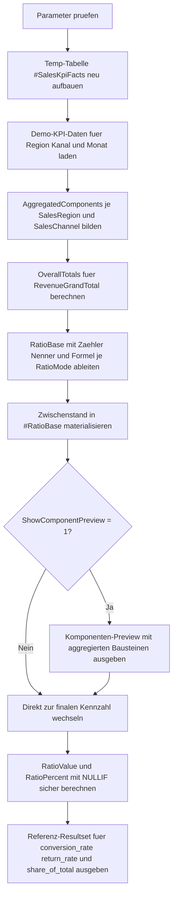

# AggregateRatioTemplate.sql

Dieses Artefakt zeigt ein didaktisches Template fuer Quoten und Verhaeltnisse auf Aggregatbasis. Der Schwerpunkt liegt darauf, Zaehler und Nenner zuerst je Gruppe sauber zu verdichten und die eigentliche Quote erst danach mit `NULLIF` und einer klaren Formel zu berechnen.

## Uebersicht

<!-- SQLDOC:SUMMARY_TABLE:BEGIN -->
| Feld | Wert |
|---|---|
| Script | [AggregateRatioTemplate.sql](AggregateRatioTemplate.sql) |
| Version | `1.0` |
| Typ | `template` |
| Kapitel | `10_GroupBy_Aggregate` |
| Sicherheit | `read-only-tempdb` |
| Zweck | Template fuer Quoten und Verhaeltnisse, bei dem aggregierte Komponenten zuerst vorbereitet und danach sicher berechnet werden. |
<!-- SQLDOC:SUMMARY_TABLE:END -->

## Einordnung

Viele fehlerhafte KPI-Abfragen entstehen dadurch, dass Quotennumerik direkt auf Einzelzeilen vermischt wird oder der Nenner nicht zur fachlichen Ebene der Gruppierung passt. Dieses Template trennt die Schritte deshalb bewusst:

- Faktbasis bereitstellen
- Komponenten je Gruppe aggregieren
- Quotenformel je Modus festlegen
- finale Kennzahl aus Zaehler und Nenner berechnen

Damit eignet sich das Skript als Muster fuer Conversion Rates, Retourenquoten oder Umsatzanteile.

## Annahmen

- Die Erstversion verwendet `#SalesKpiFacts` als didaktische Monatsbasis statt produktiver Faktentabellen.
- `conversion_rate` berechnet `Orders / Leads`, `return_rate` berechnet `Returns / Orders`, und `share_of_total` berechnet `Revenue / TotalRevenue`.
- Die Beispielwerte sind bewusst klein und konsistent gehalten, damit sich Zaehler und Nenner pro Gruppe leicht nachvollziehen lassen.
- `InterpretationHint` ist nur eine didaktische Lesart und keine allgemeingueltige Businessregel.
- Das Template kann spaeter auf reale CTEs, Views oder Faktentabellen umgestellt werden, ohne die Grundstruktur der Quotenberechnung zu verlieren.

## Anwendungsfall

Das Skript eignet sich fuer Schulung, Reviews und Reporting-Prototypen, wenn Kennzahlen als Verhaeltnis zweier Aggregatgroessen formuliert werden sollen. Typische Folgeschritte sind das Ersetzen der Temp-Datenbasis durch reale Quellen, das Erweitern um weitere Gruppierungsdimensionen oder das Einbetten in eine View bzw. Stored Procedure.

## Parameter

<!-- SQLDOC:PARAMETERS_TABLE:BEGIN -->
| Parameter | SQL-Typ | Pflicht | Beschreibung |
|---|---|---|---|
| `@RatioMode` | `VARCHAR(30)` | Ja | Waehlt den Berechnungsmodus `conversion_rate`, `return_rate` oder `share_of_total`. |
| `@ShowComponentPreview` | `BIT` | Nein | Gibt bei `1` die vorbereiteten Zaehler- und Nennerkomponenten vor der finalen Quotenberechnung aus. |
<!-- SQLDOC:PARAMETERS_TABLE:END -->

## Abhaengigkeiten

<!-- SQLDOC:DEPENDENCIES_LIST:BEGIN -->
- `tempdb`
- `GROUP BY`
- `SUM()`
- `COUNT()`
- `CASE`
- `NULLIF()`
- `CROSS JOIN`
- `DROP TABLE IF EXISTS`
<!-- SQLDOC:DEPENDENCIES_LIST:END -->

## Hinweise

- `AggregatedComponents` trennt die fachliche Gruppierung sauber von der spaeteren Quotendefinition.
- `OverallTotals` wird nur fuer `share_of_total` benoetigt und zeigt ein haeufiges Muster fuer Anteilskennzahlen.
- `#RatioBase` materialisiert die Zwischenstufe, damit Preview und Endergebnis dieselben Komponenten verwenden.
- Das eigentliche Verhaeltnis wird erst im finalen `SELECT` berechnet; dadurch bleiben Zaehler, Nenner und Formel nachvollziehbar.

## Versionshistorie

<!-- SQLDOC:VERSION_HISTORY_TABLE:BEGIN -->
| Version | Datum | User | Beschreibung |
|---|---|---|---|
| `1.0` | `2026-04-18` | `ER` | Erstversion eines Templates fuer Quoten und Verhaeltnisse auf Aggregatbasis |
<!-- SQLDOC:VERSION_HISTORY_TABLE:END -->

## Ablauf

<!-- SQLDOC:MERMAID:BEGIN -->

<!-- SQLDOC:MERMAID:END -->

## SQL-Code

<!-- SQLDOC:SQL_CODE:BEGIN -->
```sql
/*
BEGIN:SQL-HEADER v1
---
sql_header: v1
script_name: "AggregateRatioTemplate.sql"
script_version: "1.0"
script_type: "template"
chapter: "10_GroupBy_Aggregate"

purpose: >
  Zeigt ein didaktisches Template fuer Quoten und Verhaeltnisse auf
  Aggregatbasis, bei dem Zaehler und Nenner zuerst je Gruppe verdichtet und
  danach sicher als Kennzahl berechnet werden.

parameters:
  - name: "@RatioMode"
    sql_type: "VARCHAR(30)"
    direction: "IN"
    required: true
    description: "Steuert, ob Conversion Rate, Return Rate oder Share of Total berechnet wird"
  - name: "@ShowComponentPreview"
    sql_type: "BIT"
    direction: "IN"
    required: false
    description: "1 = zeigt die vorbereiteten Zaehler- und Nennerbausteine vor der finalen Quotenberechnung"

result_sets:
  - name: "RatioComponentPreview"
    description: "Optionale Vorschau der je Gruppe verdichteten Komponenten fuer Zaehler und Nenner"
  - name: "AggregateRatioResult"
    description: "Finale Quoten- oder Verhaeltniskalkulation je SalesRegion und SalesChannel"
  - name: "RatioModeReference"
    description: "Didaktische Referenz, welcher Modus welchen Zaehler und Nenner verwendet"

dependencies:
  - "tempdb"
  - "GROUP BY"
  - "SUM()"
  - "COUNT()"
  - "CASE"
  - "NULLIF()"
  - "CROSS JOIN"
  - "DROP TABLE IF EXISTS"

safety:
  level: "read-only-tempdb"
  writes_data: false

documentation:
  markdown_file: "T-SQL/10_GroupBy_Aggregate/SQLScripts/AggregateRatioTemplate.md"
  sync_blocks:
    - "SUMMARY_TABLE"
    - "PARAMETERS_TABLE"
    - "DEPENDENCIES_LIST"
    - "VERSION_HISTORY_TABLE"
    - "SQL_CODE"
  mermaid:
    mode: "ai-agent-from-sql"
    source: "script-body"

main_responsible:
  name: "Erhard Rainer"
  initials: "ER"

version_history:
  - version: "1.0"
    date: "2026-04-18"
    user: "ER"
    description: "Erstversion eines Templates fuer Quoten und Verhaeltnisse auf Aggregatbasis"

notes:
  - "Die Erstversion nutzt lokale Temp-Daten fuer Leads, Orders und Retouren statt produktiver Faktentabellen"
  - "Quoten werden immer aus zuvor aggregierten Komponenten und mit NULLIF im Nenner berechnet"
---
END:SQL-HEADER v1
*/

SET NOCOUNT ON;

DECLARE @RatioMode VARCHAR(30) = 'conversion_rate';
DECLARE @ShowComponentPreview BIT = 1;

IF @RatioMode NOT IN ('conversion_rate', 'return_rate', 'share_of_total')
BEGIN
    THROW 50000, '@RatioMode muss conversion_rate, return_rate oder share_of_total sein.', 1;
END;

IF @ShowComponentPreview NOT IN (0, 1)
BEGIN
    THROW 50001, '@ShowComponentPreview muss 0 oder 1 sein.', 1;
END;

DROP TABLE IF EXISTS #SalesKpiFacts;

CREATE TABLE #SalesKpiFacts
(
    SalesRegion      VARCHAR(20)   NOT NULL,
    SalesChannel     VARCHAR(20)   NOT NULL,
    MonthKey         DATE          NOT NULL,
    LeadCount        INT           NOT NULL,
    OrderCount       INT           NOT NULL,
    ReturnCount      INT           NOT NULL,
    RevenueAmount    DECIMAL(12,2) NOT NULL
);

INSERT INTO #SalesKpiFacts
(
    SalesRegion,
    SalesChannel,
    MonthKey,
    LeadCount,
    OrderCount,
    ReturnCount,
    RevenueAmount
)
VALUES
    ('North', 'InsideSales', '2026-01-01', 120, 36,  2, 14200.00),
    ('North', 'InsideSales', '2026-02-01', 105, 31,  1, 12650.00),
    ('North', 'Partner',     '2026-01-01',  80, 22,  3, 11800.00),
    ('North', 'Partner',     '2026-02-01',  76, 24,  2, 12440.00),
    ('South', 'InsideSales', '2026-01-01',  95, 29,  4, 13320.00),
    ('South', 'InsideSales', '2026-02-01', 101, 34,  5, 14980.00),
    ('South', 'Partner',     '2026-01-01',  62, 18,  2,  9040.00),
    ('South', 'Partner',     '2026-02-01',  70, 21,  1,  9980.00),
    ('West',  'InsideSales', '2026-01-01',  88, 27,  0, 12150.00),
    ('West',  'InsideSales', '2026-02-01',  93, 28,  1, 12720.00),
    ('West',  'Partner',     '2026-01-01',  55, 14,  1,  7650.00),
    ('West',  'Partner',     '2026-02-01',  58, 16,  2,  8240.00);

WITH AggregatedComponents AS
(
    SELECT
        skf.SalesRegion,
        skf.SalesChannel,
        SUM(skf.LeadCount) AS LeadCountTotal,
        SUM(skf.OrderCount) AS OrderCountTotal,
        SUM(skf.ReturnCount) AS ReturnCountTotal,
        SUM(skf.RevenueAmount) AS RevenueAmountTotal
    FROM #SalesKpiFacts AS skf
    GROUP BY
        skf.SalesRegion,
        skf.SalesChannel
),
OverallTotals AS
(
    SELECT
        SUM(ac.RevenueAmountTotal) AS RevenueGrandTotal
    FROM AggregatedComponents AS ac
),
RatioBase AS
(
    SELECT
        ac.SalesRegion,
        ac.SalesChannel,
        ac.LeadCountTotal,
        ac.OrderCountTotal,
        ac.ReturnCountTotal,
        ac.RevenueAmountTotal,
        CASE
            WHEN @RatioMode = 'conversion_rate' THEN CAST(ac.OrderCountTotal AS DECIMAL(18,4))
            WHEN @RatioMode = 'return_rate' THEN CAST(ac.ReturnCountTotal AS DECIMAL(18,4))
            WHEN @RatioMode = 'share_of_total' THEN CAST(ac.RevenueAmountTotal AS DECIMAL(18,4))
        END AS RatioNumerator,
        CASE
            WHEN @RatioMode = 'conversion_rate' THEN CAST(NULLIF(ac.LeadCountTotal, 0) AS DECIMAL(18,4))
            WHEN @RatioMode = 'return_rate' THEN CAST(NULLIF(ac.OrderCountTotal, 0) AS DECIMAL(18,4))
            WHEN @RatioMode = 'share_of_total' THEN CAST(NULLIF(ot.RevenueGrandTotal, 0) AS DECIMAL(18,4))
        END AS RatioDenominator,
        CASE
            WHEN @RatioMode = 'conversion_rate' THEN 'Orders / Leads'
            WHEN @RatioMode = 'return_rate' THEN 'Returns / Orders'
            WHEN @RatioMode = 'share_of_total' THEN 'Revenue / TotalRevenue'
        END AS RatioFormula
    FROM AggregatedComponents AS ac
    CROSS JOIN OverallTotals AS ot
)
SELECT
    rb.SalesRegion,
    rb.SalesChannel,
    rb.LeadCountTotal,
    rb.OrderCountTotal,
    rb.ReturnCountTotal,
    rb.RevenueAmountTotal,
    rb.RatioNumerator,
    rb.RatioDenominator,
    rb.RatioFormula
INTO #RatioBase
FROM RatioBase AS rb;

IF @ShowComponentPreview = 1
BEGIN
    SELECT
        rb.SalesRegion,
        rb.SalesChannel,
        rb.LeadCountTotal,
        rb.OrderCountTotal,
        rb.ReturnCountTotal,
        rb.RevenueAmountTotal,
        rb.RatioNumerator,
        rb.RatioDenominator,
        rb.RatioFormula
    FROM #RatioBase AS rb
    ORDER BY
        rb.SalesRegion,
        rb.SalesChannel;
END;

SELECT
    rb.SalesRegion,
    rb.SalesChannel,
    rb.LeadCountTotal,
    rb.OrderCountTotal,
    rb.ReturnCountTotal,
    rb.RevenueAmountTotal,
    rb.RatioFormula,
    CAST(rb.RatioNumerator / NULLIF(rb.RatioDenominator, 0) AS DECIMAL(18,4)) AS RatioValue,
    CAST((rb.RatioNumerator / NULLIF(rb.RatioDenominator, 0)) * 100.0 AS DECIMAL(18,2)) AS RatioPercent,
    CASE
        WHEN @RatioMode = 'conversion_rate' AND rb.RatioNumerator / NULLIF(rb.RatioDenominator, 0) >= 0.30 THEN 'strong_conversion'
        WHEN @RatioMode = 'return_rate' AND rb.RatioNumerator / NULLIF(rb.RatioDenominator, 0) <= 0.08 THEN 'stable_return_profile'
        WHEN @RatioMode = 'share_of_total' AND rb.RatioNumerator / NULLIF(rb.RatioDenominator, 0) >= 0.20 THEN 'material_revenue_share'
        ELSE 'review_context'
    END AS InterpretationHint
FROM #RatioBase AS rb
ORDER BY
    rb.SalesRegion,
    rb.SalesChannel;

SELECT
    RatioMode,
    NumeratorDefinition,
    DenominatorDefinition,
    DidacticFocus
FROM
(
    VALUES
        (
            'conversion_rate',
            'Summe OrderCount je Gruppe',
            'Summe LeadCount je Gruppe',
            'Zeigt, dass Quoten meist aus aggregierten Komponenten statt aus Einzelzeilen berechnet werden.'
        ),
        (
            'return_rate',
            'Summe ReturnCount je Gruppe',
            'Summe OrderCount je Gruppe',
            'Trennt Ruecklaeuferquote sauber von Umsatzzahlen und Lead-Mengen.'
        ),
        (
            'share_of_total',
            'Umsatzsumme je Gruppe',
            'Gesamter Umsatz aller Gruppen',
            'Veranschaulicht den Unterschied zwischen Gruppenaggregation und Anteil an einer Gesamtsumme.'
        )
) AS reference_data
(
    RatioMode,
    NumeratorDefinition,
    DenominatorDefinition,
    DidacticFocus
)
ORDER BY
    RatioMode;
```
<!-- SQLDOC:SQL_CODE:END -->
