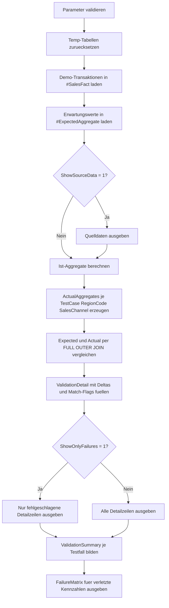

# AggregateValidationHarness.sql

Dieses didaktische Skript stellt ein kompaktes Validierungsgeruest fuer Aggregatabfragen bereit. Es berechnet Ist-Werte je Testfall, Region und Kanal, vergleicht diese mit explizit hinterlegten Erwartungswerten und zeigt sowohl Detailabweichungen als auch eine verdichtete Testzusammenfassung.

## Uebersicht

<!-- SQLDOC:SUMMARY_TABLE:BEGIN -->
| Feld | Wert |
|---|---|
| Script | [AggregateValidationHarness.sql](AggregateValidationHarness.sql) |
| Version | `1.0` |
| Typ | `didactic-lab` |
| Kapitel | `10_GroupBy_Aggregate` |
| Sicherheit | `read-only-tempdb` |
| Zweck | Vergleicht berechnete Aggregatwerte mit gepflegten Erwartungswerten und markiert Abweichungen pro Testfall. |
<!-- SQLDOC:SUMMARY_TABLE:END -->

## Einordnung

Das Muster ist fuer Situationen gedacht, in denen eine Aggregatabfrage nicht nur einmal entwickelt, sondern nachvollziehbar gegen bekannte Soll-Ergebnisse abgesichert werden soll. Statt eine einzelne Kennzahl manuell zu pruefen, fasst das Skript mehrere Validierungsdimensionen in einem reproduzierbaren Ablauf zusammen:

- Quelldaten fuer definierte Testfaelle bereitstellen.
- Ist-Aggregate mit `GROUP BY` berechnen.
- Erwartungswerte explizit hinterlegen.
- Kennzahlen und Form der Ergebnismenge automatisiert gegeneinander pruefen.

Dadurch eignet sich das Artefakt als Einstieg in Query-Tests, Review-Vorlagen oder Diagnose-Skripte fuer Reporting-Logik.

## Annahmen

- Die Erstversion arbeitet bewusst mit lokalen Demo-Daten in `#SalesFact` und nicht mit produktiven Tabellen.
- Erwartungswerte werden explizit in `#ExpectedAggregate` gepflegt, damit die Validierungslogik transparent bleibt.
- Jede Gruppe wird ueber `TestCase`, `RegionCode` und `SalesChannel` identifiziert.
- Quoten und Durchschnittswerte werden mit Toleranzparametern verglichen, um numerische Rundungsunterschiede didaktisch kontrolliert behandeln zu koennen.

## Anwendungsfall

Das Skript passt zu Trainings- und Review-Situationen, in denen komplexere Aggregatlogik geprueft werden soll, bevor sie in Berichten, Views oder gespeicherten Prozeduren weiterverwendet wird. Das Muster laesst sich spaeter erweitern, indem Demo-Daten durch Stage- oder Snapshot-Quellen ersetzt und weitere Kennzahlen in die Erwartungstabelle aufgenommen werden.

## Parameter

<!-- SQLDOC:PARAMETERS_TABLE:BEGIN -->
| Parameter | SQL-Typ | Pflicht | Beschreibung |
|---|---|---|---|
| `@AmountTolerance` | `DECIMAL(12,4)` | Ja | Maximal erlaubte Abweichung fuer Umsatz- und Durchschnittswerte. |
| `@ReturnRateTolerance` | `DECIMAL(12,6)` | Ja | Maximal erlaubte Abweichung fuer Quotenvergleiche. |
| `@ShowSourceData` | `BIT` | Nein | Gibt bei `1` die Demo-Quelldaten vor der Aggregation aus. |
| `@ShowOnlyFailures` | `BIT` | Nein | Filtert bei `1` die Detailausgabe auf fehlgeschlagene Validierungen. |
<!-- SQLDOC:PARAMETERS_TABLE:END -->

## Abhaengigkeiten

<!-- SQLDOC:DEPENDENCIES_LIST:BEGIN -->
- `tempdb`
- `GROUP BY`
- `COUNT()`
- `SUM()`
- `AVG()`
- `CASE`
- `FULL OUTER JOIN`
- `NULLIF()`
- `ABS()`
- `DROP TABLE IF EXISTS`
<!-- SQLDOC:DEPENDENCIES_LIST:END -->

## Hinweise

- `ActualAggregates` zeigt die berechneten Kennzahlen je Testfall und Gruppe.
- `ValidationDetail` vergleicht Erwartung und Ist direkt nebeneinander und markiert pro Kennzahl, ob der Wert innerhalb der Toleranz liegt.
- `ValidationSummary` verdichtet die Detailpruefung auf Testfall-Ebene.
- `FailureMatrix` eignet sich fuer Reviews, weil nur die tatsaechlich verletzten Kennzahlen separat ausgewiesen werden.

## Versionshistorie

<!-- SQLDOC:VERSION_HISTORY_TABLE:BEGIN -->
| Version | Datum | User | Beschreibung |
|---|---|---|---|
| `1.0` | `2026-04-18` | `ER` | Erstversion eines didaktischen Validierungsgeruests fuer komplexere Aggregatabfragen |
<!-- SQLDOC:VERSION_HISTORY_TABLE:END -->

## Ablauf

<!-- SQLDOC:MERMAID:BEGIN -->

<!-- SQLDOC:MERMAID:END -->

## SQL-Code

<!-- SQLDOC:SQL_CODE:BEGIN -->
```sql
/*
BEGIN:SQL-HEADER v1
---
sql_header: v1
script_name: "AggregateValidationHarness.sql"
script_version: "1.0"
script_type: "didactic-lab"
chapter: "10_GroupBy_Aggregate"

purpose: >
  Stellt ein Validierungsgeruest fuer komplexere Aggregatabfragen bereit,
  indem Ist-Aggregate aus Demo-Daten gegen explizit gepflegte Erwartungswerte
  verglichen und Abweichungen pro Testfall ausgewiesen werden.

parameters:
  - name: "@AmountTolerance"
    sql_type: "DECIMAL(12,4)"
    direction: "IN"
    required: true
    description: "Maximal erlaubte numerische Abweichung fuer Umsatz- und Durchschnittswerte"
  - name: "@ReturnRateTolerance"
    sql_type: "DECIMAL(12,6)"
    direction: "IN"
    required: true
    description: "Maximal erlaubte numerische Abweichung fuer Quotenvergleiche"
  - name: "@ShowSourceData"
    sql_type: "BIT"
    direction: "IN"
    required: false
    description: "1 = zeigt die Demo-Quelldaten vor der Verdichtung an"
  - name: "@ShowOnlyFailures"
    sql_type: "BIT"
    direction: "IN"
    required: false
    description: "1 = gibt nur fehlgeschlagene Validierungen im Detail aus"

result_sets:
  - name: "SourceData"
    description: "Optionale Vorschau der Demo-Transaktionen fuer alle Testfaelle"
  - name: "ActualAggregates"
    description: "Die berechneten Ist-Aggregate je Testfall, Region und Kanal"
  - name: "ValidationDetail"
    description: "Detailvergleich zwischen erwarteten und berechneten Aggregaten"
  - name: "ValidationSummary"
    description: "Zusammenfassung der bestandenen und fehlgeschlagenen Validierungen je Testfall"
  - name: "FailureMatrix"
    description: "Liste der Kennzahlen, deren Erwartungswerte den Toleranzbereich verletzt haben"

dependencies:
  - "tempdb"
  - "GROUP BY"
  - "COUNT()"
  - "SUM()"
  - "AVG()"
  - "CASE"
  - "FULL OUTER JOIN"
  - "NULLIF()"
  - "ABS()"
  - "DROP TABLE IF EXISTS"

safety:
  level: "read-only-tempdb"
  writes_data: false

documentation:
  markdown_file: "T-SQL/10_GroupBy_Aggregate/SQLScripts/AggregateValidationHarness.md"
  sync_blocks:
    - "SUMMARY_TABLE"
    - "PARAMETERS_TABLE"
    - "DEPENDENCIES_LIST"
    - "VERSION_HISTORY_TABLE"
    - "SQL_CODE"
  mermaid:
    mode: "ai-agent-from-sql"
    source: "script-body"

main_responsible:
  name: "Erhard Rainer"
  initials: "ER"

version_history:
  - version: "1.0"
    date: "2026-04-18"
    user: "ER"
    description: "Erstversion eines didaktischen Validierungsgeruests fuer komplexere Aggregatabfragen"

notes:
  - "Die Erstversion verwendet lokale Temp-Tabellen statt produktiver Fakten- oder Snapshot-Tabellen"
  - "Erwartungswerte werden bewusst explizit gepflegt, damit das Muster fuer Tests und Reviews leicht nachvollziehbar bleibt"
---
END:SQL-HEADER v1
*/

SET NOCOUNT ON;

DECLARE @AmountTolerance DECIMAL(12,4) = 0.0100;
DECLARE @ReturnRateTolerance DECIMAL(12,6) = 0.000100;
DECLARE @ShowSourceData BIT = 1;
DECLARE @ShowOnlyFailures BIT = 0;

IF @AmountTolerance IS NULL OR @AmountTolerance < 0
BEGIN
    THROW 50010, '@AmountTolerance darf nicht negativ sein.', 1;
END;

IF @ReturnRateTolerance IS NULL OR @ReturnRateTolerance < 0
BEGIN
    THROW 50011, '@ReturnRateTolerance darf nicht negativ sein.', 1;
END;

IF @ShowSourceData NOT IN (0, 1)
BEGIN
    THROW 50012, '@ShowSourceData muss 0 oder 1 sein.', 1;
END;

IF @ShowOnlyFailures NOT IN (0, 1)
BEGIN
    THROW 50013, '@ShowOnlyFailures muss 0 oder 1 sein.', 1;
END;

DROP TABLE IF EXISTS #SalesFact;
DROP TABLE IF EXISTS #ExpectedAggregate;
DROP TABLE IF EXISTS #ActualAggregate;
DROP TABLE IF EXISTS #ValidationDetail;

CREATE TABLE #SalesFact
(
    TestCase            VARCHAR(40)     NOT NULL,
    RegionCode          VARCHAR(20)     NOT NULL,
    SalesChannel        VARCHAR(20)     NOT NULL,
    OrderID             INT             NOT NULL,
    OrderAmount         DECIMAL(12,2)   NOT NULL,
    IsReturned          BIT             NOT NULL
);

CREATE TABLE #ExpectedAggregate
(
    TestCase                VARCHAR(40)     NOT NULL,
    RegionCode              VARCHAR(20)     NOT NULL,
    SalesChannel            VARCHAR(20)     NOT NULL,
    ExpectedOrderCount      INT             NOT NULL,
    ExpectedTotalRevenue    DECIMAL(12,2)   NOT NULL,
    ExpectedAverageAmount   DECIMAL(12,4)   NOT NULL,
    ExpectedReturnRate      DECIMAL(12,6)   NOT NULL
);

INSERT INTO #SalesFact
(
    TestCase,
    RegionCode,
    SalesChannel,
    OrderID,
    OrderAmount,
    IsReturned
)
VALUES
    ('baseline', 'North', 'Online',  1001, 120.00, 0),
    ('baseline', 'North', 'Online',  1002, 180.00, 0),
    ('baseline', 'North', 'Retail',  1003,  90.00, 1),
    ('baseline', 'North', 'Retail',  1004, 110.00, 0),
    ('baseline', 'South', 'Online',  1005, 210.00, 0),
    ('baseline', 'South', 'Online',  1006, 190.00, 1),
    ('baseline', 'South', 'Retail',  1007, 130.00, 0),
    ('baseline', 'South', 'Retail',  1008, 170.00, 0),
    ('return_heavy', 'North', 'Online', 2001, 100.00, 1),
    ('return_heavy', 'North', 'Online', 2002, 140.00, 1),
    ('return_heavy', 'North', 'Retail', 2003, 200.00, 0),
    ('return_heavy', 'North', 'Retail', 2004, 260.00, 0),
    ('return_heavy', 'South', 'Online', 2005, 150.00, 1),
    ('return_heavy', 'South', 'Online', 2006, 150.00, 0),
    ('return_heavy', 'South', 'Retail', 2007, 300.00, 0),
    ('return_heavy', 'South', 'Retail', 2008, 100.00, 1),
    ('mixed_scale', 'East',  'Online', 3001, 500.00, 0),
    ('mixed_scale', 'East',  'Online', 3002, 300.00, 0),
    ('mixed_scale', 'East',  'Retail', 3003, 100.00, 0),
    ('mixed_scale', 'East',  'Retail', 3004, 200.00, 1),
    ('mixed_scale', 'West',  'Online', 3005,  80.00, 0),
    ('mixed_scale', 'West',  'Online', 3006, 120.00, 0),
    ('mixed_scale', 'West',  'Retail', 3007, 400.00, 1),
    ('mixed_scale', 'West',  'Retail', 3008, 400.00, 0);

INSERT INTO #ExpectedAggregate
(
    TestCase,
    RegionCode,
    SalesChannel,
    ExpectedOrderCount,
    ExpectedTotalRevenue,
    ExpectedAverageAmount,
    ExpectedReturnRate
)
VALUES
    ('baseline', 'North', 'Online', 2, 300.00, 150.0000, 0.000000),
    ('baseline', 'North', 'Retail', 2, 200.00, 100.0000, 0.500000),
    ('baseline', 'South', 'Online', 2, 400.00, 200.0000, 0.500000),
    ('baseline', 'South', 'Retail', 2, 300.00, 150.0000, 0.000000),
    ('return_heavy', 'North', 'Online', 2, 240.00, 120.0000, 1.000000),
    ('return_heavy', 'North', 'Retail', 2, 460.00, 230.0000, 0.000000),
    ('return_heavy', 'South', 'Online', 2, 300.00, 150.0000, 0.500000),
    ('return_heavy', 'South', 'Retail', 2, 400.00, 200.0000, 0.500000),
    ('mixed_scale', 'East',  'Online', 2, 800.00, 400.0000, 0.000000),
    ('mixed_scale', 'East',  'Retail', 2, 300.00, 150.0000, 0.500000),
    ('mixed_scale', 'West',  'Online', 2, 200.00, 100.0000, 0.000000),
    ('mixed_scale', 'West',  'Retail', 2, 800.00, 400.0000, 0.500000);

IF @ShowSourceData = 1
BEGIN
    SELECT
        sf.TestCase,
        sf.RegionCode,
        sf.SalesChannel,
        sf.OrderID,
        sf.OrderAmount,
        sf.IsReturned
    FROM #SalesFact AS sf
    ORDER BY
        sf.TestCase,
        sf.RegionCode,
        sf.SalesChannel,
        sf.OrderID;
END;

SELECT
    sf.TestCase,
    sf.RegionCode,
    sf.SalesChannel,
    COUNT(*) AS OrderCount,
    SUM(sf.OrderAmount) AS TotalRevenue,
    CAST(AVG(sf.OrderAmount) AS DECIMAL(12,4)) AS AverageAmount,
    CAST(
        SUM(CASE WHEN sf.IsReturned = 1 THEN 1 ELSE 0 END) * 1.0
        / NULLIF(COUNT(*), 0)
        AS DECIMAL(12,6)
    ) AS ReturnRate
INTO #ActualAggregate
FROM #SalesFact AS sf
GROUP BY
    sf.TestCase,
    sf.RegionCode,
    sf.SalesChannel;

SELECT
    aa.TestCase,
    aa.RegionCode,
    aa.SalesChannel,
    aa.OrderCount,
    aa.TotalRevenue,
    aa.AverageAmount,
    aa.ReturnRate
FROM #ActualAggregate AS aa
ORDER BY
    aa.TestCase,
    aa.RegionCode,
    aa.SalesChannel;

SELECT
    COALESCE(ea.TestCase, aa.TestCase) AS TestCase,
    COALESCE(ea.RegionCode, aa.RegionCode) AS RegionCode,
    COALESCE(ea.SalesChannel, aa.SalesChannel) AS SalesChannel,
    ea.ExpectedOrderCount,
    aa.OrderCount AS ActualOrderCount,
    CASE
        WHEN ea.ExpectedOrderCount = aa.OrderCount THEN 1
        ELSE 0
    END AS OrderCountMatches,
    ea.ExpectedTotalRevenue,
    aa.TotalRevenue AS ActualTotalRevenue,
    ABS(ISNULL(aa.TotalRevenue, 0) - ISNULL(ea.ExpectedTotalRevenue, 0)) AS TotalRevenueDelta,
    CASE
        WHEN ABS(ISNULL(aa.TotalRevenue, 0) - ISNULL(ea.ExpectedTotalRevenue, 0)) <= @AmountTolerance THEN 1
        ELSE 0
    END AS TotalRevenueMatches,
    ea.ExpectedAverageAmount,
    aa.AverageAmount AS ActualAverageAmount,
    ABS(ISNULL(aa.AverageAmount, 0) - ISNULL(ea.ExpectedAverageAmount, 0)) AS AverageAmountDelta,
    CASE
        WHEN ABS(ISNULL(aa.AverageAmount, 0) - ISNULL(ea.ExpectedAverageAmount, 0)) <= @AmountTolerance THEN 1
        ELSE 0
    END AS AverageAmountMatches,
    ea.ExpectedReturnRate,
    aa.ReturnRate AS ActualReturnRate,
    ABS(ISNULL(aa.ReturnRate, 0) - ISNULL(ea.ExpectedReturnRate, 0)) AS ReturnRateDelta,
    CASE
        WHEN ABS(ISNULL(aa.ReturnRate, 0) - ISNULL(ea.ExpectedReturnRate, 0)) <= @ReturnRateTolerance THEN 1
        ELSE 0
    END AS ReturnRateMatches,
    CASE
        WHEN ea.TestCase IS NULL OR aa.TestCase IS NULL THEN 'shape_mismatch'
        WHEN ea.ExpectedOrderCount = aa.OrderCount
         AND ABS(ISNULL(aa.TotalRevenue, 0) - ISNULL(ea.ExpectedTotalRevenue, 0)) <= @AmountTolerance
         AND ABS(ISNULL(aa.AverageAmount, 0) - ISNULL(ea.ExpectedAverageAmount, 0)) <= @AmountTolerance
         AND ABS(ISNULL(aa.ReturnRate, 0) - ISNULL(ea.ExpectedReturnRate, 0)) <= @ReturnRateTolerance
            THEN 'passed'
        ELSE 'failed'
    END AS ValidationStatus
INTO #ValidationDetail
FROM #ExpectedAggregate AS ea
FULL OUTER JOIN #ActualAggregate AS aa
    ON aa.TestCase = ea.TestCase
   AND aa.RegionCode = ea.RegionCode
   AND aa.SalesChannel = ea.SalesChannel;

SELECT
    vd.TestCase,
    vd.RegionCode,
    vd.SalesChannel,
    vd.ExpectedOrderCount,
    vd.ActualOrderCount,
    vd.OrderCountMatches,
    vd.ExpectedTotalRevenue,
    vd.ActualTotalRevenue,
    vd.TotalRevenueDelta,
    vd.TotalRevenueMatches,
    vd.ExpectedAverageAmount,
    vd.ActualAverageAmount,
    vd.AverageAmountDelta,
    vd.AverageAmountMatches,
    vd.ExpectedReturnRate,
    vd.ActualReturnRate,
    vd.ReturnRateDelta,
    vd.ReturnRateMatches,
    vd.ValidationStatus
FROM #ValidationDetail AS vd
WHERE @ShowOnlyFailures = 0
   OR vd.ValidationStatus <> 'passed'
ORDER BY
    vd.TestCase,
    vd.RegionCode,
    vd.SalesChannel;

SELECT
    vd.TestCase,
    COUNT(*) AS CheckedGroups,
    SUM(CASE WHEN vd.ValidationStatus = 'passed' THEN 1 ELSE 0 END) AS PassedGroups,
    SUM(CASE WHEN vd.ValidationStatus = 'failed' THEN 1 ELSE 0 END) AS FailedGroups,
    SUM(CASE WHEN vd.ValidationStatus = 'shape_mismatch' THEN 1 ELSE 0 END) AS ShapeMismatchGroups,
    CASE
        WHEN SUM(CASE WHEN vd.ValidationStatus <> 'passed' THEN 1 ELSE 0 END) = 0 THEN 'all_checks_passed'
        ELSE 'review_required'
    END AS OverallStatus
FROM #ValidationDetail AS vd
GROUP BY
    vd.TestCase
ORDER BY
    vd.TestCase;

SELECT
    vd.TestCase,
    vd.RegionCode,
    vd.SalesChannel,
    fm.MetricName,
    fm.ExpectedValue,
    fm.ActualValue,
    fm.DeltaValue
FROM #ValidationDetail AS vd
CROSS APPLY
(
    VALUES
        (
            'OrderCount',
            CAST(vd.ExpectedOrderCount AS DECIMAL(12,4)),
            CAST(vd.ActualOrderCount AS DECIMAL(12,4)),
            ABS(CAST(ISNULL(vd.ActualOrderCount, 0) - ISNULL(vd.ExpectedOrderCount, 0) AS DECIMAL(12,4)))
        ),
        (
            'TotalRevenue',
            CAST(vd.ExpectedTotalRevenue AS DECIMAL(12,4)),
            CAST(vd.ActualTotalRevenue AS DECIMAL(12,4)),
            CAST(vd.TotalRevenueDelta AS DECIMAL(12,4))
        ),
        (
            'AverageAmount',
            CAST(vd.ExpectedAverageAmount AS DECIMAL(12,4)),
            CAST(vd.ActualAverageAmount AS DECIMAL(12,4)),
            CAST(vd.AverageAmountDelta AS DECIMAL(12,4))
        ),
        (
            'ReturnRate',
            CAST(vd.ExpectedReturnRate AS DECIMAL(12,6)),
            CAST(vd.ActualReturnRate AS DECIMAL(12,6)),
            CAST(vd.ReturnRateDelta AS DECIMAL(12,6))
        )
) AS fm(MetricName, ExpectedValue, ActualValue, DeltaValue)
WHERE
    (fm.MetricName = 'OrderCount' AND vd.OrderCountMatches = 0)
    OR (fm.MetricName = 'TotalRevenue' AND vd.TotalRevenueMatches = 0)
    OR (fm.MetricName = 'AverageAmount' AND vd.AverageAmountMatches = 0)
    OR (fm.MetricName = 'ReturnRate' AND vd.ReturnRateMatches = 0)
ORDER BY
    vd.TestCase,
    vd.RegionCode,
    vd.SalesChannel,
    fm.MetricName;
```
<!-- SQLDOC:SQL_CODE:END -->
