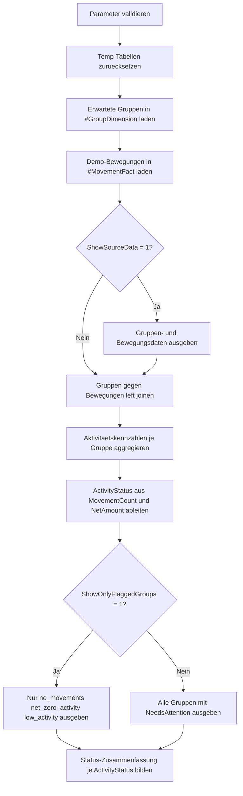

# AggregateZeroActivityGroups.sql

Dieses didaktische Skript zeigt ein typisches Diagnosemuster fuer Aggregationen, bei dem nicht nur aktive Gruppen, sondern auch Gruppen ohne Bewegungen sichtbar bleiben. Dazu wird eine explizite Gruppendimension gegen Bewegungsdaten links gejoint und anschliessend nach Nettoaktivitaet klassifiziert.

## Uebersicht

<!-- SQLDOC:SUMMARY_TABLE:BEGIN -->
| Feld | Wert |
|---|---|
| Script | [AggregateZeroActivityGroups.sql](AggregateZeroActivityGroups.sql) |
| Version | `1.0` |
| Typ | `didactic-lab` |
| Kapitel | `10_GroupBy_Aggregate` |
| Sicherheit | `read-only-tempdb` |
| Zweck | Hebt Gruppen mit fehlenden Bewegungen, Netto-null-Aktivitaet oder sehr kleiner Restaktivitaet hervor. |
<!-- SQLDOC:SUMMARY_TABLE:END -->

## Einordnung

Bei vielen `GROUP BY`-Abfragen fallen Gruppen ohne Faktenzeilen unsichtbar heraus. Fuer Controlling-, Monitoring- oder Qualitaetschecks ist aber gerade diese Leerstelle oft fachlich relevant. Das Skript demonstriert deshalb drei unterscheidbare Faelle:

- Es existieren ueberhaupt keine Bewegungen fuer eine erwartete Gruppe.
- Bewegungen heben sich netto auf und fuehren zu einer Null-Aktivitaet.
- Es bleibt nur eine geringe Restaktivitaet innerhalb eines frei waehlbaren Schwellenwerts.

Damit eignet sich das Muster als Vorlage fuer Berichte, die Luecken, Gegenbuchungen oder verdachtig kleine Aktivitaet explizit ausweisen sollen.

## Annahmen

- Die Erstversion verwendet eine explizite Demo-Gruppendimension in `#GroupDimension`, damit erwartete Gruppen auch ohne Faktenzeilen sichtbar bleiben.
- Negative `AmountSigned`-Werte stehen didaktisch fuer Stornos oder Gegenbewegungen.
- Die Klassifikation `low_activity` verwendet den Parameter `@AbsoluteNetThreshold` auf dem absoluten Netto-Betrag und nicht auf Einzelbewegungen.
- Das Skript schreibt nur in lokale Temp-Tabellen und setzt keinen produktiven Buchungsbestand voraus.

## Anwendungsfall

Das Muster ist nuetzlich, wenn Abweichungen nicht nur ueber hohe Werte, sondern gerade ueber fehlende oder aufgehobene Aktivitaet erkannt werden sollen, zum Beispiel fuer Kostenstellen, Kanaele, Filialen oder Monats-Snapshots. Praktisch laesst sich die Gruppendimension spaeter durch Stammdaten und die Bewegungsquelle durch Fakten- oder Journaltabellen ersetzen.

## Parameter

<!-- SQLDOC:PARAMETERS_TABLE:BEGIN -->
| Parameter | SQL-Typ | Pflicht | Beschreibung |
|---|---|---|---|
| `@AbsoluteNetThreshold` | `DECIMAL(12,2)` | Ja | Maximaler absoluter Netto-Betrag, der noch als geringe Aktivitaet gilt. |
| `@ShowOnlyFlaggedGroups` | `BIT` | Nein | Gibt bei `1` nur Gruppen mit fehlender, nulliger oder geringer Aktivitaet aus. |
| `@ShowSourceData` | `BIT` | Nein | Gibt bei `1` die Demo-Gruppen und Bewegungsdaten vor der Verdichtung aus. |
<!-- SQLDOC:PARAMETERS_TABLE:END -->

## Abhaengigkeiten

<!-- SQLDOC:DEPENDENCIES_LIST:BEGIN -->
- `tempdb`
- `LEFT JOIN`
- `GROUP BY`
- `COUNT()`
- `SUM()`
- `CASE`
- `ABS()`
- `DROP TABLE IF EXISTS`
<!-- SQLDOC:DEPENDENCIES_LIST:END -->

## Hinweise

- `no_movements` bedeutet, dass fuer eine erwartete Gruppe keine einzige Bewegungszeile vorhanden ist.
- `net_zero_activity` bedeutet, dass Bewegungen existieren, sich aber netto exakt aufheben.
- `low_activity` markiert kleine Restaktivitaet innerhalb des Schwellenwerts.
- Die Ausgabespalte `NeedsAttention` verdichtet diese drei Faelle zu einem einfachen Review-Flag.

## Versionshistorie

<!-- SQLDOC:VERSION_HISTORY_TABLE:BEGIN -->
| Version | Datum | User | Beschreibung |
|---|---|---|---|
| `1.0` | `2026-04-18` | `ER` | Erstversion fuer die Diagnose von Gruppen ohne oder mit sehr geringer Aktivitaet |
<!-- SQLDOC:VERSION_HISTORY_TABLE:END -->

## Ablauf

<!-- SQLDOC:MERMAID:BEGIN -->

<!-- SQLDOC:MERMAID:END -->

## SQL-Code

<!-- SQLDOC:SQL_CODE:BEGIN -->
```sql
/*
BEGIN:SQL-HEADER v1
---
sql_header: v1
script_name: "AggregateZeroActivityGroups.sql"
script_version: "1.0"
script_type: "didactic-lab"
chapter: "10_GroupBy_Aggregate"

purpose: >
  Hebt Gruppen hervor, in denen gar keine Bewegungen vorliegen oder deren
  aggregierte Nettoaktivitaet bei null oder nahe null liegt.

parameters:
  - name: "@AbsoluteNetThreshold"
    sql_type: "DECIMAL(12,2)"
    direction: "IN"
    required: true
    description: "Maximaler absoluter Netto-Betrag, der noch als geringe Aktivitaet gilt"
  - name: "@ShowOnlyFlaggedGroups"
    sql_type: "BIT"
    direction: "IN"
    required: false
    description: "1 = zeigt nur Gruppen mit fehlender, nulliger oder geringer Aktivitaet"
  - name: "@ShowSourceData"
    sql_type: "BIT"
    direction: "IN"
    required: false
    description: "1 = gibt Gruppendimension und Bewegungsdaten vor der Verdichtung aus"

result_sets:
  - name: "GroupDimension"
    description: "Optionale Vorschau der erwarteten Gruppen"
  - name: "MovementFact"
    description: "Optionale Vorschau der Demo-Bewegungen mit positiven und negativen Betraegen"
  - name: "ActivityProfile"
    description: "Aggregierte Aktivitaetskennzahlen und Klassifikation je Gruppe"
  - name: "ActivityStatusSummary"
    description: "Zusammenfassung der Gruppenanzahl je Aktivitaetsstatus"

dependencies:
  - "tempdb"
  - "LEFT JOIN"
  - "GROUP BY"
  - "COUNT()"
  - "SUM()"
  - "CASE"
  - "ABS()"
  - "DROP TABLE IF EXISTS"

safety:
  level: "read-only-tempdb"
  writes_data: false

documentation:
  markdown_file: "T-SQL/10_GroupBy_Aggregate/SQLScripts/AggregateZeroActivityGroups.md"
  sync_blocks:
    - "SUMMARY_TABLE"
    - "PARAMETERS_TABLE"
    - "DEPENDENCIES_LIST"
    - "VERSION_HISTORY_TABLE"
    - "SQL_CODE"
  mermaid:
    mode: "ai-agent-from-sql"
    source: "script-body"

main_responsible:
  name: "Erhard Rainer"
  initials: "ER"

version_history:
  - version: "1.0"
    date: "2026-04-18"
    user: "ER"
    description: "Erstversion fuer die Diagnose von Gruppen ohne oder mit sehr geringer Aktivitaet"

notes:
  - "Die Erstversion arbeitet mit einer expliziten Gruppendimension, damit auch Gruppen ohne Bewegungszeilen sichtbar bleiben"
  - "Negative Betraege modellieren Stornos oder Gegenbewegungen und koennen zu Netto-null-Gruppen fuehren"
---
END:SQL-HEADER v1
*/

SET NOCOUNT ON;

DECLARE @AbsoluteNetThreshold DECIMAL(12,2) = 10.00;
DECLARE @ShowOnlyFlaggedGroups BIT = 0;
DECLARE @ShowSourceData BIT = 1;

IF @AbsoluteNetThreshold IS NULL OR @AbsoluteNetThreshold < 0
BEGIN
    THROW 50020, '@AbsoluteNetThreshold darf nicht negativ sein.', 1;
END;

IF @ShowOnlyFlaggedGroups NOT IN (0, 1)
BEGIN
    THROW 50021, '@ShowOnlyFlaggedGroups muss 0 oder 1 sein.', 1;
END;

IF @ShowSourceData NOT IN (0, 1)
BEGIN
    THROW 50022, '@ShowSourceData muss 0 oder 1 sein.', 1;
END;

DROP TABLE IF EXISTS #GroupDimension;
DROP TABLE IF EXISTS #MovementFact;
DROP TABLE IF EXISTS #ActivityProfile;

CREATE TABLE #GroupDimension
(
    CostCenter      VARCHAR(20)     NOT NULL,
    ActivityMonth   DATE            NOT NULL,
    ChannelCode     VARCHAR(20)     NOT NULL,
    OwnerTeam       VARCHAR(30)     NOT NULL
);

CREATE TABLE #MovementFact
(
    CostCenter      VARCHAR(20)     NOT NULL,
    ActivityMonth   DATE            NOT NULL,
    ChannelCode     VARCHAR(20)     NOT NULL,
    MovementID      INT             NOT NULL,
    AmountSigned    DECIMAL(12,2)   NOT NULL,
    MovementType    VARCHAR(20)     NOT NULL
);

INSERT INTO #GroupDimension
(
    CostCenter,
    ActivityMonth,
    ChannelCode,
    OwnerTeam
)
VALUES
    ('CC-100', '2026-01-01', 'Online', 'NorthOps'),
    ('CC-100', '2026-01-01', 'Retail', 'NorthOps'),
    ('CC-200', '2026-01-01', 'Online', 'SouthOps'),
    ('CC-200', '2026-01-01', 'Retail', 'SouthOps'),
    ('CC-300', '2026-01-01', 'Partner', 'PartnerOps'),
    ('CC-300', '2026-01-01', 'Retail', 'PartnerOps'),
    ('CC-400', '2026-01-01', 'Online', 'CentralOps'),
    ('CC-400', '2026-01-01', 'Partner', 'CentralOps');

INSERT INTO #MovementFact
(
    CostCenter,
    ActivityMonth,
    ChannelCode,
    MovementID,
    AmountSigned,
    MovementType
)
VALUES
    ('CC-100', '2026-01-01', 'Online',  1001, 120.00, 'sale'),
    ('CC-100', '2026-01-01', 'Online',  1002,  80.00, 'sale'),
    ('CC-100', '2026-01-01', 'Retail',  1003,  50.00, 'sale'),
    ('CC-100', '2026-01-01', 'Retail',  1004, -50.00, 'reversal'),
    ('CC-200', '2026-01-01', 'Online',  1005,   4.00, 'sale'),
    ('CC-200', '2026-01-01', 'Online',  1006,   3.00, 'adjustment'),
    ('CC-200', '2026-01-01', 'Retail',  1007,  40.00, 'sale'),
    ('CC-200', '2026-01-01', 'Retail',  1008,  30.00, 'sale'),
    ('CC-300', '2026-01-01', 'Partner', 1009, -10.00, 'reversal'),
    ('CC-300', '2026-01-01', 'Partner', 1010,  10.00, 'sale'),
    ('CC-300', '2026-01-01', 'Retail',  1011,   8.00, 'sale'),
    ('CC-400', '2026-01-01', 'Online',  1012, 300.00, 'sale'),
    ('CC-400', '2026-01-01', 'Partner', 1013,   5.00, 'sale'),
    ('CC-400', '2026-01-01', 'Partner', 1014,  -2.00, 'reversal');

IF @ShowSourceData = 1
BEGIN
    SELECT
        gd.CostCenter,
        gd.ActivityMonth,
        gd.ChannelCode,
        gd.OwnerTeam
    FROM #GroupDimension AS gd
    ORDER BY
        gd.CostCenter,
        gd.ActivityMonth,
        gd.ChannelCode;

    SELECT
        mf.CostCenter,
        mf.ActivityMonth,
        mf.ChannelCode,
        mf.MovementID,
        mf.AmountSigned,
        mf.MovementType
    FROM #MovementFact AS mf
    ORDER BY
        mf.CostCenter,
        mf.ActivityMonth,
        mf.ChannelCode,
        mf.MovementID;
END;

SELECT
    gd.CostCenter,
    gd.ActivityMonth,
    gd.ChannelCode,
    gd.OwnerTeam,
    COUNT(mf.MovementID) AS MovementCount,
    CAST(COALESCE(SUM(mf.AmountSigned), 0.00) AS DECIMAL(12,2)) AS NetAmount,
    CAST(COALESCE(SUM(CASE WHEN mf.AmountSigned > 0 THEN mf.AmountSigned ELSE 0 END), 0.00) AS DECIMAL(12,2)) AS PositiveAmount,
    CAST(COALESCE(SUM(CASE WHEN mf.AmountSigned < 0 THEN mf.AmountSigned ELSE 0 END), 0.00) AS DECIMAL(12,2)) AS NegativeAmount,
    CASE
        WHEN COUNT(mf.MovementID) = 0 THEN 'no_movements'
        WHEN ABS(COALESCE(SUM(mf.AmountSigned), 0.00)) = 0 THEN 'net_zero_activity'
        WHEN ABS(COALESCE(SUM(mf.AmountSigned), 0.00)) <= @AbsoluteNetThreshold THEN 'low_activity'
        ELSE 'active'
    END AS ActivityStatus
INTO #ActivityProfile
FROM #GroupDimension AS gd
LEFT JOIN #MovementFact AS mf
    ON mf.CostCenter = gd.CostCenter
   AND mf.ActivityMonth = gd.ActivityMonth
   AND mf.ChannelCode = gd.ChannelCode
GROUP BY
    gd.CostCenter,
    gd.ActivityMonth,
    gd.ChannelCode,
    gd.OwnerTeam;

SELECT
    ap.CostCenter,
    ap.ActivityMonth,
    ap.ChannelCode,
    ap.OwnerTeam,
    ap.MovementCount,
    ap.NetAmount,
    ap.PositiveAmount,
    ap.NegativeAmount,
    ap.ActivityStatus,
    CASE
        WHEN ap.ActivityStatus IN ('no_movements', 'net_zero_activity', 'low_activity') THEN 1
        ELSE 0
    END AS NeedsAttention
FROM #ActivityProfile AS ap
WHERE @ShowOnlyFlaggedGroups = 0
   OR ap.ActivityStatus IN ('no_movements', 'net_zero_activity', 'low_activity')
ORDER BY
    CASE ap.ActivityStatus
        WHEN 'no_movements' THEN 1
        WHEN 'net_zero_activity' THEN 2
        WHEN 'low_activity' THEN 3
        ELSE 4
    END,
    ap.CostCenter,
    ap.ActivityMonth,
    ap.ChannelCode;

SELECT
    ap.ActivityStatus,
    COUNT(*) AS GroupCount,
    SUM(ap.MovementCount) AS TotalMovementCount,
    CAST(SUM(ap.NetAmount) AS DECIMAL(12,2)) AS TotalNetAmount
FROM #ActivityProfile AS ap
GROUP BY
    ap.ActivityStatus
ORDER BY
    CASE ap.ActivityStatus
        WHEN 'no_movements' THEN 1
        WHEN 'net_zero_activity' THEN 2
        WHEN 'low_activity' THEN 3
        ELSE 4
    END;
```
<!-- SQLDOC:SQL_CODE:END -->
