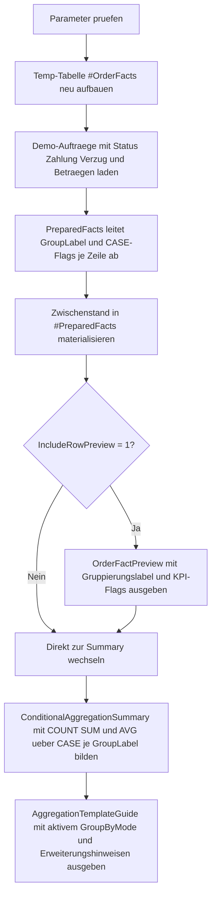

# ConditionalAggregationTemplate.sql

Dieses Artefakt zeigt ein didaktisches Template fuer KPI-Bildung mit bedingten Aggregaten ueber `CASE`. Die gleiche Demo-Faktbasis kann per Parameter nach Region, Kanal oder Monat verdichtet werden, damit der Zusammenhang zwischen Gruppierung und KPI-Definition transparent bleibt.

## Uebersicht

<!-- SQLDOC:SUMMARY_TABLE:BEGIN -->
| Feld | Wert |
|---|---|
| Script | [ConditionalAggregationTemplate.sql](ConditionalAggregationTemplate.sql) |
| Version | `1.0` |
| Typ | `template` |
| Kapitel | `10_GroupBy_Aggregate` |
| Sicherheit | `read-only-tempdb` |
| Zweck | Template fuer bedingte KPI-Aggregate mit `CASE` ueber dieselbe Faktbasis je Gruppierungsebene. |
<!-- SQLDOC:SUMMARY_TABLE:END -->

## Einordnung

Bedingte Aggregate gehoeren zu den haeufigsten Mustern in Reports, KPI-Checks und Datenqualitaetsabfragen. Statt mehrere Einzelabfragen zu bauen, werden unterschiedliche Kennzahlen in einer Gruppierung zusammengefuehrt, zum Beispiel:

- Anzahl gewonnener Auftraege
- Anzahl offener oder verspaeteter Faelle
- Umsatz nur fuer bestimmte Status oder Segmente
- Durchschnittswerte nur fuer fachlich relevante Teilmengen

Dieses Template trennt dazu drei Schritte: Faktbasis aufbauen, Gruppierung ueber einen Parameter ableiten und Kennzahlen mit `SUM(CASE ...)` oder `AVG(CASE ...)` je Gruppe bilden.

## Annahmen

- Die Erstversion nutzt eine kleine lokale Temp-Tabelle statt produktiver Auftrags- oder Faktentabellen.
- `@GroupByMode` schaltet bewusst nur zwischen `region`, `channel` und `month`, damit das Gruppierungsmuster klar bleibt.
- `@SegmentFocus` dient als einfacher Vorfilter auf `SMB`, `Enterprise` oder `Public`; fachliche Segmentlogik ist hier nicht produktiv gemeint.
- Verzug ab `5` Tagen und ein High-Value-Schwellenwert ab `5000.00` sind didaktische Grenzwerte fuer das Template.
- `AverageWonOrderAmount` nutzt nur gewonnene Auftraege, damit `AVG(CASE ...)` als separates Muster sichtbar wird.

## Anwendungsfall

Das Skript eignet sich fuer Schulung, Prototyping und Review-Situationen, in denen mehrere KPIs aus derselben Faktbasis parallel berechnet werden sollen. Fuer reale Szenarien kann die Temp-Tabelle spaeter durch eine CTE, View oder Faktentabelle ersetzt werden, ohne das Grundmuster der bedingten Aggregation zu verlieren.

## Parameter

<!-- SQLDOC:PARAMETERS_TABLE:BEGIN -->
| Parameter | SQL-Typ | Pflicht | Beschreibung |
|---|---|---|---|
| `@GroupByMode` | `VARCHAR(20)` | Ja | Waehlt `region`, `channel` oder `month` als Gruppierungsebene. |
| `@SegmentFocus` | `VARCHAR(20)` | Nein | Filtert `all`, `smb`, `enterprise` oder `public` fuer die KPI-Sicht. |
| `@IncludeRowPreview` | `BIT` | Nein | Gibt bei `1` die vorbereitete Faktbasis vor der Verdichtung aus. |
<!-- SQLDOC:PARAMETERS_TABLE:END -->

## Abhaengigkeiten

<!-- SQLDOC:DEPENDENCIES_LIST:BEGIN -->
- `tempdb`
- `CASE`
- `GROUP BY`
- `SUM()`
- `COUNT()`
- `AVG()`
- `DATEFROMPARTS()`
- `DROP TABLE IF EXISTS`
<!-- SQLDOC:DEPENDENCIES_LIST:END -->

## Hinweise

- `PreparedFacts` kapselt die variable Gruppierung und die didaktischen CASE-Flags an einer Stelle.
- `#PreparedFacts` materialisiert dieselbe Zwischenstufe fuer Vorschau und Summary, damit beide Resultsets konsistent bleiben.
- `ConditionalAggregationSummary` zeigt sowohl `COUNT`-artige als auch `SUM`- und `AVG`-Muster ueber CASE.
- Die letzte Referenzausgabe markiert bewusst die Erweiterungspunkte fuer eigene KPIs und spaetere `HAVING`-Bedingungen.

## Versionshistorie

<!-- SQLDOC:VERSION_HISTORY_TABLE:BEGIN -->
| Version | Datum | User | Beschreibung |
|---|---|---|---|
| `1.0` | `2026-04-18` | `ER` | Erstversion eines Templates fuer bedingte KPI-Aggregate mit CASE |
<!-- SQLDOC:VERSION_HISTORY_TABLE:END -->

## Ablauf

<!-- SQLDOC:MERMAID:BEGIN -->

<!-- SQLDOC:MERMAID:END -->

## SQL-Code

<!-- SQLDOC:SQL_CODE:BEGIN -->
```sql
/*
BEGIN:SQL-HEADER v1
---
sql_header: v1
script_name: "ConditionalAggregationTemplate.sql"
script_version: "1.0"
script_type: "template"
chapter: "10_GroupBy_Aggregate"

purpose: >
  Zeigt ein didaktisches Template fuer KPI-Bildung mit bedingten
  Aggregaten ueber CASE, bei dem dieselbe Faktbasis je nach Parameter
  nach Region, Kanal oder Monat verdichtet wird.

parameters:
  - name: "@GroupByMode"
    sql_type: "VARCHAR(20)"
    direction: "IN"
    required: true
    description: "Waehlt region, channel oder month als Gruppierungsebene"
  - name: "@SegmentFocus"
    sql_type: "VARCHAR(20)"
    direction: "IN"
    required: false
    description: "Filtert all, smb, enterprise oder public fuer die KPI-Sicht"
  - name: "@IncludeRowPreview"
    sql_type: "BIT"
    direction: "IN"
    required: false
    description: "1 zeigt die vorbereitete Faktbasis vor der Verdichtung"

result_sets:
  - name: "OrderFactPreview"
    description: "Optionale Vorschau der Demo-Fakten mit abgeleiteter Gruppierungslogik"
  - name: "ConditionalAggregationSummary"
    description: "KPI-Summary mit COUNT, SUM und AVG auf Basis von CASE je Gruppe"
  - name: "AggregationTemplateGuide"
    description: "Erklaert die aktive Gruppierung und typische Erweiterungspunkte des Templates"

dependencies:
  - "tempdb"
  - "CASE"
  - "GROUP BY"
  - "SUM()"
  - "COUNT()"
  - "AVG()"
  - "DATEFROMPARTS()"
  - "DROP TABLE IF EXISTS"

safety:
  level: "read-only-tempdb"
  writes_data: false

documentation:
  markdown_file: "T-SQL/10_GroupBy_Aggregate/SQLScripts/ConditionalAggregationTemplate.md"
  sync_blocks:
    - "SUMMARY_TABLE"
    - "PARAMETERS_TABLE"
    - "DEPENDENCIES_LIST"
    - "VERSION_HISTORY_TABLE"
    - "SQL_CODE"
  mermaid:
    mode: "ai-agent-from-sql"
    source: "script-body"

main_responsible:
  name: "Erhard Rainer"
  initials: "ER"

version_history:
  - version: "1.0"
    date: "2026-04-18"
    user: "ER"
    description: "Erstversion eines Templates fuer bedingte KPI-Aggregate mit CASE"

notes:
  - "Die Erstversion nutzt lokale Temp-Daten statt produktiver Faktentabellen."
  - "Bedingte Kennzahlen werden absichtlich als SUM oder COUNT ueber CASE formuliert."
---
END:SQL-HEADER v1
*/

SET NOCOUNT ON;

DECLARE @GroupByMode VARCHAR(20) = 'region';
DECLARE @SegmentFocus VARCHAR(20) = 'all';
DECLARE @IncludeRowPreview BIT = 1;

IF @GroupByMode NOT IN ('region', 'channel', 'month')
BEGIN
    THROW 50020, '@GroupByMode muss region, channel oder month sein.', 1;
END;

IF @SegmentFocus NOT IN ('all', 'smb', 'enterprise', 'public')
BEGIN
    THROW 50021, '@SegmentFocus muss all, smb, enterprise oder public sein.', 1;
END;

IF @IncludeRowPreview NOT IN (0, 1)
BEGIN
    THROW 50022, '@IncludeRowPreview muss 0 oder 1 sein.', 1;
END;

DROP TABLE IF EXISTS #OrderFacts;

CREATE TABLE #OrderFacts
(
    OrderID INT NOT NULL,
    OrderDate DATE NOT NULL,
    SalesRegion VARCHAR(20) NOT NULL,
    SalesChannel VARCHAR(20) NOT NULL,
    CustomerSegment VARCHAR(20) NOT NULL,
    OrderStatus VARCHAR(20) NOT NULL,
    PaymentStatus VARCHAR(20) NOT NULL,
    DeliveryDelayDays INT NOT NULL,
    OrderAmount DECIMAL(12,2) NOT NULL,
    DiscountAmount DECIMAL(12,2) NOT NULL
);

INSERT INTO #OrderFacts
(
    OrderID,
    OrderDate,
    SalesRegion,
    SalesChannel,
    CustomerSegment,
    OrderStatus,
    PaymentStatus,
    DeliveryDelayDays,
    OrderAmount,
    DiscountAmount
)
VALUES
    (1101, '2026-01-05', 'North', 'InsideSales', 'SMB',        'ClosedWon', 'Paid',    0,  1800.00,  120.00),
    (1102, '2026-01-08', 'North', 'Partner',     'Enterprise', 'ClosedWon', 'Paid',    2,  6400.00,  350.00),
    (1103, '2026-01-12', 'South', 'InsideSales', 'Public',     'Open',      'Pending', 0,  2100.00,    0.00),
    (1104, '2026-01-18', 'South', 'Partner',     'SMB',        'ClosedWon', 'Paid',    6,  3200.00,  180.00),
    (1105, '2026-02-03', 'West',  'InsideSales', 'Enterprise', 'ClosedWon', 'Paid',    1,  7800.00,  420.00),
    (1106, '2026-02-07', 'North', 'InsideSales', 'Public',     'Cancelled', 'Voided',  0,   950.00,    0.00),
    (1107, '2026-02-11', 'West',  'Partner',     'SMB',        'ClosedWon', 'Pending', 9,  2550.00,  150.00),
    (1108, '2026-02-15', 'South', 'InsideSales', 'Enterprise', 'ClosedWon', 'Paid',    4,  5900.00,  275.00),
    (1109, '2026-03-02', 'North', 'Partner',     'Public',     'Open',      'Pending', 0,  1750.00,   90.00),
    (1110, '2026-03-06', 'West',  'InsideSales', 'SMB',        'ClosedWon', 'Paid',    0,  2980.00,  160.00),
    (1111, '2026-03-13', 'South', 'Partner',     'Enterprise', 'ClosedWon', 'Paid',   11,  8450.00,  500.00),
    (1112, '2026-03-21', 'North', 'InsideSales', 'SMB',        'ClosedWon', 'Pending', 3,  2250.00,  110.00);

WITH PreparedFacts AS
(
    SELECT
        ofa.OrderID,
        ofa.OrderDate,
        ofa.SalesRegion,
        ofa.SalesChannel,
        ofa.CustomerSegment,
        ofa.OrderStatus,
        ofa.PaymentStatus,
        ofa.DeliveryDelayDays,
        ofa.OrderAmount,
        ofa.DiscountAmount,
        CASE
            WHEN @GroupByMode = 'region' THEN ofa.SalesRegion
            WHEN @GroupByMode = 'channel' THEN ofa.SalesChannel
            ELSE CONVERT(VARCHAR(10), DATEFROMPARTS(YEAR(ofa.OrderDate), MONTH(ofa.OrderDate), 1), 23)
        END AS GroupLabel,
        CASE
            WHEN ofa.OrderStatus = 'ClosedWon' THEN 1
            ELSE 0
        END AS IsWonOrder,
        CASE
            WHEN ofa.PaymentStatus = 'Paid' THEN 1
            ELSE 0
        END AS IsPaidOrder,
        CASE
            WHEN ofa.OrderStatus = 'Open' THEN 1
            ELSE 0
        END AS IsOpenOrder,
        CASE
            WHEN ofa.DeliveryDelayDays >= 5 THEN 1
            ELSE 0
        END AS IsDelayedOrder,
        CASE
            WHEN ofa.OrderAmount >= 5000.00 THEN 1
            ELSE 0
        END AS IsHighValueOrder,
        CASE
            WHEN ofa.DiscountAmount > 0 THEN 1
            ELSE 0
        END AS IsDiscountedOrder
    FROM #OrderFacts AS ofa
    WHERE @SegmentFocus = 'all'
       OR LOWER(ofa.CustomerSegment) = @SegmentFocus
)
SELECT
    pf.OrderID,
    pf.OrderDate,
    pf.SalesRegion,
    pf.SalesChannel,
    pf.CustomerSegment,
    pf.OrderStatus,
    pf.PaymentStatus,
    pf.DeliveryDelayDays,
    pf.OrderAmount,
    pf.DiscountAmount,
    pf.GroupLabel,
    pf.IsWonOrder,
    pf.IsPaidOrder,
    pf.IsOpenOrder,
    pf.IsDelayedOrder,
    pf.IsHighValueOrder,
    pf.IsDiscountedOrder
INTO #PreparedFacts
FROM PreparedFacts AS pf;

IF @IncludeRowPreview = 1
BEGIN
    SELECT
        pf.OrderID,
        pf.OrderDate,
        pf.GroupLabel,
        pf.SalesRegion,
        pf.SalesChannel,
        pf.CustomerSegment,
        pf.OrderStatus,
        pf.PaymentStatus,
        pf.DeliveryDelayDays,
        pf.OrderAmount,
        pf.DiscountAmount,
        pf.IsWonOrder,
        pf.IsPaidOrder,
        pf.IsOpenOrder,
        pf.IsDelayedOrder,
        pf.IsHighValueOrder,
        pf.IsDiscountedOrder
    FROM #PreparedFacts AS pf
    ORDER BY
        pf.GroupLabel,
        pf.OrderDate,
        pf.OrderID;
END;

SELECT
    pf.GroupLabel,
    COUNT(*) AS OrderRowCount,
    SUM(CASE WHEN pf.IsWonOrder = 1 THEN 1 ELSE 0 END) AS WonOrderCount,
    SUM(CASE WHEN pf.IsPaidOrder = 1 THEN 1 ELSE 0 END) AS PaidOrderCount,
    SUM(CASE WHEN pf.IsOpenOrder = 1 THEN 1 ELSE 0 END) AS OpenOrderCount,
    SUM(CASE WHEN pf.IsDelayedOrder = 1 THEN 1 ELSE 0 END) AS DelayedOrderCount,
    SUM(CASE WHEN pf.IsHighValueOrder = 1 THEN 1 ELSE 0 END) AS HighValueOrderCount,
    SUM(CASE WHEN pf.IsDiscountedOrder = 1 THEN 1 ELSE 0 END) AS DiscountedOrderCount,
    SUM(pf.OrderAmount) AS GrossOrderAmount,
    SUM(CASE WHEN pf.IsWonOrder = 1 THEN pf.OrderAmount ELSE 0.00 END) AS WonOrderAmount,
    SUM(CASE WHEN pf.IsPaidOrder = 1 THEN pf.OrderAmount ELSE 0.00 END) AS PaidOrderAmount,
    SUM(CASE WHEN pf.IsDelayedOrder = 1 THEN pf.OrderAmount ELSE 0.00 END) AS DelayedOrderAmount,
    SUM(CASE WHEN pf.CustomerSegment = 'Enterprise' THEN pf.OrderAmount ELSE 0.00 END) AS EnterpriseOrderAmount,
    SUM(pf.DiscountAmount) AS DiscountAmountTotal,
    AVG(CASE WHEN pf.IsWonOrder = 1 THEN pf.OrderAmount END) AS AverageWonOrderAmount
FROM #PreparedFacts AS pf
GROUP BY
    pf.GroupLabel
ORDER BY
    pf.GroupLabel;

SELECT
    @GroupByMode AS ActiveGroupByMode,
    @SegmentFocus AS ActiveSegmentFocus,
    'Ersetze GroupLabel und CASE-Kennzahlen nach Bedarf fuer eigene KPI-Sets.' AS ExtensionPoint,
    'Typische Erweiterungen sind weitere CASE-Spalten, HAVING-Grenzen oder Quoten auf Basis der Summen.' AS TeachingNote;
```
<!-- SQLDOC:SQL_CODE:END -->
