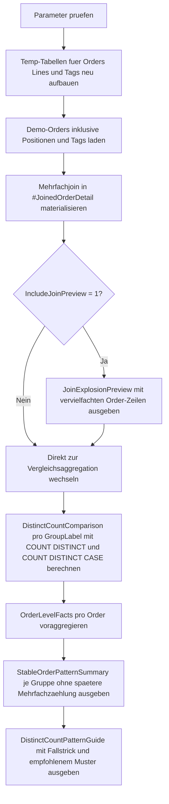

# DistinctCountPatterns.sql

Dieses Skript zeigt typische Muster fuer `COUNT(DISTINCT ...)`, wenn eine fachliche Entitaet durch mehrere Join-Pfade vervielfacht wird. Die Demo kontrastiert bewusst naive Zeilenzaehlung mit belastbaren Distinct- und Voraggregationsmustern.

## Uebersicht

<!-- SQLDOC:SUMMARY_TABLE:BEGIN -->
| Feld | Wert |
|---|---|
| Script | [DistinctCountPatterns.sql](DistinctCountPatterns.sql) |
| Version | `1.0` |
| Typ | `didactic-lab` |
| Kapitel | `10_GroupBy_Aggregate` |
| Sicherheit | `read-only-tempdb` |
| Zweck | Demonstriert Muster fuer `COUNT(DISTINCT ...)` und typische Stolperfallen bei Mehrfachjoins. |
<!-- SQLDOC:SUMMARY_TABLE:END -->

## Einordnung

`COUNT(DISTINCT ...)` wird besonders wichtig, sobald eine Entitaet wie eine Bestellung gleichzeitig mit Positionsdaten, Tags, Events oder anderen Kindmengen verknuepft wird. Ohne Gegenmassnahme misst `COUNT(*)` dann nicht mehr Orders, sondern vervielfachte Join-Zeilen.

Das Skript zeigt drei Perspektiven:

- eine Vorschau auf die Join-Explosion aus Positionen und Tags
- eine direkte Aggregation mit `COUNT(DISTINCT ...)`
- eine stabile Alternative, bei der pro Order voraggregiert und erst danach gruppiert wird

## Annahmen

- Die Erstversion nutzt lokale Temp-Tabellen fuer Orders, Order-Lines und Order-Tags statt produktiver Tabellen.
- Jeder Join auf Lines und Tags ist bewusst `INNER JOIN`, damit die Vervielfachung klar sichtbar bleibt.
- `@GroupByMode` beschraenkt sich auf `region` und `customer`, um das Distinct-Muster nicht mit weiterer Dynamik zu ueberladen.
- `@HighValueThreshold = 2500.00` ist ein didaktischer Grenzwert fuer bedingte Distinct-Zaehlungen.
- Die stabile Alternative summiert orderweise Kennzahlen und vermeidet dadurch spaetere Mehrfachzaehlungen pro Gruppe.

## Anwendungsfall

Das Artefakt eignet sich fuer Reviews, Trainings und Diagnoseabfragen, bei denen Reportzahlen nach mehreren Detail-Joins unplausibel hoch ausfallen. Es laesst sich spaeter leicht auf Produktivtabellen uebertragen, indem die Temp-Tabellen durch reale Quellen ersetzt und die Voraggregationsstufe pro Geschaeftsentitaet beibehalten wird.

## Parameter

<!-- SQLDOC:PARAMETERS_TABLE:BEGIN -->
| Parameter | SQL-Typ | Pflicht | Beschreibung |
|---|---|---|---|
| `@GroupByMode` | `VARCHAR(20)` | Ja | Waehlt `region` oder `customer` als Gruppierung fuer die Vergleiche. |
| `@IncludeJoinPreview` | `BIT` | Nein | Gibt bei `1` die vervielfachten Join-Zeilen vor der Aggregation aus. |
| `@HighValueThreshold` | `DECIMAL(12,2)` | Nein | Grenzwert fuer `COUNT(DISTINCT CASE WHEN ...)` auf umsatzstarke Orders. |
<!-- SQLDOC:PARAMETERS_TABLE:END -->

## Abhaengigkeiten

<!-- SQLDOC:DEPENDENCIES_LIST:BEGIN -->
- `tempdb`
- `COUNT(DISTINCT)`
- `CASE`
- `GROUP BY`
- `SUM()`
- `COUNT()`
- `DROP TABLE IF EXISTS`
<!-- SQLDOC:DEPENDENCIES_LIST:END -->

## Hinweise

- `#JoinedOrderDetail` materialisiert die Mehrfachjoin-Situation, damit Vorschau und Aggregation denselben Datenstand nutzen.
- `DistinctCountComparison` zeigt die Kernregel: `COUNT(*)` und `COUNT(OrderID)` zaehlen Join-Zeilen, `COUNT(DISTINCT OrderID)` zaehlt Orders.
- `COUNT(DISTINCT CASE WHEN ... THEN OrderID END)` eignet sich fuer entitaetsbezogene Teilmengen wie spaete oder hochpreisige Orders.
- `OrderLevelFacts` demonstriert ein robustes Muster fuer Reports, bei denen pro Order bereits Produkt- und Tag-Kennzahlen verdichtet werden.

## Versionshistorie

<!-- SQLDOC:VERSION_HISTORY_TABLE:BEGIN -->
| Version | Datum | User | Beschreibung |
|---|---|---|---|
| `1.0` | `2026-04-18` | `ER` | Erstversion fuer COUNT(DISTINCT)-Muster und Mehrfachjoin-Fallstricke |
<!-- SQLDOC:VERSION_HISTORY_TABLE:END -->

## Ablauf

<!-- SQLDOC:MERMAID:BEGIN -->

<!-- SQLDOC:MERMAID:END -->

## SQL-Code

<!-- SQLDOC:SQL_CODE:BEGIN -->
```sql
/*
BEGIN:SQL-HEADER v1
---
sql_header: v1
script_name: "DistinctCountPatterns.sql"
script_version: "1.0"
script_type: "didactic-lab"
chapter: "10_GroupBy_Aggregate"

purpose: >
  Demonstriert belastbare Muster fuer COUNT(DISTINCT ...) bei Mehrfachjoins
  und zeigt, wie Join-Multiplikation naive Aggregationen verfaelscht.

parameters:
  - name: "@GroupByMode"
    sql_type: "VARCHAR(20)"
    direction: "IN"
    required: true
    description: "Waehlt region oder customer als Gruppierung fuer die Vergleiche"
  - name: "@IncludeJoinPreview"
    sql_type: "BIT"
    direction: "IN"
    required: false
    description: "1 gibt die aufmultiplizierten Join-Zeilen vor der Aggregation aus"
  - name: "@HighValueThreshold"
    sql_type: "DECIMAL(12,2)"
    direction: "IN"
    required: false
    description: "Grenzwert fuer COUNT(DISTINCT CASE WHEN ...) auf umsatzstarke Orders"

result_sets:
  - name: "JoinExplosionPreview"
    description: "Optionale Vorschau auf die vervielfachten Join-Zeilen aus Lines und Tags"
  - name: "DistinctCountComparison"
    description: "Vergleicht naive Zeilenzaehlung, COUNT(DISTINCT) und bedingte DISTINCT-Muster"
  - name: "StableOrderPatternSummary"
    description: "Zeigt eine stabile Alternative per Voraggregation pro Order vor dem Gruppieren"
  - name: "DistinctCountPatternGuide"
    description: "Ordnet die gezeigten Muster und ihren Einsatzzweck kurz ein"

dependencies:
  - "tempdb"
  - "COUNT(DISTINCT)"
  - "CASE"
  - "GROUP BY"
  - "SUM()"
  - "COUNT()"
  - "DROP TABLE IF EXISTS"

safety:
  level: "read-only-tempdb"
  writes_data: false

documentation:
  markdown_file: "T-SQL/10_GroupBy_Aggregate/SQLScripts/DistinctCountPatterns.md"
  sync_blocks:
    - "SUMMARY_TABLE"
    - "PARAMETERS_TABLE"
    - "DEPENDENCIES_LIST"
    - "VERSION_HISTORY_TABLE"
    - "SQL_CODE"
  mermaid:
    mode: "ai-agent-from-sql"
    source: "script-body"

main_responsible:
  name: "Erhard Rainer"
  initials: "ER"

version_history:
  - version: "1.0"
    date: "2026-04-18"
    user: "ER"
    description: "Erstversion fuer COUNT(DISTINCT)-Muster und Mehrfachjoin-Fallstricke"

notes:
  - "Die Erstversion nutzt ausschliesslich lokale Temp-Tabellen."
  - "Das Skript kontrastiert absichtlich naive und stabile Aggregationsmuster."
---
END:SQL-HEADER v1
*/

SET NOCOUNT ON;

DECLARE @GroupByMode VARCHAR(20) = 'region';
DECLARE @IncludeJoinPreview BIT = 1;
DECLARE @HighValueThreshold DECIMAL(12,2) = 2500.00;

IF @GroupByMode NOT IN ('region', 'customer')
BEGIN
    THROW 50030, '@GroupByMode muss region oder customer sein.', 1;
END;

IF @IncludeJoinPreview NOT IN (0, 1)
BEGIN
    THROW 50031, '@IncludeJoinPreview muss 0 oder 1 sein.', 1;
END;

IF @HighValueThreshold <= 0
BEGIN
    THROW 50032, '@HighValueThreshold muss groesser als 0 sein.', 1;
END;

DROP TABLE IF EXISTS #Orders;
DROP TABLE IF EXISTS #OrderLines;
DROP TABLE IF EXISTS #OrderTags;
DROP TABLE IF EXISTS #JoinedOrderDetail;

CREATE TABLE #Orders
(
    OrderID INT NOT NULL,
    CustomerName VARCHAR(40) NOT NULL,
    SalesRegion VARCHAR(20) NOT NULL,
    OrderDate DATE NOT NULL,
    OrderAmount DECIMAL(12,2) NOT NULL,
    DeliveryStatus VARCHAR(20) NOT NULL
);

CREATE TABLE #OrderLines
(
    OrderID INT NOT NULL,
    LineNo INT NOT NULL,
    ProductCode VARCHAR(20) NOT NULL,
    Quantity INT NOT NULL
);

CREATE TABLE #OrderTags
(
    OrderID INT NOT NULL,
    TagName VARCHAR(30) NOT NULL
);

INSERT INTO #Orders
(
    OrderID,
    CustomerName,
    SalesRegion,
    OrderDate,
    OrderAmount,
    DeliveryStatus
)
VALUES
    (2001, 'Aster Retail', 'North', '2026-02-03', 1800.00, 'OnTime'),
    (2002, 'Aster Retail', 'North', '2026-02-11', 4200.00, 'Late'),
    (2003, 'Blue Harbor',  'West',  '2026-02-15', 2600.00, 'Late'),
    (2004, 'City Health',  'West',  '2026-03-01', 1500.00, 'OnTime'),
    (2005, 'Delta Works',  'South', '2026-03-07', 3100.00, 'Late'),
    (2006, 'Delta Works',  'South', '2026-03-21',  900.00, 'OnTime');

INSERT INTO #OrderLines
(
    OrderID,
    LineNo,
    ProductCode,
    Quantity
)
VALUES
    (2001, 1, 'SKU-Keyboard', 2),
    (2001, 2, 'SKU-Mouse',    2),
    (2002, 1, 'SKU-Desk',     1),
    (2002, 2, 'SKU-Chair',    4),
    (2002, 3, 'SKU-Lamp',     2),
    (2003, 1, 'SKU-Tablet',   3),
    (2003, 2, 'SKU-Case',     3),
    (2004, 1, 'SKU-Monitor',  1),
    (2005, 1, 'SKU-Phone',    5),
    (2005, 2, 'SKU-Headset',  5),
    (2006, 1, 'SKU-Cable',   10);

INSERT INTO #OrderTags
(
    OrderID,
    TagName
)
VALUES
    (2001, 'Campaign'),
    (2001, 'Email'),
    (2002, 'Campaign'),
    (2002, 'Priority'),
    (2003, 'Priority'),
    (2003, 'Renewal'),
    (2004, 'Email'),
    (2005, 'Campaign'),
    (2005, 'Partner'),
    (2005, 'Priority'),
    (2006, 'Partner');

SELECT
    o.OrderID,
    o.CustomerName,
    o.SalesRegion,
    o.OrderDate,
    o.OrderAmount,
    o.DeliveryStatus,
    ol.LineNo,
    ol.ProductCode,
    ol.Quantity,
    ot.TagName,
    CASE
        WHEN @GroupByMode = 'region' THEN o.SalesRegion
        ELSE o.CustomerName
    END AS GroupLabel
INTO #JoinedOrderDetail
FROM #Orders AS o
INNER JOIN #OrderLines AS ol
    ON ol.OrderID = o.OrderID
INNER JOIN #OrderTags AS ot
    ON ot.OrderID = o.OrderID;

IF @IncludeJoinPreview = 1
BEGIN
    SELECT
        jod.GroupLabel,
        jod.OrderID,
        jod.CustomerName,
        jod.SalesRegion,
        jod.ProductCode,
        jod.TagName,
        jod.OrderAmount,
        jod.DeliveryStatus
    FROM #JoinedOrderDetail AS jod
    ORDER BY
        jod.GroupLabel,
        jod.OrderID,
        jod.LineNo,
        jod.TagName;
END;

SELECT
    jod.GroupLabel,
    COUNT(*) AS JoinedRowCount,
    COUNT(jod.OrderID) AS NaiveOrderCount,
    COUNT(DISTINCT jod.OrderID) AS DistinctOrderCount,
    COUNT(DISTINCT jod.CustomerName) AS DistinctCustomerCount,
    COUNT(DISTINCT jod.ProductCode) AS DistinctProductCount,
    COUNT(DISTINCT CASE
        WHEN jod.OrderAmount >= @HighValueThreshold THEN jod.OrderID
    END) AS DistinctHighValueOrders,
    COUNT(DISTINCT CASE
        WHEN jod.DeliveryStatus = 'Late' THEN jod.OrderID
    END) AS DistinctLateOrders,
    COUNT(DISTINCT CASE
        WHEN jod.TagName = 'Priority' THEN jod.OrderID
    END) AS DistinctPriorityTaggedOrders
FROM #JoinedOrderDetail AS jod
GROUP BY
    jod.GroupLabel
ORDER BY
    jod.GroupLabel;

WITH OrderLevelFacts AS
(
    SELECT
        o.OrderID,
        o.CustomerName,
        o.SalesRegion,
        o.OrderAmount,
        o.DeliveryStatus,
        CASE
            WHEN @GroupByMode = 'region' THEN o.SalesRegion
            ELSE o.CustomerName
        END AS GroupLabel,
        COUNT(DISTINCT ol.ProductCode) AS DistinctProductsPerOrder,
        COUNT(DISTINCT ot.TagName) AS DistinctTagsPerOrder,
        MAX(CASE WHEN ot.TagName = 'Priority' THEN 1 ELSE 0 END) AS HasPriorityTag
    FROM #Orders AS o
    INNER JOIN #OrderLines AS ol
        ON ol.OrderID = o.OrderID
    LEFT JOIN #OrderTags AS ot
        ON ot.OrderID = o.OrderID
    GROUP BY
        o.OrderID,
        o.CustomerName,
        o.SalesRegion,
        o.OrderAmount,
        o.DeliveryStatus
)
SELECT
    olf.GroupLabel,
    COUNT(*) AS StableOrderCount,
    SUM(olf.DistinctProductsPerOrder) AS SumDistinctProductsPerOrder,
    AVG(CAST(olf.DistinctTagsPerOrder AS DECIMAL(12,2))) AS AvgDistinctTagsPerOrder,
    SUM(CASE WHEN olf.OrderAmount >= @HighValueThreshold THEN 1 ELSE 0 END) AS HighValueOrderCount,
    SUM(CASE WHEN olf.DeliveryStatus = 'Late' THEN 1 ELSE 0 END) AS LateOrderCount,
    SUM(CASE WHEN olf.HasPriorityTag = 1 THEN 1 ELSE 0 END) AS PriorityTaggedOrderCount
FROM OrderLevelFacts AS olf
GROUP BY
    olf.GroupLabel
ORDER BY
    olf.GroupLabel;

SELECT
    @GroupByMode AS ActiveGroupByMode,
    @HighValueThreshold AS ActiveHighValueThreshold,
    'Naive COUNT(*) ueber Mehrfachjoins misst Join-Zeilen und nicht fachliche Orders.' AS Pitfall,
    'COUNT(DISTINCT OrderID) stabilisiert Entitaetszahlen; Voraggregation pro Order reduziert spaetere DISTINCT-Last.' AS RecommendedPattern,
    'COUNT(DISTINCT CASE WHEN ... THEN OrderID END) eignet sich fuer bedingte Entitaetszaehlungen.' AS ConditionalDistinctPattern;
```
<!-- SQLDOC:SQL_CODE:END -->
