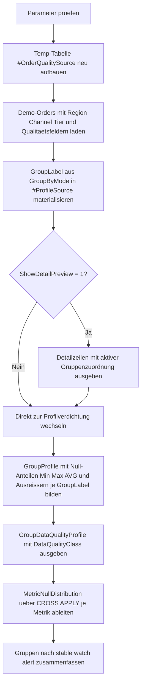

# GroupByDataQualityProfile.sql

Dieses didaktische Skript zeigt, wie Datenqualitaet ueber `GROUP BY` sichtbar gemacht werden kann. Die Demo verbindet Null-Anteile, einfache Verteilungskennzahlen und Extremwertsignale, damit auffaellige Gruppen schnell erkennbar werden.

## Uebersicht

<!-- SQLDOC:SUMMARY_TABLE:BEGIN -->
| Feld | Wert |
|---|---|
| Script | [GroupByDataQualityProfile.sql](GroupByDataQualityProfile.sql) |
| Version | `1.0` |
| Typ | `didactic-lab` |
| Kapitel | `10_GroupBy_Aggregate` |
| Sicherheit | `read-only-tempdb` |
| Zweck | Profiliert Null-Anteile, Verteilungen und Extremwerte ueber frei waehlbare Gruppierungen. |
<!-- SQLDOC:SUMMARY_TABLE:END -->

## Einordnung

Das Muster passt zu typischen Profiling-Fragen im Unterricht und in Diagnoseabfragen:

- Welche Gruppen haben viele fehlende Werte in zentralen Kennzahlen?
- Wo liegen besonders hohe Betragswerte oder lange Durchlaufzeiten?
- Welche Gruppierung zeigt die groessten Datenqualitaetsunterschiede?

Statt robuster Statistik nutzt die Erstversion bewusst einfache Schwellen, damit die Wirkung der Aggregationen klar nachvollziehbar bleibt.

## Annahmen

- Die Erstversion nutzt eine lokale Temp-Tabelle `#OrderQualitySource` statt produktiver Order- oder Faktentabellen.
- `@GroupByMode` beschraenkt sich auf `region`, `channel` und `tier`, damit dieselbe Demoquelle fuer mehrere Gruppierungsperspektiven wiederverwendet werden kann.
- Extremwerte fuer `InvoiceAmount` werden didaktisch ueber `@OutlierAmountThreshold` statt ueber Z-Score- oder IQR-Verfahren markiert.
- `DaysToShip >= 10` gilt in der Demo als langsamer Versandfall.
- Die Klassen `stable`, `watch` und `alert` fassen Null-Anteile und Extremwertsignale bewusst zu einer kompakten Ampel zusammen.

## Anwendungsfall

Das Artefakt eignet sich fuer Schulung, Explorationsabfragen und erste Datenqualitaetschecks, wenn fehlende Werte und Ausreisser nicht nur insgesamt, sondern je Fachgruppe betrachtet werden sollen. In realen Umgebungen kann die Temp-Tabelle spaeter durch Produktivquellen ersetzt werden, waehrend die Gruppierungs- und Profiling-Logik erhalten bleibt.

## Parameter

<!-- SQLDOC:PARAMETERS_TABLE:BEGIN -->
| Parameter | SQL-Typ | Pflicht | Beschreibung |
|---|---|---|---|
| `@GroupByMode` | `VARCHAR(20)` | Ja | Waehlt `region`, `channel` oder `tier` als Gruppierungsmodus. |
| `@NullShareAlertThreshold` | `DECIMAL(5,4)` | Ja | Schwellenwert fuer auffaellige Null-Anteile innerhalb einer Gruppe. |
| `@OutlierAmountThreshold` | `DECIMAL(12,2)` | Ja | Grenzwert fuer auffaellig hohe `InvoiceAmount`-Werte. |
| `@ShowDetailPreview` | `BIT` | Nein | Gibt bei `1` die Demo-Zeilen mit aktiver Gruppenzuordnung vor der Verdichtung aus. |
<!-- SQLDOC:PARAMETERS_TABLE:END -->

## Abhaengigkeiten

<!-- SQLDOC:DEPENDENCIES_LIST:BEGIN -->
- `tempdb`
- `GROUP BY`
- `CASE`
- `AVG()`
- `MIN()`
- `MAX()`
- `COUNT()`
- `SUM()`
- `CAST()`
- `CROSS APPLY`
- `NULLIF()`
- `DROP TABLE IF EXISTS`
<!-- SQLDOC:DEPENDENCIES_LIST:END -->

## Hinweise

- `GroupDataQualityProfile` kombiniert Null-Anteile, Min/Max-Werte, Durchschnitte und einfache Ausreisserzaehlungen pro Gruppe.
- `MetricNullDistribution` zeigt dieselben Null-Signale nochmals in einer zeilenorientierten Form je Metrik.
- Die Ampelklasse gewichtet sowohl hohe Null-Anteile als auch auffaellige Betrags- und Laufzeitfaelle.
- Der optionale Detail-Preview macht transparent, welche Rohzeilen in die aktive Gruppenzuordnung einfliessen.

## Versionshistorie

<!-- SQLDOC:VERSION_HISTORY_TABLE:BEGIN -->
| Version | Datum | User | Beschreibung |
|---|---|---|---|
| `1.0` | `2026-04-18` | `ER` | Erstversion eines didaktischen Profilings fuer Null-Anteile und Extremwerte je Gruppe |
<!-- SQLDOC:VERSION_HISTORY_TABLE:END -->

## Ablauf

<!-- SQLDOC:MERMAID:BEGIN -->

<!-- SQLDOC:MERMAID:END -->

## SQL-Code

<!-- SQLDOC:SQL_CODE:BEGIN -->
```sql
/*
BEGIN:SQL-HEADER v1
---
sql_header: v1
script_name: "GroupByDataQualityProfile.sql"
script_version: "1.0"
script_type: "didactic-lab"
chapter: "10_GroupBy_Aggregate"

purpose: >
  Profiliert Datenqualitaet ueber frei waehlbare Gruppierungen, misst
  Null-Anteile, Verteilungen und Extremwerte fuer mehrere Kennzahlen
  und klassifiziert Gruppen nach auffaelligen Profil-Signalen.

parameters:
  - name: "@GroupByMode"
    sql_type: "VARCHAR(20)"
    direction: "IN"
    required: true
    description: "Waehlt region, channel oder tier als Gruppierungsmodus"
  - name: "@NullShareAlertThreshold"
    sql_type: "DECIMAL(5,4)"
    direction: "IN"
    required: true
    description: "Schwellenwert fuer auffaellige Null-Anteile innerhalb einer Gruppe"
  - name: "@OutlierAmountThreshold"
    sql_type: "DECIMAL(12,2)"
    direction: "IN"
    required: true
    description: "Grenzwert fuer auffaellig hohe InvoiceAmount-Werte"
  - name: "@ShowDetailPreview"
    sql_type: "BIT"
    direction: "IN"
    required: false
    description: "1 = zeigt die Demo-Zeilen vor der Verdichtung an"

result_sets:
  - name: "DataQualityDetailPreview"
    description: "Optionale Vorschau der Demo-Zeilen mit aktiver Gruppenzuordnung"
  - name: "GroupDataQualityProfile"
    description: "Verdichtetes Profil je Gruppe mit Null-Anteilen, Min/Max-Werten und Ausreissern"
  - name: "MetricNullDistribution"
    description: "Null-Anteile je Gruppe und Metrik in zeilenorientierter Form"
  - name: "DataQualityIssueSummary"
    description: "Zaehlt Gruppen nach Datenqualitaetsklasse"

dependencies:
  - "tempdb"
  - "GROUP BY"
  - "CASE"
  - "AVG()"
  - "MIN()"
  - "MAX()"
  - "COUNT()"
  - "SUM()"
  - "CAST()"
  - "CROSS APPLY"
  - "NULLIF()"
  - "DROP TABLE IF EXISTS"

safety:
  level: "read-only-tempdb"
  writes_data: false

documentation:
  markdown_file: "T-SQL/10_GroupBy_Aggregate/SQLScripts/GroupByDataQualityProfile.md"
  sync_blocks:
    - "SUMMARY_TABLE"
    - "PARAMETERS_TABLE"
    - "DEPENDENCIES_LIST"
    - "VERSION_HISTORY_TABLE"
    - "SQL_CODE"
  mermaid:
    mode: "ai-agent-from-sql"
    source: "script-body"

main_responsible:
  name: "Erhard Rainer"
  initials: "ER"

version_history:
  - version: "1.0"
    date: "2026-04-18"
    user: "ER"
    description: "Erstversion eines didaktischen Profilings fuer Null-Anteile und Extremwerte je Gruppe"

notes:
  - "Die Erstversion nutzt ausschliesslich lokale Temp-Daten statt produktiver Faktentabellen."
  - "Extremwerte werden ueber einfache, didaktische Schwellen statt robuster Statistik markiert."
---
END:SQL-HEADER v1
*/

SET NOCOUNT ON;

DECLARE @GroupByMode VARCHAR(20) = 'region';
DECLARE @NullShareAlertThreshold DECIMAL(5,4) = 0.2500;
DECLARE @OutlierAmountThreshold DECIMAL(12,2) = 8000.00;
DECLARE @ShowDetailPreview BIT = 1;

IF @GroupByMode NOT IN ('region', 'channel', 'tier')
BEGIN
    THROW 50040, '@GroupByMode muss region, channel oder tier sein.', 1;
END;

IF @NullShareAlertThreshold IS NULL OR @NullShareAlertThreshold <= 0 OR @NullShareAlertThreshold >= 1
BEGIN
    THROW 50041, '@NullShareAlertThreshold muss groesser als 0 und kleiner als 1 sein.', 1;
END;

IF @OutlierAmountThreshold IS NULL OR @OutlierAmountThreshold <= 0
BEGIN
    THROW 50042, '@OutlierAmountThreshold muss groesser als 0 sein.', 1;
END;

IF @ShowDetailPreview NOT IN (0, 1)
BEGIN
    THROW 50043, '@ShowDetailPreview muss 0 oder 1 sein.', 1;
END;

DROP TABLE IF EXISTS #OrderQualitySource;
DROP TABLE IF EXISTS #ProfileSource;

CREATE TABLE #OrderQualitySource
(
    OrderID INT NOT NULL,
    SalesRegion VARCHAR(20) NOT NULL,
    SalesChannel VARCHAR(20) NOT NULL,
    CustomerTier VARCHAR(20) NOT NULL,
    InvoiceAmount DECIMAL(12,2) NULL,
    DiscountPct DECIMAL(5,2) NULL,
    DaysToShip INT NULL,
    SatisfactionScore INT NULL,
    OrderStatus VARCHAR(20) NOT NULL
);

INSERT INTO #OrderQualitySource
(
    OrderID,
    SalesRegion,
    SalesChannel,
    CustomerTier,
    InvoiceAmount,
    DiscountPct,
    DaysToShip,
    SatisfactionScore,
    OrderStatus
)
VALUES
    (6101, 'North', 'Online', 'Enterprise', 1250.00,  5.00, 2,  9, 'Closed'),
    (6102, 'North', 'Online', 'Enterprise', 8400.00,  7.50, 9,  6, 'Closed'),
    (6103, 'North', 'Retail', 'SMB',         490.00, NULL, 3,  8, 'Closed'),
    (6104, 'North', 'Retail', 'SMB',           NULL, 4.00, 4,  7, 'Pending'),
    (6105, 'South', 'Partner', 'Enterprise', 2200.00, 15.00, 5, 5, 'Closed'),
    (6106, 'South', 'Partner', 'Enterprise', 9100.00, 18.00, 12, 4, 'Closed'),
    (6107, 'South', 'Online', 'Public',       320.00, NULL, NULL, 8, 'Pending'),
    (6108, 'South', 'Online', 'Public',       305.00, 1.50, 1, NULL, 'Closed'),
    (6109, 'West', 'Retail', 'SMB',           780.00, 3.00, 2,  9, 'Closed'),
    (6110, 'West', 'Retail', 'SMB',           805.00, 3.50, 2,  9, 'Closed'),
    (6111, 'West', 'Partner', 'Enterprise', 12000.00, 20.00, 15, 3, 'Closed'),
    (6112, 'West', 'Partner', 'Enterprise',    NULL, NULL, 18, NULL, 'Pending'),
    (6113, 'East', 'Online', 'Public',        210.00, 0.00, 1, 10, 'Closed'),
    (6114, 'East', 'Online', 'Public',        225.00, 0.50, 1, 10, 'Closed'),
    (6115, 'East', 'Retail', 'SMB',           260.00, 2.00, 2,  8, 'Closed'),
    (6116, 'East', 'Retail', 'SMB',           275.00, NULL, 2,  8, 'Closed'),
    (6117, 'Central', 'Partner', 'Enterprise', 5400.00, 12.00, 7, 6, 'Pending'),
    (6118, 'Central', 'Partner', 'Enterprise', 5700.00, 12.50, 7, 6, 'Closed'),
    (6119, 'Central', 'Online', 'SMB',         430.00, 2.50, NULL, 7, 'Closed'),
    (6120, 'Central', 'Online', 'SMB',           NULL, 2.50, 6, NULL, 'Pending');

;WITH ProfileSource AS
(
    SELECT
        oqs.OrderID,
        oqs.SalesRegion,
        oqs.SalesChannel,
        oqs.CustomerTier,
        oqs.InvoiceAmount,
        oqs.DiscountPct,
        oqs.DaysToShip,
        oqs.SatisfactionScore,
        oqs.OrderStatus,
        CASE
            WHEN @GroupByMode = 'region' THEN oqs.SalesRegion
            WHEN @GroupByMode = 'channel' THEN oqs.SalesChannel
            ELSE oqs.CustomerTier
        END AS GroupLabel
    FROM #OrderQualitySource AS oqs
)
SELECT
    ps.OrderID,
    ps.GroupLabel,
    ps.SalesRegion,
    ps.SalesChannel,
    ps.CustomerTier,
    ps.InvoiceAmount,
    ps.DiscountPct,
    ps.DaysToShip,
    ps.SatisfactionScore,
    ps.OrderStatus
INTO #ProfileSource
FROM ProfileSource AS ps;

IF @ShowDetailPreview = 1
BEGIN
    SELECT
        ps.OrderID,
        ps.GroupLabel,
        ps.SalesRegion,
        ps.SalesChannel,
        ps.CustomerTier,
        ps.InvoiceAmount,
        ps.DiscountPct,
        ps.DaysToShip,
        ps.SatisfactionScore,
        ps.OrderStatus
    FROM #ProfileSource AS ps
    ORDER BY
        ps.GroupLabel,
        ps.OrderID;
END;

;WITH GroupProfile AS
(
    SELECT
        ps.GroupLabel,
        COUNT(*) AS RowCount,
        SUM(CASE WHEN ps.InvoiceAmount IS NULL THEN 1 ELSE 0 END) AS InvoiceAmountNullCount,
        CAST(SUM(CASE WHEN ps.InvoiceAmount IS NULL THEN 1 ELSE 0 END) * 1.0 / NULLIF(COUNT(*), 0) AS DECIMAL(5,4)) AS InvoiceAmountNullShare,
        MIN(ps.InvoiceAmount) AS MinInvoiceAmount,
        MAX(ps.InvoiceAmount) AS MaxInvoiceAmount,
        CAST(AVG(ps.InvoiceAmount) AS DECIMAL(12,2)) AS AvgInvoiceAmount,
        SUM(CASE WHEN ps.InvoiceAmount >= @OutlierAmountThreshold THEN 1 ELSE 0 END) AS InvoiceAmountOutlierCount,
        SUM(CASE WHEN ps.DiscountPct IS NULL THEN 1 ELSE 0 END) AS DiscountNullCount,
        CAST(SUM(CASE WHEN ps.DiscountPct IS NULL THEN 1 ELSE 0 END) * 1.0 / NULLIF(COUNT(*), 0) AS DECIMAL(5,4)) AS DiscountNullShare,
        MIN(ps.DiscountPct) AS MinDiscountPct,
        MAX(ps.DiscountPct) AS MaxDiscountPct,
        CAST(AVG(ps.DiscountPct) AS DECIMAL(10,2)) AS AvgDiscountPct,
        SUM(CASE WHEN ps.DaysToShip IS NULL THEN 1 ELSE 0 END) AS DaysToShipNullCount,
        CAST(SUM(CASE WHEN ps.DaysToShip IS NULL THEN 1 ELSE 0 END) * 1.0 / NULLIF(COUNT(*), 0) AS DECIMAL(5,4)) AS DaysToShipNullShare,
        MIN(ps.DaysToShip) AS MinDaysToShip,
        MAX(ps.DaysToShip) AS MaxDaysToShip,
        CAST(AVG(CAST(ps.DaysToShip AS DECIMAL(10,2))) AS DECIMAL(10,2)) AS AvgDaysToShip,
        SUM(CASE WHEN ps.DaysToShip >= 10 THEN 1 ELSE 0 END) AS SlowShipmentCount,
        SUM(CASE WHEN ps.SatisfactionScore IS NULL THEN 1 ELSE 0 END) AS SatisfactionNullCount,
        CAST(SUM(CASE WHEN ps.SatisfactionScore IS NULL THEN 1 ELSE 0 END) * 1.0 / NULLIF(COUNT(*), 0) AS DECIMAL(5,4)) AS SatisfactionNullShare,
        MIN(ps.SatisfactionScore) AS MinSatisfactionScore,
        MAX(ps.SatisfactionScore) AS MaxSatisfactionScore,
        CAST(AVG(CAST(ps.SatisfactionScore AS DECIMAL(10,2))) AS DECIMAL(10,2)) AS AvgSatisfactionScore,
        SUM(CASE WHEN ps.OrderStatus = 'Pending' THEN 1 ELSE 0 END) AS PendingOrderCount
    FROM #ProfileSource AS ps
    GROUP BY
        ps.GroupLabel
)
SELECT
    gp.GroupLabel,
    gp.RowCount,
    gp.InvoiceAmountNullCount,
    gp.InvoiceAmountNullShare,
    gp.MinInvoiceAmount,
    gp.MaxInvoiceAmount,
    gp.AvgInvoiceAmount,
    gp.InvoiceAmountOutlierCount,
    gp.DiscountNullCount,
    gp.DiscountNullShare,
    gp.MinDiscountPct,
    gp.MaxDiscountPct,
    gp.AvgDiscountPct,
    gp.DaysToShipNullCount,
    gp.DaysToShipNullShare,
    gp.MinDaysToShip,
    gp.MaxDaysToShip,
    gp.AvgDaysToShip,
    gp.SlowShipmentCount,
    gp.SatisfactionNullCount,
    gp.SatisfactionNullShare,
    gp.MinSatisfactionScore,
    gp.MaxSatisfactionScore,
    gp.AvgSatisfactionScore,
    gp.PendingOrderCount,
    CASE
        WHEN gp.InvoiceAmountNullShare >= @NullShareAlertThreshold
            OR gp.DiscountNullShare >= @NullShareAlertThreshold
            OR gp.DaysToShipNullShare >= @NullShareAlertThreshold
            OR gp.SatisfactionNullShare >= @NullShareAlertThreshold
            OR gp.InvoiceAmountOutlierCount >= 2
            OR gp.SlowShipmentCount >= 2 THEN 'alert'
        WHEN gp.InvoiceAmountNullShare >= @NullShareAlertThreshold * 0.50
            OR gp.DiscountNullShare >= @NullShareAlertThreshold * 0.50
            OR gp.DaysToShipNullShare >= @NullShareAlertThreshold * 0.50
            OR gp.SatisfactionNullShare >= @NullShareAlertThreshold * 0.50
            OR gp.InvoiceAmountOutlierCount = 1
            OR gp.SlowShipmentCount = 1 THEN 'watch'
        ELSE 'stable'
    END AS DataQualityClass
FROM GroupProfile AS gp
ORDER BY
    CASE
        WHEN gp.InvoiceAmountNullShare >= @NullShareAlertThreshold
            OR gp.DiscountNullShare >= @NullShareAlertThreshold
            OR gp.DaysToShipNullShare >= @NullShareAlertThreshold
            OR gp.SatisfactionNullShare >= @NullShareAlertThreshold
            OR gp.InvoiceAmountOutlierCount >= 2
            OR gp.SlowShipmentCount >= 2 THEN 1
        WHEN gp.InvoiceAmountNullShare >= @NullShareAlertThreshold * 0.50
            OR gp.DiscountNullShare >= @NullShareAlertThreshold * 0.50
            OR gp.DaysToShipNullShare >= @NullShareAlertThreshold * 0.50
            OR gp.SatisfactionNullShare >= @NullShareAlertThreshold * 0.50
            OR gp.InvoiceAmountOutlierCount = 1
            OR gp.SlowShipmentCount = 1 THEN 2
        ELSE 3
    END,
    gp.GroupLabel;

;WITH MetricNulls AS
(
    SELECT
        ps.GroupLabel,
        ca.MetricName,
        SUM(ca.NullFlag) AS NullCount,
        COUNT(*) AS RowCount
    FROM #ProfileSource AS ps
    CROSS APPLY
    (
        VALUES
            ('InvoiceAmount', CASE WHEN ps.InvoiceAmount IS NULL THEN 1 ELSE 0 END),
            ('DiscountPct', CASE WHEN ps.DiscountPct IS NULL THEN 1 ELSE 0 END),
            ('DaysToShip', CASE WHEN ps.DaysToShip IS NULL THEN 1 ELSE 0 END),
            ('SatisfactionScore', CASE WHEN ps.SatisfactionScore IS NULL THEN 1 ELSE 0 END)
    ) AS ca(MetricName, NullFlag)
    GROUP BY
        ps.GroupLabel,
        ca.MetricName
)
SELECT
    mn.GroupLabel,
    mn.MetricName,
    mn.NullCount,
    mn.RowCount,
    CAST(mn.NullCount * 1.0 / NULLIF(mn.RowCount, 0) AS DECIMAL(5,4)) AS NullShare
FROM MetricNulls AS mn
ORDER BY
    mn.GroupLabel,
    CAST(mn.NullCount * 1.0 / NULLIF(mn.RowCount, 0) AS DECIMAL(5,4)) DESC,
    mn.MetricName;

;WITH GroupProfile AS
(
    SELECT
        ps.GroupLabel,
        CAST(SUM(CASE WHEN ps.InvoiceAmount IS NULL THEN 1 ELSE 0 END) * 1.0 / NULLIF(COUNT(*), 0) AS DECIMAL(5,4)) AS InvoiceAmountNullShare,
        CAST(SUM(CASE WHEN ps.DiscountPct IS NULL THEN 1 ELSE 0 END) * 1.0 / NULLIF(COUNT(*), 0) AS DECIMAL(5,4)) AS DiscountNullShare,
        CAST(SUM(CASE WHEN ps.DaysToShip IS NULL THEN 1 ELSE 0 END) * 1.0 / NULLIF(COUNT(*), 0) AS DECIMAL(5,4)) AS DaysToShipNullShare,
        CAST(SUM(CASE WHEN ps.SatisfactionScore IS NULL THEN 1 ELSE 0 END) * 1.0 / NULLIF(COUNT(*), 0) AS DECIMAL(5,4)) AS SatisfactionNullShare,
        SUM(CASE WHEN ps.InvoiceAmount >= @OutlierAmountThreshold THEN 1 ELSE 0 END) AS InvoiceAmountOutlierCount,
        SUM(CASE WHEN ps.DaysToShip >= 10 THEN 1 ELSE 0 END) AS SlowShipmentCount
    FROM #ProfileSource AS ps
    GROUP BY
        ps.GroupLabel
),
ClassifiedGroups AS
(
    SELECT
        gp.GroupLabel,
        CASE
            WHEN gp.InvoiceAmountNullShare >= @NullShareAlertThreshold
                OR gp.DiscountNullShare >= @NullShareAlertThreshold
                OR gp.DaysToShipNullShare >= @NullShareAlertThreshold
                OR gp.SatisfactionNullShare >= @NullShareAlertThreshold
                OR gp.InvoiceAmountOutlierCount >= 2
                OR gp.SlowShipmentCount >= 2 THEN 'alert'
            WHEN gp.InvoiceAmountNullShare >= @NullShareAlertThreshold * 0.50
                OR gp.DiscountNullShare >= @NullShareAlertThreshold * 0.50
                OR gp.DaysToShipNullShare >= @NullShareAlertThreshold * 0.50
                OR gp.SatisfactionNullShare >= @NullShareAlertThreshold * 0.50
                OR gp.InvoiceAmountOutlierCount = 1
                OR gp.SlowShipmentCount = 1 THEN 'watch'
            ELSE 'stable'
        END AS DataQualityClass
    FROM GroupProfile AS gp
)
SELECT
    cg.DataQualityClass,
    COUNT(*) AS GroupCount
FROM ClassifiedGroups AS cg
GROUP BY
    cg.DataQualityClass
ORDER BY
    GroupCount DESC,
    cg.DataQualityClass;

```
<!-- SQLDOC:SQL_CODE:END -->

