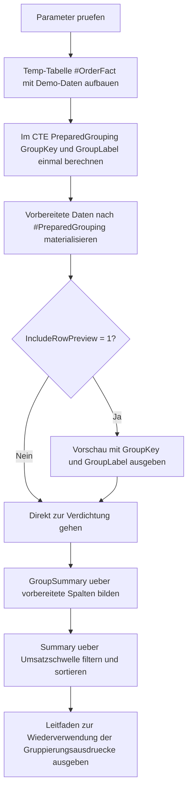

# GroupByExpressionReuse.sql

Dieses didaktische Skript zeigt, wie berechnete Gruppierungsausdruecke in T-SQL zuerst in einer vorbereitenden Stufe definiert und danach konsistent in Vorschau, Verdichtung und Schwellenfilter wiederverwendet werden. Dadurch bleiben `CASE`-Logik und Gruppierungssemantik an einer Stelle gebuendelt, statt mehrfach in `SELECT`, `GROUP BY` und `ORDER BY` dupliziert zu werden.

## Uebersicht

<!-- SQLDOC:SUMMARY_TABLE:BEGIN -->
| Feld | Wert |
|---|---|
| Script | [GroupByExpressionReuse.sql](GroupByExpressionReuse.sql) |
| Version | `1.0` |
| Typ | `didactic-lab` |
| Kapitel | `10_GroupBy_Aggregate` |
| Sicherheit | `read-only-tempdb` |
| Zweck | Bereitet berechnete Gruppierungsausdruecke einmal vor und verwendet sie danach lesbar fuer `GROUP BY`, Vorschau und Schwellenfilter wieder. |
<!-- SQLDOC:SUMMARY_TABLE:END -->

## Einordnung

Das Artefakt eignet sich als Muster fuer Abfragen, bei denen dieselbe Gruppierungslogik an mehreren Stellen gebraucht wird. Statt lange `CASE`-Ausdruecke mehrfach zu wiederholen, erzeugt das Skript zuerst eine vorbereitete Faktbasis mit `GroupKey` und `GroupLabel`. Erst danach folgt die eigentliche Verdichtung.

## Annahmen

- Die Erstversion nutzt eine lokale Temp-Tabelle `#OrderFact` statt produktiver Fakt- oder Buchungstabellen.
- Der Gruppierungsmodus waehlt zwischen Kalendermonat, Umsatzband und Fulfillment-Lane als didaktisch nachvollziehbaren Ausdrucksvarianten.
- Die Umsatzschwelle wird erst nach der Gruppierung auf die vorbereitete Summary angewendet, damit die Wiederverwendung auch fuer nachgelagerte Filter sichtbar bleibt.

## Anwendungsfall

Das Muster ist hilfreich, wenn eine Fachlogik in mehreren Query-Teilen konsistent gebraucht wird, etwa fuer Banderkennung, Zeitfenster, Serviceklassen oder Statusgruppen. Fuer reale Datenquellen kann die Temp-Basis spaeter durch eine Faktentabelle, View oder vorbereitende CTE ersetzt werden, ohne dass die Gruppierungslogik an mehreren Stellen neu geschrieben werden muss.

## Parameter

<!-- SQLDOC:PARAMETERS_TABLE:BEGIN -->
| Parameter | SQL-Typ | Pflicht | Beschreibung |
|---|---|---|---|
| `@GroupingMode` | `VARCHAR(20)` | Ja | Waehlt `calendar_month`, `revenue_band` oder `fulfillment_lane` als aktiven Gruppierungsausdruck. |
| `@MinimumGroupRevenue` | `DECIMAL(12,2)` | Ja | Filtert im Summary nur Gruppen, deren Umsatzsumme den Schwellwert erreicht. |
| `@IncludeRowPreview` | `BIT` | Nein | Gibt bei `1` die vorbereiteten Zeilen mit `GroupKey` und `GroupLabel` aus. |
<!-- SQLDOC:PARAMETERS_TABLE:END -->

## Abhaengigkeiten

<!-- SQLDOC:DEPENDENCIES_LIST:BEGIN -->
- `tempdb`
- `GROUP BY`
- `CASE`
- `DATEFROMPARTS()`
- `CONVERT()`
- `SUM()`
- `AVG()`
- `MIN()`
- `MAX()`
- `COUNT()`
- `DROP TABLE IF EXISTS`
<!-- SQLDOC:DEPENDENCIES_LIST:END -->

## Hinweise

- `GroupKey` dient der stabilen Sortierung und maschinenfreundlichen Gruppierung.
- `GroupLabel` ist die lesbare Fachbezeichnung derselben Gruppierung und wird aus derselben vorbereiteten Logik abgeleitet.
- Die vorbereitete Temp-Tabelle `#PreparedGrouping` macht sichtbar, dass dieselben Ausdruecke spaeter nicht erneut geschrieben werden muessen.

## Versionshistorie

<!-- SQLDOC:VERSION_HISTORY_TABLE:BEGIN -->
| Version | Datum | User | Beschreibung |
|---|---|---|---|
| `1.0` | `2026-04-18` | `ER` | Erstversion eines didaktischen Labs fuer wiederverwendbare Gruppierungsausdruecke |
<!-- SQLDOC:VERSION_HISTORY_TABLE:END -->

## Ablauf

<!-- SQLDOC:MERMAID:BEGIN -->

<!-- SQLDOC:MERMAID:END -->

## SQL-Code

<!-- SQLDOC:SQL_CODE:BEGIN -->
```sql
/*
BEGIN:SQL-HEADER v1
---
sql_header: v1
script_name: "GroupByExpressionReuse.sql"
script_version: "1.0"
script_type: "didactic-lab"
chapter: "10_GroupBy_Aggregate"

purpose: >
  Zeigt, wie berechnete Gruppierungsausdruecke in einer vorbereitenden
  Stufe einmal definiert und danach lesbar in Vorschau, GROUP BY,
  Verdichtung und Schwellenpruefung wiederverwendet werden koennen.

parameters:
  - name: "@GroupingMode"
    sql_type: "VARCHAR(20)"
    direction: "IN"
    required: true
    description: "Waehlt calendar_month, revenue_band oder fulfillment_lane als Gruppierungsausdruck"
  - name: "@MinimumGroupRevenue"
    sql_type: "DECIMAL(12,2)"
    direction: "IN"
    required: true
    description: "Filtert im Summary nur Gruppen, deren Umsatzsumme mindestens diesen Wert erreicht"
  - name: "@IncludeRowPreview"
    sql_type: "BIT"
    direction: "IN"
    required: false
    description: "1 = zeigt die vorbereitete Faktbasis mit wiederverwendeten Gruppierungsfeldern"

result_sets:
  - name: "PreparedOrderPreview"
    description: "Optionale Vorschau der Demo-Zeilen mit einmal berechnetem GroupKey und GroupLabel"
  - name: "ExpressionReuseSummary"
    description: "Verdichtete Kennzahlen je vorbereiteter Gruppe nach Umsatzschwelle"
  - name: "ExpressionReuseGuide"
    description: "Erklaert, welcher vorbereitete Gruppierungsausdruck aktiv war und warum die Wiederverwendung lesbarer ist"

dependencies:
  - "tempdb"
  - "GROUP BY"
  - "CASE"
  - "DATEFROMPARTS()"
  - "CONVERT()"
  - "SUM()"
  - "AVG()"
  - "MIN()"
  - "MAX()"
  - "COUNT()"
  - "DROP TABLE IF EXISTS"

safety:
  level: "read-only-tempdb"
  writes_data: false

documentation:
  markdown_file: "T-SQL/10_GroupBy_Aggregate/SQLScripts/GroupByExpressionReuse.md"
  sync_blocks:
    - "SUMMARY_TABLE"
    - "PARAMETERS_TABLE"
    - "DEPENDENCIES_LIST"
    - "VERSION_HISTORY_TABLE"
    - "SQL_CODE"
  mermaid:
    mode: "ai-agent-from-sql"
    source: "script-body"

main_responsible:
  name: "Erhard Rainer"
  initials: "ER"

version_history:
  - version: "1.0"
    date: "2026-04-18"
    user: "ER"
    description: "Erstversion eines didaktischen Labs fuer wiederverwendbare Gruppierungsausdruecke"

notes:
  - "Die Erstversion nutzt lokale Temp-Daten statt produktiver Faktentabellen."
  - "GroupKey und GroupLabel werden einmal vorbereitet und spaeter direkt wiederverwendet."
---
END:SQL-HEADER v1
*/

SET NOCOUNT ON;

DECLARE @GroupingMode VARCHAR(20) = 'revenue_band';
DECLARE @MinimumGroupRevenue DECIMAL(12,2) = 6000.00;
DECLARE @IncludeRowPreview BIT = 1;

IF @GroupingMode NOT IN ('calendar_month', 'revenue_band', 'fulfillment_lane')
BEGIN
    THROW 50050, '@GroupingMode muss calendar_month, revenue_band oder fulfillment_lane sein.', 1;
END;

IF @MinimumGroupRevenue IS NULL OR @MinimumGroupRevenue <= 0
BEGIN
    THROW 50051, '@MinimumGroupRevenue muss groesser als 0 sein.', 1;
END;

IF @IncludeRowPreview NOT IN (0, 1)
BEGIN
    THROW 50052, '@IncludeRowPreview muss 0 oder 1 sein.', 1;
END;

DROP TABLE IF EXISTS #OrderFact;
DROP TABLE IF EXISTS #PreparedGrouping;

CREATE TABLE #OrderFact
(
    OrderID INT NOT NULL,
    OrderDate DATE NOT NULL,
    SalesRegion VARCHAR(20) NOT NULL,
    CustomerSegment VARCHAR(20) NOT NULL,
    FulfillmentDays INT NOT NULL,
    OrderAmount DECIMAL(12,2) NOT NULL,
    MarginAmount DECIMAL(12,2) NOT NULL
);

INSERT INTO #OrderFact
(
    OrderID,
    OrderDate,
    SalesRegion,
    CustomerSegment,
    FulfillmentDays,
    OrderAmount,
    MarginAmount
)
VALUES
    (7101, '2026-01-05', 'North',   'SMB',        1,  1450.00,  290.00),
    (7102, '2026-01-09', 'North',   'Enterprise', 4,  3800.00,  760.00),
    (7103, '2026-01-14', 'South',   'Public',     7,  6200.00, 1240.00),
    (7104, '2026-01-22', 'West',    'SMB',        2,  2150.00,  430.00),
    (7105, '2026-02-03', 'South',   'Enterprise', 5,  4700.00,  940.00),
    (7106, '2026-02-07', 'Central', 'SMB',        8,  6900.00, 1380.00),
    (7107, '2026-02-11', 'West',    'Public',     3,  2550.00,  510.00),
    (7108, '2026-02-19', 'North',   'Enterprise', 6,  8200.00, 1640.00),
    (7109, '2026-03-02', 'Central', 'SMB',        2,  1750.00,  350.00),
    (7110, '2026-03-06', 'South',   'Enterprise', 9,  9100.00, 1820.00),
    (7111, '2026-03-15', 'West',    'SMB',        4,  3350.00,  670.00),
    (7112, '2026-03-28', 'North',   'Public',     10, 5400.00, 1080.00);

;WITH PreparedGrouping AS
(
    SELECT
        ofa.OrderID,
        ofa.OrderDate,
        ofa.SalesRegion,
        ofa.CustomerSegment,
        ofa.FulfillmentDays,
        ofa.OrderAmount,
        ofa.MarginAmount,
        CASE
            WHEN @GroupingMode = 'calendar_month'
                THEN CONVERT(VARCHAR(7), DATEFROMPARTS(YEAR(ofa.OrderDate), MONTH(ofa.OrderDate), 1), 23)
            WHEN @GroupingMode = 'revenue_band'
                THEN CASE
                    WHEN ofa.OrderAmount < 3000.00 THEN '01_Low'
                    WHEN ofa.OrderAmount < 7000.00 THEN '02_Medium'
                    ELSE '03_High'
                END
            ELSE CASE
                WHEN ofa.FulfillmentDays <= 2 THEN '01_Fast'
                WHEN ofa.FulfillmentDays <= 5 THEN '02_Standard'
                ELSE '03_Slow'
            END
        END AS GroupKey,
        CASE
            WHEN @GroupingMode = 'calendar_month'
                THEN CONVERT(VARCHAR(7), DATEFROMPARTS(YEAR(ofa.OrderDate), MONTH(ofa.OrderDate), 1), 23)
            WHEN @GroupingMode = 'revenue_band'
                THEN CASE
                    WHEN ofa.OrderAmount < 3000.00 THEN 'Low revenue band'
                    WHEN ofa.OrderAmount < 7000.00 THEN 'Medium revenue band'
                    ELSE 'High revenue band'
                END
            ELSE CASE
                WHEN ofa.FulfillmentDays <= 2 THEN 'Fast fulfillment'
                WHEN ofa.FulfillmentDays <= 5 THEN 'Standard fulfillment'
                ELSE 'Slow fulfillment'
            END
        END AS GroupLabel
    FROM #OrderFact AS ofa
)
SELECT
    pg.OrderID,
    pg.OrderDate,
    pg.SalesRegion,
    pg.CustomerSegment,
    pg.FulfillmentDays,
    pg.OrderAmount,
    pg.MarginAmount,
    pg.GroupKey,
    pg.GroupLabel
INTO #PreparedGrouping
FROM PreparedGrouping AS pg;

IF @IncludeRowPreview = 1
BEGIN
    SELECT
        pg.OrderID,
        pg.OrderDate,
        pg.SalesRegion,
        pg.CustomerSegment,
        pg.FulfillmentDays,
        pg.OrderAmount,
        pg.MarginAmount,
        pg.GroupKey,
        pg.GroupLabel
    FROM #PreparedGrouping AS pg
    ORDER BY
        pg.GroupKey,
        pg.OrderDate,
        pg.OrderID;
END;

;WITH GroupSummary AS
(
    SELECT
        pg.GroupKey,
        pg.GroupLabel,
        COUNT(*) AS OrderCount,
        COUNT(DISTINCT pg.SalesRegion) AS RegionCount,
        COUNT(DISTINCT pg.CustomerSegment) AS SegmentCount,
        SUM(pg.OrderAmount) AS TotalOrderAmount,
        AVG(pg.OrderAmount) AS AverageOrderAmount,
        SUM(pg.MarginAmount) AS TotalMarginAmount,
        MIN(pg.FulfillmentDays) AS MinimumFulfillmentDays,
        MAX(pg.FulfillmentDays) AS MaximumFulfillmentDays
    FROM #PreparedGrouping AS pg
    GROUP BY
        pg.GroupKey,
        pg.GroupLabel
)
SELECT
    gs.GroupKey,
    gs.GroupLabel,
    gs.OrderCount,
    gs.RegionCount,
    gs.SegmentCount,
    gs.TotalOrderAmount,
    gs.AverageOrderAmount,
    gs.TotalMarginAmount,
    gs.MinimumFulfillmentDays,
    gs.MaximumFulfillmentDays
FROM GroupSummary AS gs
WHERE gs.TotalOrderAmount >= @MinimumGroupRevenue
ORDER BY
    gs.GroupKey;

SELECT
    @GroupingMode AS ActiveGroupingMode,
    @MinimumGroupRevenue AS ActiveRevenueThreshold,
    'Die CASE-Ausdruecke fuer GroupKey und GroupLabel werden im CTE nur einmal definiert.' AS ReusePattern,
    'Die Verdichtung gruppiert danach ueber vorbereitete Spalten statt dieselben CASE-Ausdruecke in SELECT, GROUP BY und ORDER BY zu wiederholen.' AS TeachingNote;
```
<!-- SQLDOC:SQL_CODE:END -->
