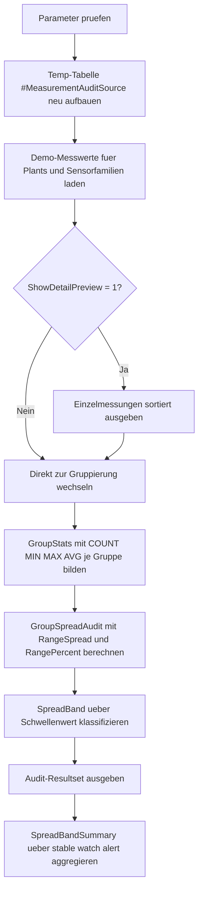

# GroupRangeSpreadAudit.sql

Dieses didaktische Skript zeigt, wie `MIN()`, `MAX()` und `AVG()` pro Gruppe zu einem kompakten Spreizungs-Audit kombiniert werden koennen. Die Demo wertet gruppierte Messwerte nach `PlantCode` und `SensorFamily` aus und markiert Gruppen mit auffaelliger Spannweite.

## Uebersicht

<!-- SQLDOC:SUMMARY_TABLE:BEGIN -->
| Feld | Wert |
|---|---|
| Script | [GroupRangeSpreadAudit.sql](GroupRangeSpreadAudit.sql) |
| Version | `1.0` |
| Typ | `didactic-lab` |
| Kapitel | `10_GroupBy_Aggregate` |
| Sicherheit | `read-only-tempdb` |
| Zweck | Ermittelt Min/Max-Spannen je Gruppe und kennzeichnet auffaellige Spreizung fuer Datenqualitaetschecks. |
<!-- SQLDOC:SUMMARY_TABLE:END -->

## Einordnung

Das Artefakt fokussiert einen typischen `GROUP BY`-Prueffall:

- Pro Gruppe werden Minimum, Maximum und Durchschnitt verdichtet.
- Aus Minimum und Maximum wird eine absolute Spreizung (`RangeSpread`) berechnet.
- Zusaetzlich wird die Spreizung relativ zum Gruppenmittelwert als `RangePercent` ausgedrueckt.
- Die Gruppen werden anschliessend in `stable`, `watch` und `alert` eingeteilt.

Damit eignet sich das Skript fuer Unterricht, Datenprofiling und erste Qualitaetschecks bei gruppierten Mess- oder Prozesswerten.

## Annahmen

- Die Erstversion verwendet Demo-Messreihen in einer lokalen Temp-Tabelle statt produktiver Qualitaetsdaten.
- Die Gruppierung ueber `PlantCode` und `SensorFamily` dient als didaktisches Muster fuer stabile und auffaellige Gruppen.
- `RangeSpread` ist die absolute Differenz zwischen `MAX(QualityValue)` und `MIN(QualityValue)`.
- `RangePercent` setzt die absolute Spreizung ins Verhaeltnis zum Gruppenmittelwert.
- Die Klassifikation `stable`, `watch` und `alert` ist ueber einen frei waehlbaren Schwellenwert didaktisch definiert.

## Anwendungsfall

Das Muster passt zu Szenarien, in denen Mess- oder Prozesswerte je Gruppierung auf Streuung und moegliche Ausreisser geprueft werden sollen, etwa bei Sensorfamilien, Produktchargen oder Serviceklassen. In produktiven Umgebungen kann die Demoquelle spaeter durch echte Prozessdaten ersetzt werden, ohne das Kernmuster des Audits zu aendern.

## Parameter

<!-- SQLDOC:PARAMETERS_TABLE:BEGIN -->
| Parameter | SQL-Typ | Pflicht | Beschreibung |
|---|---|---|---|
| `@SpreadAlertThreshold` | `DECIMAL(10,2)` | Ja | Schwellenwert fuer die absolute Spreizung, ab dem eine Gruppe als `alert` markiert wird. |
| `@ShowDetailPreview` | `BIT` | Nein | Gibt bei `1` die einzelnen Demo-Messungen vor der Verdichtung aus. |
<!-- SQLDOC:PARAMETERS_TABLE:END -->

## Abhaengigkeiten

<!-- SQLDOC:DEPENDENCIES_LIST:BEGIN -->
- `tempdb`
- `GROUP BY`
- `MIN()`
- `MAX()`
- `AVG()`
- `COUNT()`
- `CASE`
- `NULLIF()`
- `CAST()`
- `DROP TABLE IF EXISTS`
<!-- SQLDOC:DEPENDENCIES_LIST:END -->

## Hinweise

- `GroupRangeSpreadAudit` liefert pro Gruppe Anzahl, Minimum, Maximum, Durchschnitt, absolute Spreizung und relative Spreizung.
- `SpreadBandSummary` verdichtet die Gruppen zu einer schnellen Klassenuebersicht.
- Der optionale Detail-Preview macht nachvollziehbar, auf welchen Einzelwerten die Gruppenauswertung basiert.

## Versionshistorie

<!-- SQLDOC:VERSION_HISTORY_TABLE:BEGIN -->
| Version | Datum | User | Beschreibung |
|---|---|---|---|
| `1.0` | `2026-04-18` | `ER` | Erstversion eines didaktischen Group-Range-Spread-Audits fuer gruppierte Messwerte |
<!-- SQLDOC:VERSION_HISTORY_TABLE:END -->

## Ablauf

<!-- SQLDOC:MERMAID:BEGIN -->

<!-- SQLDOC:MERMAID:END -->

## SQL-Code

<!-- SQLDOC:SQL_CODE:BEGIN -->
```sql
/*
BEGIN:SQL-HEADER v1
---
sql_header: v1
script_name: "GroupRangeSpreadAudit.sql"
script_version: "1.0"
script_type: "didactic-lab"
chapter: "10_GroupBy_Aggregate"

purpose: >
  Ermittelt Min/Max-Spannen je Gruppe, berechnet absolute und relative
  Spreizungskennzahlen und markiert auffaellige Gruppen fuer einfache
  Datenqualitaetschecks in einer didaktischen Demo-Datenbasis.

parameters:
  - name: "@SpreadAlertThreshold"
    sql_type: "DECIMAL(10,2)"
    direction: "IN"
    required: true
    description: "Schwellenwert fuer die absolute Spreizung, ab dem eine Gruppe als alert markiert wird"
  - name: "@ShowDetailPreview"
    sql_type: "BIT"
    direction: "IN"
    required: false
    description: "1 = zeigt die einzelnen Demo-Messungen vor der Verdichtung"

result_sets:
  - name: "MeasurementDetailPreview"
    description: "Optionale Vorschau der Demo-Messungen mit Rohwerten"
  - name: "GroupRangeSpreadAudit"
    description: "Gruppenweises Audit mit Minimum, Maximum, Range, Durchschnitt und RangePercent"
  - name: "SpreadBandSummary"
    description: "Verdichtet die Gruppen nach SpreadBand fuer eine schnelle Gesamtbewertung"

dependencies:
  - "tempdb"
  - "GROUP BY"
  - "MIN()"
  - "MAX()"
  - "AVG()"
  - "COUNT()"
  - "CASE"
  - "NULLIF()"
  - "CAST()"
  - "DROP TABLE IF EXISTS"

safety:
  level: "read-only-tempdb"
  writes_data: false

documentation:
  markdown_file: "T-SQL/10_GroupBy_Aggregate/SQLScripts/GroupRangeSpreadAudit.md"
  sync_blocks:
    - "SUMMARY_TABLE"
    - "PARAMETERS_TABLE"
    - "DEPENDENCIES_LIST"
    - "VERSION_HISTORY_TABLE"
    - "SQL_CODE"
  mermaid:
    mode: "ai-agent-from-sql"
    source: "script-body"

main_responsible:
  name: "Erhard Rainer"
  initials: "ER"

version_history:
  - version: "1.0"
    date: "2026-04-18"
    user: "ER"
    description: "Erstversion eines didaktischen Group-Range-Spread-Audits fuer gruppierte Messwerte"

notes:
  - "Die Erstversion verwendet Demo-Messreihen in einer lokalen Temp-Tabelle statt produktiver Qualitaetsdaten"
  - "Die Gruppierung ueber PlantCode und SensorFamily erlaubt stabile und auffaellige Spreizungen nebeneinander zu vergleichen"
---
END:SQL-HEADER v1
*/

SET NOCOUNT ON;

DECLARE @SpreadAlertThreshold DECIMAL(10,2) = 8.00;
DECLARE @ShowDetailPreview BIT = 1;

IF @SpreadAlertThreshold IS NULL OR @SpreadAlertThreshold <= 0
BEGIN
    THROW 50000, '@SpreadAlertThreshold muss groesser als 0 sein.', 1;
END;

IF @ShowDetailPreview NOT IN (0, 1)
BEGIN
    THROW 50001, '@ShowDetailPreview muss 0 oder 1 sein.', 1;
END;

DROP TABLE IF EXISTS #MeasurementAuditSource;

CREATE TABLE #MeasurementAuditSource
(
    MeasurementID   INT             NOT NULL,
    PlantCode       VARCHAR(20)     NOT NULL,
    SensorFamily    VARCHAR(20)     NOT NULL,
    ShiftCode       VARCHAR(10)     NOT NULL,
    CapturedAt      DATETIME2(0)    NOT NULL,
    QualityValue    DECIMAL(10,2)   NOT NULL
);

INSERT INTO #MeasurementAuditSource
(
    MeasurementID,
    PlantCode,
    SensorFamily,
    ShiftCode,
    CapturedAt,
    QualityValue
)
VALUES
    (7001, 'Plant-A', 'Pressure',    'D1', '2026-04-01 06:15:00', 101.20),
    (7002, 'Plant-A', 'Pressure',    'D1', '2026-04-01 07:10:00', 103.40),
    (7003, 'Plant-A', 'Pressure',    'N1', '2026-04-01 20:45:00', 112.80),
    (7004, 'Plant-A', 'Temperature', 'D1', '2026-04-01 08:05:00',  36.10),
    (7005, 'Plant-A', 'Temperature', 'N1', '2026-04-01 21:05:00',  36.80),
    (7006, 'Plant-A', 'Temperature', 'N1', '2026-04-01 22:35:00',  37.20),
    (7007, 'Plant-B', 'Pressure',    'D1', '2026-04-02 06:30:00',  95.00),
    (7008, 'Plant-B', 'Pressure',    'D1', '2026-04-02 09:40:00',  95.60),
    (7009, 'Plant-B', 'Pressure',    'N1', '2026-04-02 19:55:00',  96.10),
    (7010, 'Plant-B', 'Temperature', 'D1', '2026-04-02 07:00:00',  28.50),
    (7011, 'Plant-B', 'Temperature', 'N1', '2026-04-02 20:20:00',  35.90),
    (7012, 'Plant-B', 'Temperature', 'N1', '2026-04-02 21:45:00',  39.10),
    (7013, 'Plant-C', 'Pressure',    'D1', '2026-04-03 06:20:00', 120.50),
    (7014, 'Plant-C', 'Pressure',    'N1', '2026-04-03 18:50:00', 121.10),
    (7015, 'Plant-C', 'Pressure',    'N1', '2026-04-03 22:10:00', 121.40),
    (7016, 'Plant-C', 'Temperature', 'D1', '2026-04-03 08:00:00',  31.20),
    (7017, 'Plant-C', 'Temperature', 'D1', '2026-04-03 09:15:00',  31.40),
    (7018, 'Plant-C', 'Temperature', 'N1', '2026-04-03 20:05:00',  31.70);

IF @ShowDetailPreview = 1
BEGIN
    SELECT
        mas.MeasurementID,
        mas.PlantCode,
        mas.SensorFamily,
        mas.ShiftCode,
        mas.CapturedAt,
        mas.QualityValue
    FROM #MeasurementAuditSource AS mas
    ORDER BY
        mas.PlantCode,
        mas.SensorFamily,
        mas.CapturedAt,
        mas.MeasurementID;
END;

;WITH GroupStats AS
(
    SELECT
        mas.PlantCode,
        mas.SensorFamily,
        COUNT(*) AS MeasurementCount,
        MIN(mas.QualityValue) AS MinQualityValue,
        MAX(mas.QualityValue) AS MaxQualityValue,
        AVG(mas.QualityValue) AS AvgQualityValue
    FROM #MeasurementAuditSource AS mas
    GROUP BY
        mas.PlantCode,
        mas.SensorFamily
),
GroupSpreadAudit AS
(
    SELECT
        gs.PlantCode,
        gs.SensorFamily,
        gs.MeasurementCount,
        CAST(gs.MinQualityValue AS DECIMAL(10,2)) AS MinQualityValue,
        CAST(gs.MaxQualityValue AS DECIMAL(10,2)) AS MaxQualityValue,
        CAST(gs.MaxQualityValue - gs.MinQualityValue AS DECIMAL(10,2)) AS RangeSpread,
        CAST(gs.AvgQualityValue AS DECIMAL(10,2)) AS AvgQualityValue,
        CAST
        (
            ((gs.MaxQualityValue - gs.MinQualityValue) / NULLIF(gs.AvgQualityValue, 0)) * 100.0
            AS DECIMAL(10,2)
        ) AS RangePercent
    FROM GroupStats AS gs
)
SELECT
    gsa.PlantCode,
    gsa.SensorFamily,
    gsa.MeasurementCount,
    gsa.MinQualityValue,
    gsa.MaxQualityValue,
    gsa.RangeSpread,
    gsa.AvgQualityValue,
    gsa.RangePercent,
    CASE
        WHEN gsa.RangeSpread >= @SpreadAlertThreshold THEN 'alert'
        WHEN gsa.RangeSpread >= @SpreadAlertThreshold * 0.50 THEN 'watch'
        ELSE 'stable'
    END AS SpreadBand
FROM GroupSpreadAudit AS gsa
ORDER BY
    gsa.RangeSpread DESC,
    gsa.PlantCode,
    gsa.SensorFamily;

;WITH GroupStats AS
(
    SELECT
        mas.PlantCode,
        mas.SensorFamily,
        MIN(mas.QualityValue) AS MinQualityValue,
        MAX(mas.QualityValue) AS MaxQualityValue
    FROM #MeasurementAuditSource AS mas
    GROUP BY
        mas.PlantCode,
        mas.SensorFamily
),
SpreadBands AS
(
    SELECT
        CASE
            WHEN CAST(gs.MaxQualityValue - gs.MinQualityValue AS DECIMAL(10,2)) >= @SpreadAlertThreshold THEN 'alert'
            WHEN CAST(gs.MaxQualityValue - gs.MinQualityValue AS DECIMAL(10,2)) >= @SpreadAlertThreshold * 0.50 THEN 'watch'
            ELSE 'stable'
        END AS SpreadBand
    FROM GroupStats AS gs
)
SELECT
    sb.SpreadBand,
    COUNT(*) AS GroupCount
FROM SpreadBands AS sb
GROUP BY
    sb.SpreadBand
ORDER BY
    GroupCount DESC,
    sb.SpreadBand;
```
<!-- SQLDOC:SQL_CODE:END -->
