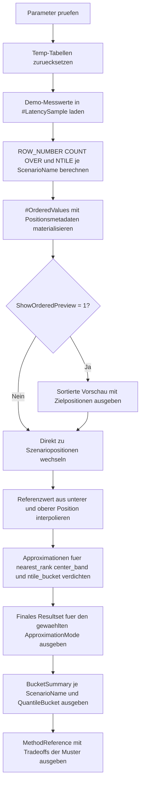

# MedianApproximationTemplate.sql

Dieses Artefakt stellt ein didaktisches Template fuer median- und quantilnahe Berechnungen in T-SQL bereit. Das Skript baut eine sortierte Messreihe je Szenario auf, leitet einen kontinuierlichen Referenzwert ab und vergleicht diesen mit drei bewusst einfachen Approximationsmustern.

## Uebersicht

<!-- SQLDOC:SUMMARY_TABLE:BEGIN -->
| Feld | Wert |
|---|---|
| Script | [MedianApproximationTemplate.sql](MedianApproximationTemplate.sql) |
| Version | `1.0` |
| Typ | `template` |
| Kapitel | `10_GroupBy_Aggregate` |
| Sicherheit | `read-only-tempdb` |
| Zweck | Template fuer Median- und Quantilnaeherungen mit sortierten Positionen, Referenzwert und mehreren Approximationsmustern. |
<!-- SQLDOC:SUMMARY_TABLE:END -->

## Einordnung

T-SQL-Trainings stoßen bei Median, P90 oder anderen Quantilen schnell auf die Frage, ob ein exakter kontinuierlicher Wert benoetigt wird oder ob eine robuste Naeherung ausreicht. Dieses Template trennt die Schritte deshalb sichtbar:

- Messwerte je Szenario bereitstellen
- sortierte Positionen und Bucket-Informationen berechnen
- einen Referenzwert als Vergleichspunkt ableiten
- ein gewaehltes Approximationsmuster gegen diesen Referenzwert ausgeben

So bleibt nachvollziehbar, welche Teile einer Quantilberechnung positionsbasiert, bucketbasiert oder rein didaktisch motiviert sind.

## Annahmen

- Die Erstversion nutzt `#LatencySample` als lokale Demo-Messreihe statt produktiver Event- oder Fact-Tabellen.
- Der Referenzwert bildet ein kontinuierliches Interpolationsmuster ab und dient hier nur als Vergleichspunkt fuer die Approximationen.
- `nearest_rank`, `center_band` und `ntile_bucket` sind bewusst einfache Lehrmuster und keine universellen Ersatzregeln fuer jede Produktionsabfrage.
- `@BucketCount` steuert nur das Banding fuer `ntile_bucket`; ein hoeherer Wert macht die Buckets feiner, aber nicht automatisch fachlich besser.

## Anwendungsfall

Das Skript eignet sich fuer Reviews, Labs und erste Reporting-Prototypen, wenn Median oder obere Quantile nachvollziehbar vorbereitet werden sollen. Typische Folgearbeiten sind das Ersetzen der Demo-Daten durch reale Messreihen, das Auslagern der Positionslogik in CTEs oder Views und das Zuspitzen auf genau ein gewaehltes Quantilmuster.

## Parameter

<!-- SQLDOC:PARAMETERS_TABLE:BEGIN -->
| Parameter | SQL-Typ | Pflicht | Beschreibung |
|---|---|---|---|
| `@PercentileTarget` | `DECIMAL(5,4)` | Ja | Zielquantil zwischen `0.0100` und `0.9900`, etwa `0.5000` fuer Median. |
| `@ApproximationMode` | `VARCHAR(30)` | Ja | Waehlt `nearest_rank`, `center_band` oder `ntile_bucket`. |
| `@BucketCount` | `INT` | Nein | Anzahl der Buckets fuer das NTILE-Muster zwischen `4` und `100`. |
| `@ShowOrderedPreview` | `BIT` | Nein | Gibt bei `1` die sortierten Werte samt Positionsmetadaten vor der finalen Approximation aus. |
<!-- SQLDOC:PARAMETERS_TABLE:END -->

## Abhaengigkeiten

<!-- SQLDOC:DEPENDENCIES_LIST:BEGIN -->
- `tempdb`
- `ROW_NUMBER()`
- `COUNT() OVER`
- `NTILE()`
- `FLOOR()`
- `CEILING()`
- `AVG()`
- `CASE`
- `CROSS APPLY`
- `DROP TABLE IF EXISTS`
<!-- SQLDOC:DEPENDENCIES_LIST:END -->

## Hinweise

- `#OrderedValues` materialisiert Position, Samplegroesse und Bucket je Szenario, damit Preview, Referenz und Approximation auf derselben Basis laufen.
- `ReferenceValues` bildet einen kontinuierlichen Vergleichswert aus unterer und oberer Referenzposition.
- `ApproximationResult` konzentriert sich bewusst auf genau einen gewaehlten `@ApproximationMode`, zeigt aber gleichzeitig Delta und Zielbucket an.
- `BucketSummary` hilft, den Effekt von `NTILE()` auf grobe Quantilklassen sichtbar zu machen.

## Versionshistorie

<!-- SQLDOC:VERSION_HISTORY_TABLE:BEGIN -->
| Version | Datum | User | Beschreibung |
|---|---|---|---|
| `1.0` | `2026-04-18` | `ER` | Erstversion eines Templates fuer Median- und Quantilnahe Berechnungen mit T-SQL |
<!-- SQLDOC:VERSION_HISTORY_TABLE:END -->

## Ablauf

<!-- SQLDOC:MERMAID:BEGIN -->

<!-- SQLDOC:MERMAID:END -->

## SQL-Code

<!-- SQLDOC:SQL_CODE:BEGIN -->
~~~sql
/*
BEGIN:SQL-HEADER v1
---
sql_header: v1
script_name: "MedianApproximationTemplate.sql"
script_version: "1.0"
script_type: "template"
chapter: "10_GroupBy_Aggregate"

purpose: >
  Zeigt ein didaktisches Template fuer median- und quantilnahe
  Berechnungen in T-SQL, indem sortierte Werte je Gruppe vorbereitet, ein
  kontinuierlicher Referenzwert abgeleitet und mehrere praxisnahe
  Approximationsmuster dagegen gestellt werden.

parameters:
  - name: "@PercentileTarget"
    sql_type: "DECIMAL(5,4)"
    direction: "IN"
    required: true
    description: "Zielquantil zwischen 0.0100 und 0.9900, zum Beispiel 0.5000 fuer Median oder 0.9000 fuer ein hohes Quantil"
  - name: "@ApproximationMode"
    sql_type: "VARCHAR(30)"
    direction: "IN"
    required: true
    description: "Steuert das Muster nearest_rank, center_band oder ntile_bucket"
  - name: "@BucketCount"
    sql_type: "INT"
    direction: "IN"
    required: false
    description: "Anzahl der Buckets fuer ntile_bucket zwischen 4 und 100"
  - name: "@ShowOrderedPreview"
    sql_type: "BIT"
    direction: "IN"
    required: false
    description: "1 = zeigt die sortierten Werte samt Positionsmetadaten vor der finalen Approximation"

result_sets:
  - name: "OrderedPreview"
    description: "Optionale Vorschau der sortierten Werte mit Positions-, Bucket- und Referenzmetadaten"
  - name: "ApproximationResult"
    description: "Vergleich zwischen Referenzquantil und gewaehltem Approximationsmuster je ScenarioName"
  - name: "BucketSummary"
    description: "Uebersicht der NTILE-Buckets je ScenarioName als Hilfsbild fuer band- oder bucket-basierte Quantile"
  - name: "MethodReference"
    description: "Didaktische Referenz fuer die drei unterstuetzten Approximationsmuster"

dependencies:
  - "tempdb"
  - "ROW_NUMBER()"
  - "COUNT() OVER"
  - "NTILE()"
  - "FLOOR()"
  - "CEILING()"
  - "AVG()"
  - "CASE"
  - "CROSS APPLY"
  - "DROP TABLE IF EXISTS"

safety:
  level: "read-only-tempdb"
  writes_data: false

documentation:
  markdown_file: "T-SQL/10_GroupBy_Aggregate/SQLScripts/MedianApproximationTemplate.md"
  sync_blocks:
    - "SUMMARY_TABLE"
    - "PARAMETERS_TABLE"
    - "DEPENDENCIES_LIST"
    - "VERSION_HISTORY_TABLE"
    - "SQL_CODE"
  mermaid:
    mode: "ai-agent-from-sql"
    source: "script-body"

main_responsible:
  name: "Erhard Rainer"
  initials: "ER"

version_history:
  - version: "1.0"
    date: "2026-04-18"
    user: "ER"
    description: "Erstversion eines Templates fuer Median- und Quantilnahe Berechnungen mit T-SQL"

notes:
  - "Die Erstversion verwendet Demo-Messwerte in einer Temp-Tabelle statt produktiver Messreihen"
  - "Ein kontinuierlicher Referenzwert wird nur als didaktischer Vergleichspunkt genutzt"
---
END:SQL-HEADER v1
*/

SET NOCOUNT ON;

DECLARE @PercentileTarget DECIMAL(5,4) = 0.5000;
DECLARE @ApproximationMode VARCHAR(30) = 'nearest_rank';
DECLARE @BucketCount INT = 10;
DECLARE @ShowOrderedPreview BIT = 1;

IF @PercentileTarget IS NULL OR @PercentileTarget < 0.0100 OR @PercentileTarget > 0.9900
BEGIN
    THROW 50020, '@PercentileTarget muss zwischen 0.0100 und 0.9900 liegen.', 1;
END;

IF @ApproximationMode NOT IN ('nearest_rank', 'center_band', 'ntile_bucket')
BEGIN
    THROW 50021, '@ApproximationMode muss nearest_rank, center_band oder ntile_bucket sein.', 1;
END;

IF @BucketCount IS NULL OR @BucketCount < 4 OR @BucketCount > 100
BEGIN
    THROW 50022, '@BucketCount muss zwischen 4 und 100 liegen.', 1;
END;

IF @ShowOrderedPreview NOT IN (0, 1)
BEGIN
    THROW 50023, '@ShowOrderedPreview muss 0 oder 1 sein.', 1;
END;

DROP TABLE IF EXISTS #LatencySample;
DROP TABLE IF EXISTS #OrderedValues;

CREATE TABLE #LatencySample
(
    ScenarioName        VARCHAR(30)   NOT NULL,
    TeamName            VARCHAR(30)   NOT NULL,
    ObservationDate     DATE          NOT NULL,
    CycleSeconds        INT           NOT NULL
);

INSERT INTO #LatencySample
(
    ScenarioName,
    TeamName,
    ObservationDate,
    CycleSeconds
)
VALUES
    ('TicketFlow', 'NorthOps',  '2026-03-01',  95),
    ('TicketFlow', 'NorthOps',  '2026-03-02', 108),
    ('TicketFlow', 'NorthOps',  '2026-03-03', 121),
    ('TicketFlow', 'NorthOps',  '2026-03-04', 132),
    ('TicketFlow', 'NorthOps',  '2026-03-05', 145),
    ('TicketFlow', 'SouthOps',  '2026-03-01', 102),
    ('TicketFlow', 'SouthOps',  '2026-03-02', 119),
    ('TicketFlow', 'SouthOps',  '2026-03-03', 137),
    ('TicketFlow', 'SouthOps',  '2026-03-04', 149),
    ('TicketFlow', 'SouthOps',  '2026-03-05', 166),
    ('Checkout',   'StoreA',    '2026-03-01', 210),
    ('Checkout',   'StoreA',    '2026-03-02', 228),
    ('Checkout',   'StoreA',    '2026-03-03', 244),
    ('Checkout',   'StoreA',    '2026-03-04', 251),
    ('Checkout',   'StoreA',    '2026-03-05', 267),
    ('Checkout',   'StoreB',    '2026-03-01', 198),
    ('Checkout',   'StoreB',    '2026-03-02', 214),
    ('Checkout',   'StoreB',    '2026-03-03', 236),
    ('Checkout',   'StoreB',    '2026-03-04', 272),
    ('Checkout',   'StoreB',    '2026-03-05', 315),
    ('Fulfillment','HubEast',   '2026-03-01', 320),
    ('Fulfillment','HubEast',   '2026-03-02', 344),
    ('Fulfillment','HubEast',   '2026-03-03', 361),
    ('Fulfillment','HubEast',   '2026-03-04', 395),
    ('Fulfillment','HubEast',   '2026-03-05', 420),
    ('Fulfillment','HubWest',   '2026-03-01', 305),
    ('Fulfillment','HubWest',   '2026-03-02', 332),
    ('Fulfillment','HubWest',   '2026-03-03', 358),
    ('Fulfillment','HubWest',   '2026-03-04', 386),
    ('Fulfillment','HubWest',   '2026-03-05', 470);

WITH OrderedValues AS
(
    SELECT
        ls.ScenarioName,
        ls.TeamName,
        ls.ObservationDate,
        ls.CycleSeconds,
        ROW_NUMBER() OVER
        (
            PARTITION BY ls.ScenarioName
            ORDER BY
                ls.CycleSeconds,
                ls.TeamName,
                ls.ObservationDate
        ) AS RowAsc,
        COUNT(*) OVER (PARTITION BY ls.ScenarioName) AS SampleCount,
        NTILE(@BucketCount) OVER
        (
            PARTITION BY ls.ScenarioName
            ORDER BY
                ls.CycleSeconds,
                ls.TeamName,
                ls.ObservationDate
        ) AS QuantileBucket
    FROM #LatencySample AS ls
),
PositionBase AS
(
    SELECT
        ov.ScenarioName,
        ov.TeamName,
        ov.ObservationDate,
        ov.CycleSeconds,
        ov.RowAsc,
        ov.SampleCount,
        ov.QuantileBucket,
        CAST(1.0 + ((ov.SampleCount - 1) * @PercentileTarget) AS DECIMAL(18,6)) AS ContinuousPosition,
        CAST(CEILING(ov.SampleCount * @PercentileTarget) AS INT) AS NearestRankPosition,
        CAST(FLOOR(1.0 + ((ov.SampleCount - 1) * @PercentileTarget)) AS INT) AS LowerReferencePosition,
        CAST(CEILING(1.0 + ((ov.SampleCount - 1) * @PercentileTarget)) AS INT) AS UpperReferencePosition,
        CAST(FLOOR((ov.SampleCount + 1) * @PercentileTarget) AS INT) AS CenterBandLowerPosition,
        CAST(CEILING((ov.SampleCount + 1) * @PercentileTarget) AS INT) AS CenterBandUpperPosition
    FROM OrderedValues AS ov
)
SELECT
    pb.ScenarioName,
    pb.TeamName,
    pb.ObservationDate,
    pb.CycleSeconds,
    pb.RowAsc,
    pb.SampleCount,
    pb.QuantileBucket,
    pb.ContinuousPosition,
    pb.NearestRankPosition,
    CASE
        WHEN pb.LowerReferencePosition < 1 THEN 1
        ELSE pb.LowerReferencePosition
    END AS LowerReferencePosition,
    CASE
        WHEN pb.UpperReferencePosition > pb.SampleCount THEN pb.SampleCount
        ELSE pb.UpperReferencePosition
    END AS UpperReferencePosition,
    CASE
        WHEN pb.CenterBandLowerPosition < 1 THEN 1
        ELSE pb.CenterBandLowerPosition
    END AS CenterBandLowerPosition,
    CASE
        WHEN pb.CenterBandUpperPosition > pb.SampleCount THEN pb.SampleCount
        ELSE pb.CenterBandUpperPosition
    END AS CenterBandUpperPosition
INTO #OrderedValues
FROM PositionBase AS pb;

IF @ShowOrderedPreview = 1
BEGIN
    SELECT
        ov.ScenarioName,
        ov.TeamName,
        ov.ObservationDate,
        ov.CycleSeconds,
        ov.RowAsc,
        ov.SampleCount,
        ov.ContinuousPosition,
        ov.NearestRankPosition,
        ov.LowerReferencePosition,
        ov.UpperReferencePosition,
        ov.CenterBandLowerPosition,
        ov.CenterBandUpperPosition,
        ov.QuantileBucket
    FROM #OrderedValues AS ov
    ORDER BY
        ov.ScenarioName,
        ov.RowAsc;
END;

WITH ScenarioPositions AS
(
    SELECT DISTINCT
        ov.ScenarioName,
        ov.SampleCount,
        ov.ContinuousPosition,
        ov.NearestRankPosition,
        ov.LowerReferencePosition,
        ov.UpperReferencePosition,
        ov.CenterBandLowerPosition,
        ov.CenterBandUpperPosition,
        CASE
            WHEN CAST(ROUND(@PercentileTarget * @BucketCount, 0) AS INT) < 1 THEN 1
            WHEN CAST(ROUND(@PercentileTarget * @BucketCount, 0) AS INT) > @BucketCount THEN @BucketCount
            ELSE CAST(ROUND(@PercentileTarget * @BucketCount, 0) AS INT)
        END AS TargetBucket
    FROM #OrderedValues AS ov
),
ReferenceValues AS
(
    SELECT
        sp.ScenarioName,
        sp.SampleCount,
        sp.ContinuousPosition,
        CAST
        (
            CASE
                WHEN sp.LowerReferencePosition = sp.UpperReferencePosition
                    THEN MAX(CASE WHEN ov.RowAsc = sp.LowerReferencePosition THEN ov.CycleSeconds * 1.0 END)
                ELSE
                    MAX(CASE WHEN ov.RowAsc = sp.LowerReferencePosition THEN ov.CycleSeconds * 1.0 END)
                    + (sp.ContinuousPosition - sp.LowerReferencePosition)
                    * (
                        MAX(CASE WHEN ov.RowAsc = sp.UpperReferencePosition THEN ov.CycleSeconds * 1.0 END)
                        - MAX(CASE WHEN ov.RowAsc = sp.LowerReferencePosition THEN ov.CycleSeconds * 1.0 END)
                    )
            END
            AS DECIMAL(18,4)
        ) AS ReferencePercentileValue
    FROM ScenarioPositions AS sp
    INNER JOIN #OrderedValues AS ov
        ON ov.ScenarioName = sp.ScenarioName
    GROUP BY
        sp.ScenarioName,
        sp.SampleCount,
        sp.ContinuousPosition,
        sp.LowerReferencePosition,
        sp.UpperReferencePosition
),
ApproximationBase AS
(
    SELECT
        sp.ScenarioName,
        sp.SampleCount,
        sp.TargetBucket,
        CAST(AVG(CASE WHEN ov.RowAsc = sp.NearestRankPosition THEN ov.CycleSeconds * 1.0 END) AS DECIMAL(18,4)) AS NearestRankValue,
        CAST(AVG(CASE WHEN ov.RowAsc BETWEEN sp.CenterBandLowerPosition AND sp.CenterBandUpperPosition THEN ov.CycleSeconds * 1.0 END) AS DECIMAL(18,4)) AS CenterBandValue,
        CAST(AVG(CASE WHEN ov.QuantileBucket = sp.TargetBucket THEN ov.CycleSeconds * 1.0 END) AS DECIMAL(18,4)) AS NtileBucketValue,
        COUNT(CASE WHEN ov.RowAsc = sp.NearestRankPosition THEN 1 END) AS NearestRankRows,
        COUNT(CASE WHEN ov.RowAsc BETWEEN sp.CenterBandLowerPosition AND sp.CenterBandUpperPosition THEN 1 END) AS CenterBandRows,
        COUNT(CASE WHEN ov.QuantileBucket = sp.TargetBucket THEN 1 END) AS BucketRows,
        MIN(CASE WHEN ov.QuantileBucket = sp.TargetBucket THEN ov.CycleSeconds END) AS BucketLowerValue,
        MAX(CASE WHEN ov.QuantileBucket = sp.TargetBucket THEN ov.CycleSeconds END) AS BucketUpperValue
    FROM ScenarioPositions AS sp
    INNER JOIN #OrderedValues AS ov
        ON ov.ScenarioName = sp.ScenarioName
    GROUP BY
        sp.ScenarioName,
        sp.SampleCount,
        sp.TargetBucket
)
SELECT
    ab.ScenarioName,
    ab.SampleCount,
    @PercentileTarget AS PercentileTarget,
    @ApproximationMode AS ApproximationMode,
    rv.ReferencePercentileValue,
    CASE
        WHEN @ApproximationMode = 'nearest_rank' THEN ab.NearestRankValue
        WHEN @ApproximationMode = 'center_band' THEN ab.CenterBandValue
        WHEN @ApproximationMode = 'ntile_bucket' THEN ab.NtileBucketValue
    END AS ApproximationValue,
    CAST
    (
        CASE
            WHEN @ApproximationMode = 'nearest_rank' THEN ab.NearestRankValue - rv.ReferencePercentileValue
            WHEN @ApproximationMode = 'center_band' THEN ab.CenterBandValue - rv.ReferencePercentileValue
            WHEN @ApproximationMode = 'ntile_bucket' THEN ab.NtileBucketValue - rv.ReferencePercentileValue
        END
        AS DECIMAL(18,4)
    ) AS DeltaToReference,
    CASE
        WHEN @ApproximationMode = 'nearest_rank' THEN ab.NearestRankRows
        WHEN @ApproximationMode = 'center_band' THEN ab.CenterBandRows
        WHEN @ApproximationMode = 'ntile_bucket' THEN ab.BucketRows
    END AS ChosenRowCount,
    ab.TargetBucket,
    ab.BucketLowerValue,
    ab.BucketUpperValue,
    CASE
        WHEN @ApproximationMode = 'nearest_rank' THEN 'Waehlt genau die Zeile auf der diskreten Zielposition.'
        WHEN @ApproximationMode = 'center_band' THEN 'Mittelt die zentrale Positionsspanne rund um das Zielquantil.'
        WHEN @ApproximationMode = 'ntile_bucket' THEN 'Mittelt alle Werte im naechsten NTILE-Bucket des Zielquantils.'
    END AS DidacticReading
FROM ApproximationBase AS ab
INNER JOIN ReferenceValues AS rv
    ON rv.ScenarioName = ab.ScenarioName
ORDER BY
    ab.ScenarioName;

WITH BucketSummary AS
(
    SELECT
        ov.ScenarioName,
        ov.QuantileBucket,
        COUNT(*) AS BucketRowCount,
        MIN(ov.CycleSeconds) AS BucketMinValue,
        MAX(ov.CycleSeconds) AS BucketMaxValue,
        CAST(AVG(ov.CycleSeconds * 1.0) AS DECIMAL(18,4)) AS BucketAverageValue
    FROM #OrderedValues AS ov
    GROUP BY
        ov.ScenarioName,
        ov.QuantileBucket
)
SELECT
    bs.ScenarioName,
    bs.QuantileBucket,
    bs.BucketRowCount,
    bs.BucketMinValue,
    bs.BucketMaxValue,
    bs.BucketAverageValue,
    CASE
        WHEN bs.QuantileBucket = CASE
            WHEN CAST(ROUND(@PercentileTarget * @BucketCount, 0) AS INT) < 1 THEN 1
            WHEN CAST(ROUND(@PercentileTarget * @BucketCount, 0) AS INT) > @BucketCount THEN @BucketCount
            ELSE CAST(ROUND(@PercentileTarget * @BucketCount, 0) AS INT)
        END THEN 1
        ELSE 0
    END AS IsTargetBucket
FROM BucketSummary AS bs
ORDER BY
    bs.ScenarioName,
    bs.QuantileBucket;

SELECT
    MethodName,
    CoreIdea,
    TypicalTradeoff,
    GoodFit
FROM
(
    VALUES
        (
            'nearest_rank',
            'Verwendet die diskrete Zeile auf CEILING(n * p).',
            'Einfach und stabil, kann aber bei kleinen Samples sprunghaft reagieren.',
            'Schnelle Reports oder Regeln, die diskrete Schwellenwerte bevorzugen.'
        ),
        (
            'center_band',
            'Mittelt die mittlere Positionsspanne rund um das Zielquantil.',
            'Glaettet einzelne Ausreisser, ist aber kein exakter kontinuierlicher Percentile-Operator.',
            'Didaktische Median-Naeherung oder robuste Schaetzungen bei kleinen Datenmengen.'
        ),
        (
            'ntile_bucket',
            'Ordnet Werte zuerst Buckets zu und mittelt den Zielbucket.',
            'Gut fuer grobe Quantilklassen, aber weniger praezise als positionsbasierte Verfahren.',
            'Dashboards, Banding oder Vorstufen fuer SLA-Klassen.'
        )
) AS reference_data
(
    MethodName,
    CoreIdea,
    TypicalTradeoff,
    GoodFit
)
ORDER BY
    MethodName;
~~~
<!-- SQLDOC:SQL_CODE:END -->

