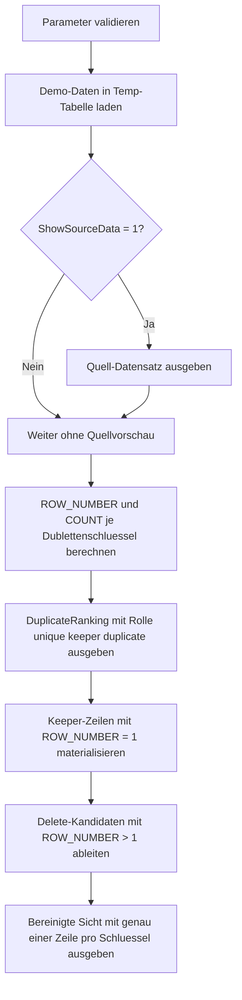

# DedupWithRowNumber.sql

Dieses Beispiel zeigt ein typisches Dedup-Muster fuer Staging- oder Event-Daten in T-SQL. `ROW_NUMBER()` nummeriert jede Dublettengruppe, sodass eine Keeper-Zeile erhalten und die restlichen Folgezeilen sicher als Dubletten markiert werden koennen.

## Uebersicht

<!-- SQLDOC:SUMMARY_TABLE:BEGIN -->
| Feld | Wert |
|---|---|
| Script | [DedupWithRowNumber.sql](DedupWithRowNumber.sql) |
| Version | `1.0` |
| Typ | `didactic-lab` |
| Kapitel | `11_WindowFunctions` |
| Sicherheit | `read-only-tempdb` |
| Zweck | Markiert Dubletten mit `ROW_NUMBER()` und leitet Keeper- sowie Delete-Kandidaten sicher ab. |
<!-- SQLDOC:SUMMARY_TABLE:END -->

## Einordnung

Das Skript modelliert eine didaktische Erstversion fuer einen haeufigen Bereinigungsfall in Datenpipelines. Statt produktive Tabellen zu veraendern, arbeitet die Umsetzung ausschliesslich mit Demo-Daten in Temp-Tabellen und zeigt die relevanten Zwischenschritte transparent als Resultsets.

Folgende Annahmen werden dabei bewusst festgehalten:

- Der fachliche Dublettenschluessel besteht aus `CustomerEmail`, `OrderMonth` und `ProductCode`.
- `LastUpdatedAt` und `StagingEventID` definieren gemeinsam eine deterministische Reihenfolge innerhalb jeder Dublettengruppe.
- `@KeepLatest = 1` behaelt die neueste Zeile pro Gruppe, `@KeepLatest = 0` die aelteste.
- Statt eines echten `DELETE` werden nur Delete-Kandidaten ausgegeben, damit das Muster sicher nachvollzogen werden kann.

## Parameter

<!-- SQLDOC:PARAMETERS_TABLE:BEGIN -->
| Parameter | SQL-Typ | Pflicht | Beschreibung |
|---|---|---|---|
| `@KeepLatest` | `BIT` | Ja | `1` behaelt die neueste Zeile pro Dublettengruppe, `0` die aelteste. |
| `@ShowSourceData` | `BIT` | Nein | Gibt bei `1` den urspruenglichen Demo-Datensatz vor dem Ranking aus. |
<!-- SQLDOC:PARAMETERS_TABLE:END -->

## Abhaengigkeiten

<!-- SQLDOC:DEPENDENCIES_LIST:BEGIN -->
- `tempdb` fuer temporaere Tabellen
- `ROW_NUMBER()`
- `COUNT(*) OVER(PARTITION BY ...)`
<!-- SQLDOC:DEPENDENCIES_LIST:END -->

## Hinweise

- Das Dedup-Ranking ist nur dann stabil, wenn das `ORDER BY` innerhalb der Fensterfunktion eindeutig und fachlich passend ist.
- `ROW_NUMBER() = 1` liefert den Keeper, alle Zeilen mit `ROW_NUMBER() > 1` sind Dubletten derselben Gruppe.
- Fuer produktive Workflows sollte vor einem echten `DELETE` zusaetzlich geprueft werden, ob der Dublettenschluessel und die Behaltelogik fachlich korrekt sind.

## Versionshistorie

<!-- SQLDOC:VERSION_HISTORY_TABLE:BEGIN -->
| Version | Datum | User | Beschreibung |
|---|---|---|---|
| `1.0` | `2026-04-18` | `ER` | Erstversion des didaktischen Dedup-Labs mit ROW_NUMBER fuer Kapitel Window Functions |
<!-- SQLDOC:VERSION_HISTORY_TABLE:END -->

## Ablauf

<!-- SQLDOC:MERMAID:BEGIN -->

<!-- SQLDOC:MERMAID:END -->

## SQL-Code

<!-- SQLDOC:SQL_CODE:BEGIN -->
```sql
/*
BEGIN:SQL-HEADER v1
---
sql_header: v1
script_name: "DedupWithRowNumber.sql"
script_version: "1.0"
script_type: "didactic-lab"
chapter: "11_WindowFunctions"

purpose: >
  Zeigt, wie Dubletten in einem Event- oder Staging-Datensatz mit
  ROW_NUMBER() markiert, bevorzugte Keeper je fachlichem Schluessel
  bestimmt und sichere Delete-Kandidaten abgeleitet werden koennen.

parameters:
  - name: "@KeepLatest"
    sql_type: "BIT"
    direction: "IN"
    required: true
    description: "1 = neueste Zeile je Dublettengruppe behalten, 0 = aelteste Zeile behalten"
  - name: "@ShowSourceData"
    sql_type: "BIT"
    direction: "IN"
    required: false
    description: "1 = urspruengliche Demo-Daten vor dem Dedup-Schritt zusaetzlich anzeigen"

result_sets:
  - name: "SourcePreview"
    description: "Optionale Vorschau auf den Demo-Datensatz mit potenziellen Dubletten"
  - name: "DuplicateRanking"
    description: "Alle Zeilen mit ROW_NUMBER und Dublettenzahl pro fachlichem Schluessel"
  - name: "KeeperRows"
    description: "Die je Gruppe zu behaltenden Zeilen"
  - name: "DeleteCandidates"
    description: "Die per ROW_NUMBER als Dubletten markierten Folgezeilen"
  - name: "DeduplicatedResult"
    description: "Bereinigte Sicht mit genau einer Zeile pro fachlichem Schluessel"

dependencies:
  - "tempdb temporary tables"
  - "ROW_NUMBER()"
  - "COUNT(*) OVER(PARTITION BY ...)"

safety:
  level: "read-only-tempdb"
  writes_data: false

documentation:
  markdown_file: "T-SQL/11_WindowFunctions/SQLScripts/DedupWithRowNumber.md"
  sync_blocks:
    - "SUMMARY_TABLE"
    - "PARAMETERS_TABLE"
    - "DEPENDENCIES_LIST"
    - "VERSION_HISTORY_TABLE"
    - "SQL_CODE"
  mermaid:
    mode: "ai-agent-from-sql"
    source: "script-body"

main_responsible:
  name: "Erhard Rainer"
  initials: "ER"

version_history:
  - version: "1.0"
    date: "2026-04-18"
    user: "ER"
    description: "Erstversion des didaktischen Dedup-Labs mit ROW_NUMBER fuer Kapitel Window Functions"

notes:
  - "Das Skript loescht keine persistenten Daten, sondern zeigt sichere Delete-Kandidaten nur als Resultset"
  - "Der fachliche Dublettenschluessel wird didaktisch ueber CustomerEmail, OrderMonth und ProductCode modelliert"
---
END:SQL-HEADER v1
*/

SET NOCOUNT ON;

DECLARE @KeepLatest    BIT = 1;
DECLARE @ShowSourceData BIT = 1;

IF @KeepLatest NOT IN (0, 1) OR @ShowSourceData NOT IN (0, 1)
BEGIN
    THROW 50000, 'Die Parameter muessen als BIT-Werte 0 oder 1 gesetzt sein.', 1;
END;

DROP TABLE IF EXISTS #DedupDemo;
DROP TABLE IF EXISTS #RankedDuplicates;
DROP TABLE IF EXISTS #KeeperRows;
DROP TABLE IF EXISTS #DeleteCandidates;

CREATE TABLE #DedupDemo
(
    StagingEventID INT            NOT NULL,
    CustomerEmail  VARCHAR(100)   NOT NULL,
    OrderMonth     DATE           NOT NULL,
    ProductCode    VARCHAR(20)    NOT NULL,
    ChannelName    VARCHAR(30)    NOT NULL,
    Quantity       INT            NOT NULL,
    RevenueAmount  DECIMAL(12,2)  NOT NULL,
    LastUpdatedAt  DATETIME2(0)   NOT NULL
);

INSERT INTO #DedupDemo
(
    StagingEventID,
    CustomerEmail,
    OrderMonth,
    ProductCode,
    ChannelName,
    Quantity,
    RevenueAmount,
    LastUpdatedAt
)
VALUES
    (101, 'anna@example.com',  '2026-01-01', 'SKU-100', 'Web',    1,  89.00, '2026-01-03T09:15:00'),
    (102, 'anna@example.com',  '2026-01-01', 'SKU-100', 'Web',    1,  89.00, '2026-01-03T09:18:00'),
    (103, 'anna@example.com',  '2026-01-01', 'SKU-100', 'Mobile', 1,  89.00, '2026-01-03T09:22:00'),
    (104, 'ben@example.com',   '2026-01-01', 'SKU-200', 'Store',  2, 140.00, '2026-01-05T15:40:00'),
    (105, 'ben@example.com',   '2026-01-01', 'SKU-200', 'Store',  2, 140.00, '2026-01-05T15:40:00'),
    (106, 'cara@example.com',  '2026-02-01', 'SKU-300', 'Web',    3, 210.00, '2026-02-11T11:00:00'),
    (107, 'cara@example.com',  '2026-02-01', 'SKU-300', 'Web',    3, 210.00, '2026-02-11T11:05:00'),
    (108, 'dino@example.com',  '2026-02-01', 'SKU-400', 'Partner',1,  59.00, '2026-02-14T08:10:00'),
    (109, 'emma@example.com',  '2026-03-01', 'SKU-500', 'Mobile', 4, 320.00, '2026-03-02T10:30:00'),
    (110, 'emma@example.com',  '2026-03-01', 'SKU-500', 'Mobile', 4, 320.00, '2026-03-02T10:31:00'),
    (111, 'emma@example.com',  '2026-03-01', 'SKU-500', 'Mobile', 4, 320.00, '2026-03-02T10:39:00'),
    (112, 'finn@example.com',  '2026-03-01', 'SKU-600', 'Web',    1,  44.00, '2026-03-08T12:05:00');

IF @ShowSourceData = 1
BEGIN
    SELECT
        d.StagingEventID,
        d.CustomerEmail,
        d.OrderMonth,
        d.ProductCode,
        d.ChannelName,
        d.Quantity,
        d.RevenueAmount,
        d.LastUpdatedAt
    FROM #DedupDemo AS d
    ORDER BY
        d.CustomerEmail,
        d.OrderMonth,
        d.ProductCode,
        d.LastUpdatedAt,
        d.StagingEventID;
END;

SELECT
    d.StagingEventID,
    d.CustomerEmail,
    d.OrderMonth,
    d.ProductCode,
    d.ChannelName,
    d.Quantity,
    d.RevenueAmount,
    d.LastUpdatedAt,
    ROW_NUMBER() OVER
    (
        PARTITION BY d.CustomerEmail, d.OrderMonth, d.ProductCode
        ORDER BY
            CASE WHEN @KeepLatest = 1 THEN d.LastUpdatedAt END DESC,
            CASE WHEN @KeepLatest = 0 THEN d.LastUpdatedAt END ASC,
            CASE WHEN @KeepLatest = 1 THEN d.StagingEventID END DESC,
            CASE WHEN @KeepLatest = 0 THEN d.StagingEventID END ASC
    ) AS DedupRowNumber,
    COUNT(*) OVER
    (
        PARTITION BY d.CustomerEmail, d.OrderMonth, d.ProductCode
    ) AS DuplicateCount
INTO #RankedDuplicates
FROM #DedupDemo AS d;

SELECT
    r.CustomerEmail,
    r.OrderMonth,
    r.ProductCode,
    r.StagingEventID,
    r.ChannelName,
    r.Quantity,
    r.RevenueAmount,
    r.LastUpdatedAt,
    r.DedupRowNumber,
    r.DuplicateCount,
    CASE
        WHEN r.DuplicateCount = 1 THEN 'unique'
        WHEN r.DedupRowNumber = 1 THEN 'keeper'
        ELSE 'duplicate'
    END AS DedupRole
FROM #RankedDuplicates AS r
ORDER BY
    r.CustomerEmail,
    r.OrderMonth,
    r.ProductCode,
    r.DedupRowNumber;

SELECT
    r.StagingEventID,
    r.CustomerEmail,
    r.OrderMonth,
    r.ProductCode,
    r.ChannelName,
    r.Quantity,
    r.RevenueAmount,
    r.LastUpdatedAt,
    r.DuplicateCount
INTO #KeeperRows
FROM #RankedDuplicates AS r
WHERE r.DedupRowNumber = 1;

SELECT
    k.StagingEventID,
    k.CustomerEmail,
    k.OrderMonth,
    k.ProductCode,
    k.ChannelName,
    k.Quantity,
    k.RevenueAmount,
    k.LastUpdatedAt,
    k.DuplicateCount
FROM #KeeperRows AS k
ORDER BY
    k.CustomerEmail,
    k.OrderMonth,
    k.ProductCode;

SELECT
    r.StagingEventID,
    r.CustomerEmail,
    r.OrderMonth,
    r.ProductCode,
    r.ChannelName,
    r.Quantity,
    r.RevenueAmount,
    r.LastUpdatedAt,
    r.DedupRowNumber,
    r.DuplicateCount
INTO #DeleteCandidates
FROM #RankedDuplicates AS r
WHERE r.DedupRowNumber > 1;

SELECT
    dc.StagingEventID,
    dc.CustomerEmail,
    dc.OrderMonth,
    dc.ProductCode,
    dc.ChannelName,
    dc.Quantity,
    dc.RevenueAmount,
    dc.LastUpdatedAt,
    dc.DedupRowNumber,
    dc.DuplicateCount
FROM #DeleteCandidates AS dc
ORDER BY
    dc.CustomerEmail,
    dc.OrderMonth,
    dc.ProductCode,
    dc.DedupRowNumber;

SELECT
    k.CustomerEmail,
    k.OrderMonth,
    k.ProductCode,
    k.ChannelName,
    k.Quantity,
    k.RevenueAmount,
    k.LastUpdatedAt,
    k.StagingEventID AS KeptStagingEventID
FROM #KeeperRows AS k
ORDER BY
    k.CustomerEmail,
    k.OrderMonth,
    k.ProductCode;
```
<!-- SQLDOC:SQL_CODE:END -->
