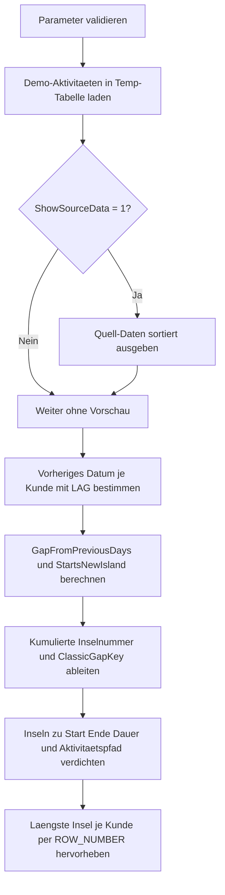

# GapsAndIslandsStarter.sql

Dieses Skript fuehrt in das klassische Gaps-and-Islands-Muster fuer Zeitreihen ein. Die Umsetzung bleibt bewusst didaktisch und arbeitet ausschliesslich mit Demo-Daten in Temp-Objekten, damit die Gruppierungslogik rund um `ROW_NUMBER()`, `LAG()` und kumulierte Startmarker transparent nachvollzogen werden kann.

## Uebersicht

<!-- SQLDOC:SUMMARY_TABLE:BEGIN -->
| Feld | Wert |
|---|---|
| Script | [GapsAndIslandsStarter.sql](GapsAndIslandsStarter.sql) |
| Version | `1.0` |
| Typ | `didactic-lab` |
| Kapitel | `11_WindowFunctions` |
| Sicherheit | `read-only-tempdb` |
| Zweck | Erkennt Aktivitaetsinseln ueber `ROW_NUMBER()`, `LAG()` und Differenzlogik. |
<!-- SQLDOC:SUMMARY_TABLE:END -->

## Einordnung

Die Demo modelliert einzelne Kundenaktivitaeten als Datumspunkte. Eine neue Insel beginnt immer dann, wenn der Abstand zur vorherigen Aktivitaet groesser ist als `@GapThresholdDays`.

Folgende Annahmen werden dabei bewusst festgehalten:

- Das Skript ist eine didaktische Erstversion fuer Kapitel `11_WindowFunctions`.
- Statt produktiver Ereignistabellen werden Demo-Daten im Skript selbst aufgebaut.
- Aktivitaeten am selben Tag werden ueber `ActivityLabel` stabil mitgeordnet, damit die Fensterfunktionen deterministisch bleiben.
- `ClassicGapKey` zeigt die bekannte Differenzlogik `DATEDIFF(...) - ROW_NUMBER()` als zusaetzlichen Lernanker, waehrend die eigentliche Inselnummer ueber kumulierte Startmarker gebildet wird.

## Parameter

<!-- SQLDOC:PARAMETERS_TABLE:BEGIN -->
| Parameter | SQL-Typ | Pflicht | Beschreibung |
|---|---|---|---|
| `@GapThresholdDays` | `INT` | Ja | Maximal erlaubte Tagesdifferenz innerhalb derselben Aktivitaetsinsel. |
| `@ShowSourceData` | `BIT` | Nein | Gibt bei `1` die sortierten Demo-Daten vor der Inselbildung aus. |
<!-- SQLDOC:PARAMETERS_TABLE:END -->

## Abhaengigkeiten

<!-- SQLDOC:DEPENDENCIES_LIST:BEGIN -->
- `tempdb` fuer temporaere Tabellen
- `ROW_NUMBER()`
- `LAG()`
- `SUM() OVER(PARTITION BY ... ORDER BY ...)`
<!-- SQLDOC:DEPENDENCIES_LIST:END -->

## Hinweise

- Mit `@GapThresholdDays = 1` bilden direkt aufeinanderfolgende Kalendertage dieselbe Insel.
- Hoehere Schwellenwerte erlauben bewusst groessere Luecken innerhalb einer Insel und aendern damit die fachliche Interpretation.
- Das Skript zeigt sowohl die analytische Vorstufe mit `LAG()` als auch die verdichtete Inselsicht pro Kunde.
- `STRING_AGG` dient nur der lesbaren Zusammenfassung des Aktivitaetspfads je Insel.

## Versionshistorie

<!-- SQLDOC:VERSION_HISTORY_TABLE:BEGIN -->
| Version | Datum | User | Beschreibung |
|---|---|---|---|
| `1.0` | `2026-04-18` | `ER` | Erstversion des didaktischen Gaps-and-Islands-Labs fuer Kapitel Window Functions |
<!-- SQLDOC:VERSION_HISTORY_TABLE:END -->

## Ablauf

<!-- SQLDOC:MERMAID:BEGIN -->

<!-- SQLDOC:MERMAID:END -->

## SQL-Code

<!-- SQLDOC:SQL_CODE:BEGIN -->
```sql
/*
BEGIN:SQL-HEADER v1
---
sql_header: v1
script_name: "GapsAndIslandsStarter.sql"
script_version: "1.0"
script_type: "didactic-lab"
chapter: "11_WindowFunctions"

purpose: >
  Einstiegsskript fuer Gaps-and-Islands-Muster in T-SQL. Das Skript
  zeigt, wie zusammenhaengende Aktivitaetsinseln mit ROW_NUMBER() und
  einer Differenzlogik erkannt, gruppiert und pro Insel ausgewertet
  werden koennen.

parameters:
  - name: "@GapThresholdDays"
    sql_type: "INT"
    direction: "IN"
    required: true
    description: "Maximal erlaubte Tagesdifferenz innerhalb derselben Aktivitaetsinsel"
  - name: "@ShowSourceData"
    sql_type: "BIT"
    direction: "IN"
    required: false
    description: "1 = die sortierten Demo-Daten vor der Inselbildung zusaetzlich anzeigen"

result_sets:
  - name: "SourcePreview"
    description: "Optionale Vorschau auf die Demo-Aktivitaeten je Kunde und Datum"
  - name: "ActivityWithGapAnalysis"
    description: "Zeigt je Aktivitaet die Vorzeile, die Luecke und die markierten Inselstarts"
  - name: "IslandAssignment"
    description: "Ordnet jede Aktivitaet einer fortlaufenden Inselnummer je Kunde zu"
  - name: "IslandSummary"
    description: "Verdichtete Sicht mit Start, Ende, Dauer und Anzahl der Tage je Insel"
  - name: "LongestIslandPerCustomer"
    description: "Laengste erkannte Aktivitaetsinsel je Kunde"

dependencies:
  - "tempdb temporary tables"
  - "ROW_NUMBER()"
  - "LAG()"
  - "SUM() OVER(PARTITION BY ... ORDER BY ...)"

safety:
  level: "read-only-tempdb"
  writes_data: false

documentation:
  markdown_file: "T-SQL/11_WindowFunctions/SQLScripts/GapsAndIslandsStarter.md"
  sync_blocks:
    - "SUMMARY_TABLE"
    - "PARAMETERS_TABLE"
    - "DEPENDENCIES_LIST"
    - "VERSION_HISTORY_TABLE"
    - "SQL_CODE"
  mermaid:
    mode: "ai-agent-from-sql"
    source: "script-body"

main_responsible:
  name: "Erhard Rainer"
  initials: "ER"

version_history:
  - version: "1.0"
    date: "2026-04-18"
    user: "ER"
    description: "Erstversion des didaktischen Gaps-and-Islands-Labs fuer Kapitel Window Functions"

notes:
  - "Die Demo modelliert Kundenaktivitaeten als einzelne Datumspunkte ohne produktive Quelltabellen"
  - "Eine neue Insel beginnt, wenn die Distanz zum vorherigen Datum groesser als @GapThresholdDays ist"
---
END:SQL-HEADER v1
*/

SET NOCOUNT ON;

DECLARE @GapThresholdDays INT = 1;
DECLARE @ShowSourceData   BIT = 1;

IF @GapThresholdDays IS NULL OR @GapThresholdDays < 0
BEGIN
    THROW 50000, '@GapThresholdDays muss groesser oder gleich 0 sein.', 1;
END;

IF @ShowSourceData NOT IN (0, 1)
BEGIN
    THROW 50000, '@ShowSourceData muss als BIT-Wert 0 oder 1 gesetzt sein.', 1;
END;

DROP TABLE IF EXISTS #ActivityLog;
DROP TABLE IF EXISTS #ActivityWithLag;
DROP TABLE IF EXISTS #IslandAssignment;
DROP TABLE IF EXISTS #IslandSummary;

CREATE TABLE #ActivityLog
(
    CustomerCode  VARCHAR(20)  NOT NULL,
    ActivityDate  DATE         NOT NULL,
    ActivityLabel VARCHAR(40)  NOT NULL
);

INSERT INTO #ActivityLog
(
    CustomerCode,
    ActivityDate,
    ActivityLabel
)
VALUES
    ('CUST-100', '2026-01-03', 'PortalLogin'),
    ('CUST-100', '2026-01-04', 'PortalLogin'),
    ('CUST-100', '2026-01-05', 'OrderPlaced'),
    ('CUST-100', '2026-01-09', 'PortalLogin'),
    ('CUST-100', '2026-01-10', 'SupportTicket'),
    ('CUST-100', '2026-01-15', 'OrderPlaced'),
    ('CUST-200', '2026-02-01', 'PortalLogin'),
    ('CUST-200', '2026-02-02', 'PortalLogin'),
    ('CUST-200', '2026-02-06', 'OrderPlaced'),
    ('CUST-200', '2026-02-07', 'PortalLogin'),
    ('CUST-200', '2026-02-12', 'RenewalCheck'),
    ('CUST-300', '2026-03-11', 'PortalLogin'),
    ('CUST-300', '2026-03-14', 'PortalLogin'),
    ('CUST-300', '2026-03-15', 'OrderPlaced'),
    ('CUST-300', '2026-03-16', 'OrderPlaced'),
    ('CUST-300', '2026-03-25', 'SupportTicket');

IF @ShowSourceData = 1
BEGIN
    SELECT
        al.CustomerCode,
        al.ActivityDate,
        al.ActivityLabel
    FROM #ActivityLog AS al
    ORDER BY
        al.CustomerCode,
        al.ActivityDate,
        al.ActivityLabel;
END;

SELECT
    al.CustomerCode,
    al.ActivityDate,
    al.ActivityLabel,
    ROW_NUMBER() OVER
    (
        PARTITION BY al.CustomerCode
        ORDER BY al.ActivityDate, al.ActivityLabel
    ) AS ActivityRowNumber,
    LAG(al.ActivityDate) OVER
    (
        PARTITION BY al.CustomerCode
        ORDER BY al.ActivityDate, al.ActivityLabel
    ) AS PreviousActivityDate,
    DATEDIFF
    (
        DAY,
        LAG(al.ActivityDate) OVER
        (
            PARTITION BY al.CustomerCode
            ORDER BY al.ActivityDate, al.ActivityLabel
        ),
        al.ActivityDate
    ) AS GapFromPreviousDays,
    CASE
        WHEN LAG(al.ActivityDate) OVER
             (
                 PARTITION BY al.CustomerCode
                 ORDER BY al.ActivityDate, al.ActivityLabel
             ) IS NULL
            THEN 1
        WHEN DATEDIFF
             (
                 DAY,
                 LAG(al.ActivityDate) OVER
                 (
                     PARTITION BY al.CustomerCode
                     ORDER BY al.ActivityDate, al.ActivityLabel
                 ),
                 al.ActivityDate
             ) > @GapThresholdDays
            THEN 1
        ELSE 0
    END AS StartsNewIsland
INTO #ActivityWithLag
FROM #ActivityLog AS al;

SELECT
    awl.CustomerCode,
    awl.ActivityDate,
    awl.ActivityLabel,
    awl.ActivityRowNumber,
    awl.PreviousActivityDate,
    awl.GapFromPreviousDays,
    awl.StartsNewIsland
FROM #ActivityWithLag AS awl
ORDER BY
    awl.CustomerCode,
    awl.ActivityRowNumber;

SELECT
    awl.CustomerCode,
    awl.ActivityDate,
    awl.ActivityLabel,
    awl.ActivityRowNumber,
    awl.PreviousActivityDate,
    awl.GapFromPreviousDays,
    awl.StartsNewIsland,
    SUM(awl.StartsNewIsland) OVER
    (
        PARTITION BY awl.CustomerCode
        ORDER BY awl.ActivityDate, awl.ActivityLabel
        ROWS BETWEEN UNBOUNDED PRECEDING AND CURRENT ROW
    ) AS IslandNumber,
    DATEDIFF
    (
        DAY,
        CONVERT(date, '20000101'),
        awl.ActivityDate
    ) - ROW_NUMBER() OVER
    (
        PARTITION BY awl.CustomerCode
        ORDER BY awl.ActivityDate, awl.ActivityLabel
    ) AS ClassicGapKey
INTO #IslandAssignment
FROM #ActivityWithLag AS awl;

SELECT
    ia.CustomerCode,
    ia.ActivityDate,
    ia.ActivityLabel,
    ia.ActivityRowNumber,
    ia.PreviousActivityDate,
    ia.GapFromPreviousDays,
    ia.StartsNewIsland,
    ia.IslandNumber,
    ia.ClassicGapKey
FROM #IslandAssignment AS ia
ORDER BY
    ia.CustomerCode,
    ia.ActivityRowNumber;

SELECT
    ia.CustomerCode,
    ia.IslandNumber,
    MIN(ia.ActivityDate) AS IslandStartDate,
    MAX(ia.ActivityDate) AS IslandEndDate,
    COUNT(*) AS ActivityDaysInIsland,
    DATEDIFF(DAY, MIN(ia.ActivityDate), MAX(ia.ActivityDate)) + 1 AS CalendarSpanDays,
    STRING_AGG(ia.ActivityLabel, ' -> ') WITHIN GROUP (ORDER BY ia.ActivityDate, ia.ActivityLabel) AS ActivityPath
INTO #IslandSummary
FROM #IslandAssignment AS ia
GROUP BY
    ia.CustomerCode,
    ia.IslandNumber;

SELECT
    s.CustomerCode,
    s.IslandNumber,
    s.IslandStartDate,
    s.IslandEndDate,
    s.ActivityDaysInIsland,
    s.CalendarSpanDays,
    s.ActivityPath
FROM #IslandSummary AS s
ORDER BY
    s.CustomerCode,
    s.IslandNumber;

WITH RankedIslands AS
(
    SELECT
        s.CustomerCode,
        s.IslandNumber,
        s.IslandStartDate,
        s.IslandEndDate,
        s.ActivityDaysInIsland,
        s.CalendarSpanDays,
        s.ActivityPath,
        ROW_NUMBER() OVER
        (
            PARTITION BY s.CustomerCode
            ORDER BY
                s.ActivityDaysInIsland DESC,
                s.CalendarSpanDays DESC,
                s.IslandStartDate ASC
        ) AS IslandRank
    FROM #IslandSummary AS s
)
SELECT
    ri.CustomerCode,
    ri.IslandNumber,
    ri.IslandStartDate,
    ri.IslandEndDate,
    ri.ActivityDaysInIsland,
    ri.CalendarSpanDays,
    ri.ActivityPath
FROM RankedIslands AS ri
WHERE ri.IslandRank = 1
ORDER BY
    ri.CustomerCode;
```
<!-- SQLDOC:SQL_CODE:END -->
