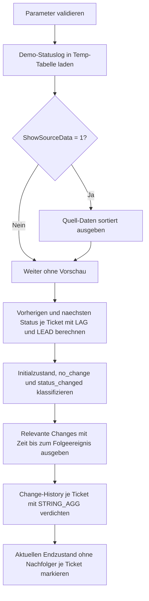

# LagLeadChangeDetection.sql

Dieses Skript zeigt ein didaktisches Muster zur Change Detection in zeitlich geordneten Statusfolgen. `LAG()` liefert den vorherigen Status zum Vergleich, waehrend `LEAD()` bereits den naechsten Status und die naechste Zeitmarke sichtbar macht.

## Uebersicht

<!-- SQLDOC:SUMMARY_TABLE:BEGIN -->
| Feld | Wert |
|---|---|
| Script | [LagLeadChangeDetection.sql](LagLeadChangeDetection.sql) |
| Version | `1.0` |
| Typ | `didactic-lab` |
| Kapitel | `11_WindowFunctions` |
| Sicherheit | `read-only-tempdb` |
| Zweck | Erkennt Zustandswechsel ueber `LAG()` und `LEAD()` und bereitet eine kompakte Change-History je Ticket auf. |
<!-- SQLDOC:SUMMARY_TABLE:END -->

## Einordnung

Die Demo modelliert Support-Tickets mit mehreren Statusereignissen. Einige Eintraege bleiben bewusst im selben Status, damit der Unterschied zwischen einer echten Aenderung und einer stabilen Phase klar sichtbar wird.

Folgende Annahmen werden dabei bewusst festgehalten:

- Das Skript arbeitet ausschliesslich mit Demo-Daten in Temp-Tabellen.
- Ein relevanter Zustandswechsel liegt nur dann vor, wenn `StatusCode` vom `PreviousStatusCode` abweicht.
- `LAG()` dient fuer den Rueckblick auf die Vorzeile, `LEAD()` fuer den Ausblick auf das naechste Ereignis und dessen Abstand.
- Der letzte Datensatz je Ticket wird als aktueller Endzustand ohne spaeteres Folgeereignis ausgewiesen.

## Parameter

<!-- SQLDOC:PARAMETERS_TABLE:BEGIN -->
| Parameter | SQL-Typ | Pflicht | Beschreibung |
|---|---|---|---|
| `@OnlyShowChanges` | `BIT` | Ja | `1` zeigt nur Initialzustand und echte Statuswechsel, `0` zeigt die komplette Ereignisfolge. |
| `@ShowSourceData` | `BIT` | Nein | Gibt bei `1` die sortierten Demo-Daten vor der Analyse aus. |
<!-- SQLDOC:PARAMETERS_TABLE:END -->

## Abhaengigkeiten

<!-- SQLDOC:DEPENDENCIES_LIST:BEGIN -->
- `tempdb` fuer temporaere Tabellen
- `LAG()`
- `LEAD()`
- `ROW_NUMBER()`
- `STRING_AGG()`
<!-- SQLDOC:DEPENDENCIES_LIST:END -->

## Hinweise

- `PreviousStatusCode IS NULL` markiert den initialen Zustand je Ticket.
- Gleichbleibende Statusfolgen sind bewusst enthalten, damit `no_change` gegen `status_changed` abgegrenzt werden kann.
- `MinutesUntilNextEvent` ist ein diagnostischer Abstand zum Folgeereignis und hilft beim Lesen der Prozessgeschwindigkeit.
- Die verdichtete Change-History nutzt `STRING_AGG`, um die Wechselreihenfolge je Ticket kompakt lesbar zu halten.

## Versionshistorie

<!-- SQLDOC:VERSION_HISTORY_TABLE:BEGIN -->
| Version | Datum | User | Beschreibung |
|---|---|---|---|
| `1.0` | `2026-04-18` | `ER` | Erstversion des didaktischen Labs zur Change Detection mit LAG und LEAD |
<!-- SQLDOC:VERSION_HISTORY_TABLE:END -->

## Ablauf

<!-- SQLDOC:MERMAID:BEGIN -->

<!-- SQLDOC:MERMAID:END -->

## SQL-Code

<!-- SQLDOC:SQL_CODE:BEGIN -->
```sql
/*
BEGIN:SQL-HEADER v1
---
sql_header: v1
script_name: "LagLeadChangeDetection.sql"
script_version: "1.0"
script_type: "didactic-lab"
chapter: "11_WindowFunctions"

purpose: >
  Zeigt, wie Zustandswechsel in einer zeitlich geordneten Ereignisfolge
  mit LAG() und LEAD() erkannt, klassifiziert und fuer eine kompakte
  Change-History je Objekt aufbereitet werden koennen.

parameters:
  - name: "@OnlyShowChanges"
    sql_type: "BIT"
    direction: "IN"
    required: true
    description: "1 = nur echte Zustandswechsel ausgeben, 0 = komplette Ereignisfolge inklusive stabiler Phasen zeigen"
  - name: "@ShowSourceData"
    sql_type: "BIT"
    direction: "IN"
    required: false
    description: "1 = Demo-Daten vor der Change-Analyse zusaetzlich anzeigen"

result_sets:
  - name: "SourcePreview"
    description: "Optionale Vorschau auf die zeitlich sortierte Demo-Ereignisfolge"
  - name: "StateSequenceWithNeighbors"
    description: "Alle Ereignisse mit vorherigem und naechstem Status je Ticket"
  - name: "DetectedChanges"
    description: "Klassifizierte Zustandswechsel inklusive Dauer bis zum naechsten Ereignis"
  - name: "ChangeSummaryPerTicket"
    description: "Verdichtete Sicht mit Anzahl und Reihenfolge der erkannten Aenderungen je Ticket"
  - name: "CurrentStatusOutlook"
    description: "Letzter bekannter Status je Ticket mit Hinweis auf fehlenden Nachfolger"

dependencies:
  - "tempdb temporary tables"
  - "LAG()"
  - "LEAD()"
  - "ROW_NUMBER()"
  - "STRING_AGG()"

safety:
  level: "read-only-tempdb"
  writes_data: false

documentation:
  markdown_file: "T-SQL/11_WindowFunctions/SQLScripts/LagLeadChangeDetection.md"
  sync_blocks:
    - "SUMMARY_TABLE"
    - "PARAMETERS_TABLE"
    - "DEPENDENCIES_LIST"
    - "VERSION_HISTORY_TABLE"
    - "SQL_CODE"
  mermaid:
    mode: "ai-agent-from-sql"
    source: "script-body"

main_responsible:
  name: "Erhard Rainer"
  initials: "ER"

version_history:
  - version: "1.0"
    date: "2026-04-18"
    user: "ER"
    description: "Erstversion des didaktischen Labs zur Change Detection mit LAG und LEAD"

notes:
  - "Die Demo verwendet Ticket-Statusfolgen in Temp-Tabellen statt produktiver Workflow-Daten"
  - "Ein Zustandswechsel liegt vor, wenn der aktuelle Status vom vorherigen Status abweicht"
---
END:SQL-HEADER v1
*/

SET NOCOUNT ON;

DECLARE @OnlyShowChanges BIT = 1;
DECLARE @ShowSourceData  BIT = 1;

IF @OnlyShowChanges NOT IN (0, 1) OR @ShowSourceData NOT IN (0, 1)
BEGIN
    THROW 50000, 'Die Parameter muessen als BIT-Werte 0 oder 1 gesetzt sein.', 1;
END;

DROP TABLE IF EXISTS #TicketStatusLog;
DROP TABLE IF EXISTS #StateSequence;
DROP TABLE IF EXISTS #DetectedChanges;
DROP TABLE IF EXISTS #CurrentStatusOutlook;

CREATE TABLE #TicketStatusLog
(
    TicketID          VARCHAR(20)   NOT NULL,
    EventTime         DATETIME2(0)  NOT NULL,
    StatusCode        VARCHAR(20)   NOT NULL,
    ChangedByTeam     VARCHAR(30)   NOT NULL,
    StatusComment     VARCHAR(100)  NOT NULL
);

INSERT INTO #TicketStatusLog
(
    TicketID,
    EventTime,
    StatusCode,
    ChangedByTeam,
    StatusComment
)
VALUES
    ('TCK-100', '2026-03-03T08:00:00', 'Open',        'ServiceDesk', 'Ticket erfasst'),
    ('TCK-100', '2026-03-03T08:15:00', 'Open',        'ServiceDesk', 'Rueckfrage dokumentiert'),
    ('TCK-100', '2026-03-03T09:05:00', 'InProgress',  'Operations',  'Bearbeitung gestartet'),
    ('TCK-100', '2026-03-03T11:30:00', 'Waiting',     'Operations',  'Wartet auf Kundendaten'),
    ('TCK-100', '2026-03-03T14:10:00', 'InProgress',  'Operations',  'Analyse nach Rueckmeldung fortgesetzt'),
    ('TCK-100', '2026-03-03T16:45:00', 'Resolved',    'Operations',  'Loesung umgesetzt'),
    ('TCK-200', '2026-03-04T07:50:00', 'Open',        'ServiceDesk', 'Ticket erfasst'),
    ('TCK-200', '2026-03-04T08:40:00', 'InProgress',  'Network',     'Netzwerkpruefung gestartet'),
    ('TCK-200', '2026-03-04T09:10:00', 'InProgress',  'Network',     'Zwischenstand ohne Statuswechsel'),
    ('TCK-200', '2026-03-04T10:25:00', 'Escalated',   'Network',     'An Second Level uebergeben'),
    ('TCK-200', '2026-03-04T12:00:00', 'Resolved',    'SecondLevel', 'Fehlerursache behoben'),
    ('TCK-300', '2026-03-05T09:00:00', 'Open',        'ServiceDesk', 'Ticket erfasst'),
    ('TCK-300', '2026-03-05T09:45:00', 'Waiting',     'ServiceDesk', 'Wartet auf Freigabe'),
    ('TCK-300', '2026-03-05T15:30:00', 'Waiting',     'ServiceDesk', 'Reminder ohne Statusaenderung'),
    ('TCK-300', '2026-03-06T08:20:00', 'Cancelled',   'ServiceDesk', 'Anfrage zurueckgezogen');

IF @ShowSourceData = 1
BEGIN
    SELECT
        tsl.TicketID,
        tsl.EventTime,
        tsl.StatusCode,
        tsl.ChangedByTeam,
        tsl.StatusComment
    FROM #TicketStatusLog AS tsl
    ORDER BY
        tsl.TicketID,
        tsl.EventTime;
END;

SELECT
    tsl.TicketID,
    tsl.EventTime,
    tsl.StatusCode,
    tsl.ChangedByTeam,
    tsl.StatusComment,
    ROW_NUMBER() OVER
    (
        PARTITION BY tsl.TicketID
        ORDER BY tsl.EventTime
    ) AS EventSequenceNumber,
    LAG(tsl.StatusCode) OVER
    (
        PARTITION BY tsl.TicketID
        ORDER BY tsl.EventTime
    ) AS PreviousStatusCode,
    LAG(tsl.EventTime) OVER
    (
        PARTITION BY tsl.TicketID
        ORDER BY tsl.EventTime
    ) AS PreviousEventTime,
    LEAD(tsl.StatusCode) OVER
    (
        PARTITION BY tsl.TicketID
        ORDER BY tsl.EventTime
    ) AS NextStatusCode,
    LEAD(tsl.EventTime) OVER
    (
        PARTITION BY tsl.TicketID
        ORDER BY tsl.EventTime
    ) AS NextEventTime
INTO #StateSequence
FROM #TicketStatusLog AS tsl;

SELECT
    ss.TicketID,
    ss.EventSequenceNumber,
    ss.EventTime,
    ss.PreviousEventTime,
    ss.StatusCode,
    ss.PreviousStatusCode,
    ss.NextStatusCode,
    ss.NextEventTime,
    ss.ChangedByTeam,
    ss.StatusComment
FROM #StateSequence AS ss
WHERE @OnlyShowChanges = 0
   OR ss.PreviousStatusCode IS NULL
   OR ss.PreviousStatusCode <> ss.StatusCode
ORDER BY
    ss.TicketID,
    ss.EventSequenceNumber;

SELECT
    ss.TicketID,
    ss.EventSequenceNumber,
    ss.PreviousEventTime,
    ss.EventTime AS ChangeEventTime,
    ss.PreviousStatusCode,
    ss.StatusCode AS CurrentStatusCode,
    ss.NextStatusCode,
    ss.NextEventTime,
    ss.ChangedByTeam,
    ss.StatusComment,
    CASE
        WHEN ss.PreviousStatusCode IS NULL THEN 'initial_state'
        WHEN ss.PreviousStatusCode = ss.StatusCode THEN 'no_change'
        ELSE 'status_changed'
    END AS ChangeCategory,
    CASE
        WHEN ss.PreviousStatusCode IS NULL THEN CONCAT('START -> ', ss.StatusCode)
        WHEN ss.PreviousStatusCode = ss.StatusCode THEN CONCAT(ss.StatusCode, ' (stable)')
        ELSE CONCAT(ss.PreviousStatusCode, ' -> ', ss.StatusCode)
    END AS ChangeLabel,
    DATEDIFF
    (
        MINUTE,
        ss.EventTime,
        ss.NextEventTime
    ) AS MinutesUntilNextEvent
INTO #DetectedChanges
FROM #StateSequence AS ss;

SELECT
    dc.TicketID,
    dc.EventSequenceNumber,
    dc.ChangeEventTime,
    dc.PreviousStatusCode,
    dc.CurrentStatusCode,
    dc.NextStatusCode,
    dc.ChangeCategory,
    dc.ChangeLabel,
    dc.MinutesUntilNextEvent,
    dc.ChangedByTeam,
    dc.StatusComment
FROM #DetectedChanges AS dc
WHERE dc.ChangeCategory <> 'no_change'
   OR @OnlyShowChanges = 0
ORDER BY
    dc.TicketID,
    dc.EventSequenceNumber;

SELECT
    dc.TicketID,
    COUNT(CASE WHEN dc.ChangeCategory = 'status_changed' THEN 1 END) AS StatusChangeCount,
    COUNT(CASE WHEN dc.ChangeCategory = 'initial_state' THEN 1 END) AS InitialStateRows,
    STRING_AGG(dc.ChangeLabel, ' | ')
        WITHIN GROUP (ORDER BY dc.EventSequenceNumber) AS ChangeTimeline
FROM #DetectedChanges AS dc
WHERE dc.ChangeCategory <> 'no_change'
GROUP BY
    dc.TicketID
ORDER BY
    dc.TicketID;

SELECT
    ss.TicketID,
    ss.EventSequenceNumber,
    ss.EventTime AS LastKnownEventTime,
    ss.StatusCode AS CurrentStatusCode,
    ss.NextStatusCode,
    CASE
        WHEN ss.NextStatusCode IS NULL THEN 'current_tail'
        ELSE 'has_future_event'
    END AS OutlookCategory,
    CASE
        WHEN ss.NextStatusCode IS NULL THEN 'Kein spaeteres Ereignis vorhanden'
        ELSE CONCAT('Naechster Status: ', ss.NextStatusCode)
    END AS OutlookNote
INTO #CurrentStatusOutlook
FROM #StateSequence AS ss
WHERE ss.NextEventTime IS NULL;

SELECT
    cso.TicketID,
    cso.LastKnownEventTime,
    cso.CurrentStatusCode,
    cso.OutlookCategory,
    cso.OutlookNote
FROM #CurrentStatusOutlook AS cso
ORDER BY
    cso.TicketID;
```
<!-- SQLDOC:SQL_CODE:END -->
