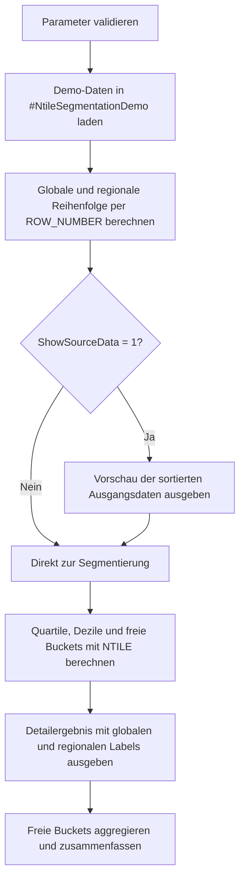

# NtileSegmentationDemo.sql

Dieses Skript zeigt, wie `NTILE()` in T-SQL fuer Quartile, Dezile und frei waehlbare Buckets genutzt werden kann. Die Umsetzung ist als didaktisches Labor ausgelegt und arbeitet ausschliesslich mit Demo-Daten in einer Temp-Tabelle.

## Uebersicht

<!-- SQLDOC:SUMMARY_TABLE:BEGIN -->
| Feld | Wert |
|---|---|
| Script | [NtileSegmentationDemo.sql](NtileSegmentationDemo.sql) |
| Version | `1.0` |
| Typ | `didactic-lab` |
| Kapitel | `11_WindowFunctions` |
| Sicherheit | `read-only-tempdb` |
| Zweck | Demonstriert globale und regionale NTILE-Segmentierung fuer Quartile, Dezile und freie Buckets. |
<!-- SQLDOC:SUMMARY_TABLE:END -->

## Einordnung

Das Beispiel nutzt ein kompaktes Vertriebsportfolio mit Regionen, Accounts und Monatsumsatz. Die Segmentierung wird global sowie innerhalb der Region berechnet, damit sichtbar wird, wie sich `PARTITION BY` auf die Bucket-Verteilung auswirkt.

## Annahmen

- Das Skript dient als Lern- und Demo-Skript fuer Kapitel `11_WindowFunctions`.
- Es werden keine produktiven Tabellen vorausgesetzt; alle Daten entstehen lokal in `#NtileSegmentationDemo`.
- Die Reihenfolge fuer `NTILE()` ist deterministisch ueber `NetSales DESC`, `MarginPct DESC` und `AccountID`.
- Frei waehlbare Buckets werden ueber `@CustomBucketCount` gesteuert und aus Sicherheitsgruenden auf einen kleinen Bereich begrenzt.

## Parameter

<!-- SQLDOC:PARAMETERS_TABLE:BEGIN -->
| Parameter | SQL-Typ | Pflicht | Beschreibung |
|---|---|---|---|
| `@CustomBucketCount` | `INT` | Ja | Anzahl der frei waehlbaren Buckets fuer die Zusatzsegmentierung. |
| `@ShowSourceData` | `BIT` | Nein | Gibt bei `1` eine Vorschau der Demo-Daten mit Sortierreihenfolge aus. |
<!-- SQLDOC:PARAMETERS_TABLE:END -->

## Abhaengigkeiten

<!-- SQLDOC:DEPENDENCIES_LIST:BEGIN -->
- `tempdb` fuer die Demo-Tabelle
- `NTILE()`
- `ROW_NUMBER()`
- CTEs
<!-- SQLDOC:DEPENDENCIES_LIST:END -->

## Hinweise

- `NTILE(4)` verteilt die Daten in vier moeglichst gleich grosse Quartile.
- `NTILE(10)` ist bei kleineren Datenmengen weiterhin gueltig, fuehrt aber zu sehr feinen Segmenten mit teilweise nur einer Zeile.
- Die regionale Quartilsicht zeigt, dass sich dieselbe Zeile global und regional in unterschiedlichen Buckets befinden kann.

## Versionshistorie

<!-- SQLDOC:VERSION_HISTORY_TABLE:BEGIN -->
| Version | Datum | User | Beschreibung |
|---|---|---|---|
| `1.0` | `2026-04-18` | `ER` | Erstversion des didaktischen NTILE-Segmentierungsbeispiels |
<!-- SQLDOC:VERSION_HISTORY_TABLE:END -->

## Ablauf

<!-- SQLDOC:MERMAID:BEGIN -->

<!-- SQLDOC:MERMAID:END -->

## SQL-Code

<!-- SQLDOC:SQL_CODE:BEGIN -->
```sql
/*
BEGIN:SQL-HEADER v1
---
sql_header: v1
script_name: "NtileSegmentationDemo.sql"
script_version: "1.0"
script_type: "didactic-lab"
chapter: "11_WindowFunctions"

purpose: >
  Demonstriert, wie NTILE in T-SQL fuer Quartile, Dezile und frei
  waehlbare Buckets eingesetzt werden kann. Das Skript zeigt sowohl eine
  globale Segmentierung als auch eine Segmentierung innerhalb von Regionen.

parameters:
  - name: "@CustomBucketCount"
    sql_type: "INT"
    direction: "IN"
    required: true
    description: "Anzahl der frei waehlbaren Buckets fuer die Zusatzsegmentierung"
  - name: "@ShowSourceData"
    sql_type: "BIT"
    direction: "IN"
    required: false
    description: "1 = Vorschau der Demo-Daten mit Sortierreihenfolge ausgeben"

result_sets:
  - name: "SourcePreview"
    description: "Optionale Vorschau der Demo-Daten mit globaler und regionaler Reihenfolge"
  - name: "NtileSegmentation"
    description: "Detailergebnis mit Quartilen, Dezilen und frei waehlbaren Buckets"
  - name: "CustomBucketSummary"
    description: "Aggregierte Zusammenfassung der frei waehlbaren Buckets"

dependencies:
  - "tempdb temporary tables"
  - "NTILE()"
  - "ROW_NUMBER()"
  - "common table expressions (CTEs)"

safety:
  level: "read-only-tempdb"
  writes_data: false

documentation:
  markdown_file: "T-SQL/11_WindowFunctions/SQLScripts/NtileSegmentationDemo.md"
  sync_blocks:
    - "SUMMARY_TABLE"
    - "PARAMETERS_TABLE"
    - "DEPENDENCIES_LIST"
    - "VERSION_HISTORY_TABLE"
    - "SQL_CODE"
  mermaid:
    mode: "ai-agent-from-sql"
    source: "script-body"

main_responsible:
  name: "Erhard Rainer"
  initials: "ER"

version_history:
  - version: "1.0"
    date: "2026-04-18"
    user: "ER"
    description: "Erstversion des didaktischen NTILE-Segmentierungsbeispiels"

notes:
  - "Die Demo nutzt reine Temp-Tabellen und setzt keine produktiven Objekte voraus"
  - "Die Segmentierung wird ueber NetSales absteigend, MarginPct absteigend und AccountID deterministisch sortiert"
---
END:SQL-HEADER v1
*/

SET NOCOUNT ON;

DECLARE @CustomBucketCount INT = 5;
DECLARE @ShowSourceData    BIT = 1;

IF @CustomBucketCount IS NULL OR @CustomBucketCount < 2 OR @CustomBucketCount > 12
BEGIN
    THROW 50000, '@CustomBucketCount muss zwischen 2 und 12 liegen.', 1;
END;

DROP TABLE IF EXISTS #NtileSegmentationDemo;

CREATE TABLE #NtileSegmentationDemo
(
    AccountID   INT           NOT NULL PRIMARY KEY,
    SalesRegion VARCHAR(20)   NOT NULL,
    AccountName VARCHAR(60)   NOT NULL,
    FiscalMonth DATE          NOT NULL,
    NetSales    DECIMAL(12,2) NOT NULL,
    MarginPct   DECIMAL(5,2)  NOT NULL
);

INSERT INTO #NtileSegmentationDemo
(
    AccountID,
    SalesRegion,
    AccountName,
    FiscalMonth,
    NetSales,
    MarginPct
)
VALUES
    (101, 'North',   'Alpine Retail',     '2026-01-01', 182000.00, 29.40),
    (102, 'North',   'Baltic Market',     '2026-01-01', 174500.00, 27.10),
    (103, 'North',   'Cobalt Stores',     '2026-01-01', 166800.00, 26.50),
    (104, 'North',   'Delta Fashion',     '2026-01-01', 154300.00, 24.80),
    (105, 'North',   'Evergreen Outlet',  '2026-01-01', 143700.00, 23.90),
    (106, 'North',   'Fjord Supplies',    '2026-01-01', 131200.00, 22.70),
    (201, 'Central', 'Granite Trade',     '2026-01-01', 176400.00, 30.20),
    (202, 'Central', 'Harbor Wholesale',  '2026-01-01', 169900.00, 28.10),
    (203, 'Central', 'Ionics Direct',     '2026-01-01', 158600.00, 26.20),
    (204, 'Central', 'Juniper Goods',     '2026-01-01', 149500.00, 25.10),
    (205, 'Central', 'Keystone Depot',    '2026-01-01', 138900.00, 22.80),
    (206, 'Central', 'Lumen Partners',    '2026-01-01', 128800.00, 21.90),
    (301, 'South',   'Metro Bazaar',      '2026-01-01', 171600.00, 28.90),
    (302, 'South',   'Nova Commerce',     '2026-01-01', 163400.00, 27.60),
    (303, 'South',   'Orchid Outlet',     '2026-01-01', 152700.00, 24.40),
    (304, 'South',   'Pioneer Supply',    '2026-01-01', 145800.00, 23.20),
    (305, 'South',   'Quartz Retail',     '2026-01-01', 136100.00, 22.30),
    (306, 'South',   'Ridge Traders',     '2026-01-01', 125500.00, 21.40);

;WITH RankedSource AS
(
    SELECT
        d.AccountID,
        d.SalesRegion,
        d.AccountName,
        d.FiscalMonth,
        d.NetSales,
        d.MarginPct,
        ROW_NUMBER() OVER
        (
            ORDER BY d.NetSales DESC, d.MarginPct DESC, d.AccountID
        ) AS OverallOrder,
        ROW_NUMBER() OVER
        (
            PARTITION BY d.SalesRegion
            ORDER BY d.NetSales DESC, d.MarginPct DESC, d.AccountID
        ) AS RegionOrder
    FROM #NtileSegmentationDemo AS d
),
Segmented AS
(
    SELECT
        rs.AccountID,
        rs.SalesRegion,
        rs.AccountName,
        rs.FiscalMonth,
        rs.NetSales,
        rs.MarginPct,
        rs.OverallOrder,
        rs.RegionOrder,
        NTILE(4) OVER
        (
            ORDER BY rs.NetSales DESC, rs.MarginPct DESC, rs.AccountID
        ) AS OverallQuartile,
        NTILE(10) OVER
        (
            ORDER BY rs.NetSales DESC, rs.MarginPct DESC, rs.AccountID
        ) AS OverallDecile,
        NTILE(@CustomBucketCount) OVER
        (
            ORDER BY rs.NetSales DESC, rs.MarginPct DESC, rs.AccountID
        ) AS OverallCustomBucket,
        NTILE(4) OVER
        (
            PARTITION BY rs.SalesRegion
            ORDER BY rs.NetSales DESC, rs.MarginPct DESC, rs.AccountID
        ) AS RegionQuartile
    FROM RankedSource AS rs
)
SELECT
    rs.AccountID,
    rs.SalesRegion,
    rs.AccountName,
    rs.FiscalMonth,
    rs.NetSales,
    rs.MarginPct,
    rs.OverallOrder,
    rs.RegionOrder
FROM RankedSource AS rs
WHERE @ShowSourceData = 1
ORDER BY
    rs.OverallOrder;

;WITH RankedSource AS
(
    SELECT
        d.AccountID,
        d.SalesRegion,
        d.AccountName,
        d.FiscalMonth,
        d.NetSales,
        d.MarginPct,
        ROW_NUMBER() OVER
        (
            ORDER BY d.NetSales DESC, d.MarginPct DESC, d.AccountID
        ) AS OverallOrder,
        ROW_NUMBER() OVER
        (
            PARTITION BY d.SalesRegion
            ORDER BY d.NetSales DESC, d.MarginPct DESC, d.AccountID
        ) AS RegionOrder
    FROM #NtileSegmentationDemo AS d
),
Segmented AS
(
    SELECT
        rs.AccountID,
        rs.SalesRegion,
        rs.AccountName,
        rs.FiscalMonth,
        rs.NetSales,
        rs.MarginPct,
        rs.OverallOrder,
        rs.RegionOrder,
        NTILE(4) OVER
        (
            ORDER BY rs.NetSales DESC, rs.MarginPct DESC, rs.AccountID
        ) AS OverallQuartile,
        NTILE(10) OVER
        (
            ORDER BY rs.NetSales DESC, rs.MarginPct DESC, rs.AccountID
        ) AS OverallDecile,
        NTILE(@CustomBucketCount) OVER
        (
            ORDER BY rs.NetSales DESC, rs.MarginPct DESC, rs.AccountID
        ) AS OverallCustomBucket,
        NTILE(4) OVER
        (
            PARTITION BY rs.SalesRegion
            ORDER BY rs.NetSales DESC, rs.MarginPct DESC, rs.AccountID
        ) AS RegionQuartile
    FROM RankedSource AS rs
)
SELECT
    s.AccountID,
    s.SalesRegion,
    s.AccountName,
    s.NetSales,
    s.MarginPct,
    s.OverallOrder,
    s.RegionOrder,
    s.OverallQuartile,
    CONCAT('Q', s.OverallQuartile) AS OverallQuartileLabel,
    s.OverallDecile,
    CONCAT('D', s.OverallDecile) AS OverallDecileLabel,
    s.OverallCustomBucket,
    CONCAT('B', s.OverallCustomBucket, ' of ', @CustomBucketCount) AS OverallCustomBucketLabel,
    s.RegionQuartile,
    CONCAT(s.SalesRegion, '-Q', s.RegionQuartile) AS RegionQuartileLabel
FROM Segmented AS s
ORDER BY
    s.OverallOrder;

;WITH RankedSource AS
(
    SELECT
        d.AccountID,
        d.SalesRegion,
        d.AccountName,
        d.FiscalMonth,
        d.NetSales,
        d.MarginPct,
        ROW_NUMBER() OVER
        (
            ORDER BY d.NetSales DESC, d.MarginPct DESC, d.AccountID
        ) AS OverallOrder,
        ROW_NUMBER() OVER
        (
            PARTITION BY d.SalesRegion
            ORDER BY d.NetSales DESC, d.MarginPct DESC, d.AccountID
        ) AS RegionOrder
    FROM #NtileSegmentationDemo AS d
),
Segmented AS
(
    SELECT
        rs.AccountID,
        rs.SalesRegion,
        rs.AccountName,
        rs.FiscalMonth,
        rs.NetSales,
        rs.MarginPct,
        rs.OverallOrder,
        rs.RegionOrder,
        NTILE(4) OVER
        (
            ORDER BY rs.NetSales DESC, rs.MarginPct DESC, rs.AccountID
        ) AS OverallQuartile,
        NTILE(10) OVER
        (
            ORDER BY rs.NetSales DESC, rs.MarginPct DESC, rs.AccountID
        ) AS OverallDecile,
        NTILE(@CustomBucketCount) OVER
        (
            ORDER BY rs.NetSales DESC, rs.MarginPct DESC, rs.AccountID
        ) AS OverallCustomBucket,
        NTILE(4) OVER
        (
            PARTITION BY rs.SalesRegion
            ORDER BY rs.NetSales DESC, rs.MarginPct DESC, rs.AccountID
        ) AS RegionQuartile
    FROM RankedSource AS rs
)
SELECT
    s.OverallCustomBucket,
    COUNT(*) AS AccountsInBucket,
    MIN(s.NetSales) AS MinNetSales,
    MAX(s.NetSales) AS MaxNetSales,
    AVG(s.NetSales) AS AvgNetSales,
    STRING_AGG(s.AccountName, ', ') WITHIN GROUP (ORDER BY s.OverallOrder) AS Accounts
FROM Segmented AS s
GROUP BY
    s.OverallCustomBucket
ORDER BY
    s.OverallCustomBucket;
```
<!-- SQLDOC:SQL_CODE:END -->
