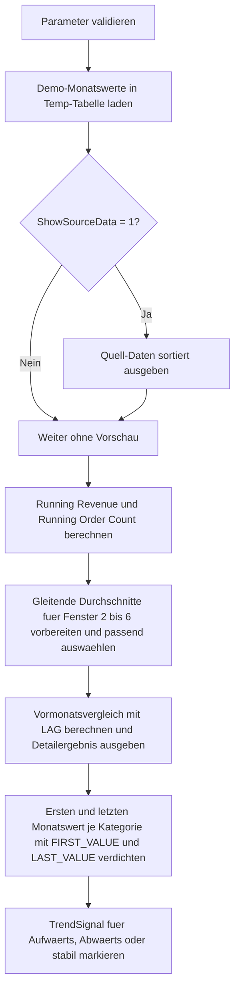

# RunningTotalPatterns.sql

Dieses Skript zeigt ein didaktisches Muster fuer kumulative Summen, gleitende Fenster und periodenbasierte Vergleiche im Kapitel `11_WindowFunctions`. Die Demo bleibt bewusst bei Monatswerten pro Kategorie, damit der Effekt von `OVER()` direkt lesbar bleibt.

## Uebersicht

<!-- SQLDOC:SUMMARY_TABLE:BEGIN -->
| Feld | Wert |
|---|---|
| Script | [RunningTotalPatterns.sql](RunningTotalPatterns.sql) |
| Version | `1.0` |
| Typ | `didactic-lab` |
| Kapitel | `11_WindowFunctions` |
| Sicherheit | `read-only-tempdb` |
| Zweck | Zeigt laufende Summe, gleitenden Durchschnitt und Monatsvergleich je Kategorie mit `OVER()`. |
<!-- SQLDOC:SUMMARY_TABLE:END -->

## Einordnung

Die Demo modelliert Monatsumsatz pro Kategorie. Dadurch lassen sich drei typische Fensterfunktion-Muster in einem zusammenhaengenden Ablauf zeigen:

- kumulative Summe ueber alle bisherigen Perioden
- gleitender Durchschnitt ueber ein zeilenbasiertes Fenster
- Vergleich zum Vormonat mit diagnostischer Trendmarkierung

Folgende Annahmen werden dabei bewusst festgehalten:

- Das Skript arbeitet ausschliesslich mit Demo-Daten in Temp-Tabellen.
- Die Fensterbreite des gleitenden Durchschnitts wird ueber den Parameter ausgewaehlt, technisch aber auf feste `ROWS`-Frames von `2` bis `6` Zeilen abgebildet.
- Der Periodenvergleich erfolgt innerhalb derselben Kategorie und nutzt den direkten Vormonatswert per `LAG()`.
- `FIRST_VALUE()` und `LAST_VALUE()` werden mit explizitem Frame ueber die ganze Partition gezeigt, um typische Frame-Fallstricke zu vermeiden.

## Parameter

<!-- SQLDOC:PARAMETERS_TABLE:BEGIN -->
| Parameter | SQL-Typ | Pflicht | Beschreibung |
|---|---|---|---|
| `@RollingWindowSize` | `INT` | Ja | Anzahl der Zeilen fuer den gleitenden Durchschnitt; zulaessig sind Werte von `2` bis `6`. |
| `@ShowSourceData` | `BIT` | Nein | Gibt bei `1` die Demo-Daten vor den Fensterberechnungen aus. |
<!-- SQLDOC:PARAMETERS_TABLE:END -->

## Abhaengigkeiten

<!-- SQLDOC:DEPENDENCIES_LIST:BEGIN -->
- `tempdb` fuer temporaere Tabellen
- `SUM() OVER(...)`
- `AVG() OVER(...)`
- `LAG()`
- `FIRST_VALUE()`
- `LAST_VALUE()`
<!-- SQLDOC:DEPENDENCIES_LIST:END -->

## Hinweise

- `RunningRevenue` und `RunningOrderCount` laufen von der ersten bis zur aktuellen Zeile jeder Kategorie.
- `RollingAverageRevenue` waehlt je nach Parameter einen festen zeilenbasierten Frame zwischen `2` und `6` Perioden.
- `RevenueDeltaToPreviousMonth` macht Spruenge gegenueber dem direkten Vormonat sichtbar.
- Die verdichtete Kategorie-Sicht kombiniert ersten Monatswert, letzten Monatswert und kumulierten Gesamtumsatz in einem Resultset.

## Versionshistorie

<!-- SQLDOC:VERSION_HISTORY_TABLE:BEGIN -->
| Version | Datum | User | Beschreibung |
|---|---|---|---|
| `1.0` | `2026-04-18` | `ER` | Erstversion des didaktischen Labs fuer Running Totals, Sliding Windows und Periodenvergleiche |
<!-- SQLDOC:VERSION_HISTORY_TABLE:END -->

## Ablauf

<!-- SQLDOC:MERMAID:BEGIN -->

<!-- SQLDOC:MERMAID:END -->

## SQL-Code

<!-- SQLDOC:SQL_CODE:BEGIN -->
```sql
/*
BEGIN:SQL-HEADER v1
---
sql_header: v1
script_name: "RunningTotalPatterns.sql"
script_version: "1.0"
script_type: "didactic-lab"
chapter: "11_WindowFunctions"

purpose: >
  Zeigt kumulative Summen, gleitende Fenster und periodenbasierte
  Vergleiche mit OVER(). Das Skript kombiniert einen laufenden Umsatz,
  einen gleitenden Durchschnitt und einen Vergleich zum Vormonat
  innerhalb derselben Produktkategorie.

parameters:
  - name: "@RollingWindowSize"
    sql_type: "INT"
    direction: "IN"
    required: true
    description: "Anzahl der Zeilen fuer den gleitenden Durchschnitt; zulaessig sind Fensterbreiten von 2 bis 6"
  - name: "@ShowSourceData"
    sql_type: "BIT"
    direction: "IN"
    required: false
    description: "1 = die Demo-Daten vor der Fensterberechnung zusaetzlich ausgeben"

result_sets:
  - name: "SourcePreview"
    description: "Optionale Vorschau auf die monatlichen Demo-Umsaetze"
  - name: "WindowedSalesPatterns"
    description: "Detailergebnis mit laufender Summe, gleitendem Durchschnitt und Vergleich zum Vormonat"
  - name: "CategoryPeriodComparison"
    description: "Verdichtete Sicht je Kategorie mit erstem, letztem und kumuliertem Monatswert"
  - name: "WindowSignalReview"
    description: "Diagnostische Markierung fuer Aufwaerts-, Abwaerts- und stabile Monatsbewegungen"

dependencies:
  - "tempdb temporary tables"
  - "SUM() OVER(...)"
  - "AVG() OVER(...)"
  - "LAG()"
  - "FIRST_VALUE()"
  - "LAST_VALUE()"

safety:
  level: "read-only-tempdb"
  writes_data: false

documentation:
  markdown_file: "T-SQL/11_WindowFunctions/SQLScripts/RunningTotalPatterns.md"
  sync_blocks:
    - "SUMMARY_TABLE"
    - "PARAMETERS_TABLE"
    - "DEPENDENCIES_LIST"
    - "VERSION_HISTORY_TABLE"
    - "SQL_CODE"
  mermaid:
    mode: "ai-agent-from-sql"
    source: "script-body"

main_responsible:
  name: "Erhard Rainer"
  initials: "ER"

version_history:
  - version: "1.0"
    date: "2026-04-18"
    user: "ER"
    description: "Erstversion des didaktischen Labs fuer Running Totals, Sliding Windows und Periodenvergleiche"

notes:
  - "Die Demo nutzt Monatswerte in Temp-Tabellen statt produktiver Faktentabellen"
  - "Die Fensterbreite fuer den gleitenden Durchschnitt wird ueber vordefinierte ROWS-Frames von 2 bis 6 Zeilen ausgewaehlt"
---
END:SQL-HEADER v1
*/

SET NOCOUNT ON;

DECLARE @RollingWindowSize INT = 3;
DECLARE @ShowSourceData    BIT = 1;

IF @RollingWindowSize IS NULL OR @RollingWindowSize < 2 OR @RollingWindowSize > 6
BEGIN
    THROW 50000, '@RollingWindowSize muss zwischen 2 und 6 liegen.', 1;
END;

IF @ShowSourceData NOT IN (0, 1)
BEGIN
    THROW 50000, '@ShowSourceData muss als BIT-Wert 0 oder 1 gesetzt sein.', 1;
END;

DROP TABLE IF EXISTS #MonthlySales;
DROP TABLE IF EXISTS #WindowedSalesPatterns;
DROP TABLE IF EXISTS #WindowSignalReview;

CREATE TABLE #MonthlySales
(
    CategoryName  VARCHAR(20)   NOT NULL,
    SalesMonth    DATE          NOT NULL,
    RevenueAmount DECIMAL(12,2) NOT NULL,
    OrderCount    INT           NOT NULL,
    PRIMARY KEY (CategoryName, SalesMonth)
);

INSERT INTO #MonthlySales
(
    CategoryName,
    SalesMonth,
    RevenueAmount,
    OrderCount
)
VALUES
    ('Hardware', '2026-01-01', 118000.00, 94),
    ('Hardware', '2026-02-01', 126500.00, 101),
    ('Hardware', '2026-03-01', 133200.00, 109),
    ('Hardware', '2026-04-01', 129800.00, 103),
    ('Hardware', '2026-05-01', 141400.00, 114),
    ('Hardware', '2026-06-01', 147900.00, 118),
    ('Services', '2026-01-01',  86500.00, 61),
    ('Services', '2026-02-01',  90200.00, 64),
    ('Services', '2026-03-01',  88700.00, 62),
    ('Services', '2026-04-01',  95400.00, 68),
    ('Services', '2026-05-01',  99800.00, 70),
    ('Services', '2026-06-01', 103600.00, 74),
    ('Software', '2026-01-01',  74200.00, 47),
    ('Software', '2026-02-01',  78100.00, 49),
    ('Software', '2026-03-01',  83500.00, 53),
    ('Software', '2026-04-01',  81200.00, 51),
    ('Software', '2026-05-01',  87900.00, 55),
    ('Software', '2026-06-01',  92500.00, 58);

IF @ShowSourceData = 1
BEGIN
    SELECT
        ms.CategoryName,
        ms.SalesMonth,
        ms.RevenueAmount,
        ms.OrderCount
    FROM #MonthlySales AS ms
    ORDER BY
        ms.CategoryName,
        ms.SalesMonth;
END;

-- 1. Laufende Summe, gleitende Durchschnitte und Vormonatsvergleich je Kategorie berechnen.
SELECT
    ms.CategoryName,
    ms.SalesMonth,
    ms.RevenueAmount,
    ms.OrderCount,
    SUM(ms.RevenueAmount) OVER
    (
        PARTITION BY ms.CategoryName
        ORDER BY ms.SalesMonth
        ROWS BETWEEN UNBOUNDED PRECEDING AND CURRENT ROW
    ) AS RunningRevenue,
    AVG(ms.RevenueAmount) OVER
    (
        PARTITION BY ms.CategoryName
        ORDER BY ms.SalesMonth
        ROWS BETWEEN 1 PRECEDING AND CURRENT ROW
    ) AS RollingAverageRevenue2,
    AVG(ms.RevenueAmount) OVER
    (
        PARTITION BY ms.CategoryName
        ORDER BY ms.SalesMonth
        ROWS BETWEEN 2 PRECEDING AND CURRENT ROW
    ) AS RollingAverageRevenue3,
    AVG(ms.RevenueAmount) OVER
    (
        PARTITION BY ms.CategoryName
        ORDER BY ms.SalesMonth
        ROWS BETWEEN 3 PRECEDING AND CURRENT ROW
    ) AS RollingAverageRevenue4,
    AVG(ms.RevenueAmount) OVER
    (
        PARTITION BY ms.CategoryName
        ORDER BY ms.SalesMonth
        ROWS BETWEEN 4 PRECEDING AND CURRENT ROW
    ) AS RollingAverageRevenue5,
    AVG(ms.RevenueAmount) OVER
    (
        PARTITION BY ms.CategoryName
        ORDER BY ms.SalesMonth
        ROWS BETWEEN 5 PRECEDING AND CURRENT ROW
    ) AS RollingAverageRevenue6,
    SUM(ms.OrderCount) OVER
    (
        PARTITION BY ms.CategoryName
        ORDER BY ms.SalesMonth
        ROWS BETWEEN UNBOUNDED PRECEDING AND CURRENT ROW
    ) AS RunningOrderCount,
    LAG(ms.RevenueAmount) OVER
    (
        PARTITION BY ms.CategoryName
        ORDER BY ms.SalesMonth
    ) AS PreviousMonthRevenue,
    ms.RevenueAmount
        - LAG(ms.RevenueAmount) OVER
        (
            PARTITION BY ms.CategoryName
            ORDER BY ms.SalesMonth
        ) AS RevenueDeltaToPreviousMonth
INTO #WindowedSalesPatterns
FROM #MonthlySales AS ms;

SELECT
    wsp.CategoryName,
    wsp.SalesMonth,
    wsp.RevenueAmount,
    wsp.OrderCount,
    wsp.RunningRevenue,
    CAST
    (
        CASE @RollingWindowSize
            WHEN 2 THEN wsp.RollingAverageRevenue2
            WHEN 3 THEN wsp.RollingAverageRevenue3
            WHEN 4 THEN wsp.RollingAverageRevenue4
            WHEN 5 THEN wsp.RollingAverageRevenue5
            ELSE wsp.RollingAverageRevenue6
        END AS DECIMAL(12,2)
    ) AS RollingAverageRevenue,
    wsp.RunningOrderCount,
    wsp.PreviousMonthRevenue,
    wsp.RevenueDeltaToPreviousMonth
FROM #WindowedSalesPatterns AS wsp
ORDER BY
    wsp.CategoryName,
    wsp.SalesMonth;

-- 2. Periodenvergleich je Kategorie ueber den ersten und letzten sichtbaren Monatswert verdichten.
SELECT DISTINCT
    wsp.CategoryName,
    FIRST_VALUE(wsp.RevenueAmount) OVER
    (
        PARTITION BY wsp.CategoryName
        ORDER BY wsp.SalesMonth
        ROWS BETWEEN UNBOUNDED PRECEDING AND UNBOUNDED FOLLOWING
    ) AS FirstMonthRevenue,
    LAST_VALUE(wsp.RevenueAmount) OVER
    (
        PARTITION BY wsp.CategoryName
        ORDER BY wsp.SalesMonth
        ROWS BETWEEN UNBOUNDED PRECEDING AND UNBOUNDED FOLLOWING
    ) AS LastMonthRevenue,
    MAX(wsp.RunningRevenue) OVER
    (
        PARTITION BY wsp.CategoryName
    ) AS TotalRevenueAcrossMonths,
    LAST_VALUE(wsp.SalesMonth) OVER
    (
        PARTITION BY wsp.CategoryName
        ORDER BY wsp.SalesMonth
        ROWS BETWEEN UNBOUNDED PRECEDING AND UNBOUNDED FOLLOWING
    ) AS LastVisibleMonth
FROM #WindowedSalesPatterns AS wsp
ORDER BY
    wsp.CategoryName;

-- 3. Bewegungen aus dem Vormonatsvergleich diagnostisch markieren.
SELECT
    wsp.CategoryName,
    wsp.SalesMonth,
    wsp.RevenueAmount,
    wsp.PreviousMonthRevenue,
    wsp.RevenueDeltaToPreviousMonth,
    CASE
        WHEN wsp.PreviousMonthRevenue IS NULL THEN 'initial_period'
        WHEN wsp.RevenueDeltaToPreviousMonth > 0 THEN 'upward'
        WHEN wsp.RevenueDeltaToPreviousMonth < 0 THEN 'downward'
        ELSE 'stable'
    END AS TrendSignal,
    CASE
        WHEN wsp.PreviousMonthRevenue IS NULL THEN 'Kein Vormonat vorhanden'
        WHEN wsp.RevenueDeltaToPreviousMonth > 0 THEN 'Umsatz ueber Vormonat'
        WHEN wsp.RevenueDeltaToPreviousMonth < 0 THEN 'Umsatz unter Vormonat'
        ELSE 'Umsatz unveraendert'
    END AS TrendComment
INTO #WindowSignalReview
FROM #WindowedSalesPatterns AS wsp;

SELECT
    wsr.CategoryName,
    wsr.SalesMonth,
    wsr.RevenueAmount,
    wsr.PreviousMonthRevenue,
    wsr.RevenueDeltaToPreviousMonth,
    wsr.TrendSignal,
    wsr.TrendComment
FROM #WindowSignalReview AS wsr
ORDER BY
    wsr.CategoryName,
    wsr.SalesMonth;
```
<!-- SQLDOC:SQL_CODE:END -->
