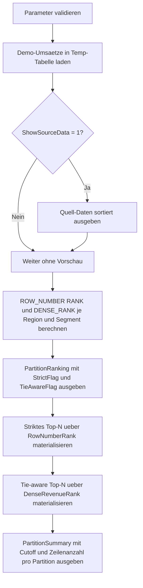

# TopNPerPartition.sql

Dieses Skript zeigt das typische Top-N-je-Gruppe-Muster fuer Window Functions im Kapitel `11_WindowFunctions`. Die Demo verwendet bewusst kleine Partitionen aus `RegionName` und `SegmentName`, damit der Unterschied zwischen strikt begrenztem Top-N und tie-aware Top-N direkt nachvollziehbar bleibt.

## Uebersicht

<!-- SQLDOC:SUMMARY_TABLE:BEGIN -->
| Feld | Wert |
|---|---|
| Script | [TopNPerPartition.sql](TopNPerPartition.sql) |
| Version | `1.0` |
| Typ | `didactic-lab` |
| Kapitel | `11_WindowFunctions` |
| Sicherheit | `read-only-tempdb` |
| Zweck | Zeigt striktes und tie-aware Top-N je Partition mit `ROW_NUMBER()`, `RANK()` und `DENSE_RANK()`. |
<!-- SQLDOC:SUMMARY_TABLE:END -->

## Einordnung

Die Umsetzung bleibt absichtlich didaktisch und arbeitet nur mit Demo-Daten in Temp-Tabellen. Pro Kombination aus `RegionName` und `SegmentName` wird ein Ranking nach Umsatz aufgebaut, damit typische Fragen zu "Top 2 je Gruppe", Gleichstaenden am Grenzwert und deterministischer Sortierung in einem kompakten Skript sichtbar werden.

Folgende Annahmen werden dabei bewusst festgehalten:

- Die Partitionen werden didaktisch ueber `RegionName` und `SegmentName` definiert.
- Die fachliche Hauptmetrik fuer das Ranking ist `RevenueAmount`.
- `OrderCount` und `SalesRep` dienen nur als stabile Tiebreaker fuer `ROW_NUMBER()`.
- Tie-aware Top-N wird mit `DENSE_RANK()` modelliert, damit alle Umsatz-Gleichstaende am Grenzwert sichtbar bleiben.

## Parameter

<!-- SQLDOC:PARAMETERS_TABLE:BEGIN -->
| Parameter | SQL-Typ | Pflicht | Beschreibung |
|---|---|---|---|
| `@TopN` | `INT` | Ja | Anzahl der je Partition auszugebenden Top-Zeilen; zulaessig sind Werte von `1` bis `5`. |
| `@ShowSourceData` | `BIT` | Nein | Gibt bei `1` die Demo-Daten vor dem Ranking zusaetzlich aus. |
<!-- SQLDOC:PARAMETERS_TABLE:END -->

## Abhaengigkeiten

<!-- SQLDOC:DEPENDENCIES_LIST:BEGIN -->
- `tempdb` fuer temporaere Tabellen
- `ROW_NUMBER()`
- `RANK()`
- `DENSE_RANK()`
- Fensterpartitionierung mit `PARTITION BY ... ORDER BY ...`
<!-- SQLDOC:DEPENDENCIES_LIST:END -->

## Hinweise

- `ROW_NUMBER()` liefert genau `N` Zeilen je Partition, weil die Reihenfolge mit Tiebreakern vollstaendig deterministisch gemacht wird.
- `RANK()` und `DENSE_RANK()` zeigen denselben Umsatzrang, unterscheiden sich aber bei den Luecken nach Gleichstaenden.
- Fuer die eigentliche tie-aware Auswahl wird hier `DENSE_RANK()` genutzt, weil die Schwelle `<= @TopN` dann alle Gleichstaende auf den ersten `N` Umsatzstufen einschliesst.
- Die Zusammenfassung am Ende macht sichtbar, in welchen Partitionen tie-aware Top-N mehr Zeilen als das strikte Top-N liefert.

## Versionshistorie

<!-- SQLDOC:VERSION_HISTORY_TABLE:BEGIN -->
| Version | Datum | User | Beschreibung |
|---|---|---|---|
| `1.0` | `2026-04-18` | `ER` | Erstversion des didaktischen Labs fuer Top-N-je-Partition mit Ranking-Funktionen |
<!-- SQLDOC:VERSION_HISTORY_TABLE:END -->

## Ablauf

<!-- SQLDOC:MERMAID:BEGIN -->

<!-- SQLDOC:MERMAID:END -->

## SQL-Code

<!-- SQLDOC:SQL_CODE:BEGIN -->
```sql
/*
BEGIN:SQL-HEADER v1
---
sql_header: v1
script_name: "TopNPerPartition.sql"
script_version: "1.0"
script_type: "didactic-lab"
chapter: "11_WindowFunctions"

purpose: >
  Zeigt typische Top-N-je-Gruppe-Muster mit Window Functions. Das Skript
  rankt Demo-Umsaetze je Region und Produktsegment, vergleicht
  ROW_NUMBER(), RANK() und DENSE_RANK() und leitet daraus sowohl strikte
  als auch tie-aware Top-N-Ergebnisse ab.

parameters:
  - name: "@TopN"
    sql_type: "INT"
    direction: "IN"
    required: true
    description: "Anzahl der je Partition auszugebenden Top-Zeilen"
  - name: "@ShowSourceData"
    sql_type: "BIT"
    direction: "IN"
    required: false
    description: "1 = Demo-Daten vor dem Ranking zusaetzlich anzeigen"

result_sets:
  - name: "SourcePreview"
    description: "Optionale Vorschau auf die Demo-Umsaetze pro Region und Segment"
  - name: "PartitionRanking"
    description: "Alle Zeilen mit ROW_NUMBER, RANK und DENSE_RANK je Partition"
  - name: "TopNStrict"
    description: "Genau N Zeilen je Partition auf Basis von ROW_NUMBER"
  - name: "TopNWithTies"
    description: "Top-N je Partition inklusive Punktgleichstaenden auf Basis von DENSE_RANK"
  - name: "PartitionSummary"
    description: "Vergleich der Partitionen mit Grenzwert fuer strict vs tie-aware Top-N"

dependencies:
  - "tempdb temporary tables"
  - "ROW_NUMBER()"
  - "RANK()"
  - "DENSE_RANK()"
  - "window partitioning with ORDER BY"

safety:
  level: "read-only-tempdb"
  writes_data: false

documentation:
  markdown_file: "T-SQL/11_WindowFunctions/SQLScripts/TopNPerPartition.md"
  sync_blocks:
    - "SUMMARY_TABLE"
    - "PARAMETERS_TABLE"
    - "DEPENDENCIES_LIST"
    - "VERSION_HISTORY_TABLE"
    - "SQL_CODE"
  mermaid:
    mode: "ai-agent-from-sql"
    source: "script-body"

main_responsible:
  name: "Erhard Rainer"
  initials: "ER"

version_history:
  - version: "1.0"
    date: "2026-04-18"
    user: "ER"
    description: "Erstversion des didaktischen Labs fuer Top-N-je-Partition mit Ranking-Funktionen"

notes:
  - "Die Demo nutzt Umsaetze in Temp-Tabellen statt produktiver Verkaufsdaten"
  - "Tie-aware Top-N wird bewusst mit DENSE_RANK statt ROW_NUMBER illustriert"
---
END:SQL-HEADER v1
*/

SET NOCOUNT ON;

DECLARE @TopN           INT = 2;
DECLARE @ShowSourceData BIT = 1;

IF @TopN IS NULL OR @TopN < 1 OR @TopN > 5
BEGIN
    THROW 50000, '@TopN muss zwischen 1 und 5 liegen.', 1;
END;

IF @ShowSourceData NOT IN (0, 1)
BEGIN
    THROW 50000, '@ShowSourceData muss als BIT-Wert 0 oder 1 gesetzt sein.', 1;
END;

DROP TABLE IF EXISTS #SalesPerformance;
DROP TABLE IF EXISTS #PartitionRanking;
DROP TABLE IF EXISTS #TopNStrict;
DROP TABLE IF EXISTS #TopNWithTies;

CREATE TABLE #SalesPerformance
(
    RegionName      VARCHAR(20)   NOT NULL,
    SegmentName     VARCHAR(20)   NOT NULL,
    SalesRep        VARCHAR(40)   NOT NULL,
    RevenueAmount   DECIMAL(12,2) NOT NULL,
    OrderCount      INT           NOT NULL,
    MarginPct       DECIMAL(5,2)  NOT NULL,
    SnapshotMonth   DATE          NOT NULL,
    PRIMARY KEY (RegionName, SegmentName, SalesRep, SnapshotMonth)
);

INSERT INTO #SalesPerformance
(
    RegionName,
    SegmentName,
    SalesRep,
    RevenueAmount,
    OrderCount,
    MarginPct,
    SnapshotMonth
)
VALUES
    ('North', 'Hardware', 'Ava',   128000.00,  96, 31.50, '2026-03-01'),
    ('North', 'Hardware', 'Ben',   128000.00, 102, 29.80, '2026-03-01'),
    ('North', 'Hardware', 'Cara',  119500.00,  91, 33.10, '2026-03-01'),
    ('North', 'Services', 'Dino',   84500.00,  58, 42.40, '2026-03-01'),
    ('North', 'Services', 'Emma',   81200.00,  61, 40.10, '2026-03-01'),
    ('North', 'Services', 'Finn',   81200.00,  54, 39.90, '2026-03-01'),
    ('South', 'Hardware', 'Gina',  134400.00, 105, 30.40, '2026-03-01'),
    ('South', 'Hardware', 'Hugo',  129900.00,  99, 32.20, '2026-03-01'),
    ('South', 'Hardware', 'Iris',  129900.00, 101, 28.70, '2026-03-01'),
    ('South', 'Services', 'Jule',   93200.00,  63, 44.80, '2026-03-01'),
    ('South', 'Services', 'Kian',   91800.00,  60, 41.30, '2026-03-01'),
    ('South', 'Services', 'Lina',   88700.00,  57, 43.10, '2026-03-01');

IF @ShowSourceData = 1
BEGIN
    SELECT
        sp.RegionName,
        sp.SegmentName,
        sp.SalesRep,
        sp.RevenueAmount,
        sp.OrderCount,
        sp.MarginPct,
        sp.SnapshotMonth
    FROM #SalesPerformance AS sp
    ORDER BY
        sp.RegionName,
        sp.SegmentName,
        sp.RevenueAmount DESC,
        sp.SalesRep;
END;

SELECT
    sp.RegionName,
    sp.SegmentName,
    sp.SalesRep,
    sp.RevenueAmount,
    sp.OrderCount,
    sp.MarginPct,
    sp.SnapshotMonth,
    ROW_NUMBER() OVER
    (
        PARTITION BY sp.RegionName, sp.SegmentName
        ORDER BY
            sp.RevenueAmount DESC,
            sp.OrderCount DESC,
            sp.SalesRep ASC
    ) AS RowNumberRank,
    RANK() OVER
    (
        PARTITION BY sp.RegionName, sp.SegmentName
        ORDER BY sp.RevenueAmount DESC
    ) AS RevenueRank,
    DENSE_RANK() OVER
    (
        PARTITION BY sp.RegionName, sp.SegmentName
        ORDER BY sp.RevenueAmount DESC
    ) AS DenseRevenueRank
INTO #PartitionRanking
FROM #SalesPerformance AS sp;

SELECT
    pr.RegionName,
    pr.SegmentName,
    pr.SalesRep,
    pr.RevenueAmount,
    pr.OrderCount,
    pr.MarginPct,
    pr.RowNumberRank,
    pr.RevenueRank,
    pr.DenseRevenueRank,
    CASE
        WHEN pr.RowNumberRank <= @TopN THEN 'strict_top_n'
        ELSE 'below_strict_cutoff'
    END AS StrictFlag,
    CASE
        WHEN pr.DenseRevenueRank <= @TopN THEN 'top_n_with_ties'
        ELSE 'below_tie_cutoff'
    END AS TieAwareFlag
FROM #PartitionRanking AS pr
ORDER BY
    pr.RegionName,
    pr.SegmentName,
    pr.RowNumberRank;

SELECT
    pr.RegionName,
    pr.SegmentName,
    pr.SalesRep,
    pr.RevenueAmount,
    pr.OrderCount,
    pr.MarginPct,
    pr.RowNumberRank
INTO #TopNStrict
FROM #PartitionRanking AS pr
WHERE pr.RowNumberRank <= @TopN;

SELECT
    ts.RegionName,
    ts.SegmentName,
    ts.SalesRep,
    ts.RevenueAmount,
    ts.OrderCount,
    ts.MarginPct,
    ts.RowNumberRank
FROM #TopNStrict AS ts
ORDER BY
    ts.RegionName,
    ts.SegmentName,
    ts.RowNumberRank;

SELECT
    pr.RegionName,
    pr.SegmentName,
    pr.SalesRep,
    pr.RevenueAmount,
    pr.OrderCount,
    pr.MarginPct,
    pr.DenseRevenueRank
INTO #TopNWithTies
FROM #PartitionRanking AS pr
WHERE pr.DenseRevenueRank <= @TopN;

SELECT
    twt.RegionName,
    twt.SegmentName,
    twt.SalesRep,
    twt.RevenueAmount,
    twt.OrderCount,
    twt.MarginPct,
    twt.DenseRevenueRank
FROM #TopNWithTies AS twt
ORDER BY
    twt.RegionName,
    twt.SegmentName,
    twt.DenseRevenueRank,
    twt.OrderCount DESC,
    twt.SalesRep;

SELECT
    pr.RegionName,
    pr.SegmentName,
    COUNT(*) AS PartitionRowCount,
    SUM(CASE WHEN pr.RowNumberRank <= @TopN THEN 1 ELSE 0 END) AS StrictTopNCount,
    SUM(CASE WHEN pr.DenseRevenueRank <= @TopN THEN 1 ELSE 0 END) AS TieAwareTopNCount,
    MAX(CASE WHEN pr.RowNumberRank = @TopN THEN pr.RevenueAmount END) AS StrictCutoffRevenue,
    MAX(CASE WHEN pr.DenseRevenueRank = @TopN THEN pr.RevenueAmount END) AS TieAwareCutoffRevenue
FROM #PartitionRanking AS pr
GROUP BY
    pr.RegionName,
    pr.SegmentName
ORDER BY
    pr.RegionName,
    pr.SegmentName;
```
<!-- SQLDOC:SQL_CODE:END -->
