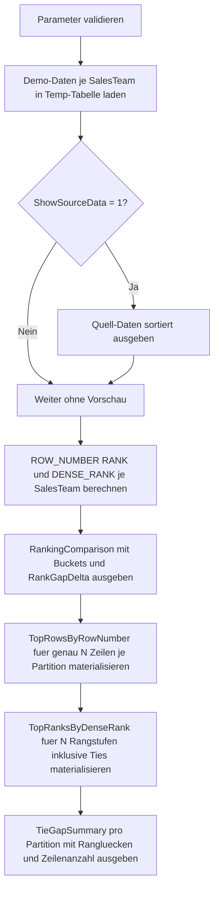

# WindowDenseRankComparison.sql

Dieses Skript vergleicht `ROW_NUMBER()`, `RANK()` und `DENSE_RANK()` mit bewusst eingebauten Gleichstaenden pro Partition. Die Demo bleibt didaktisch und nutzt ausschliesslich Temp-Tabellen, damit Rangfolgen, Rangluecken und Top-N-Auswahlen ohne produktive Abhaengigkeiten nachvollziehbar bleiben.

## Uebersicht

<!-- SQLDOC:SUMMARY_TABLE:BEGIN -->
| Feld | Wert |
|---|---|
| Script | [WindowDenseRankComparison.sql](WindowDenseRankComparison.sql) |
| Version | `1.0` |
| Typ | `didactic-lab` |
| Kapitel | `11_WindowFunctions` |
| Sicherheit | `read-only-tempdb` |
| Zweck | Vergleicht `ROW_NUMBER()`, `RANK()` und `DENSE_RANK()` je Partition und zeigt den Effekt von Gleichstaenden. |
<!-- SQLDOC:SUMMARY_TABLE:END -->

## Einordnung

Die Umsetzung verwendet kleine Demo-Partitionen mit absichtlich gleichen Umsatzwerten innerhalb eines `SalesTeam`. Dadurch wird sichtbar, dass `ROW_NUMBER()` trotz Gleichstand immer eindeutige Zeilenpositionen vergibt, `RANK()` bei Gleichstaenden Rangluecken erzeugt und `DENSE_RANK()` diese Luecken verdichtet.

Fuer diese Erstversion gelten folgende Annahmen:

- Das Skript dient als Lernbeispiel fuer Kapitel `11_WindowFunctions`.
- `RevenueAmount` ist die fachliche Hauptmetrik fuer `RANK()` und `DENSE_RANK()`.
- `ClosedDeals` und `SalesRep` dienen nur dazu, `ROW_NUMBER()` deterministisch zu machen.
- Die Partitionen werden didaktisch ueber `SalesTeam` gebildet.

## Parameter

<!-- SQLDOC:PARAMETERS_TABLE:BEGIN -->
| Parameter | SQL-Typ | Pflicht | Beschreibung |
|---|---|---|---|
| `@HighlightTopCount` | `INT` | Ja | Anzahl der oberen Rangstufen, die in den Vergleichs- und Top-Resultsets markiert werden; zulaessig sind Werte von `1` bis `4`. |
| `@ShowSourceData` | `BIT` | Nein | Gibt bei `1` die Demo-Daten vor dem Ranking zusaetzlich aus. |
<!-- SQLDOC:PARAMETERS_TABLE:END -->

## Abhaengigkeiten

<!-- SQLDOC:DEPENDENCIES_LIST:BEGIN -->
- `tempdb` fuer temporaere Tabellen
- `ROW_NUMBER()`
- `RANK()`
- `DENSE_RANK()`
- Fensterpartitionierung mit `PARTITION BY ... ORDER BY ...`
<!-- SQLDOC:DEPENDENCIES_LIST:END -->

## Hinweise

- `ROW_NUMBER()` reagiert auf denselben Gleichstand anders als `RANK()` und `DENSE_RANK()`, weil die Reihenfolge ueber zusaetzliche Tiebreaker vollstaendig deterministisch gemacht wird.
- `RANK()` arbeitet hier nur mit `RevenueAmount`; dadurch entstehen nach Gleichstaenden bewusst Rangluecken.
- `DENSE_RANK()` nutzt dieselbe fachliche Sortierung, verdichtet aber die Rangstufen ohne Luecken.
- Die beiden Top-Resultsets zeigen den praxisnahen Unterschied zwischen "genau N Zeilen" und "N Rangstufen inklusive Ties".

## Versionshistorie

<!-- SQLDOC:VERSION_HISTORY_TABLE:BEGIN -->
| Version | Datum | User | Beschreibung |
|---|---|---|---|
| `1.0` | `2026-04-18` | `ER` | Erstversion des didaktischen Vergleichs von ROW_NUMBER, RANK und DENSE_RANK |
<!-- SQLDOC:VERSION_HISTORY_TABLE:END -->

## Ablauf

<!-- SQLDOC:MERMAID:BEGIN -->

<!-- SQLDOC:MERMAID:END -->

## SQL-Code

<!-- SQLDOC:SQL_CODE:BEGIN -->
```sql
/*
BEGIN:SQL-HEADER v1
---
sql_header: v1
script_name: "WindowDenseRankComparison.sql"
script_version: "1.0"
script_type: "didactic-lab"
chapter: "11_WindowFunctions"

purpose: >
  Vergleicht ROW_NUMBER(), RANK() und DENSE_RANK() anhand didaktischer
  Demo-Daten mit Gleichstaenden innerhalb mehrerer Partitionen. Das
  Skript zeigt, wie sich Ties auf Zeilennummern, Rangluecken und Top-N-
  Auswahlen auswirken.

parameters:
  - name: "@HighlightTopCount"
    sql_type: "INT"
    direction: "IN"
    required: true
    description: "Anzahl der oberen Rangstufen, die in den Vergleichs-Resultsets markiert werden"
  - name: "@ShowSourceData"
    sql_type: "BIT"
    direction: "IN"
    required: false
    description: "1 = die Demo-Daten vor dem Ranking zusaetzlich ausgeben"

result_sets:
  - name: "SourcePreview"
    description: "Optionale Vorschau auf die Demo-Daten pro SalesTeam"
  - name: "RankingComparison"
    description: "Vergleicht ROW_NUMBER, RANK und DENSE_RANK fuer jede Zeile je Partition"
  - name: "TopRowsByRowNumber"
    description: "Strikte Top-Zeilen je Partition auf Basis von ROW_NUMBER"
  - name: "TopRanksByDenseRank"
    description: "Top-Rangstufen je Partition inklusive Gleichstaenden auf Basis von DENSE_RANK"
  - name: "TieGapSummary"
    description: "Zeigt pro Partition den Effekt von Ties auf Rangluecken und Zeilenanzahl"

dependencies:
  - "tempdb temporary tables"
  - "ROW_NUMBER()"
  - "RANK()"
  - "DENSE_RANK()"
  - "window partitioning with ORDER BY"

safety:
  level: "read-only-tempdb"
  writes_data: false

documentation:
  markdown_file: "T-SQL/11_WindowFunctions/SQLScripts/WindowDenseRankComparison.md"
  sync_blocks:
    - "SUMMARY_TABLE"
    - "PARAMETERS_TABLE"
    - "DEPENDENCIES_LIST"
    - "VERSION_HISTORY_TABLE"
    - "SQL_CODE"
  mermaid:
    mode: "ai-agent-from-sql"
    source: "script-body"

main_responsible:
  name: "Erhard Rainer"
  initials: "ER"

version_history:
  - version: "1.0"
    date: "2026-04-18"
    user: "ER"
    description: "Erstversion des didaktischen Vergleichs von ROW_NUMBER, RANK und DENSE_RANK"

notes:
  - "Die Demo nutzt Temp-Tabellen statt produktiver Vertriebsdaten"
  - "RANK und DENSE_RANK arbeiten bewusst nur mit RevenueAmount, damit Rangluecken durch Gleichstaende sichtbar bleiben"
---
END:SQL-HEADER v1
*/

SET NOCOUNT ON;

DECLARE @HighlightTopCount INT = 2;
DECLARE @ShowSourceData    BIT = 1;

IF @HighlightTopCount IS NULL OR @HighlightTopCount < 1 OR @HighlightTopCount > 4
BEGIN
    THROW 50000, '@HighlightTopCount muss zwischen 1 und 4 liegen.', 1;
END;

IF @ShowSourceData NOT IN (0, 1)
BEGIN
    THROW 50000, '@ShowSourceData muss als BIT-Wert 0 oder 1 gesetzt sein.', 1;
END;

DROP TABLE IF EXISTS #SalesRankingDemo;
DROP TABLE IF EXISTS #RankingComparison;
DROP TABLE IF EXISTS #TopRowsByRowNumber;
DROP TABLE IF EXISTS #TopRanksByDenseRank;

CREATE TABLE #SalesRankingDemo
(
    SalesTeam       VARCHAR(20)   NOT NULL,
    FiscalMonth     DATE          NOT NULL,
    SalesRep        VARCHAR(40)   NOT NULL,
    RevenueAmount   DECIMAL(12,2) NOT NULL,
    ClosedDeals     INT           NOT NULL,
    CustomerScore   DECIMAL(4,1)  NOT NULL,
    PRIMARY KEY (SalesTeam, FiscalMonth, SalesRep)
);

INSERT INTO #SalesRankingDemo
(
    SalesTeam,
    FiscalMonth,
    SalesRep,
    RevenueAmount,
    ClosedDeals,
    CustomerScore
)
VALUES
    ('Enterprise', '2026-03-01', 'Ava',  185000.00, 14, 9.4),
    ('Enterprise', '2026-03-01', 'Ben',  185000.00, 13, 9.1),
    ('Enterprise', '2026-03-01', 'Cara', 176500.00, 12, 9.6),
    ('Enterprise', '2026-03-01', 'Dino', 168000.00, 15, 8.9),
    ('SMB',        '2026-03-01', 'Emma',  94200.00, 22, 8.8),
    ('SMB',        '2026-03-01', 'Finn',  91800.00, 24, 9.0),
    ('SMB',        '2026-03-01', 'Gina',  91800.00, 21, 8.7),
    ('SMB',        '2026-03-01', 'Hugo',  87750.00, 20, 8.9),
    ('Public',     '2026-03-01', 'Iris', 121500.00, 11, 9.3),
    ('Public',     '2026-03-01', 'Jule', 121500.00, 10, 9.5),
    ('Public',     '2026-03-01', 'Kian', 115200.00, 12, 8.8),
    ('Public',     '2026-03-01', 'Lina', 115200.00,  9, 9.1);

IF @ShowSourceData = 1
BEGIN
    SELECT
        srd.SalesTeam,
        srd.FiscalMonth,
        srd.SalesRep,
        srd.RevenueAmount,
        srd.ClosedDeals,
        srd.CustomerScore
    FROM #SalesRankingDemo AS srd
    ORDER BY
        srd.SalesTeam,
        srd.RevenueAmount DESC,
        srd.ClosedDeals DESC,
        srd.SalesRep;
END;

SELECT
    srd.SalesTeam,
    srd.FiscalMonth,
    srd.SalesRep,
    srd.RevenueAmount,
    srd.ClosedDeals,
    srd.CustomerScore,
    ROW_NUMBER() OVER
    (
        PARTITION BY srd.SalesTeam
        ORDER BY
            srd.RevenueAmount DESC,
            srd.ClosedDeals DESC,
            srd.SalesRep ASC
    ) AS RowNumberRank,
    RANK() OVER
    (
        PARTITION BY srd.SalesTeam
        ORDER BY srd.RevenueAmount DESC
    ) AS RevenueRank,
    DENSE_RANK() OVER
    (
        PARTITION BY srd.SalesTeam
        ORDER BY srd.RevenueAmount DESC
    ) AS DenseRevenueRank
INTO #RankingComparison
FROM #SalesRankingDemo AS srd;

SELECT
    rc.SalesTeam,
    rc.SalesRep,
    rc.RevenueAmount,
    rc.ClosedDeals,
    rc.CustomerScore,
    rc.RowNumberRank,
    rc.RevenueRank,
    rc.DenseRevenueRank,
    CASE
        WHEN rc.RowNumberRank <= @HighlightTopCount THEN 'inside_row_number_cutoff'
        ELSE 'outside_row_number_cutoff'
    END AS RowNumberBucket,
    CASE
        WHEN rc.DenseRevenueRank <= @HighlightTopCount THEN 'inside_dense_rank_cutoff'
        ELSE 'outside_dense_rank_cutoff'
    END AS DenseRankBucket,
    rc.RevenueRank - rc.DenseRevenueRank AS RankGapDelta
FROM #RankingComparison AS rc
ORDER BY
    rc.SalesTeam,
    rc.RowNumberRank;

SELECT
    rc.SalesTeam,
    rc.SalesRep,
    rc.RevenueAmount,
    rc.ClosedDeals,
    rc.RowNumberRank
INTO #TopRowsByRowNumber
FROM #RankingComparison AS rc
WHERE rc.RowNumberRank <= @HighlightTopCount;

SELECT
    trn.SalesTeam,
    trn.SalesRep,
    trn.RevenueAmount,
    trn.ClosedDeals,
    trn.RowNumberRank
FROM #TopRowsByRowNumber AS trn
ORDER BY
    trn.SalesTeam,
    trn.RowNumberRank;

SELECT
    rc.SalesTeam,
    rc.SalesRep,
    rc.RevenueAmount,
    rc.ClosedDeals,
    rc.DenseRevenueRank
INTO #TopRanksByDenseRank
FROM #RankingComparison AS rc
WHERE rc.DenseRevenueRank <= @HighlightTopCount;

SELECT
    tdr.SalesTeam,
    tdr.SalesRep,
    tdr.RevenueAmount,
    tdr.ClosedDeals,
    tdr.DenseRevenueRank
FROM #TopRanksByDenseRank AS tdr
ORDER BY
    tdr.SalesTeam,
    tdr.DenseRevenueRank,
    tdr.ClosedDeals DESC,
    tdr.SalesRep;

SELECT
    rc.SalesTeam,
    COUNT(*) AS PartitionRowCount,
    COUNT(DISTINCT rc.RevenueAmount) AS DistinctRevenueLevels,
    MAX(rc.RowNumberRank) AS MaxRowNumberRank,
    MAX(rc.RevenueRank) AS MaxRevenueRank,
    MAX(rc.DenseRevenueRank) AS MaxDenseRevenueRank,
    SUM(CASE WHEN rc.RowNumberRank <= @HighlightTopCount THEN 1 ELSE 0 END) AS TopRowsByRowNumberCount,
    SUM(CASE WHEN rc.DenseRevenueRank <= @HighlightTopCount THEN 1 ELSE 0 END) AS TopRowsByDenseRankCount,
    MAX(rc.RevenueRank - rc.DenseRevenueRank) AS LargestObservedRankGap
FROM #RankingComparison AS rc
GROUP BY
    rc.SalesTeam
ORDER BY
    rc.SalesTeam;
```
<!-- SQLDOC:SQL_CODE:END -->
