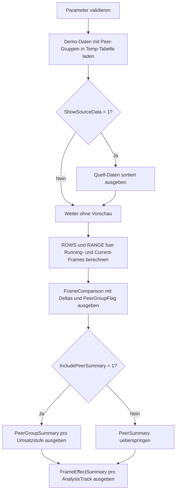

# WindowFrameComparison.sql

Dieses Skript vergleicht `ROWS` und `RANGE` in Fensterrahmen mit bewusst eingebauten Gleichstaenden im `ORDER BY`. Die Demo bleibt didaktisch und arbeitet ausschliesslich in Temp-Tabellen, damit sichtbar wird, wann SQL Server nur die aktuelle Zeile betrachtet und wann bei `RANGE` die ganze Peer-Gruppe einbezogen wird.

## Uebersicht

<!-- SQLDOC:SUMMARY_TABLE:BEGIN -->
| Feld | Wert |
|---|---|
| Script | [WindowFrameComparison.sql](WindowFrameComparison.sql) |
| Version | `1.0` |
| Typ | `didactic-lab` |
| Kapitel | `11_WindowFunctions` |
| Sicherheit | `read-only-tempdb` |
| Zweck | Vergleicht zeilenorientierte `ROWS`-Frames mit peer-orientierten `RANGE`-Frames in SQL Server. |
<!-- SQLDOC:SUMMARY_TABLE:END -->

## Einordnung

Die Demo ordnet Umsatzwerte absichtlich mehrfach identisch an, damit `RANGE` denselben `ORDER BY`-Wert als Peer-Gruppe behandelt. So wird direkt sichtbar, dass sich kumulative Summen und die Groesse des aktuellen Frames zwischen `ROWS` und `RANGE` unterscheiden koennen, obwohl beide ueber dieselbe Partition laufen.

Fuer diese Erstversion gelten folgende Annahmen:

- Das Skript dient als Lernbeispiel fuer Kapitel `11_WindowFunctions`.
- `RevenueAmount` ist bewusst der einzige `ORDER BY`-Wert fuer die Fensterrahmen, damit Peer-Gruppen klar erkennbar bleiben.
- `LoadSequence` sorgt nur fuer eine stabile Anzeige-Reihenfolge im Ergebnis, nicht fuer die Frame-Definition.
- Gezeigt werden nur solche `RANGE`-Varianten, die in SQL Server didaktisch verlässlich unterstuetzt sind.

## Parameter

<!-- SQLDOC:PARAMETERS_TABLE:BEGIN -->
| Parameter | SQL-Typ | Pflicht | Beschreibung |
|---|---|---|---|
| `@ShowSourceData` | `BIT` | Nein | Gibt bei `1` die Demo-Daten vor dem Frame-Vergleich zusaetzlich aus. |
| `@IncludePeerSummary` | `BIT` | Nein | Gibt bei `1` eine verdichtete Peer-Group-Zusammenfassung zusaetzlich aus. |
<!-- SQLDOC:PARAMETERS_TABLE:END -->

## Abhaengigkeiten

<!-- SQLDOC:DEPENDENCIES_LIST:BEGIN -->
- `tempdb` fuer temporaere Tabellen
- `SUM() OVER`
- `COUNT() OVER`
- `ROWS BETWEEN`
- `RANGE BETWEEN`
<!-- SQLDOC:DEPENDENCIES_LIST:END -->

## Hinweise

- `ROWS BETWEEN UNBOUNDED PRECEDING AND CURRENT ROW` zaehlt die Zeilen strikt in der laufenden Reihenfolge mit.
- `RANGE BETWEEN UNBOUNDED PRECEDING AND CURRENT ROW` springt bei Gleichstaenden auf die komplette Peer-Gruppe und liefert deshalb innerhalb derselben Wertestufe denselben laufenden Summenstand.
- `ROWS BETWEEN CURRENT ROW AND CURRENT ROW` umfasst genau eine Zeile; `RANGE BETWEEN CURRENT ROW AND CURRENT ROW` umfasst dagegen alle Zeilen mit demselben `ORDER BY`-Wert.
- Die Peer-Group-Zusammenfassung eignet sich, um die Unterschiede fuer identische Umsatzstufen kompakt nachzulesen.

## Versionshistorie

<!-- SQLDOC:VERSION_HISTORY_TABLE:BEGIN -->
| Version | Datum | User | Beschreibung |
|---|---|---|---|
| `1.0` | `2026-04-18` | `ER` | Erstversion des didaktischen Vergleichs von `ROWS` und `RANGE` in Fensterrahmen |
<!-- SQLDOC:VERSION_HISTORY_TABLE:END -->

## Ablauf

<!-- SQLDOC:MERMAID:BEGIN -->

<!-- SQLDOC:MERMAID:END -->

## SQL-Code

<!-- SQLDOC:SQL_CODE:BEGIN -->
```sql
/*
BEGIN:SQL-HEADER v1
---
sql_header: v1
script_name: "WindowFrameComparison.sql"
script_version: "1.0"
script_type: "didactic-lab"
chapter: "11_WindowFunctions"

purpose: >
  Vergleicht ROWS- und RANGE-Fensterrahmen anhand kleiner Demo-Daten mit
  Gleichstaenden im ORDER BY. Das Skript zeigt, wie RANGE in SQL Server
  Peer-Gruppen zusammenfasst, waehrend ROWS strikt zeilenorientiert
  arbeitet.

parameters:
  - name: "@ShowSourceData"
    sql_type: "BIT"
    direction: "IN"
    required: false
    description: "1 = die Demo-Daten vor dem Frame-Vergleich zusaetzlich ausgeben"
  - name: "@IncludePeerSummary"
    sql_type: "BIT"
    direction: "IN"
    required: false
    description: "1 = eine verdichtete Peer-Group-Zusammenfassung zusaetzlich ausgeben"

result_sets:
  - name: "SourcePreview"
    description: "Optionale Vorschau auf die Demo-Daten je AnalysisTrack"
  - name: "FrameComparison"
    description: "Vergleicht kumulative und aktuelle Frames fuer ROWS und RANGE je Zeile"
  - name: "PeerGroupSummary"
    description: "Verdichtet die Auswirkungen von Peer-Gruppen auf RANGE gegenueber ROWS"
  - name: "FrameEffectSummary"
    description: "Fasst pro AnalysisTrack die beobachteten Frame-Effekte zusammen"

dependencies:
  - "tempdb temporary tables"
  - "SUM() OVER"
  - "COUNT() OVER"
  - "ROWS BETWEEN"
  - "RANGE BETWEEN"

safety:
  level: "read-only-tempdb"
  writes_data: false

documentation:
  markdown_file: "T-SQL/11_WindowFunctions/SQLScripts/WindowFrameComparison.md"
  sync_blocks:
    - "SUMMARY_TABLE"
    - "PARAMETERS_TABLE"
    - "DEPENDENCIES_LIST"
    - "VERSION_HISTORY_TABLE"
    - "SQL_CODE"
  mermaid:
    mode: "ai-agent-from-sql"
    source: "script-body"

main_responsible:
  name: "Erhard Rainer"
  initials: "ER"

version_history:
  - version: "1.0"
    date: "2026-04-18"
    user: "ER"
    description: "Erstversion des didaktischen Vergleichs von ROWS und RANGE in Fensterrahmen"

notes:
  - "Die Demo nutzt Temp-Tabellen statt produktiver Faktentabellen"
  - "RANGE wird bewusst nur in SQL Server unterstuetzten Peer- und Running-Frame-Varianten gezeigt"
---
END:SQL-HEADER v1
*/

SET NOCOUNT ON;

DECLARE @ShowSourceData     BIT = 1;
DECLARE @IncludePeerSummary BIT = 1;

IF @ShowSourceData NOT IN (0, 1)
BEGIN
    THROW 50000, '@ShowSourceData muss als BIT-Wert 0 oder 1 gesetzt sein.', 1;
END;

IF @IncludePeerSummary NOT IN (0, 1)
BEGIN
    THROW 50000, '@IncludePeerSummary muss als BIT-Wert 0 oder 1 gesetzt sein.', 1;
END;

DROP TABLE IF EXISTS #FrameDemo;
DROP TABLE IF EXISTS #FrameComparison;

CREATE TABLE #FrameDemo
(
    AnalysisTrack   VARCHAR(20)   NOT NULL,
    LoadSequence    INT           NOT NULL,
    ScenarioLabel   VARCHAR(40)   NOT NULL,
    RevenueAmount   DECIMAL(10,2) NOT NULL,
    TicketCount     INT           NOT NULL,
    QualityScore    DECIMAL(4,1)  NOT NULL,
    PRIMARY KEY (AnalysisTrack, LoadSequence)
);

INSERT INTO #FrameDemo
(
    AnalysisTrack,
    LoadSequence,
    ScenarioLabel,
    RevenueAmount,
    TicketCount,
    QualityScore
)
VALUES
    ('Retail',    1, 'R-Alpha',   120.00, 4, 8.6),
    ('Retail',    2, 'R-Bravo',   120.00, 5, 8.8),
    ('Retail',    3, 'R-Charlie', 180.00, 6, 9.1),
    ('Retail',    4, 'R-Delta',   220.00, 7, 9.0),
    ('Retail',    5, 'R-Echo',    220.00, 8, 8.9),
    ('Retail',    6, 'R-Foxtrot', 260.00, 6, 9.3),
    ('Wholesale', 1, 'W-Alpha',   150.00, 3, 8.2),
    ('Wholesale', 2, 'W-Bravo',   210.00, 4, 8.5),
    ('Wholesale', 3, 'W-Charlie', 210.00, 5, 8.7),
    ('Wholesale', 4, 'W-Delta',   210.00, 6, 8.9),
    ('Wholesale', 5, 'W-Echo',    310.00, 7, 9.0),
    ('Wholesale', 6, 'W-Foxtrot', 360.00, 8, 9.4);

IF @ShowSourceData = 1
BEGIN
    SELECT
        fd.AnalysisTrack,
        fd.LoadSequence,
        fd.ScenarioLabel,
        fd.RevenueAmount,
        fd.TicketCount,
        fd.QualityScore
    FROM #FrameDemo AS fd
    ORDER BY
        fd.AnalysisTrack,
        fd.RevenueAmount,
        fd.LoadSequence;
END;

SELECT
    fd.AnalysisTrack,
    fd.LoadSequence,
    fd.ScenarioLabel,
    fd.RevenueAmount,
    fd.TicketCount,
    fd.QualityScore,
    SUM(fd.RevenueAmount) OVER
    (
        PARTITION BY fd.AnalysisTrack
        ORDER BY fd.RevenueAmount
        ROWS BETWEEN UNBOUNDED PRECEDING AND CURRENT ROW
    ) AS RunningRevenueRows,
    SUM(fd.RevenueAmount) OVER
    (
        PARTITION BY fd.AnalysisTrack
        ORDER BY fd.RevenueAmount
        RANGE BETWEEN UNBOUNDED PRECEDING AND CURRENT ROW
    ) AS RunningRevenueRange,
    COUNT(*) OVER
    (
        PARTITION BY fd.AnalysisTrack
        ORDER BY fd.RevenueAmount
        ROWS BETWEEN UNBOUNDED PRECEDING AND CURRENT ROW
    ) AS RunningCountRows,
    COUNT(*) OVER
    (
        PARTITION BY fd.AnalysisTrack
        ORDER BY fd.RevenueAmount
        RANGE BETWEEN UNBOUNDED PRECEDING AND CURRENT ROW
    ) AS RunningCountRange,
    SUM(fd.RevenueAmount) OVER
    (
        PARTITION BY fd.AnalysisTrack
        ORDER BY fd.RevenueAmount
        ROWS BETWEEN CURRENT ROW AND CURRENT ROW
    ) AS CurrentRowRevenueRows,
    SUM(fd.RevenueAmount) OVER
    (
        PARTITION BY fd.AnalysisTrack
        ORDER BY fd.RevenueAmount
        RANGE BETWEEN CURRENT ROW AND CURRENT ROW
    ) AS CurrentPeerRevenueRange,
    COUNT(*) OVER
    (
        PARTITION BY fd.AnalysisTrack
        ORDER BY fd.RevenueAmount
        RANGE BETWEEN CURRENT ROW AND CURRENT ROW
    ) AS CurrentPeerCountRange
INTO #FrameComparison
FROM #FrameDemo AS fd;

SELECT
    fc.AnalysisTrack,
    fc.LoadSequence,
    fc.ScenarioLabel,
    fc.RevenueAmount,
    fc.TicketCount,
    fc.QualityScore,
    fc.RunningRevenueRows,
    fc.RunningRevenueRange,
    fc.RunningRevenueRange - fc.RunningRevenueRows AS RunningRevenueDelta,
    fc.RunningCountRows,
    fc.RunningCountRange,
    fc.RunningCountRange - fc.RunningCountRows AS RunningCountDelta,
    fc.CurrentRowRevenueRows,
    fc.CurrentPeerRevenueRange,
    fc.CurrentPeerRevenueRange - fc.CurrentRowRevenueRows AS CurrentPeerRevenueDelta,
    fc.CurrentPeerCountRange,
    CASE
        WHEN fc.CurrentPeerCountRange > 1 THEN 'peer_group_detected'
        ELSE 'single_row_value'
    END AS PeerGroupFlag
FROM #FrameComparison AS fc
ORDER BY
    fc.AnalysisTrack,
    fc.RevenueAmount,
    fc.LoadSequence;

IF @IncludePeerSummary = 1
BEGIN
    SELECT
        fc.AnalysisTrack,
        fc.RevenueAmount,
        COUNT(*) AS PeerRowCount,
        MIN(fc.LoadSequence) AS FirstLoadSequence,
        MAX(fc.LoadSequence) AS LastLoadSequence,
        MIN(fc.RunningRevenueRows) AS FirstRowsRunningRevenue,
        MAX(fc.RunningRevenueRows) AS LastRowsRunningRevenue,
        MIN(fc.RunningRevenueRange) AS SharedRangeRunningRevenue,
        MIN(fc.CurrentPeerRevenueRange) AS SharedPeerRevenue,
        MIN(fc.CurrentPeerCountRange) AS SharedPeerCount
    FROM #FrameComparison AS fc
    GROUP BY
        fc.AnalysisTrack,
        fc.RevenueAmount
    ORDER BY
        fc.AnalysisTrack,
        fc.RevenueAmount;
END;

SELECT
    fc.AnalysisTrack,
    COUNT(*) AS RowCountPerTrack,
    COUNT(DISTINCT fc.RevenueAmount) AS DistinctRevenueLevels,
    SUM(CASE WHEN fc.CurrentPeerCountRange > 1 THEN 1 ELSE 0 END) AS RowsInsidePeerGroups,
    MAX(fc.RunningRevenueRange - fc.RunningRevenueRows) AS LargestRunningRevenueDelta,
    MAX(fc.RunningCountRange - fc.RunningCountRows) AS LargestRunningCountDelta,
    MAX(fc.CurrentPeerRevenueRange - fc.CurrentRowRevenueRows) AS LargestCurrentPeerRevenueDelta
FROM #FrameComparison AS fc
GROUP BY
    fc.AnalysisTrack
ORDER BY
    fc.AnalysisTrack;
```
<!-- SQLDOC:SQL_CODE:END -->
