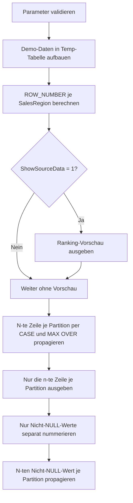

# WindowNthValueLab.sql

Dieses Beispiel zeigt, wie `NTH_VALUE`-aehnliche Auswertungen in T-SQL aufgebaut werden koennen, obwohl die Funktion nicht direkt zur Verfuegung steht. Das Skript ist als didaktisches Labor angelegt und arbeitet ausschliesslich mit Demo-Daten in Temp-Tabellen.

## Uebersicht

<!-- SQLDOC:SUMMARY_TABLE:BEGIN -->
| Feld | Wert |
|---|---|
| Script | `WindowNthValueLab.sql` |
| Version | `1.0` |
| Typ | `didactic-lab` |
| Kapitel | `11_WindowFunctions` |
| Sicherheit | `read-only-tempdb` |
| Zweck | Demonstriert n-te-Zeile- und n-ter-Wert-Muster je Partition in T-SQL. |
<!-- SQLDOC:SUMMARY_TABLE:END -->

## Einordnung

Die Kurzbeschreibung aus der Scriptliste ist fuer ein erstes Geruest ausreichend, wenn das Ziel ein didaktisches Beispiel ist. Fuer ein produktionsnahes Fachskript waeren zusaetzlich noch Datenquelle, fachliche Semantik, Zielobjekte und erwartete Randfaelle noetig.

In dieser Testumsetzung wurden deshalb folgende Annahmen getroffen:

- Das Skript ist ein Lern- und Demo-Skript fuer Kapitel `11_WindowFunctions`.
- Der Fokus liegt auf `NTH_VALUE`-aehnlichen Mustern, nicht auf produktiver Tabellenlogik.
- Es werden Demo-Daten im Skript selbst erzeugt.
- Die Ordnung innerhalb jeder Partition ist deterministisch ueber `OrderDate, OrderID`.

## Parameter

<!-- SQLDOC:PARAMETERS_TABLE:BEGIN -->
| Parameter | SQL-Typ | Pflicht | Beschreibung |
|---|---|---|---|
| `@NthPosition` | `INT` | Ja | 1-basierte Zielposition innerhalb jeder Partition. |
| `@ShowSourceData` | `BIT` | Nein | Gibt bei `1` eine zusaetzliche Vorschau der gerankten Demo-Daten aus. |
<!-- SQLDOC:PARAMETERS_TABLE:END -->

## Abhaengigkeiten

<!-- SQLDOC:DEPENDENCIES_LIST:BEGIN -->
- `tempdb` fuer temporaere Tabellen
- `ROW_NUMBER()`
- `MAX() OVER(PARTITION BY ...)`
<!-- SQLDOC:DEPENDENCIES_LIST:END -->

## Hinweise

- Das Skript zeigt bewusst drei verschiedene Blickwinkel auf das Thema:
  - n-te Zeile je Partition
  - Wert der n-ten Zeile fuer alle Zeilen der Partition
  - n-ter Nicht-NULL-Wert je Partition
- Wenn eine Partition weniger als `@NthPosition` Zeilen besitzt, liefert das propagierte Ergebnis `NULL`.
- Fuer reproduzierbare Ergebnisse braucht jedes Fenster ein eindeutiges `ORDER BY`.

## Versionshistorie

<!-- SQLDOC:VERSION_HISTORY_TABLE:BEGIN -->
| Version | Datum | User | Beschreibung |
|---|---|---|---|
| `1.0` | `2026-04-16` | `ER` | Erstversion des didaktischen NTH_VALUE-Labs fuer Kapitel Window Functions |
<!-- SQLDOC:VERSION_HISTORY_TABLE:END -->

## Ablauf

<!-- SQLDOC:MERMAID:BEGIN -->

<!-- SQLDOC:MERMAID:END -->

## SQL-Code

<!-- SQLDOC:SQL_CODE:BEGIN -->
```sql
/*
BEGIN:SQL-HEADER v1
---
sql_header: v1
script_name: "WindowNthValueLab.sql"
script_version: "1.0"
script_type: "didactic-lab"
chapter: "11_WindowFunctions"

purpose: >
  Demonstriert NTH_VALUE-aehnliche Muster in T-SQL. Das Skript zeigt,
  wie die n-te Zeile einer Partition bestimmt, wie ihr Wert auf alle
  Zeilen der Partition propagiert und wie ein n-ter Nicht-NULL-Wert
  gesondert behandelt werden kann.

parameters:
  - name: "@NthPosition"
    sql_type: "INT"
    direction: "IN"
    required: true
    description: "1-basierte Zielposition innerhalb jeder Partition"
  - name: "@ShowSourceData"
    sql_type: "BIT"
    direction: "IN"
    required: false
    description: "1 = zusaetzliche Vorschau der gerankten Demo-Daten ausgeben"

result_sets:
  - name: "BaseRankingPreview"
    description: "Optionale Vorschau der Demo-Daten mit Partition und Row Number"
  - name: "NthValueEmulation_AllRows"
    description: "Propagiert den Wert der n-ten Zeile je Partition auf alle Zeilen"
  - name: "NthRowOnly_PerPartition"
    description: "Liefert nur die n-te Zeile je Partition"
  - name: "NthNonNullValue_AllRows"
    description: "Propagiert den n-ten Nicht-NULL-Wert je Partition auf alle Zeilen"

dependencies:
  - "tempdb temporary tables"
  - "ROW_NUMBER()"
  - "MAX() OVER(PARTITION BY ...)"

safety:
  level: "read-only-tempdb"
  writes_data: false

documentation:
  markdown_file: "T-SQL/11_WindowFunctions/SQLScripts/WindowNthValueLab.md"
  sync_blocks:
    - "SUMMARY_TABLE"
    - "PARAMETERS_TABLE"
    - "DEPENDENCIES_LIST"
    - "VERSION_HISTORY_TABLE"
    - "SQL_CODE"
  mermaid:
    mode: "ai-agent-from-sql"
    source: "script-body"

main_responsible:
  name: "Erhard Rainer"
  initials: "ER"

version_history:
  - version: "1.0"
    date: "2026-04-16"
    user: "ER"
    description: "Erstversion des didaktischen NTH_VALUE-Labs fuer Kapitel Window Functions"

notes:
  - "T-SQL unterstuetzt NTH_VALUE nicht direkt, daher werden Ersatzmuster gezeigt"
  - "Die Ordnung innerhalb jeder Partition wird deterministisch ueber OrderDate und OrderID festgelegt"
---
END:SQL-HEADER v1
*/

SET NOCOUNT ON;

DECLARE @NthPosition   INT = 3;
DECLARE @ShowSourceData BIT = 1;

IF @NthPosition IS NULL OR @NthPosition < 1
BEGIN
    THROW 50000, '@NthPosition muss groesser oder gleich 1 sein.', 1;
END;

DROP TABLE IF EXISTS #WindowNthValueDemo;
DROP TABLE IF EXISTS #Ranked;
DROP TABLE IF EXISTS #RankedNonNull;
DROP TABLE IF EXISTS #NthNonNullPerRegion;

CREATE TABLE #WindowNthValueDemo
(
    SalesRegion VARCHAR(20) NOT NULL,
    OrderDate   DATE        NOT NULL,
    OrderID     INT         NOT NULL,
    SalesPerson VARCHAR(50) NOT NULL,
    SalesAmount DECIMAL(12,2) NULL
);

INSERT INTO #WindowNthValueDemo
(
    SalesRegion,
    OrderDate,
    OrderID,
    SalesPerson,
    SalesAmount
)
VALUES
    ('North', '2026-01-03', 101, 'Ava',   1200.00),
    ('North', '2026-01-08', 102, 'Ben',    980.00),
    ('North', '2026-01-15', 103, 'Cara',  1575.00),
    ('North', '2026-01-21', 104, 'Dylan',    NULL),
    ('North', '2026-01-28', 105, 'Elli',  1430.00),

    ('South', '2026-01-04', 201, 'Finn',   840.00),
    ('South', '2026-01-09', 202, 'Gina',     NULL),
    ('South', '2026-01-12', 203, 'Hugo',  1120.00),
    ('South', '2026-01-25', 204, 'Iris',  1340.00),

    ('West',  '2026-01-05', 301, 'Jade',   910.00),
    ('West',  '2026-01-17', 302, 'Kian',  1015.00);

SELECT
    d.SalesRegion,
    d.OrderDate,
    d.OrderID,
    d.SalesPerson,
    d.SalesAmount,
    ROW_NUMBER() OVER
    (
        PARTITION BY d.SalesRegion
        ORDER BY d.OrderDate, d.OrderID
    ) AS PartitionRowNumber
INTO #Ranked
FROM #WindowNthValueDemo AS d;

IF @ShowSourceData = 1
BEGIN
    SELECT
        r.SalesRegion,
        r.OrderDate,
        r.OrderID,
        r.SalesPerson,
        r.SalesAmount,
        r.PartitionRowNumber
    FROM #Ranked AS r
    ORDER BY
        r.SalesRegion,
        r.PartitionRowNumber;
END;

SELECT
    r.SalesRegion,
    r.PartitionRowNumber,
    r.OrderDate,
    r.OrderID,
    r.SalesPerson,
    r.SalesAmount,
    MAX(CASE WHEN r.PartitionRowNumber = @NthPosition THEN r.SalesPerson END)
        OVER (PARTITION BY r.SalesRegion) AS NthSalesPersonInPartition,
    MAX(CASE WHEN r.PartitionRowNumber = @NthPosition THEN r.SalesAmount END)
        OVER (PARTITION BY r.SalesRegion) AS NthSalesAmountInPartition
FROM #Ranked AS r
ORDER BY
    r.SalesRegion,
    r.PartitionRowNumber;

SELECT
    r.SalesRegion,
    r.OrderDate,
    r.OrderID,
    r.SalesPerson,
    r.SalesAmount,
    r.PartitionRowNumber AS NthPositionFound
FROM #Ranked AS r
WHERE r.PartitionRowNumber = @NthPosition
ORDER BY
    r.SalesRegion;

SELECT
    d.SalesRegion,
    d.OrderDate,
    d.OrderID,
    d.SalesPerson,
    d.SalesAmount,
    ROW_NUMBER() OVER
    (
        PARTITION BY d.SalesRegion
        ORDER BY d.OrderDate, d.OrderID
    ) AS NonNullRowNumber
INTO #RankedNonNull
FROM #WindowNthValueDemo AS d
WHERE d.SalesAmount IS NOT NULL;

SELECT
    nn.SalesRegion,
    MAX(CASE WHEN nn.NonNullRowNumber = @NthPosition THEN nn.SalesAmount END) AS NthNonNullSalesAmountInPartition
INTO #NthNonNullPerRegion
FROM #RankedNonNull AS nn
GROUP BY
    nn.SalesRegion;

SELECT
    r.SalesRegion,
    r.PartitionRowNumber,
    r.OrderDate,
    r.OrderID,
    r.SalesPerson,
    r.SalesAmount,
    nnn.NthNonNullSalesAmountInPartition
FROM #Ranked AS r
LEFT JOIN #NthNonNullPerRegion AS nnn
    ON nnn.SalesRegion = r.SalesRegion
ORDER BY
    r.SalesRegion,
    r.PartitionRowNumber;
```
<!-- SQLDOC:SQL_CODE:END -->
