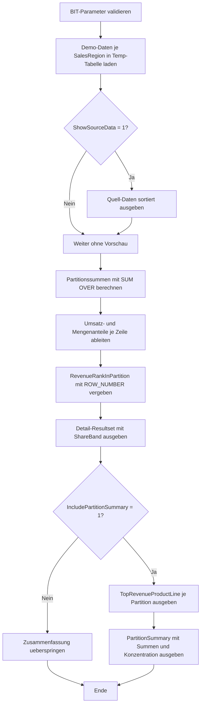

# WindowPartitionShareDemo.sql

Dieses didaktische Skript zeigt, wie eine einzelne Zeile relativ zu ihrer Partition eingeordnet werden kann. Die Demo berechnet dafuer Umsatz- und Mengenanteile pro `ProductLine` innerhalb einer `SalesRegion` und bleibt vollstaendig in Temp-Tabellen.

## Uebersicht

<!-- SQLDOC:SUMMARY_TABLE:BEGIN -->
| Feld | Wert |
|---|---|
| Script | [WindowPartitionShareDemo.sql](WindowPartitionShareDemo.sql) |
| Version | `1.0` |
| Typ | `didactic-lab` |
| Kapitel | `11_WindowFunctions` |
| Sicherheit | `read-only-tempdb` |
| Zweck | Zeigt Umsatz- und Mengenanteile jeder Zeile an ihrer eigenen Partition. |
<!-- SQLDOC:SUMMARY_TABLE:END -->

## Einordnung

Das Beispiel verwendet `SalesRegion` als Partition und `ProductLine` als erklaerende Zeilenebene. Dadurch laesst sich mit einem ueberschaubaren Datensatz direkt sehen, wie `SUM() OVER (PARTITION BY ...)` die Gesamtsumme je Partition bereitstellt und wie daraus relative Anteile pro Zeile entstehen.

Fuer diese Erstversion gelten folgende Annahmen:

- Das Skript ist ein Lern- und Demo-Skript fuer Kapitel `11_WindowFunctions`.
- Die Demo nutzt Temp-Tabellen statt produktiver Umsatzdaten.
- Jede Zeile repraesentiert eine verdichtete Produktlinie innerhalb einer Region und eines Monats.
- `RevenueRankInPartition` dient nur dazu, die groesste Umsatzzeile je Partition eindeutig hervorzuheben.

## Parameter

<!-- SQLDOC:PARAMETERS_TABLE:BEGIN -->
| Parameter | SQL-Typ | Pflicht | Beschreibung |
|---|---|---|---|
| `@ShowSourceData` | `BIT` | Nein | Gibt bei `1` die Demo-Daten vor der Anteilsberechnung zusaetzlich aus. |
| `@IncludePartitionSummary` | `BIT` | Nein | Gibt bei `1` je Partition eine kompakte Zusammenfassung und die Top-Zeile aus. |
<!-- SQLDOC:PARAMETERS_TABLE:END -->

## Abhaengigkeiten

<!-- SQLDOC:DEPENDENCIES_LIST:BEGIN -->
- `tempdb` fuer temporaere Tabellen
- `SUM() OVER`
- `ROW_NUMBER() OVER`
- `CAST()`
<!-- SQLDOC:DEPENDENCIES_LIST:END -->

## Hinweise

- Der Anteil einer Zeile an ihrer Partition wird durch `Zeilenwert / Partitionssumme` bestimmt.
- `NULLIF(..., 0)` schuetzt die Quotientenbildung gegen Division durch null.
- Das Skript zeigt zwei Kennzahlen parallel: Umsatzanteil und Mengenanteil.
- Die Einteilung in `dominant`, `material` und `long_tail` ist rein didaktisch und dient nur der leichteren Interpretation.

## Versionshistorie

<!-- SQLDOC:VERSION_HISTORY_TABLE:BEGIN -->
| Version | Datum | User | Beschreibung |
|---|---|---|---|
| `1.0` | `2026-04-18` | `ER` | Erstversion des didaktischen Labs fuer Zeilenanteile innerhalb einer Partition |
<!-- SQLDOC:VERSION_HISTORY_TABLE:END -->

## Ablauf

<!-- SQLDOC:MERMAID:BEGIN -->

<!-- SQLDOC:MERMAID:END -->

## SQL-Code

<!-- SQLDOC:SQL_CODE:BEGIN -->
```sql
/*
BEGIN:SQL-HEADER v1
---
sql_header: v1
script_name: "WindowPartitionShareDemo.sql"
script_version: "1.0"
script_type: "didactic-lab"
chapter: "11_WindowFunctions"

purpose: >
  Zeigt, wie der Anteil einer Zeile an ihrer Partition mit
  SUM() OVER(PARTITION BY ...) berechnet werden kann. Das Skript stellt
  sowohl Umsatz- als auch Mengenanteile pro Produktlinie innerhalb einer
  Vertriebsregion dar.

parameters:
  - name: "@ShowSourceData"
    sql_type: "BIT"
    direction: "IN"
    required: false
    description: "1 = die Demo-Daten vor der Anteilsberechnung zusaetzlich ausgeben"
  - name: "@IncludePartitionSummary"
    sql_type: "BIT"
    direction: "IN"
    required: false
    description: "1 = je Partition eine kompakte Zusammenfassung und Top-Zeile ausgeben"

result_sets:
  - name: "SourcePreview"
    description: "Optionale Vorschau der Demo-Daten pro SalesRegion"
  - name: "PartitionShareDetail"
    description: "Zeigt Umsatz- und Mengenanteile jeder Zeile innerhalb ihrer Partition"
  - name: "TopContributorPerPartition"
    description: "Hebt je SalesRegion die groesste Umsatzzeile hervor"
  - name: "PartitionSummary"
    description: "Verdichtet Partitionsgroesse, Summen und Konzentration pro SalesRegion"

dependencies:
  - "tempdb temporary tables"
  - "SUM() OVER"
  - "ROW_NUMBER() OVER"
  - "CAST()"

safety:
  level: "read-only-tempdb"
  writes_data: false

documentation:
  markdown_file: "T-SQL/11_WindowFunctions/SQLScripts/WindowPartitionShareDemo.md"
  sync_blocks:
    - "SUMMARY_TABLE"
    - "PARAMETERS_TABLE"
    - "DEPENDENCIES_LIST"
    - "VERSION_HISTORY_TABLE"
    - "SQL_CODE"
  mermaid:
    mode: "ai-agent-from-sql"
    source: "script-body"

main_responsible:
  name: "Erhard Rainer"
  initials: "ER"

version_history:
  - version: "1.0"
    date: "2026-04-18"
    user: "ER"
    description: "Erstversion des didaktischen Labs fuer Zeilenanteile innerhalb einer Partition"

notes:
  - "Die Demo arbeitet nur mit Temp-Tabellen und erzeugt keine persistenten Objekte"
  - "SalesRegion ist die Partition, ProductLine die erklaerende Zeilenebene"
---
END:SQL-HEADER v1
*/

SET NOCOUNT ON;

DECLARE @ShowSourceData          BIT = 1;
DECLARE @IncludePartitionSummary BIT = 1;

IF @ShowSourceData NOT IN (0, 1)
BEGIN
    THROW 50000, '@ShowSourceData muss als BIT-Wert 0 oder 1 gesetzt sein.', 1;
END;

IF @IncludePartitionSummary NOT IN (0, 1)
BEGIN
    THROW 50000, '@IncludePartitionSummary muss als BIT-Wert 0 oder 1 gesetzt sein.', 1;
END;

DROP TABLE IF EXISTS #PartitionShareDemo;
DROP TABLE IF EXISTS #PartitionShareResult;

CREATE TABLE #PartitionShareDemo
(
    SalesRegion   VARCHAR(20)   NOT NULL,
    BookingMonth  DATE          NOT NULL,
    ProductLine   VARCHAR(30)   NOT NULL,
    RevenueAmount DECIMAL(12,2) NOT NULL,
    UnitCount     INT           NOT NULL,
    TicketID      INT           NOT NULL,
    PRIMARY KEY (SalesRegion, TicketID)
);

INSERT INTO #PartitionShareDemo
(
    SalesRegion,
    BookingMonth,
    ProductLine,
    RevenueAmount,
    UnitCount,
    TicketID
)
VALUES
    ('North', '2026-01-01', 'Hardware',     4200.00, 14, 101),
    ('North', '2026-01-01', 'Software',     2750.00, 10, 102),
    ('North', '2026-01-01', 'Consulting',   1550.00,  4, 103),
    ('North', '2026-01-01', 'Training',      900.00,  6, 104),
    ('South', '2026-01-01', 'Hardware',     1800.00,  7, 201),
    ('South', '2026-01-01', 'Software',     2100.00,  9, 202),
    ('South', '2026-01-01', 'Consulting',   2600.00,  5, 203),
    ('South', '2026-01-01', 'Training',      500.00,  3, 204),
    ('West',  '2026-01-01', 'Hardware',     3100.00, 11, 301),
    ('West',  '2026-01-01', 'Software',      950.00,  4, 302),
    ('West',  '2026-01-01', 'Consulting',   1450.00,  3, 303),
    ('West',  '2026-01-01', 'Training',     1500.00,  8, 304);

IF @ShowSourceData = 1
BEGIN
    SELECT
        d.SalesRegion,
        d.BookingMonth,
        d.ProductLine,
        d.RevenueAmount,
        d.UnitCount,
        d.TicketID
    FROM #PartitionShareDemo AS d
    ORDER BY
        d.SalesRegion,
        d.RevenueAmount DESC,
        d.TicketID;
END;

SELECT
    d.SalesRegion,
    d.BookingMonth,
    d.ProductLine,
    d.TicketID,
    d.RevenueAmount,
    d.UnitCount,
    SUM(d.RevenueAmount) OVER (PARTITION BY d.SalesRegion) AS PartitionRevenueTotal,
    SUM(d.UnitCount) OVER (PARTITION BY d.SalesRegion) AS PartitionUnitTotal,
    CAST
    (
        d.RevenueAmount
        / NULLIF(SUM(d.RevenueAmount) OVER (PARTITION BY d.SalesRegion), 0.00)
        AS DECIMAL(9,4)
    ) AS RevenueShareOfPartition,
    CAST
    (
        CAST(d.UnitCount AS DECIMAL(12,4))
        / NULLIF(CAST(SUM(d.UnitCount) OVER (PARTITION BY d.SalesRegion) AS DECIMAL(12,4)), 0.0000)
        AS DECIMAL(9,4)
    ) AS UnitShareOfPartition,
    ROW_NUMBER() OVER
    (
        PARTITION BY d.SalesRegion
        ORDER BY d.RevenueAmount DESC, d.TicketID
    ) AS RevenueRankInPartition
INTO #PartitionShareResult
FROM #PartitionShareDemo AS d;

SELECT
    r.SalesRegion,
    r.BookingMonth,
    r.ProductLine,
    r.TicketID,
    r.RevenueAmount,
    r.PartitionRevenueTotal,
    r.RevenueShareOfPartition,
    r.UnitCount,
    r.PartitionUnitTotal,
    r.UnitShareOfPartition,
    r.RevenueRankInPartition,
    CASE
        WHEN r.RevenueShareOfPartition >= 0.40 THEN 'dominant'
        WHEN r.RevenueShareOfPartition >= 0.20 THEN 'material'
        ELSE 'long_tail'
    END AS ShareBand
FROM #PartitionShareResult AS r
ORDER BY
    r.SalesRegion,
    r.RevenueRankInPartition,
    r.TicketID;

IF @IncludePartitionSummary = 1
BEGIN
    SELECT
        r.SalesRegion,
        r.ProductLine AS TopRevenueProductLine,
        r.RevenueAmount AS TopRevenueAmount,
        r.RevenueShareOfPartition AS TopRevenueShare
    FROM #PartitionShareResult AS r
    WHERE r.RevenueRankInPartition = 1
    ORDER BY
        r.SalesRegion;

    SELECT
        r.SalesRegion,
        COUNT(*) AS RowCountPerPartition,
        MAX(r.PartitionRevenueTotal) AS PartitionRevenueTotal,
        MAX(r.PartitionUnitTotal) AS PartitionUnitTotal,
        MAX(r.RevenueShareOfPartition) AS LargestRevenueShare,
        MAX(r.UnitShareOfPartition) AS LargestUnitShare,
        SUM(CASE WHEN r.RevenueShareOfPartition >= 0.20 THEN 1 ELSE 0 END) AS RowsAtOrAboveTwentyPercent
    FROM #PartitionShareResult AS r
    GROUP BY
        r.SalesRegion
    ORDER BY
        r.SalesRegion;
END;
```
<!-- SQLDOC:SQL_CODE:END -->
