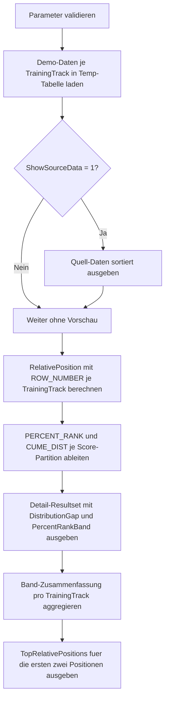

# WindowPercentRankExamples.sql

Dieses didaktische Skript zeigt `PERCENT_RANK()` als relative Position innerhalb einer Partition. Drei `TrainingTrack`-Gruppen werden mit kleinen Demo-Daten ausgewertet, sodass Prozent-Raenge, Rangreihenfolge und der Unterschied zu `CUME_DIST()` ohne produktive Abhaengigkeiten nachvollziehbar bleiben.

## Uebersicht

<!-- SQLDOC:SUMMARY_TABLE:BEGIN -->
| Feld | Wert |
|---|---|
| Script | [WindowPercentRankExamples.sql](WindowPercentRankExamples.sql) |
| Version | `1.0` |
| Typ | `didactic-lab` |
| Kapitel | `11_WindowFunctions` |
| Sicherheit | `read-only-tempdb` |
| Zweck | Zeigt `PERCENT_RANK()` und relative Positionierung je `TrainingTrack`. |
<!-- SQLDOC:SUMMARY_TABLE:END -->

## Einordnung

Die Demo partitioniert die Ergebnisse nach `TrainingTrack`, damit jede Kohorte ihren eigenen relativen Bezugsrahmen behaelt. `PERCENT_RANK()` wird aufsteigend ueber den Score berechnet und anschliessend gemeinsam mit einer absteigenden `ROW_NUMBER()`-Position ausgegeben, sodass fachliche Rangfolge und mathematischer Prozent-Rang nebeneinander lesbar sind.

Fuer diese Erstversion gelten folgende Annahmen:

- Das Skript ist ein Lernbeispiel fuer Kapitel `11_WindowFunctions`.
- Die Demo nutzt Temp-Tabellen statt produktiver Assessment- oder LMS-Daten.
- `AssessmentScore` ist die fachliche Hauptmetrik fuer die relative Position innerhalb einer Kohorte.
- `CompletedLabs` und `ParticipantName` sorgen nur fuer eine deterministische Detailsortierung.
- `CUME_DIST()` wird als Vergleichswert aufgenommen, um die Einordnung von Gleichstaenden besser sichtbar zu machen.

## Parameter

<!-- SQLDOC:PARAMETERS_TABLE:BEGIN -->
| Parameter | SQL-Typ | Pflicht | Beschreibung |
|---|---|---|---|
| `@ShowSourceData` | `BIT` | Nein | Gibt bei `1` die Demo-Daten vor der Fensterberechnung zusaetzlich aus. |
| `@HighPerformanceThreshold` | `DECIMAL(5,4)` | Ja | Schwellwert zwischen `0.5000` und `1.0000` fuer das Label `high_performance`. |
<!-- SQLDOC:PARAMETERS_TABLE:END -->

## Abhaengigkeiten

<!-- SQLDOC:DEPENDENCIES_LIST:BEGIN -->
- `tempdb` fuer temporaere Tabellen
- `PERCENT_RANK() OVER`
- `CUME_DIST() OVER`
- `ROW_NUMBER() OVER`
- `COUNT() OVER`
<!-- SQLDOC:DEPENDENCIES_LIST:END -->

## Hinweise

- `PERCENT_RANK()` liefert Werte von `0` bis `1` und verwendet die Formel `(Rang - 1) / (Anzahl Zeilen - 1)`.
- Bei Gleichstaenden kann `PERCENT_RANK()` denselben Wert fuer mehrere Zeilen liefern, waehrend `ROW_NUMBER()` weiterhin eine eindeutige Detailreihenfolge erzeugt.
- `CUME_DIST()` faellt hier bewusst als Vergleichsmetrik an, weil sie bei Ties typischerweise hoeher als `PERCENT_RANK()` endet.
- Die Bandlabels `starting_point`, `developing`, `upper_midfield` und `high_performance` sind didaktische Interpretationshilfen und keine produktive Bewertungssystematik.

## Versionshistorie

<!-- SQLDOC:VERSION_HISTORY_TABLE:BEGIN -->
| Version | Datum | User | Beschreibung |
|---|---|---|---|
| `1.0` | `2026-04-18` | `ER` | Erstversion des didaktischen Labs fuer PERCENT_RANK und relative Positionierung |
<!-- SQLDOC:VERSION_HISTORY_TABLE:END -->

## Ablauf

<!-- SQLDOC:MERMAID:BEGIN -->

<!-- SQLDOC:MERMAID:END -->

## SQL-Code

<!-- SQLDOC:SQL_CODE:BEGIN -->
```sql
/*
BEGIN:SQL-HEADER v1
---
sql_header: v1
script_name: "WindowPercentRankExamples.sql"
script_version: "1.0"
script_type: "didactic-lab"
chapter: "11_WindowFunctions"

purpose: >
  Zeigt PERCENT_RANK() als relative Position innerhalb einer Partition.
  Das Skript vergleicht mehrere Lernkohorten, berechnet Prozent-Raenge
  aus Assessment-Scores und ordnet die Ergebnisse in interpretierbare
  Performance-Baender ein.

parameters:
  - name: "@ShowSourceData"
    sql_type: "BIT"
    direction: "IN"
    required: false
    description: "1 = die Demo-Daten vor der Fensterberechnung zusaetzlich ausgeben"
  - name: "@HighPerformanceThreshold"
    sql_type: "DECIMAL(5,4)"
    direction: "IN"
    required: true
    description: "Schwellwert zwischen 0.5000 und 1.0000 fuer das Label high_performance"

result_sets:
  - name: "SourcePreview"
    description: "Optionale Vorschau auf die Demo-Daten pro TrainingTrack"
  - name: "PercentRankDetail"
    description: "Zeigt Score, relative Position, Prozent-Rang und Kumulativanteil je Teilnehmer"
  - name: "PercentRankBandSummary"
    description: "Verdichtet die Verteilung der Prozent-Raenge in interpretierbare Baender pro TrainingTrack"
  - name: "TopRelativePositions"
    description: "Hebt pro TrainingTrack die staerksten relativen Positionen hervor"

dependencies:
  - "tempdb temporary tables"
  - "PERCENT_RANK() OVER"
  - "CUME_DIST() OVER"
  - "ROW_NUMBER() OVER"
  - "COUNT() OVER"

safety:
  level: "read-only-tempdb"
  writes_data: false

documentation:
  markdown_file: "T-SQL/11_WindowFunctions/SQLScripts/WindowPercentRankExamples.md"
  sync_blocks:
    - "SUMMARY_TABLE"
    - "PARAMETERS_TABLE"
    - "DEPENDENCIES_LIST"
    - "VERSION_HISTORY_TABLE"
    - "SQL_CODE"
  mermaid:
    mode: "ai-agent-from-sql"
    source: "script-body"

main_responsible:
  name: "Erhard Rainer"
  initials: "ER"

version_history:
  - version: "1.0"
    date: "2026-04-18"
    user: "ER"
    description: "Erstversion des didaktischen Labs fuer PERCENT_RANK und relative Positionierung"

notes:
  - "Die Demo nutzt Temp-Tabellen statt produktiver Leistungsdaten"
  - "PERCENT_RANK wird je TrainingTrack berechnet, damit Partitionen direkt vergleichbar bleiben"
---
END:SQL-HEADER v1
*/

SET NOCOUNT ON;

DECLARE @ShowSourceData          BIT = 1;
DECLARE @HighPerformanceThreshold DECIMAL(5,4) = 0.7500;

IF @ShowSourceData NOT IN (0, 1)
BEGIN
    THROW 50000, '@ShowSourceData muss als BIT-Wert 0 oder 1 gesetzt sein.', 1;
END;

IF @HighPerformanceThreshold IS NULL
   OR @HighPerformanceThreshold < 0.5000
   OR @HighPerformanceThreshold > 1.0000
BEGIN
    THROW 50000, '@HighPerformanceThreshold muss zwischen 0.5000 und 1.0000 liegen.', 1;
END;

DROP TABLE IF EXISTS #PercentRankDemo;
DROP TABLE IF EXISTS #PercentRankResult;

CREATE TABLE #PercentRankDemo
(
    TrainingTrack   VARCHAR(20)   NOT NULL,
    AssessmentDate  DATE          NOT NULL,
    ParticipantName VARCHAR(40)   NOT NULL,
    AssessmentScore DECIMAL(5,2)  NOT NULL,
    CompletedLabs   INT           NOT NULL,
    AttemptCount    INT           NOT NULL,
    PRIMARY KEY (TrainingTrack, AssessmentDate, ParticipantName)
);

INSERT INTO #PercentRankDemo
(
    TrainingTrack,
    AssessmentDate,
    ParticipantName,
    AssessmentScore,
    CompletedLabs,
    AttemptCount
)
VALUES
    ('Analytics', '2026-03-15', 'Ayla', 96.00, 10, 1),
    ('Analytics', '2026-03-15', 'Bora', 96.00,  9, 2),
    ('Analytics', '2026-03-15', 'Cem',  91.00,  8, 1),
    ('Analytics', '2026-03-15', 'Dina', 84.00,  7, 2),
    ('Analytics', '2026-03-15', 'Emir', 76.00,  6, 3),
    ('Security',  '2026-03-15', 'Fina', 93.00, 11, 1),
    ('Security',  '2026-03-15', 'Gero', 88.00,  9, 2),
    ('Security',  '2026-03-15', 'Hana', 88.00,  8, 2),
    ('Security',  '2026-03-15', 'Ivo',  79.00,  6, 3),
    ('Security',  '2026-03-15', 'Jule', 71.00,  5, 3),
    ('Platform',  '2026-03-15', 'Kira', 98.00, 12, 1),
    ('Platform',  '2026-03-15', 'Lars', 92.00, 10, 1),
    ('Platform',  '2026-03-15', 'Mina', 86.00,  8, 2),
    ('Platform',  '2026-03-15', 'Noel', 86.00,  7, 2),
    ('Platform',  '2026-03-15', 'Omar', 73.00,  5, 4);

IF @ShowSourceData = 1
BEGIN
    SELECT
        d.TrainingTrack,
        d.AssessmentDate,
        d.ParticipantName,
        d.AssessmentScore,
        d.CompletedLabs,
        d.AttemptCount
    FROM #PercentRankDemo AS d
    ORDER BY
        d.TrainingTrack,
        d.AssessmentScore DESC,
        d.CompletedLabs DESC,
        d.ParticipantName;
END;

SELECT
    d.TrainingTrack,
    d.AssessmentDate,
    d.ParticipantName,
    d.AssessmentScore,
    d.CompletedLabs,
    d.AttemptCount,
    COUNT(*) OVER (PARTITION BY d.TrainingTrack) AS PartitionRowCount,
    ROW_NUMBER() OVER
    (
        PARTITION BY d.TrainingTrack
        ORDER BY
            d.AssessmentScore DESC,
            d.CompletedLabs DESC,
            d.ParticipantName ASC
    ) AS RelativePosition,
    PERCENT_RANK() OVER
    (
        PARTITION BY d.TrainingTrack
        ORDER BY d.AssessmentScore ASC
    ) AS PercentRankValue,
    CUME_DIST() OVER
    (
        PARTITION BY d.TrainingTrack
        ORDER BY d.AssessmentScore ASC
    ) AS CumeDistValue
INTO #PercentRankResult
FROM #PercentRankDemo AS d;

SELECT
    r.TrainingTrack,
    r.ParticipantName,
    r.AssessmentScore,
    r.CompletedLabs,
    r.AttemptCount,
    r.PartitionRowCount,
    r.RelativePosition,
    CAST(r.PercentRankValue AS DECIMAL(9,4)) AS PercentRankValue,
    CAST(r.CumeDistValue AS DECIMAL(9,4)) AS CumeDistValue,
    CAST(r.CumeDistValue - r.PercentRankValue AS DECIMAL(9,4)) AS DistributionGap,
    CASE
        WHEN r.PercentRankValue >= @HighPerformanceThreshold THEN 'high_performance'
        WHEN r.PercentRankValue >= 0.5000 THEN 'upper_midfield'
        WHEN r.PercentRankValue > 0.0000 THEN 'developing'
        ELSE 'starting_point'
    END AS PercentRankBand
FROM #PercentRankResult AS r
ORDER BY
    r.TrainingTrack,
    r.RelativePosition;

SELECT
    r.TrainingTrack,
    COUNT(*) AS ParticipantCount,
    SUM(CASE WHEN r.PercentRankValue = 0.0000 THEN 1 ELSE 0 END) AS StartingPointCount,
    SUM(CASE WHEN r.PercentRankValue > 0.0000 AND r.PercentRankValue < 0.5000 THEN 1 ELSE 0 END) AS DevelopingCount,
    SUM(CASE WHEN r.PercentRankValue >= 0.5000 AND r.PercentRankValue < @HighPerformanceThreshold THEN 1 ELSE 0 END) AS UpperMidfieldCount,
    SUM(CASE WHEN r.PercentRankValue >= @HighPerformanceThreshold THEN 1 ELSE 0 END) AS HighPerformanceCount,
    MAX(CAST(r.PercentRankValue AS DECIMAL(9,4))) AS MaxPercentRankValue,
    MAX(CAST(r.CumeDistValue AS DECIMAL(9,4))) AS MaxCumeDistValue
FROM #PercentRankResult AS r
GROUP BY
    r.TrainingTrack
ORDER BY
    r.TrainingTrack;

SELECT
    r.TrainingTrack,
    r.ParticipantName,
    r.AssessmentScore,
    r.RelativePosition,
    CAST(r.PercentRankValue AS DECIMAL(9,4)) AS PercentRankValue,
    CAST(r.CumeDistValue AS DECIMAL(9,4)) AS CumeDistValue
FROM #PercentRankResult AS r
WHERE r.RelativePosition <= 2
ORDER BY
    r.TrainingTrack,
    r.RelativePosition;
```
<!-- SQLDOC:SQL_CODE:END -->
