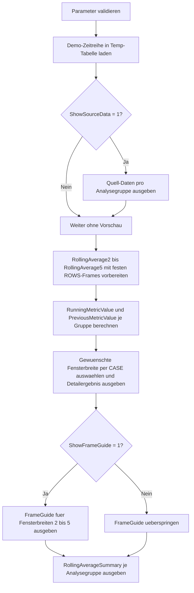

# WindowRollingAverageTemplate.sql

Dieses Skript stellt eine didaktische Vorlage fuer gleitende Durchschnitte mit Fensterrahmen im Kapitel `11_WindowFunctions` bereit. Die Umsetzung arbeitet mit Demo-Zeitreihen in Temp-Tabellen und zeigt, wie eine variable Fensterbreite in T-SQL ueber feste `ROWS`-Frames vorbereitet und anschliessend ausgewaehlt werden kann.

## Uebersicht

<!-- SQLDOC:SUMMARY_TABLE:BEGIN -->
| Feld | Wert |
|---|---|
| Script | [WindowRollingAverageTemplate.sql](WindowRollingAverageTemplate.sql) |
| Version | `1.0` |
| Typ | `template` |
| Kapitel | `11_WindowFunctions` |
| Sicherheit | `read-only-tempdb` |
| Zweck | Vorlage fuer gleitende Durchschnitte ueber zeilenbasierte Fensterrahmen mit konfigurierbarer Fensterbreite. |
<!-- SQLDOC:SUMMARY_TABLE:END -->

## Einordnung

Die Vorlage bleibt bewusst nah an einem typischen Trainingsmuster: pro Analysegruppe liegt eine kleine Monatsreihe vor, auf die mehrere vorberechnete `AVG() OVER(...)`-Frames angewendet werden. Ueber den Parameter wird nur entschieden, welcher dieser vorbereiteten Frames als aktiver gleitender Durchschnitt ausgegeben wird.

Fuer diese Erstversion gelten folgende Annahmen:

- Das Skript dient als wiederverwendbare Vorlage und nicht als produktives Reporting gegen bestehende Fachtabellen.
- Die Demo-Daten sind periodisch geordnete Kennzahlen mit eindeutigem `PeriodStart` je `AnalysisGroup`.
- Die variable Fensterbreite wird wegen T-SQL-Restriktionen nicht dynamisch im Frame formuliert, sondern ueber feste `ROWS BETWEEN ...`-Varianten von `2` bis `5` Zeilen bereitgestellt.
- `RunningMetricValue` und `DeltaToPreviousPeriod` bleiben im Detailergebnis enthalten, damit die Wirkung des gleitenden Durchschnitts leichter einordenbar ist.

## Parameter

<!-- SQLDOC:PARAMETERS_TABLE:BEGIN -->
| Parameter | SQL-Typ | Pflicht | Beschreibung |
|---|---|---|---|
| `@RollingWindowSize` | `INT` | Ja | Fensterbreite fuer den gleitenden Durchschnitt; zulaessig sind Werte von `2` bis `5`. |
| `@ShowSourceData` | `BIT` | Nein | Gibt bei `1` die Demo-Daten vor der Fensterberechnung aus. |
| `@ShowFrameGuide` | `BIT` | Nein | Gibt bei `1` eine kurze Referenz ueber die verwendeten `ROWS`-Frames aus. |
<!-- SQLDOC:PARAMETERS_TABLE:END -->

## Abhaengigkeiten

<!-- SQLDOC:DEPENDENCIES_LIST:BEGIN -->
- `tempdb` fuer temporaere Tabellen
- `AVG() OVER(...)`
- `SUM() OVER(...)`
- `LAG()`
- `ROWS BETWEEN`
<!-- SQLDOC:DEPENDENCIES_LIST:END -->

## Hinweise

- Das Detailergebnis zeigt immer den ausgewaehlten gleitenden Durchschnitt, die laufende Summe und den Vorperiodenwert derselben Analysegruppe.
- `AppliedFrame` macht sichtbar, welcher feste `ROWS`-Frame fuer die aktuelle Parameterwahl greift.
- Das optionale Resultset `FrameGuide` eignet sich, um die technische Abbildung der Fensterbreite direkt mitzuliefern.
- Die Vorlage laesst sich spaeter leicht auf echte Faktenreihen uebertragen, solange pro Partition eine stabile zeitliche Sortierung vorhanden ist.

## Versionshistorie

<!-- SQLDOC:VERSION_HISTORY_TABLE:BEGIN -->
| Version | Datum | User | Beschreibung |
|---|---|---|---|
| `1.0` | `2026-04-18` | `ER` | Erstversion der didaktischen Vorlage fuer gleitende Durchschnitte mit Fensterrahmen |
<!-- SQLDOC:VERSION_HISTORY_TABLE:END -->

## Ablauf

<!-- SQLDOC:MERMAID:BEGIN -->

<!-- SQLDOC:MERMAID:END -->

## SQL-Code

<!-- SQLDOC:SQL_CODE:BEGIN -->
```sql
/*
BEGIN:SQL-HEADER v1
---
sql_header: v1
script_name: "WindowRollingAverageTemplate.sql"
script_version: "1.0"
script_type: "template"
chapter: "11_WindowFunctions"

purpose: >
  Liefert eine didaktische Vorlage fuer gleitende Durchschnitte ueber
  zeilenbasierte Fensterrahmen. Das Skript zeigt auf Demo-Daten, wie
  eine konfigurierbare Fensterbreite in SQL Server ueber feste
  ROWS-Frames vorbereitet und anschliessend ausgewaehlt werden kann.

parameters:
  - name: "@RollingWindowSize"
    sql_type: "INT"
    direction: "IN"
    required: true
    description: "Fensterbreite fuer den gleitenden Durchschnitt; zulaessig sind Werte von 2 bis 5"
  - name: "@ShowSourceData"
    sql_type: "BIT"
    direction: "IN"
    required: false
    description: "1 = Demo-Daten vor der Fensterberechnung ausgeben"
  - name: "@ShowFrameGuide"
    sql_type: "BIT"
    direction: "IN"
    required: false
    description: "1 = zusaetzliche Uebersicht ueber die verwendeten ROWS-Frames ausgeben"

result_sets:
  - name: "SourcePreview"
    description: "Optionale Vorschau auf die monatlichen Demo-Werte pro Analysegruppe"
  - name: "RollingAverageDetail"
    description: "Detailergebnis mit gleitendem Durchschnitt, laufender Summe und Vorperiodenwert"
  - name: "FrameGuide"
    description: "Optionale Referenz, welches ROWS-Frame fuer welche Fensterbreite genutzt wird"
  - name: "RollingAverageSummary"
    description: "Verdichtete Sicht je Analysegruppe mit erstem, letztem und hoechstem gleitenden Durchschnitt"

dependencies:
  - "tempdb temporary tables"
  - "AVG() OVER(...)"
  - "SUM() OVER(...)"
  - "LAG()"
  - "ROWS BETWEEN"

safety:
  level: "read-only-tempdb"
  writes_data: false

documentation:
  markdown_file: "T-SQL/11_WindowFunctions/SQLScripts/WindowRollingAverageTemplate.md"
  sync_blocks:
    - "SUMMARY_TABLE"
    - "PARAMETERS_TABLE"
    - "DEPENDENCIES_LIST"
    - "VERSION_HISTORY_TABLE"
    - "SQL_CODE"
  mermaid:
    mode: "ai-agent-from-sql"
    source: "script-body"

main_responsible:
  name: "Erhard Rainer"
  initials: "ER"

version_history:
  - version: "1.0"
    date: "2026-04-18"
    user: "ER"
    description: "Erstversion der didaktischen Vorlage fuer gleitende Durchschnitte mit Fensterrahmen"

notes:
  - "Die Vorlage arbeitet mit Temp-Tabellen und Demo-Daten statt mit produktiven Faktentabellen"
  - "Die konfigurierbare Fensterbreite wird in SQL Server ueber vorberechnete feste ROWS-Frames abgebildet"
---
END:SQL-HEADER v1
*/

SET NOCOUNT ON;

DECLARE @RollingWindowSize INT = 3;
DECLARE @ShowSourceData    BIT = 1;
DECLARE @ShowFrameGuide    BIT = 1;

IF @RollingWindowSize IS NULL OR @RollingWindowSize < 2 OR @RollingWindowSize > 5
BEGIN
    THROW 50000, '@RollingWindowSize muss zwischen 2 und 5 liegen.', 1;
END;

IF @ShowSourceData NOT IN (0, 1)
BEGIN
    THROW 50000, '@ShowSourceData muss als BIT-Wert 0 oder 1 gesetzt sein.', 1;
END;

IF @ShowFrameGuide NOT IN (0, 1)
BEGIN
    THROW 50000, '@ShowFrameGuide muss als BIT-Wert 0 oder 1 gesetzt sein.', 1;
END;

DROP TABLE IF EXISTS #MetricSeries;
DROP TABLE IF EXISTS #RollingAverageTemplate;

CREATE TABLE #MetricSeries
(
    AnalysisGroup VARCHAR(20)   NOT NULL,
    PeriodStart   DATE          NOT NULL,
    MetricValue   DECIMAL(12,2) NOT NULL,
    TicketVolume  INT           NOT NULL,
    PRIMARY KEY (AnalysisGroup, PeriodStart)
);

INSERT INTO #MetricSeries
(
    AnalysisGroup,
    PeriodStart,
    MetricValue,
    TicketVolume
)
VALUES
    ('Orders',   '2026-01-01',  94.00, 210),
    ('Orders',   '2026-02-01', 102.00, 225),
    ('Orders',   '2026-03-01', 108.00, 238),
    ('Orders',   '2026-04-01', 111.00, 244),
    ('Orders',   '2026-05-01', 117.00, 259),
    ('Orders',   '2026-06-01', 121.00, 266),
    ('Returns',  '2026-01-01',  14.00,  35),
    ('Returns',  '2026-02-01',  18.00,  39),
    ('Returns',  '2026-03-01',  17.00,  37),
    ('Returns',  '2026-04-01',  16.00,  34),
    ('Returns',  '2026-05-01',  19.00,  41),
    ('Returns',  '2026-06-01',  21.00,  45),
    ('Support',  '2026-01-01',  63.00, 120),
    ('Support',  '2026-02-01',  67.00, 126),
    ('Support',  '2026-03-01',  70.00, 131),
    ('Support',  '2026-04-01',  74.00, 139),
    ('Support',  '2026-05-01',  73.00, 136),
    ('Support',  '2026-06-01',  78.00, 145);

IF @ShowSourceData = 1
BEGIN
    SELECT
        ms.AnalysisGroup,
        ms.PeriodStart,
        ms.MetricValue,
        ms.TicketVolume
    FROM #MetricSeries AS ms
    ORDER BY
        ms.AnalysisGroup,
        ms.PeriodStart;
END;

SELECT
    ms.AnalysisGroup,
    ms.PeriodStart,
    ms.MetricValue,
    ms.TicketVolume,
    AVG(ms.MetricValue) OVER
    (
        PARTITION BY ms.AnalysisGroup
        ORDER BY ms.PeriodStart
        ROWS BETWEEN 1 PRECEDING AND CURRENT ROW
    ) AS RollingAverage2,
    AVG(ms.MetricValue) OVER
    (
        PARTITION BY ms.AnalysisGroup
        ORDER BY ms.PeriodStart
        ROWS BETWEEN 2 PRECEDING AND CURRENT ROW
    ) AS RollingAverage3,
    AVG(ms.MetricValue) OVER
    (
        PARTITION BY ms.AnalysisGroup
        ORDER BY ms.PeriodStart
        ROWS BETWEEN 3 PRECEDING AND CURRENT ROW
    ) AS RollingAverage4,
    AVG(ms.MetricValue) OVER
    (
        PARTITION BY ms.AnalysisGroup
        ORDER BY ms.PeriodStart
        ROWS BETWEEN 4 PRECEDING AND CURRENT ROW
    ) AS RollingAverage5,
    SUM(ms.MetricValue) OVER
    (
        PARTITION BY ms.AnalysisGroup
        ORDER BY ms.PeriodStart
        ROWS BETWEEN UNBOUNDED PRECEDING AND CURRENT ROW
    ) AS RunningMetricValue,
    LAG(ms.MetricValue) OVER
    (
        PARTITION BY ms.AnalysisGroup
        ORDER BY ms.PeriodStart
    ) AS PreviousMetricValue
INTO #RollingAverageTemplate
FROM #MetricSeries AS ms;

SELECT
    rat.AnalysisGroup,
    rat.PeriodStart,
    rat.MetricValue,
    rat.TicketVolume,
    CAST
    (
        CASE @RollingWindowSize
            WHEN 2 THEN rat.RollingAverage2
            WHEN 3 THEN rat.RollingAverage3
            WHEN 4 THEN rat.RollingAverage4
            ELSE rat.RollingAverage5
        END AS DECIMAL(12,2)
    ) AS RollingAverageValue,
    rat.RunningMetricValue,
    rat.PreviousMetricValue,
    rat.MetricValue - rat.PreviousMetricValue AS DeltaToPreviousPeriod,
    CONCAT('ROWS BETWEEN ', @RollingWindowSize - 1, ' PRECEDING AND CURRENT ROW') AS AppliedFrame
FROM #RollingAverageTemplate AS rat
ORDER BY
    rat.AnalysisGroup,
    rat.PeriodStart;

IF @ShowFrameGuide = 1
BEGIN
    SELECT
        2 AS RollingWindowSize,
        'ROWS BETWEEN 1 PRECEDING AND CURRENT ROW' AS FrameDefinition,
        'Aktuelle Zeile plus eine Vorperiode' AS DidacticMeaning
    UNION ALL
    SELECT
        3,
        'ROWS BETWEEN 2 PRECEDING AND CURRENT ROW',
        'Aktuelle Zeile plus zwei Vorperioden'
    UNION ALL
    SELECT
        4,
        'ROWS BETWEEN 3 PRECEDING AND CURRENT ROW',
        'Aktuelle Zeile plus drei Vorperioden'
    UNION ALL
    SELECT
        5,
        'ROWS BETWEEN 4 PRECEDING AND CURRENT ROW',
        'Aktuelle Zeile plus vier Vorperioden';
END;

SELECT
    rat.AnalysisGroup,
    MIN(rat.PeriodStart) AS FirstPeriodStart,
    MAX(rat.PeriodStart) AS LastPeriodStart,
    COUNT(*) AS PeriodCount,
    CAST
    (
        MIN
        (
            CASE @RollingWindowSize
                WHEN 2 THEN rat.RollingAverage2
                WHEN 3 THEN rat.RollingAverage3
                WHEN 4 THEN rat.RollingAverage4
                ELSE rat.RollingAverage5
            END
        ) AS DECIMAL(12,2)
    ) AS MinimumRollingAverage,
    CAST
    (
        MAX
        (
            CASE @RollingWindowSize
                WHEN 2 THEN rat.RollingAverage2
                WHEN 3 THEN rat.RollingAverage3
                WHEN 4 THEN rat.RollingAverage4
                ELSE rat.RollingAverage5
            END
        ) AS DECIMAL(12,2)
    ) AS MaximumRollingAverage,
    CAST(MAX(rat.RunningMetricValue) AS DECIMAL(12,2)) AS TotalMetricValue
FROM #RollingAverageTemplate AS rat
GROUP BY
    rat.AnalysisGroup
ORDER BY
    rat.AnalysisGroup;
```
<!-- SQLDOC:SQL_CODE:END -->
