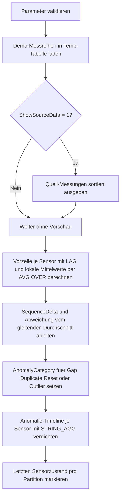

# WindowSequenceAnomalyScan.sql

Dieses Skript scannt geordnete Messreihen auf zwei typische Fehlbilder: unplausible Spruenge in der Sequenznummer und deutliche Abweichungen vom lokalen Wertniveau. Die Umsetzung bleibt bewusst didaktisch und arbeitet ausschliesslich mit Demo-Daten in Temp-Objekten.

## Uebersicht

<!-- SQLDOC:SUMMARY_TABLE:BEGIN -->
| Feld | Wert |
|---|---|
| Script | [WindowSequenceAnomalyScan.sql](WindowSequenceAnomalyScan.sql) |
| Version | `1.0` |
| Typ | `didactic-lab` |
| Kapitel | `11_WindowFunctions` |
| Sicherheit | `read-only-tempdb` |
| Zweck | Erkennt Sequenzspruenge und Wertausreisser ueber `LAG()` und gleitende Fensteraggregate. |
<!-- SQLDOC:SUMMARY_TABLE:END -->

## Einordnung

Die Demo modelliert kleine Sensor-Messreihen mit Zeitstempel, Sequenznummer und Messwert. Dadurch laesst sich in einem einzigen Beispiel zeigen, wie Window Functions sowohl strukturelle Anomalien in einer Folge als auch lokale Wertausreisser sichtbar machen.

Folgende Annahmen werden dabei bewusst festgehalten:

- Das Skript ist eine didaktische Erstversion fuer Kapitel `11_WindowFunctions`.
- Statt produktiver Event- oder Telemetrietabellen werden Demo-Messungen im Skript selbst erzeugt.
- Eine regulaere Folge erhoeht `SequenceNo` pro Sensor um genau `@ExpectedSequenceStep`.
- Wertausreisser werden nicht gegen einen globalen Grenzwert, sondern gegen einen gleitenden Drei-Zeilen-Durchschnitt bewertet.

## Parameter

<!-- SQLDOC:PARAMETERS_TABLE:BEGIN -->
| Parameter | SQL-Typ | Pflicht | Beschreibung |
|---|---|---|---|
| `@ExpectedSequenceStep` | `INT` | Ja | Erwartete Differenz zwischen zwei aufeinanderfolgenden `SequenceNo`-Werten. |
| `@OutlierTolerance` | `DECIMAL(10,2)` | Ja | Maximal erlaubte absolute Abweichung vom gleitenden Durchschnitt ohne Outlier-Flag. |
| `@ShowSourceData` | `BIT` | Nein | Gibt bei `1` die sortierten Demo-Messungen vor der Analyse aus. |
<!-- SQLDOC:PARAMETERS_TABLE:END -->

## Abhaengigkeiten

<!-- SQLDOC:DEPENDENCIES_LIST:BEGIN -->
- `tempdb` fuer temporaere Tabellen
- `LAG()`
- `AVG() OVER(ROWS BETWEEN ...)`
- `ROW_NUMBER()`
- `STRING_AGG()`
<!-- SQLDOC:DEPENDENCIES_LIST:END -->

## Hinweise

- `SequenceDiagnostics` ist die analytische Vorstufe und zeigt Vorwert, Sequenzdifferenz sowie zwei lokale Mittelwerte je Sensor.
- `sequence_gap`, `duplicate_sequence` und `sequence_reset` markieren unterschiedliche Sequenzprobleme und sind bewusst voneinander getrennt.
- Ein `value_outlier` entsteht nur dann, wenn keine schwerere Sequenzanomalie fuer dieselbe Zeile vorliegt und die Abweichung vom gleitenden Durchschnitt groesser als `@OutlierTolerance` ist.
- Die letzte Ausgabe `LatestSensorState` hilft dabei, aus dem detaillierten Scan einen kompakten Tail-Status pro Sensor abzuleiten.

## Versionshistorie

<!-- SQLDOC:VERSION_HISTORY_TABLE:BEGIN -->
| Version | Datum | User | Beschreibung |
|---|---|---|---|
| `1.0` | `2026-04-18` | `ER` | Erstversion des didaktischen Sequence-Anomaly-Scans fuer Kapitel Window Functions |
<!-- SQLDOC:VERSION_HISTORY_TABLE:END -->

## Ablauf

<!-- SQLDOC:MERMAID:BEGIN -->

<!-- SQLDOC:MERMAID:END -->

## SQL-Code

<!-- SQLDOC:SQL_CODE:BEGIN -->
```sql
/*
BEGIN:SQL-HEADER v1
---
sql_header: v1
script_name: "WindowSequenceAnomalyScan.sql"
script_version: "1.0"
script_type: "didactic-lab"
chapter: "11_WindowFunctions"

purpose: >
  Scannt geordnete Messreihen auf Sequenzspruenge und Wertausreisser.
  Das Skript kombiniert LAG() fuer die Distanz zur Vorzeile mit
  gleitenden Fensteraggregaten, um fehlende Sequenznummern, doppelte
  Schritte und deutliche Abweichungen vom lokalen Niveau sichtbar zu
  machen.

parameters:
  - name: "@ExpectedSequenceStep"
    sql_type: "INT"
    direction: "IN"
    required: true
    description: "Erwartete Differenz zwischen zwei aufeinanderfolgenden SequenceNo-Werten"
  - name: "@OutlierTolerance"
    sql_type: "DECIMAL(10,2)"
    direction: "IN"
    required: true
    description: "Maximal erlaubte absolute Abweichung vom gleitenden Durchschnitt ohne Outlier-Flag"
  - name: "@ShowSourceData"
    sql_type: "BIT"
    direction: "IN"
    required: false
    description: "1 = die sortierten Demo-Messungen vor der Analyse zusaetzlich ausgeben"

result_sets:
  - name: "SourcePreview"
    description: "Optionale Vorschau auf die geordneten Demo-Messungen je Sensor"
  - name: "SequenceDiagnostics"
    description: "Zeigt Vorwert, Sequenzdifferenz und Basismetriken je Messung"
  - name: "AnomalyScan"
    description: "Klassifiziert Sequenzspruenge, Duplikate, Resets und Wertausreisser"
  - name: "AnomalySummaryPerSensor"
    description: "Verdichtete Sicht je Sensor mit Anzahl und Reihenfolge der erkannten Anomalien"
  - name: "LatestSensorState"
    description: "Letzte bekannte Messung je Sensor mit Hinweis auf den aktuellen Sequenzstatus"

dependencies:
  - "tempdb temporary tables"
  - "LAG()"
  - "AVG() OVER(ROWS BETWEEN ...)"
  - "ROW_NUMBER()"
  - "STRING_AGG()"

safety:
  level: "read-only-tempdb"
  writes_data: false

documentation:
  markdown_file: "T-SQL/11_WindowFunctions/SQLScripts/WindowSequenceAnomalyScan.md"
  sync_blocks:
    - "SUMMARY_TABLE"
    - "PARAMETERS_TABLE"
    - "DEPENDENCIES_LIST"
    - "VERSION_HISTORY_TABLE"
    - "SQL_CODE"
  mermaid:
    mode: "ai-agent-from-sql"
    source: "script-body"

main_responsible:
  name: "Erhard Rainer"
  initials: "ER"

version_history:
  - version: "1.0"
    date: "2026-04-18"
    user: "ER"
    description: "Erstversion des didaktischen Sequence-Anomaly-Scans fuer Kapitel Window Functions"

notes:
  - "Die Demo arbeitet mit kuenstlichen Sensor-Messreihen in Temp-Tabellen statt mit produktiven Streams"
  - "Ein Outlier wird relativ zu einem gleitenden Drei-Zeilen-Fenster bewertet"
---
END:SQL-HEADER v1
*/

SET NOCOUNT ON;

DECLARE @ExpectedSequenceStep INT = 1;
DECLARE @OutlierTolerance     DECIMAL(10,2) = 12.00;
DECLARE @ShowSourceData       BIT = 1;

IF @ExpectedSequenceStep IS NULL OR @ExpectedSequenceStep < 1
BEGIN
    THROW 50000, '@ExpectedSequenceStep muss groesser oder gleich 1 sein.', 1;
END;

IF @OutlierTolerance IS NULL OR @OutlierTolerance < 0
BEGIN
    THROW 50000, '@OutlierTolerance muss groesser oder gleich 0 sein.', 1;
END;

IF @ShowSourceData NOT IN (0, 1)
BEGIN
    THROW 50000, '@ShowSourceData muss als BIT-Wert 0 oder 1 gesetzt sein.', 1;
END;

DROP TABLE IF EXISTS #SensorReadings;
DROP TABLE IF EXISTS #SequenceDiagnostics;
DROP TABLE IF EXISTS #AnomalyScan;
DROP TABLE IF EXISTS #LatestSensorState;

CREATE TABLE #SensorReadings
(
    SensorCode    VARCHAR(20)    NOT NULL,
    ReadingTime   DATETIME2(0)   NOT NULL,
    SequenceNo    INT            NOT NULL,
    ReadingValue  DECIMAL(10,2)  NOT NULL,
    ShiftCode     VARCHAR(10)    NOT NULL,
    ReadingLabel  VARCHAR(80)    NOT NULL
);

INSERT INTO #SensorReadings
(
    SensorCode,
    ReadingTime,
    SequenceNo,
    ReadingValue,
    ShiftCode,
    ReadingLabel
)
VALUES
    ('SEN-A', '2026-04-01T08:00:00', 1001, 48.00, 'D1', 'Normalstart'),
    ('SEN-A', '2026-04-01T08:05:00', 1002, 49.00, 'D1', 'Stabiler Verlauf'),
    ('SEN-A', '2026-04-01T08:10:00', 1003, 51.00, 'D1', 'Stabiler Verlauf'),
    ('SEN-A', '2026-04-01T08:15:00', 1005, 52.00, 'D1', 'Fehlende Sequenznummer 1004'),
    ('SEN-A', '2026-04-01T08:20:00', 1006, 81.00, 'D1', 'Messspitze nach Sequenzluecke'),
    ('SEN-A', '2026-04-01T08:25:00', 1007, 53.00, 'D1', 'Rueckkehr zur Basis'),
    ('SEN-B', '2026-04-01T09:00:00', 2201, 67.00, 'D1', 'Normalstart'),
    ('SEN-B', '2026-04-01T09:05:00', 2202, 66.00, 'D1', 'Leichte Abweichung'),
    ('SEN-B', '2026-04-01T09:10:00', 2202, 65.00, 'D1', 'Doppelte Sequenznummer'),
    ('SEN-B', '2026-04-01T09:15:00', 2203, 64.00, 'D1', 'Sequenz normalisiert sich'),
    ('SEN-B', '2026-04-01T09:20:00', 2204, 40.00, 'D1', 'Starker negativer Ausreisser'),
    ('SEN-C', '2026-04-01T10:00:00', 501,  90.00, 'D2', 'Normalstart'),
    ('SEN-C', '2026-04-01T10:05:00', 502,  91.00, 'D2', 'Stabiler Verlauf'),
    ('SEN-C', '2026-04-01T10:10:00', 503,  92.00, 'D2', 'Stabiler Verlauf'),
    ('SEN-C', '2026-04-01T10:15:00', 401,  89.00, 'D2', 'Reset auf niedrigere Sequenznummer'),
    ('SEN-C', '2026-04-01T10:20:00', 402,  90.00, 'D2', 'Neuer Zyklus nach Reset');

IF @ShowSourceData = 1
BEGIN
    SELECT
        sr.SensorCode,
        sr.ReadingTime,
        sr.SequenceNo,
        sr.ReadingValue,
        sr.ShiftCode,
        sr.ReadingLabel
    FROM #SensorReadings AS sr
    ORDER BY
        sr.SensorCode,
        sr.ReadingTime,
        sr.SequenceNo;
END;

SELECT
    sr.SensorCode,
    sr.ReadingTime,
    sr.SequenceNo,
    sr.ReadingValue,
    sr.ShiftCode,
    sr.ReadingLabel,
    ROW_NUMBER() OVER
    (
        PARTITION BY sr.SensorCode
        ORDER BY sr.ReadingTime, sr.SequenceNo
    ) AS ReadingOrder,
    LAG(sr.SequenceNo) OVER
    (
        PARTITION BY sr.SensorCode
        ORDER BY sr.ReadingTime, sr.SequenceNo
    ) AS PreviousSequenceNo,
    LAG(sr.ReadingValue) OVER
    (
        PARTITION BY sr.SensorCode
        ORDER BY sr.ReadingTime, sr.SequenceNo
    ) AS PreviousReadingValue,
    sr.SequenceNo
        - LAG(sr.SequenceNo) OVER
          (
              PARTITION BY sr.SensorCode
              ORDER BY sr.ReadingTime, sr.SequenceNo
          ) AS SequenceDelta,
    AVG(sr.ReadingValue) OVER
    (
        PARTITION BY sr.SensorCode
        ORDER BY sr.ReadingTime, sr.SequenceNo
        ROWS BETWEEN 2 PRECEDING AND CURRENT ROW
    ) AS RollingAverage3,
    AVG(sr.ReadingValue) OVER
    (
        PARTITION BY sr.SensorCode
        ORDER BY sr.ReadingTime, sr.SequenceNo
        ROWS BETWEEN 1 PRECEDING AND 1 FOLLOWING
    ) AS CenteredAverage3
INTO #SequenceDiagnostics
FROM #SensorReadings AS sr;

SELECT
    sd.SensorCode,
    sd.ReadingOrder,
    sd.ReadingTime,
    sd.SequenceNo,
    sd.PreviousSequenceNo,
    sd.SequenceDelta,
    sd.ReadingValue,
    sd.PreviousReadingValue,
    CAST(sd.RollingAverage3 AS DECIMAL(10,2)) AS RollingAverage3,
    CAST(sd.CenteredAverage3 AS DECIMAL(10,2)) AS CenteredAverage3,
    sd.ShiftCode,
    sd.ReadingLabel
FROM #SequenceDiagnostics AS sd
ORDER BY
    sd.SensorCode,
    sd.ReadingOrder;

SELECT
    sd.SensorCode,
    sd.ReadingOrder,
    sd.ReadingTime,
    sd.SequenceNo,
    sd.PreviousSequenceNo,
    sd.SequenceDelta,
    sd.ReadingValue,
    sd.PreviousReadingValue,
    CAST(sd.RollingAverage3 AS DECIMAL(10,2)) AS RollingAverage3,
    CAST(sd.CenteredAverage3 AS DECIMAL(10,2)) AS CenteredAverage3,
    CAST(ABS(sd.ReadingValue - sd.RollingAverage3) AS DECIMAL(10,2)) AS AbsoluteDeviationFromRollingAverage,
    CASE
        WHEN sd.PreviousSequenceNo IS NULL THEN 'initial_reading'
        WHEN sd.SequenceDelta < 0 THEN 'sequence_reset'
        WHEN sd.SequenceDelta = 0 THEN 'duplicate_sequence'
        WHEN sd.SequenceDelta > @ExpectedSequenceStep THEN 'sequence_gap'
        WHEN ABS(sd.ReadingValue - sd.RollingAverage3) > @OutlierTolerance THEN 'value_outlier'
        ELSE 'no_anomaly'
    END AS AnomalyCategory,
    CASE
        WHEN sd.PreviousSequenceNo IS NULL
            THEN 'Erste Messung des Sensors'
        WHEN sd.SequenceDelta < 0
            THEN CONCAT('Reset von ', CONVERT(VARCHAR(20), sd.PreviousSequenceNo), ' auf ', CONVERT(VARCHAR(20), sd.SequenceNo))
        WHEN sd.SequenceDelta = 0
            THEN CONCAT('Doppelte Sequenznummer ', CONVERT(VARCHAR(20), sd.SequenceNo))
        WHEN sd.SequenceDelta > @ExpectedSequenceStep
            THEN CONCAT('Sequenzluecke: erwartet +', CONVERT(VARCHAR(20), @ExpectedSequenceStep), ', gefunden +', CONVERT(VARCHAR(20), sd.SequenceDelta))
        WHEN ABS(sd.ReadingValue - sd.RollingAverage3) > @OutlierTolerance
            THEN CONCAT('Wertabweichung ', CONVERT(VARCHAR(20), CAST(ABS(sd.ReadingValue - sd.RollingAverage3) AS DECIMAL(10,2))), ' ueber Toleranz')
        ELSE 'Keine relevante Anomalie'
    END AS AnomalyLabel
INTO #AnomalyScan
FROM #SequenceDiagnostics AS sd;

SELECT
    a.SensorCode,
    a.ReadingOrder,
    a.ReadingTime,
    a.SequenceNo,
    a.PreviousSequenceNo,
    a.SequenceDelta,
    a.ReadingValue,
    a.RollingAverage3,
    a.AbsoluteDeviationFromRollingAverage,
    a.AnomalyCategory,
    a.AnomalyLabel
FROM #AnomalyScan AS a
ORDER BY
    a.SensorCode,
    a.ReadingOrder;

SELECT
    a.SensorCode,
    COUNT(CASE WHEN a.AnomalyCategory = 'sequence_gap' THEN 1 END) AS SequenceGapCount,
    COUNT(CASE WHEN a.AnomalyCategory = 'duplicate_sequence' THEN 1 END) AS DuplicateSequenceCount,
    COUNT(CASE WHEN a.AnomalyCategory = 'sequence_reset' THEN 1 END) AS SequenceResetCount,
    COUNT(CASE WHEN a.AnomalyCategory = 'value_outlier' THEN 1 END) AS ValueOutlierCount,
    STRING_AGG(a.AnomalyLabel, ' | ')
        WITHIN GROUP (ORDER BY a.ReadingOrder) AS AnomalyTimeline
FROM #AnomalyScan AS a
WHERE a.AnomalyCategory <> 'no_anomaly'
GROUP BY
    a.SensorCode
ORDER BY
    a.SensorCode;

WITH RankedLatest AS
(
    SELECT
        a.SensorCode,
        a.ReadingTime,
        a.SequenceNo,
        a.ReadingValue,
        a.RollingAverage3,
        a.AnomalyCategory,
        a.AnomalyLabel,
        ROW_NUMBER() OVER
        (
            PARTITION BY a.SensorCode
            ORDER BY a.ReadingTime DESC, a.SequenceNo DESC
        ) AS LatestRank
    FROM #AnomalyScan AS a
)
SELECT
    rl.SensorCode,
    rl.ReadingTime AS LatestReadingTime,
    rl.SequenceNo AS LatestSequenceNo,
    rl.ReadingValue AS LatestReadingValue,
    rl.RollingAverage3 AS LatestRollingAverage3,
    rl.AnomalyCategory AS LatestAnomalyCategory,
    rl.AnomalyLabel AS LatestAnomalyLabel,
    CASE
        WHEN rl.AnomalyCategory IN ('sequence_gap', 'duplicate_sequence', 'sequence_reset', 'value_outlier')
            THEN 'attention_required'
        ELSE 'stable_tail'
    END AS SensorTailStatus
INTO #LatestSensorState
FROM RankedLatest AS rl
WHERE rl.LatestRank = 1;

SELECT
    lss.SensorCode,
    lss.LatestReadingTime,
    lss.LatestSequenceNo,
    lss.LatestReadingValue,
    lss.LatestRollingAverage3,
    lss.LatestAnomalyCategory,
    lss.LatestAnomalyLabel,
    lss.SensorTailStatus
FROM #LatestSensorState AS lss
ORDER BY
    lss.SensorCode;
```
<!-- SQLDOC:SQL_CODE:END -->
