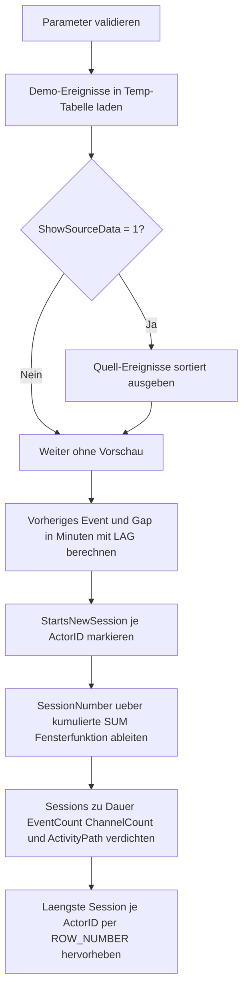

# WindowSessionGapDetector.sql

Dieses Skript zeigt, wie sich Session-Gaps in einer Ereignisfolge mit Window Functions erkennen lassen. Die Demo bleibt absichtlich didaktisch und arbeitet nur mit Temp-Objekten, damit der Zusammenhang zwischen `LAG()`, `DATEDIFF()` und der kumulierten Sessionnummer transparent bleibt.

## Uebersicht

<!-- SQLDOC:SUMMARY_TABLE:BEGIN -->
| Feld | Wert |
|---|---|
| Script | [WindowSessionGapDetector.sql](WindowSessionGapDetector.sql) |
| Version | `1.0` |
| Typ | `didactic-lab` |
| Kapitel | `11_WindowFunctions` |
| Sicherheit | `read-only-tempdb` |
| Zweck | Erkennt Session-Gaps und Aktivitaetsbloecke je `ActorID` ueber `LAG()` und kumulierte Startmarker. |
<!-- SQLDOC:SUMMARY_TABLE:END -->

## Einordnung

Die Demo modelliert eine kleine In-App-Ereignisfolge pro `ActorID`. Ein neues Session-Fenster beginnt immer dann, wenn kein vorheriges Event existiert oder die Zeitluecke zur Vorzeile groesser ist als `@SessionGapMinutes`.

Folgende Annahmen werden dabei bewusst festgehalten:

- Das Skript ist eine didaktische Erstversion fuer Kapitel `11_WindowFunctions`.
- Statt produktiver Clickstream- oder Audit-Tabellen werden Demo-Ereignisse direkt im Skript erzeugt.
- Die Session-Erkennung erfolgt ausschliesslich ueber Zeitabstaende und nicht ueber produktive Login- oder Logout-Signale.
- `ActivityPath` dient als lesbare Zusammenfassung der Session-Reihenfolge und nicht als persistentes Datenmodell.

## Parameter

<!-- SQLDOC:PARAMETERS_TABLE:BEGIN -->
| Parameter | SQL-Typ | Pflicht | Beschreibung |
|---|---|---|---|
| `@SessionGapMinutes` | `INT` | Ja | Zeitabstand in Minuten, ab dem ein neues Session-Fenster beginnt. |
| `@OnlyShowSessionStarts` | `BIT` | Ja | `1` zeigt in der Detailansicht nur Events mit Sessionstart-Marker, `0` zeigt alle Events. |
| `@ShowSourceData` | `BIT` | Nein | Gibt bei `1` die sortierten Demo-Ereignisse vor der Session-Erkennung aus. |
<!-- SQLDOC:PARAMETERS_TABLE:END -->

## Abhaengigkeiten

<!-- SQLDOC:DEPENDENCIES_LIST:BEGIN -->
- `tempdb` fuer temporaere Tabellen
- `LAG()`
- `SUM() OVER(PARTITION BY ... ORDER BY ...)`
- `ROW_NUMBER()`
- `STRING_AGG()`
<!-- SQLDOC:DEPENDENCIES_LIST:END -->

## Hinweise

- `StartsNewSession` zeigt den eigentlichen Session-Grenzmarker und ist die Grundlage fuer die fortlaufende `SessionNumber`.
- Mit kleineren Werten fuer `@SessionGapMinutes` entstehen mehr, dafuer kuerzere Sessions.
- `ChannelCount` ergaenzt die Session-Sicht um einen einfachen Hinweis, ob innerhalb einer Session mehrere Nutzungskanaele beteiligt waren.
- Die laengste Session je `ActorID` wird ueber `ROW_NUMBER()` nach Dauer, Eventzahl und Startzeit priorisiert.

## Versionshistorie

<!-- SQLDOC:VERSION_HISTORY_TABLE:BEGIN -->
| Version | Datum | User | Beschreibung |
|---|---|---|---|
| `1.0` | `2026-04-18` | `ER` | Erstversion des didaktischen Session-Gap-Detectors fuer Window Functions |
<!-- SQLDOC:VERSION_HISTORY_TABLE:END -->

## Ablauf

<!-- SQLDOC:MERMAID:BEGIN -->

<!-- SQLDOC:MERMAID:END -->

## SQL-Code

<!-- SQLDOC:SQL_CODE:BEGIN -->
```sql
/*
BEGIN:SQL-HEADER v1
---
sql_header: v1
script_name: "WindowSessionGapDetector.sql"
script_version: "1.0"
script_type: "didactic-lab"
chapter: "11_WindowFunctions"

purpose: >
  Erkennt Session-Gaps in einer Ereignisfolge und fasst daraus
  Aktivitaetsbloecke pro ActorID zusammen. Das Skript kombiniert LAG(),
  DATEDIFF() und eine kumulierte SUM()-Fensterfunktion, um Sessionstarts
  zu markieren, Sessions zu nummerieren und pro Session Dauer, Eventzahl
  und Aktivitaetsweg auszugeben.

parameters:
  - name: "@SessionGapMinutes"
    sql_type: "INT"
    direction: "IN"
    required: true
    description: "Zeitabstand in Minuten, ab dem ein neues Session-Fenster beginnt"
  - name: "@OnlyShowSessionStarts"
    sql_type: "BIT"
    direction: "IN"
    required: true
    description: "1 = nur Sessionstarts in der Detailansicht zeigen, 0 = alle Events ausgeben"
  - name: "@ShowSourceData"
    sql_type: "BIT"
    direction: "IN"
    required: false
    description: "1 = die Demo-Ereignisse vor der Session-Erkennung zusaetzlich ausgeben"

result_sets:
  - name: "SourcePreview"
    description: "Optionale Vorschau auf die sortierten Demo-Ereignisse"
  - name: "ActivityWithGapFlags"
    description: "Zeigt je Ereignis die vorherige Aktivitaet, den Zeitabstand und den Sessionstart-Marker"
  - name: "SessionAssignment"
    description: "Ordnet jedem Ereignis eine fortlaufende SessionNumber je ActorID zu"
  - name: "SessionSummary"
    description: "Verdichtete Sicht pro Session mit Start, Ende, Dauer und Aktivitaetsweg"
  - name: "LongestSessionPerActor"
    description: "Laengste erkannte Session je ActorID"

dependencies:
  - "tempdb temporary tables"
  - "LAG()"
  - "SUM() OVER(PARTITION BY ... ORDER BY ...)"
  - "ROW_NUMBER()"
  - "STRING_AGG()"

safety:
  level: "read-only-tempdb"
  writes_data: false

documentation:
  markdown_file: "T-SQL/11_WindowFunctions/SQLScripts/WindowSessionGapDetector.md"
  sync_blocks:
    - "SUMMARY_TABLE"
    - "PARAMETERS_TABLE"
    - "DEPENDENCIES_LIST"
    - "VERSION_HISTORY_TABLE"
    - "SQL_CODE"
  mermaid:
    mode: "ai-agent-from-sql"
    source: "script-body"

main_responsible:
  name: "Erhard Rainer"
  initials: "ER"

version_history:
  - version: "1.0"
    date: "2026-04-18"
    user: "ER"
    description: "Erstversion des didaktischen Session-Gap-Detectors fuer Window Functions"

notes:
  - "Die Demo arbeitet mit In-App-Ereignissen in Temp-Tabellen statt mit produktiven Clickstream-Daten"
  - "Eine neue Session beginnt beim ersten Event oder wenn die Luecke zur Vorzeile groesser als @SessionGapMinutes ist"
---
END:SQL-HEADER v1
*/

SET NOCOUNT ON;

DECLARE @SessionGapMinutes   INT = 30;
DECLARE @OnlyShowSessionStarts BIT = 0;
DECLARE @ShowSourceData      BIT = 1;

IF @SessionGapMinutes IS NULL OR @SessionGapMinutes < 1
BEGIN
    THROW 50000, '@SessionGapMinutes muss groesser oder gleich 1 sein.', 1;
END;

IF @OnlyShowSessionStarts NOT IN (0, 1) OR @ShowSourceData NOT IN (0, 1)
BEGIN
    THROW 50000, 'Die BIT-Parameter muessen als 0 oder 1 gesetzt sein.', 1;
END;

DROP TABLE IF EXISTS #ActivityStream;
DROP TABLE IF EXISTS #ActivityWithGapFlags;
DROP TABLE IF EXISTS #SessionAssignment;
DROP TABLE IF EXISTS #SessionSummary;

CREATE TABLE #ActivityStream
(
    ActorID         VARCHAR(20)   NOT NULL,
    EventTime       DATETIME2(0)  NOT NULL,
    ActivityLabel   VARCHAR(40)   NOT NULL,
    ChannelCode     VARCHAR(20)   NOT NULL,
    DeviceType      VARCHAR(20)   NOT NULL,
    ActivityNote    VARCHAR(120)  NOT NULL
);

INSERT INTO #ActivityStream
(
    ActorID,
    EventTime,
    ActivityLabel,
    ChannelCode,
    DeviceType,
    ActivityNote
)
VALUES
    ('USR-100', '2026-04-03T08:00:00', 'Login',          'Portal', 'Desktop', 'Tagesstart im Kundenportal'),
    ('USR-100', '2026-04-03T08:05:00', 'OpenDashboard',  'Portal', 'Desktop', 'Dashboard geladen'),
    ('USR-100', '2026-04-03T08:11:00', 'ExportReport',   'Portal', 'Desktop', 'Kennzahlen exportiert'),
    ('USR-100', '2026-04-03T08:52:00', 'Login',          'Portal', 'Mobile',  'Spaeterer Zugriff unterwegs'),
    ('USR-100', '2026-04-03T08:59:00', 'ApproveOrder',   'Portal', 'Mobile',  'Freigabe nach Rueckfrage'),
    ('USR-100', '2026-04-03T09:47:00', 'OpenTicket',     'Support','Desktop', 'Supportfall im Backoffice'),
    ('USR-200', '2026-04-03T09:10:00', 'Login',          'Portal', 'Desktop', 'Morgendlicher Einstieg'),
    ('USR-200', '2026-04-03T09:18:00', 'SearchOrder',    'Portal', 'Desktop', 'Auftrag gesucht'),
    ('USR-200', '2026-04-03T09:24:00', 'ViewInvoice',    'Portal', 'Desktop', 'Rechnung geprueft'),
    ('USR-200', '2026-04-03T09:57:00', 'CreateCase',     'CRM',    'Desktop', 'Servicefall angelegt'),
    ('USR-200', '2026-04-03T10:06:00', 'UpdateCase',     'CRM',    'Desktop', 'Notiz nachgetragen'),
    ('USR-300', '2026-04-03T07:40:00', 'Login',          'Portal', 'Tablet',  'Frueher Schichtbeginn'),
    ('USR-300', '2026-04-03T08:16:00', 'CheckAlerts',    'Portal', 'Tablet',  'Warnhinweise geprueft'),
    ('USR-300', '2026-04-03T08:19:00', 'ResolveAlert',   'Portal', 'Tablet',  'Hinweis bearbeitet'),
    ('USR-300', '2026-04-03T11:02:00', 'Login',          'Portal', 'Desktop', 'Rueckkehr nach Aussentermin'),
    ('USR-300', '2026-04-03T11:09:00', 'SubmitReview',   'Portal', 'Desktop', 'Pruefvermerk gespeichert');

IF @ShowSourceData = 1
BEGIN
    SELECT
        src.ActorID,
        src.EventTime,
        src.ActivityLabel,
        src.ChannelCode,
        src.DeviceType,
        src.ActivityNote
    FROM #ActivityStream AS src
    ORDER BY
        src.ActorID,
        src.EventTime,
        src.ActivityLabel;
END;

SELECT
    src.ActorID,
    src.EventTime,
    src.ActivityLabel,
    src.ChannelCode,
    src.DeviceType,
    src.ActivityNote,
    ROW_NUMBER() OVER
    (
        PARTITION BY src.ActorID
        ORDER BY src.EventTime, src.ActivityLabel
    ) AS EventSequenceNumber,
    LAG(src.EventTime) OVER
    (
        PARTITION BY src.ActorID
        ORDER BY src.EventTime, src.ActivityLabel
    ) AS PreviousEventTime,
    LAG(src.ActivityLabel) OVER
    (
        PARTITION BY src.ActorID
        ORDER BY src.EventTime, src.ActivityLabel
    ) AS PreviousActivityLabel,
    DATEDIFF
    (
        MINUTE,
        LAG(src.EventTime) OVER
        (
            PARTITION BY src.ActorID
            ORDER BY src.EventTime, src.ActivityLabel
        ),
        src.EventTime
    ) AS GapFromPreviousMinutes,
    CASE
        WHEN LAG(src.EventTime) OVER
             (
                 PARTITION BY src.ActorID
                 ORDER BY src.EventTime, src.ActivityLabel
             ) IS NULL
            THEN 1
        WHEN DATEDIFF
             (
                 MINUTE,
                 LAG(src.EventTime) OVER
                 (
                     PARTITION BY src.ActorID
                     ORDER BY src.EventTime, src.ActivityLabel
                 ),
                 src.EventTime
             ) > @SessionGapMinutes
            THEN 1
        ELSE 0
    END AS StartsNewSession
INTO #ActivityWithGapFlags
FROM #ActivityStream AS src;

SELECT
    awg.ActorID,
    awg.EventSequenceNumber,
    awg.EventTime,
    awg.ActivityLabel,
    awg.PreviousEventTime,
    awg.PreviousActivityLabel,
    awg.GapFromPreviousMinutes,
    awg.StartsNewSession,
    awg.ChannelCode,
    awg.DeviceType,
    awg.ActivityNote
FROM #ActivityWithGapFlags AS awg
WHERE @OnlyShowSessionStarts = 0
   OR awg.StartsNewSession = 1
ORDER BY
    awg.ActorID,
    awg.EventSequenceNumber;

SELECT
    awg.ActorID,
    awg.EventSequenceNumber,
    awg.EventTime,
    awg.ActivityLabel,
    awg.PreviousEventTime,
    awg.PreviousActivityLabel,
    awg.GapFromPreviousMinutes,
    awg.StartsNewSession,
    awg.ChannelCode,
    awg.DeviceType,
    awg.ActivityNote,
    SUM(awg.StartsNewSession) OVER
    (
        PARTITION BY awg.ActorID
        ORDER BY awg.EventTime, awg.ActivityLabel
        ROWS BETWEEN UNBOUNDED PRECEDING AND CURRENT ROW
    ) AS SessionNumber
INTO #SessionAssignment
FROM #ActivityWithGapFlags AS awg;

SELECT
    sa.ActorID,
    sa.EventSequenceNumber,
    sa.EventTime,
    sa.ActivityLabel,
    sa.GapFromPreviousMinutes,
    sa.StartsNewSession,
    sa.SessionNumber,
    sa.ChannelCode,
    sa.DeviceType
FROM #SessionAssignment AS sa
ORDER BY
    sa.ActorID,
    sa.EventSequenceNumber;

SELECT
    sa.ActorID,
    sa.SessionNumber,
    MIN(sa.EventTime) AS SessionStartTime,
    MAX(sa.EventTime) AS SessionEndTime,
    COUNT(*) AS EventCount,
    DATEDIFF(MINUTE, MIN(sa.EventTime), MAX(sa.EventTime)) AS SessionDurationMinutes,
    COUNT(DISTINCT sa.ChannelCode) AS ChannelCount,
    STRING_AGG(sa.ActivityLabel, ' -> ')
        WITHIN GROUP (ORDER BY sa.EventTime, sa.ActivityLabel) AS ActivityPath
INTO #SessionSummary
FROM #SessionAssignment AS sa
GROUP BY
    sa.ActorID,
    sa.SessionNumber;

SELECT
    ss.ActorID,
    ss.SessionNumber,
    ss.SessionStartTime,
    ss.SessionEndTime,
    ss.EventCount,
    ss.SessionDurationMinutes,
    ss.ChannelCount,
    ss.ActivityPath
FROM #SessionSummary AS ss
ORDER BY
    ss.ActorID,
    ss.SessionNumber;

WITH RankedSessions AS
(
    SELECT
        ss.ActorID,
        ss.SessionNumber,
        ss.SessionStartTime,
        ss.SessionEndTime,
        ss.EventCount,
        ss.SessionDurationMinutes,
        ss.ChannelCount,
        ss.ActivityPath,
        ROW_NUMBER() OVER
        (
            PARTITION BY ss.ActorID
            ORDER BY
                ss.SessionDurationMinutes DESC,
                ss.EventCount DESC,
                ss.SessionStartTime ASC
        ) AS SessionRank
    FROM #SessionSummary AS ss
)
SELECT
    rs.ActorID,
    rs.SessionNumber,
    rs.SessionStartTime,
    rs.SessionEndTime,
    rs.EventCount,
    rs.SessionDurationMinutes,
    rs.ChannelCount,
    rs.ActivityPath
FROM RankedSessions AS rs
WHERE rs.SessionRank = 1
ORDER BY
    rs.ActorID;
```
<!-- SQLDOC:SQL_CODE:END -->
