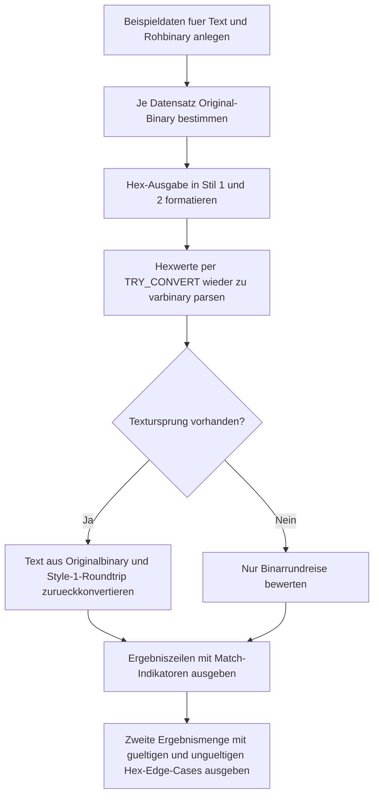

# BinaryHexRoundtripDemo.sql

Dieses Skript zeigt an kompakten Beispielen, wie SQL Server zwischen `NVARCHAR`, `VARBINARY` und Hex-Zeichenketten umwandelt. Der Fokus liegt auf reproduzierbaren Rundreisen mit `CONVERT` und `TRY_CONVERT`, nicht auf produktiven Binardatenformaten.

## Uebersicht

<!-- SQLDOC:SUMMARY_TABLE:BEGIN -->
| Feld | Wert |
|---|---|
| Script | [BinaryHexRoundtripDemo.sql](BinaryHexRoundtripDemo.sql) |
| Version | `1.0` |
| Typ | `didactic-lab` |
| Kapitel | `12_DataTypes_Conversion` |
| Sicherheit | `read-only-tempdb` |
| Zweck | Demonstriert Rundreisen zwischen Text, varbinary und Hex-Darstellung. |
<!-- SQLDOC:SUMMARY_TABLE:END -->

## Annahmen

Fuer diese Erstversion gelten folgende Annahmen:

- Die Demonstration soll ohne produktive Tabellen auskommen und nur mit eingebauten Beispielwerten arbeiten.
- Textbeispiele werden als `NVARCHAR` nach `VARBINARY` konvertiert, damit die gespeicherten Bytes von SQL Server sichtbar werden.
- Rohe Binardaten wie `0xCAFEF00D` werden nicht als verlasslicher Text interpretiert, sondern nur ueber Hex und `VARBINARY` rundgereist.

## Anwendungsfall

Das Skript eignet sich als Labor fuer folgende Fragen:

- Wann ist die Binarrundreise ueber Hex verlustfrei?
- Worin unterscheiden sich Hex-Stil `1` und `2`?
- Welche Hex-Eingaben schlagen bei `TRY_CONVERT` erwartbar fehl?

## Parameter

<!-- SQLDOC:PARAMETERS_TABLE:BEGIN -->
| Parameter | SQL-Typ | Pflicht | Beschreibung |
|---|---|---|---|
| `-` | `-` | `-` | Dieses Demoskript verwendet keine Laufzeitparameter. |
<!-- SQLDOC:PARAMETERS_TABLE:END -->

## Abhaengigkeiten

<!-- SQLDOC:DEPENDENCIES_LIST:BEGIN -->
- `CONVERT()`
- `TRY_CONVERT()`
- `varbinary`
- `varchar`
- `nvarchar`
<!-- SQLDOC:DEPENDENCIES_LIST:END -->

## Hinweise

- `CONVERT(varchar(...), <varbinary>, 1)` liefert ein `0x`-Praefix, Stil `2` nicht.
- `TRY_CONVERT(varbinary(...), <hex>, 1)` erwartet das Praefix, Stil `2` dagegen eine reine Hexzeichenkette.
- Eine Text-Rundreise ist nur fuer Werte sinnvoll ausgewiesen, die auch aus Text entstanden sind.

## Versionshistorie

<!-- SQLDOC:VERSION_HISTORY_TABLE:BEGIN -->
| Version | Datum | User | Beschreibung |
|---|---|---|---|
| `1.0` | `2026-04-18` | `ER` | Erstversion des Binary-Hex-Roundtrip-Demoskripts |
<!-- SQLDOC:VERSION_HISTORY_TABLE:END -->

## Ablauf

<!-- SQLDOC:MERMAID:BEGIN -->

<!-- SQLDOC:MERMAID:END -->

## SQL-Code

<!-- SQLDOC:SQL_CODE:BEGIN -->
```sql
/*
BEGIN:SQL-HEADER v1
---
sql_header: v1
script_name: "BinaryHexRoundtripDemo.sql"
script_version: "1.0"
script_type: "didactic-lab"
chapter: "12_DataTypes_Conversion"

purpose: >
  Demonstriert sichere Rundreisen zwischen Text, varbinary und Hex-Darstellung.
  Das Skript zeigt, wie SQL Server Hexwerte im Stil 1 und 2 formatiert, wieder
  zurueckliest und welche Sonderfaelle bei rohen Binardaten zu beachten sind.

parameters: []

result_sets:
  - name: "RoundtripOverview"
    description: "Vergleicht Ursprung, Hex-Formatierung und Binarrundreise pro Beispieldatensatz"
  - name: "HexEdgeCases"
    description: "Zeigt gueltige und ungueltige Hex-Eingaben fuer TRY_CONVERT"

dependencies:
  - "CONVERT()"
  - "TRY_CONVERT()"
  - "varbinary"
  - "varchar"
  - "nvarchar"

safety:
  level: "read-only-tempdb"
  writes_data: false

documentation:
  markdown_file: "T-SQL/12_DataTypes_Conversion/SQLScripts/BinaryHexRoundtripDemo.md"
  sync_blocks:
    - "SUMMARY_TABLE"
    - "PARAMETERS_TABLE"
    - "DEPENDENCIES_LIST"
    - "VERSION_HISTORY_TABLE"
    - "SQL_CODE"
  mermaid:
    mode: "ai-agent-from-sql"
    source: "script-body"

main_responsible:
  name: "Erhard Rainer"
  initials: "ER"

version_history:
  - version: "1.0"
    date: "2026-04-18"
    user: "ER"
    description: "Erstversion des Binary-Hex-Roundtrip-Demoskripts"

notes:
  - "Style 1 verwendet ein 0x-Praefix, Style 2 liefert nur die Hexzeichen."
  - "Text-zu-varbinary nutzt hier bewusst NVARCHAR, um die SQL-Server-internen Bytes sichtbar zu machen."
  - "Rohdaten ohne Textursprung werden nur binar rundgereist und nicht als NVARCHAR interpretiert."
---
END:SQL-HEADER v1
*/

SET NOCOUNT ON;

WITH SourceSamples AS
(
    SELECT
        1 AS SampleId,
        'nvarchar-source' AS SampleKind,
        'SimpleWord' AS SampleLabel,
        N'SQL' AS TextValue,
        CAST(NULL AS VARBINARY(64)) AS RawBinaryValue,
        'Kurzes NVARCHAR-Beispiel fuer Text-zu-Binary.' AS Notes

    UNION ALL

    SELECT
        2 AS SampleId,
        'nvarchar-source' AS SampleKind,
        'PipeSeparated' AS SampleLabel,
        N'0xCAFE|demo' AS TextValue,
        CAST(NULL AS VARBINARY(64)) AS RawBinaryValue,
        'Text enthaelt selbst eine 0x-Sequenz, die hier aber nur Zeicheninhalt ist.' AS Notes

    UNION ALL

    SELECT
        3 AS SampleId,
        'binary-source' AS SampleKind,
        'HandshakeBytes' AS SampleLabel,
        CAST(NULL AS NVARCHAR(100)) AS TextValue,
        0xCAFEF00D AS RawBinaryValue,
        'Rohes Binarmuster ohne garantierte Textbedeutung.' AS Notes
),
Normalized AS
(
    SELECT
        ss.SampleId,
        ss.SampleKind,
        ss.SampleLabel,
        ss.TextValue,
        COALESCE(ss.RawBinaryValue, CONVERT(VARBINARY(64), ss.TextValue)) AS BinaryValue,
        ss.Notes
    FROM SourceSamples AS ss
),
Formatted AS
(
    SELECT
        n.SampleId,
        n.SampleKind,
        n.SampleLabel,
        n.TextValue,
        n.BinaryValue,
        CONVERT(VARCHAR(130), n.BinaryValue, 1) AS HexStyle1,
        CONVERT(VARCHAR(130), n.BinaryValue, 2) AS HexStyle2,
        n.Notes
    FROM Normalized AS n
),
Roundtrip AS
(
    SELECT
        f.SampleId,
        f.SampleKind,
        f.SampleLabel,
        f.TextValue AS OriginalTextValue,
        f.BinaryValue AS OriginalBinaryValue,
        f.HexStyle1,
        f.HexStyle2,
        TRY_CONVERT(VARBINARY(64), f.HexStyle1, 1) AS BinaryFromStyle1,
        TRY_CONVERT(VARBINARY(64), f.HexStyle2, 2) AS BinaryFromStyle2,
        CASE
            WHEN f.TextValue IS NOT NULL THEN CONVERT(NVARCHAR(100), f.BinaryValue)
            ELSE NULL
        END AS TextFromOriginalBinary,
        CASE
            WHEN f.TextValue IS NOT NULL THEN CONVERT(NVARCHAR(100), TRY_CONVERT(VARBINARY(64), f.HexStyle1, 1))
            ELSE NULL
        END AS TextFromStyle1Roundtrip,
        f.Notes
    FROM Formatted AS f
)
SELECT
    r.SampleId,
    r.SampleKind,
    r.SampleLabel,
    r.OriginalTextValue,
    r.OriginalBinaryValue,
    r.HexStyle1,
    r.HexStyle2,
    r.BinaryFromStyle1,
    r.BinaryFromStyle2,
    CASE
        WHEN r.OriginalBinaryValue = r.BinaryFromStyle1
         AND r.OriginalBinaryValue = r.BinaryFromStyle2 THEN 1
        ELSE 0
    END AS BinaryRoundtripMatches,
    r.TextFromOriginalBinary,
    r.TextFromStyle1Roundtrip,
    CASE
        WHEN r.OriginalTextValue IS NULL THEN NULL
        WHEN r.OriginalTextValue = r.TextFromStyle1Roundtrip THEN 1
        ELSE 0
    END AS TextRoundtripMatches,
    r.Notes
FROM Roundtrip AS r
ORDER BY
    r.SampleId;

WITH HexEdgeCases AS
(
    SELECT
        'Style1Valid' AS CaseLabel,
        '0xCAFEF00D' AS HexInput,
        1 AS StyleCode,
        'Gueltiger Hexwert mit 0x-Praefix fuer Stil 1.' AS Notes

    UNION ALL

    SELECT
        'Style2Valid',
        'CAFEF00D',
        2,
        'Gueltiger Hexwert ohne Praefix fuer Stil 2.'

    UNION ALL

    SELECT
        'Style1MissingPrefix',
        'CAFEF00D',
        1,
        'Stil 1 erwartet ein 0x-Praefix und scheitert daher.'

    UNION ALL

    SELECT
        'Style2OddLength',
        'ABC',
        2,
        'Ungerade Anzahl an Hexzeichen fuehrt zu NULL bei TRY_CONVERT.'

    UNION ALL

    SELECT
        'Style2InvalidDigit',
        'ZZ12',
        2,
        'Nicht-hexadezimale Zeichen fuehren zu NULL bei TRY_CONVERT.'
)
SELECT
    hec.CaseLabel,
    hec.HexInput,
    hec.StyleCode,
    TRY_CONVERT(VARBINARY(64), hec.HexInput, hec.StyleCode) AS ParsedBinary,
    CASE
        WHEN TRY_CONVERT(VARBINARY(64), hec.HexInput, hec.StyleCode) IS NULL THEN 0
        ELSE 1
    END AS ParseSucceeded,
    hec.Notes
FROM HexEdgeCases AS hec
ORDER BY
    hec.CaseLabel;
```
<!-- SQLDOC:SQL_CODE:END -->
