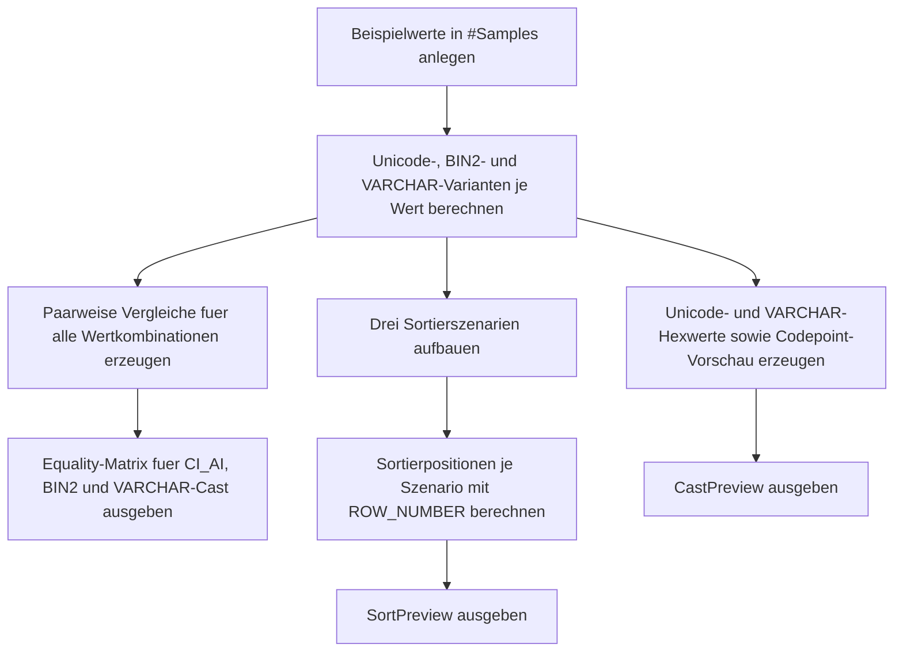

# CollationCastImpactDemo.sql

Dieses Skript zeigt an kleinen Beispielwerten, wie sich Vergleiche und Sortierungen aendern, sobald eine andere Kollation oder ein Cast von `NVARCHAR` nach `VARCHAR` ins Spiel kommt. Der Fokus liegt auf didaktisch gut sichtbaren Seiteneffekten bei Akzenten, Gross-/Kleinschreibung, Umlauten und Supplementary-Zeichen.

## Uebersicht

<!-- SQLDOC:SUMMARY_TABLE:BEGIN -->
| Feld | Wert |
|---|---|
| Script | [CollationCastImpactDemo.sql](CollationCastImpactDemo.sql) |
| Version | `1.0` |
| Typ | `didactic-lab` |
| Kapitel | `12_DataTypes_Conversion` |
| Sicherheit | `read-only-tempdb` |
| Zweck | Demonstriert Seiteneffekte von Kollations- und Typwechseln auf Vergleiche und Sortierung. |
<!-- SQLDOC:SUMMARY_TABLE:END -->

## Annahmen

Fuer diese Erstversion gelten folgende Annahmen:

- Die Demonstration soll ohne produktive Tabellen auskommen und nur mit eingebauten Beispielwerten arbeiten.
- Der sprachliche Unicode-Vergleich wird ueber `Latin1_General_100_CI_AI` modelliert, damit Akzent- und Gross-/Kleinschreibungseffekte gut sichtbar werden.
- Die binaere Sicht verwendet `Latin1_General_100_BIN2`, um byte- bzw. codepoint-nahe Unterschiede explizit zu machen.
- Der Cast nach `VARCHAR` dient als didaktisches Beispiel fuer codepage-basierte Seiteneffekte; insbesondere kann ein Zeichen wie das Emoji beim Cast nicht verlustfrei erhalten bleiben.

## Anwendungsfall

Das Skript eignet sich fuer folgende Leitfragen:

- Welche Textpaare gelten unter einer accent-insensitiven Unicode-Kollation als gleich, unter `BIN2` aber nicht?
- Wie veraendert ein Cast nach `VARCHAR` die Vergleichsbasis und die Sortierreihenfolge?
- Welche Zeichen werden im `VARCHAR`-Bild anders gespeichert als im `NVARCHAR`-Original?

## Parameter

<!-- SQLDOC:PARAMETERS_TABLE:BEGIN -->
| Parameter | SQL-Typ | Pflicht | Beschreibung |
|---|---|---|---|
| `-` | `-` | `-` | Dieses Demoskript verwendet keine Laufzeitparameter. |
<!-- SQLDOC:PARAMETERS_TABLE:END -->

## Abhaengigkeiten

<!-- SQLDOC:DEPENDENCIES_LIST:BEGIN -->
- `COLLATE`
- `CONVERT()`
- `UNICODE()`
- `ROW_NUMBER()`
- `sys.fn_varbintohexstr()`
<!-- SQLDOC:DEPENDENCIES_LIST:END -->

## Hinweise

- `Latin1_General_100_CI_AI` behandelt Akzente und Gross-/Kleinschreibung tolerant, was Gleichheiten wie die Plain- und Accent-Variante von `Cafe` sichtbar machen kann.
- `Latin1_General_100_BIN2` vergleicht die Zeichenfolge streng nach der zugrunde liegenden binaeren Ordnung.
- Ein Cast von `NVARCHAR` nach `VARCHAR` kann bei nicht voll abbildbaren Zeichen zu Ersetzungen oder anderen Seiteneffekten fuehren.
- Die dritte Ergebnismenge zeigt deshalb bewusst sowohl Textdarstellung als auch Hex-Darstellung vor und nach dem Cast.

## Versionshistorie

<!-- SQLDOC:VERSION_HISTORY_TABLE:BEGIN -->
| Version | Datum | User | Beschreibung |
|---|---|---|---|
| `1.0` | `2026-04-18` | `ER` | Erstversion des Kollations- und Cast-Impact-Demos |
<!-- SQLDOC:VERSION_HISTORY_TABLE:END -->

## Ablauf

<!-- SQLDOC:MERMAID:BEGIN -->

<!-- SQLDOC:MERMAID:END -->

## SQL-Code

<!-- SQLDOC:SQL_CODE:BEGIN -->
```sql
/*
BEGIN:SQL-HEADER v1
---
sql_header: v1
script_name: "CollationCastImpactDemo.sql"
script_version: "1.0"
script_type: "didactic-lab"
chapter: "12_DataTypes_Conversion"

purpose: >
  Demonstriert Seiteneffekte von Kollations- und Typwechseln auf Vergleiche
  und Sortierung. Das Skript stellt dieselben Beispielwerte unter einer
  accent-insensitiven Unicode-Kollation, einer binaeren Kollation und nach
  einem Cast nach VARCHAR gegenueber.

parameters: []

result_sets:
  - name: "ComparisonMatrix"
    description: "Paarweiser Vergleich derselben Texte unter drei Vergleichsstrategien"
  - name: "SortPreview"
    description: "Sortiervorschau fuer Unicode, binaere Kollation und VARCHAR-Cast"
  - name: "CastPreview"
    description: "Zeigt Unicode-, VARCHAR- und Hex-Darstellung der Beispielwerte"

dependencies:
  - "COLLATE"
  - "CONVERT()"
  - "UNICODE()"
  - "ROW_NUMBER()"
  - "sys.fn_varbintohexstr()"

safety:
  level: "read-only-tempdb"
  writes_data: false

documentation:
  markdown_file: "T-SQL/12_DataTypes_Conversion/SQLScripts/CollationCastImpactDemo.md"
  sync_blocks:
    - "SUMMARY_TABLE"
    - "PARAMETERS_TABLE"
    - "DEPENDENCIES_LIST"
    - "VERSION_HISTORY_TABLE"
    - "SQL_CODE"
  mermaid:
    mode: "ai-agent-from-sql"
    source: "script-body"

main_responsible:
  name: "Erhard Rainer"
  initials: "ER"

version_history:
  - version: "1.0"
    date: "2026-04-18"
    user: "ER"
    description: "Erstversion des Kollations- und Cast-Impact-Demos"

notes:
  - "Die Demo nutzt nur eingebaute Beispielwerte und keine produktiven Tabellen."
  - "Die accent-insensitive Sicht verwendet Latin1_General_100_CI_AI."
  - "Der VARCHAR-Cast nutzt SQL_Latin1_General_CP1_CI_AS als codepage-basierte Vergleichssicht."
---
END:SQL-HEADER v1
*/

SET NOCOUNT ON;

DROP TABLE IF EXISTS #Samples;

CREATE TABLE #Samples
(
    SampleId   INT            NOT NULL PRIMARY KEY,
    SampleLabel VARCHAR(30)   NOT NULL,
    SampleText NVARCHAR(100)  NOT NULL,
    Notes      VARCHAR(200)   NOT NULL
);

INSERT INTO #Samples
(
    SampleId,
    SampleLabel,
    SampleText,
    Notes
)
VALUES
    (1, 'CafePlain',     N'Cafe',   'ASCII-Basiswert ohne Akzent oder Gross-/Kleinschreibungseffekt.'),
    (2, 'CafeAccent',    N'Caf' + NCHAR(233),   'Akzentvariante fuer accent-sensitive und accent-insensitive Vergleiche.'),
    (3, 'CafeLower',     N'cafe',   'Kleinschreibungsvariante fuer case-insensitive Kollationen.'),
    (4, 'AlphaGerman',   N'Apfel',  'Einfacher Referenzwert fuer Sortiervergleiche.'),
    (5, 'AlphaUmlaut',   NCHAR(196) + N'pfel',  'Umlautbeispiel fuer sprachliche Sortierung und Codepage-Cast.'),
    (6, 'EmojiSuffix',   N'Data' + NCHAR(55357) + NCHAR(56832), 'Supplementary-Zeichen, das beim VARCHAR-Cast typischerweise ersetzt wird.');

WITH SampleVariants AS
(
    SELECT
        s.SampleId,
        s.SampleLabel,
        s.SampleText,
        s.SampleText COLLATE Latin1_General_100_CI_AI AS UnicodeCiAiText,
        s.SampleText COLLATE Latin1_General_100_BIN2 AS BinaryText,
        CONVERT(VARCHAR(100), s.SampleText) COLLATE SQL_Latin1_General_CP1_CI_AS AS CastVarcharText,
        sys.fn_varbintohexstr(CONVERT(VARBINARY(200), s.SampleText)) AS UnicodeHex,
        sys.fn_varbintohexstr(CONVERT(VARBINARY(200), CONVERT(VARCHAR(100), s.SampleText))) AS VarcharHex,
        s.Notes
    FROM #Samples AS s
),
ComparisonPairs AS
(
    SELECT
        left_sample.SampleLabel AS LeftLabel,
        left_sample.SampleText AS LeftText,
        right_sample.SampleLabel AS RightLabel,
        right_sample.SampleText AS RightText,
        CASE
            WHEN left_sample.UnicodeCiAiText = right_sample.UnicodeCiAiText THEN 1
            ELSE 0
        END AS EqualsUnderCiAi,
        CASE
            WHEN left_sample.BinaryText = right_sample.BinaryText THEN 1
            ELSE 0
        END AS EqualsUnderBin2,
        CASE
            WHEN left_sample.CastVarcharText = right_sample.CastVarcharText THEN 1
            ELSE 0
        END AS EqualsAfterVarcharCast,
        left_sample.CastVarcharText AS LeftAfterCast,
        right_sample.CastVarcharText AS RightAfterCast
    FROM SampleVariants AS left_sample
    INNER JOIN SampleVariants AS right_sample
        ON left_sample.SampleId < right_sample.SampleId
),
SortScenarios AS
(
    SELECT
        'Unicode_CI_AI' AS SortScenario,
        sv.SampleLabel,
        sv.SampleText,
        sv.SampleText COLLATE Latin1_General_100_CI_AI AS SortText,
        sv.Notes
    FROM SampleVariants AS sv

    UNION ALL

    SELECT
        'Unicode_BIN2' AS SortScenario,
        sv.SampleLabel,
        sv.SampleText,
        sv.SampleText COLLATE Latin1_General_100_BIN2 AS SortText,
        sv.Notes
    FROM SampleVariants AS sv

    UNION ALL

    SELECT
        'Cast_to_VARCHAR_CP1_CI_AS' AS SortScenario,
        sv.SampleLabel,
        sv.SampleText,
        CONVERT(NVARCHAR(100), sv.CastVarcharText) COLLATE SQL_Latin1_General_CP1_CI_AS AS SortText,
        sv.Notes
    FROM SampleVariants AS sv
)
SELECT
    cp.LeftLabel,
    cp.LeftText,
    cp.RightLabel,
    cp.RightText,
    cp.EqualsUnderCiAi,
    cp.EqualsUnderBin2,
    cp.EqualsAfterVarcharCast,
    cp.LeftAfterCast,
    cp.RightAfterCast
FROM ComparisonPairs AS cp
ORDER BY
    cp.LeftLabel,
    cp.RightLabel;

SELECT
    ss.SortScenario,
    ROW_NUMBER() OVER
    (
        PARTITION BY ss.SortScenario
        ORDER BY
            ss.SortText,
            ss.SampleLabel
    ) AS SortPosition,
    ss.SampleLabel,
    ss.SampleText,
    ss.SortText,
    ss.Notes
FROM SortScenarios AS ss
ORDER BY
    ss.SortScenario,
    SortPosition;

SELECT
    sv.SampleLabel,
    sv.SampleText,
    sv.CastVarcharText,
    sv.UnicodeHex,
    sv.VarcharHex,
    UNICODE(LEFT(sv.SampleText, 1)) AS FirstCodePoint,
    sv.Notes
FROM SampleVariants AS sv
ORDER BY
    sv.SampleId;
```
<!-- SQLDOC:SQL_CODE:END -->
