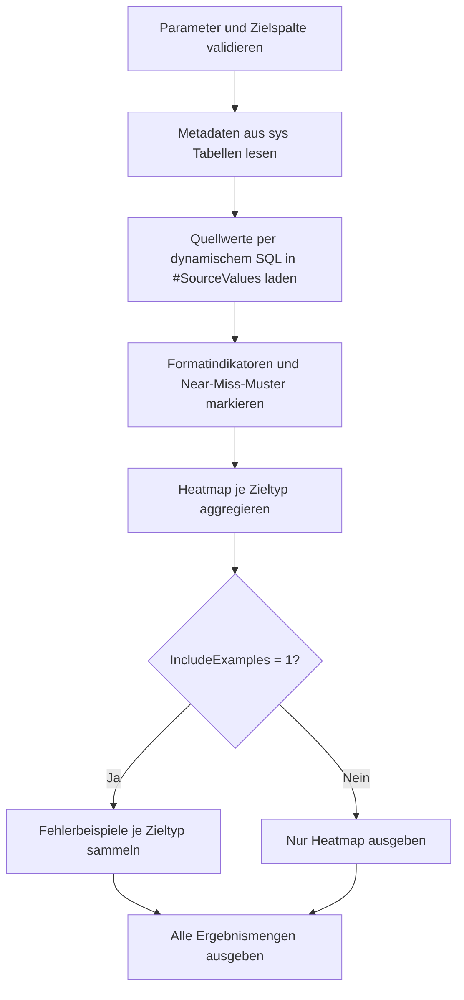

# ConversionFailureHeatmap.sql

Dieses Skript erstellt fuer eine zeichenbasierte Quellspalte eine Heatmap typischer Konvertierungsergebnisse. Bewertet werden Ganzzahlen, Dezimalwerte, ISO- und DACH-Datumsformate, ISO-Zeitstempel, GUIDs und einfache Wahr/Falsch-Tokens.

## Uebersicht

<!-- SQLDOC:SUMMARY_TABLE:BEGIN -->
| Feld | Wert |
|---|---|
| Script | [ConversionFailureHeatmap.sql](ConversionFailureHeatmap.sql) |
| Version | `1.0` |
| Typ | `diagnostic-query` |
| Kapitel | `12_DataTypes_Conversion` |
| Sicherheit | `read-only-tempdb` |
| Zweck | Erstellt fuer eine Quellspalte eine Heatmap typischer Konvertierungsergebnisse und Fehlerbeispiele. |
<!-- SQLDOC:SUMMARY_TABLE:END -->

## Annahmen

- Die Eingabespalte ist eine zeichenbasierte Import- oder Staging-Spalte.
- `NULL`- und Blank-Werte werden separat ausgewiesen und nicht als harte Fehlkonvertierung gezaehlt.
- `NearMissRows` markiert fachlich oft rettbare Muster wie Dezimalkomma oder lokales Datumsformat.
- Fuer `BIT` gelten `0`, `1`, `true`, `false`, `yes`, `no`, `y`, `n` als technisch lesbare Token.

## Parameter

<!-- SQLDOC:PARAMETERS_TABLE:BEGIN -->
| Parameter | SQL-Typ | Pflicht | Beschreibung |
|---|---|---|---|
| `@SchemaName` | `sysname` | Ja | Schema der zu analysierenden Quelltabelle. |
| `@TableName` | `sysname` | Ja | Tabelle der zu analysierenden Quellspalte. |
| `@ColumnName` | `sysname` | Ja | Zeichenbasierte Quellspalte mit potentiellen Konvertierungswerten. |
| `@MaxSampleRows` | `INT` | Nein | Optionales Zeilenlimit fuer die Analyse; `NULL` liest die gesamte Spalte. |
| `@IncludeExamples` | `BIT` | Nein | Gibt bei `1` eine zweite Ergebnismenge mit Fehlerbeispielen aus. |
<!-- SQLDOC:PARAMETERS_TABLE:END -->

## Abhaengigkeiten

<!-- SQLDOC:DEPENDENCIES_LIST:BEGIN -->
- `sys.schemas`
- `sys.tables`
- `sys.columns`
- `sys.types`
- `TRY_CONVERT()`
- `sp_executesql`
- temporaere Tabellen in `tempdb`
<!-- SQLDOC:DEPENDENCIES_LIST:END -->

## Hinweise

- Die Heatmap sortiert nach Schweregrad, damit riskante Zieltypen zuerst sichtbar werden.
- `FailureExamples` liefert pro Zieltyp einige konkrete Werte fuer Bereinigung oder Mapping.
- Ohne `@MaxSampleRows` kann die Analyse auf grossen Staging-Tabellen teuer werden.

## Versionshistorie

<!-- SQLDOC:VERSION_HISTORY_TABLE:BEGIN -->
| Version | Datum | User | Beschreibung |
|---|---|---|---|
| `1.0` | `2026-04-18` | `ER` | Erstversion der Conversion-Failure-Heatmap fuer zeichenbasierte Quellspalten |
<!-- SQLDOC:VERSION_HISTORY_TABLE:END -->

## Ablauf

<!-- SQLDOC:MERMAID:BEGIN -->

<!-- SQLDOC:MERMAID:END -->

## SQL-Code

<!-- SQLDOC:SQL_CODE:BEGIN -->
```sql
/*
BEGIN:SQL-HEADER v1
---
sql_header: v1
script_name: "ConversionFailureHeatmap.sql"
script_version: "1.0"
script_type: "diagnostic-query"
chapter: "12_DataTypes_Conversion"

purpose: >
  Erstellt fuer eine ausgewaehlte Quellspalte eine Heatmap typischer
  Konvertierungsergebnisse. Das Skript bewertet pro Zieltyp, wie viele
  Werte leer, erfolgreich konvertierbar oder vermutlich problematisch sind
  und liefert zusaetzlich Beispieldaten fuer fehlgeschlagene Muster.

parameters:
  - name: "@SchemaName"
    sql_type: "sysname"
    direction: "IN"
    required: true
    description: "Schema der zu analysierenden Quelltabelle"
  - name: "@TableName"
    sql_type: "sysname"
    direction: "IN"
    required: true
    description: "Tabelle der zu analysierenden Quellspalte"
  - name: "@ColumnName"
    sql_type: "sysname"
    direction: "IN"
    required: true
    description: "Zeichenbasierte Quellspalte mit potentiellen Konvertierungswerten"
  - name: "@MaxSampleRows"
    sql_type: "INT"
    direction: "IN"
    required: false
    description: "Optionales Zeilenlimit fuer die Analyse; NULL = gesamte Spalte"
  - name: "@IncludeExamples"
    sql_type: "BIT"
    direction: "IN"
    required: false
    description: "1 = zweite Ergebnismenge mit Fehlerbeispielen ausgeben"

result_sets:
  - name: "ConversionFailureHeatmap"
    description: "Heatmap pro Zieltyp mit Erfolgs-, Fehler- und Risikoquote"
  - name: "FailureExamples"
    description: "Beispielwerte mit vermuteten Fehlerkategorien fuer fehlgeschlagene Konvertierungen"

dependencies:
  - "sys.schemas"
  - "sys.tables"
  - "sys.columns"
  - "sys.types"
  - "TRY_CONVERT()"
  - "sp_executesql"
  - "temporary tables"

safety:
  level: "read-only-tempdb"
  writes_data: false

documentation:
  markdown_file: "T-SQL/12_DataTypes_Conversion/SQLScripts/ConversionFailureHeatmap.md"
  sync_blocks:
    - "SUMMARY_TABLE"
    - "PARAMETERS_TABLE"
    - "DEPENDENCIES_LIST"
    - "VERSION_HISTORY_TABLE"
    - "SQL_CODE"
  mermaid:
    mode: "ai-agent-from-sql"
    source: "script-body"

main_responsible:
  name: "Erhard Rainer"
  initials: "ER"

version_history:
  - version: "1.0"
    date: "2026-04-18"
    user: "ER"
    description: "Erstversion der Conversion-Failure-Heatmap fuer zeichenbasierte Quellspalten"

notes:
  - "Die Analyse ist auf char-, varchar-, nchar- und nvarchar-Spalten ausgelegt."
  - "Blank- und NULL-Werte werden separat ausgewiesen und nicht als harte Fehlkonvertierung gezaehlt."
  - "Datumspruefungen unterscheiden bewusst zwischen ISO- und deutschsprachigen Formaten."
---
END:SQL-HEADER v1
*/

SET NOCOUNT ON;

DECLARE @SchemaName      SYSNAME = N'dbo';
DECLARE @TableName       SYSNAME = N'StageImport';
DECLARE @ColumnName      SYSNAME = N'RawValue';
DECLARE @MaxSampleRows   INT     = 50000;
DECLARE @IncludeExamples BIT     = 1;

IF LTRIM(RTRIM(COALESCE(@SchemaName, N''))) = N''
BEGIN
    THROW 50000, '@SchemaName ist erforderlich.', 1;
END;

IF LTRIM(RTRIM(COALESCE(@TableName, N''))) = N''
BEGIN
    THROW 50001, '@TableName ist erforderlich.', 1;
END;

IF LTRIM(RTRIM(COALESCE(@ColumnName, N''))) = N''
BEGIN
    THROW 50002, '@ColumnName ist erforderlich.', 1;
END;

IF @MaxSampleRows IS NOT NULL AND @MaxSampleRows <= 0
BEGIN
    THROW 50003, '@MaxSampleRows muss NULL oder groesser als 0 sein.', 1;
END;

IF @IncludeExamples NOT IN (0, 1)
BEGIN
    THROW 50004, '@IncludeExamples muss 0 oder 1 sein.', 1;
END;

DECLARE
    @ObjectId       INT,
    @ColumnId       INT,
    @DataTypeName   SYSNAME,
    @TypeDefinition NVARCHAR(128),
    @Sql            NVARCHAR(MAX);

SELECT
    @ObjectId = t.object_id
FROM sys.tables AS t
INNER JOIN sys.schemas AS s
    ON s.schema_id = t.schema_id
WHERE s.name = @SchemaName
  AND t.name = @TableName
  AND t.is_ms_shipped = 0;

IF @ObjectId IS NULL
BEGIN
    THROW 50005, 'Die angegebene Tabelle wurde nicht gefunden.', 1;
END;

SELECT
    @ColumnId = c.column_id,
    @DataTypeName = ty.name,
    @TypeDefinition =
        ty.name
        + N'('
        + CASE
            WHEN c.max_length = -1 THEN N'max'
            WHEN ty.name IN (N'nchar', N'nvarchar') THEN CONVERT(NVARCHAR(10), c.max_length / 2)
            ELSE CONVERT(NVARCHAR(10), c.max_length)
          END
        + N')'
FROM sys.columns AS c
INNER JOIN sys.types AS ty
    ON ty.user_type_id = c.user_type_id
WHERE c.object_id = @ObjectId
  AND c.name = @ColumnName;

IF @ColumnId IS NULL
BEGIN
    THROW 50006, 'Die angegebene Spalte wurde nicht gefunden.', 1;
END;

IF @DataTypeName NOT IN (N'char', N'varchar', N'nchar', N'nvarchar')
BEGIN
    THROW 50007, 'Die Heatmap unterstuetzt nur zeichenbasierte Quellspalten.', 1;
END;

DROP TABLE IF EXISTS #SourceValues;
DROP TABLE IF EXISTS #Heatmap;
DROP TABLE IF EXISTS #FailureExamples;

CREATE TABLE #SourceValues
(
    RowId                    INT             NOT NULL,
    RawValue                 NVARCHAR(4000)  NULL,
    NormalizedValue          NVARCHAR(4000)  NULL,
    CharacterLength          INT             NULL,
    ByteLength               INT             NULL,
    IsNullValue              BIT             NOT NULL,
    IsBlankValue             BIT             NOT NULL,
    LooksLikeDecimalComma    BIT             NOT NULL,
    LooksLikeIsoDate         BIT             NOT NULL,
    LooksLikeGermanDate      BIT             NOT NULL,
    LooksLikeUsDate          BIT             NOT NULL,
    LooksLikeGuidShape       BIT             NOT NULL,
    LooksLikeBitToken        BIT             NOT NULL
);

CREATE TABLE #Heatmap
(
    TargetType               VARCHAR(40)    NOT NULL,
    ConversionPattern        VARCHAR(80)    NOT NULL,
    TotalRows                INT            NOT NULL,
    NullRows                 INT            NOT NULL,
    BlankRows                INT            NOT NULL,
    SuccessRows              INT            NOT NULL,
    FailureRows              INT            NOT NULL,
    NearMissRows             INT            NOT NULL,
    SuccessRatePct           DECIMAL(5,2)   NOT NULL,
    FailureRatePct           DECIMAL(5,2)   NOT NULL,
    Severity                 VARCHAR(10)    NOT NULL,
    SeverityRank             INT            NOT NULL,
    Interpretation           NVARCHAR(300)  NOT NULL
);

CREATE TABLE #FailureExamples
(
    TargetType               VARCHAR(40)    NOT NULL,
    ConversionPattern        VARCHAR(80)    NOT NULL,
    FailureCategory          VARCHAR(80)    NOT NULL,
    SampleValue              NVARCHAR(4000) NULL,
    CharacterLength          INT            NULL,
    ByteLength               INT            NULL
);

SET @Sql =
    N'
INSERT INTO #SourceValues
(
    RowId,
    RawValue,
    NormalizedValue,
    CharacterLength,
    ByteLength,
    IsNullValue,
    IsBlankValue,
    LooksLikeDecimalComma,
    LooksLikeIsoDate,
    LooksLikeGermanDate,
    LooksLikeUsDate,
    LooksLikeGuidShape,
    LooksLikeBitToken
)
SELECT
    ROW_NUMBER() OVER (ORDER BY (SELECT 0)) AS RowId,
    TRY_CONVERT(NVARCHAR(4000), src.' + QUOTENAME(@ColumnName) + N') AS RawValue,
    CASE
        WHEN src.' + QUOTENAME(@ColumnName) + N' IS NULL THEN NULL
        ELSE LTRIM(RTRIM(TRY_CONVERT(NVARCHAR(4000), src.' + QUOTENAME(@ColumnName) + N')))
    END AS NormalizedValue,
    CASE
        WHEN src.' + QUOTENAME(@ColumnName) + N' IS NULL THEN NULL
        ELSE LEN(TRY_CONVERT(NVARCHAR(4000), src.' + QUOTENAME(@ColumnName) + N'))
    END AS CharacterLength,
    CASE
        WHEN src.' + QUOTENAME(@ColumnName) + N' IS NULL THEN NULL
        ELSE DATALENGTH(TRY_CONVERT(NVARCHAR(4000), src.' + QUOTENAME(@ColumnName) + N'))
    END AS ByteLength,
    CASE WHEN src.' + QUOTENAME(@ColumnName) + N' IS NULL THEN 1 ELSE 0 END AS IsNullValue,
    CASE
        WHEN src.' + QUOTENAME(@ColumnName) + N' IS NULL THEN 0
        WHEN LTRIM(RTRIM(TRY_CONVERT(NVARCHAR(4000), src.' + QUOTENAME(@ColumnName) + N'))) = N'''' THEN 1
        ELSE 0
    END AS IsBlankValue,
    CASE
        WHEN src.' + QUOTENAME(@ColumnName) + N' IS NULL THEN 0
        WHEN LTRIM(RTRIM(TRY_CONVERT(NVARCHAR(4000), src.' + QUOTENAME(@ColumnName) + N'))) LIKE N''%,%''
         AND LTRIM(RTRIM(TRY_CONVERT(NVARCHAR(4000), src.' + QUOTENAME(@ColumnName) + N'))) NOT LIKE N''%.%''
            THEN 1
        ELSE 0
    END AS LooksLikeDecimalComma,
    CASE WHEN TRY_CONVERT(DATE, LTRIM(RTRIM(TRY_CONVERT(NVARCHAR(4000), src.' + QUOTENAME(@ColumnName) + N'))), 23) IS NOT NULL THEN 1 ELSE 0 END AS LooksLikeIsoDate,
    CASE WHEN TRY_CONVERT(DATE, LTRIM(RTRIM(TRY_CONVERT(NVARCHAR(4000), src.' + QUOTENAME(@ColumnName) + N'))), 104) IS NOT NULL THEN 1 ELSE 0 END AS LooksLikeGermanDate,
    CASE WHEN TRY_CONVERT(DATE, LTRIM(RTRIM(TRY_CONVERT(NVARCHAR(4000), src.' + QUOTENAME(@ColumnName) + N'))), 101) IS NOT NULL THEN 1 ELSE 0 END AS LooksLikeUsDate,
    CASE
        WHEN src.' + QUOTENAME(@ColumnName) + N' IS NULL THEN 0
        WHEN LTRIM(RTRIM(TRY_CONVERT(NVARCHAR(4000), src.' + QUOTENAME(@ColumnName) + N'))) LIKE
             N''[0-9A-Fa-f][0-9A-Fa-f][0-9A-Fa-f][0-9A-Fa-f][0-9A-Fa-f][0-9A-Fa-f][0-9A-Fa-f][0-9A-Fa-f]-[0-9A-Fa-f][0-9A-Fa-f][0-9A-Fa-f][0-9A-Fa-f]-[0-9A-Fa-f][0-9A-Fa-f][0-9A-Fa-f][0-9A-Fa-f]-[0-9A-Fa-f][0-9A-Fa-f][0-9A-Fa-f][0-9A-Fa-f]-[0-9A-Fa-f][0-9A-Fa-f][0-9A-Fa-f][0-9A-Fa-f][0-9A-Fa-f][0-9A-Fa-f][0-9A-Fa-f][0-9A-Fa-f][0-9A-Fa-f][0-9A-Fa-f][0-9A-Fa-f][0-9A-Fa-f]'' THEN 1
        ELSE 0
    END AS LooksLikeGuidShape,
    CASE
        WHEN LOWER(LTRIM(RTRIM(TRY_CONVERT(NVARCHAR(4000), src.' + QUOTENAME(@ColumnName) + N')))) IN (N''0'', N''1'', N''true'', N''false'', N''yes'', N''no'', N''y'', N''n'') THEN 1
        ELSE 0
    END AS LooksLikeBitToken
FROM ' + QUOTENAME(@SchemaName) + N'.' + QUOTENAME(@TableName) + N' AS src'
    + CASE
        WHEN @MaxSampleRows IS NULL THEN N';'
        ELSE N' ORDER BY (SELECT 0) OFFSET 0 ROWS FETCH NEXT ' + CONVERT(NVARCHAR(20), @MaxSampleRows) + N' ROWS ONLY;'
      END;

EXEC sys.sp_executesql @Sql;

IF NOT EXISTS (SELECT 1 FROM #SourceValues)
BEGIN
    THROW 50008, 'Die angegebene Quellspalte liefert keine analysierbaren Zeilen.', 1;
END;

INSERT INTO #Heatmap
(
    TargetType,
    ConversionPattern,
    TotalRows,
    NullRows,
    BlankRows,
    SuccessRows,
    FailureRows,
    NearMissRows,
    SuccessRatePct,
    FailureRatePct,
    Severity,
    SeverityRank,
    Interpretation
)
SELECT
    metrics.TargetType,
    metrics.ConversionPattern,
    metrics.TotalRows,
    metrics.NullRows,
    metrics.BlankRows,
    metrics.SuccessRows,
    metrics.FailureRows,
    metrics.NearMissRows,
    COALESCE(CONVERT(DECIMAL(5,2), 100.0 * metrics.SuccessRows / NULLIF(metrics.TotalRows - metrics.NullRows - metrics.BlankRows, 0)), 0),
    COALESCE(CONVERT(DECIMAL(5,2), 100.0 * metrics.FailureRows / NULLIF(metrics.TotalRows - metrics.NullRows - metrics.BlankRows, 0)), 0),
    CASE
        WHEN metrics.FailureRows = 0 THEN 'none'
        WHEN 1.0 * metrics.FailureRows / NULLIF(metrics.TotalRows - metrics.NullRows - metrics.BlankRows, 0) >= 0.50 THEN 'high'
        WHEN 1.0 * metrics.FailureRows / NULLIF(metrics.TotalRows - metrics.NullRows - metrics.BlankRows, 0) >= 0.15 THEN 'medium'
        ELSE 'low'
    END,
    CASE
        WHEN metrics.FailureRows = 0 THEN 4
        WHEN 1.0 * metrics.FailureRows / NULLIF(metrics.TotalRows - metrics.NullRows - metrics.BlankRows, 0) >= 0.50 THEN 1
        WHEN 1.0 * metrics.FailureRows / NULLIF(metrics.TotalRows - metrics.NullRows - metrics.BlankRows, 0) >= 0.15 THEN 2
        ELSE 3
    END,
    metrics.Interpretation
FROM
(
    SELECT 'BIGINT' AS TargetType, 'whole-number parse' AS ConversionPattern, COUNT(*) AS TotalRows,
           SUM(CASE WHEN sv.IsNullValue = 1 THEN 1 ELSE 0 END) AS NullRows,
           SUM(CASE WHEN sv.IsBlankValue = 1 THEN 1 ELSE 0 END) AS BlankRows,
           SUM(CASE WHEN sv.IsNullValue = 0 AND sv.IsBlankValue = 0 AND TRY_CONVERT(BIGINT, sv.NormalizedValue) IS NOT NULL THEN 1 ELSE 0 END) AS SuccessRows,
           SUM(CASE WHEN sv.IsNullValue = 0 AND sv.IsBlankValue = 0 AND TRY_CONVERT(BIGINT, sv.NormalizedValue) IS NULL THEN 1 ELSE 0 END) AS FailureRows,
           SUM(CASE WHEN sv.IsNullValue = 0 AND sv.IsBlankValue = 0 AND (sv.LooksLikeDecimalComma = 1 OR sv.NormalizedValue LIKE N'%.%') THEN 1 ELSE 0 END) AS NearMissRows,
           N'Bewertet, wie viele Werte ohne Nachbearbeitung als Ganzzahl lesbar sind.' AS Interpretation
    FROM #SourceValues AS sv
    UNION ALL
    SELECT 'DECIMAL(18,4)', 'invariant decimal parse', COUNT(*),
           SUM(CASE WHEN sv.IsNullValue = 1 THEN 1 ELSE 0 END),
           SUM(CASE WHEN sv.IsBlankValue = 1 THEN 1 ELSE 0 END),
           SUM(CASE WHEN sv.IsNullValue = 0 AND sv.IsBlankValue = 0 AND TRY_CONVERT(DECIMAL(18,4), sv.NormalizedValue) IS NOT NULL THEN 1 ELSE 0 END),
           SUM(CASE WHEN sv.IsNullValue = 0 AND sv.IsBlankValue = 0 AND TRY_CONVERT(DECIMAL(18,4), sv.NormalizedValue) IS NULL THEN 1 ELSE 0 END),
           SUM(CASE WHEN sv.IsNullValue = 0 AND sv.IsBlankValue = 0 AND sv.LooksLikeDecimalComma = 1 THEN 1 ELSE 0 END),
           N'Zeigt numerische Werte, die unter Invariant-Format lesbar sind; Dezimalkomma-Faelle erscheinen als Near Miss.'
    FROM #SourceValues AS sv
    UNION ALL
    SELECT 'DATE', 'ISO yyyy-mm-dd', COUNT(*),
           SUM(CASE WHEN sv.IsNullValue = 1 THEN 1 ELSE 0 END),
           SUM(CASE WHEN sv.IsBlankValue = 1 THEN 1 ELSE 0 END),
           SUM(CASE WHEN sv.IsNullValue = 0 AND sv.IsBlankValue = 0 AND TRY_CONVERT(DATE, sv.NormalizedValue, 23) IS NOT NULL THEN 1 ELSE 0 END),
           SUM(CASE WHEN sv.IsNullValue = 0 AND sv.IsBlankValue = 0 AND TRY_CONVERT(DATE, sv.NormalizedValue, 23) IS NULL THEN 1 ELSE 0 END),
           SUM(CASE WHEN sv.IsNullValue = 0 AND sv.IsBlankValue = 0 AND (sv.LooksLikeGermanDate = 1 OR sv.LooksLikeUsDate = 1) THEN 1 ELSE 0 END),
           N'Prueft ISO-Datumswerte und zeigt alternative lokale Datumsformate als potenzielle Fehlermuster.'
    FROM #SourceValues AS sv
    UNION ALL
    SELECT 'DATE', 'German dd.mm.yyyy', COUNT(*),
           SUM(CASE WHEN sv.IsNullValue = 1 THEN 1 ELSE 0 END),
           SUM(CASE WHEN sv.IsBlankValue = 1 THEN 1 ELSE 0 END),
           SUM(CASE WHEN sv.IsNullValue = 0 AND sv.IsBlankValue = 0 AND TRY_CONVERT(DATE, sv.NormalizedValue, 104) IS NOT NULL THEN 1 ELSE 0 END),
           SUM(CASE WHEN sv.IsNullValue = 0 AND sv.IsBlankValue = 0 AND TRY_CONVERT(DATE, sv.NormalizedValue, 104) IS NULL THEN 1 ELSE 0 END),
           SUM(CASE WHEN sv.IsNullValue = 0 AND sv.IsBlankValue = 0 AND (sv.LooksLikeIsoDate = 1 OR sv.LooksLikeUsDate = 1) THEN 1 ELSE 0 END),
           N'Spiegelt ein DACH-Importmuster; ISO- oder US-Daten werden als Nahe-Treffer sichtbar.'
    FROM #SourceValues AS sv
    UNION ALL
    SELECT 'DATETIME2(0)', 'ISO8601 timestamp', COUNT(*),
           SUM(CASE WHEN sv.IsNullValue = 1 THEN 1 ELSE 0 END),
           SUM(CASE WHEN sv.IsBlankValue = 1 THEN 1 ELSE 0 END),
           SUM(CASE WHEN sv.IsNullValue = 0 AND sv.IsBlankValue = 0 AND (TRY_CONVERT(DATETIME2(0), sv.NormalizedValue, 126) IS NOT NULL OR TRY_CONVERT(DATETIME2(0), sv.NormalizedValue, 121) IS NOT NULL OR TRY_CONVERT(DATETIME2(0), sv.NormalizedValue, 120) IS NOT NULL) THEN 1 ELSE 0 END),
           SUM(CASE WHEN sv.IsNullValue = 0 AND sv.IsBlankValue = 0 AND (TRY_CONVERT(DATETIME2(0), sv.NormalizedValue, 126) IS NULL AND TRY_CONVERT(DATETIME2(0), sv.NormalizedValue, 121) IS NULL AND TRY_CONVERT(DATETIME2(0), sv.NormalizedValue, 120) IS NULL) THEN 1 ELSE 0 END),
           SUM(CASE WHEN sv.IsNullValue = 0 AND sv.IsBlankValue = 0 AND sv.LooksLikeIsoDate = 1 THEN 1 ELSE 0 END),
           N'Hebt hervor, ob Zeitanteile oder ISO-Zeitstempel fehlen, obwohl ein Datumsanteil bereits sauber ist.'
    FROM #SourceValues AS sv
    UNION ALL
    SELECT 'UNIQUEIDENTIFIER', 'guid parse', COUNT(*),
           SUM(CASE WHEN sv.IsNullValue = 1 THEN 1 ELSE 0 END),
           SUM(CASE WHEN sv.IsBlankValue = 1 THEN 1 ELSE 0 END),
           SUM(CASE WHEN sv.IsNullValue = 0 AND sv.IsBlankValue = 0 AND TRY_CONVERT(UNIQUEIDENTIFIER, sv.NormalizedValue) IS NOT NULL THEN 1 ELSE 0 END),
           SUM(CASE WHEN sv.IsNullValue = 0 AND sv.IsBlankValue = 0 AND TRY_CONVERT(UNIQUEIDENTIFIER, sv.NormalizedValue) IS NULL THEN 1 ELSE 0 END),
           SUM(CASE WHEN sv.IsNullValue = 0 AND sv.IsBlankValue = 0 AND sv.LooksLikeGuidShape = 1 THEN 1 ELSE 0 END),
           N'Unterscheidet klar gueltige GUIDs von Zeichenketten, die nur oberflaechlich wie GUIDs aussehen.'
    FROM #SourceValues AS sv
    UNION ALL
    SELECT 'BIT', 'boolean token map', COUNT(*),
           SUM(CASE WHEN sv.IsNullValue = 1 THEN 1 ELSE 0 END),
           SUM(CASE WHEN sv.IsBlankValue = 1 THEN 1 ELSE 0 END),
           SUM(CASE WHEN sv.IsNullValue = 0 AND sv.IsBlankValue = 0 AND sv.LooksLikeBitToken = 1 THEN 1 ELSE 0 END),
           SUM(CASE WHEN sv.IsNullValue = 0 AND sv.IsBlankValue = 0 AND sv.LooksLikeBitToken = 0 THEN 1 ELSE 0 END),
           SUM(CASE WHEN sv.IsNullValue = 0 AND sv.IsBlankValue = 0 AND LOWER(sv.NormalizedValue) IN (N't', N'f', N'ja', N'nein') THEN 1 ELSE 0 END),
           N'Bewertet einfache Wahr/Falsch-Tokens fuer Importspalten und zeigt sprachliche Varianten als Near Miss.'
    FROM #SourceValues AS sv
) AS metrics;

IF @IncludeExamples = 1
BEGIN
    INSERT INTO #FailureExamples
    SELECT TOP (5) 'BIGINT', 'whole-number parse',
           CASE WHEN sv.LooksLikeDecimalComma = 1 OR sv.NormalizedValue LIKE N'%.%' THEN 'fractional_or_separator'
                WHEN PATINDEX(N'%[^0-9+-]%', sv.NormalizedValue) > 0 THEN 'non_numeric_characters'
                ELSE 'overflow_or_unclassified' END,
           sv.RawValue, sv.CharacterLength, sv.ByteLength
    FROM #SourceValues AS sv
    WHERE sv.IsNullValue = 0 AND sv.IsBlankValue = 0 AND TRY_CONVERT(BIGINT, sv.NormalizedValue) IS NULL
    ORDER BY sv.RowId;
    INSERT INTO #FailureExamples
    SELECT TOP (5) 'DECIMAL(18,4)', 'invariant decimal parse',
           CASE WHEN sv.LooksLikeDecimalComma = 1 THEN 'decimal_comma_locale'
                WHEN PATINDEX(N'%[^0-9,.+-]%', sv.NormalizedValue) > 0 THEN 'non_numeric_characters'
                ELSE 'overflow_or_unclassified' END,
           sv.RawValue, sv.CharacterLength, sv.ByteLength
    FROM #SourceValues AS sv
    WHERE sv.IsNullValue = 0 AND sv.IsBlankValue = 0 AND TRY_CONVERT(DECIMAL(18,4), sv.NormalizedValue) IS NULL
    ORDER BY sv.RowId;
    INSERT INTO #FailureExamples
    SELECT TOP (5) 'DATE', 'ISO yyyy-mm-dd',
           CASE WHEN sv.LooksLikeGermanDate = 1 THEN 'german_date_in_iso_pipeline'
                WHEN sv.LooksLikeUsDate = 1 THEN 'us_date_in_iso_pipeline'
                ELSE 'invalid_date_token' END,
           sv.RawValue, sv.CharacterLength, sv.ByteLength
    FROM #SourceValues AS sv
    WHERE sv.IsNullValue = 0 AND sv.IsBlankValue = 0 AND TRY_CONVERT(DATE, sv.NormalizedValue, 23) IS NULL
    ORDER BY sv.RowId;
    INSERT INTO #FailureExamples
    SELECT TOP (5) 'DATE', 'German dd.mm.yyyy',
           CASE WHEN sv.LooksLikeIsoDate = 1 THEN 'iso_date_in_german_pipeline'
                WHEN sv.LooksLikeUsDate = 1 THEN 'us_date_in_german_pipeline'
                ELSE 'invalid_date_token' END,
           sv.RawValue, sv.CharacterLength, sv.ByteLength
    FROM #SourceValues AS sv
    WHERE sv.IsNullValue = 0 AND sv.IsBlankValue = 0 AND TRY_CONVERT(DATE, sv.NormalizedValue, 104) IS NULL
    ORDER BY sv.RowId;
    INSERT INTO #FailureExamples
    SELECT TOP (5) 'DATETIME2(0)', 'ISO8601 timestamp',
           CASE WHEN sv.LooksLikeIsoDate = 1 THEN 'date_without_time_component' ELSE 'non_iso_timestamp' END,
           sv.RawValue, sv.CharacterLength, sv.ByteLength
    FROM #SourceValues AS sv
    WHERE sv.IsNullValue = 0 AND sv.IsBlankValue = 0
      AND TRY_CONVERT(DATETIME2(0), sv.NormalizedValue, 126) IS NULL
      AND TRY_CONVERT(DATETIME2(0), sv.NormalizedValue, 121) IS NULL
      AND TRY_CONVERT(DATETIME2(0), sv.NormalizedValue, 120) IS NULL
    ORDER BY sv.RowId;
    INSERT INTO #FailureExamples
    SELECT TOP (5) 'UNIQUEIDENTIFIER', 'guid parse',
           CASE WHEN sv.LooksLikeGuidShape = 1 THEN 'guid_shape_but_invalid_value'
                WHEN LEN(sv.NormalizedValue) <> 36 THEN 'unexpected_guid_length'
                ELSE 'non_guid_text' END,
           sv.RawValue, sv.CharacterLength, sv.ByteLength
    FROM #SourceValues AS sv
    WHERE sv.IsNullValue = 0 AND sv.IsBlankValue = 0 AND TRY_CONVERT(UNIQUEIDENTIFIER, sv.NormalizedValue) IS NULL
    ORDER BY sv.RowId;
    INSERT INTO #FailureExamples
    SELECT TOP (5) 'BIT', 'boolean token map',
           CASE WHEN LOWER(sv.NormalizedValue) IN (N't', N'f', N'ja', N'nein') THEN 'language_specific_boolean'
                ELSE 'unsupported_boolean_token' END,
           sv.RawValue, sv.CharacterLength, sv.ByteLength
    FROM #SourceValues AS sv
    WHERE sv.IsNullValue = 0 AND sv.IsBlankValue = 0 AND sv.LooksLikeBitToken = 0
    ORDER BY sv.RowId;
END;

SELECT
    hm.TargetType,
    hm.ConversionPattern,
    hm.TotalRows,
    hm.NullRows,
    hm.BlankRows,
    hm.SuccessRows,
    hm.FailureRows,
    hm.NearMissRows,
    hm.SuccessRatePct,
    hm.FailureRatePct,
    hm.Severity,
    hm.Interpretation,
    @SchemaName AS SourceSchema,
    @TableName AS SourceTable,
    @ColumnName AS SourceColumn,
    @TypeDefinition AS SourceType
FROM #Heatmap AS hm
ORDER BY
    hm.SeverityRank,
    hm.TargetType,
    hm.ConversionPattern;

IF @IncludeExamples = 1
BEGIN
    SELECT
        fe.TargetType,
        fe.ConversionPattern,
        fe.FailureCategory,
        fe.SampleValue,
        fe.CharacterLength,
        fe.ByteLength
    FROM #FailureExamples AS fe
    ORDER BY
        fe.TargetType,
        fe.ConversionPattern,
        fe.FailureCategory,
        fe.SampleValue;
END;
```
<!-- SQLDOC:SQL_CODE:END -->
