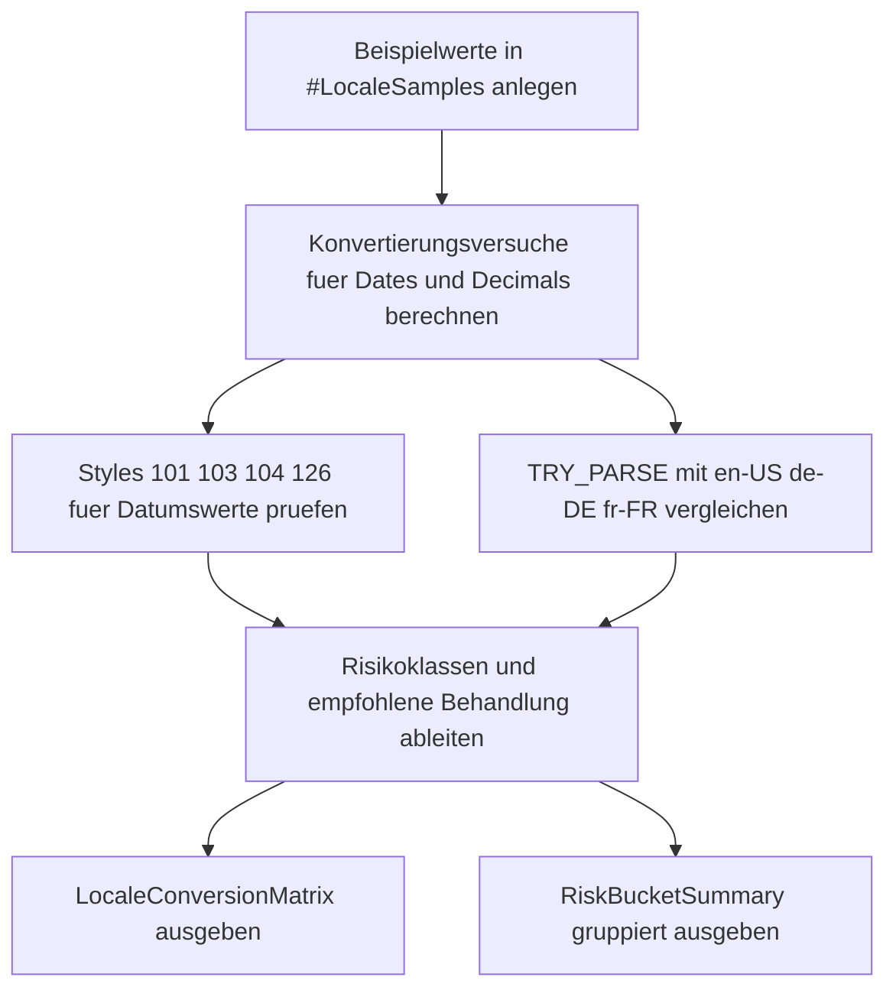

# ConversionLocaleMismatchProbe.sql

Dieses Skript zeigt an didaktischen Beispielwerten, wie stark Datums- und Zahlenkonvertierungen von stillschweigend angenommenen Formaten und Kulturen abhaengen koennen. Es vergleicht mehrere `TRY_CONVERT`- und `TRY_PARSE`-Varianten direkt nebeneinander, damit Fehlinterpretationen und robuste Gegenmuster leicht erkennbar werden.

## Uebersicht

<!-- SQLDOC:SUMMARY_TABLE:BEGIN -->
| Feld | Wert |
|---|---|
| Script | [ConversionLocaleMismatchProbe.sql](ConversionLocaleMismatchProbe.sql) |
| Version | `1.0` |
| Typ | `didactic-lab` |
| Kapitel | `12_DataTypes_Conversion` |
| Sicherheit | `read-only-tempdb` |
| Zweck | Prueft Konvertierungsrisiken durch unterschiedliche Locale- und Formatannahmen. |
<!-- SQLDOC:SUMMARY_TABLE:END -->

## Annahmen

Fuer diese Erstversion gelten folgende Annahmen:

- Die Demonstration arbeitet ausschliesslich mit eingebauten Textwerten und ohne produktive Tabellen.
- Als Vergleichskulturen werden `en-US`, `de-DE` und `fr-FR` verwendet, weil sie typische Unterschiede bei Dezimal- und Datumsformaten zeigen.
- ISO-8601 wird als neutraler Referenzfall verwendet, um ein stabiles Datumsformat dem mehrdeutigen Slash-Format gegenueberzustellen.
- Das Skript soll Konvertierungsrisiken sichtbar machen, nicht eine globale Normalisierungslogik fuer alle Kulturen vollstaendig abbilden.

## Anwendungsfall

Das Skript eignet sich fuer folgende Leitfragen:

- Welche Datumswerte liefern unter `101` und `103` unterschiedliche Ergebnisse?
- Welche Zahlendarstellungen funktionieren nur unter einer bestimmten Kultur und fuehren unter einer anderen zu anderen Werten oder `NULL`?
- Wann sollte ein Eingabewert vor der Konvertierung normalisiert oder durch ein explizites ISO-/Style-Format ersetzt werden?

## Parameter

<!-- SQLDOC:PARAMETERS_TABLE:BEGIN -->
| Parameter | SQL-Typ | Pflicht | Beschreibung |
|---|---|---|---|
| `-` | `-` | `-` | Dieses Demoskript verwendet keine Laufzeitparameter. |
<!-- SQLDOC:PARAMETERS_TABLE:END -->

## Abhaengigkeiten

<!-- SQLDOC:DEPENDENCIES_LIST:BEGIN -->
- `TRY_CONVERT()`
- `TRY_PARSE()`
- `DATE`
- `DECIMAL`
- `CASE`
<!-- SQLDOC:DEPENDENCIES_LIST:END -->

## Hinweise

- `TRY_CONVERT(..., style)` eignet sich besonders fuer Datumswerte mit bekanntem Layout; die Beispiele `101` und `103` zeigen bewusst gegensaetzliche Interpretationen desselben Slash-Formats.
- `TRY_PARSE(... USING culture)` ist fuer kulturabhaengige Eingaben didaktisch hilfreich, macht die Locale-Annahme aber explizit zum Teil der Logik.
- Zahlwerte wie `1.234,56` und `1,234.56` sind nur dann stabil verarbeitbar, wenn der erwartete Kulturkontext feststeht.
- Die zweite Ergebnismenge verdichtet die Einzelbeispiele auf Risiko-Kategorien und formuliert einen knappen Handhabungshinweis.

## Versionshistorie

<!-- SQLDOC:VERSION_HISTORY_TABLE:BEGIN -->
| Version | Datum | User | Beschreibung |
|---|---|---|---|
| `1.0` | `2026-04-18` | `ER` | Erstversion des Locale-Mismatch-Probe-Demos |
<!-- SQLDOC:VERSION_HISTORY_TABLE:END -->

## Ablauf

<!-- SQLDOC:MERMAID:BEGIN -->

<!-- SQLDOC:MERMAID:END -->

## SQL-Code

<!-- SQLDOC:SQL_CODE:BEGIN -->
```sql
/*
BEGIN:SQL-HEADER v1
---
sql_header: v1
script_name: "ConversionLocaleMismatchProbe.sql"
script_version: "1.0"
script_type: "didactic-lab"
chapter: "12_DataTypes_Conversion"

purpose: >
  Prueft Konvertierungsrisiken durch unterschiedliche Locale- und
  Formatannahmen. Das Skript stellt dieselben Eingabewerte mehreren
  Datums- und Zahlenkonvertierungen gegenueber, damit Fehlinterpretationen,
  Mehrdeutigkeiten und erwartete Erfolgsfaelle sichtbar werden.

parameters: []

result_sets:
  - name: "LocaleConversionMatrix"
    description: "Zeigt je Beispielwert die Ergebnisse mehrerer Date- und Decimal-Konvertierungsstrategien"
  - name: "RiskBucketSummary"
    description: "Fasst die Beispiele nach Risiko- und Handhabungshinweis zusammen"

dependencies:
  - "TRY_CONVERT()"
  - "TRY_PARSE()"
  - "DATE"
  - "DECIMAL"
  - "CASE"

safety:
  level: "read-only-tempdb"
  writes_data: false

documentation:
  markdown_file: "T-SQL/12_DataTypes_Conversion/SQLScripts/ConversionLocaleMismatchProbe.md"
  sync_blocks:
    - "SUMMARY_TABLE"
    - "PARAMETERS_TABLE"
    - "DEPENDENCIES_LIST"
    - "VERSION_HISTORY_TABLE"
    - "SQL_CODE"
  mermaid:
    mode: "ai-agent-from-sql"
    source: "script-body"

main_responsible:
  name: "Erhard Rainer"
  initials: "ER"

version_history:
  - version: "1.0"
    date: "2026-04-18"
    user: "ER"
    description: "Erstversion des Locale-Mismatch-Probe-Demos"

notes:
  - "Die Demo nutzt nur eingebaute Textwerte und keine produktiven Tabellen."
  - "Datumswerte werden parallel ueber Styles 101, 103, 104 und 126 sowie TRY_PARSE mit mehreren Kulturen bewertet."
  - "Zahlwerte werden nur per TRY_PARSE mit Kulturen verglichen, weil tausender- und dezimaltrennende Formate kulturabhaengig sind."
---
END:SQL-HEADER v1
*/

SET NOCOUNT ON;

DROP TABLE IF EXISTS #LocaleSamples;

CREATE TABLE #LocaleSamples
(
    SampleId            INT            NOT NULL PRIMARY KEY,
    SampleLabel         VARCHAR(40)    NOT NULL,
    SampleCategory      VARCHAR(20)    NOT NULL,
    RawValue            NVARCHAR(100)  NOT NULL,
    ExpectedLocale      VARCHAR(10)    NOT NULL,
    ExpectedMeaning     VARCHAR(100)   NOT NULL,
    Notes               VARCHAR(220)   NOT NULL
);

INSERT INTO #LocaleSamples
(
    SampleId,
    SampleLabel,
    SampleCategory,
    RawValue,
    ExpectedLocale,
    ExpectedMeaning,
    Notes
)
VALUES
    (1, 'Amount_DE_Comma',      'decimal', N'1.234,56',      'de-DE', '1234.56',    'Deutsches Zahlenformat mit Punkt als Tausendertrennzeichen und Komma als Dezimaltrennzeichen.'),
    (2, 'Amount_US_Dot',        'decimal', N'1,234.56',      'en-US', '1234.56',    'US-Zahlenformat mit Komma als Tausendertrennzeichen und Punkt als Dezimaltrennzeichen.'),
    (3, 'Amount_FR_Space',      'decimal', N'1 234,56',      'fr-FR', '1234.56',    'Franzoesische Schreibweise mit Leerzeichen als Tausendertrennzeichen.'),
    (4, 'Date_DMY_Ambiguous',   'date',    N'03/04/2026',    'de-DE', '2026-04-03', 'Slash-Format, das je nach Locale als 3. April oder 4. Maerz gelesen werden kann.'),
    (5, 'Date_MDY_Ambiguous',   'date',    N'04/03/2026',    'en-US', '2026-04-03', 'Dasselbe Muster mit bewusst gegenteiliger Erwartung im US-Kontext.'),
    (6, 'Date_ISO_Stable',      'date',    N'2026-04-18',    'neutral','2026-04-18','ISO-8601-Format als didaktischer Referenzfall fuer stabile Datumsinterpretation.'),
    (7, 'Date_EN_MonthName',    'date',    N'April 18, 2026','en-US', '2026-04-18', 'Monatsname auf Englisch fuer TRY_PARSE mit Sprachbezug.'),
    (8, 'Date_DE_MonthName',    'date',    N'18. April 2026','de-DE', '2026-04-18', 'Monatsname auf Deutsch fuer TRY_PARSE mit Sprachbezug.');

WITH ConversionAttempts AS
(
    SELECT
        s.SampleId,
        s.SampleLabel,
        s.SampleCategory,
        s.RawValue,
        s.ExpectedLocale,
        s.ExpectedMeaning,
        s.Notes,
        CASE
            WHEN s.SampleCategory = 'date' THEN TRY_CONVERT(DATE, s.RawValue, 101)
            ELSE NULL
        END AS DateStyle101,
        CASE
            WHEN s.SampleCategory = 'date' THEN TRY_CONVERT(DATE, s.RawValue, 103)
            ELSE NULL
        END AS DateStyle103,
        CASE
            WHEN s.SampleCategory = 'date' THEN TRY_CONVERT(DATE, s.RawValue, 104)
            ELSE NULL
        END AS DateStyle104,
        CASE
            WHEN s.SampleCategory = 'date' THEN TRY_CONVERT(DATE, s.RawValue, 126)
            ELSE NULL
        END AS DateStyle126,
        CASE
            WHEN s.SampleCategory = 'date' THEN TRY_PARSE(s.RawValue AS DATE USING 'en-US')
            ELSE NULL
        END AS ParseDateEnUs,
        CASE
            WHEN s.SampleCategory = 'date' THEN TRY_PARSE(s.RawValue AS DATE USING 'de-DE')
            ELSE NULL
        END AS ParseDateDeDe,
        CASE
            WHEN s.SampleCategory = 'date' THEN TRY_PARSE(s.RawValue AS DATE USING 'fr-FR')
            ELSE NULL
        END AS ParseDateFrFr,
        CASE
            WHEN s.SampleCategory = 'decimal' THEN TRY_PARSE(s.RawValue AS DECIMAL(18,2) USING 'en-US')
            ELSE NULL
        END AS ParseDecimalEnUs,
        CASE
            WHEN s.SampleCategory = 'decimal' THEN TRY_PARSE(s.RawValue AS DECIMAL(18,2) USING 'de-DE')
            ELSE NULL
        END AS ParseDecimalDeDe,
        CASE
            WHEN s.SampleCategory = 'decimal' THEN TRY_PARSE(s.RawValue AS DECIMAL(18,2) USING 'fr-FR')
            ELSE NULL
        END AS ParseDecimalFrFr
    FROM #LocaleSamples AS s
),
RiskAssessment AS
(
    SELECT
        ca.SampleId,
        ca.SampleLabel,
        ca.SampleCategory,
        ca.RawValue,
        ca.ExpectedLocale,
        ca.ExpectedMeaning,
        ca.Notes,
        ca.DateStyle101,
        ca.DateStyle103,
        ca.DateStyle104,
        ca.DateStyle126,
        ca.ParseDateEnUs,
        ca.ParseDateDeDe,
        ca.ParseDateFrFr,
        ca.ParseDecimalEnUs,
        ca.ParseDecimalDeDe,
        ca.ParseDecimalFrFr,
        CASE
            WHEN ca.SampleCategory = 'date'
             AND ca.DateStyle101 IS NOT NULL
             AND ca.DateStyle103 IS NOT NULL
             AND ca.DateStyle101 <> ca.DateStyle103 THEN 'ambiguous-date'
            WHEN ca.SampleCategory = 'date'
             AND (
                    (ca.ExpectedLocale = 'en-US' AND ca.ParseDateEnUs IS NULL)
                 OR (ca.ExpectedLocale = 'de-DE' AND ca.ParseDateDeDe IS NULL)
                 OR (ca.ExpectedLocale = 'fr-FR' AND ca.ParseDateFrFr IS NULL)
                 OR (ca.ExpectedLocale = 'neutral' AND ca.DateStyle126 IS NULL)
                 ) THEN 'expected-locale-fails'
            WHEN ca.SampleCategory = 'decimal'
             AND (
                    (ca.ExpectedLocale = 'en-US' AND ca.ParseDecimalEnUs IS NULL)
                 OR (ca.ExpectedLocale = 'de-DE' AND ca.ParseDecimalDeDe IS NULL)
                 OR (ca.ExpectedLocale = 'fr-FR' AND ca.ParseDecimalFrFr IS NULL)
                 ) THEN 'expected-locale-fails'
            WHEN ca.SampleCategory = 'decimal'
             AND (
                    (ca.ParseDecimalEnUs IS NOT NULL AND ca.ParseDecimalDeDe IS NOT NULL AND ca.ParseDecimalEnUs <> ca.ParseDecimalDeDe)
                 OR (ca.ParseDecimalEnUs IS NOT NULL AND ca.ParseDecimalFrFr IS NOT NULL AND ca.ParseDecimalEnUs <> ca.ParseDecimalFrFr)
                 OR (ca.ParseDecimalDeDe IS NOT NULL AND ca.ParseDecimalFrFr IS NOT NULL AND ca.ParseDecimalDeDe <> ca.ParseDecimalFrFr)
                 ) THEN 'locale-sensitive-number'
            WHEN ca.SampleCategory = 'date'
             AND ca.DateStyle126 IS NOT NULL THEN 'stable-iso-date'
            ELSE 'locale-aware-but-consistent'
        END AS RiskBucket,
        CASE
            WHEN ca.SampleCategory = 'date'
             AND ca.DateStyle101 IS NOT NULL
             AND ca.DateStyle103 IS NOT NULL
             AND ca.DateStyle101 <> ca.DateStyle103
                THEN 'Expliziten Style oder ISO-8601 verwenden; Slash-Format nicht implizit interpretieren.'
            WHEN ca.SampleCategory = 'decimal'
             AND (
                    (ca.ParseDecimalEnUs IS NOT NULL AND ca.ParseDecimalDeDe IS NOT NULL AND ca.ParseDecimalEnUs <> ca.ParseDecimalDeDe)
                 OR (ca.ParseDecimalEnUs IS NOT NULL AND ca.ParseDecimalFrFr IS NOT NULL AND ca.ParseDecimalEnUs <> ca.ParseDecimalFrFr)
                 OR (ca.ParseDecimalDeDe IS NOT NULL AND ca.ParseDecimalFrFr IS NOT NULL AND ca.ParseDecimalDeDe <> ca.ParseDecimalFrFr)
                 )
                THEN 'Vor der Konvertierung Locale festlegen oder Trennzeichen kontrolliert normalisieren.'
            WHEN ca.SampleCategory = 'date' AND ca.DateStyle126 IS NOT NULL
                THEN 'ISO-8601 kann meist ohne zusaetzliche Locale-Annahme verarbeitet werden.'
            ELSE 'TRY_PARSE oder TRY_CONVERT nur mit dokumentierter Erwartung fuer Format und Kultur einsetzen.'
        END AS RecommendedHandling
    FROM ConversionAttempts AS ca
)
SELECT
    ra.SampleId,
    ra.SampleLabel,
    ra.SampleCategory,
    ra.RawValue,
    ra.ExpectedLocale,
    ra.ExpectedMeaning,
    ra.DateStyle101,
    ra.DateStyle103,
    ra.DateStyle104,
    ra.DateStyle126,
    ra.ParseDateEnUs,
    ra.ParseDateDeDe,
    ra.ParseDateFrFr,
    ra.ParseDecimalEnUs,
    ra.ParseDecimalDeDe,
    ra.ParseDecimalFrFr,
    ra.RiskBucket,
    ra.RecommendedHandling,
    ra.Notes
FROM RiskAssessment AS ra
ORDER BY
    ra.SampleId;

SELECT
    ra.SampleCategory,
    ra.RiskBucket,
    COUNT(*) AS SampleCount,
    MIN(ra.RecommendedHandling) AS RecommendedHandling
FROM RiskAssessment AS ra
GROUP BY
    ra.SampleCategory,
    ra.RiskBucket
ORDER BY
    ra.SampleCategory,
    ra.RiskBucket;
```
<!-- SQLDOC:SQL_CODE:END -->
