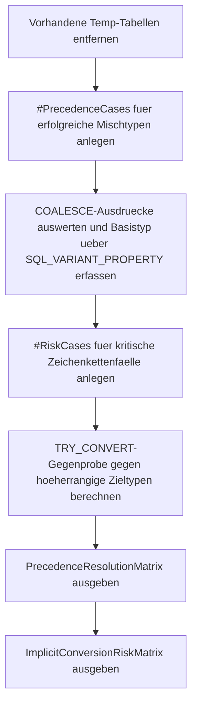

# ConversionPrecedenceSandbox.sql

Dieses Skript baut eine kompakte Sandbox fuer Typ-Prioritaeten in SQL Server. Es zeigt zuerst erfolgreiche Aufloesungen gemischter Typfamilien und spiegelt danach riskante Zeichenkettenfaelle ueber `TRY_CONVERT`, damit die implizite Zieltypwahl nicht nur abstrakt bleibt.

## Uebersicht

<!-- SQLDOC:SUMMARY_TABLE:BEGIN -->
| Feld | Wert |
|---|---|
| Script | [ConversionPrecedenceSandbox.sql](ConversionPrecedenceSandbox.sql) |
| Version | `1.0` |
| Typ | `didactic-lab` |
| Kapitel | `12_DataTypes_Conversion` |
| Sicherheit | `read-only-tempdb` |
| Zweck | Zeigt Datentyp-Prioritaeten und riskante implizite Zieltypen an kompakten Mischfaellen. |
<!-- SQLDOC:SUMMARY_TABLE:END -->

## Annahmen

Fuer diese Erstversion gelten folgende Annahmen:

- Die Demonstration arbeitet ausschliesslich mit eingebauten Beispielwerten und legt keine produktiven Objekte an.
- `COALESCE` dient als kompaktes Labor fuer die gemeinsame Typaufloesung, weil SQL Server dort den Rueckgabetyp aus allen beteiligten Typen bestimmt.
- Riskante Mischungen wie `VARCHAR` gegen `INT` oder `DATETIME2` werden nicht absichtlich als Laufzeitfehler ausgefuehrt, sondern ueber `TRY_CONVERT` kontrolliert gespiegelt.

## Anwendungsfall

Das Skript eignet sich fuer folgende Leitfragen:

- Welcher Typ gewinnt, wenn zwei kompatible Typfamilien in einem gemeinsamen Ausdruck landen?
- Wann fuehrt eine zeichenbasierte Eingabe voraussichtlich problemlos in den hoeherrangigen Zieltyp und wann nicht?
- Welche Eingabeformate sind fuer spaetere implizite Konvertierungen robust genug und welche sollten vorab normalisiert werden?

## Parameter

<!-- SQLDOC:PARAMETERS_TABLE:BEGIN -->
| Parameter | SQL-Typ | Pflicht | Beschreibung |
|---|---|---|---|
| `-` | `-` | `-` | Dieses Demoskript verwendet keine Laufzeitparameter. |
<!-- SQLDOC:PARAMETERS_TABLE:END -->

## Abhaengigkeiten

<!-- SQLDOC:DEPENDENCIES_LIST:BEGIN -->
- `COALESCE()`
- `TRY_CONVERT()`
- `SQL_VARIANT_PROPERTY()`
- `temporary tables`
- `CASE`
<!-- SQLDOC:DEPENDENCIES_LIST:END -->

## Hinweise

- Die erste Ergebnismenge zeigt bewusst nur erfolgreiche Beispiele, damit der resultierende Basistyp ueber `SQL_VARIANT_PROPERTY` sichtbar gemacht werden kann.
- Die zweite Ergebnismenge ist als Gegenprobe gedacht: Wenn ein niedriger priorisierter Textwert in einen hoeherrangigen Zieltyp gedrueckt wuerde, zeigt `TRY_CONVERT`, ob das Muster robust, lokalsensitiv oder fehleranfaellig ist.
- Besonders bei `VARCHAR` gegen `INT`, `DECIMAL` oder `DATETIME2` ist die eigentliche Fachfrage oft nicht nur "welcher Typ gewinnt", sondern "ist die Eingabe fuer diesen Zieltyp stabil genug".

## Versionshistorie

<!-- SQLDOC:VERSION_HISTORY_TABLE:BEGIN -->
| Version | Datum | User | Beschreibung |
|---|---|---|---|
| `1.0` | `2026-04-18` | `ER` | Erstversion des Conversion-Precedence-Sandbox-Demos |
<!-- SQLDOC:VERSION_HISTORY_TABLE:END -->

## Ablauf

<!-- SQLDOC:MERMAID:BEGIN -->

<!-- SQLDOC:MERMAID:END -->

## SQL-Code

<!-- SQLDOC:SQL_CODE:BEGIN -->
```sql
/*
BEGIN:SQL-HEADER v1
---
sql_header: v1
script_name: "ConversionPrecedenceSandbox.sql"
script_version: "1.0"
script_type: "didactic-lab"
chapter: "12_DataTypes_Conversion"

purpose: >
  Zeigt an kompakten Beispielen, wie SQL Server bei gemischten Datentypen den
  Zieltyp aufloest. Das Skript kombiniert erfolgreiche Aufloesungen ueber
  COALESCE mit einer zweiten Sicht auf riskante implizite Konvertierungen, bei
  denen zeichenbasierte Eingaben in hoeherrangige Zieltypen gedrueckt werden.

parameters: []

result_sets:
  - name: "PrecedenceResolutionMatrix"
    description: "Zeigt erfolgreiche Typaufloesungen, resultierende Basistypen und Beispielwerte"
  - name: "ImplicitConversionRiskMatrix"
    description: "Stellt riskante Zeichenketten gegen den erwarteten Zieltyp und eine TRY_CONVERT-Gegenprobe"

dependencies:
  - "COALESCE()"
  - "TRY_CONVERT()"
  - "SQL_VARIANT_PROPERTY()"
  - "temporary tables"
  - "CASE"

safety:
  level: "read-only-tempdb"
  writes_data: false

documentation:
  markdown_file: "T-SQL/12_DataTypes_Conversion/SQLScripts/ConversionPrecedenceSandbox.md"
  sync_blocks:
    - "SUMMARY_TABLE"
    - "PARAMETERS_TABLE"
    - "DEPENDENCIES_LIST"
    - "VERSION_HISTORY_TABLE"
    - "SQL_CODE"
  mermaid:
    mode: "ai-agent-from-sql"
    source: "script-body"

main_responsible:
  name: "Erhard Rainer"
  initials: "ER"

version_history:
  - version: "1.0"
    date: "2026-04-18"
    user: "ER"
    description: "Erstversion des Conversion-Precedence-Sandbox-Demos"

notes:
  - "Die Demo arbeitet nur mit eingebauten Beispielwerten und tempdb-sicheren Objekten."
  - "COALESCE dient hier als kompakter Mechanismus, um die gemeinsame Typaufloesung sichtbar zu machen."
  - "Riskante Mischungen werden nicht ueber fehlschlagende implizite Laufzeitausdruecke provoziert, sondern ueber TRY_CONVERT didaktisch abgesichert gespiegelt."
---
END:SQL-HEADER v1
*/

SET NOCOUNT ON;

DROP TABLE IF EXISTS #PrecedenceCases;
DROP TABLE IF EXISTS #RiskCases;

CREATE TABLE #PrecedenceCases
(
    CaseId                   INT            NOT NULL PRIMARY KEY,
    ScenarioLabel            VARCHAR(80)    NOT NULL,
    UsagePattern             VARCHAR(40)    NOT NULL,
    LeftType                 VARCHAR(40)    NOT NULL,
    RightType                VARCHAR(40)    NOT NULL,
    ExpectedTargetType       VARCHAR(40)    NOT NULL,
    ExpressionPreview        VARCHAR(220)   NOT NULL,
    ResolvedValueText        NVARCHAR(200)  NOT NULL,
    ResolvedBaseType         SYSNAME        NOT NULL,
    ResolvedPrecision        INT            NULL,
    ResolvedScale            INT            NULL,
    Notes                    VARCHAR(220)   NOT NULL
);

INSERT INTO #PrecedenceCases
(
    CaseId,
    ScenarioLabel,
    UsagePattern,
    LeftType,
    RightType,
    ExpectedTargetType,
    ExpressionPreview,
    ResolvedValueText,
    ResolvedBaseType,
    ResolvedPrecision,
    ResolvedScale,
    Notes
)
SELECT
    v.CaseId,
    v.ScenarioLabel,
    v.UsagePattern,
    v.LeftType,
    v.RightType,
    v.ExpectedTargetType,
    v.ExpressionPreview,
    v.ResolvedValueText,
    v.ResolvedBaseType,
    v.ResolvedPrecision,
    v.ResolvedScale,
    v.Notes
FROM
(
    SELECT
        1 AS CaseId,
        'INT_vs_DECIMAL' AS ScenarioLabel,
        'COALESCE' AS UsagePattern,
        'INT' AS LeftType,
        'DECIMAL(10,2)' AS RightType,
        'decimal' AS ExpectedTargetType,
        'COALESCE(CAST(NULL AS INT), CAST(125.75 AS DECIMAL(10,2)))' AS ExpressionPreview,
        CONVERT(NVARCHAR(200), COALESCE(CAST(NULL AS INT), CAST(125.75 AS DECIMAL(10,2)))) AS ResolvedValueText,
        SQL_VARIANT_PROPERTY(CONVERT(SQL_VARIANT, COALESCE(CAST(NULL AS INT), CAST(125.75 AS DECIMAL(10,2)))), 'BaseType') AS ResolvedBaseType,
        SQL_VARIANT_PROPERTY(CONVERT(SQL_VARIANT, COALESCE(CAST(NULL AS INT), CAST(125.75 AS DECIMAL(10,2)))), 'Precision') AS ResolvedPrecision,
        SQL_VARIANT_PROPERTY(CONVERT(SQL_VARIANT, COALESCE(CAST(NULL AS INT), CAST(125.75 AS DECIMAL(10,2)))), 'Scale') AS ResolvedScale,
        'Der numerische Ausdruck wird auf den praeziseren Decimal-Typ angehoben.' AS Notes

    UNION ALL

    SELECT
        2,
        'SMALLINT_vs_BIGINT',
        'COALESCE',
        'SMALLINT',
        'BIGINT',
        'bigint',
        'COALESCE(CAST(NULL AS SMALLINT), CAST(9000000000 AS BIGINT))',
        CONVERT(NVARCHAR(200), COALESCE(CAST(NULL AS SMALLINT), CAST(9000000000 AS BIGINT))),
        SQL_VARIANT_PROPERTY(CONVERT(SQL_VARIANT, COALESCE(CAST(NULL AS SMALLINT), CAST(9000000000 AS BIGINT))), 'BaseType'),
        SQL_VARIANT_PROPERTY(CONVERT(SQL_VARIANT, COALESCE(CAST(NULL AS SMALLINT), CAST(9000000000 AS BIGINT))), 'Precision'),
        SQL_VARIANT_PROPERTY(CONVERT(SQL_VARIANT, COALESCE(CAST(NULL AS SMALLINT), CAST(9000000000 AS BIGINT))), 'Scale'),
        'Innerhalb der Integer-Familie gewinnt der groessere Bereich.'

    UNION ALL

    SELECT
        3,
        'DECIMAL_vs_FLOAT',
        'COALESCE',
        'DECIMAL(10,4)',
        'FLOAT',
        'float',
        'COALESCE(CAST(NULL AS DECIMAL(10,4)), CAST(0.5E0 AS FLOAT))',
        CONVERT(NVARCHAR(200), COALESCE(CAST(NULL AS DECIMAL(10,4)), CAST(0.5E0 AS FLOAT))),
        SQL_VARIANT_PROPERTY(CONVERT(SQL_VARIANT, COALESCE(CAST(NULL AS DECIMAL(10,4)), CAST(0.5E0 AS FLOAT))), 'BaseType'),
        SQL_VARIANT_PROPERTY(CONVERT(SQL_VARIANT, COALESCE(CAST(NULL AS DECIMAL(10,4)), CAST(0.5E0 AS FLOAT))), 'Precision'),
        SQL_VARIANT_PROPERTY(CONVERT(SQL_VARIANT, COALESCE(CAST(NULL AS DECIMAL(10,4)), CAST(0.5E0 AS FLOAT))), 'Scale'),
        'Approximate Numerics koennen Decimal-Ausdruecke in Richtung FLOAT ziehen.'

    UNION ALL

    SELECT
        4,
        'DATE_vs_DATETIME2',
        'COALESCE',
        'DATE',
        'DATETIME2(0)',
        'datetime2',
        'COALESCE(CAST(NULL AS DATE), CAST(''2026-04-18T10:30:00'' AS DATETIME2(0)))',
        CONVERT(NVARCHAR(200), COALESCE(CAST(NULL AS DATE), CAST('2026-04-18T10:30:00' AS DATETIME2(0))), 120),
        SQL_VARIANT_PROPERTY(CONVERT(SQL_VARIANT, COALESCE(CAST(NULL AS DATE), CAST('2026-04-18T10:30:00' AS DATETIME2(0)))), 'BaseType'),
        SQL_VARIANT_PROPERTY(CONVERT(SQL_VARIANT, COALESCE(CAST(NULL AS DATE), CAST('2026-04-18T10:30:00' AS DATETIME2(0)))), 'Precision'),
        SQL_VARIANT_PROPERTY(CONVERT(SQL_VARIANT, COALESCE(CAST(NULL AS DATE), CAST('2026-04-18T10:30:00' AS DATETIME2(0)))), 'Scale'),
        'Zeitanteile bleiben erhalten, wenn der hoeherrangige Datums-/Zeittyp gewinnt.'

    UNION ALL

    SELECT
        5,
        'VARCHAR_vs_NVARCHAR',
        'COALESCE',
        'VARCHAR(20)',
        'NVARCHAR(20)',
        'nvarchar',
        'COALESCE(CAST(NULL AS VARCHAR(20)), CAST(N''Muenchen'' AS NVARCHAR(20)))',
        CONVERT(NVARCHAR(200), COALESCE(CAST(NULL AS VARCHAR(20)), CAST(N'Muenchen' AS NVARCHAR(20)))),
        SQL_VARIANT_PROPERTY(CONVERT(SQL_VARIANT, COALESCE(CAST(NULL AS VARCHAR(20)), CAST(N'Muenchen' AS NVARCHAR(20)))), 'BaseType'),
        SQL_VARIANT_PROPERTY(CONVERT(SQL_VARIANT, COALESCE(CAST(NULL AS VARCHAR(20)), CAST(N'Muenchen' AS NVARCHAR(20)))), 'Precision'),
        SQL_VARIANT_PROPERTY(CONVERT(SQL_VARIANT, COALESCE(CAST(NULL AS VARCHAR(20)), CAST(N'Muenchen' AS NVARCHAR(20)))), 'Scale'),
        'Unicode-faehige Typen setzen sich gegen nicht-Unicode-Zeichenketten durch.'
)
AS v;

CREATE TABLE #RiskCases
(
    CaseId                   INT            NOT NULL PRIMARY KEY,
    ScenarioLabel            VARCHAR(80)    NOT NULL,
    HigherPrecedenceType     VARCHAR(40)    NOT NULL,
    LowerPrecedenceInput     NVARCHAR(100)  NOT NULL,
    ExamplePattern           VARCHAR(220)   NOT NULL,
    TryConvertResultText     NVARCHAR(200)  NULL,
    TryConvertSucceeded      BIT            NOT NULL,
    RiskCategory             VARCHAR(40)    NOT NULL,
    RecommendedHandling      VARCHAR(220)   NOT NULL
);

INSERT INTO #RiskCases
(
    CaseId,
    ScenarioLabel,
    HigherPrecedenceType,
    LowerPrecedenceInput,
    ExamplePattern,
    TryConvertResultText,
    TryConvertSucceeded,
    RiskCategory,
    RecommendedHandling
)
SELECT
    r.CaseId,
    r.ScenarioLabel,
    r.HigherPrecedenceType,
    r.LowerPrecedenceInput,
    r.ExamplePattern,
    r.TryConvertResultText,
    r.TryConvertSucceeded,
    r.RiskCategory,
    r.RecommendedHandling
FROM
(
    SELECT
        1 AS CaseId,
        'VARCHAR_to_INT_numeric' AS ScenarioLabel,
        'INT' AS HigherPrecedenceType,
        N'42' AS LowerPrecedenceInput,
        'INT-Vergleich oder Addition mit VARCHAR-Eingabe' AS ExamplePattern,
        CONVERT(NVARCHAR(200), TRY_CONVERT(INT, N'42')) AS TryConvertResultText,
        CAST(CASE WHEN TRY_CONVERT(INT, N'42') IS NOT NULL THEN 1 ELSE 0 END AS BIT) AS TryConvertSucceeded,
        'safe-if-clean' AS RiskCategory,
        'Numerische Texte vor gemischten Ausdruecken validieren oder frueh explizit in INT konvertieren.' AS RecommendedHandling

    UNION ALL

    SELECT
        2,
        'VARCHAR_to_INT_alpha',
        'INT',
        N'abc',
        'INT-Vergleich oder Addition mit nichtnumerischer VARCHAR-Eingabe',
        CONVERT(NVARCHAR(200), TRY_CONVERT(INT, N'abc')),
        CAST(CASE WHEN TRY_CONVERT(INT, N'abc') IS NOT NULL THEN 1 ELSE 0 END AS BIT),
        'runtime-failure-likely',
        'Nichtnumerische Texte vor der Operation aussortieren oder TRY_CONVERT mit Fehlerpfad verwenden.'

    UNION ALL

    SELECT
        3,
        'VARCHAR_to_DECIMAL_locale',
        'DECIMAL(10,2)',
        N'12,34',
        'DECIMAL-Ausdruck mit lokalspezifischer Zeichenkette',
        CONVERT(NVARCHAR(200), TRY_CONVERT(DECIMAL(10,2), N'12,34')),
        CAST(CASE WHEN TRY_CONVERT(DECIMAL(10,2), N'12,34') IS NOT NULL THEN 1 ELSE 0 END AS BIT),
        'locale-sensitive',
        'Dezimaltrennzeichen normalisieren oder einen expliziten Parsing-Schritt mit Kulturbezug vorziehen.'

    UNION ALL

    SELECT
        4,
        'VARCHAR_to_DATETIME2_iso',
        'DATETIME2(0)',
        N'2026-04-18T10:30:00',
        'Datetime-Vergleich mit ISO-8601-Text',
        CONVERT(NVARCHAR(200), TRY_CONVERT(DATETIME2(0), N'2026-04-18T10:30:00'), 120),
        CAST(CASE WHEN TRY_CONVERT(DATETIME2(0), N'2026-04-18T10:30:00') IS NOT NULL THEN 1 ELSE 0 END AS BIT),
        'safe-if-iso',
        'ISO-8601 bevorzugen, wenn Zeichenketten spaeter implizit oder explizit nach DATETIME2 gehen sollen.'

    UNION ALL

    SELECT
        5,
        'VARCHAR_to_DATETIME2_localized',
        'DATETIME2(0)',
        N'18.04.2026 10:30',
        'Datetime-Vergleich mit lokal formatiertem Text',
        CONVERT(NVARCHAR(200), TRY_CONVERT(DATETIME2(0), N'18.04.2026 10:30'), 120),
        CAST(CASE WHEN TRY_CONVERT(DATETIME2(0), N'18.04.2026 10:30') IS NOT NULL THEN 1 ELSE 0 END AS BIT),
        'style-dependent',
        'Lokale Datumsformate nicht implizit vertrauen; vorab in ein dokumentiertes Eingabeformat ueberfuehren.'
)
AS r;

SELECT
    pc.CaseId,
    pc.ScenarioLabel,
    pc.UsagePattern,
    pc.LeftType,
    pc.RightType,
    pc.ExpectedTargetType,
    pc.ResolvedBaseType,
    pc.ResolvedPrecision,
    pc.ResolvedScale,
    pc.ResolvedValueText,
    pc.ExpressionPreview,
    pc.Notes
FROM #PrecedenceCases AS pc
ORDER BY
    pc.CaseId;

SELECT
    rc.CaseId,
    rc.ScenarioLabel,
    rc.HigherPrecedenceType,
    rc.LowerPrecedenceInput,
    rc.TryConvertSucceeded,
    rc.TryConvertResultText,
    rc.RiskCategory,
    rc.ExamplePattern,
    rc.RecommendedHandling
FROM #RiskCases AS rc
ORDER BY
    rc.CaseId;
```
<!-- SQLDOC:SQL_CODE:END -->
