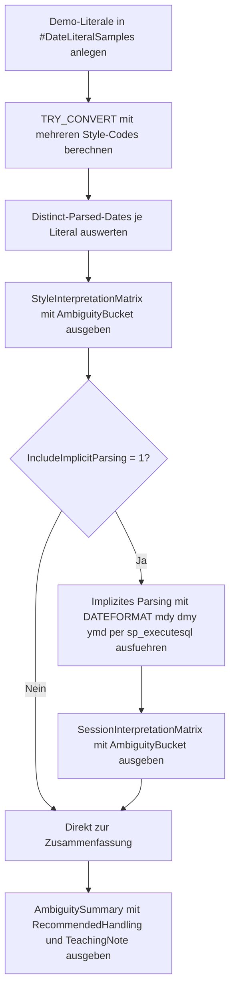

# DateLiteralAmbiguityLab.sql

Dieses didaktische Labor zeigt, warum kurze Datums-Literale ohne expliziten Style-Code riskant sind. Die Demo vergleicht dieselben Eingaben einmal ueber feste `TRY_CONVERT`-Styles und optional zusaetzlich ueber implizites Parsing mit verschiedenen `DATEFORMAT`-Settings.

## Uebersicht

<!-- SQLDOC:SUMMARY_TABLE:BEGIN -->
| Feld | Wert |
|---|---|
| Script | [DateLiteralAmbiguityLab.sql](DateLiteralAmbiguityLab.sql) |
| Version | `1.0` |
| Typ | `didactic-lab` |
| Kapitel | `12_DataTypes_Conversion` |
| Sicherheit | `read-only-tempdb` |
| Zweck | Demonstriert unterschiedliche Deutungen mehrdeutiger Datums-Literale ueber Style-Codes und Session-Formate. |
<!-- SQLDOC:SUMMARY_TABLE:END -->

## Annahmen

- Das Skript arbeitet ausschliesslich mit eingebauten Literalen und ohne produktive Tabellen.
- Die Session-Demo beschraenkt sich auf `DATEFORMAT mdy`, `dmy` und `ymd`, weil diese im Alltag typische Unterschiede bei impliziter Datumsdeutung zeigen.
- ISO-8601-Formate werden als stabile Referenz verwendet, um mehrdeutige Slash- und Kurzformate didaktisch kontrastieren zu koennen.
- Die Ergebnismengen sollen Unterschiede sichtbar machen und keine globale Vollabdeckung aller Sprach- und Regionalsettings liefern.

## Anwendungsfall

Das Skript eignet sich fuer folgende Leitfragen:

- Welche Literalformen liefern unter `101`, `103`, `104`, `120` oder `126` unterschiedliche Ergebnisse?
- Wann scheitert implizites Parsing nicht nur technisch, sondern fuehrt zu einer anderen fachlichen Datumsdeutung?
- Welche Formate sind als Eingabeschnittstelle robust genug, um Session-Settings weitgehend zu ignorieren?

## Parameter

<!-- SQLDOC:PARAMETERS_TABLE:BEGIN -->
| Parameter | SQL-Typ | Pflicht | Beschreibung |
|---|---|---|---|
| `@IncludeImplicitParsing` | `BIT` | Nein | Gibt bei `1` zusaetzlich eine Session-Matrix fuer implizites Parsing mit mehreren `DATEFORMAT`-Settings aus. |
| `@ShowOnlyAmbiguousRows` | `BIT` | Nein | Filtert bei `1` auf Literale mit mindestens zwei unterschiedlichen erfolgreichen Datumsdeutungen. |
<!-- SQLDOC:PARAMETERS_TABLE:END -->

## Abhaengigkeiten

<!-- SQLDOC:DEPENDENCIES_LIST:BEGIN -->
- `TRY_CONVERT()`
- `sp_executesql`
- temporaere Tabellen in `tempdb`
- `SET DATEFORMAT`
- `CROSS APPLY`
<!-- SQLDOC:DEPENDENCIES_LIST:END -->

## Hinweise

- Die erste Ergebnismenge zeigt explizite Style-Codes und hilft dabei, Unterschiede reproduzierbar zu erklaeren.
- Die optionale Session-Matrix macht sichtbar, warum implizites Parsing in Imports oder Prozeduren mit wechselndem Kontext problematisch ist.
- `mixed-success` bedeutet: Es gibt zwar keine zwei verschiedenen erfolgreichen Datumswerte, aber ein Literal funktioniert nicht unter allen Varianten gleich.
- Die Zusammenfassung priorisiert robuste Gegenmuster wie ISO-8601 und dokumentierte `TRY_CONVERT`-Styles.

## Versionshistorie

<!-- SQLDOC:VERSION_HISTORY_TABLE:BEGIN -->
| Version | Datum | User | Beschreibung |
|---|---|---|---|
| `1.0` | `2026-04-18` | `ER` | Erstversion des Date-Literal-Ambiguity-Labs |
<!-- SQLDOC:VERSION_HISTORY_TABLE:END -->

## Ablauf

<!-- SQLDOC:MERMAID:BEGIN -->

<!-- SQLDOC:MERMAID:END -->

## SQL-Code

<!-- SQLDOC:SQL_CODE:BEGIN -->
```sql
/*
BEGIN:SQL-HEADER v1
---
sql_header: v1
script_name: "DateLiteralAmbiguityLab.sql"
script_version: "1.0"
script_type: "didactic-lab"
chapter: "12_DataTypes_Conversion"

purpose: >
  Demonstriert, wie mehrdeutige Datums-Literale unter verschiedenen
  Style-Codes und Session-Formaten unterschiedlich interpretiert werden.
  Das Skript stellt explizite TRY_CONVERT-Styles einem impliziten Parsing
  mit mehreren DATEFORMAT-Einstellungen gegenueber und fasst die
  Ambiguitaetsrisiken je Literal zusammen.

parameters:
  - name: "@IncludeImplicitParsing"
    sql_type: "BIT"
    direction: "IN"
    required: false
    description: "1 = Session-abhaengige Implizit-Konvertierung mit DATEFORMAT demonstrieren"
  - name: "@ShowOnlyAmbiguousRows"
    sql_type: "BIT"
    direction: "IN"
    required: false
    description: "1 = nur Literale mit mindestens zwei unterschiedlichen Deutungen zeigen"

result_sets:
  - name: "StyleInterpretationMatrix"
    description: "Vergleicht je Literal mehrere explizite TRY_CONVERT-Styles und markiert Ambiguitaet"
  - name: "SessionInterpretationMatrix"
    description: "Zeigt optionale Implizit-Konvertierungen unter unterschiedlichen DATEFORMAT-Settings"
  - name: "AmbiguitySummary"
    description: "Verdichtet pro Literal, wie viele unterschiedliche Deutungen explizit und implizit auftreten"

dependencies:
  - "TRY_CONVERT()"
  - "sp_executesql"
  - "tempdb temporary tables"
  - "DATEFORMAT session setting"
  - "CROSS APPLY"

safety:
  level: "read-only-tempdb"
  writes_data: false

documentation:
  markdown_file: "T-SQL/12_DataTypes_Conversion/SQLScripts/DateLiteralAmbiguityLab.md"
  sync_blocks:
    - "SUMMARY_TABLE"
    - "PARAMETERS_TABLE"
    - "DEPENDENCIES_LIST"
    - "VERSION_HISTORY_TABLE"
    - "SQL_CODE"
  mermaid:
    mode: "ai-agent-from-sql"
    source: "script-body"

main_responsible:
  name: "Erhard Rainer"
  initials: "ER"

version_history:
  - version: "1.0"
    date: "2026-04-18"
    user: "ER"
    description: "Erstversion des Date-Literal-Ambiguity-Labs"

notes:
  - "Die Demo arbeitet nur mit eingebauten Literalen und tempdb-Objekten."
  - "Implizite Datumsdeutung wird ueber DATEFORMAT mdy, dmy und ymd demonstriert."
  - "ISO-8601-Formate dienen als stabile Referenz gegenueber slash- und dash-basierten Kurzformaten."
---
END:SQL-HEADER v1
*/

SET NOCOUNT ON;

DECLARE @IncludeImplicitParsing BIT = 1;
DECLARE @ShowOnlyAmbiguousRows BIT = 0;

IF @IncludeImplicitParsing NOT IN (0, 1) OR @ShowOnlyAmbiguousRows NOT IN (0, 1)
BEGIN
    THROW 50000, 'Die BIT-Parameter muessen als 0 oder 1 gesetzt sein.', 1;
END;

DROP TABLE IF EXISTS #DateLiteralSamples;
DROP TABLE IF EXISTS #StyleInterpretation;
DROP TABLE IF EXISTS #SessionInterpretation;

CREATE TABLE #DateLiteralSamples
(
    SampleId             INT            NOT NULL PRIMARY KEY,
    SampleLabel          VARCHAR(40)    NOT NULL,
    RawLiteral           NVARCHAR(40)   NOT NULL,
    LiteralFamily        VARCHAR(20)    NOT NULL,
    IntendedMeaning      VARCHAR(40)    NOT NULL,
    Notes                VARCHAR(220)   NOT NULL
);

CREATE TABLE #StyleInterpretation
(
    SampleId             INT            NOT NULL,
    SampleLabel          VARCHAR(40)    NOT NULL,
    RawLiteral           NVARCHAR(40)   NOT NULL,
    LiteralFamily        VARCHAR(20)    NOT NULL,
    InterpretationMode   VARCHAR(30)    NOT NULL,
    FormatKey            VARCHAR(20)    NOT NULL,
    FormatDescription    VARCHAR(80)    NOT NULL,
    ParsedDate           DATE           NULL,
    ParsedDateText       VARCHAR(10)    NOT NULL,
    ParseStatus          VARCHAR(16)    NOT NULL,
    Notes                VARCHAR(220)   NOT NULL
);

CREATE TABLE #SessionInterpretation
(
    SampleId             INT            NOT NULL,
    SampleLabel          VARCHAR(40)    NOT NULL,
    RawLiteral           NVARCHAR(40)   NOT NULL,
    LiteralFamily        VARCHAR(20)    NOT NULL,
    InterpretationMode   VARCHAR(30)    NOT NULL,
    FormatKey            VARCHAR(20)    NOT NULL,
    FormatDescription    VARCHAR(80)    NOT NULL,
    ParsedDate           DATE           NULL,
    ParsedDateText       VARCHAR(10)    NOT NULL,
    ParseStatus          VARCHAR(16)    NOT NULL,
    Notes                VARCHAR(220)   NOT NULL
);

INSERT INTO #DateLiteralSamples
(
    SampleId,
    SampleLabel,
    RawLiteral,
    LiteralFamily,
    IntendedMeaning,
    Notes
)
VALUES
    (1, 'Slash_03_04_2026',      N'03/04/2026',          'slash',        'depends on locale', 'Typisches mehrdeutiges Slash-Format; 03/04 kann als 3. April oder 4. Maerz gelesen werden.'),
    (2, 'Slash_04_03_2026',      N'04/03/2026',          'slash',        'depends on locale', 'Spiegelbild zum ersten Beispiel mit vertauschten Monats- und Tageszahlen.'),
    (3, 'Dash_01_02_2026',       N'01-02-2026',          'dash-short',   'depends on locale', 'Kurzes Dash-Format ohne vierstellige Jahresposition; ebenfalls interpretationsabhaengig.'),
    (4, 'ISO_Date',              N'2026-04-18',          'iso',          '2026-04-18',        'ISO-8601-Datum als stabile Referenz.'),
    (5, 'ISO_Timestamp',         N'2026-04-18T14:30:00', 'iso-timestamp','2026-04-18',        'ISO-8601-Zeitstempel mit Zeitanteil als robuste Eingabe.'),
    (6, 'German_Dotted',         N'18.04.2026',          'dach-dot',     '2026-04-18',        'Punktnotation im DACH-Kontext; mit deutschem Stil klar, sonst oft NULL.'),
    (7, 'Compact_YMD',           N'20260418',            'compact-iso',  '2026-04-18',        'Kompaktes YMD-Format ohne Trennzeichen.'),
    (8, 'Impossible_Day_Month',  N'31/04/2026',          'slash',        'invalid calendar',  'April hat nur 30 Tage; das Beispiel zeigt harte Fehlkonvertierung statt Ambiguitaet.');

INSERT INTO #StyleInterpretation
(
    SampleId,
    SampleLabel,
    RawLiteral,
    LiteralFamily,
    InterpretationMode,
    FormatKey,
    FormatDescription,
    ParsedDate,
    ParsedDateText,
    ParseStatus,
    Notes
)
SELECT
    s.SampleId,
    s.SampleLabel,
    s.RawLiteral,
    s.LiteralFamily,
    'explicit-style' AS InterpretationMode,
    v.FormatKey,
    v.FormatDescription,
    v.ParsedDate,
    COALESCE(CONVERT(VARCHAR(10), v.ParsedDate, 23), 'NULL') AS ParsedDateText,
    CASE WHEN v.ParsedDate IS NULL THEN 'failed' ELSE 'parsed' END AS ParseStatus,
    s.Notes
FROM #DateLiteralSamples AS s
CROSS APPLY
(
    VALUES
        ('101', 'US mdy slash',           TRY_CONVERT(DATE, s.RawLiteral, 101)),
        ('103', 'British/French dmy',     TRY_CONVERT(DATE, s.RawLiteral, 103)),
        ('104', 'German dd.mm.yyyy',      TRY_CONVERT(DATE, s.RawLiteral, 104)),
        ('111', 'Japan yyyy/mm/dd',       TRY_CONVERT(DATE, s.RawLiteral, 111)),
        ('112', 'ISO yyyymmdd',           TRY_CONVERT(DATE, s.RawLiteral, 112)),
        ('120', 'ODBC yyyy-mm-dd hh:mi',  TRY_CONVERT(DATE, s.RawLiteral, 120)),
        ('126', 'ISO8601 yyyy-mm-ddThh',  TRY_CONVERT(DATE, s.RawLiteral, 126))
) AS v(FormatKey, FormatDescription, ParsedDate);

IF @IncludeImplicitParsing = 1
BEGIN
    INSERT INTO #SessionInterpretation
    (
        SampleId,
        SampleLabel,
        RawLiteral,
        LiteralFamily,
        InterpretationMode,
        FormatKey,
        FormatDescription,
        ParsedDate,
        ParsedDateText,
        ParseStatus,
        Notes
    )
    EXEC sys.sp_executesql
        N'
        SET DATEFORMAT mdy;
        SELECT
            s.SampleId,
            s.SampleLabel,
            s.RawLiteral,
            s.LiteralFamily,
            ''implicit-session'' AS InterpretationMode,
            ''DATEFORMAT mdy'' AS FormatKey,
            ''Implizite Konvertierung mit Monat-Tag-Jahr'' AS FormatDescription,
            TRY_CONVERT(DATE, s.RawLiteral) AS ParsedDate,
            COALESCE(CONVERT(VARCHAR(10), TRY_CONVERT(DATE, s.RawLiteral), 23), ''NULL'') AS ParsedDateText,
            CASE WHEN TRY_CONVERT(DATE, s.RawLiteral) IS NULL THEN ''failed'' ELSE ''parsed'' END AS ParseStatus,
            s.Notes
        FROM #DateLiteralSamples AS s;';

    INSERT INTO #SessionInterpretation
    (
        SampleId,
        SampleLabel,
        RawLiteral,
        LiteralFamily,
        InterpretationMode,
        FormatKey,
        FormatDescription,
        ParsedDate,
        ParsedDateText,
        ParseStatus,
        Notes
    )
    EXEC sys.sp_executesql
        N'
        SET DATEFORMAT dmy;
        SELECT
            s.SampleId,
            s.SampleLabel,
            s.RawLiteral,
            s.LiteralFamily,
            ''implicit-session'' AS InterpretationMode,
            ''DATEFORMAT dmy'' AS FormatKey,
            ''Implizite Konvertierung mit Tag-Monat-Jahr'' AS FormatDescription,
            TRY_CONVERT(DATE, s.RawLiteral) AS ParsedDate,
            COALESCE(CONVERT(VARCHAR(10), TRY_CONVERT(DATE, s.RawLiteral), 23), ''NULL'') AS ParsedDateText,
            CASE WHEN TRY_CONVERT(DATE, s.RawLiteral) IS NULL THEN ''failed'' ELSE ''parsed'' END AS ParseStatus,
            s.Notes
        FROM #DateLiteralSamples AS s;';

    INSERT INTO #SessionInterpretation
    (
        SampleId,
        SampleLabel,
        RawLiteral,
        LiteralFamily,
        InterpretationMode,
        FormatKey,
        FormatDescription,
        ParsedDate,
        ParsedDateText,
        ParseStatus,
        Notes
    )
    EXEC sys.sp_executesql
        N'
        SET DATEFORMAT ymd;
        SELECT
            s.SampleId,
            s.SampleLabel,
            s.RawLiteral,
            s.LiteralFamily,
            ''implicit-session'' AS InterpretationMode,
            ''DATEFORMAT ymd'' AS FormatKey,
            ''Implizite Konvertierung mit Jahr-Monat-Tag'' AS FormatDescription,
            TRY_CONVERT(DATE, s.RawLiteral) AS ParsedDate,
            COALESCE(CONVERT(VARCHAR(10), TRY_CONVERT(DATE, s.RawLiteral), 23), ''NULL'') AS ParsedDateText,
            CASE WHEN TRY_CONVERT(DATE, s.RawLiteral) IS NULL THEN ''failed'' ELSE ''parsed'' END AS ParseStatus,
            s.Notes
        FROM #DateLiteralSamples AS s;';
END;

WITH StyleDistinctness AS
(
    SELECT
        si.SampleId,
        COUNT(DISTINCT si.ParsedDateText) AS DistinctOutcomes,
        COUNT(DISTINCT CASE WHEN si.ParseStatus = 'parsed' THEN si.ParsedDateText END) AS DistinctParsedDates
    FROM #StyleInterpretation AS si
    GROUP BY
        si.SampleId
)
SELECT
    si.SampleId,
    si.SampleLabel,
    si.RawLiteral,
    si.LiteralFamily,
    si.FormatKey,
    si.FormatDescription,
    si.ParsedDateText,
    si.ParseStatus,
    CASE
        WHEN sd.DistinctParsedDates >= 2 THEN 'ambiguous'
        WHEN sd.DistinctParsedDates = 1 AND sd.DistinctOutcomes > 1 THEN 'mixed-success'
        WHEN sd.DistinctParsedDates = 1 THEN 'stable'
        ELSE 'failed-all'
    END AS AmbiguityBucket,
    si.Notes
FROM #StyleInterpretation AS si
INNER JOIN StyleDistinctness AS sd
    ON sd.SampleId = si.SampleId
WHERE @ShowOnlyAmbiguousRows = 0
   OR sd.DistinctParsedDates >= 2
ORDER BY
    si.SampleId,
    si.FormatKey;

IF @IncludeImplicitParsing = 1
BEGIN
    WITH SessionDistinctness AS
    (
        SELECT
            si.SampleId,
            COUNT(DISTINCT si.ParsedDateText) AS DistinctOutcomes,
            COUNT(DISTINCT CASE WHEN si.ParseStatus = 'parsed' THEN si.ParsedDateText END) AS DistinctParsedDates
        FROM #SessionInterpretation AS si
        GROUP BY
            si.SampleId
    )
    SELECT
        si.SampleId,
        si.SampleLabel,
        si.RawLiteral,
        si.LiteralFamily,
        si.FormatKey,
        si.FormatDescription,
        si.ParsedDateText,
        si.ParseStatus,
        CASE
            WHEN sd.DistinctParsedDates >= 2 THEN 'ambiguous'
            WHEN sd.DistinctParsedDates = 1 AND sd.DistinctOutcomes > 1 THEN 'mixed-success'
            WHEN sd.DistinctParsedDates = 1 THEN 'stable'
            ELSE 'failed-all'
        END AS AmbiguityBucket,
        si.Notes
    FROM #SessionInterpretation AS si
    INNER JOIN SessionDistinctness AS sd
        ON sd.SampleId = si.SampleId
    WHERE @ShowOnlyAmbiguousRows = 0
       OR sd.DistinctParsedDates >= 2
    ORDER BY
        si.SampleId,
        si.FormatKey;
END;

WITH StyleSummary AS
(
    SELECT
        si.SampleId,
        COUNT(DISTINCT CASE WHEN si.ParseStatus = 'parsed' THEN si.ParsedDateText END) AS ExplicitDistinctParsedDates,
        SUM(CASE WHEN si.ParseStatus = 'failed' THEN 1 ELSE 0 END) AS ExplicitFailures
    FROM #StyleInterpretation AS si
    GROUP BY
        si.SampleId
),
SessionSummary AS
(
    SELECT
        si.SampleId,
        COUNT(DISTINCT CASE WHEN si.ParseStatus = 'parsed' THEN si.ParsedDateText END) AS ImplicitDistinctParsedDates,
        SUM(CASE WHEN si.ParseStatus = 'failed' THEN 1 ELSE 0 END) AS ImplicitFailures
    FROM #SessionInterpretation AS si
    GROUP BY
        si.SampleId
)
SELECT
    s.SampleId,
    s.SampleLabel,
    s.RawLiteral,
    s.LiteralFamily,
    s.IntendedMeaning,
    ss.ExplicitDistinctParsedDates,
    ss.ExplicitFailures,
    COALESCE(sess.ImplicitDistinctParsedDates, 0) AS ImplicitDistinctParsedDates,
    COALESCE(sess.ImplicitFailures, 0) AS ImplicitFailures,
    CASE
        WHEN ss.ExplicitDistinctParsedDates >= 2 THEN 'avoid ambiguous literal'
        WHEN COALESCE(sess.ImplicitDistinctParsedDates, 0) >= 2 THEN 'avoid implicit parsing'
        WHEN ss.ExplicitDistinctParsedDates = 1
         AND COALESCE(sess.ImplicitDistinctParsedDates, 0) <= 1
         AND s.LiteralFamily LIKE 'iso%' THEN 'preferred stable format'
        WHEN ss.ExplicitDistinctParsedDates = 0
         AND COALESCE(sess.ImplicitDistinctParsedDates, 0) = 0 THEN 'invalid literal'
        ELSE 'use explicit style'
    END AS RecommendedHandling,
    CASE
        WHEN s.LiteralFamily LIKE 'iso%' OR s.LiteralFamily = 'compact-iso'
            THEN 'ISO-8601 oder ISO-kompakt als Eingabeformat bevorzugen.'
        WHEN ss.ExplicitDistinctParsedDates >= 2
            THEN 'Slash- oder Kurzformate nur mit dokumentiertem Style-Code oder vorgelagerter Normalisierung verwenden.'
        WHEN COALESCE(sess.ImplicitDistinctParsedDates, 0) >= 2
            THEN 'Implizite Konvertierung vermeiden; Session-Settings koennen zu anderer Datumsdeutung fuehren.'
        WHEN ss.ExplicitDistinctParsedDates = 0
            THEN 'Literal validieren oder bereinigen, bevor ein DATE-Zieltyp verwendet wird.'
        ELSE 'Expliziten TRY_CONVERT-Style beibehalten, damit die Deutung reproduzierbar bleibt.'
    END AS TeachingNote
FROM #DateLiteralSamples AS s
INNER JOIN StyleSummary AS ss
    ON ss.SampleId = s.SampleId
LEFT JOIN SessionSummary AS sess
    ON sess.SampleId = s.SampleId
ORDER BY
    s.SampleId;

```
<!-- SQLDOC:SQL_CODE:END -->

