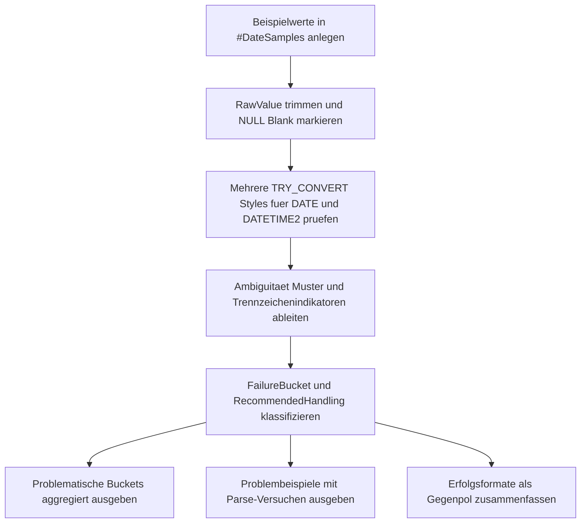

# DateParsingFailureBucket.sql

Dieses Skript gruppiert problematische Datumsstrings nach erkannten Fehlermustern. Die Erstversion arbeitet mit eingebauten Beispielwerten und zeigt parallel, welche Strings stabil lesbar sind, welche mehrdeutig bleiben und welche an Kalender-, Format- oder Zeitproblemen scheitern.

## Uebersicht

<!-- SQLDOC:SUMMARY_TABLE:BEGIN -->
| Feld | Wert |
|---|---|
| Script | [DateParsingFailureBucket.sql](DateParsingFailureBucket.sql) |
| Version | `1.0` |
| Typ | `didactic-lab` |
| Kapitel | `12_DataTypes_Conversion` |
| Sicherheit | `read-only-tempdb` |
| Zweck | Gruppiert problematische Datumsstrings nach Fehlermustern und zeigt stabile Gegenmuster. |
<!-- SQLDOC:SUMMARY_TABLE:END -->

## Annahmen

- Die Erstversion nutzt Demo-Werte statt produktiver Quelltabellen.
- Bewertet werden explizite Datums- und Zeitstempel-Konvertierungen fuer ISO-, DACH-, US- und kompakte Formate.
- Mehrdeutige Slash-Formate werden bewusst als eigener Problemtyp behandelt, auch wenn einzelne Styles technisch erfolgreich sind.
- Das Skript soll Bereinigungs- und Review-Muster illustrieren, nicht jede denkbare Kultur oder jedes Freitext-Datum vollstaendig abbilden.

## Anwendungsfall

Das Skript eignet sich fuer folgende Leitfragen:

- Welche problematischen Datumsstrings fallen eher in Ambiguitaet als in harte Kalenderfehler?
- Welche Fehler lassen sich auf Trennzeichen, Schaltjahre oder ungueltige Zeitanteile zurueckfuehren?
- Welche Datumsformate koennen als stabile Zielmuster fuer Importstrecken bevorzugt werden?

## Parameter

<!-- SQLDOC:PARAMETERS_TABLE:BEGIN -->
| Parameter | SQL-Typ | Pflicht | Beschreibung |
|---|---|---|---|
| `-` | `-` | `-` | Dieses Demoskript verwendet keine Laufzeitparameter. |
<!-- SQLDOC:PARAMETERS_TABLE:END -->

## Abhaengigkeiten

<!-- SQLDOC:DEPENDENCIES_LIST:BEGIN -->
- `TRY_CONVERT()`
- `DATE`
- `DATETIME2`
- `PATINDEX()`
- `LIKE`
- temporaere Tabellen in `tempdb`
<!-- SQLDOC:DEPENDENCIES_LIST:END -->

## Hinweise

- `DateParsingFailureBucketSummary` zeigt nur problematische Buckets und verdichtet sie fuer Datenqualitaets-Reviews.
- `DateParsingFailureSamples` laesst dieselben Werte gegen mehrere Styles antreten, damit die Ursache hinter dem Bucket nachvollziehbar bleibt.
- `DateParsingSuccessFormats` liefert den didaktischen Gegenpol und markiert Formate, die sich als stabile Zielkonvention eignen.

## Versionshistorie

<!-- SQLDOC:VERSION_HISTORY_TABLE:BEGIN -->
| Version | Datum | User | Beschreibung |
|---|---|---|---|
| `1.0` | `2026-04-18` | `ER` | Erstversion des Date-Parsing-Failure-Bucket-Labs |
<!-- SQLDOC:VERSION_HISTORY_TABLE:END -->

## Ablauf

<!-- SQLDOC:MERMAID:BEGIN -->

<!-- SQLDOC:MERMAID:END -->

## SQL-Code

<!-- SQLDOC:SQL_CODE:BEGIN -->
```sql
/*
BEGIN:SQL-HEADER v1
---
sql_header: v1
script_name: "DateParsingFailureBucket.sql"
script_version: "1.0"
script_type: "didactic-lab"
chapter: "12_DataTypes_Conversion"

purpose: >
  Gruppiert problematische Datumsstrings nach Fehlermustern. Das Skript
  bewertet eingebaute Beispielwerte gegen mehrere explizite Datums- und
  Zeitstempel-Konvertierungen, leitet daraus Failure-Buckets fuer
  Bereinigungs- und Review-Zwecke ab und zeigt zusaetzlich stabile
  Erfolgsformate als Kontrast.

parameters: []

result_sets:
  - name: "DateParsingFailureBucketSummary"
    description: "Verdichtet problematische Datumsstrings nach Failure-Bucket und empfohlener Behandlung"
  - name: "DateParsingFailureSamples"
    description: "Zeigt Beispielwerte mit erkannten Fehlermustern und Parse-Versuchen"
  - name: "DateParsingSuccessFormats"
    description: "Fasst erfolgreich erkannte Formate als didaktischen Gegenpol zusammen"

dependencies:
  - "TRY_CONVERT()"
  - "DATE"
  - "DATETIME2"
  - "PATINDEX()"
  - "LIKE"
  - "temporary tables"

safety:
  level: "read-only-tempdb"
  writes_data: false

documentation:
  markdown_file: "T-SQL/12_DataTypes_Conversion/SQLScripts/DateParsingFailureBucket.md"
  sync_blocks:
    - "SUMMARY_TABLE"
    - "PARAMETERS_TABLE"
    - "DEPENDENCIES_LIST"
    - "VERSION_HISTORY_TABLE"
    - "SQL_CODE"
  mermaid:
    mode: "ai-agent-from-sql"
    source: "script-body"

main_responsible:
  name: "Erhard Rainer"
  initials: "ER"

version_history:
  - version: "1.0"
    date: "2026-04-18"
    user: "ER"
    description: "Erstversion des Date-Parsing-Failure-Bucket-Labs"

notes:
  - "Die Erstversion nutzt eingebaute Beispielwerte und keine produktiven Quelltabellen."
  - "Mehrere Date-Styles werden parallel getestet, damit Ambiguitaet und harte Fehlkonvertierungen getrennt sichtbar werden."
  - "Die Failure-Buckets sollen Datenbereinigung und Formatentscheidungen didaktisch vorbereiten."
---
END:SQL-HEADER v1
*/

SET NOCOUNT ON;

DROP TABLE IF EXISTS #DateSamples;

CREATE TABLE #DateSamples
(
    SampleId            INT            NOT NULL PRIMARY KEY,
    SampleLabel         VARCHAR(50)    NOT NULL,
    RawValue            NVARCHAR(60)   NULL,
    ExpectedPattern     VARCHAR(30)    NOT NULL,
    ExpectedMeaning     VARCHAR(60)    NOT NULL,
    Notes               VARCHAR(220)   NOT NULL
);

INSERT INTO #DateSamples
(
    SampleId,
    SampleLabel,
    RawValue,
    ExpectedPattern,
    ExpectedMeaning,
    Notes
)
VALUES
    (1,  'IsoDate_Valid',              N'2026-04-18',           'iso-date',      '2026-04-18',          'ISO-8601-Datum als stabile Referenz.'),
    (2,  'GermanDate_Valid',           N'18.04.2026',           'german-date',   '2026-04-18',          'DACH-Punktnotation fuer dd.mm.yyyy.'),
    (3,  'UsDate_Valid',               N'04/18/2026',           'us-date',       '2026-04-18',          'US-Slash-Format mit Monat/Tag/Jahr.'),
    (4,  'Slash_Ambiguous_A',          N'03/04/2026',           'slash-short',   'ambiguous',           'Kann als 3. April oder 4. Maerz gelesen werden.'),
    (5,  'Slash_Ambiguous_B',          N'04/03/2026',           'slash-short',   'ambiguous',           'Spiegelbild zum ersten mehrdeutigen Slash-Beispiel.'),
    (6,  'Impossible_April_31',        N'31/04/2026',           'slash-short',   'invalid-date',        'April hat nur 30 Tage.'),
    (7,  'Invalid_Leap_Day',           N'2025-02-29',           'iso-date',      'invalid-date',        'Nicht-Schaltjahr, daher ungueltiger 29. Februar.'),
    (8,  'Invalid_Month_13',           N'2026-13-10',           'iso-date',      'invalid-date',        'Monat 13 existiert nicht.'),
    (9,  'Invalid_Day_32',             N'2026-12-32',           'iso-date',      'invalid-date',        'Tageswert ausserhalb des Kalenders.'),
    (10, 'CompactDigits',              N'20260418',             'compact-date',  '2026-04-18',          'Kompaktes yyyymmdd ohne Trennzeichen.'),
    (11, 'TextMonth_English',          N'April 18, 2026',       'month-text',    '2026-04-18',          'Monatsname erfordert sprachabhaengiges Parsing.'),
    (12, 'UnsupportedDelimiter',       N'2026|04|18',           'other-delim',   'invalid-format',      'Trennzeichen passt zu keinem der geprueften Styles.'),
    (13, 'ImpossibleTimeComponent',    N'2026-04-18 25:61:00',  'iso-datetime',  'invalid-datetime',    'Zeitanteil ist fachlich unmoeglich.'),
    (14, 'DateTimeIso_Valid',          N'2026-04-18T14:30:00',  'iso-datetime',  '2026-04-18T14:30:00', 'ISO-8601-Zeitstempel als positives Gegenbeispiel.'),
    (15, 'BlankValue',                 N'   ',                  'blank',         'blank',               'Blank-Wert statt Datum.'),
    (16, 'NullValue',                  NULL,                    'null',          'null',                'NULL-Eingabe fuer Staging- oder Importfehler.'),
    (17, 'GermanImpossibleLeapDay',    N'29.02.2025',           'german-date',   'invalid-date',        'Nicht-Schaltjahr im deutschen Punktformat.'),
    (18, 'IsoMonthDaySwapped',         N'2026-18-04',           'iso-date',      'invalid-date',        'Monat und Tag stehen im ISO-Muster an ungueltiger Position.');

WITH Normalized AS
(
    SELECT
        ds.SampleId,
        ds.SampleLabel,
        ds.RawValue,
        ds.ExpectedPattern,
        ds.ExpectedMeaning,
        ds.Notes,
        LTRIM(RTRIM(ds.RawValue)) AS TrimmedValue,
        CASE WHEN ds.RawValue IS NULL THEN 1 ELSE 0 END AS IsNullValue,
        CASE WHEN ds.RawValue IS NOT NULL AND LTRIM(RTRIM(ds.RawValue)) = N'' THEN 1 ELSE 0 END AS IsBlankValue
    FROM #DateSamples AS ds
),
PatternCheck AS
(
    SELECT
        n.*,
        TRY_CONVERT(DATE, n.TrimmedValue, 23) AS ParsedIsoDate,
        TRY_CONVERT(DATE, n.TrimmedValue, 104) AS ParsedGermanDate,
        TRY_CONVERT(DATE, n.TrimmedValue, 101) AS ParsedUsDate,
        TRY_CONVERT(DATE, n.TrimmedValue, 112) AS ParsedCompactDate,
        TRY_CONVERT(DATETIME2(0), n.TrimmedValue, 126) AS ParsedIsoDateTime,
        TRY_CONVERT(DATETIME2(0), n.TrimmedValue, 120) AS ParsedSpaceDateTime,
        CASE
            WHEN n.TrimmedValue IS NOT NULL
             AND TRY_CONVERT(DATE, n.TrimmedValue, 101) IS NOT NULL
             AND TRY_CONVERT(DATE, n.TrimmedValue, 103) IS NOT NULL
             AND TRY_CONVERT(DATE, n.TrimmedValue, 101) <> TRY_CONVERT(DATE, n.TrimmedValue, 103)
                THEN 1
            ELSE 0
        END AS IsAmbiguousSlashDate,
        CASE WHEN n.TrimmedValue LIKE N'[0-9][0-9][0-9][0-9]-[0-9][0-9]-[0-9][0-9]' THEN 1 ELSE 0 END AS LooksLikeIsoDate,
        CASE WHEN n.TrimmedValue LIKE N'[0-9][0-9].[0-9][0-9].[0-9][0-9][0-9][0-9]' THEN 1 ELSE 0 END AS LooksLikeGermanDate,
        CASE WHEN n.TrimmedValue LIKE N'[0-9][0-9]/[0-9][0-9]/[0-9][0-9][0-9][0-9]' THEN 1 ELSE 0 END AS LooksLikeSlashDate,
        CASE WHEN n.TrimmedValue LIKE N'[0-9][0-9][0-9][0-9][0-9][0-9][0-9][0-9]' THEN 1 ELSE 0 END AS LooksLikeCompactDate,
        CASE WHEN n.TrimmedValue LIKE N'%[A-Za-z]%' THEN 1 ELSE 0 END AS ContainsMonthText,
        CASE WHEN n.TrimmedValue LIKE N'%|%' OR n.TrimmedValue LIKE N'%,%' THEN 1 ELSE 0 END AS UsesUnsupportedDelimiter
    FROM Normalized AS n
),
Bucketed AS
(
    SELECT
        pc.SampleId,
        pc.SampleLabel,
        pc.RawValue,
        pc.TrimmedValue,
        pc.ExpectedPattern,
        pc.ExpectedMeaning,
        pc.Notes,
        pc.ParsedIsoDate,
        pc.ParsedGermanDate,
        pc.ParsedUsDate,
        pc.ParsedCompactDate,
        pc.ParsedIsoDateTime,
        pc.ParsedSpaceDateTime,
        CASE
            WHEN pc.IsNullValue = 1 THEN 'null-or-missing'
            WHEN pc.IsBlankValue = 1 THEN 'blank-or-whitespace'
            WHEN pc.IsAmbiguousSlashDate = 1 THEN 'ambiguous-locale-date'
            WHEN pc.ParsedIsoDate IS NOT NULL THEN 'valid-iso-date'
            WHEN pc.ParsedGermanDate IS NOT NULL THEN 'valid-german-date'
            WHEN pc.ParsedUsDate IS NOT NULL THEN 'valid-us-date'
            WHEN pc.ParsedCompactDate IS NOT NULL THEN 'valid-compact-date'
            WHEN pc.ParsedIsoDateTime IS NOT NULL OR pc.ParsedSpaceDateTime IS NOT NULL THEN 'valid-datetime'
            WHEN pc.ContainsMonthText = 1 THEN 'month-name-or-locale-text'
            WHEN pc.UsesUnsupportedDelimiter = 1 THEN 'unsupported-delimiter'
            WHEN pc.LooksLikeIsoDate = 1
             AND SUBSTRING(pc.TrimmedValue, 6, 2) = '02'
             AND SUBSTRING(pc.TrimmedValue, 9, 2) = '29'
                THEN 'invalid-leap-day'
            WHEN pc.LooksLikeGermanDate = 1
             AND LEFT(pc.TrimmedValue, 2) = '29'
             AND SUBSTRING(pc.TrimmedValue, 4, 2) = '02'
                THEN 'invalid-leap-day'
            WHEN pc.LooksLikeIsoDate = 1
             AND (
                    TRY_CONVERT(INT, SUBSTRING(pc.TrimmedValue, 6, 2)) NOT BETWEEN 1 AND 12
                 OR TRY_CONVERT(INT, SUBSTRING(pc.TrimmedValue, 9, 2)) NOT BETWEEN 1 AND 31
                 )
                THEN 'invalid-day-or-month'
            WHEN pc.LooksLikeGermanDate = 1
             AND (
                    TRY_CONVERT(INT, LEFT(pc.TrimmedValue, 2)) NOT BETWEEN 1 AND 31
                 OR TRY_CONVERT(INT, SUBSTRING(pc.TrimmedValue, 4, 2)) NOT BETWEEN 1 AND 12
                 )
                THEN 'invalid-day-or-month'
            WHEN pc.LooksLikeSlashDate = 1
                THEN 'slash-date-failed-calendar-check'
            WHEN pc.ExpectedPattern = 'iso-datetime'
                THEN 'invalid-time-component'
            ELSE 'unclassified-date-token'
        END AS FailureBucket,
        CASE
            WHEN pc.IsNullValue = 1 OR pc.IsBlankValue = 1 THEN 0
            WHEN pc.IsAmbiguousSlashDate = 1 THEN 1
            WHEN pc.ParsedIsoDate IS NOT NULL
              OR pc.ParsedGermanDate IS NOT NULL
              OR pc.ParsedUsDate IS NOT NULL
              OR pc.ParsedCompactDate IS NOT NULL
              OR pc.ParsedIsoDateTime IS NOT NULL
              OR pc.ParsedSpaceDateTime IS NOT NULL
                THEN 0
            ELSE 1
        END AS IsProblematic,
        CASE
            WHEN pc.IsNullValue = 1 THEN 'NULL getrennt ausweisen und Upstream-Pflichtfelder pruefen.'
            WHEN pc.IsBlankValue = 1 THEN 'Blank-Werte vor dem Parsing auf NULL oder Fehlerstatus normieren.'
            WHEN pc.IsAmbiguousSlashDate = 1 THEN 'Expliziten Style oder ISO-8601 verlangen; implizite Slash-Formate vermeiden.'
            WHEN pc.ContainsMonthText = 1 THEN 'Sprachkontext festlegen oder Monatsnamen vor der Konvertierung standardisieren.'
            WHEN pc.UsesUnsupportedDelimiter = 1 THEN 'Trennzeichen vor der Konvertierung in ein dokumentiertes Standardformat ueberfuehren.'
            WHEN pc.ExpectedPattern = 'iso-datetime' THEN 'Zeitanteile getrennt validieren und nur ISO-konforme Zeitstempel akzeptieren.'
            ELSE 'Datumsbestandteile isolieren, fachlich validieren und danach explizit konvertieren.'
        END AS RecommendedHandling
    FROM PatternCheck AS pc
)
SELECT
    b.FailureBucket,
    COUNT(*) AS BucketCount,
    MIN(b.RecommendedHandling) AS RecommendedHandling,
    MIN(COALESCE(b.TrimmedValue, N'<NULL>')) AS ExampleValue
FROM Bucketed AS b
WHERE b.IsProblematic = 1
GROUP BY
    b.FailureBucket
ORDER BY
    BucketCount DESC,
    b.FailureBucket;

SELECT
    b.SampleId,
    b.SampleLabel,
    b.RawValue,
    b.ExpectedPattern,
    b.ExpectedMeaning,
    b.FailureBucket,
    COALESCE(CONVERT(VARCHAR(10), b.ParsedIsoDate, 23), 'NULL') AS ParsedIsoDate,
    COALESCE(CONVERT(VARCHAR(10), b.ParsedGermanDate, 23), 'NULL') AS ParsedGermanDate,
    COALESCE(CONVERT(VARCHAR(10), b.ParsedUsDate, 23), 'NULL') AS ParsedUsDate,
    COALESCE(CONVERT(VARCHAR(10), b.ParsedCompactDate, 23), 'NULL') AS ParsedCompactDate,
    COALESCE(CONVERT(VARCHAR(19), b.ParsedIsoDateTime, 120), CONVERT(VARCHAR(19), b.ParsedSpaceDateTime, 120), 'NULL') AS ParsedDateTime,
    b.RecommendedHandling,
    b.Notes
FROM Bucketed AS b
WHERE b.IsProblematic = 1
ORDER BY
    b.FailureBucket,
    b.SampleId;

SELECT
    b.FailureBucket AS SuccessBucket,
    COUNT(*) AS SampleCount,
    MIN(b.ExpectedPattern) AS RepresentativePattern,
    MIN(COALESCE(b.TrimmedValue, N'<NULL>')) AS ExampleValue
FROM Bucketed AS b
WHERE b.IsProblematic = 0
GROUP BY
    b.FailureBucket
ORDER BY
    b.FailureBucket;
```
<!-- SQLDOC:SQL_CODE:END -->
