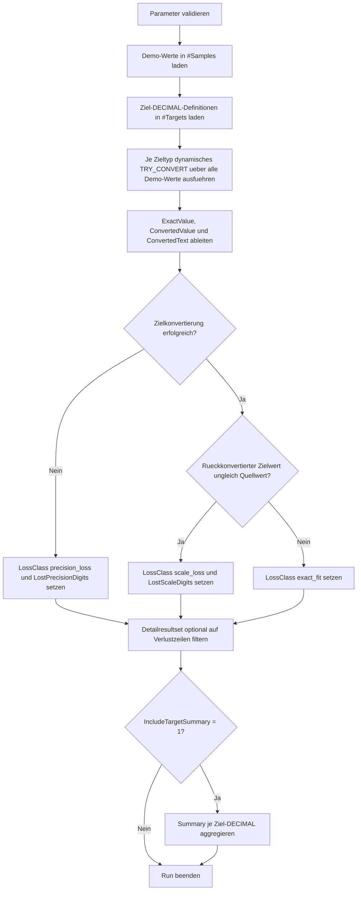

# DecimalScaleLossReview.sql

Dieses Skript zeigt mit einem kleinen Demo-Datensatz, welche zwei Verlustarten bei numerischen Konvertierungen typischerweise auseinandergehalten werden sollten: verlorene Nachkommastellen durch engere Ziel-Skalen und fehlende Gesamtkapazitaet durch zu kleine Ziel-Praezision.

## Uebersicht

<!-- SQLDOC:SUMMARY_TABLE:BEGIN -->
| Feld | Wert |
|---|---|
| Script | [DecimalScaleLossReview.sql](DecimalScaleLossReview.sql) |
| Version | `1.0` |
| Typ | `didactic-lab` |
| Kapitel | `12_DataTypes_Conversion` |
| Sicherheit | `read-only-tempdb` |
| Zweck | Macht Scale-Loss und Precision-Loss bei Konvertierungen auf engere DECIMAL-Ziele sichtbar. |
<!-- SQLDOC:SUMMARY_TABLE:END -->

## Annahmen

- Das Skript arbeitet bewusst mit vorbereiteten Demo-Dezimalwerten statt mit produktiven Tabellen.
- `Precision-Loss` bedeutet hier einen fehlgeschlagenen `TRY_CONVERT` auf das Ziel-`DECIMAL`, typischerweise wegen zu wenig Integer- oder Gesamtkapazitaet.
- `Scale-Loss` bedeutet, dass die Konvertierung gelingt, der Wert danach aber wegen geringerer Ziel-Skala numerisch veraendert ist.
- Quell-Praezision und Quell-Skala sind fuer den Lernkontext vorab an den Demo-Werten hinterlegt, damit die Resultate leicht lesbar bleiben.

## Parameter

<!-- SQLDOC:PARAMETERS_TABLE:BEGIN -->
| Parameter | SQL-Typ | Pflicht | Beschreibung |
|---|---|---|---|
| `@OnlyLossRows` | `BIT` | Nein | Gibt bei `1` nur Zeilen mit `scale_loss` oder `precision_loss` aus. |
| `@IncludeTargetSummary` | `BIT` | Nein | Gibt bei `1` eine zweite Ergebnismenge mit Kennzahlen je Ziel-`DECIMAL` aus. |
<!-- SQLDOC:PARAMETERS_TABLE:END -->

## Abhaengigkeiten

<!-- SQLDOC:DEPENDENCIES_LIST:BEGIN -->
- `TRY_CONVERT()`
- temporaere Tabellen
- `sp_executesql`
<!-- SQLDOC:DEPENDENCIES_LIST:END -->

## Hinweise

- `NeedsScaleReduction` zeigt an, dass die Quellzahl mehr Nachkommastellen besitzt als das Ziel zulassen wuerde, auch wenn nicht jede solche Zeile zwingend sichtbar gerundet wirkt.
- `LostScaleDigits` beschreibt den theoretisch wegfallenden Scale-Anteil bei erfolgreicher Konvertierung.
- `LostPrecisionDigits` wird nur fuer fehlgeschlagene Zielkonvertierungen als didaktische Naeherung auf Basis der Quell- und Ziel-Praezision ausgewiesen.
- Die breite Referenz `DECIMAL(10,4)` dient als Gegenpol zu den engeren Zieldefinitionen.

## Versionshistorie

<!-- SQLDOC:VERSION_HISTORY_TABLE:BEGIN -->
| Version | Datum | User | Beschreibung |
|---|---|---|---|
| `1.0` | `2026-04-18` | `ER` | Erstversion des didaktischen Reviews fuer Scale- und Precision-Loss bei numerischen Konvertierungen |
<!-- SQLDOC:VERSION_HISTORY_TABLE:END -->

## Ablauf

<!-- SQLDOC:MERMAID:BEGIN -->

<!-- SQLDOC:MERMAID:END -->

## SQL-Code

<!-- SQLDOC:SQL_CODE:BEGIN -->
```sql
/*
BEGIN:SQL-HEADER v1
---
sql_header: v1
script_name: "DecimalScaleLossReview.sql"
script_version: "1.0"
script_type: "didactic-lab"
chapter: "12_DataTypes_Conversion"

purpose: >
  Macht Praezisions- und Skalenverluste bei numerischen Konvertierungen
  sichtbar. Das Skript vergleicht Demo-Dezimalwerte mit engeren Ziel-DECIMAL-
  Definitionen und markiert, ob ein exakter Fit, ein reiner Skalenverlust,
  ein Ueberlauf wegen fehlender Integer-Kapazitaet oder eine komplette
  Konvertierungsunfaehigkeit vorliegt.

parameters:
  - name: "@OnlyLossRows"
    sql_type: "BIT"
    direction: "IN"
    required: false
    description: "1 = nur Zeilen mit Scale- oder Precision-Loss ausgeben"
  - name: "@IncludeTargetSummary"
    sql_type: "BIT"
    direction: "IN"
    required: false
    description: "1 = zweite Ergebnismenge mit Zusammenfassung pro Ziel-DECIMAL ausgeben"

result_sets:
  - name: "DecimalScaleLossDetail"
    description: "Detailansicht pro Demo-Wert und Ziel-DECIMAL mit Verlustklassifikation"
  - name: "DecimalScaleLossSummary"
    description: "Aggregierte Uebersicht je Ziel-DECIMAL ueber exakte Fits, Scale-Loss und Precision-Loss"

dependencies:
  - "TRY_CONVERT()"
  - "temporary tables"
  - "sp_executesql"

safety:
  level: "read-only-tempdb"
  writes_data: false

documentation:
  markdown_file: "T-SQL/12_DataTypes_Conversion/SQLScripts/DecimalScaleLossReview.md"
  sync_blocks:
    - "SUMMARY_TABLE"
    - "PARAMETERS_TABLE"
    - "DEPENDENCIES_LIST"
    - "VERSION_HISTORY_TABLE"
    - "SQL_CODE"
  mermaid:
    mode: "ai-agent-from-sql"
    source: "script-body"

main_responsible:
  name: "Erhard Rainer"
  initials: "ER"

version_history:
  - version: "1.0"
    date: "2026-04-18"
    user: "ER"
    description: "Erstversion des didaktischen Reviews fuer Scale- und Precision-Loss bei numerischen Konvertierungen"

notes:
  - "Das Skript nutzt nur Demo-Werte in Temp-Tabellen und setzt keine produktiven Quelltabellen voraus."
  - "SourcePrecisionDigits und SourceScaleDigits werden aus der Eingabezeichenkette fuer didaktische Erklaerbarkeit abgeleitet."
  - "Precision-Loss meint hier einen fehlgeschlagenen TRY_CONVERT auf das Ziel-DECIMAL wegen zu kleiner Gesamtkapazitaet."
---
END:SQL-HEADER v1
*/

SET NOCOUNT ON;

DECLARE @OnlyLossRows        BIT = 0;
DECLARE @IncludeTargetSummary BIT = 1;

IF @OnlyLossRows NOT IN (0, 1)
BEGIN
    THROW 50000, '@OnlyLossRows muss 0 oder 1 sein.', 1;
END;

IF @IncludeTargetSummary NOT IN (0, 1)
BEGIN
    THROW 50001, '@IncludeTargetSummary muss 0 oder 1 sein.', 1;
END;

DROP TABLE IF EXISTS #Samples;
DROP TABLE IF EXISTS #Targets;
DROP TABLE IF EXISTS #LossAudit;

CREATE TABLE #Samples
(
    SampleId                 INT             NOT NULL PRIMARY KEY,
    ScenarioGroup            VARCHAR(40)     NOT NULL,
    ScenarioLabel            VARCHAR(120)    NOT NULL,
    RawValue                 VARCHAR(50)     NOT NULL,
    SourcePrecisionDigits    INT             NOT NULL,
    SourceScaleDigits        INT             NOT NULL,
    TeachingNote             NVARCHAR(300)   NOT NULL
);

CREATE TABLE #Targets
(
    TargetOrder              INT             NOT NULL PRIMARY KEY,
    TargetType               VARCHAR(20)     NOT NULL,
    PrecisionValue           TINYINT         NOT NULL,
    ScaleValue               TINYINT         NOT NULL,
    IntegerDigitBudget       TINYINT         NOT NULL,
    TeachingFocus            NVARCHAR(200)   NOT NULL
);

CREATE TABLE #LossAudit
(
    SampleId                 INT             NOT NULL,
    ScenarioGroup            VARCHAR(40)     NOT NULL,
    ScenarioLabel            VARCHAR(120)    NOT NULL,
    RawValue                 VARCHAR(50)     NOT NULL,
    SourcePrecisionDigits    INT             NOT NULL,
    SourceScaleDigits        INT             NOT NULL,
    TargetType               VARCHAR(20)     NOT NULL,
    PrecisionValue           TINYINT         NOT NULL,
    ScaleValue               TINYINT         NOT NULL,
    IntegerDigitBudget       TINYINT         NOT NULL,
    ExactValue               DECIMAL(38,18)  NULL,
    ConvertedValue           DECIMAL(38,18)  NULL,
    ConvertedText            VARCHAR(50)     NULL,
    LostScaleDigits          INT             NOT NULL,
    LostPrecisionDigits      INT             NOT NULL,
    LossClass                VARCHAR(30)     NOT NULL,
    NeedsScaleReduction      BIT             NOT NULL,
    PrecisionOverflowFlag    BIT             NOT NULL,
    TeachingNote             NVARCHAR(300)   NOT NULL,
    TeachingFocus            NVARCHAR(200)   NOT NULL
);

INSERT INTO #Samples
(
    SampleId,
    ScenarioGroup,
    ScenarioLabel,
    RawValue,
    SourcePrecisionDigits,
    SourceScaleDigits,
    TeachingNote
)
VALUES
    (1, 'exact_fit', 'already aligned two-decimal amount', '18.40', 4, 2, N'Kontrollfall fuer eine Zahl, die in mehreren Zieltypen ohne Verlust passt.'),
    (2, 'scale_loss', 'three decimals above cent threshold', '18.405', 5, 3, N'Zeigt, wie beim Wechsel auf zwei Nachkommastellen genau eine Stelle verloren geht.'),
    (3, 'scale_loss', 'micro amount near zero', '0.0049', 4, 4, N'Macht sichtbar, dass kleine Werte bei groberer Ziel-Skala auf 0.00 kippen koennen.'),
    (4, 'precision_loss', 'four integer digits with cents', '1234.56', 6, 2, N'Passt nicht mehr in sehr kleine Zieltypen mit nur drei Integer-Stellen.'),
    (5, 'precision_loss', 'five integer digits with cents', '12345.67', 7, 2, N'Hebt hervor, dass fehlende Integer-Kapazitaet ein anderer Verlusttyp als reine Rundung ist.'),
    (6, 'mixed_pressure', 'many decimals on negative value', '-45.6789', 6, 4, N'Verbindet Negativwert, mehrere Nachkommastellen und moeglichen Skalenverlust.'),
    (7, 'mixed_pressure', 'small whole number with hidden decimals', '250.0004', 7, 4, N'Ein scheinbar glatter Wert kann trotzdem verdeckte Scale-Loss-Effekte tragen.'),
    (8, 'wide_source', 'large amount with four decimals', '98765.4321', 9, 4, N'Dieser Wert illustriert den Unterschied zwischen breitem Quellwert und engeren Zieldefinitionen.');

INSERT INTO #Targets
(
    TargetOrder,
    TargetType,
    PrecisionValue,
    ScaleValue,
    IntegerDigitBudget,
    TeachingFocus
)
VALUES
    (1, 'DECIMAL(5,2)', 5, 2, 3, N'Kleines Ziel mit nur drei Integer-Stellen und zwei Nachkommastellen.'),
    (2, 'DECIMAL(6,2)', 6, 2, 4, N'Laesst einen zusaetzlichen Integer zu, bleibt aber bei zwei Nachkommastellen.'),
    (3, 'DECIMAL(7,3)', 7, 3, 4, N'Bietet mehr Scale-Spielraum, aber weiterhin begrenzte Integer-Kapazitaet.'),
    (4, 'DECIMAL(10,4)', 10, 4, 6, N'Dient als breiteres Referenzziel mit wenig oder keinem Verlust fuer viele Demo-Werte.');

DECLARE @TargetType VARCHAR(20);
DECLARE @Sql NVARCHAR(MAX);

DECLARE target_cursor CURSOR LOCAL FAST_FORWARD FOR
SELECT t.TargetType
FROM #Targets AS t
ORDER BY t.TargetOrder;

OPEN target_cursor;

FETCH NEXT FROM target_cursor INTO @TargetType;

WHILE @@FETCH_STATUS = 0
BEGIN
    SET @Sql = N'
INSERT INTO #LossAudit
(
    SampleId,
    ScenarioGroup,
    ScenarioLabel,
    RawValue,
    SourcePrecisionDigits,
    SourceScaleDigits,
    TargetType,
    PrecisionValue,
    ScaleValue,
    IntegerDigitBudget,
    ExactValue,
    ConvertedValue,
    ConvertedText,
    LostScaleDigits,
    LostPrecisionDigits,
    LossClass,
    NeedsScaleReduction,
    PrecisionOverflowFlag,
    TeachingNote,
    TeachingFocus
)
SELECT
    s.SampleId,
    s.ScenarioGroup,
    s.ScenarioLabel,
    s.RawValue,
    s.SourcePrecisionDigits,
    s.SourceScaleDigits,
    t.TargetType,
    t.PrecisionValue,
    t.ScaleValue,
    t.IntegerDigitBudget,
    TRY_CONVERT(DECIMAL(38,18), s.RawValue) AS ExactValue,
    TRY_CONVERT(DECIMAL(38,18), TRY_CONVERT(' + @TargetType + N', s.RawValue)) AS ConvertedValue,
    CONVERT(VARCHAR(50), TRY_CONVERT(' + @TargetType + N', s.RawValue)) AS ConvertedText,
    CASE
        WHEN TRY_CONVERT(' + @TargetType + N', s.RawValue) IS NULL THEN 0
        WHEN s.SourceScaleDigits > t.ScaleValue THEN s.SourceScaleDigits - t.ScaleValue
        ELSE 0
    END AS LostScaleDigits,
    CASE
        WHEN TRY_CONVERT(' + @TargetType + N', s.RawValue) IS NULL
         AND s.SourcePrecisionDigits > t.PrecisionValue THEN s.SourcePrecisionDigits - t.PrecisionValue
        WHEN TRY_CONVERT(' + @TargetType + N', s.RawValue) IS NULL THEN 1
        ELSE 0
    END AS LostPrecisionDigits,
    CASE
        WHEN TRY_CONVERT(DECIMAL(38,18), s.RawValue) IS NULL THEN ''invalid_input''
        WHEN TRY_CONVERT(' + @TargetType + N', s.RawValue) IS NULL THEN ''precision_loss''
        WHEN TRY_CONVERT(DECIMAL(38,18), TRY_CONVERT(' + @TargetType + N', s.RawValue)) <> TRY_CONVERT(DECIMAL(38,18), s.RawValue) THEN ''scale_loss''
        ELSE ''exact_fit''
    END AS LossClass,
    CASE
        WHEN s.SourceScaleDigits > t.ScaleValue THEN 1
        ELSE 0
    END AS NeedsScaleReduction,
    CASE
        WHEN TRY_CONVERT(' + @TargetType + N', s.RawValue) IS NULL THEN 1
        ELSE 0
    END AS PrecisionOverflowFlag,
    s.TeachingNote,
    t.TeachingFocus
FROM #Samples AS s
CROSS JOIN #Targets AS t
WHERE t.TargetType = @TargetTypeParam;';

    EXEC sys.sp_executesql
        @Sql,
        N'@TargetTypeParam VARCHAR(20)',
        @TargetTypeParam = @TargetType;

    FETCH NEXT FROM target_cursor INTO @TargetType;
END;

CLOSE target_cursor;
DEALLOCATE target_cursor;

SELECT
    la.SampleId,
    la.ScenarioGroup,
    la.ScenarioLabel,
    la.RawValue,
    la.SourcePrecisionDigits,
    la.SourceScaleDigits,
    la.TargetType,
    la.PrecisionValue,
    la.ScaleValue,
    la.IntegerDigitBudget,
    la.ExactValue,
    la.ConvertedValue,
    la.ConvertedText,
    la.LostScaleDigits,
    la.LostPrecisionDigits,
    la.LossClass,
    la.NeedsScaleReduction,
    la.PrecisionOverflowFlag,
    la.TeachingNote,
    la.TeachingFocus
FROM #LossAudit AS la
WHERE @OnlyLossRows = 0
   OR la.LossClass IN (''scale_loss'', ''precision_loss'')
ORDER BY
    la.SampleId,
    la.PrecisionValue,
    la.ScaleValue;

IF @IncludeTargetSummary = 1
BEGIN
    SELECT
        la.TargetType,
        la.PrecisionValue,
        la.ScaleValue,
        COUNT(*) AS TestedSamples,
        SUM(CASE WHEN la.LossClass = ''exact_fit'' THEN 1 ELSE 0 END) AS ExactFits,
        SUM(CASE WHEN la.LossClass = ''scale_loss'' THEN 1 ELSE 0 END) AS ScaleLossRows,
        SUM(CASE WHEN la.LossClass = ''precision_loss'' THEN 1 ELSE 0 END) AS PrecisionLossRows,
        MAX(la.IntegerDigitBudget) AS IntegerDigitBudget,
        MAX(la.LostScaleDigits) AS MaxLostScaleDigits,
        MAX(la.LostPrecisionDigits) AS MaxLostPrecisionDigits,
        MAX(la.TeachingFocus) AS TeachingFocus
    FROM #LossAudit AS la
    GROUP BY
        la.TargetType,
        la.PrecisionValue,
        la.ScaleValue
    ORDER BY
        la.PrecisionValue,
        la.ScaleValue;
END;
```
<!-- SQLDOC:SQL_CODE:END -->
