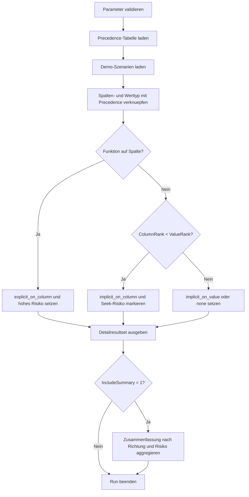

# ImplicitConversionDetector.sql

Dieses Skript bewertet typische Vergleichsmuster auf moegliche implizite Konvertierungen. Statt echter Execution-Plans nutzt es einen didaktischen Szenariokatalog und eine kompakte Precedence-Tabelle, um die wahrscheinliche Konvertierungsrichtung und deren Auswirkung auf SARGability sichtbar zu machen.

## Uebersicht

<!-- SQLDOC:SUMMARY_TABLE:BEGIN -->
| Feld | Wert |
|---|---|
| Script | [ImplicitConversionDetector.sql](ImplicitConversionDetector.sql) |
| Version | `1.0` |
| Typ | `didactic-lab` |
| Kapitel | `12_DataTypes_Conversion` |
| Sicherheit | `read-only-tempdb` |
| Zweck | Bewertet haeufige Typmismatches und markiert Muster mit Risiko fuer SARGability und Planstabilitaet. |
<!-- SQLDOC:SUMMARY_TABLE:END -->

## Annahmen

- Das Skript arbeitet bewusst mit Demo-Szenarien und nicht mit echten Produktionsabfragen oder XML-Plans.
- Die interne Precedence-Tabelle ist kompakt und deckt haeufige Unterrichtsfaelle fuer Zeichen-, Integer-, Datums- und GUID-Vergleiche ab.
- `function_on_column` wird als Hochrisiko markiert, obwohl die Konvertierung dort explizit ist, weil die praktische Indexwirkung sehr aehnlich bleibt.
- Die Resultate sind eine Heuristik fuer Review und Lernzwecke; fuer kritische Abfragen bleibt der echte Ausfuehrungsplan die finale Quelle.

## Parameter

<!-- SQLDOC:PARAMETERS_TABLE:BEGIN -->
| Parameter | SQL-Typ | Pflicht | Beschreibung |
|---|---|---|---|
| `@OnlyRiskyRows` | `BIT` | Nein | Gibt bei `1` nur Muster mit mindestens mittlerem Risiko aus. |
| `@IncludeSummary` | `BIT` | Nein | Gibt bei `1` eine zusaetzliche Zusammenfassung aus. |
<!-- SQLDOC:PARAMETERS_TABLE:END -->

## Abhaengigkeiten

<!-- SQLDOC:DEPENDENCIES_LIST:BEGIN -->
- temporaere Tabellen
- `CASE`-Ausdruecke
- `STRING_AGG()`
<!-- SQLDOC:DEPENDENCIES_LIST:END -->

## Hinweise

- `implicit_on_column` ist der Kernfall fuer moegliche SARGability-Verluste, weil die indizierte Spalte in einen hoeher priorisierten Typ ueberfuehrt werden muss.
- `implicit_on_value` ist meist deutlich unkritischer, weil nur der Vergleichswert oder Parameter erweitert wird.
- `seek_unlikely` fasst explizite Spaltenfunktionen und problematische Typmismatches zusammen.
- Die Empfehlungen formulieren bewusst Datenmodell- oder Schnittstellenmassnahmen statt einzelne Query-Hacks.

## Versionshistorie

<!-- SQLDOC:VERSION_HISTORY_TABLE:BEGIN -->
| Version | Datum | User | Beschreibung |
|---|---|---|---|
| `1.0` | `2026-04-18` | `ER` | Erstversion des didaktischen Detektors fuer implizite Konvertierungen |
<!-- SQLDOC:VERSION_HISTORY_TABLE:END -->

## Ablauf

<!-- SQLDOC:MERMAID:BEGIN -->

<!-- SQLDOC:MERMAID:END -->

## SQL-Code

<!-- SQLDOC:SQL_CODE:BEGIN -->
```sql
/*
BEGIN:SQL-HEADER v1
---
sql_header: v1
script_name: "ImplicitConversionDetector.sql"
script_version: "1.0"
script_type: "didactic-lab"
chapter: "12_DataTypes_Conversion"

purpose: >
  Bewertet typische Vergleichsmuster auf moegliche implizite Konvertierungen
  und markiert Faelle mit Risiko fuer SARGability oder Planstabilitaet.

parameters:
  - name: "@OnlyRiskyRows"
    sql_type: "BIT"
    direction: "IN"
    required: false
    description: "1 = nur Muster mit mindestens mittlerem Risiko ausgeben"
  - name: "@IncludeSummary"
    sql_type: "BIT"
    direction: "IN"
    required: false
    description: "1 = zusaetzliche Zusammenfassung ausgeben"

result_sets:
  - name: "ImplicitConversionAudit"
    description: "Detailbewertung pro Demo-Szenario"
  - name: "ImplicitConversionSummary"
    description: "Aggregierte Uebersicht ueber Richtung und Risiko"

dependencies:
  - "temporary tables"
  - "CASE expressions"
  - "STRING_AGG()"

safety:
  level: "read-only-tempdb"
  writes_data: false

documentation:
  markdown_file: "T-SQL/12_DataTypes_Conversion/SQLScripts/ImplicitConversionDetector.md"
  sync_blocks:
    - "SUMMARY_TABLE"
    - "PARAMETERS_TABLE"
    - "DEPENDENCIES_LIST"
    - "VERSION_HISTORY_TABLE"
    - "SQL_CODE"
  mermaid:
    mode: "ai-agent-from-sql"
    source: "script-body"

main_responsible:
  name: "Erhard Rainer"
  initials: "ER"

version_history:
  - version: "1.0"
    date: "2026-04-18"
    user: "ER"
    description: "Erstversion des didaktischen Detektors fuer implizite Konvertierungen"

notes:
  - "Das Skript bewertet Demo-Szenarien statt echter Execution Plans."
  - "Die Precedence-Tabelle ist kompakt und fokussiert haeufige Unterrichtsfaelle."
---
END:SQL-HEADER v1
*/

SET NOCOUNT ON;

DECLARE @OnlyRiskyRows BIT = 0;
DECLARE @IncludeSummary BIT = 1;

IF @OnlyRiskyRows NOT IN (0, 1)
    THROW 50000, '@OnlyRiskyRows muss 0 oder 1 sein.', 1;

IF @IncludeSummary NOT IN (0, 1)
    THROW 50001, '@IncludeSummary muss 0 oder 1 sein.', 1;

DROP TABLE IF EXISTS #TypePrecedence;
DROP TABLE IF EXISTS #Scenarios;
DROP TABLE IF EXISTS #Audit;

CREATE TABLE #TypePrecedence
(
    TypeName SYSNAME NOT NULL PRIMARY KEY,
    PrecedenceRank INT NOT NULL,
    TypeFamily VARCHAR(30) NOT NULL
);

CREATE TABLE #Scenarios
(
    ScenarioId INT NOT NULL PRIMARY KEY,
    ScenarioLabel VARCHAR(140) NOT NULL,
    IndexedColumnName SYSNAME NOT NULL,
    IndexedColumnType SYSNAME NOT NULL,
    ComparisonValueType SYSNAME NOT NULL,
    PredicateShape VARCHAR(40) NOT NULL,
    ExpressionPattern VARCHAR(40) NOT NULL,
    ExamplePredicate NVARCHAR(300) NOT NULL,
    BusinessConsequence NVARCHAR(220) NOT NULL
);

CREATE TABLE #Audit
(
    ScenarioId INT NOT NULL PRIMARY KEY,
    ScenarioLabel VARCHAR(140) NOT NULL,
    IndexedColumnName SYSNAME NOT NULL,
    IndexedColumnType SYSNAME NOT NULL,
    ComparisonValueType SYSNAME NOT NULL,
    PredicateShape VARCHAR(40) NOT NULL,
    ExpressionPattern VARCHAR(40) NOT NULL,
    ExamplePredicate NVARCHAR(300) NOT NULL,
    ColumnRank INT NULL,
    ValueRank INT NULL,
    ConversionDirection VARCHAR(30) NOT NULL,
    SargabilityEffect VARCHAR(40) NOT NULL,
    RiskLevel VARCHAR(10) NOT NULL,
    RiskScore TINYINT NOT NULL,
    DetectionReason NVARCHAR(240) NOT NULL,
    RecommendedFix NVARCHAR(240) NOT NULL,
    BusinessConsequence NVARCHAR(220) NOT NULL
);

INSERT INTO #TypePrecedence (TypeName, PrecedenceRank, TypeFamily)
VALUES
    (N'bit', 10, 'boolean'),
    (N'varchar', 20, 'string'),
    (N'nvarchar', 30, 'string'),
    (N'int', 40, 'integer'),
    (N'bigint', 50, 'integer'),
    (N'decimal', 60, 'numeric'),
    (N'float', 70, 'numeric'),
    (N'date', 80, 'date-time'),
    (N'datetime', 90, 'date-time'),
    (N'uniqueidentifier', 100, 'identifier');

INSERT INTO #Scenarios
(
    ScenarioId,
    ScenarioLabel,
    IndexedColumnName,
    IndexedColumnType,
    ComparisonValueType,
    PredicateShape,
    ExpressionPattern,
    ExamplePredicate,
    BusinessConsequence
)
VALUES
    (1, 'varchar key compared with int parameter', N'OrderNo', N'varchar', N'int', 'seek_predicate', 'direct_compare', N'WHERE OrderNo = @OrderNoInt', N'Textschluessel verliert oft seine Seek-Faehigkeit.'),
    (2, 'varchar date token compared with date parameter', N'OrderDateText', N'varchar', N'date', 'range_predicate', 'direct_compare', N'WHERE OrderDateText >= @ReportDate', N'Bereichsfilter ueber Importdaten werden schnell teuer.'),
    (3, 'int key compared with nvarchar parameter', N'CustomerId', N'int', N'nvarchar', 'seek_predicate', 'direct_compare', N'WHERE CustomerId = @CustomerIdText', N'Der Wert wird meist einmalig konvertiert.'),
    (4, 'datetime column compared with date parameter', N'CreatedAt', N'datetime', N'date', 'range_predicate', 'direct_compare', N'WHERE CreatedAt >= @StartDate', N'Die Konstante wird eher erweitert als die Spalte.'),
    (5, 'varchar business key compared with nvarchar parameter', N'LegacySku', N'varchar', N'nvarchar', 'seek_predicate', 'direct_compare', N'WHERE LegacySku = @SkuNVarChar', N'Unicode-Parameter koennen die Spalte unguenstig umformen.'),
    (6, 'varchar amount compared with decimal parameter', N'AmountText', N'varchar', N'decimal', 'range_predicate', 'direct_compare', N'WHERE AmountText > @MinimumAmount', N'Importwerte werden numerisch interpretiert und schwer seekbar.'),
    (7, 'explicit TRY_CONVERT on the column side', N'InvoiceDateText', N'varchar', N'date', 'seek_predicate', 'function_on_column', N'WHERE TRY_CONVERT(date, InvoiceDateText, 23) = @InvoiceDate', N'Explizit statt implizit, aber fuer SARGability weiterhin problematisch.'),
    (8, 'decimal column compared with float literal', N'NetAmount', N'decimal', N'float', 'seek_predicate', 'direct_compare', N'WHERE NetAmount = @FloatProbe', N'Approximate Zahlen koennen unruhige Plaene beguenstigen.'),
    (9, 'bigint key compared with int parameter', N'SessionId', N'bigint', N'int', 'seek_predicate', 'direct_compare', N'WHERE SessionId = @SessionIdInt', N'Der Parameter wird erweitert, die Spalte meist nicht.'),
    (10, 'varchar GUID token compared with uniqueidentifier parameter', N'ExternalGuidText', N'varchar', N'uniqueidentifier', 'seek_predicate', 'direct_compare', N'WHERE ExternalGuidText = @ExternalGuid', N'GUID-Filter auf Textspalten laden zu Spaltenkonvertierungen ein.');

INSERT INTO #Audit
(
    ScenarioId,
    ScenarioLabel,
    IndexedColumnName,
    IndexedColumnType,
    ComparisonValueType,
    PredicateShape,
    ExpressionPattern,
    ExamplePredicate,
    ColumnRank,
    ValueRank,
    ConversionDirection,
    SargabilityEffect,
    RiskLevel,
    RiskScore,
    DetectionReason,
    RecommendedFix,
    BusinessConsequence
)
SELECT
    s.ScenarioId,
    s.ScenarioLabel,
    s.IndexedColumnName,
    s.IndexedColumnType,
    s.ComparisonValueType,
    s.PredicateShape,
    s.ExpressionPattern,
    s.ExamplePredicate,
    cp.PrecedenceRank,
    vp.PrecedenceRank,
    CASE
        WHEN s.ExpressionPattern = 'function_on_column' THEN 'explicit_on_column'
        WHEN cp.PrecedenceRank IS NULL OR vp.PrecedenceRank IS NULL THEN 'review_required'
        WHEN cp.PrecedenceRank = vp.PrecedenceRank THEN 'none'
        WHEN cp.PrecedenceRank > vp.PrecedenceRank THEN 'implicit_on_value'
        ELSE 'implicit_on_column'
    END,
    CASE
        WHEN s.ExpressionPattern = 'function_on_column' THEN 'seek_unlikely'
        WHEN cp.PrecedenceRank IS NULL OR vp.PrecedenceRank IS NULL THEN 'manual_review'
        WHEN cp.PrecedenceRank = vp.PrecedenceRank THEN 'neutral'
        WHEN cp.PrecedenceRank > vp.PrecedenceRank THEN 'usually_seekable'
        ELSE 'seek_at_risk'
    END,
    CASE
        WHEN s.ExpressionPattern = 'function_on_column' THEN 'high'
        WHEN cp.PrecedenceRank IS NULL OR vp.PrecedenceRank IS NULL THEN 'medium'
        WHEN cp.PrecedenceRank >= vp.PrecedenceRank THEN 'low'
        ELSE 'high'
    END,
    CASE
        WHEN s.ExpressionPattern = 'function_on_column' THEN 90
        WHEN cp.PrecedenceRank IS NULL OR vp.PrecedenceRank IS NULL THEN 60
        WHEN cp.PrecedenceRank >= vp.PrecedenceRank THEN 20
        WHEN s.PredicateShape = 'range_predicate' THEN 85
        ELSE 80
    END,
    CASE
        WHEN s.ExpressionPattern = 'function_on_column' THEN N'Die Funktion arbeitet direkt auf der Spalte und verhindert typischerweise einen sauberen Seek.'
        WHEN cp.PrecedenceRank IS NULL OR vp.PrecedenceRank IS NULL THEN N'Der Typvergleich liegt ausserhalb der kompakten Unterrichts-Precedence und sollte manuell geprueft werden.'
        WHEN cp.PrecedenceRank = vp.PrecedenceRank THEN N'Beide Seiten liegen auf demselben didaktischen Typniveau.'
        WHEN cp.PrecedenceRank > vp.PrecedenceRank THEN N'Der Vergleichswert besitzt die niedrigere Precedence und wird eher zur Spalte hin konvertiert.'
        ELSE N'Die Spalte besitzt die niedrigere Precedence und wird fuer den Vergleich wahrscheinlich implizit umgewandelt.'
    END,
    CASE
        WHEN s.ExpressionPattern = 'function_on_column' THEN N'Persistiere einen typisierten Suchwert oder filtere ueber eine vorbereitete Zielspalte.'
        WHEN cp.PrecedenceRank IS NULL OR vp.PrecedenceRank IS NULL THEN N'Gleiche Datentypen auf API-, ETL- oder Tabellenebene an und pruefe den echten Plan.'
        WHEN cp.PrecedenceRank >= vp.PrecedenceRank THEN N'Halte Parametertyp und Literalformat konsistent, damit die guenstige Wertkonvertierung stabil bleibt.'
        ELSE N'Parameter und Spalte auf denselben fachlichen Typ bringen oder Textdaten vor dem Indexing typisieren.'
    END,
    s.BusinessConsequence
FROM #Scenarios AS s
LEFT JOIN #TypePrecedence AS cp
    ON cp.TypeName = s.IndexedColumnType
LEFT JOIN #TypePrecedence AS vp
    ON vp.TypeName = s.ComparisonValueType;

SELECT
    a.ScenarioId,
    a.ScenarioLabel,
    a.IndexedColumnName,
    a.IndexedColumnType,
    a.ComparisonValueType,
    a.PredicateShape,
    a.ExpressionPattern,
    a.ConversionDirection,
    a.SargabilityEffect,
    a.RiskLevel,
    a.RiskScore,
    a.ExamplePredicate,
    a.DetectionReason,
    a.RecommendedFix,
    a.BusinessConsequence
FROM #Audit AS a
WHERE @OnlyRiskyRows = 0
   OR a.RiskScore >= 60
ORDER BY
    a.RiskScore DESC,
    a.ScenarioId ASC;

IF @IncludeSummary = 1
BEGIN
    SELECT
        a.ConversionDirection,
        a.RiskLevel,
        COUNT(*) AS ScenarioCount,
        SUM(CASE WHEN a.SargabilityEffect IN ('seek_at_risk', 'seek_unlikely') THEN 1 ELSE 0 END) AS SeekRiskCases,
        STRING_AGG(CONVERT(VARCHAR(10), a.ScenarioId), ', ') WITHIN GROUP (ORDER BY a.ScenarioId) AS ScenarioIds,
        MIN(a.RecommendedFix) AS RepresentativeFix
    FROM #Audit AS a
    GROUP BY
        a.ConversionDirection,
        a.RiskLevel
    ORDER BY
        MAX(a.RiskScore) DESC,
        a.ConversionDirection;
END;
```
<!-- SQLDOC:SQL_CODE:END -->
