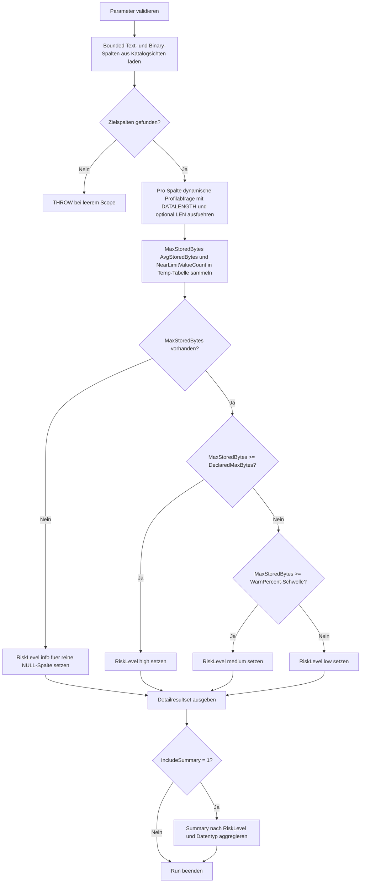

# TruncationRiskScanner.sql

Dieses Skript bewertet begrenzte Text- und Binary-Spalten im aktuellen Datenbestand darauf, wie nah ihre realen Werte an der definierten Maximalbreite liegen. Die Umsetzung ist als diagnostische Bestandsaufnahme gedacht und hilft vor Typverkleinerungen, Importaenderungen oder Schema-Reviews.

## Uebersicht

<!-- SQLDOC:SUMMARY_TABLE:BEGIN -->
| Feld | Wert |
|---|---|
| Script | [TruncationRiskScanner.sql](TruncationRiskScanner.sql) |
| Version | `1.0` |
| Typ | `diagnostic-query` |
| Kapitel | `12_DataTypes_Conversion` |
| Sicherheit | `read-only-tempdb` |
| Zweck | Markiert bounded String- und Binary-Spalten, deren aktuelle Werte nah an der deklarierten Maximalbreite liegen. |
<!-- SQLDOC:SUMMARY_TABLE:END -->

## Einordnung

Der Scanner verbindet Kataloginformationen aus `sys.columns` mit einer datengetriebenen Profilierung pro Spalte. Dadurch wird nicht nur die deklarierte Breite sichtbar, sondern auch, wie stark diese Breite durch die momentan gespeicherten Werte bereits ausgeschopft wird.

Folgende Annahmen gelten fuer diese Erstversion:

- Beruecksichtigt werden nur bounded `char`, `varchar`, `nchar`, `nvarchar`, `binary` und `varbinary`.
- `max`-Typen bleiben bewusst ausserhalb der Analyse, weil dort keine feste Width-Grenze fuer klassische Truncation-Pruefungen vorliegt.
- Die Risikobewertung nutzt `DATALENGTH()` als technische Messgroesse; bei Unicode-Spalten ist das bytebasiert und nicht nur zeichenbasiert.
- `medium` bedeutet, dass mindestens ein Wert den konfigurierbaren Schwellenwert `@WarnPercent` erreicht; `high` bedeutet, dass ein Wert bereits die deklarierte Maximalbreite erreicht.

## Parameter

<!-- SQLDOC:PARAMETERS_TABLE:BEGIN -->
| Parameter | SQL-Typ | Pflicht | Beschreibung |
|---|---|---|---|
| `@SchemaName` | `sysname` | Nein | Optionaler Schemafilter; `NULL` bedeutet alle Schemas. |
| `@TableName` | `sysname` | Nein | Optionaler Tabellenfilter; `NULL` bedeutet alle Tabellen. |
| `@WarnPercent` | `DECIMAL(5,2)` | Nein | Schwellwert in Prozent fuer near-limit-Werte. |
| `@OnlyRiskColumns` | `BIT` | Nein | Gibt bei `1` nur Spalten mit `medium` oder `high` aus. |
| `@IncludeSummary` | `BIT` | Nein | Gibt bei `1` eine aggregierte Summary nach RiskLevel und Datentyp aus. |
<!-- SQLDOC:PARAMETERS_TABLE:END -->

## Abhaengigkeiten

<!-- SQLDOC:DEPENDENCIES_LIST:BEGIN -->
- `sys.schemas`
- `sys.tables`
- `sys.columns`
- `sys.types`
- `sys.sp_executesql`
- `DATALENGTH()`
- `LEN()`
- temporaere Tabellen
- `STRING_AGG()`
<!-- SQLDOC:DEPENDENCIES_LIST:END -->

## Hinweise

- `DeclaredLengthArgument` zeigt die deklarierte Laenge in fachlicher Form; `DeclaredMaxBytes` bleibt die technische Grenze fuer die Bewertung.
- `NearLimitValueCount` zaehlt alle nicht-NULL-Werte, deren `DATALENGTH()` mindestens `@WarnPercent` Prozent der Maximalbreite erreicht.
- `HeadroomBytes` ist der verbleibende Puffer bis zur derzeit groessten beobachteten Belegung.
- Die Summary hilft, riskante Typfamilien schnell zu erkennen, ohne jede Einzelspalte manuell zu pruefen.

## Versionshistorie

<!-- SQLDOC:VERSION_HISTORY_TABLE:BEGIN -->
| Version | Datum | User | Beschreibung |
|---|---|---|---|
| `1.0` | `2026-04-18` | `ER` | Erstversion des Truncation-Risk-Scanners fuer bounded Spalten |
<!-- SQLDOC:VERSION_HISTORY_TABLE:END -->

## Ablauf

<!-- SQLDOC:MERMAID:BEGIN -->

<!-- SQLDOC:MERMAID:END -->

## SQL-Code

<!-- SQLDOC:SQL_CODE:BEGIN -->
```sql
/*
BEGIN:SQL-HEADER v1
---
sql_header: v1
script_name: "TruncationRiskScanner.sql"
script_version: "1.0"
script_type: "diagnostic-query"
chapter: "12_DataTypes_Conversion"

purpose: >
  Bewertet bounded Text- und Binary-Spalten darauf, wie nah die aktuell
  gespeicherten Werte an der definierten Maximalbreite liegen. Das Skript
  kombiniert Katalogsicht, dynamische Profilierung pro Spalte und eine
  Risikoklassifikation fuer moegliche Truncation- oder Width-Reserve-Themen.

parameters:
  - name: "@SchemaName"
    sql_type: "sysname"
    direction: "IN"
    required: false
    description: "Optionaler Schemafilter; NULL = alle Schemas"
  - name: "@TableName"
    sql_type: "sysname"
    direction: "IN"
    required: false
    description: "Optionaler Tabellenfilter; NULL = alle Tabellen"
  - name: "@WarnPercent"
    sql_type: "DECIMAL(5,2)"
    direction: "IN"
    required: false
    description: "Ab welcher Auslastung in Prozent eine Spalte als width risk markiert wird"
  - name: "@OnlyRiskColumns"
    sql_type: "BIT"
    direction: "IN"
    required: false
    description: "1 = nur Spalten mit RiskLevel high oder medium ausgeben"
  - name: "@IncludeSummary"
    sql_type: "BIT"
    direction: "IN"
    required: false
    description: "1 = zusaetzliche Zusammenfassung nach RiskLevel und Datentyp ausgeben"

result_sets:
  - name: "TruncationRiskDetail"
    description: "Profilwerte je begrenzter String- oder Binary-Spalte inklusive Width-Risiko"
  - name: "TruncationRiskSummary"
    description: "Aggregierte Sicht nach RiskLevel und Datentyp"

dependencies:
  - "sys.schemas"
  - "sys.tables"
  - "sys.columns"
  - "sys.types"
  - "sys.sp_executesql"
  - "DATALENGTH()"
  - "LEN()"
  - "temporary tables"
  - "STRING_AGG()"

safety:
  level: "read-only-tempdb"
  writes_data: false

documentation:
  markdown_file: "T-SQL/12_DataTypes_Conversion/SQLScripts/TruncationRiskScanner.md"
  sync_blocks:
    - "SUMMARY_TABLE"
    - "PARAMETERS_TABLE"
    - "DEPENDENCIES_LIST"
    - "VERSION_HISTORY_TABLE"
    - "SQL_CODE"
  mermaid:
    mode: "ai-agent-from-sql"
    source: "script-body"

main_responsible:
  name: "Erhard Rainer"
  initials: "ER"

version_history:
  - version: "1.0"
    date: "2026-04-18"
    user: "ER"
    description: "Erstversion des Truncation-Risk-Scanners fuer bounded Spalten"

notes:
  - "Es werden nur bounded char/varchar/nchar/nvarchar/binary/varbinary-Spalten betrachtet."
  - "max-Typen werden bewusst ausgelassen, weil dort keine feste Width-Grenze fuer Truncation vorliegt."
---
END:SQL-HEADER v1
*/

SET NOCOUNT ON;

DECLARE @SchemaName      SYSNAME        = NULL;
DECLARE @TableName       SYSNAME        = NULL;
DECLARE @WarnPercent     DECIMAL(5,2)   = 85.00;
DECLARE @OnlyRiskColumns BIT            = 0;
DECLARE @IncludeSummary  BIT            = 1;

IF @SchemaName IS NOT NULL AND LTRIM(RTRIM(@SchemaName)) = ''
BEGIN
    THROW 50000, '@SchemaName darf nicht leer sein.', 1;
END;

IF @TableName IS NOT NULL AND LTRIM(RTRIM(@TableName)) = ''
BEGIN
    THROW 50001, '@TableName darf nicht leer sein.', 1;
END;

IF @WarnPercent IS NULL OR @WarnPercent <= 0 OR @WarnPercent > 100
BEGIN
    THROW 50002, '@WarnPercent muss zwischen 0 und 100 liegen.', 1;
END;

IF @OnlyRiskColumns NOT IN (0, 1) OR @IncludeSummary NOT IN (0, 1)
BEGIN
    THROW 50003, 'Die BIT-Parameter muessen 0 oder 1 sein.', 1;
END;

DROP TABLE IF EXISTS #TargetColumns;
DROP TABLE IF EXISTS #ColumnProfile;

CREATE TABLE #TargetColumns
(
    SchemaName             SYSNAME        NOT NULL,
    TableName              SYSNAME        NOT NULL,
    ColumnName             SYSNAME        NOT NULL,
    DataType               SYSNAME        NOT NULL,
    TypeDefinition         NVARCHAR(128)  NOT NULL,
    DeclaredLengthArgument INT            NOT NULL,
    DeclaredLengthUnit     VARCHAR(20)    NOT NULL,
    DeclaredMaxBytes       INT            NOT NULL,
    IsTextual              BIT            NOT NULL
);

CREATE TABLE #ColumnProfile
(
    SchemaName             SYSNAME         NOT NULL,
    TableName              SYSNAME         NOT NULL,
    ColumnName             SYSNAME         NOT NULL,
    DataType               SYSNAME         NOT NULL,
    TypeDefinition         NVARCHAR(128)   NOT NULL,
    DeclaredLengthArgument INT             NOT NULL,
    DeclaredLengthUnit     VARCHAR(20)     NOT NULL,
    DeclaredMaxBytes       INT             NOT NULL,
    NonNullValueCount      BIGINT          NOT NULL,
    MaxStoredBytes         INT             NULL,
    AvgStoredBytes         DECIMAL(19,2)   NULL,
    MaxCharacterLength     INT             NULL,
    NearLimitValueCount    BIGINT          NOT NULL,
    UtilizationPercent     DECIMAL(9,2)    NULL,
    HeadroomBytes          INT             NULL,
    RiskLevel              VARCHAR(10)     NOT NULL,
    RiskReason             NVARCHAR(400)   NOT NULL
);

INSERT INTO #TargetColumns
(
    SchemaName,
    TableName,
    ColumnName,
    DataType,
    TypeDefinition,
    DeclaredLengthArgument,
    DeclaredLengthUnit,
    DeclaredMaxBytes,
    IsTextual
)
SELECT
    s.name AS SchemaName,
    t.name AS TableName,
    c.name AS ColumnName,
    ty.name AS DataType,
    ty.name
        + N'('
        + CASE
            WHEN ty.name IN (N'nchar', N'nvarchar') THEN CONVERT(NVARCHAR(10), c.max_length / 2)
            ELSE CONVERT(NVARCHAR(10), c.max_length)
          END
        + N')' AS TypeDefinition,
    CASE
        WHEN ty.name IN (N'nchar', N'nvarchar') THEN c.max_length / 2
        ELSE c.max_length
    END AS DeclaredLengthArgument,
    CASE
        WHEN ty.name IN (N'nchar', N'nvarchar') THEN 'characters'
        ELSE 'bytes'
    END AS DeclaredLengthUnit,
    c.max_length AS DeclaredMaxBytes,
    CASE
        WHEN ty.name IN (N'char', N'varchar', N'nchar', N'nvarchar') THEN 1
        ELSE 0
    END AS IsTextual
FROM sys.tables AS t
INNER JOIN sys.schemas AS s
    ON s.schema_id = t.schema_id
INNER JOIN sys.columns AS c
    ON c.object_id = t.object_id
INNER JOIN sys.types AS ty
    ON ty.user_type_id = c.user_type_id
WHERE t.is_ms_shipped = 0
  AND ty.name IN (N'char', N'varchar', N'nchar', N'nvarchar', N'binary', N'varbinary')
  AND c.max_length > 0
  AND c.max_length <> -1
  AND (@SchemaName IS NULL OR s.name = @SchemaName)
  AND (@TableName IS NULL OR t.name = @TableName);

IF NOT EXISTS (SELECT 1 FROM #TargetColumns)
BEGIN
    THROW 50004, 'Keine passenden bounded String- oder Binary-Spalten fuer den Filter gefunden.', 1;
END;

DECLARE
    @CurrentSchemaName     SYSNAME,
    @CurrentTableName      SYSNAME,
    @CurrentColumnName     SYSNAME,
    @CurrentDataType       SYSNAME,
    @CurrentTypeDefinition NVARCHAR(128),
    @CurrentLengthArgument INT,
    @CurrentLengthUnit     VARCHAR(20),
    @CurrentDeclaredBytes  INT,
    @CurrentIsTextual      BIT,
    @Sql                   NVARCHAR(MAX);

DECLARE column_cursor CURSOR LOCAL FAST_FORWARD FOR
SELECT
    tc.SchemaName,
    tc.TableName,
    tc.ColumnName,
    tc.DataType,
    tc.TypeDefinition,
    tc.DeclaredLengthArgument,
    tc.DeclaredLengthUnit,
    tc.DeclaredMaxBytes,
    tc.IsTextual
FROM #TargetColumns AS tc
ORDER BY
    tc.SchemaName,
    tc.TableName,
    tc.ColumnName;

OPEN column_cursor;

FETCH NEXT FROM column_cursor
INTO
    @CurrentSchemaName,
    @CurrentTableName,
    @CurrentColumnName,
    @CurrentDataType,
    @CurrentTypeDefinition,
    @CurrentLengthArgument,
    @CurrentLengthUnit,
    @CurrentDeclaredBytes,
    @CurrentIsTextual;

WHILE @@FETCH_STATUS = 0
BEGIN
    SET @Sql =
        N'
INSERT INTO #ColumnProfile
(
    SchemaName,
    TableName,
    ColumnName,
    DataType,
    TypeDefinition,
    DeclaredLengthArgument,
    DeclaredLengthUnit,
    DeclaredMaxBytes,
    NonNullValueCount,
    MaxStoredBytes,
    AvgStoredBytes,
    MaxCharacterLength,
    NearLimitValueCount,
    UtilizationPercent,
    HeadroomBytes,
    RiskLevel,
    RiskReason
)
SELECT
    @SchemaNameParam,
    @TableNameParam,
    @ColumnNameParam,
    @DataTypeParam,
    @TypeDefinitionParam,
    @DeclaredLengthArgumentParam,
    @DeclaredLengthUnitParam,
    @DeclaredMaxBytesParam,
    COALESCE(SUM(CASE WHEN src.' + QUOTENAME(@CurrentColumnName) + N' IS NOT NULL THEN CONVERT(BIGINT, 1) ELSE CONVERT(BIGINT, 0) END), 0),
    MAX(DATALENGTH(src.' + QUOTENAME(@CurrentColumnName) + N')),
    CAST(AVG(CASE WHEN src.' + QUOTENAME(@CurrentColumnName) + N' IS NULL THEN NULL ELSE 1.0 * DATALENGTH(src.' + QUOTENAME(@CurrentColumnName) + N') END) AS DECIMAL(19,2)),
    '
        + CASE
            WHEN @CurrentIsTextual = 1
                THEN N'MAX(CASE WHEN src.' + QUOTENAME(@CurrentColumnName) + N' IS NULL THEN NULL ELSE LEN(CONVERT(NVARCHAR(MAX), src.' + QUOTENAME(@CurrentColumnName) + N')) END),'
            ELSE N'NULL,'
          END
        + N'
    COALESCE
    (
        SUM
        (
            CASE
                WHEN src.' + QUOTENAME(@CurrentColumnName) + N' IS NOT NULL
                 AND DATALENGTH(src.' + QUOTENAME(@CurrentColumnName) + N') >= CEILING(@DeclaredMaxBytesParam * (@WarnPercentParam / 100.0))
                    THEN CONVERT(BIGINT, 1)
                ELSE CONVERT(BIGINT, 0)
            END
        ),
        0
    ),
    CAST
    (
        CASE
            WHEN MAX(DATALENGTH(src.' + QUOTENAME(@CurrentColumnName) + N')) IS NULL THEN NULL
            ELSE 100.0 * MAX(DATALENGTH(src.' + QUOTENAME(@CurrentColumnName) + N')) / NULLIF(@DeclaredMaxBytesParam, 0)
        END
        AS DECIMAL(9,2)
    ),
    CASE
        WHEN MAX(DATALENGTH(src.' + QUOTENAME(@CurrentColumnName) + N')) IS NULL THEN NULL
        ELSE @DeclaredMaxBytesParam - MAX(DATALENGTH(src.' + QUOTENAME(@CurrentColumnName) + N'))
    END,
    CASE
        WHEN MAX(DATALENGTH(src.' + QUOTENAME(@CurrentColumnName) + N')) IS NULL THEN ''info''
        WHEN MAX(DATALENGTH(src.' + QUOTENAME(@CurrentColumnName) + N')) >= @DeclaredMaxBytesParam THEN ''high''
        WHEN MAX(DATALENGTH(src.' + QUOTENAME(@CurrentColumnName) + N')) >= CEILING(@DeclaredMaxBytesParam * (@WarnPercentParam / 100.0)) THEN ''medium''
        ELSE ''low''
    END,
    CASE
        WHEN MAX(DATALENGTH(src.' + QUOTENAME(@CurrentColumnName) + N')) IS NULL
            THEN N''Spalte enthaelt im aktuellen Datenbestand nur NULL-Werte.''
        WHEN MAX(DATALENGTH(src.' + QUOTENAME(@CurrentColumnName) + N')) >= @DeclaredMaxBytesParam
            THEN N''Mindestens ein Wert erreicht bereits die deklarierte Maximalbreite; kuenftige Erweiterungen oder Typwechsel sind truncation-kritisch.''
        WHEN MAX(DATALENGTH(src.' + QUOTENAME(@CurrentColumnName) + N')) >= CEILING(@DeclaredMaxBytesParam * (@WarnPercentParam / 100.0))
            THEN N''Aktuelle Werte liegen nah an der definierten Maximalbreite und sollten vor Laengenkuerzungen oder neuem Input beobachtet werden.''
        ELSE N''Der aktuelle Datenbestand laesst noch spuerbare Width-Reserve zur deklarierten Maximalbreite.''
    END
FROM ' + QUOTENAME(@CurrentSchemaName) + N'.' + QUOTENAME(@CurrentTableName) + N' AS src;';

    EXEC sys.sp_executesql
        @Sql,
        N'@SchemaNameParam SYSNAME,
          @TableNameParam SYSNAME,
          @ColumnNameParam SYSNAME,
          @DataTypeParam SYSNAME,
          @TypeDefinitionParam NVARCHAR(128),
          @DeclaredLengthArgumentParam INT,
          @DeclaredLengthUnitParam VARCHAR(20),
          @DeclaredMaxBytesParam INT,
          @WarnPercentParam DECIMAL(5,2)',
        @SchemaNameParam = @CurrentSchemaName,
        @TableNameParam = @CurrentTableName,
        @ColumnNameParam = @CurrentColumnName,
        @DataTypeParam = @CurrentDataType,
        @TypeDefinitionParam = @CurrentTypeDefinition,
        @DeclaredLengthArgumentParam = @CurrentLengthArgument,
        @DeclaredLengthUnitParam = @CurrentLengthUnit,
        @DeclaredMaxBytesParam = @CurrentDeclaredBytes,
        @WarnPercentParam = @WarnPercent;

    FETCH NEXT FROM column_cursor
    INTO
        @CurrentSchemaName,
        @CurrentTableName,
        @CurrentColumnName,
        @CurrentDataType,
        @CurrentTypeDefinition,
        @CurrentLengthArgument,
        @CurrentLengthUnit,
        @CurrentDeclaredBytes,
        @CurrentIsTextual;
END;

CLOSE column_cursor;
DEALLOCATE column_cursor;

SELECT
    cp.SchemaName,
    cp.TableName,
    cp.ColumnName,
    cp.DataType,
    cp.TypeDefinition,
    cp.DeclaredLengthArgument,
    cp.DeclaredLengthUnit,
    cp.DeclaredMaxBytes,
    cp.NonNullValueCount,
    cp.MaxStoredBytes,
    cp.AvgStoredBytes,
    cp.MaxCharacterLength,
    cp.NearLimitValueCount,
    cp.UtilizationPercent,
    cp.HeadroomBytes,
    cp.RiskLevel,
    cp.RiskReason
FROM #ColumnProfile AS cp
WHERE @OnlyRiskColumns = 0
   OR cp.RiskLevel IN ('high', 'medium')
ORDER BY
    CASE cp.RiskLevel
        WHEN 'high' THEN 1
        WHEN 'medium' THEN 2
        WHEN 'info' THEN 3
        ELSE 4
    END,
    cp.UtilizationPercent DESC,
    cp.SchemaName,
    cp.TableName,
    cp.ColumnName;

IF @IncludeSummary = 1
BEGIN
    SELECT
        cp.RiskLevel,
        cp.DataType,
        COUNT(*) AS ColumnCount,
        SUM(cp.NearLimitValueCount) AS NearLimitValueCount,
        MAX(cp.UtilizationPercent) AS HighestUtilizationPercent,
        MIN(cp.HeadroomBytes) AS SmallestHeadroomBytes,
        STRING_AGG(CONCAT(cp.SchemaName, '.', cp.TableName, '.', cp.ColumnName), ', ')
            WITHIN GROUP (ORDER BY cp.SchemaName, cp.TableName, cp.ColumnName) AS ExampleColumns
    FROM #ColumnProfile AS cp
    GROUP BY
        cp.RiskLevel,
        cp.DataType
    ORDER BY
        CASE cp.RiskLevel
            WHEN 'high' THEN 1
            WHEN 'medium' THEN 2
            WHEN 'info' THEN 3
            ELSE 4
        END,
        cp.DataType;
END;
```
<!-- SQLDOC:SQL_CODE:END -->
