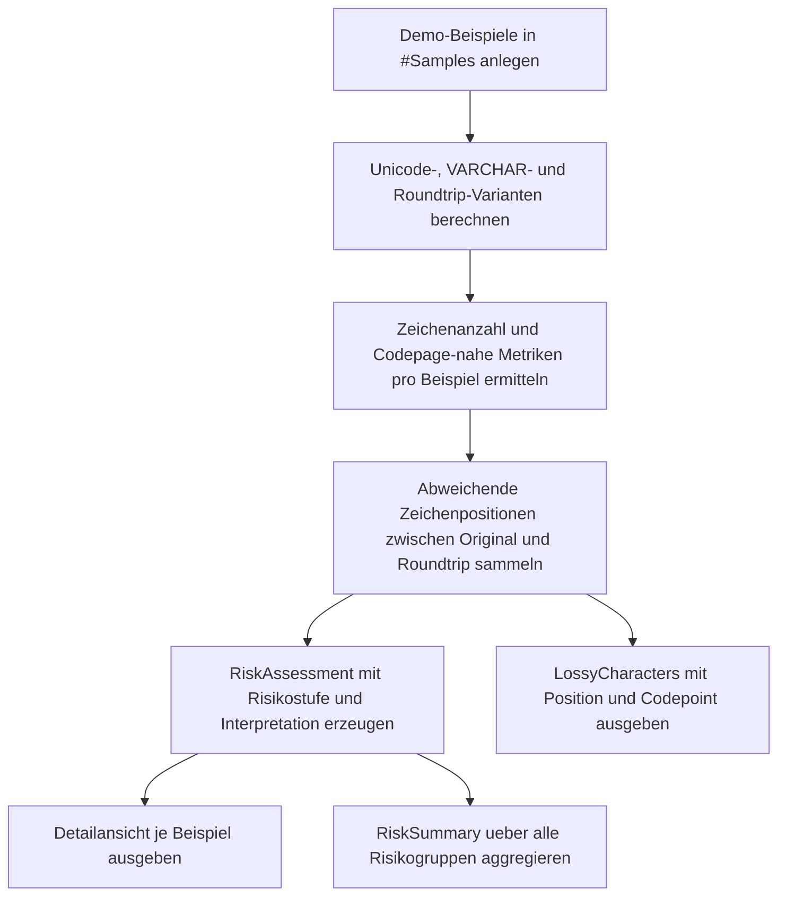

# UnicodeFallbackRiskCheck.sql

Dieses Skript zeigt an einer kompakten Demo-Stichprobe, welche Zeichen und Texte beim Wechsel von `NVARCHAR` nach `VARCHAR` in eine codepage-basierte Sicht riskant werden. Der Fokus liegt auf Roundtrip-Verlusten, Ersatzzeichen und einer klaren Einordnung nach Risikostufe.

## Uebersicht

<!-- SQLDOC:SUMMARY_TABLE:BEGIN -->
| Feld | Wert |
|---|---|
| Script | [UnicodeFallbackRiskCheck.sql](UnicodeFallbackRiskCheck.sql) |
| Version | `1.0` |
| Typ | `didactic-lab` |
| Kapitel | `12_DataTypes_Conversion` |
| Sicherheit | `read-only-tempdb` |
| Zweck | Prueft Unicode-zu-VARCHAR-Risiken ueber Roundtrip-Vergleiche, Fallbacks und Zeichenanalyse. |
<!-- SQLDOC:SUMMARY_TABLE:END -->

## Annahmen

- Die Erstversion arbeitet nur mit eingebauten Demo-Texten und ohne produktive Tabellen.
- Der Nicht-Unicode-Pfad wird ueber `VARCHAR` mit `SQL_Latin1_General_CP1_CI_AS` modelliert, weil dieser Wechsel typische Codepage-Probleme sichtbar macht.
- Ein Zeichen gilt als risikobehaftet, wenn der Unicode-VARCHAR-Unicode-Roundtrip vom Original abweicht oder wenn ein Fallback wie `?` sichtbar wird.
- Kombinierende Zeichen, typografische Varianten und Supplementary-Zeichen werden bewusst mit aufgenommen, weil sie in Datenimporten oder Exporten oft uebersehen werden.

## Anwendungsfall

Das Skript eignet sich fuer folgende Leitfragen:

- Welche Texte bleiben beim Cast nach `VARCHAR` stabil, und welche nicht?
- An welchen Positionen aendert sich der Inhalt nach dem Roundtrip konkret?
- Welche Beispiele enthalten Zeichen ausserhalb der typischen Nicht-Unicode-Codepage?

## Parameter

<!-- SQLDOC:PARAMETERS_TABLE:BEGIN -->
| Parameter | SQL-Typ | Pflicht | Beschreibung |
|---|---|---|---|
| `-` | `-` | `-` | Dieses Demoskript verwendet keine Laufzeitparameter. |
<!-- SQLDOC:PARAMETERS_TABLE:END -->

## Abhaengigkeiten

<!-- SQLDOC:DEPENDENCIES_LIST:BEGIN -->
- `COLLATE`
- `CONVERT()`
- `UNICODE()`
- `ROW_NUMBER()`
- `STRING_AGG()`
- `sys.fn_varbintohexstr()`
- temporaere Tabellen in `tempdb`
<!-- SQLDOC:DEPENDENCIES_LIST:END -->

## Hinweise

- `RiskAssessment` zeigt pro Beispiel Originaltext, `VARCHAR`-Bild, Roundtrip-Ergebnis und die abgeleitete Risikostufe.
- `LossyCharacters` macht die tatsaechlich veraenderten Positionen sichtbar, damit der Verlust nicht nur abstrakt bleibt.
- `RiskSummary` verdichtet die Beispiele nach Risiko, Roundtrip-Verlust und sichtbarem `?`-Fallback.
- Die Demo ist absichtlich didaktisch: Sie soll typische Unicode-Fallen zeigen, nicht eine konkrete Produktionscodepage vollstaendig abbilden.

## Versionshistorie

<!-- SQLDOC:VERSION_HISTORY_TABLE:BEGIN -->
| Version | Datum | User | Beschreibung |
|---|---|---|---|
| `1.0` | `2026-04-18` | `ER` | Erstversion des Unicode-Fallback-Risikochecks |
<!-- SQLDOC:VERSION_HISTORY_TABLE:END -->

## Ablauf

<!-- SQLDOC:MERMAID:BEGIN -->

<!-- SQLDOC:MERMAID:END -->

## SQL-Code

<!-- SQLDOC:SQL_CODE:BEGIN -->
```sql
/*
BEGIN:SQL-HEADER v1
---
sql_header: v1
script_name: "UnicodeFallbackRiskCheck.sql"
script_version: "1.0"
script_type: "didactic-lab"
chapter: "12_DataTypes_Conversion"

purpose: >
  Prueft an einer kleinen Demo-Stichprobe, welche Risiken beim Wechsel von
  Unicode-Typen nach VARCHAR unter einer codepage-basierten Kollation
  entstehen. Das Skript zeigt Roundtrip-Verluste, moegliche Ersatzzeichen
  sowie den Anteil nicht-ASCII-faehiger Zeichen pro Beispielwert.

parameters: []

result_sets:
  - name: "RiskAssessment"
    description: "Detailansicht je Beispielwert mit Roundtrip-Vergleich und Risikostufe"
  - name: "LossyCharacters"
    description: "Zeigt Zeichenpositionen, an denen der VARCHAR-Roundtrip vom Original abweicht"
  - name: "RiskSummary"
    description: "Verdichtete Zusammenfassung nach Risikostufe und Muster"

dependencies:
  - "COLLATE"
  - "CONVERT()"
  - "UNICODE()"
  - "ROW_NUMBER()"
  - "STRING_AGG()"
  - "sys.fn_varbintohexstr()"
  - "temporary tables"

safety:
  level: "read-only-tempdb"
  writes_data: false

documentation:
  markdown_file: "T-SQL/12_DataTypes_Conversion/SQLScripts/UnicodeFallbackRiskCheck.md"
  sync_blocks:
    - "SUMMARY_TABLE"
    - "PARAMETERS_TABLE"
    - "DEPENDENCIES_LIST"
    - "VERSION_HISTORY_TABLE"
    - "SQL_CODE"
  mermaid:
    mode: "ai-agent-from-sql"
    source: "script-body"

main_responsible:
  name: "Erhard Rainer"
  initials: "ER"

version_history:
  - version: "1.0"
    date: "2026-04-18"
    user: "ER"
    description: "Erstversion des Unicode-Fallback-Risikochecks"

notes:
  - "Die Demo nutzt nur temporaere Beispielwerte und keine produktiven Tabellen."
  - "Der VARCHAR-Cast verwendet SQL_Latin1_General_CP1_CI_AS als typische Nicht-Unicode-Sicht."
  - "Supplementary-Zeichen und nicht in der Codepage vorhandene Zeichen koennen beim Roundtrip abweichen."
---
END:SQL-HEADER v1
*/

SET NOCOUNT ON;

DROP TABLE IF EXISTS #Samples;

CREATE TABLE #Samples
(
    SampleId      INT            NOT NULL PRIMARY KEY,
    ScenarioName  VARCHAR(40)    NOT NULL,
    SampleText    NVARCHAR(200)  NOT NULL,
    Notes         VARCHAR(200)   NOT NULL
);

INSERT INTO #Samples
(
    SampleId,
    ScenarioName,
    SampleText,
    Notes
)
VALUES
    (1, 'AsciiOnly',      N'Plain invoice 2026',                         'Referenzwert ohne Unicode-Risiko.'),
    (2, 'GermanUmlaut',   N'Fu' + NCHAR(776) + N'r Muenchen',            'Enthaelt ein kombinierendes Trema und zeigt Normalisierungsrisiken.'),
    (3, 'EuroSign',       N'Budget ' + NCHAR(8364) + N' 1250',           'Eurozeichen ist codepage-abhaengig und haeufig relevant bei Exports.'),
    (4, 'CyrillicName',   N'Za' + NCHAR(1082) + NCHAR(1072) + NCHAR(1079), 'Nicht-lateinische Schrift mit erwartbarem Fallback im VARCHAR-Cast.'),
    (5, 'EmojiFlag',      N'Status ' + NCHAR(55357) + NCHAR(56960),      'Supplementary-Zeichen mit hoher Roundtrip-Gefahr.'),
    (6, 'SmartQuote',     N'Quote' + NCHAR(8217) + N's demo',            'Typografisches Apostroph statt ASCII-Quote.'),
    (7, 'ChineseWord',    N'Han ' + NCHAR(28450) + NCHAR(23383),         'CJK-Zeichen sind in CP1252 nicht abbildbar.'),
    (8, 'LongDash',       N'A' + NCHAR(8212) + N'B',                     'Em-Dash zeigt Verlust zwischen typografischer und ASCII-Zeichensicht.');

WITH Numbers AS
(
    SELECT TOP (200)
        ROW_NUMBER() OVER (ORDER BY (SELECT 0)) AS PositionNo
    FROM sys.all_objects AS ao
),
SampleProfile AS
(
    SELECT
        s.SampleId,
        s.ScenarioName,
        s.SampleText,
        CONVERT(VARCHAR(200), s.SampleText) COLLATE SQL_Latin1_General_CP1_CI_AS AS CastVarcharText,
        CONVERT(NVARCHAR(200), CONVERT(VARCHAR(200), s.SampleText) COLLATE SQL_Latin1_General_CP1_CI_AS) AS RoundtripText,
        LEN(s.SampleText) AS OriginalLength,
        LEN(CONVERT(VARCHAR(200), s.SampleText) COLLATE SQL_Latin1_General_CP1_CI_AS) AS CastLength,
        sys.fn_varbintohexstr(CONVERT(VARBINARY(400), s.SampleText)) AS UnicodeHex,
        sys.fn_varbintohexstr(CONVERT(VARBINARY(400), CONVERT(VARCHAR(200), s.SampleText) COLLATE SQL_Latin1_General_CP1_CI_AS)) AS VarcharHex,
        s.Notes
    FROM #Samples AS s
),
CharacterMetrics AS
(
    SELECT
        sp.SampleId,
        SUM(CASE WHEN UNICODE(SUBSTRING(sp.SampleText, n.PositionNo, 1)) > 127 THEN 1 ELSE 0 END) AS NonAsciiCount,
        SUM(CASE WHEN UNICODE(SUBSTRING(sp.SampleText, n.PositionNo, 1)) > 255 THEN 1 ELSE 0 END) AS OutsideCodePageCount
    FROM SampleProfile AS sp
    INNER JOIN Numbers AS n
        ON n.PositionNo <= LEN(sp.SampleText)
    GROUP BY
        sp.SampleId
),
LossyPositions AS
(
    SELECT
        sp.SampleId,
        n.PositionNo,
        SUBSTRING(sp.SampleText, n.PositionNo, 1) AS OriginalChar,
        SUBSTRING(sp.RoundtripText, n.PositionNo, 1) AS RoundtripChar,
        UNICODE(SUBSTRING(sp.SampleText, n.PositionNo, 1)) AS OriginalCodePoint,
        UNICODE(SUBSTRING(sp.RoundtripText, n.PositionNo, 1)) AS RoundtripCodePoint
    FROM SampleProfile AS sp
    INNER JOIN Numbers AS n
        ON n.PositionNo <= LEN(sp.SampleText)
    WHERE SUBSTRING(sp.SampleText, n.PositionNo, 1) <> SUBSTRING(sp.RoundtripText, n.PositionNo, 1)
),
LossyOverview AS
(
    SELECT
        lp.SampleId,
        COUNT(*) AS LossyCharacterCount,
        STRING_AGG(CONVERT(VARCHAR(10), lp.PositionNo), ', ') AS LossyPositionsCsv
    FROM LossyPositions AS lp
    GROUP BY
        lp.SampleId
),
RiskAssessment AS
(
    SELECT
        sp.SampleId,
        sp.ScenarioName,
        sp.SampleText,
        sp.CastVarcharText,
        sp.RoundtripText,
        sp.OriginalLength,
        sp.CastLength,
        cm.NonAsciiCount,
        cm.OutsideCodePageCount,
        COALESCE(lo.LossyCharacterCount, 0) AS LossyCharacterCount,
        COALESCE(lo.LossyPositionsCsv, '-') AS LossyPositions,
        CASE
            WHEN sp.SampleText <> sp.RoundtripText THEN 1
            ELSE 0
        END AS HasRoundtripLoss,
        CASE
            WHEN sp.CastVarcharText LIKE '%?%' THEN 1
            ELSE 0
        END AS HasQuestionMarkFallback,
        CASE
            WHEN sp.SampleText = sp.RoundtripText AND cm.NonAsciiCount = 0 THEN 'none'
            WHEN sp.SampleText = sp.RoundtripText AND cm.NonAsciiCount > 0 THEN 'low'
            WHEN sp.SampleText <> sp.RoundtripText AND cm.OutsideCodePageCount = 0 THEN 'medium'
            ELSE 'high'
        END AS RiskLevel,
        CASE
            WHEN sp.SampleText = sp.RoundtripText AND cm.NonAsciiCount = 0 THEN 'ASCII-stabil: Wechsel nach VARCHAR ist fuer dieses Beispiel verlustfrei.'
            WHEN sp.SampleText = sp.RoundtripText AND cm.NonAsciiCount > 0 THEN 'Unicode vorhanden, aber in dieser Codepage noch verlustfrei abbildbar.'
            WHEN sp.SampleText <> sp.RoundtripText AND cm.OutsideCodePageCount = 0 THEN 'Roundtrip weicht ab; pruefe Kollation, Normalisierung oder typografische Varianten.'
            ELSE 'Mindestens ein Zeichen faellt ausserhalb der Zielcodepage oder wird beim Fallback ersetzt.'
        END AS Interpretation,
        sp.UnicodeHex,
        sp.VarcharHex,
        sp.Notes
    FROM SampleProfile AS sp
    INNER JOIN CharacterMetrics AS cm
        ON cm.SampleId = sp.SampleId
    LEFT JOIN LossyOverview AS lo
        ON lo.SampleId = sp.SampleId
)
SELECT
    ra.SampleId,
    ra.ScenarioName,
    ra.SampleText,
    ra.CastVarcharText,
    ra.RoundtripText,
    ra.OriginalLength,
    ra.CastLength,
    ra.NonAsciiCount,
    ra.OutsideCodePageCount,
    ra.LossyCharacterCount,
    ra.LossyPositions,
    ra.HasRoundtripLoss,
    ra.HasQuestionMarkFallback,
    ra.RiskLevel,
    ra.Interpretation,
    ra.UnicodeHex,
    ra.VarcharHex,
    ra.Notes
FROM RiskAssessment AS ra
ORDER BY
    CASE ra.RiskLevel
        WHEN 'high' THEN 1
        WHEN 'medium' THEN 2
        WHEN 'low' THEN 3
        ELSE 4
    END,
    ra.SampleId;

SELECT
    lp.SampleId,
    sp.ScenarioName,
    lp.PositionNo,
    lp.OriginalChar,
    lp.RoundtripChar,
    lp.OriginalCodePoint,
    lp.RoundtripCodePoint
FROM LossyPositions AS lp
INNER JOIN SampleProfile AS sp
    ON sp.SampleId = lp.SampleId
ORDER BY
    lp.SampleId,
    lp.PositionNo;

SELECT
    ra.RiskLevel,
    ra.HasRoundtripLoss,
    ra.HasQuestionMarkFallback,
    COUNT(*) AS SampleCount,
    SUM(ra.NonAsciiCount) AS TotalNonAsciiChars,
    SUM(ra.OutsideCodePageCount) AS TotalOutsideCodePageChars,
    STRING_AGG(ra.ScenarioName, ', ') AS Scenarios
FROM RiskAssessment AS ra
GROUP BY
    ra.RiskLevel,
    ra.HasRoundtripLoss,
    ra.HasQuestionMarkFallback
ORDER BY
    CASE ra.RiskLevel
        WHEN 'high' THEN 1
        WHEN 'medium' THEN 2
        WHEN 'low' THEN 3
        ELSE 4
    END,
    ra.HasRoundtripLoss DESC,
    ra.HasQuestionMarkFallback DESC;
```
<!-- SQLDOC:SQL_CODE:END -->
