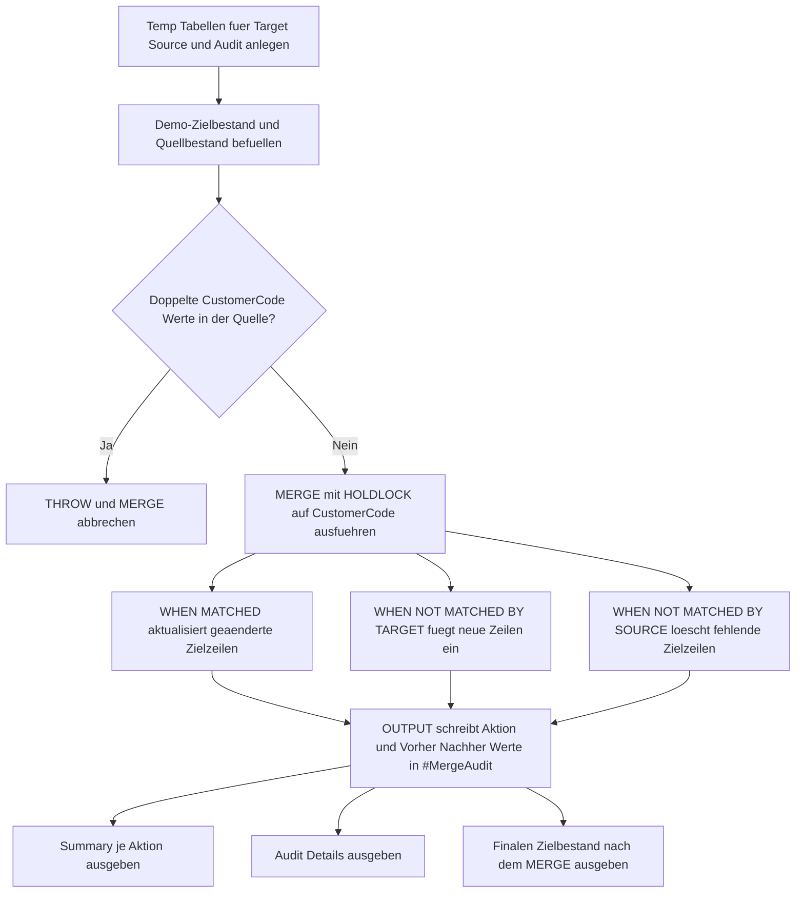

# MergeActionAudit.sql

Dieses Skript demonstriert ein didaktisches `MERGE`, das `INSERT`-, `UPDATE`- und `DELETE`-Aktionen ueber `OUTPUT $action` in einer Audit-Tabelle festhaelt. Die Demo bleibt auf temporaere Tabellen begrenzt und eignet sich damit fuer Schulung, Review und die Besprechung typischer `MERGE`-Nebenwirkungen.

## Uebersicht

<!-- SQLDOC:SUMMARY_TABLE:BEGIN -->
| Feld | Wert |
|---|---|
| Script | [MergeActionAudit.sql](MergeActionAudit.sql) |
| Version | `1.0` |
| Typ | `didactic-lab` |
| Kapitel | `13_Merge` |
| Sicherheit | `demo-write-tempdb` |
| Zweck | Protokolliert MERGE-Aktionen ueber OUTPUT $action und zeigt Audit- sowie Nachher-Resultsets. |
<!-- SQLDOC:SUMMARY_TABLE:END -->

## Annahmen

- Die Erstversion arbeitet ausschliesslich mit temporaeren Demo-Tabellen statt mit produktiven Zieltabellen.
- `WHEN NOT MATCHED BY SOURCE THEN DELETE` ist absichtlich enthalten, damit alle drei Aktionsarten in einem Run sichtbar werden.
- Ein Guardrail blockiert doppelte `CustomerCode`-Werte in der Quelle vor dem eigentlichen `MERGE`.

## Anwendungsfall

Das Skript eignet sich fuer folgende Leitfragen:

- Welche Zeilen wurden durch ein `MERGE` aktualisiert, eingefuegt oder geloescht?
- Welche Vorher-/Nachher-Werte lassen sich ueber `deleted` und `inserted` im `OUTPUT` direkt mitschreiben?
- Wie laesst sich ein kompaktes Audit fuer Review oder Testfaelle aufbauen, ohne produktive Tabellen anzufassen?

## Parameter

<!-- SQLDOC:PARAMETERS_TABLE:BEGIN -->
| Parameter | SQL-Typ | Pflicht | Beschreibung |
|---|---|---|---|
| `-` | `-` | `-` | Dieses Demoskript verwendet keine Laufzeitparameter. |
<!-- SQLDOC:PARAMETERS_TABLE:END -->

## Abhaengigkeiten

<!-- SQLDOC:DEPENDENCIES_LIST:BEGIN -->
- `MERGE`
- `OUTPUT $action`
- `THROW`
- temporaere Tabellen in `tempdb`
<!-- SQLDOC:DEPENDENCIES_LIST:END -->

## Hinweise

- `MergeActionAuditSummary` zeigt, wie viele `UPDATE`-, `INSERT`- und `DELETE`-Aktionen das `MERGE` ausgelost hat.
- `MergeActionAuditDetail` dokumentiert pro Audit-Zeile den alten und neuen Zustand.
- `MergeActionAuditTargetAfter` zeigt den finalen Zielbestand nach allen Aktionen.

## Versionshistorie

<!-- SQLDOC:VERSION_HISTORY_TABLE:BEGIN -->
| Version | Datum | User | Beschreibung |
|---|---|---|---|
| `1.0` | `2026-04-18` | `ER` | Erstversion eines didaktischen MERGE-Audits mit OUTPUT $action |
<!-- SQLDOC:VERSION_HISTORY_TABLE:END -->

## Ablauf

<!-- SQLDOC:MERMAID:BEGIN -->

<!-- SQLDOC:MERMAID:END -->

## SQL-Code

<!-- SQLDOC:SQL_CODE:BEGIN -->
```sql
/*
BEGIN:SQL-HEADER v1
---
sql_header: v1
script_name: "MergeActionAudit.sql"
script_version: "1.0"
script_type: "didactic-lab"
chapter: "13_Merge"

purpose: >
  Demonstriert ein didaktisches MERGE mit OUTPUT $action. Das Skript
  protokolliert pro betroffener Zeile, ob ein INSERT, UPDATE oder DELETE
  ausgefuehrt wurde, und stellt Audit-, Summary- und Nachher-Sichten fuer
  Review- oder Schulungszwecke bereit.

parameters: []

result_sets:
  - name: "MergeActionAuditSummary"
    description: "Zaehlt MERGE-Aktionen nach Aktionstyp und zeigt betroffene Schluesselbereiche"
  - name: "MergeActionAuditDetail"
    description: "Zeigt Auditzeilen mit altem und neuem Zustand aus OUTPUT deleted und inserted"
  - name: "MergeActionAuditTargetAfter"
    description: "Zeigt den finalen Zielbestand nach dem MERGE"

dependencies:
  - "MERGE"
  - "OUTPUT $action"
  - "THROW"
  - "temporary tables"

safety:
  level: "demo-write-tempdb"
  writes_data: false

documentation:
  markdown_file: "T-SQL/13_Merge/SQLScripts/MergeActionAudit.md"
  sync_blocks:
    - "SUMMARY_TABLE"
    - "PARAMETERS_TABLE"
    - "DEPENDENCIES_LIST"
    - "VERSION_HISTORY_TABLE"
    - "SQL_CODE"
  mermaid:
    mode: "ai-agent-from-sql"
    source: "script-body"

main_responsible:
  name: "Erhard Rainer"
  initials: "ER"

version_history:
  - version: "1.0"
    date: "2026-04-18"
    user: "ER"
    description: "Erstversion eines didaktischen MERGE-Audits mit OUTPUT $action"

notes:
  - "Die Erstversion arbeitet ausschliesslich mit temporaeren Demo-Tabellen."
  - "DELETE wird bewusst ueber WHEN NOT MATCHED BY SOURCE demonstriert."
  - "Ein Guardrail blockiert doppelte Business Keys in der Quelle vor dem MERGE."
---
END:SQL-HEADER v1
*/

SET NOCOUNT ON;

DROP TABLE IF EXISTS #MergeTarget;
DROP TABLE IF EXISTS #MergeSource;
DROP TABLE IF EXISTS #MergeAudit;

CREATE TABLE #MergeTarget
(
    CustomerCode   VARCHAR(10)   NOT NULL PRIMARY KEY,
    CustomerName   VARCHAR(100)  NOT NULL,
    CreditLimit    DECIMAL(10,2) NOT NULL,
    SegmentLabel   VARCHAR(20)   NOT NULL
);

CREATE TABLE #MergeSource
(
    CustomerCode   VARCHAR(10)   NOT NULL,
    CustomerName   VARCHAR(100)  NOT NULL,
    CreditLimit    DECIMAL(10,2) NOT NULL,
    SegmentLabel   VARCHAR(20)   NOT NULL
);

CREATE TABLE #MergeAudit
(
    AuditId             INT IDENTITY(1,1) NOT NULL PRIMARY KEY,
    MergeAction         VARCHAR(10)       NOT NULL,
    CustomerCode        VARCHAR(10)       NOT NULL,
    OldCustomerName     VARCHAR(100)      NULL,
    NewCustomerName     VARCHAR(100)      NULL,
    OldCreditLimit      DECIMAL(10,2)     NULL,
    NewCreditLimit      DECIMAL(10,2)     NULL,
    OldSegmentLabel     VARCHAR(20)       NULL,
    NewSegmentLabel     VARCHAR(20)       NULL
);

INSERT INTO #MergeTarget
(
    CustomerCode,
    CustomerName,
    CreditLimit,
    SegmentLabel
)
VALUES
    ('C001', 'Alpine Retail',   1200.00, 'standard'),
    ('C002', 'Baltic Foods',     900.00, 'standard'),
    ('C003', 'City Logistics',  1500.00, 'priority'),
    ('C004', 'Delta Services',   650.00, 'legacy');

INSERT INTO #MergeSource
(
    CustomerCode,
    CustomerName,
    CreditLimit,
    SegmentLabel
)
VALUES
    ('C001', 'Alpine Retail',     1200.00, 'standard'),
    ('C002', 'Baltic Foods GmbH', 1350.00, 'priority'),
    ('C003', 'City Logistics',    1500.00, 'priority'),
    ('C005', 'Elm Tech',           800.00, 'new');

IF EXISTS
(
    SELECT
        s.CustomerCode
    FROM #MergeSource AS s
    GROUP BY
        s.CustomerCode
    HAVING COUNT(*) > 1
)
BEGIN
    THROW 50001, 'MergeActionAudit detected duplicate CustomerCode values in #MergeSource.', 1;
END;

MERGE INTO #MergeTarget WITH (HOLDLOCK) AS tgt
USING #MergeSource AS src
    ON tgt.CustomerCode = src.CustomerCode
WHEN MATCHED
 AND
 (
     tgt.CustomerName <> src.CustomerName
     OR tgt.CreditLimit <> src.CreditLimit
     OR tgt.SegmentLabel <> src.SegmentLabel
 )
    THEN
        UPDATE SET
            tgt.CustomerName = src.CustomerName,
            tgt.CreditLimit = src.CreditLimit,
            tgt.SegmentLabel = src.SegmentLabel
WHEN NOT MATCHED BY TARGET
    THEN
        INSERT
        (
            CustomerCode,
            CustomerName,
            CreditLimit,
            SegmentLabel
        )
        VALUES
        (
            src.CustomerCode,
            src.CustomerName,
            src.CreditLimit,
            src.SegmentLabel
        )
WHEN NOT MATCHED BY SOURCE
    THEN DELETE
OUTPUT
    $action,
    COALESCE(inserted.CustomerCode, deleted.CustomerCode),
    deleted.CustomerName,
    inserted.CustomerName,
    deleted.CreditLimit,
    inserted.CreditLimit,
    deleted.SegmentLabel,
    inserted.SegmentLabel
INTO #MergeAudit
(
    MergeAction,
    CustomerCode,
    OldCustomerName,
    NewCustomerName,
    OldCreditLimit,
    NewCreditLimit,
    OldSegmentLabel,
    NewSegmentLabel
);

SELECT
    a.MergeAction,
    COUNT(*) AS ActionCount,
    MIN(a.CustomerCode) AS FirstCustomerCode,
    MAX(a.CustomerCode) AS LastCustomerCode
FROM #MergeAudit AS a
GROUP BY
    a.MergeAction
ORDER BY
    CASE a.MergeAction
        WHEN 'UPDATE' THEN 1
        WHEN 'INSERT' THEN 2
        WHEN 'DELETE' THEN 3
        ELSE 4
    END;

SELECT
    a.AuditId,
    a.MergeAction,
    a.CustomerCode,
    a.OldCustomerName,
    a.NewCustomerName,
    a.OldCreditLimit,
    a.NewCreditLimit,
    a.OldSegmentLabel,
    a.NewSegmentLabel,
    CASE
        WHEN a.MergeAction = 'UPDATE' THEN 'Bestehende Zielzeile wurde angepasst.'
        WHEN a.MergeAction = 'INSERT' THEN 'Neue Zielzeile wurde aus der Quelle uebernommen.'
        WHEN a.MergeAction = 'DELETE' THEN 'Zielzeile fehlte in der Quelle und wurde entfernt.'
        ELSE 'Unbekannte Aktion.'
    END AS AuditInterpretation
FROM #MergeAudit AS a
ORDER BY
    a.AuditId;

SELECT
    tgt.CustomerCode,
    tgt.CustomerName,
    tgt.CreditLimit,
    tgt.SegmentLabel
FROM #MergeTarget AS tgt
ORDER BY
    tgt.CustomerCode;
```
<!-- SQLDOC:SQL_CODE:END -->
