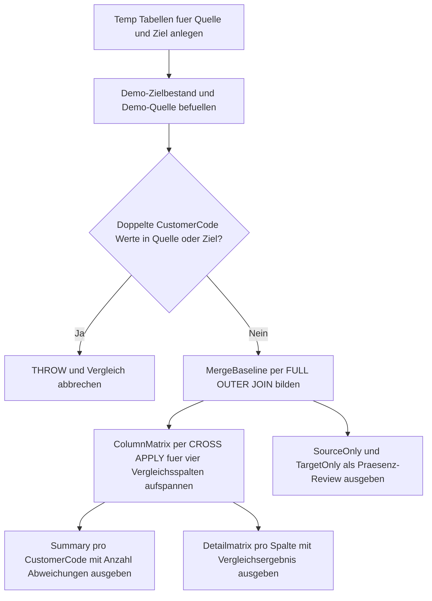

# MergeColumnComparisonMatrix.sql

Dieses Skript erstellt eine didaktische Vergleichsmatrix zwischen Quelle und Ziel, bevor ein `MERGE` ausgefuehrt wird. Statt direkt zu schreiben, macht es pro Business Key und Vergleichsspalte sichtbar, welche Werte identisch sind, welche Spalten abweichen und welche Zeilen nur auf einer Seite vorkommen.

## Uebersicht

<!-- SQLDOC:SUMMARY_TABLE:BEGIN -->
| Feld | Wert |
|---|---|
| Script | [MergeColumnComparisonMatrix.sql](MergeColumnComparisonMatrix.sql) |
| Version | `1.0` |
| Typ | `didactic-lab` |
| Kapitel | `13_Merge` |
| Sicherheit | `read-only-tempdb` |
| Zweck | Baut vor einem MERGE eine Vergleichsmatrix fuer Quelle, Ziel und abweichende Spalten auf. |
<!-- SQLDOC:SUMMARY_TABLE:END -->

## Annahmen

- Die Erstversion arbeitet ausschliesslich mit temporaeren Demo-Tabellen statt mit produktiven Zielobjekten.
- Verglichen werden vier exemplarische Fachspalten: `CustomerName`, `CreditLimit`, `SegmentLabel` und `CityCode`.
- Die Matrix dient als Vorpruefung fuer `MERGE`-Entscheidungen und fuehrt selbst kein `MERGE` aus.

## Anwendungsfall

Das Skript eignet sich fuer folgende Leitfragen:

- Welche Spalten unterscheiden sich zwischen Quelle und Ziel pro Business Key?
- Welche Zeilen waeren vor einem `MERGE` eher `INSERT`-, `UPDATE`- oder `NOT MATCHED BY SOURCE`-Kandidaten?
- Wie laesst sich ein nachvollziehbarer Review-Schritt vor einem produktiven `MERGE` aufbauen?

## Parameter

<!-- SQLDOC:PARAMETERS_TABLE:BEGIN -->
| Parameter | SQL-Typ | Pflicht | Beschreibung |
|---|---|---|---|
| `-` | `-` | `-` | Dieses Demoskript verwendet keine Laufzeitparameter. |
<!-- SQLDOC:PARAMETERS_TABLE:END -->

## Abhaengigkeiten

<!-- SQLDOC:DEPENDENCIES_LIST:BEGIN -->
- `FULL OUTER JOIN`
- `CROSS APPLY`
- temporaere Tabellen in `tempdb`
- `THROW`
<!-- SQLDOC:DEPENDENCIES_LIST:END -->

## Hinweise

- `MergeColumnComparisonSummary` verdichtet pro `CustomerCode` den Match-Status und die Zahl abweichender Spalten.
- `MergeColumnComparisonMatrix` zeigt jede Vergleichsspalte einzeln und liefert eine direkte Interpretationshilfe fuer Review-Gespraeche.
- `MergeColumnComparisonPresence` isoliert Business Keys, die nur in Quelle oder Ziel vorkommen.

## Versionshistorie

<!-- SQLDOC:VERSION_HISTORY_TABLE:BEGIN -->
| Version | Datum | User | Beschreibung |
|---|---|---|---|
| `1.0` | `2026-04-18` | `ER` | Erstversion einer didaktischen Vergleichsmatrix fuer MERGE-Vorpruefungen |
<!-- SQLDOC:VERSION_HISTORY_TABLE:END -->

## Ablauf

<!-- SQLDOC:MERMAID:BEGIN -->

<!-- SQLDOC:MERMAID:END -->

## SQL-Code

<!-- SQLDOC:SQL_CODE:BEGIN -->
```sql
/*
BEGIN:SQL-HEADER v1
---
sql_header: v1
script_name: "MergeColumnComparisonMatrix.sql"
script_version: "1.0"
script_type: "didactic-lab"
chapter: "13_Merge"

purpose: >
  Erstellt eine didaktische Vergleichsmatrix zwischen Quell- und Zielzeilen
  vor einem MERGE. Das Skript zeigt pro Business Key und Vergleichsspalte,
  ob Werte identisch, geaendert oder nur auf einer Seite vorhanden sind.

parameters: []

result_sets:
  - name: "MergeColumnComparisonSummary"
    description: "Verdichtet pro Business Key den Match-Status sowie die Anzahl gepruefter und abweichender Spalten"
  - name: "MergeColumnComparisonMatrix"
    description: "Zeigt pro Business Key und Spalte die Werte aus Quelle und Ziel samt Vergleichsergebnis"
  - name: "MergeColumnComparisonPresence"
    description: "Listet Business Keys, die nur in der Quelle oder nur im Ziel vorkommen"

dependencies:
  - "FULL OUTER JOIN"
  - "CROSS APPLY"
  - "temporary tables"
  - "THROW"

safety:
  level: "read-only-tempdb"
  writes_data: false

documentation:
  markdown_file: "T-SQL/13_Merge/SQLScripts/MergeColumnComparisonMatrix.md"
  sync_blocks:
    - "SUMMARY_TABLE"
    - "PARAMETERS_TABLE"
    - "DEPENDENCIES_LIST"
    - "VERSION_HISTORY_TABLE"
    - "SQL_CODE"
  mermaid:
    mode: "ai-agent-from-sql"
    source: "script-body"

main_responsible:
  name: "Erhard Rainer"
  initials: "ER"

version_history:
  - version: "1.0"
    date: "2026-04-18"
    user: "ER"
    description: "Erstversion einer didaktischen Vergleichsmatrix fuer MERGE-Vorpruefungen"

notes:
  - "Die Erstversion nutzt ausschliesslich temporaere Demo-Tabellen."
  - "Verglichen werden vier exemplarische Fachspalten vor einem moeglichen MERGE."
  - "Doppelte Business Keys in Quelle oder Ziel werden per Guardrail blockiert."
---
END:SQL-HEADER v1
*/

SET NOCOUNT ON;

DROP TABLE IF EXISTS #MergeTarget;
DROP TABLE IF EXISTS #MergeSource;
DROP TABLE IF EXISTS #MergeBaseline;
DROP TABLE IF EXISTS #ColumnMatrix;

CREATE TABLE #MergeTarget
(
    CustomerCode   VARCHAR(10)   NOT NULL PRIMARY KEY,
    CustomerName   VARCHAR(100)  NOT NULL,
    CreditLimit    DECIMAL(10,2) NOT NULL,
    SegmentLabel   VARCHAR(20)   NOT NULL,
    CityCode       VARCHAR(10)   NOT NULL
);

CREATE TABLE #MergeSource
(
    CustomerCode   VARCHAR(10)   NOT NULL,
    CustomerName   VARCHAR(100)  NOT NULL,
    CreditLimit    DECIMAL(10,2) NOT NULL,
    SegmentLabel   VARCHAR(20)   NOT NULL,
    CityCode       VARCHAR(10)   NOT NULL
);

INSERT INTO #MergeTarget
(
    CustomerCode,
    CustomerName,
    CreditLimit,
    SegmentLabel,
    CityCode
)
VALUES
    ('C001', 'Alpine Retail',   1200.00, 'standard', 'MUC'),
    ('C002', 'Baltic Foods',     900.00, 'standard', 'HAM'),
    ('C003', 'City Logistics',  1500.00, 'priority', 'BER'),
    ('C004', 'Delta Services',   650.00, 'legacy',   'CGN');

INSERT INTO #MergeSource
(
    CustomerCode,
    CustomerName,
    CreditLimit,
    SegmentLabel,
    CityCode
)
VALUES
    ('C001', 'Alpine Retail',     1200.00, 'standard', 'MUC'),
    ('C002', 'Baltic Foods GmbH', 1350.00, 'priority', 'HAM'),
    ('C003', 'City Logistics',    1500.00, 'priority', 'BER'),
    ('C005', 'Elm Tech',           800.00, 'new',      'FRA');

IF EXISTS
(
    SELECT
        s.CustomerCode
    FROM #MergeSource AS s
    GROUP BY
        s.CustomerCode
    HAVING COUNT(*) > 1
)
BEGIN
    THROW 50011, 'MergeColumnComparisonMatrix detected duplicate CustomerCode values in #MergeSource.', 1;
END;

IF EXISTS
(
    SELECT
        t.CustomerCode
    FROM #MergeTarget AS t
    GROUP BY
        t.CustomerCode
    HAVING COUNT(*) > 1
)
BEGIN
    THROW 50012, 'MergeColumnComparisonMatrix detected duplicate CustomerCode values in #MergeTarget.', 1;
END;

SELECT
    COALESCE(src.CustomerCode, tgt.CustomerCode) AS CustomerCode,
    CASE
        WHEN src.CustomerCode IS NULL THEN 'TargetOnly'
        WHEN tgt.CustomerCode IS NULL THEN 'SourceOnly'
        ELSE 'Matched'
    END AS MatchStatus,
    src.CustomerName AS SourceCustomerName,
    tgt.CustomerName AS TargetCustomerName,
    src.CreditLimit AS SourceCreditLimit,
    tgt.CreditLimit AS TargetCreditLimit,
    src.SegmentLabel AS SourceSegmentLabel,
    tgt.SegmentLabel AS TargetSegmentLabel,
    src.CityCode AS SourceCityCode,
    tgt.CityCode AS TargetCityCode
INTO #MergeBaseline
FROM #MergeSource AS src
FULL OUTER JOIN #MergeTarget AS tgt
    ON tgt.CustomerCode = src.CustomerCode;

SELECT
    b.CustomerCode,
    b.MatchStatus,
    v.ColumnName,
    v.SourceValue,
    v.TargetValue,
    CASE
        WHEN b.MatchStatus = 'SourceOnly' THEN 'SourceOnly'
        WHEN b.MatchStatus = 'TargetOnly' THEN 'TargetOnly'
        WHEN v.SourceValue = v.TargetValue THEN 'Equal'
        ELSE 'Different'
    END AS ComparisonResult
INTO #ColumnMatrix
FROM #MergeBaseline AS b
CROSS APPLY
(
    VALUES
        ('CustomerName', CONVERT(VARCHAR(200), b.SourceCustomerName), CONVERT(VARCHAR(200), b.TargetCustomerName)),
        ('CreditLimit', CONVERT(VARCHAR(200), b.SourceCreditLimit), CONVERT(VARCHAR(200), b.TargetCreditLimit)),
        ('SegmentLabel', CONVERT(VARCHAR(200), b.SourceSegmentLabel), CONVERT(VARCHAR(200), b.TargetSegmentLabel)),
        ('CityCode', CONVERT(VARCHAR(200), b.SourceCityCode), CONVERT(VARCHAR(200), b.TargetCityCode))
) AS v(ColumnName, SourceValue, TargetValue);

SELECT
    m.CustomerCode,
    m.MatchStatus,
    COUNT(*) AS ComparedColumns,
    SUM(CASE WHEN m.ComparisonResult = 'Equal' THEN 0 ELSE 1 END) AS DifferenceCount,
    STRING_AGG
    (
        CASE
            WHEN m.ComparisonResult = 'Equal' THEN NULL
            ELSE m.ColumnName
        END,
        ', '
    ) WITHIN GROUP (ORDER BY m.ColumnName) AS DifferentColumns
FROM #ColumnMatrix AS m
GROUP BY
    m.CustomerCode,
    m.MatchStatus
ORDER BY
    CASE m.MatchStatus
        WHEN 'Matched' THEN 1
        WHEN 'SourceOnly' THEN 2
        WHEN 'TargetOnly' THEN 3
        ELSE 4
    END,
    m.CustomerCode;

SELECT
    m.CustomerCode,
    m.MatchStatus,
    m.ColumnName,
    m.TargetValue,
    m.SourceValue,
    m.ComparisonResult,
    CASE
        WHEN m.ComparisonResult = 'Equal' THEN 'Keine Aenderung notwendig.'
        WHEN m.ComparisonResult = 'Different' THEN 'Spalte weicht ab und wuerde bei einem UPDATE beruecksichtigt.'
        WHEN m.ComparisonResult = 'SourceOnly' THEN 'Business Key existiert nur in der Quelle und waere ein INSERT-Kandidat.'
        WHEN m.ComparisonResult = 'TargetOnly' THEN 'Business Key existiert nur im Ziel und waere fuer NOT MATCHED BY SOURCE relevant.'
        ELSE 'Nicht klassifiziert.'
    END AS ComparisonInterpretation
FROM #ColumnMatrix AS m
ORDER BY
    m.CustomerCode,
    CASE m.ColumnName
        WHEN 'CustomerName' THEN 1
        WHEN 'CreditLimit' THEN 2
        WHEN 'SegmentLabel' THEN 3
        WHEN 'CityCode' THEN 4
        ELSE 5
    END;

SELECT
    b.CustomerCode,
    b.MatchStatus,
    CASE
        WHEN b.MatchStatus = 'SourceOnly' THEN 'INSERT-Kandidat vor dem MERGE'
        WHEN b.MatchStatus = 'TargetOnly' THEN 'Review fuer DELETE oder Soft-Delete vor dem MERGE'
        ELSE 'Zeile ist auf beiden Seiten vorhanden'
    END AS MergeRelevance
FROM #MergeBaseline AS b
WHERE b.MatchStatus <> 'Matched'
ORDER BY
    b.CustomerCode;
```
<!-- SQLDOC:SQL_CODE:END -->
