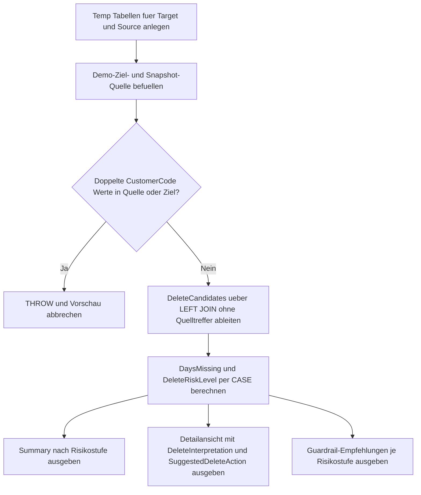

# MergeDeleteImpactPreview.sql

Dieses Skript erstellt eine didaktische Voransicht fuer `WHEN NOT MATCHED BY SOURCE`-Delete-Zweige in einem `MERGE`. Statt das `MERGE` direkt mit `DELETE` auszufuehren, zeigt es zunaechst, welche Zielzeilen im aktuellen Snapshot fehlen und welche Guardrails vor einer Aktivierung des Delete-Zweigs sinnvoll sind.

## Uebersicht

<!-- SQLDOC:SUMMARY_TABLE:BEGIN -->
| Feld | Wert |
|---|---|
| Script | [MergeDeleteImpactPreview.sql](MergeDeleteImpactPreview.sql) |
| Version | `1.0` |
| Typ | `didactic-lab` |
| Kapitel | `13_Merge` |
| Sicherheit | `read-only-tempdb` |
| Zweck | Identifiziert Delete-Kandidaten vor einem MERGE und bewertet deren Risiko ohne den Delete-Zweig auszufuehren. |
<!-- SQLDOC:SUMMARY_TABLE:END -->

## Annahmen

- Die Erstversion nutzt ausschliesslich temporaere Demo-Tabellen fuer Quelle und Ziel.
- Der Fokus liegt auf der Vorpruefung fuer `WHEN NOT MATCHED BY SOURCE THEN DELETE`, nicht auf dem eigentlichen `MERGE`.
- `IsArchived`, `IsVipCustomer` und `OpenOrderCount` dienen als didaktische Guardrails fuer die Delete-Freigabe.

## Anwendungsfall

Das Skript eignet sich fuer Review-Fragen wie:

- Welche Zielzeilen wuerden in einem Snapshot-basierten `MERGE` als Delete-Kandidaten auftauchen?
- Welche Kandidaten sollten wegen VIP-Status, offener Auftraege oder aktiver Konten vor einem Delete ausgenommen werden?
- Welche Guardrails lassen sich vor der Aktivierung eines `DELETE`-Zweigs im `MERGE` dokumentieren?

## Parameter

<!-- SQLDOC:PARAMETERS_TABLE:BEGIN -->
| Parameter | SQL-Typ | Pflicht | Beschreibung |
|---|---|---|---|
| `-` | `-` | `-` | Dieses Demoskript verwendet keine Laufzeitparameter. |
<!-- SQLDOC:PARAMETERS_TABLE:END -->

## Abhaengigkeiten

<!-- SQLDOC:DEPENDENCIES_LIST:BEGIN -->
- temporaere Tabellen in `tempdb`
- `LEFT JOIN`
- `CTE`
- `CASE`
<!-- SQLDOC:DEPENDENCIES_LIST:END -->

## Hinweise

- `MergeDeleteImpactSummary` fasst Delete-Kandidaten nach Risikostufe zusammen.
- `MergeDeleteImpactDetail` zeigt pro fehlender Zielzeile die Guardrail-relevanten Merkmale und eine Delete-Empfehlung.
- `MergeDeleteImpactGuards` verdichtet geeignete Review-Regeln, bevor `NOT MATCHED BY SOURCE` fuer Deletes freigegeben wird.

## Versionshistorie

<!-- SQLDOC:VERSION_HISTORY_TABLE:BEGIN -->
| Version | Datum | User | Beschreibung |
|---|---|---|---|
| `1.0` | `2026-04-18` | `ER` | Erstversion einer didaktischen Delete-Impact-Vorschau fuer MERGE-Szenarien |
<!-- SQLDOC:VERSION_HISTORY_TABLE:END -->

## Ablauf

<!-- SQLDOC:MERMAID:BEGIN -->

<!-- SQLDOC:MERMAID:END -->

## SQL-Code

<!-- SQLDOC:SQL_CODE:BEGIN -->
```sql
/*
BEGIN:SQL-HEADER v1
---
sql_header: v1
script_name: "MergeDeleteImpactPreview.sql"
script_version: "1.0"
script_type: "didactic-lab"
chapter: "13_Merge"

purpose: >
  Erstellt eine didaktische Voransicht fuer Delete-Zweige in einem
  MERGE-Szenario. Das Skript identifiziert Zielzeilen ohne passende
  Quellzeile, bewertet deren Loeschrisiko und zeigt Guardrail-Hinweise,
  bevor ein WHEN NOT MATCHED BY SOURCE THEN DELETE freigegeben wird.

parameters: []

result_sets:
  - name: "MergeDeleteImpactSummary"
    description: "Verdichtet Delete-Kandidaten nach Risikostufe und zeigt den potenziellen Loeschumfang"
  - name: "MergeDeleteImpactDetail"
    description: "Listet jede Zielzeile ohne Quelltreffer mit Segment, Status und didaktischer Delete-Empfehlung"
  - name: "MergeDeleteImpactGuards"
    description: "Leitet Review- und Guardrail-Hinweise pro Delete-Muster ab"

dependencies:
  - "temporary tables"
  - "LEFT JOIN"
  - "CTE"
  - "CASE"

safety:
  level: "read-only-tempdb"
  writes_data: false

documentation:
  markdown_file: "T-SQL/13_Merge/SQLScripts/MergeDeleteImpactPreview.md"
  sync_blocks:
    - "SUMMARY_TABLE"
    - "PARAMETERS_TABLE"
    - "DEPENDENCIES_LIST"
    - "VERSION_HISTORY_TABLE"
    - "SQL_CODE"
  mermaid:
    mode: "ai-agent-from-sql"
    source: "script-body"

main_responsible:
  name: "Erhard Rainer"
  initials: "ER"

version_history:
  - version: "1.0"
    date: "2026-04-18"
    user: "ER"
    description: "Erstversion einer didaktischen Delete-Impact-Vorschau fuer MERGE-Szenarien"

notes:
  - "Die Erstversion simuliert Quelle und Ziel ausschliesslich ueber temporaere Demo-Tabellen."
  - "Es wird kein MERGE und kein DELETE ausgefuehrt; gezeigt wird nur die Vorpruefung fuer NOT MATCHED BY SOURCE."
  - "Archiv-, VIP- und Sperrindikatoren dienen als didaktische Guardrails fuer die Delete-Bewertung."
---
END:SQL-HEADER v1
*/

SET NOCOUNT ON;

DROP TABLE IF EXISTS #MergeTarget;
DROP TABLE IF EXISTS #MergeSource;

CREATE TABLE #MergeTarget
(
    CustomerCode         VARCHAR(10)   NOT NULL PRIMARY KEY,
    CustomerName         VARCHAR(100)  NOT NULL,
    SegmentLabel         VARCHAR(20)   NOT NULL,
    AccountStatus        VARCHAR(20)   NOT NULL,
    LastSourceSeenDate   DATE          NOT NULL,
    OpenOrderCount       INT           NOT NULL,
    IsVipCustomer        BIT           NOT NULL,
    IsArchived           BIT           NOT NULL
);

CREATE TABLE #MergeSource
(
    CustomerCode         VARCHAR(10)   NOT NULL,
    SnapshotBatchLabel   VARCHAR(30)   NOT NULL,
    SourceSeenDate       DATE          NOT NULL,
    ExpectedAction       VARCHAR(12)   NOT NULL
);

INSERT INTO #MergeTarget
(
    CustomerCode,
    CustomerName,
    SegmentLabel,
    AccountStatus,
    LastSourceSeenDate,
    OpenOrderCount,
    IsVipCustomer,
    IsArchived
)
VALUES
    ('C001', 'Alpine Retail',     'standard', 'Active',   '2026-04-17', 0, 0, 0),
    ('C002', 'Baltic Foods GmbH', 'priority', 'Active',   '2026-04-18', 2, 0, 0),
    ('C003', 'City Logistics',    'priority', 'OnHold',   '2026-04-02', 0, 1, 0),
    ('C004', 'Delta Services',    'legacy',   'Inactive', '2026-03-11', 0, 0, 1),
    ('C005', 'Elm Tech',          'new',      'Active',   '2026-04-15', 0, 0, 0),
    ('C006', 'Foxtrot Health',    'vip',      'Active',   '2026-03-01', 4, 1, 0);

INSERT INTO #MergeSource
(
    CustomerCode,
    SnapshotBatchLabel,
    SourceSeenDate,
    ExpectedAction
)
VALUES
    ('C001', 'Batch-2026-04-18-A', '2026-04-18', 'MATCHED'),
    ('C002', 'Batch-2026-04-18-A', '2026-04-18', 'MATCHED'),
    ('C005', 'Batch-2026-04-18-A', '2026-04-18', 'MATCHED'),
    ('C007', 'Batch-2026-04-18-A', '2026-04-18', 'INSERT');

IF EXISTS
(
    SELECT
        s.CustomerCode
    FROM #MergeSource AS s
    GROUP BY
        s.CustomerCode
    HAVING COUNT(*) > 1
)
BEGIN
    THROW 50031, 'MergeDeleteImpactPreview detected duplicate CustomerCode values in #MergeSource.', 1;
END;

IF EXISTS
(
    SELECT
        t.CustomerCode
    FROM #MergeTarget AS t
    GROUP BY
        t.CustomerCode
    HAVING COUNT(*) > 1
)
BEGIN
    THROW 50032, 'MergeDeleteImpactPreview detected duplicate CustomerCode values in #MergeTarget.', 1;
END;

;WITH DeleteCandidates AS
(
    SELECT
        tgt.CustomerCode,
        tgt.CustomerName,
        tgt.SegmentLabel,
        tgt.AccountStatus,
        tgt.LastSourceSeenDate,
        tgt.OpenOrderCount,
        tgt.IsVipCustomer,
        tgt.IsArchived,
        DATEDIFF(DAY, tgt.LastSourceSeenDate, CAST('2026-04-18' AS DATE)) AS DaysMissingFromSource,
        CASE
            WHEN tgt.IsArchived = 1 THEN 'Low'
            WHEN tgt.OpenOrderCount > 0 OR tgt.IsVipCustomer = 1 THEN 'High'
            WHEN tgt.AccountStatus = 'Active' THEN 'Medium'
            ELSE 'Low'
        END AS DeleteRiskLevel,
        CASE
            WHEN tgt.IsArchived = 1 THEN 'Delete appears plausible because the target row is already archived.'
            WHEN tgt.OpenOrderCount > 0 THEN 'Delete should be blocked until dependent open orders are resolved.'
            WHEN tgt.IsVipCustomer = 1 THEN 'Delete should be escalated because the business key belongs to a VIP customer.'
            WHEN tgt.AccountStatus = 'Active' THEN 'Delete should be reviewed because an active customer disappeared from the source snapshot.'
            ELSE 'Delete candidate can be reviewed as a standard stale target row.'
        END AS DeleteInterpretation
    FROM #MergeTarget AS tgt
    LEFT JOIN #MergeSource AS src
        ON src.CustomerCode = tgt.CustomerCode
    WHERE src.CustomerCode IS NULL
),
DeleteSummary AS
(
    SELECT
        dc.DeleteRiskLevel,
        COUNT(*) AS CandidateCount,
        SUM(dc.OpenOrderCount) AS TotalOpenOrders,
        MAX(dc.DaysMissingFromSource) AS MaxDaysMissing,
        STRING_AGG(dc.CustomerCode, ', ') WITHIN GROUP (ORDER BY dc.CustomerCode) AS CustomerCodes
    FROM DeleteCandidates AS dc
    GROUP BY
        dc.DeleteRiskLevel
)
SELECT
    ds.DeleteRiskLevel,
    ds.CandidateCount,
    ds.TotalOpenOrders,
    ds.MaxDaysMissing,
    ds.CustomerCodes
FROM DeleteSummary AS ds
ORDER BY
    CASE ds.DeleteRiskLevel
        WHEN 'High' THEN 1
        WHEN 'Medium' THEN 2
        ELSE 3
    END;

SELECT
    dc.CustomerCode,
    dc.CustomerName,
    dc.SegmentLabel,
    dc.AccountStatus,
    dc.LastSourceSeenDate,
    dc.DaysMissingFromSource,
    dc.OpenOrderCount,
    dc.IsVipCustomer,
    dc.IsArchived,
    dc.DeleteRiskLevel,
    dc.DeleteInterpretation,
    CASE
        WHEN dc.DeleteRiskLevel = 'High' THEN 'Delete branch should stay disabled until a manual review confirms the absence.'
        WHEN dc.DeleteRiskLevel = 'Medium' THEN 'Delete branch needs source reconciliation or a grace period before activation.'
        ELSE 'Delete branch can be considered after the normal stale-row review.'
    END AS SuggestedDeleteAction
FROM DeleteCandidates AS dc
ORDER BY
    CASE dc.DeleteRiskLevel
        WHEN 'High' THEN 1
        WHEN 'Medium' THEN 2
        ELSE 3
    END,
    dc.CustomerCode;

SELECT
    dc.DeleteRiskLevel,
    CASE
        WHEN dc.DeleteRiskLevel = 'High' THEN 'Guardrail: Exclude VIP rows or rows with open orders from NOT MATCHED BY SOURCE deletes.'
        WHEN dc.DeleteRiskLevel = 'Medium' THEN 'Guardrail: Require a second missing snapshot or a cutoff date before deleting active rows.'
        ELSE 'Guardrail: Archived or inactive rows can move into a controlled delete or soft-delete branch.'
    END AS GuardRecommendation,
    COUNT(*) AS AffectedCandidates
FROM DeleteCandidates AS dc
GROUP BY
    dc.DeleteRiskLevel
ORDER BY
    CASE dc.DeleteRiskLevel
        WHEN 'High' THEN 1
        WHEN 'Medium' THEN 2
        ELSE 3
    END;
```
<!-- SQLDOC:SQL_CODE:END -->
