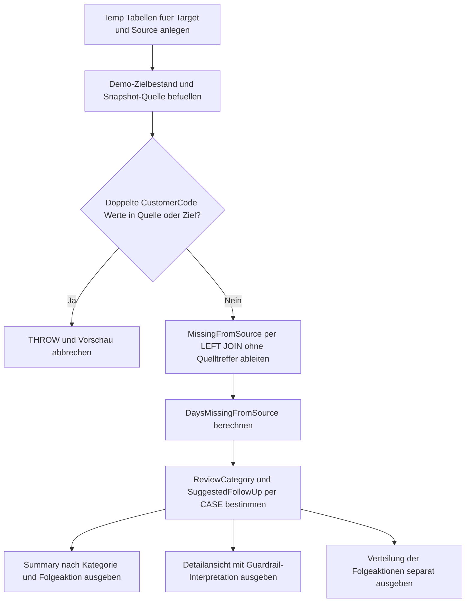

# MergeNotMatchedBySourcePreview.sql

Dieses Skript erstellt eine didaktische Vorschau auf Zielzeilen, die in einem `MERGE` unter `WHEN NOT MATCHED BY SOURCE` betroffen waeren. Statt direkt zu loeschen, ordnet die Vorschau fehlende Quelltreffer in Review-Kategorien ein und leitet vorsichtige Folgeaktionen fuer `keep`, `soft delete` oder `delete review` ab.

## Uebersicht

<!-- SQLDOC:SUMMARY_TABLE:BEGIN -->
| Feld | Wert |
|---|---|
| Script | [MergeNotMatchedBySourcePreview.sql](MergeNotMatchedBySourcePreview.sql) |
| Version | `1.0` |
| Typ | `didactic-lab` |
| Kapitel | `13_Merge` |
| Sicherheit | `read-only-tempdb` |
| Zweck | Zeigt fehlende Quelltreffer vor einem MERGE-Delete-Zweig und ordnet sie in vorsichtige Folgeaktionen ein. |
<!-- SQLDOC:SUMMARY_TABLE:END -->

## Annahmen

- Die Erstversion arbeitet ausschliesslich mit temporaeren Demo-Tabellen fuer Quelle und Ziel.
- Es wird kein `MERGE` und kein `DELETE` ausgefuehrt; die Ausgabe dient nur als Vorpruefung fuer `WHEN NOT MATCHED BY SOURCE`.
- `OpenContractCount`, `RetentionFlag`, `IsVipCustomer` und `SoftDeletePreferred` modellieren didaktische Guardrails fuer spaetere Aktionen.

## Anwendungsfall

Das Skript eignet sich fuer folgende Leitfragen:

- Welche Zielzeilen fehlen im aktuellen Snapshot der Quelle und wuerden dadurch unter `NOT MATCHED BY SOURCE` auffallen?
- Welche Zeilen sollten vorerst behalten, nur soft geloescht oder erst nach weiterer Pruefung physisch geloescht werden?
- Wie lassen sich Guardrails vor einem produktiven `MERGE`-Delete-Zweig transparent dokumentieren?

## Parameter

<!-- SQLDOC:PARAMETERS_TABLE:BEGIN -->
| Parameter | SQL-Typ | Pflicht | Beschreibung |
|---|---|---|---|
| `-` | `-` | `-` | Dieses Demoskript verwendet keine Laufzeitparameter. |
<!-- SQLDOC:PARAMETERS_TABLE:END -->

## Abhaengigkeiten

<!-- SQLDOC:DEPENDENCIES_LIST:BEGIN -->
- temporaere Tabellen in `tempdb`
- `LEFT JOIN`
- `CTE`
- `CASE`
<!-- SQLDOC:DEPENDENCIES_LIST:END -->

## Hinweise

- `MergeNotMatchedBySourceSummary` fasst die fehlenden Quelltreffer nach Review-Kategorie und Folgeaktion zusammen.
- `MergeNotMatchedBySourceDetail` zeigt pro Zielzeile die Staleness, Guardrail-Flags und die fachliche Interpretation.
- `MergeNotMatchedBySourceActions` verdichtet, wie viele Zeilen eher behalten, soft geloescht oder in einen Delete-Review ueberfuehrt werden sollten.

## Versionshistorie

<!-- SQLDOC:VERSION_HISTORY_TABLE:BEGIN -->
| Version | Datum | User | Beschreibung |
|---|---|---|---|
| `1.0` | `2026-04-18` | `ER` | Erstversion einer didaktischen Vorschau fuer NOT MATCHED BY SOURCE in MERGE-Szenarien |
<!-- SQLDOC:VERSION_HISTORY_TABLE:END -->

## Ablauf

<!-- SQLDOC:MERMAID:BEGIN -->

<!-- SQLDOC:MERMAID:END -->

## SQL-Code

<!-- SQLDOC:SQL_CODE:BEGIN -->
```sql
/*
BEGIN:SQL-HEADER v1
---
sql_header: v1
script_name: "MergeNotMatchedBySourcePreview.sql"
script_version: "1.0"
script_type: "didactic-lab"
chapter: "13_Merge"

purpose: >
  Erstellt eine didaktische Vorschau auf Zielzeilen, die in einem MERGE
  unter WHEN NOT MATCHED BY SOURCE auffallen wuerden. Das Skript zeigt
  fehlende Quelltreffer, ordnet sie in Review-Kategorien ein und leitet
  eine vorsichtige Folgeaktion ab, ohne DELETE oder Soft Delete
  auszufuehren.

parameters: []

result_sets:
  - name: "MergeNotMatchedBySourceSummary"
    description: "Verdichtet Kandidaten nach Review-Kategorie und empfohlener Folgeaktion"
  - name: "MergeNotMatchedBySourceDetail"
    description: "Zeigt pro fehlender Zielzeile die fehlende Quelle, Staleness und Guardrail-Hinweise"
  - name: "MergeNotMatchedBySourceActions"
    description: "Zeigt die didaktische Verteilung zwischen behalten, soft delete pruefen und delete pruefen"

dependencies:
  - "temporary tables"
  - "LEFT JOIN"
  - "CTE"
  - "CASE"

safety:
  level: "read-only-tempdb"
  writes_data: false

documentation:
  markdown_file: "T-SQL/13_Merge/SQLScripts/MergeNotMatchedBySourcePreview.md"
  sync_blocks:
    - "SUMMARY_TABLE"
    - "PARAMETERS_TABLE"
    - "DEPENDENCIES_LIST"
    - "VERSION_HISTORY_TABLE"
    - "SQL_CODE"
  mermaid:
    mode: "ai-agent-from-sql"
    source: "script-body"

main_responsible:
  name: "Erhard Rainer"
  initials: "ER"

version_history:
  - version: "1.0"
    date: "2026-04-18"
    user: "ER"
    description: "Erstversion einer didaktischen Vorschau fuer NOT MATCHED BY SOURCE in MERGE-Szenarien"

notes:
  - "Die Erstversion simuliert Quelle und Ziel nur ueber temporaere Demo-Tabellen."
  - "Es wird kein MERGE ausgefuehrt; gezeigt wird nur die Vorschau auf fehlende Quelltreffer."
  - "Retention-, VIP- und Vertragsindikatoren dienen als didaktische Guardrails fuer Folgeaktionen."
---
END:SQL-HEADER v1
*/

SET NOCOUNT ON;

DROP TABLE IF EXISTS #MergeTarget;
DROP TABLE IF EXISTS #MergeSource;

CREATE TABLE #MergeTarget
(
    CustomerCode           VARCHAR(10)   NOT NULL PRIMARY KEY,
    CustomerName           VARCHAR(100)  NOT NULL,
    SegmentLabel           VARCHAR(20)   NOT NULL,
    LastSeenInSourceDate   DATE          NOT NULL,
    OpenContractCount      INT           NOT NULL,
    RetentionFlag          BIT           NOT NULL,
    IsVipCustomer          BIT           NOT NULL,
    SoftDeletePreferred    BIT           NOT NULL
);

CREATE TABLE #MergeSource
(
    CustomerCode           VARCHAR(10)   NOT NULL,
    SnapshotLabel          VARCHAR(30)   NOT NULL,
    SnapshotDate           DATE          NOT NULL,
    ChangeHint             VARCHAR(20)   NOT NULL
);

INSERT INTO #MergeTarget
(
    CustomerCode,
    CustomerName,
    SegmentLabel,
    LastSeenInSourceDate,
    OpenContractCount,
    RetentionFlag,
    IsVipCustomer,
    SoftDeletePreferred
)
VALUES
    ('C001', 'Alpine Retail',     'standard', '2026-04-17', 0, 0, 0, 0),
    ('C002', 'Baltic Foods GmbH', 'priority', '2026-04-18', 1, 0, 0, 0),
    ('C003', 'City Logistics',    'vip',      '2026-04-10', 0, 1, 1, 1),
    ('C004', 'Delta Services',    'legacy',   '2026-03-22', 0, 0, 0, 1),
    ('C005', 'Elm Tech',          'new',      '2026-04-16', 0, 0, 0, 0),
    ('C006', 'Foxtrot Health',    'vip',      '2026-03-01', 3, 1, 1, 1);

INSERT INTO #MergeSource
(
    CustomerCode,
    SnapshotLabel,
    SnapshotDate,
    ChangeHint
)
VALUES
    ('C001', 'Batch-2026-04-18-A', '2026-04-18', 'MATCHED'),
    ('C002', 'Batch-2026-04-18-A', '2026-04-18', 'MATCHED'),
    ('C005', 'Batch-2026-04-18-A', '2026-04-18', 'MATCHED'),
    ('C007', 'Batch-2026-04-18-A', '2026-04-18', 'INSERT');

IF EXISTS
(
    SELECT
        s.CustomerCode
    FROM #MergeSource AS s
    GROUP BY
        s.CustomerCode
    HAVING COUNT(*) > 1
)
BEGIN
    THROW 50041, 'MergeNotMatchedBySourcePreview detected duplicate CustomerCode values in #MergeSource.', 1;
END;

IF EXISTS
(
    SELECT
        t.CustomerCode
    FROM #MergeTarget AS t
    GROUP BY
        t.CustomerCode
    HAVING COUNT(*) > 1
)
BEGIN
    THROW 50042, 'MergeNotMatchedBySourcePreview detected duplicate CustomerCode values in #MergeTarget.', 1;
END;

;WITH MissingFromSource AS
(
    SELECT
        tgt.CustomerCode,
        tgt.CustomerName,
        tgt.SegmentLabel,
        tgt.LastSeenInSourceDate,
        tgt.OpenContractCount,
        tgt.RetentionFlag,
        tgt.IsVipCustomer,
        tgt.SoftDeletePreferred,
        DATEDIFF(DAY, tgt.LastSeenInSourceDate, CAST('2026-04-18' AS DATE)) AS DaysMissingFromSource
    FROM #MergeTarget AS tgt
    LEFT JOIN #MergeSource AS src
        ON src.CustomerCode = tgt.CustomerCode
    WHERE src.CustomerCode IS NULL
),
Preview AS
(
    SELECT
        mfs.CustomerCode,
        mfs.CustomerName,
        mfs.SegmentLabel,
        mfs.LastSeenInSourceDate,
        mfs.OpenContractCount,
        mfs.RetentionFlag,
        mfs.IsVipCustomer,
        mfs.SoftDeletePreferred,
        mfs.DaysMissingFromSource,
        CASE
            WHEN mfs.OpenContractCount > 0 OR mfs.IsVipCustomer = 1 THEN 'high-risk-review'
            WHEN mfs.RetentionFlag = 1 OR mfs.SoftDeletePreferred = 1 THEN 'soft-delete-review'
            WHEN mfs.DaysMissingFromSource >= 21 THEN 'aged-missing-row'
            ELSE 'recent-missing-row'
        END AS ReviewCategory,
        CASE
            WHEN mfs.OpenContractCount > 0 OR mfs.IsVipCustomer = 1 THEN 'keep-and-investigate'
            WHEN mfs.RetentionFlag = 1 OR mfs.SoftDeletePreferred = 1 THEN 'soft-delete-candidate'
            WHEN mfs.DaysMissingFromSource >= 21 THEN 'delete-candidate'
            ELSE 'wait-for-next-snapshot'
        END AS SuggestedFollowUp,
        CASE
            WHEN mfs.OpenContractCount > 0 THEN 'Open contracts block a delete branch until downstream dependencies are closed.'
            WHEN mfs.IsVipCustomer = 1 THEN 'VIP rows should not move directly into NOT MATCHED BY SOURCE deletes.'
            WHEN mfs.RetentionFlag = 1 THEN 'Retention rules suggest a reversible soft-delete path.'
            WHEN mfs.SoftDeletePreferred = 1 THEN 'Model flag prefers deactivation over physical deletion.'
            WHEN mfs.DaysMissingFromSource >= 21 THEN 'Row is stale across multiple days and can enter a controlled delete review.'
            ELSE 'Row is newly missing and should first be rechecked against the next source snapshot.'
        END AS PreviewInterpretation
    FROM MissingFromSource AS mfs
)
SELECT
    p.ReviewCategory,
    p.SuggestedFollowUp,
    COUNT(*) AS CandidateCount,
    MAX(p.DaysMissingFromSource) AS MaxDaysMissing,
    STRING_AGG(p.CustomerCode, ', ') WITHIN GROUP (ORDER BY p.CustomerCode) AS CustomerCodes
FROM Preview AS p
GROUP BY
    p.ReviewCategory,
    p.SuggestedFollowUp
ORDER BY
    CASE p.ReviewCategory
        WHEN 'high-risk-review' THEN 1
        WHEN 'soft-delete-review' THEN 2
        WHEN 'aged-missing-row' THEN 3
        ELSE 4
    END,
    p.SuggestedFollowUp;

SELECT
    p.CustomerCode,
    p.CustomerName,
    p.SegmentLabel,
    p.LastSeenInSourceDate,
    p.DaysMissingFromSource,
    p.OpenContractCount,
    p.RetentionFlag,
    p.IsVipCustomer,
    p.SoftDeletePreferred,
    p.ReviewCategory,
    p.SuggestedFollowUp,
    p.PreviewInterpretation
FROM Preview AS p
ORDER BY
    CASE p.ReviewCategory
        WHEN 'high-risk-review' THEN 1
        WHEN 'soft-delete-review' THEN 2
        WHEN 'aged-missing-row' THEN 3
        ELSE 4
    END,
    p.CustomerCode;

SELECT
    p.SuggestedFollowUp,
    COUNT(*) AS CandidateCount,
    SUM(CASE WHEN p.IsVipCustomer = 1 THEN 1 ELSE 0 END) AS VipRows,
    SUM(CASE WHEN p.RetentionFlag = 1 THEN 1 ELSE 0 END) AS RetentionRows
FROM Preview AS p
GROUP BY
    p.SuggestedFollowUp
ORDER BY
    CASE p.SuggestedFollowUp
        WHEN 'keep-and-investigate' THEN 1
        WHEN 'soft-delete-candidate' THEN 2
        WHEN 'delete-candidate' THEN 3
        ELSE 4
    END;
```
<!-- SQLDOC:SQL_CODE:END -->
