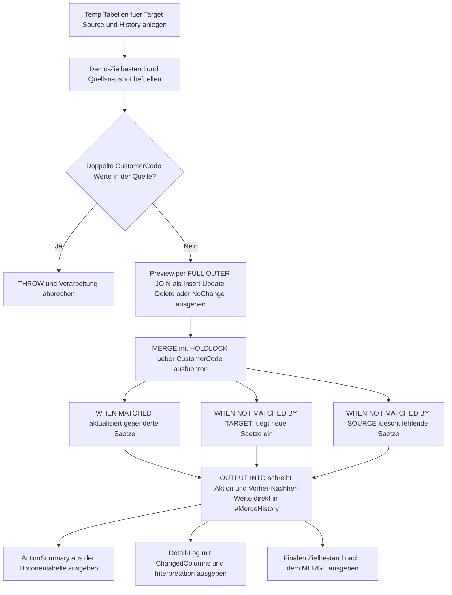

# MergeOutputToHistory.sql

Dieses Skript zeigt ein didaktisches `MERGE`, das seine Aktionen nicht nur ausfuehrt, sondern gleichzeitig per `OUTPUT INTO` direkt in eine Historien- bzw. Delta-Tabelle schreibt. Dadurch werden `INSERT`, `UPDATE` und `DELETE` mit Vorher-Nachher-Werten in einem nachvollziehbaren Change-Log festgehalten.

## Uebersicht

<!-- SQLDOC:SUMMARY_TABLE:BEGIN -->
| Feld | Wert |
|---|---|
| Script | [MergeOutputToHistory.sql](MergeOutputToHistory.sql) |
| Version | `1.0` |
| Typ | `didactic-lab` |
| Kapitel | `13_Merge` |
| Sicherheit | `demo-write-tempdb` |
| Zweck | Protokolliert MERGE-Aktionen direkt ueber `OUTPUT INTO` in eine Historientabelle mit Vorher-Nachher-Werten. |
<!-- SQLDOC:SUMMARY_TABLE:END -->

## Annahmen

- Die Erstversion verwendet ausschliesslich temporaere Demo-Tabellen statt produktiver Ziel-, Stage- oder Historientabellen.
- Die Historientabelle speichert genau die MERGE-Ereignisse eines Beispiel-Batches `NightlySnapshot-2026-04-18`.
- `DELETE` wird bewusst mitgefuehrt, damit die direkte Historisierung aller drei Hauptaktionen in einem Skript sichtbar bleibt.

## Anwendungsfall

Das Skript eignet sich fuer folgende Leitfragen:

- Wie laesst sich ein `MERGE` so bauen, dass die ausgefuehrten Aktionen ohne zweiten Verarbeitungsschritt in ein Delta-Log geschrieben werden?
- Welche Vorher-Nachher-Werte sollten in einer Historientabelle fuer Updates, Inserts und Deletes festgehalten werden?
- Wie kann eine kompakte Change-History pro Batch erzeugt werden, ohne nachtraeglich erneut gegen das Ziel lesen zu muessen?

## Parameter

<!-- SQLDOC:PARAMETERS_TABLE:BEGIN -->
| Parameter | SQL-Typ | Pflicht | Beschreibung |
|---|---|---|---|
| `-` | `-` | `-` | Dieses Demoskript verwendet keine Laufzeitparameter. |
<!-- SQLDOC:PARAMETERS_TABLE:END -->

## Abhaengigkeiten

<!-- SQLDOC:DEPENDENCIES_LIST:BEGIN -->
- `MERGE`
- `OUTPUT $action`
- `FULL OUTER JOIN`
- temporaere Tabellen in `tempdb`
- `THROW`
<!-- SQLDOC:DEPENDENCIES_LIST:END -->

## Hinweise

- `MergeOutputHistoryPreview` zeigt vor dem `MERGE`, ob ein Business Key als `InsertExpected`, `UpdateExpected`, `DeleteExpected` oder `NoChange` in den Lauf geht.
- `MergeOutputHistoryActionSummary` fasst die tatsaechlich in `#MergeHistory` gelandeten Aktionen pro Batch zusammen.
- `MergeOutputHistoryLog` macht die direkt aus dem `MERGE` entstandene Historie mitsamt geaenderten Spalten sichtbar.

## Versionshistorie

<!-- SQLDOC:VERSION_HISTORY_TABLE:BEGIN -->
| Version | Datum | User | Beschreibung |
|---|---|---|---|
| `1.0` | `2026-04-18` | `ER` | Erstversion eines didaktischen MERGE-Beispiels mit direkter History-Protokollierung |
<!-- SQLDOC:VERSION_HISTORY_TABLE:END -->

## Ablauf

<!-- SQLDOC:MERMAID:BEGIN -->

<!-- SQLDOC:MERMAID:END -->

## SQL-Code

<!-- SQLDOC:SQL_CODE:BEGIN -->
```sql
/*
BEGIN:SQL-HEADER v1
---
sql_header: v1
script_name: "MergeOutputToHistory.sql"
script_version: "1.0"
script_type: "didactic-lab"
chapter: "13_Merge"

purpose: >
  Demonstriert, wie die Aktionen eines MERGE per OUTPUT direkt in eine
  Delta- oder Historientabelle geschrieben werden koennen, um Inserts,
  Updates und Deletes samt Vorher-Nachher-Werten nachvollziehbar zu
  protokollieren.

parameters: []

result_sets:
  - name: "MergeOutputHistoryPreview"
    description: "Zeigt vor dem MERGE, welche Business Keys als Insert, Update, Delete oder NoChange erwartet werden"
  - name: "MergeOutputHistoryActionSummary"
    description: "Fasst die tatsaechlich protokollierten MERGE-Aktionen in der Historientabelle zusammen"
  - name: "MergeOutputHistoryLog"
    description: "Zeigt die Historientabelle mit Aktion, Vorher-Nachher-Werten und didaktischer Einordnung"
  - name: "MergeOutputHistoryTargetAfter"
    description: "Zeigt den Zielbestand nach dem MERGE"

dependencies:
  - "MERGE"
  - "OUTPUT $action"
  - "FULL OUTER JOIN"
  - "temporary tables"
  - "THROW"

safety:
  level: "demo-write-tempdb"
  writes_data: false

documentation:
  markdown_file: "T-SQL/13_Merge/SQLScripts/MergeOutputToHistory.md"
  sync_blocks:
    - "SUMMARY_TABLE"
    - "PARAMETERS_TABLE"
    - "DEPENDENCIES_LIST"
    - "VERSION_HISTORY_TABLE"
    - "SQL_CODE"
  mermaid:
    mode: "ai-agent-from-sql"
    source: "script-body"

main_responsible:
  name: "Erhard Rainer"
  initials: "ER"

version_history:
  - version: "1.0"
    date: "2026-04-18"
    user: "ER"
    description: "Erstversion eines didaktischen MERGE-Beispiels mit direkter History-Protokollierung"

notes:
  - "Die Erstversion verwendet ausschliesslich temporaere Demo-Tabellen."
  - "Die Historientabelle wird direkt ueber OUTPUT INTO aus dem MERGE befuellt."
  - "Delete-Pfade werden bewusst mitprotokolliert, damit alle drei Hauptaktionen sichtbar bleiben."
---
END:SQL-HEADER v1
*/

SET NOCOUNT ON;

DECLARE @BatchLabel VARCHAR(30) = 'NightlySnapshot-2026-04-18';

DROP TABLE IF EXISTS #MergeTarget;
DROP TABLE IF EXISTS #MergeSource;
DROP TABLE IF EXISTS #MergeHistory;

CREATE TABLE #MergeTarget
(
    CustomerCode      VARCHAR(10)   NOT NULL PRIMARY KEY,
    CustomerName      VARCHAR(100)  NOT NULL,
    ServiceTier       VARCHAR(20)   NOT NULL,
    CreditLimit       DECIMAL(10,2) NOT NULL,
    TerritoryCode     VARCHAR(10)   NOT NULL,
    LastContactDate   DATE          NOT NULL
);

CREATE TABLE #MergeSource
(
    CustomerCode      VARCHAR(10)   NOT NULL,
    CustomerName      VARCHAR(100)  NOT NULL,
    ServiceTier       VARCHAR(20)   NOT NULL,
    CreditLimit       DECIMAL(10,2) NOT NULL,
    TerritoryCode     VARCHAR(10)   NOT NULL,
    LastContactDate   DATE          NOT NULL
);

CREATE TABLE #MergeHistory
(
    HistoryId             INT IDENTITY(1,1) NOT NULL PRIMARY KEY,
    BatchLabel            VARCHAR(30)       NOT NULL,
    MergeAction           VARCHAR(10)       NOT NULL,
    CustomerCode          VARCHAR(10)       NOT NULL,
    ChangedColumns        VARCHAR(200)      NOT NULL,
    OldCustomerName       VARCHAR(100)      NULL,
    NewCustomerName       VARCHAR(100)      NULL,
    OldServiceTier        VARCHAR(20)       NULL,
    NewServiceTier        VARCHAR(20)       NULL,
    OldCreditLimit        DECIMAL(10,2)     NULL,
    NewCreditLimit        DECIMAL(10,2)     NULL,
    OldTerritoryCode      VARCHAR(10)       NULL,
    NewTerritoryCode      VARCHAR(10)       NULL,
    OldLastContactDate    DATE              NULL,
    NewLastContactDate    DATE              NULL,
    ChangeRecordedAt      DATETIME2(0)      NOT NULL DEFAULT SYSUTCDATETIME()
);

INSERT INTO #MergeTarget
(
    CustomerCode,
    CustomerName,
    ServiceTier,
    CreditLimit,
    TerritoryCode,
    LastContactDate
)
VALUES
    ('C100', 'Alpine Retail',    'standard', 1200.00, 'DACH', '2026-04-05'),
    ('C200', 'Baltic Foods',     'standard',  900.00, 'NORD', '2026-03-30'),
    ('C300', 'City Logistics',   'priority', 1800.00, 'DACH', '2026-04-02'),
    ('C400', 'Delta Services',   'legacy',    650.00, 'WEST', '2026-02-28');

INSERT INTO #MergeSource
(
    CustomerCode,
    CustomerName,
    ServiceTier,
    CreditLimit,
    TerritoryCode,
    LastContactDate
)
VALUES
    ('C100', 'Alpine Retail',      'standard', 1200.00, 'DACH', '2026-04-05'),
    ('C200', 'Baltic Foods GmbH',  'priority', 1250.00, 'NORD', '2026-04-18'),
    ('C300', 'City Logistics',     'priority', 1800.00, 'CENT', '2026-04-10'),
    ('C500', 'Elm Tech',           'new',       700.00, 'SOUTH', '2026-04-18');

IF EXISTS
(
    SELECT
        s.CustomerCode
    FROM #MergeSource AS s
    GROUP BY
        s.CustomerCode
    HAVING COUNT(*) > 1
)
BEGIN
    THROW 50051, 'MergeOutputToHistory detected duplicate CustomerCode values in #MergeSource.', 1;
END;

SELECT
    COALESCE(src.CustomerCode, tgt.CustomerCode) AS CustomerCode,
    CASE
        WHEN tgt.CustomerCode IS NULL THEN 'InsertExpected'
        WHEN src.CustomerCode IS NULL THEN 'DeleteExpected'
        WHEN
            src.CustomerName <> tgt.CustomerName
            OR src.ServiceTier <> tgt.ServiceTier
            OR src.CreditLimit <> tgt.CreditLimit
            OR src.TerritoryCode <> tgt.TerritoryCode
            OR src.LastContactDate <> tgt.LastContactDate
            THEN 'UpdateExpected'
        ELSE 'NoChange'
    END AS ExpectedAction,
    tgt.CustomerName AS TargetCustomerName,
    src.CustomerName AS SourceCustomerName,
    tgt.ServiceTier AS TargetServiceTier,
    src.ServiceTier AS SourceServiceTier,
    tgt.CreditLimit AS TargetCreditLimit,
    src.CreditLimit AS SourceCreditLimit,
    tgt.TerritoryCode AS TargetTerritoryCode,
    src.TerritoryCode AS SourceTerritoryCode,
    tgt.LastContactDate AS TargetLastContactDate,
    src.LastContactDate AS SourceLastContactDate
FROM #MergeSource AS src
FULL OUTER JOIN #MergeTarget AS tgt
    ON tgt.CustomerCode = src.CustomerCode
ORDER BY
    CustomerCode;

MERGE INTO #MergeTarget WITH (HOLDLOCK) AS tgt
USING #MergeSource AS src
    ON tgt.CustomerCode = src.CustomerCode
WHEN MATCHED
 AND
 (
    tgt.CustomerName <> src.CustomerName
    OR tgt.ServiceTier <> src.ServiceTier
    OR tgt.CreditLimit <> src.CreditLimit
    OR tgt.TerritoryCode <> src.TerritoryCode
    OR tgt.LastContactDate <> src.LastContactDate
 )
    THEN UPDATE SET
        tgt.CustomerName = src.CustomerName,
        tgt.ServiceTier = src.ServiceTier,
        tgt.CreditLimit = src.CreditLimit,
        tgt.TerritoryCode = src.TerritoryCode,
        tgt.LastContactDate = src.LastContactDate
WHEN NOT MATCHED BY TARGET
    THEN INSERT
    (
        CustomerCode,
        CustomerName,
        ServiceTier,
        CreditLimit,
        TerritoryCode,
        LastContactDate
    )
    VALUES
    (
        src.CustomerCode,
        src.CustomerName,
        src.ServiceTier,
        src.CreditLimit,
        src.TerritoryCode,
        src.LastContactDate
    )
WHEN NOT MATCHED BY SOURCE
    THEN DELETE
OUTPUT
    @BatchLabel,
    $action,
    COALESCE(inserted.CustomerCode, deleted.CustomerCode),
    CASE
        WHEN $action = 'INSERT' THEN 'AllColumns'
        WHEN $action = 'DELETE' THEN 'TargetRowRemoved'
        ELSE
            STUFF(
                CONCAT(
                    CASE WHEN ISNULL(inserted.CustomerName, '') <> ISNULL(deleted.CustomerName, '') THEN ', CustomerName' ELSE '' END,
                    CASE WHEN ISNULL(inserted.ServiceTier, '') <> ISNULL(deleted.ServiceTier, '') THEN ', ServiceTier' ELSE '' END,
                    CASE WHEN ISNULL(inserted.CreditLimit, -1.00) <> ISNULL(deleted.CreditLimit, -1.00) THEN ', CreditLimit' ELSE '' END,
                    CASE WHEN ISNULL(inserted.TerritoryCode, '') <> ISNULL(deleted.TerritoryCode, '') THEN ', TerritoryCode' ELSE '' END,
                    CASE WHEN ISNULL(CONVERT(VARCHAR(10), inserted.LastContactDate, 23), '') <> ISNULL(CONVERT(VARCHAR(10), deleted.LastContactDate, 23), '') THEN ', LastContactDate' ELSE '' END
                ),
                1,
                2,
                ''
            )
    END,
    deleted.CustomerName,
    inserted.CustomerName,
    deleted.ServiceTier,
    inserted.ServiceTier,
    deleted.CreditLimit,
    inserted.CreditLimit,
    deleted.TerritoryCode,
    inserted.TerritoryCode,
    deleted.LastContactDate,
    inserted.LastContactDate,
    SYSUTCDATETIME()
INTO #MergeHistory
(
    BatchLabel,
    MergeAction,
    CustomerCode,
    ChangedColumns,
    OldCustomerName,
    NewCustomerName,
    OldServiceTier,
    NewServiceTier,
    OldCreditLimit,
    NewCreditLimit,
    OldTerritoryCode,
    NewTerritoryCode,
    OldLastContactDate,
    NewLastContactDate,
    ChangeRecordedAt
);

SELECT
    h.MergeAction,
    COUNT(*) AS ActionCount,
    STRING_AGG(h.CustomerCode, ', ') WITHIN GROUP (ORDER BY h.CustomerCode) AS CustomerCodes
FROM #MergeHistory AS h
GROUP BY
    h.MergeAction
ORDER BY
    CASE h.MergeAction
        WHEN 'UPDATE' THEN 1
        WHEN 'INSERT' THEN 2
        WHEN 'DELETE' THEN 3
        ELSE 4
    END;

SELECT
    h.HistoryId,
    h.BatchLabel,
    h.MergeAction,
    h.CustomerCode,
    h.ChangedColumns,
    h.OldCustomerName,
    h.NewCustomerName,
    h.OldServiceTier,
    h.NewServiceTier,
    h.OldCreditLimit,
    h.NewCreditLimit,
    h.OldTerritoryCode,
    h.NewTerritoryCode,
    h.OldLastContactDate,
    h.NewLastContactDate,
    h.ChangeRecordedAt,
    CASE
        WHEN h.MergeAction = 'UPDATE' THEN 'Bestehender Satz wurde geaendert und direkt historisiert.'
        WHEN h.MergeAction = 'INSERT' THEN 'Neuer Business Key wurde eingefuegt und im Delta-Log festgehalten.'
        WHEN h.MergeAction = 'DELETE' THEN 'Nicht mehr gelieferter Business Key wurde entfernt und historisiert.'
        ELSE 'Ungeplanter Fall.'
    END AS HistoryInterpretation
FROM #MergeHistory AS h
ORDER BY
    h.HistoryId;

SELECT
    tgt.CustomerCode,
    tgt.CustomerName,
    tgt.ServiceTier,
    tgt.CreditLimit,
    tgt.TerritoryCode,
    tgt.LastContactDate
FROM #MergeTarget AS tgt
ORDER BY
    tgt.CustomerCode;
```
<!-- SQLDOC:SQL_CODE:END -->
