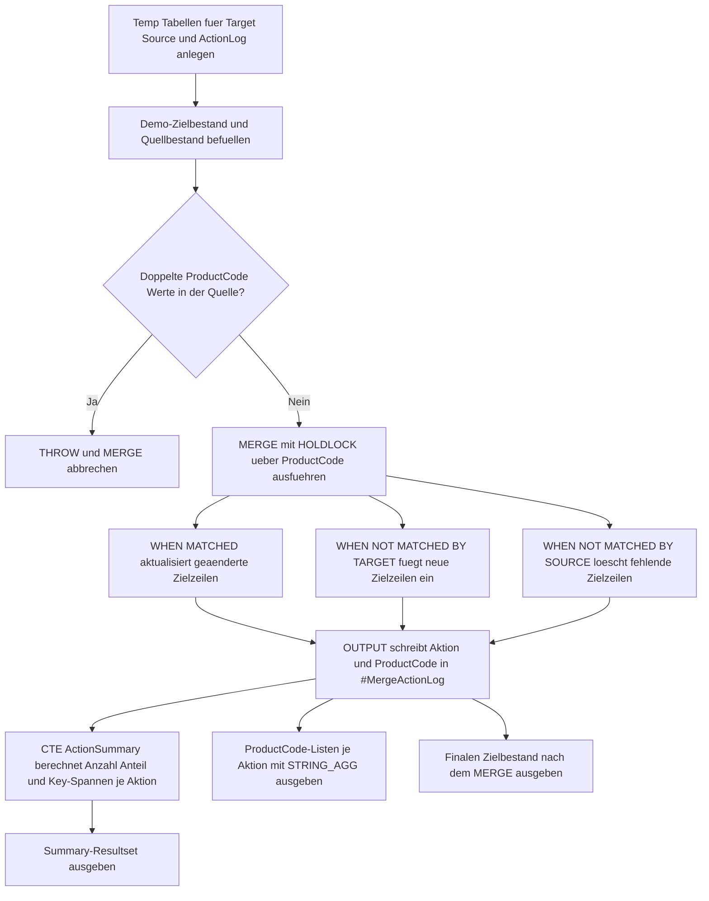

# MergePostActionSummary.sql

Dieses Skript demonstriert ein didaktisches `MERGE`, das seine tatsaechlich ausgefuehrten Aktionen zuerst in einer kompakten Log-Tabelle sammelt und danach eine Nachher-Zusammenfassung fuer `UPDATE`, `INSERT` und `DELETE` erzeugt. Die Demo bleibt auf temporaere Tabellen begrenzt und eignet sich damit fuer Schulung, Review und Ergebnisinterpretation nach einem `MERGE`.

## Uebersicht

<!-- SQLDOC:SUMMARY_TABLE:BEGIN -->
| Feld | Wert |
|---|---|
| Script | [MergePostActionSummary.sql](MergePostActionSummary.sql) |
| Version | `1.0` |
| Typ | `didactic-lab` |
| Kapitel | `13_Merge` |
| Sicherheit | `demo-write-tempdb` |
| Zweck | Fasst die real ausgefuehrten `MERGE`-Aktionen nach dem Lauf als kompakte Nachher-Sicht zusammen. |
<!-- SQLDOC:SUMMARY_TABLE:END -->

## Annahmen

- Die Erstversion arbeitet ausschliesslich mit temporaeren Demo-Tabellen statt mit produktiven Produkt- oder Stage-Tabellen.
- Die Zusammenfassung wird erst nach dem `MERGE` aus den real protokollierten Aktionen berechnet und nicht aus einer Vorhersage.
- `DELETE` wird bewusst mitgefuehrt, damit alle drei Hauptaktionen in derselben Nachher-Auswertung sichtbar werden.

## Anwendungsfall

Das Skript eignet sich fuer folgende Leitfragen:

- Wie laesst sich nach einem `MERGE` schnell erkennen, wie viele `UPDATE`-, `INSERT`- und `DELETE`-Aktionen wirklich stattgefunden haben?
- Welche Business Keys gehoeren zu welcher Aktionsart, ohne ein umfangreiches Detail-Audit aufbauen zu muessen?
- Wie kann eine kompakte Nachher-Sicht fuer Review, Testfaelle oder Schulungszwecke erzeugt werden?

## Parameter

<!-- SQLDOC:PARAMETERS_TABLE:BEGIN -->
| Parameter | SQL-Typ | Pflicht | Beschreibung |
|---|---|---|---|
| `-` | `-` | `-` | Dieses Demoskript verwendet keine Laufzeitparameter. |
<!-- SQLDOC:PARAMETERS_TABLE:END -->

## Abhaengigkeiten

<!-- SQLDOC:DEPENDENCIES_LIST:BEGIN -->
- `MERGE`
- `OUTPUT $action`
- `STRING_AGG`
- temporaere Tabellen in `tempdb`
- `THROW`
<!-- SQLDOC:DEPENDENCIES_LIST:END -->

## Hinweise

- `MergePostActionSummary` zeigt Anzahl, prozentualen Anteil sowie den ersten und letzten betroffenen Business Key je Aktion.
- `MergePostActionKeyRanges` fasst die betroffenen `ProductCode`-Werte je Aktion als kompakte Liste zusammen.
- `MergePostActionTargetAfter` zeigt den finalen Zielbestand nach dem `MERGE`.

## Versionshistorie

<!-- SQLDOC:VERSION_HISTORY_TABLE:BEGIN -->
| Version | Datum | User | Beschreibung |
|---|---|---|---|
| `1.0` | `2026-04-18` | `ER` | Erstversion eines didaktischen MERGE-Skripts mit Nachher-Zusammenfassung der Aktionen |
<!-- SQLDOC:VERSION_HISTORY_TABLE:END -->

## Ablauf

<!-- SQLDOC:MERMAID:BEGIN -->

<!-- SQLDOC:MERMAID:END -->

## SQL-Code

<!-- SQLDOC:SQL_CODE:BEGIN -->
```sql
/*
BEGIN:SQL-HEADER v1
---
sql_header: v1
script_name: "MergePostActionSummary.sql"
script_version: "1.0"
script_type: "didactic-lab"
chapter: "13_Merge"

purpose: >
  Demonstriert ein didaktisches MERGE, das seine tatsaechlichen Aktionen
  ueber OUTPUT $action in einer kompakten Log-Tabelle sammelt und danach
  eine Nachher-Zusammenfassung fuer INSERT, UPDATE und DELETE erzeugt.

parameters: []

result_sets:
  - name: "MergePostActionSummary"
    description: "Fasst MERGE-Aktionen nach Aktionstyp, Anteil und betroffenen Business Keys zusammen"
  - name: "MergePostActionKeyRanges"
    description: "Zeigt je Aktion geordnete Business Keys und eine didaktische Einordnung"
  - name: "MergePostActionTargetAfter"
    description: "Zeigt den finalen Zielbestand nach dem MERGE"

dependencies:
  - "MERGE"
  - "OUTPUT $action"
  - "STRING_AGG"
  - "temporary tables"
  - "THROW"

safety:
  level: "demo-write-tempdb"
  writes_data: false

documentation:
  markdown_file: "T-SQL/13_Merge/SQLScripts/MergePostActionSummary.md"
  sync_blocks:
    - "SUMMARY_TABLE"
    - "PARAMETERS_TABLE"
    - "DEPENDENCIES_LIST"
    - "VERSION_HISTORY_TABLE"
    - "SQL_CODE"
  mermaid:
    mode: "ai-agent-from-sql"
    source: "script-body"

main_responsible:
  name: "Erhard Rainer"
  initials: "ER"

version_history:
  - version: "1.0"
    date: "2026-04-18"
    user: "ER"
    description: "Erstversion eines didaktischen MERGE-Skripts mit Nachher-Zusammenfassung der Aktionen"

notes:
  - "Die Erstversion arbeitet ausschliesslich mit temporaeren Demo-Tabellen."
  - "Die Zusammenfassung entsteht erst nach dem MERGE aus den real protokollierten Aktionen."
  - "Ein Guardrail blockiert doppelte Business Keys in der Quelle vor dem MERGE."
---
END:SQL-HEADER v1
*/

SET NOCOUNT ON;

DROP TABLE IF EXISTS #MergeTarget;
DROP TABLE IF EXISTS #MergeSource;
DROP TABLE IF EXISTS #MergeActionLog;

CREATE TABLE #MergeTarget
(
    ProductCode      VARCHAR(10)   NOT NULL PRIMARY KEY,
    ProductName      VARCHAR(100)  NOT NULL,
    CategoryLabel    VARCHAR(30)   NOT NULL,
    UnitPrice        DECIMAL(10,2) NOT NULL,
    IsDiscontinued   BIT           NOT NULL
);

CREATE TABLE #MergeSource
(
    ProductCode      VARCHAR(10)   NOT NULL,
    ProductName      VARCHAR(100)  NOT NULL,
    CategoryLabel    VARCHAR(30)   NOT NULL,
    UnitPrice        DECIMAL(10,2) NOT NULL,
    IsDiscontinued   BIT           NOT NULL
);

CREATE TABLE #MergeActionLog
(
    ActionId         INT IDENTITY(1,1) NOT NULL PRIMARY KEY,
    MergeAction      VARCHAR(10)       NOT NULL,
    ProductCode      VARCHAR(10)       NOT NULL
);

INSERT INTO #MergeTarget
(
    ProductCode,
    ProductName,
    CategoryLabel,
    UnitPrice,
    IsDiscontinued
)
VALUES
    ('P100', 'Keyboard Compact', 'Input',     39.90, 0),
    ('P200', 'Mouse Wireless',   'Input',     24.50, 0),
    ('P300', 'Dock Station',     'Accessory', 89.00, 0),
    ('P400', 'Legacy Webcam',    'Video',     49.90, 1);

INSERT INTO #MergeSource
(
    ProductCode,
    ProductName,
    CategoryLabel,
    UnitPrice,
    IsDiscontinued
)
VALUES
    ('P100', 'Keyboard Compact', 'Input',      39.90, 0),
    ('P200', 'Mouse Wireless',   'Input',      27.90, 0),
    ('P300', 'Dock Station Pro', 'Accessory',  99.00, 0),
    ('P500', 'Headset USB-C',    'Audio',      59.90, 0);

IF EXISTS
(
    SELECT
        s.ProductCode
    FROM #MergeSource AS s
    GROUP BY
        s.ProductCode
    HAVING COUNT(*) > 1
)
BEGIN
    THROW 50061, 'MergePostActionSummary detected duplicate ProductCode values in #MergeSource.', 1;
END;

MERGE INTO #MergeTarget WITH (HOLDLOCK) AS tgt
USING #MergeSource AS src
    ON tgt.ProductCode = src.ProductCode
WHEN MATCHED
 AND
 (
    tgt.ProductName <> src.ProductName
    OR tgt.CategoryLabel <> src.CategoryLabel
    OR tgt.UnitPrice <> src.UnitPrice
    OR tgt.IsDiscontinued <> src.IsDiscontinued
 )
    THEN
        UPDATE SET
            tgt.ProductName = src.ProductName,
            tgt.CategoryLabel = src.CategoryLabel,
            tgt.UnitPrice = src.UnitPrice,
            tgt.IsDiscontinued = src.IsDiscontinued
WHEN NOT MATCHED BY TARGET
    THEN
        INSERT
        (
            ProductCode,
            ProductName,
            CategoryLabel,
            UnitPrice,
            IsDiscontinued
        )
        VALUES
        (
            src.ProductCode,
            src.ProductName,
            src.CategoryLabel,
            src.UnitPrice,
            src.IsDiscontinued
        )
WHEN NOT MATCHED BY SOURCE
    THEN DELETE
OUTPUT
    $action,
    COALESCE(inserted.ProductCode, deleted.ProductCode)
INTO #MergeActionLog
(
    MergeAction,
    ProductCode
);

WITH ActionSummary AS
(
    SELECT
        l.MergeAction,
        COUNT(*) AS ActionCount,
        CAST(100.0 * COUNT(*) / NULLIF((SELECT COUNT(*) FROM #MergeActionLog), 0) AS DECIMAL(5,2)) AS ActionSharePercent,
        MIN(l.ProductCode) AS FirstProductCode,
        MAX(l.ProductCode) AS LastProductCode
    FROM #MergeActionLog AS l
    GROUP BY
        l.MergeAction
)
SELECT
    s.MergeAction,
    s.ActionCount,
    s.ActionSharePercent,
    s.FirstProductCode,
    s.LastProductCode,
    CASE
        WHEN s.MergeAction = 'UPDATE' THEN 'Bestehende Zielzeilen wurden geaendert.'
        WHEN s.MergeAction = 'INSERT' THEN 'Neue Zeilen wurden in das Ziel uebernommen.'
        WHEN s.MergeAction = 'DELETE' THEN 'Zielzeilen ohne Quellenmatch wurden entfernt.'
        ELSE 'Unbekannte Aktion.'
    END AS SummaryInterpretation
FROM ActionSummary AS s
ORDER BY
    CASE s.MergeAction
        WHEN 'UPDATE' THEN 1
        WHEN 'INSERT' THEN 2
        WHEN 'DELETE' THEN 3
        ELSE 4
    END;

SELECT
    l.MergeAction,
    STRING_AGG(l.ProductCode, ', ') WITHIN GROUP (ORDER BY l.ProductCode) AS ProductCodes,
    COUNT(*) AS ActionCount,
    CASE
        WHEN l.MergeAction = 'UPDATE' THEN 'Diese Business Keys waren bereits vorhanden, aber fachlich veraendert.'
        WHEN l.MergeAction = 'INSERT' THEN 'Diese Business Keys fehlten im Ziel und wurden neu angelegt.'
        WHEN l.MergeAction = 'DELETE' THEN 'Diese Business Keys waren nur noch im Ziel vorhanden und wurden geloescht.'
        ELSE 'Unbekannte Einordnung.'
    END AS ActionInterpretation
FROM #MergeActionLog AS l
GROUP BY
    l.MergeAction
ORDER BY
    CASE l.MergeAction
        WHEN 'UPDATE' THEN 1
        WHEN 'INSERT' THEN 2
        WHEN 'DELETE' THEN 3
        ELSE 4
    END;

SELECT
    tgt.ProductCode,
    tgt.ProductName,
    tgt.CategoryLabel,
    tgt.UnitPrice,
    tgt.IsDiscontinued
FROM #MergeTarget AS tgt
ORDER BY
    tgt.ProductCode;
```
<!-- SQLDOC:SQL_CODE:END -->
