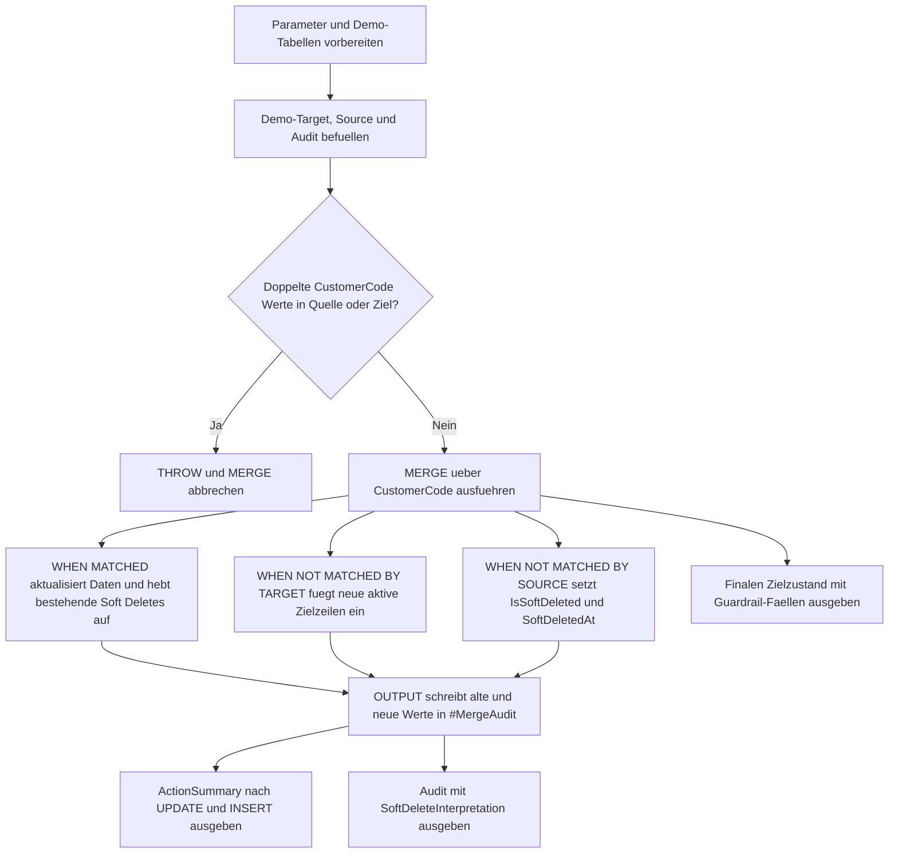

# MergeSoftDeletePattern.sql

Dieses Skript demonstriert ein `MERGE`-Muster, bei dem fehlende Quelltreffer nicht mit `DELETE`, sondern per `UPDATE` als soft deleted markiert werden. Die Demo zeigt zugleich, wie bereits soft geloeschte Zeilen bei einem erneuten Quelltreffer reaktiviert und wie nicht soft-delete-faehige Zielzeilen per Guardrail ausgenommen werden.

## Uebersicht

<!-- SQLDOC:SUMMARY_TABLE:BEGIN -->
| Feld | Wert |
|---|---|
| Script | [MergeSoftDeletePattern.sql](MergeSoftDeletePattern.sql) |
| Version | `1.0` |
| Typ | `didactic-lab` |
| Kapitel | `13_Merge` |
| Sicherheit | `demo-write-tempdb` |
| Zweck | Demonstriert ein `MERGE`, das fehlende Quelltreffer per Soft Delete markiert und Rueckkehrer reaktiviert. |
<!-- SQLDOC:SUMMARY_TABLE:END -->

## Annahmen

- Die Erstversion arbeitet ausschliesslich mit temporaeren Demo-Tabellen in `tempdb`.
- Das Muster zeigt einen echten `MERGE` auf Demo-Daten, aber keine persistenten Aenderungen an fachlichen Tabellen.
- `AllowSoftDelete` modelliert eine Guardrail-Entscheidung, damit einzelne Zielzeilen trotz fehlender Quelle aktiv bleiben duerfen.

## Anwendungsfall

Das Skript eignet sich fuer Review-Fragen wie:

- Wie laesst sich `WHEN NOT MATCHED BY SOURCE` in ein reversibles Soft-Delete-Muster ueberfuehren?
- Wie werden Rueckkehrer aus einer spaeteren Quelle wieder sauber aktiviert?
- Welche Zeilen muessen per Guardrail von einem Soft Delete ausgenommen bleiben?

## Parameter

<!-- SQLDOC:PARAMETERS_TABLE:BEGIN -->
| Parameter | SQL-Typ | Pflicht | Beschreibung |
|---|---|---|---|
| `@SnapshotDate` | `date` | nein | Snapshot-Stichtag fuer Reaktivierung und Soft Delete. |
| `@SoftDeleteReason` | `nvarchar(120)` | nein | Standardgrund fuer die Soft-Delete-Markierung bei fehlendem Quelltreffer. |
<!-- SQLDOC:PARAMETERS_TABLE:END -->

## Abhaengigkeiten

<!-- SQLDOC:DEPENDENCIES_LIST:BEGIN -->
- temporaere Tabellen in `tempdb`
- `MERGE`
- `OUTPUT`
- `CASE`
<!-- SQLDOC:DEPENDENCIES_LIST:END -->

## Hinweise

- `MergeSoftDeleteActionSummary` verdichtet, wie viele Zeilen aktualisiert, neu eingefuegt oder per Soft Delete markiert wurden.
- `MergeSoftDeleteAudit` zeigt je betroffenem Datensatz den Uebergang zwischen altem und neuem Soft-Delete-Status.
- `MergeSoftDeleteTargetState` macht sichtbar, welche Zielzeilen aktiv bleiben, reaktiviert wurden oder aufgrund eines Guardrails nicht soft deleted werden.

## Versionshistorie

<!-- SQLDOC:VERSION_HISTORY_TABLE:BEGIN -->
| Version | Datum | User | Beschreibung |
|---|---|---|---|
| `1.0` | `2026-04-18` | `ER` | Erstversion eines didaktischen MERGE-Soft-Delete-Musters |
<!-- SQLDOC:VERSION_HISTORY_TABLE:END -->

## Ablauf

<!-- SQLDOC:MERMAID:BEGIN -->

<!-- SQLDOC:MERMAID:END -->

## SQL-Code

<!-- SQLDOC:SQL_CODE:BEGIN -->
```sql
/*
BEGIN:SQL-HEADER v1
---
sql_header: v1
script_name: "MergeSoftDeletePattern.sql"
script_version: "1.0"
script_type: "didactic-lab"
chapter: "13_Merge"

purpose: >
  Demonstriert ein MERGE-Muster, das fehlende Zielzeilen nicht physisch
  loescht, sondern bei ausbleibendem Quelltreffer per UPDATE als soft
  deleted markiert. Das Skript zeigt Guardrails, Reaktivierung bei
  Wiederauftauchen in der Quelle und ein OUTPUT-basiertes Audit.

parameters:
  - name: "@SnapshotDate"
    sql_type: "date"
    direction: "IN"
    required: false
    description: "Stichtag des Quell-Snapshots fuer Reaktivierung und Soft Delete"
  - name: "@SoftDeleteReason"
    sql_type: "nvarchar(120)"
    direction: "IN"
    required: false
    description: "Didaktischer Standardgrund fuer das Setzen des Soft-Delete-Status"

result_sets:
  - name: "MergeSoftDeleteActionSummary"
    description: "Verdichtet MERGE-Aktionen nach Update, Insert und Soft Delete"
  - name: "MergeSoftDeleteAudit"
    description: "Zeigt pro betroffenem Datensatz die alte und neue Soft-Delete-Markierung"
  - name: "MergeSoftDeleteTargetState"
    description: "Zeigt den finalen Zustand der Demo-Zieltabelle nach dem MERGE"

dependencies:
  - "temporary tables"
  - "MERGE"
  - "OUTPUT"
  - "CASE"

safety:
  level: "demo-write-tempdb"
  writes_data: false

documentation:
  markdown_file: "T-SQL/13_Merge/SQLScripts/MergeSoftDeletePattern.md"
  sync_blocks:
    - "SUMMARY_TABLE"
    - "PARAMETERS_TABLE"
    - "DEPENDENCIES_LIST"
    - "VERSION_HISTORY_TABLE"
    - "SQL_CODE"
  mermaid:
    mode: "ai-agent-from-sql"
    source: "script-body"

main_responsible:
  name: "Erhard Rainer"
  initials: "ER"

version_history:
  - version: "1.0"
    date: "2026-04-18"
    user: "ER"
    description: "Erstversion eines didaktischen MERGE-Soft-Delete-Musters"

notes:
  - "Die Erstversion arbeitet nur mit temporaeren Demo-Tabellen in tempdb."
  - "Fehlende Quelltreffer werden per UPDATE soft deleted statt physisch geloescht."
  - "Nicht soft-delete-faehige Zielzeilen bleiben bewusst unveraendert und werden nach dem MERGE separat sichtbar gemacht."
---
END:SQL-HEADER v1
*/

SET NOCOUNT ON;

DECLARE @SnapshotDate DATE = CAST('2026-04-18' AS DATE);
DECLARE @SoftDeleteReason NVARCHAR(120) = N'Missing from source snapshot';

DROP TABLE IF EXISTS #MergeTarget;
DROP TABLE IF EXISTS #MergeSource;
DROP TABLE IF EXISTS #MergeAudit;

CREATE TABLE #MergeTarget
(
    CustomerCode       VARCHAR(10)    NOT NULL PRIMARY KEY,
    CustomerName       VARCHAR(100)   NOT NULL,
    SegmentLabel       VARCHAR(20)    NOT NULL,
    CreditStatus       VARCHAR(20)    NOT NULL,
    AllowSoftDelete    BIT            NOT NULL,
    IsSoftDeleted      BIT            NOT NULL,
    SoftDeletedAt      DATE           NULL,
    SoftDeleteReason   NVARCHAR(120)  NULL,
    LastSeenInSource   DATE           NOT NULL,
    LastChangedAt      DATETIME2(0)   NOT NULL
);

CREATE TABLE #MergeSource
(
    CustomerCode       VARCHAR(10)   NOT NULL,
    CustomerName       VARCHAR(100)  NOT NULL,
    SegmentLabel       VARCHAR(20)   NOT NULL,
    CreditStatus       VARCHAR(20)   NOT NULL,
    SnapshotDate       DATE          NOT NULL
);

CREATE TABLE #MergeAudit
(
    MergeAction             NVARCHAR(10)   NOT NULL,
    CustomerCode            VARCHAR(10)    NOT NULL,
    OldIsSoftDeleted        BIT            NULL,
    NewIsSoftDeleted        BIT            NULL,
    OldSoftDeletedAt        DATE           NULL,
    NewSoftDeletedAt        DATE           NULL,
    OldSoftDeleteReason     NVARCHAR(120)  NULL,
    NewSoftDeleteReason     NVARCHAR(120)  NULL,
    OldLastSeenInSource     DATE           NULL,
    NewLastSeenInSource     DATE           NULL
);

INSERT INTO #MergeTarget
(
    CustomerCode,
    CustomerName,
    SegmentLabel,
    CreditStatus,
    AllowSoftDelete,
    IsSoftDeleted,
    SoftDeletedAt,
    SoftDeleteReason,
    LastSeenInSource,
    LastChangedAt
)
VALUES
    ('C001', 'Alpine Retail',     'standard', 'Green', 1, 0, NULL, NULL,                   '2026-04-17', '2026-04-17T08:15:00'),
    ('C002', 'Baltic Foods GmbH', 'priority', 'Amber', 1, 0, NULL, NULL,                   '2026-04-18', '2026-04-18T06:40:00'),
    ('C003', 'City Logistics',    'vip',      'Green', 0, 0, NULL, NULL,                   '2026-04-11', '2026-04-11T12:00:00'),
    ('C004', 'Delta Services',    'legacy',   'Red',   1, 1, '2026-04-10', N'Older gap',   '2026-04-10', '2026-04-10T09:30:00'),
    ('C005', 'Elm Tech',          'new',      'Green', 1, 0, NULL, NULL,                   '2026-04-15', '2026-04-15T07:20:00');

INSERT INTO #MergeSource
(
    CustomerCode,
    CustomerName,
    SegmentLabel,
    CreditStatus,
    SnapshotDate
)
VALUES
    ('C001', 'Alpine Retail',     'standard', 'Green', @SnapshotDate),
    ('C002', 'Baltic Foods GmbH', 'priority', 'Green', @SnapshotDate),
    ('C004', 'Delta Services',    'legacy',   'Amber', @SnapshotDate),
    ('C006', 'Foxtrot Health',    'vip',      'Green', @SnapshotDate);

IF EXISTS
(
    SELECT
        src.CustomerCode
    FROM #MergeSource AS src
    GROUP BY
        src.CustomerCode
    HAVING COUNT(*) > 1
)
BEGIN
    THROW 50051, 'MergeSoftDeletePattern detected duplicate CustomerCode values in #MergeSource.', 1;
END;

IF EXISTS
(
    SELECT
        tgt.CustomerCode
    FROM #MergeTarget AS tgt
    GROUP BY
        tgt.CustomerCode
    HAVING COUNT(*) > 1
)
BEGIN
    THROW 50052, 'MergeSoftDeletePattern detected duplicate CustomerCode values in #MergeTarget.', 1;
END;

MERGE #MergeTarget AS tgt
USING #MergeSource AS src
    ON src.CustomerCode = tgt.CustomerCode
WHEN MATCHED THEN
    UPDATE SET
        tgt.CustomerName = src.CustomerName,
        tgt.SegmentLabel = src.SegmentLabel,
        tgt.CreditStatus = src.CreditStatus,
        tgt.IsSoftDeleted = 0,
        tgt.SoftDeletedAt = NULL,
        tgt.SoftDeleteReason = NULL,
        tgt.LastSeenInSource = src.SnapshotDate,
        tgt.LastChangedAt = SYSUTCDATETIME()
WHEN NOT MATCHED BY TARGET THEN
    INSERT
    (
        CustomerCode,
        CustomerName,
        SegmentLabel,
        CreditStatus,
        AllowSoftDelete,
        IsSoftDeleted,
        SoftDeletedAt,
        SoftDeleteReason,
        LastSeenInSource,
        LastChangedAt
    )
    VALUES
    (
        src.CustomerCode,
        src.CustomerName,
        src.SegmentLabel,
        src.CreditStatus,
        1,
        0,
        NULL,
        NULL,
        src.SnapshotDate,
        SYSUTCDATETIME()
    )
WHEN NOT MATCHED BY SOURCE AND tgt.AllowSoftDelete = 1 AND tgt.IsSoftDeleted = 0 THEN
    UPDATE SET
        tgt.IsSoftDeleted = 1,
        tgt.SoftDeletedAt = @SnapshotDate,
        tgt.SoftDeleteReason = @SoftDeleteReason,
        tgt.LastChangedAt = SYSUTCDATETIME()
OUTPUT
    $action,
    COALESCE(inserted.CustomerCode, deleted.CustomerCode),
    deleted.IsSoftDeleted,
    inserted.IsSoftDeleted,
    deleted.SoftDeletedAt,
    inserted.SoftDeletedAt,
    deleted.SoftDeleteReason,
    inserted.SoftDeleteReason,
    deleted.LastSeenInSource,
    inserted.LastSeenInSource
INTO #MergeAudit
(
    MergeAction,
    CustomerCode,
    OldIsSoftDeleted,
    NewIsSoftDeleted,
    OldSoftDeletedAt,
    NewSoftDeletedAt,
    OldSoftDeleteReason,
    NewSoftDeleteReason,
    OldLastSeenInSource,
    NewLastSeenInSource
);

;WITH ActionSummary AS
(
    SELECT
        audit.MergeAction,
        COUNT(*) AS AffectedRows,
        SUM(CASE WHEN audit.OldIsSoftDeleted = 0 AND audit.NewIsSoftDeleted = 1 THEN 1 ELSE 0 END) AS SoftDeleteRows,
        SUM(CASE WHEN audit.OldIsSoftDeleted = 1 AND audit.NewIsSoftDeleted = 0 THEN 1 ELSE 0 END) AS ReactivatedRows,
        STRING_AGG(audit.CustomerCode, ', ') WITHIN GROUP (ORDER BY audit.CustomerCode) AS CustomerCodes
    FROM #MergeAudit AS audit
    GROUP BY
        audit.MergeAction
)
SELECT
    summary.MergeAction,
    summary.AffectedRows,
    summary.SoftDeleteRows,
    summary.ReactivatedRows,
    summary.CustomerCodes
FROM ActionSummary AS summary
ORDER BY
    CASE summary.MergeAction
        WHEN 'UPDATE' THEN 1
        WHEN 'INSERT' THEN 2
        ELSE 3
    END;

SELECT
    audit.MergeAction,
    audit.CustomerCode,
    audit.OldIsSoftDeleted,
    audit.NewIsSoftDeleted,
    audit.OldSoftDeletedAt,
    audit.NewSoftDeletedAt,
    audit.OldSoftDeleteReason,
    audit.NewSoftDeleteReason,
    audit.OldLastSeenInSource,
    audit.NewLastSeenInSource,
    CASE
        WHEN audit.OldIsSoftDeleted = 0 AND audit.NewIsSoftDeleted = 1 THEN 'Soft delete applied because the row is missing from the current source snapshot.'
        WHEN audit.OldIsSoftDeleted = 1 AND audit.NewIsSoftDeleted = 0 THEN 'Row was reactivated because it reappeared in the source snapshot.'
        WHEN audit.MergeAction = 'INSERT' THEN 'New business key inserted as an active target row.'
        ELSE 'Matched row refreshed without changing the soft-delete status.'
    END AS SoftDeleteInterpretation
FROM #MergeAudit AS audit
ORDER BY
    CASE audit.MergeAction
        WHEN 'UPDATE' THEN 1
        WHEN 'INSERT' THEN 2
        ELSE 3
    END,
    audit.CustomerCode;

SELECT
    tgt.CustomerCode,
    tgt.CustomerName,
    tgt.SegmentLabel,
    tgt.CreditStatus,
    tgt.AllowSoftDelete,
    tgt.IsSoftDeleted,
    tgt.SoftDeletedAt,
    tgt.SoftDeleteReason,
    tgt.LastSeenInSource,
    CASE
        WHEN tgt.IsSoftDeleted = 1 THEN 'Inactive via soft delete'
        WHEN tgt.AllowSoftDelete = 0 AND tgt.CustomerCode NOT IN (SELECT src.CustomerCode FROM #MergeSource AS src) THEN 'Missing in source but guardrail keeps row active'
        ELSE 'Active after merge'
    END AS FinalStateLabel
FROM #MergeTarget AS tgt
ORDER BY
    tgt.CustomerCode;
```
<!-- SQLDOC:SQL_CODE:END -->
